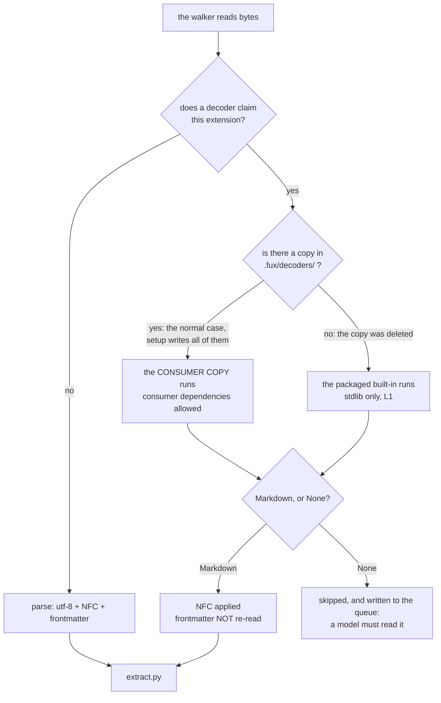

# ADR-DECODE — bytes become Markdown in one place

## §1 — For humans

Fux indexed six plain-text extensions and nothing else. The corpus it is pitched
at is mostly PDFs, decks, spreadsheets, wiki HTML and mail.

⚠ **The awkward part: it already owned an HTML decoder.** It sat inside
`.fux/fetchers/http.py`, and a second copy sat inside `cdp.py` with a comment
saying *"Kept identical to…"*. `http.py`'s docstring stated the consequence as a
rule it had no way to enforce:

> Both fetchers must produce the same markdown from the same bytes, or which
> fetcher retrieved a document would change the committed index.

**That is L3 demoted to a code comment** — and neither copy was reachable from
the git-dir walker, so **a `.html` file sitting on disk was never decoded at
all.**

**A decoder is `bytes -> Markdown`, not `bytes -> text`,** and that is forced
rather than chosen: `extract.py` re-derives headings from `#` and gives them
their own weighted field. **Flat text would silently disable *heading match
outranks body match* for every non-Markdown document.**



<details>
<summary><b>ASCII twin</b> — the same diagram, for terminals, diffs, and any reader without a Mermaid renderer</summary>

```text
  the walker reads bytes
        |
  does a decoder claim this extension?
        |                     |
        no                   yes
        |                     |
  parse:                is there a copy in .fux/decoders/ ?
  utf-8 + NFC +               |                    |
  frontmatter          yes: the normal      no: the copy
        |              case, setup          was deleted
        |              writes them all           |
        |                     |                  |
        |            the CONSUMER COPY    the packaged built-in
        |            runs (consumer       runs (stdlib only, L1)
        |            dependencies OK)           |
        |                     |                  |
        |                     +--------+---------+
        |                              |
        |                     Markdown, or None?
        |                      |               |
        |                 Markdown            None
        |                      |               |
        |                NFC applied      skipped, and queued:
        |                frontmatter      a model must read it
        |                NOT re-read
        +----------+-----------+
                   |
              extract.py
```

</details>

**Why a consumer may bring a dependency fux may not.** Legacy Office formats,
OCR and a stronger PDF need libraries the runtime is not allowed to have. **The
answer is not to amend L1** — it is
[ADR-ENRICH](0047_enrich.md) decision 1's table gaining a third row:

| fux refuses to own | the consumer owns it as |
|---|---|
| network I/O | `.fux/fetchers/http.py` |
| model calls | their own agent, invoked by them |
| **third-party parsing libraries** | **`.fux/decoders/<name>.py`** |

---

## §2 — For agents

### Context

- The walker skipped anything containing a NUL byte or failing a UTF-8 decode.
  **A `.docx` is a zip and a `.pdf` is compressed streams: both fail both tests,
  and both are documents.** *Binary* stopped being a sufficient reason to skip
  the moment decoders existed.
- `parse(content: bytes)` took no path, so it could not dispatch on type.
- Two fetchers carried two copies of one converter.

### Decision

**1. A decoder is `bytes -> Markdown | None`, keyed by lowercase extension.**
`None` means *nothing readable came out* — an image, a scanned PDF — and is a
**return value rather than an exception**, because it is a fact about the
document, not a failure of the run. It is the signal the queue in decision 13 is
built on.

**2. Markdown is the intermediate, because `extract.py` reads `#`.** A decoder
returning flat text would drop every heading into the body field. **The heading
syntax is the interface between the two planes.**

**This is the contract, not a default a later session may quietly revisit.** The
alternative on the table was a structured `headings: list[str]` field, with
decoders returning structure directly instead of encoding it. **Markdown won
because a decoded document then takes the exact path an already-prose file
takes**: one pipeline, the best-tested one, no branch, and nothing to migrate
across every built-in decoder plus every consumer copy.

⚠ **The accepted cost, and it is one-directional.** A decoder that *knows* a
line is body text has no way to say so when that line begins with `#`. A PDF
line `# 3 of 7 — see appendix`, a CSV cell `#1 priority`, an RTF paragraph
starting with a hash — **each is promoted to a heading and weighted above
body.** The structure was known at decode time and is **deliberately thrown away
and re-derived**; that round-trip is the smell being accepted, not overlooked.
**No reopen-trigger is attached** — one was offered and declined, so a future
session proposing the structured field is reopening a ratified decision, not
filling a gap.

**3. Frontmatter is NOT re-parsed on decoded output.** Frontmatter is something
a human typed at the top of a source file; **decoded Markdown is generated, and
generated Markdown can legitimately begin with `---`** (an HTML `<hr>` produces
exactly that), which the frontmatter parser would eat as a delimiter.
Already-prose documents keep the old path untouched, so no existing corpus
moves.

**4. Bytes by default; a path only on request.** `WANTS_PATH = True` makes fux
spill a temporary file with the original suffix and hand over its path. **Bytes
is the default because it is testable from memory, cannot read anything it was
not handed, and works unchanged for URL-sourced content, which has no path** —
the opt-in exists because some libraries will not accept a buffer, and without
it every such decoder would spill its own temp file, differently.

**5. A consumer decoder overrides a built-in BY MODULE NAME, not by extension.**
`.fux/decoders/html.py` replaces the built-in `html` wholesale — not
merged, not fallen back to. **Matching on extension would let two files both
claim `.html` and resolve by load order**, which is the same class of defect as
a filesystem-ordered registry.

**6. The built-in module list is an explicit sorted tuple, never a directory
scan.** A directory listing is filesystem order; **a plane whose dispatch
depends on filesystem order has a committed index that depends on it too**
(L3).

**7. A missing consumer dependency is a HARD ERROR naming the module.**
*Unavailable* has to mean **the ingest stops**, not that the index quietly
shrinks. ⚠ **Detection would break L3 outright:** a decoder that ran whenever
its library happened to import makes two developers with identical sources
commit different root hashes. **Declared-and-committed plus a loud failure is
what preserves *same sources → same index*.**

**8. A decoder that raises is a skipped document, never a failed run.**
`DecodeFailed` is deliberately **not** a `FuxError`, because `FuxError` renders
at the CLI boundary as *the command failed* — **and one corrupt file among ten
thousand is not that.**

**9. The default type allowlist is prose plus every extension a BUILT-IN decoder
claims.** ⚠ **This decision once read the opposite** — that widening it needed a
pre-registered measurement — and **that was wrong on its own terms.** The
pre-registration rule governs **frozen thresholds**; the allowlist's *contents*
were never one (its own verdict block calls them *a defaults judgment rather
than a measurement*), so a ruling could move it, and one did. See
[ADR-TYPES](0038_types-list.md) decision 1 for what stays out and why, **and for
the reason the default may never be derived from the live registry.**

**10. `fux setup` writes every built-in decoder into `.fux/decoders/`, and the
copy is what runs.** The argument: **a consumer invited to override decoders
should be able to read them in their own repo**, which an eject-on-demand
alternative only half delivers.

- **There is no `.py.txt` template.** A fetcher needs one because it carries
  network code that must not be importable inside an offline package
  ([ADR-CDP-FETCHER](0028_cdp-fetcher.md) decision 9). **A decoder is
  stdlib-only and offline — it is already a legitimate module**, so the module
  *is* the template and the copy is byte-identical. **Two files that agree by
  habit is the duplication this record exists to remove**, and nineteen of
  them would be worse.
- ⚠ **Imports inside `decode/` are absolute.** A path-loaded file has no parent
  package, so a relative import raises *attempted relative import with no known
  parent package* and **every copy carrying a helper import would be dead on
  arrival.** Absolute imports are what make one set of bytes work in both
  places.
- **A deleted copy restores the built-in.** `rm .fux/decoders/pdf.py` must
  not silently stop indexing PDFs — **that is indistinguishable from a corpus
  containing none.**
- ⚠ **The accepted cost, declined knowingly:** after setup,
  `src/fux/decode/` does not execute in that repo, so **engine upgrades do not
  reach a consumer's decoders.** Four real defects — ODF decoding to nothing,
  lexical slide order, doubled table cells, runs joined with a space — would
  each have needed every consumer to refresh their copy. The alternative on the
  table was *copies inert until edited*, resolved by a hash stamp; it was
  declined in favour of the simpler rule.

**10a. `jsonl`, `svg` and `image` joined the built-in set on
2026-08-29** (sixteen → nineteen). `.jsonl` is `.json`'s line-delimited
sibling, walked the same way. `svg` and `image` are the two format
families this record's §1 named as "no decoder" the day it was written —
SVG (markup, geometry dropped, only `<title>`/`<desc>`/`<text>` kept) and
raster images (PNG/JPEG/GIF, pixels dropped, only embedded text metadata
kept, hand-rolled per **L1** since Pillow is not stdlib). **The consequence
belongs to ADR-TYPES, not here**: decision 1 unions every built-in's
extensions into `DEFAULT_TYPES` automatically, so shipping these three
built-in reverses the SVG half of [ADR-TYPES](0038_types-list.md) decision 5
— see that record for the reversal and why it does not repeat verdict G's
measured failure.

**11. The plane ships its own skill, `fux-decoder`.** The answer to *how do I
write a decoder* had lived only in a module docstring and in §2 — **the
agent-facing half of a record, which is not where a consumer looks.**

- Rendered to `.claude/skills/fux-decoder/` and `.kiro/skills/fux-decoder/`.
  **Never to an ambient surface**: it writes committed Python that changes what
  is indexed ([ADR-AGENT-POLICY](0042_agent-policy.md) decision 9a).
- **Exempt from the verbatim policy block** — a build procedure, not a rendering
  of the archived-results policy, pinned by a test.
- **It carries the reasoning, not just the recipe**: the contract with a *why*
  per rule, the four judgement calls where decoders actually go wrong, the
  shared-helper table, and a pointer table naming which shipped decoder to read
  for which shape of format.
- ⚠ **Its verification section is the load-bearing part.** It tells the agent to
  decode a real file and **read the output**, because **all four defects found
  during the build produced plausible text rather than an error, and a test
  asserting *decoding succeeded* passes on every one of them.**

**12. The enrichment queue — what fux could not read, written down.** Before
this, **nothing in fux could *say* a document needs a model.**
[ADR-ENRICH](0047_enrich.md) decision 4 derives scope from a declaration; a
decoder returning `None` is **discovered**, and had nowhere to go.

| file | git | why |
|---|---|---|
| `.fux/enrich/queue.tsv` | **committed** | a backlog is a *team* fact; a teammate cloning the repo sees what needs a model without re-running ingest |
| `.fux/runtime/enrich-progress.tsv` | **gitignored** | which entries *this machine* handled is local; committing it would make two people's progress conflict on every pull |

- **Sorted by doc id, no wall clock, deduplicated.** It is a committed byte, so
  **L3 applies**: an ingest over an unchanged corpus leaves `git status` clean.
- **Paths, shas and a reason. Never content (L2).** **A queue that quoted the
  first line of an unreadable file would be the one place the architecture
  leaks.**
- **The reason distinguishes two facts**, and conflating them would make the
  queue useless: *no decoder for `.heic`* means someone could write one;
  *nothing readable in this `.pdf`* means only a model will help.
- ⚠ **`queue.tsv` is checked against the enrichment pruner's glob**, which
  deletes orphans in that directory. A file at the mercy of that glob would
  vanish; a test pins that it is invisible to it.
- ⚠ **Nothing consumes the queue yet.** `fux enrich` still derives its worklist
  from declared scope. **The queue records the need; wiring it to the verb is a
  separate decision** — and *discovered* and *declared* are different origins,
  so merging them amends an accepted record.

**13. A `decoder=` binding in `.fux/sources/types` OUTRANKS both, and is
verified against the module it names.** Ruled by Arpit 2026-09-01; the record
that owns the grammar is [ADR-TYPES](0038_types-list.md) decision 11, and this
is what it means for dispatch.

Precedence, in the order `registry()` applies it:

| # | source | answers |
|---|---|---|
| 1 | a built-in's `EXTENSIONS` | which decoder *ships* claiming `.csv` |
| 2 | a consumer module of the same name (decision 5) | which decoder is *installed* here |
| 3 | `*.csv decoder=csv` | which decoder this repo has **agreed** reads `.csv` |

⚠ **Decision 5 is narrowed, not overturned.** It resolves an override by module
name because *"matching on extension would let two files both claim `.html` and
resolve by load order"* — and that is still exactly how an undeclared extension
resolves. What decision 5 could never do is make the winner **visible**: with a
built-in `csv` and a consumer `mycsv` both claiming `.csv`, precedence picks
one and nothing in the repo says which. A binding names it in a diff.
`tests/decode/test_binding.py::test_a_binding_beats_load_order_when_two_decoders_claim_one_extension`
is that case, both ways round.

⚠ **Neither failure may degrade to a fallback.** A binding naming a module that
does not exist raises, and so does one that **takes an extension from the
decoder that claims it and gives it to a module that does not** (`_bind`).
**This is decision 7's argument at the level above it**: *unavailable* has to
mean the ingest stops, because the alternative is two machines producing
different indexes from the same sources. The redirect case is the sharper one —
both halves are real, only the pairing is wrong — and fux refuses to guess which
is stale, because **the wrong decoder does not fail visibly**; it emits a
plausible document and a plausible index.

⚠ **But an extension NOTHING claims may be given to any decoder, and that is
not a hole — it is the feature.** `*.geojson decoder=json` is how a consumer
reads a format `json` can obviously handle without copying the module and
editing one tuple. **`EXTENSIONS` is a default claim, not a capability
declaration**, and reading it as the latter is what made the first version of
this decision refuse its own main use case within hours of shipping.
[ADR-TYPES](0038_types-list.md) decision 11a carries the table and the argument
for why the two directions get different answers; the short version is that a
typo while extending binds a decoder to a suffix no file has, while a typo while
redirecting re-reads real documents with the wrong reader.

**The read is cached on the types file's stat**, because `registry()` runs once
per document via `claims()` and an uncached read would be one open-and-parse per
file walked. Keyed on `(path, st_mtime_ns, st_size)`, so an edit inside one
process is never served stale — pinned by
`test_an_edit_is_picked_up_within_one_process`.

⚠ **`builtin_extensions()` and `builtin_bindings()` still ignore bindings
entirely**, and must. They feed `DEFAULT_TYPES` and the file `fux setup` writes;
deriving either from declared config would close a loop where the file decides
what the file's own default should say.

**14. What counts as a heading lives in `decode/_markdown.py`, and both readers
import it.** A decoder's output has exactly two consumers, and each used to
carry its own `^#{1,6}` regex: `ingest/extract.py` to mine the `heading` field
and `phrases`, `refer/_chunk.py` to decide where a citable passage begins.

- **They had already drifted.** The chunker stripped a closing `###` sequence
  and extraction kept it, so one document's heading was `Rollbacks` to one plane
  and `Rollbacks ###` to the other.
- **Both were wrong the same way, and worse.** A regex cannot see a code fence,
  so a `# Install dependencies` line inside a ```bash block was mined as a
  heading, weighted as one, published in `phrases` where `fux ask` renders it as
  a `§` line — and **removed from the body**, so words a reader can see were
  words the index could not. It also opened a passage there, cutting the example
  in half and titling the remainder with a shell comment. **Every ADR in this
  repository contains such a block**, so this was the common case for the corpus
  fux was built on, not a corner of it.
- **The grammar is ATX-only and fence-aware**, following CommonMark on fence
  matching (same character, at least as long, no info string on the closer; an
  unclosed fence runs to the end of the document). Setext headings stay
  unrecognised: admitting them would change what counts as a heading in every
  hand-written `.md` in every corpus with no defect behind it.
- **It sits under `decode/` because it is the decode contract's other half.**
  Decision 2 says a decoder returns Markdown *because* `extract.py` reads `#`;
  this module is the statement of what `#` means. The leading underscore keeps
  the loader from mistaking it for a decoder, and `fux setup` never copies it —
  it is imported as `fux.decode._markdown` by planes, not by consumer files.
- ⚠ **`.rst`, `.adoc` and `.org` keep their own regexes** in `extract.py` and
  get no fence handling. Their heading syntax is not Markdown's and neither is
  their code-block convention. No decoder emits them, so this module still
  covers every decoded document and every `.md` in the corpus.

**15. A decoder emits the structure its format actually has, because its
headings ARE its chunking.** Four shipped decoders emitted no heading at all —
`pdf`, `rtf`, `csv`, and `jsonl` between records — which meant those
formats contributed **no `phrases` to any record in any corpus** and were cut by
`refer/_chunk.py` into blind fixed-size slabs. What each emits now, and the
judgement in it:

| format | structure | the judgement |
|---|---|---|
| `.pdf` | `# <filename>` then `## Page N` | The filename leads so `extract._title` resolves to exactly what it fell back to before — a page number must never become a document's title |
| `.rtf` | `\outlinelevel` → `#`×(N+1) | Style *names* live in the stylesheet, which is a destination group this decoder skips wholesale; matching `\s1` would mean reading the group that exists to be ignored |
| `.csv` | `# <filename>` | A bare table has no section to be part of, and no blank line for the chunker to split on |
| `.jsonl` | `## Record N` | The record boundary was invisible, so a citation could span six unrelated log lines and read as one statement |
| `.json` (top-level array) | `## Item N` | ⚠ **Added 2026-09-06, after the rest of this table.** A top-level array is the same shape as JSONL without the enclosing brackets, and it emitted **no heading at all** — an export of six records decoded to one undivided block. Fixed in `decode`, not `_walk`, so a nested array of scalars is untouched; capped at `MAX_ITEMS` with the truncation said in the document, as `csv` and `jsonl` already do |
| `.mbox` | `## <Subject>` per message | `BytesParser` reads one message; an archive of four hundred threads was indexed and cited as one email |

⚠ **The PDF page count is a stream count.** A page whose content is split across
several content streams is counted more than once, and getting it exact needs
the `/Pages` object graph `pdf` deliberately does not parse. **Ruled by Arpit
2026-09-06**: a reader looking for "page 7" is better served by an approximate
page than by `Part 7`, which means nothing at all. Stated in the module
docstring rather than hidden.

⚠ **The mbox split is a heuristic** on the `From_` separator line. An unquoted
`From ` at the start of a body line starts a new message. The pattern requires
an address-shaped token to narrow it; the format itself is ambiguous and no
reader resolves it perfectly.

**16. A key stops being a heading below depth 2** — `json`, `jsonl`,
`xml` and `yaml` share `json._label` for it, the way they already share
`_prose`.

- **A heading is a section boundary and a `phrases` slot**, and one per key at
  every level spent both on noise: a 200-key payload became 200 sections, nearly
  all under the passage floor and all merged straight back together, while the
  record's twelve `phrases` slots filled with fifth-level keys and the top-level
  structure that names the document never made it in.
- **Capped, not dropped.** A deeper key is emitted as `**key**` — still tokenized,
  still searchable, it just stops claiming a section.
- **`.toml` and `.ini` are left alone**: their nesting is naturally shallow, so
  the cap would never fire and changing them would be a ranking change with no
  defect behind it.

**17. The `doc` suffix is gone: `csvdoc.py` is `csv.py`.** Ruled by Arpit
2026-09-06, replacing the rationale that stood in `BUILTIN_MODULES` since the
plane shipped — *"the suffix costs three characters and removes the question"*.

- **The question it removed was real, and the answer was measured before the
  rename rather than assumed.** Two load paths, and they differ: a built-in is
  `import_module(".json", "fux.decode")` and registers as `fux.decode.json`, so
  the file's own `import json` gets the stdlib under Python 3's absolute
  imports; a consumer copy is loaded from a path under the name
  `fux_decoder_json` and is never placed in `sys.modules` at all. Verified on
  both: `sys.modules["json"]` is the stdlib module, with a consumer
  `.fux/decoders/json.py` doing `import json` in the same process.
- **All nineteen, uniformly.** Four now collide with popular PyPI
  distributions rather than the stdlib — `docx`, `pptx`, `yaml`, `toml`, which
  are exactly the libraries a consumer would install to write a better override
  for that format. They are safe by the same two mechanisms, and a one-line rule
  with four exceptions is worse than the collision it avoids.
- 🔴 **NOT backward compatible, and no migration was written** — Arpit's call,
  same ruling. A repo that ran `fux setup` before this has stale
  `<name>doc.py` files in `.fux/decoders/`, and they still declare the same
  `EXTENSIONS`. **Deleting them is the upgrade step, and it is manual.**

  ⚠ **Corrected 2026-09-06, later the same day — the first version of this
  bullet was wrong about the failure mode, and understated it.** It said the
  stale copies win and the repo "silently keeps running its old decoders". Two
  states were then measured, and neither is that:

  | state | what actually happens |
  |---|---|
  | **stale files in BOTH `src/fux/decode/` and `.fux/decoders/`** (a repo mid-rename, as this one was) | `registry()` loads, and **all 36 extensions dispatch to the stale module** — every one. The rename is inert: the new files are dead weight and nothing landed since W-115 is running |
  | **a clean `pip install` (new names only) meeting stale `.fux/decoders/`** | **hard `FuxError` on the first `registry()` call**, so every command that decodes anything fails outright |

  **The hard failure is the important half, and it is a consequence of decision
  5's own seam.** Seven of the nineteen decoders import a sibling by module
  path — `from fux.decode.jsondoc import _prose`, `from fux.decode.htmldoc
  import html_to_markdown` — so a stale consumer copy imports a package module
  that **no longer ships**, and `_load_consumer` turns that into the loud
  dependency error decision 7 requires. That is the correct behaviour: it is
  decision 7 working, on a case nobody had it in mind for.

  🔴 **So an upgrading consumer does not get a quiet regression, they get a
  broken install** — which is louder and therefore better, and is still not a
  migration. Recorded rather than fixed, per the same ruling.
- **The shipped half is gated; the consumer half is not.**
  `tests/test_orphaned_modules.py` fails with the module's name if an old file
  is left in `src/fux/decode/`, because it is no longer reachable from
  `BUILTIN_MODULES` — confirmed by planting one. **Nothing reaches a
  consumer's `.fux/decoders/`**, and this record states that rather than
  implying the rename is safe to take passively.
- ⚠ **A `decoder=` binding in `.fux/sources/types` names a module** (decision
  13), so `*.csv decoder=csvdoc` becomes `*.csv decoder=csv`. `_bind` already
  makes an unknown module name a hard error, so this one fails loudly.

**18. `ipynb` and `odt` were removed on 2026-09-06.** Ruled by Arpit; recorded
here because decision 6 makes `BUILTIN_MODULES` an explicit tuple and decision 9
derives `DEFAULT_TYPES` from it, so a removal is a corpus change and not a
tidy-up.

- ⚠ **`odt` was four extensions, not one.** `.odt`, `.ods`, `.odp` and `.fodt`
  shared one module because ODF puts every kind of document in the same
  `content.xml` with the same `text:h` / `text:p` / `table:table` elements —
  the exception to one-module-per-format that the module's own docstring
  explained. Removing it removes OpenDocument **spreadsheets and presentations**
  along with text documents. With `.ipynb` that is **six extensions** leaving
  `DEFAULT_TYPES`.
- **Nothing can opt them back in.** A `decoder=` binding (decision 13) must name
  a module that exists, and `_bind` makes an unknown name a hard error. A
  consumer who wants them back writes `.fux/decoders/odt.py` — which is what the
  consumer seam is for, and the deleted module is the obvious starting point in
  git history.
- 🔴 **`.fux/sources/types` in this repo still bound all 36 extensions to the
  PRE-RENAME module names** (`decoder=csvdoc`, `decoder=odtdoc`, …) — a gap
  decision 17 described in prose and did not apply. Those lines resolved only
  because the stale `*doc.py` files were still on disk; the first `fux ingest`
  after deleting them would have failed loudly on the first binding. Repointed
  in the same change, and the five `ipynb`/ODF lines deleted rather than
  repointed.
- **Two tests changed vehicle rather than being deleted.** The DOCTYPE-refusal
  test and the zip-member-order test used `.odt` as a *carrier* for a property
  that is not about ODF. An extension nothing claims returns `None` anyway, so
  both would have kept passing and proved nothing — the vacuous-pass shape this
  repo has recorded before. They run on `.docx` now.

### Consequences

- **The converter duplication is structurally impossible now**, and the
  requirement a docstring asked for is retired rather than enforced.
- **A local `.html` on disk is decodable** for the first time.
- **A decoded document can be cited for the first time.** `refer/__init__.py`
  ran this plane over fetched bytes from 2026-09-06; before that the citation
  path never decoded a local document at all, so a `.docx` was chunked as the
  UTF-8 mojibake of a zip archive — every heading skeleton above reached
  `extract.py` and nothing else. See [ADR-REFER](0037_refer-plane.md)
  decision 23.
- ⚠ **Decisions 15 and 16 re-rank every document of the formats they touch**,
  and decision 14 re-ranks every document containing a fenced code block.
  **Unmeasured**: `fux-lab` does not exist (W-56), and Arpit ruled on 2026-09-06
  that these land as defect fixes rather than waiting on it — a `# comment` in a
  bash block was never a heading, and no measurement was needed to know that.
  Recorded as unmeasured in `work/OPEN-WORK.md` rather than claimed as measured.
- ⚠ **A consumer decoder can break L4 and no gate reaches it.** An import fence
  cannot see code loaded by path. This is the same asymmetry
  [ADR-ENRICH](0047_enrich.md) decision 3 owns about `model:` being a claim fux
  records and cannot confirm: **a documented obligation, checked by review of a
  committed diff. No test should be claimed to cover it.**
- ⚠ **An overridden decoder makes the index a function of consumer-edited
  code.** Already true of fetchers, accepted there, **named here so it is not
  discovered later.**
- **The walker's skip reasons change**, because `_skip_reason` consults the
  registry before judging bytes.

### Alternatives considered

- **A path-only protocol.** Rejected under decision 4: no answer for URL
  content, hands consumer code the run of the filesystem, and its contract moves
  the day the fetch contract returns bytes.
- **A structured `headings` field instead of Markdown.** Rejected under decision
  2, with its cost stated. **Reopening it is reopening a ratified decision.**
- **Amending L1 to permit optional dependencies.** Rejected as unnecessary —
  see §1's table. **L1 constrains the runtime fux ships; consumer code is not
  that.** A later session proposing this amendment is crossing this fence.
- **Detecting decoders by whether their library imports.** Rejected under
  decision 7: **an L3 violation wearing convenience as a disguise.**
- **Decoders for in-document structure (tables, code fences).** Rejected as a
  category — by the time a decoder finishes, a table *is* Markdown, and
  weighting it is `extract.py`'s job. **Consumer code owning ranking policy is a
  worse defect than a missing field.** See
  [`proposals/structure-aware-extraction.md`](../../work/proposals/structure-aware-extraction.md).

### Reference (required)

- [`src/fux/decode/__init__.py`](../../src/fux/decode/__init__.py) — the
  protocol, the registry and the override precedence, as code; decision 13's
  binding is `_declared_bindings`, `_bound_extension` and `_bind` in the same
  file, with `declared_bindings()` as their public read-only half (W-101:
  `fux doctor` reports a binding that matches no indexed document, which
  `_bind` accepts by design and no ingest can catch). The skill —
  [`src/fux/templates/agents/DECODER-SKILL.md`](../../src/fux/templates/agents/DECODER-SKILL.md).
- [`tests/decode/test_binding.py`](../../tests/decode/test_binding.py) —
  decision 13's twenty cases: the grammar, both hard errors, the load-order case
  a binding settles, and that every binding `fux setup` writes survives the
  check `fux ingest` applies.
- [`tests/decode/test_decode.py`](../../tests/decode/test_decode.py) — in
  particular `test_both_fetchers_now_share_one_conversion`, which asserts the
  copies are **gone** rather than that they currently agree, and
  `test_decoding_is_byte_identical_across_processes`, which varies
  `PYTHONHASHSEED`.
- [ADR-ENRICH](0047_enrich.md) decision 1 — the table this record extends, and
  the precedent that a consumer boundary is a design choice rather than a
  dependency budget; [ADR-TYPES](0038_types-list.md) — what the widened default
  admits and what it still refuses.
- The seam it changed in ingest — [ADR-INGEST](0016_ingest.md) decision 11; the
  fetchers that stopped converting —
  [ADR-HTTP-FETCHER](0029_http-fetcher.md) and
  [ADR-CDP-FETCHER](0028_cdp-fetcher.md).

### Veto condition

**Reopen if any of these becomes true:**

1. **A consumer decoder is found to have made an index non-reproducible** — two
   machines, same sources, same declared decoders, different root hash. That
   would mean declaration is not sufficient and decision 7 is wrong.
2. **A built-in decoder needs a non-stdlib import** to be correct rather than
   merely convenient. **That would mean the built-in/consumer split is drawn in
   the wrong place, not that L1 should move.**
3. **The default type allowlist is ever derived from the LIVE registry** rather
   than from the built-ins — a consumer dropping a decoder into `.fux/decoders/`
   must never silently start indexing a new file type
   ([ADR-TYPES](0038_types-list.md) decision 1a).
4. **A decoder returns flat text and a heading lands in the body field**, which
   is decision 2 failing rather than being traded.
5. **A binding failure is ever softened into a fallback** — `_bind` returning a
   tuple-derived decoder, or warning and continuing, instead of raising. That is
   decision 13 being traded away, and it reintroduces exactly the silent
   divergence the binding exists to close. Checkable: `_bind` has no `return`
   path that is not preceded by the two raises.

**How to check them:**

```bash
# 1, 4 — the protocol's own properties
uv run pytest -q tests/decode/

# 2 — the built-ins are stdlib only
grep -rnE '^(import|from) ' src/fux/decode/ | grep -vE 'fux\.|^\S+:(import|from) (json|re|zipfile|xml|html|email|csv|struct|base64|io|pathlib|typing|dataclasses|unicodedata|__future__)'
# expect: no output

# 3 — the default unions BUILT-IN extensions only
grep -n 'builtin_extensions' src/fux/ingest/gitdir.py
# expect: one call, inside the default-types helper
```

---

## References

*Every source this record cites, gathered in one place. §2's **Reference
(required)** names the grounding; this is the complete list. An archived
document is never listed here — the body may name one, but archive is not
evidence.*

**Records** — [ADR-LAWS](0001_LAWS.md) · [ADR-INGEST](0016_ingest.md) ·
[ADR-EXTRACTED](0025_extracted-mode.md) ·
[ADR-CDP-FETCHER](0028_cdp-fetcher.md) ·
[ADR-HTTP-FETCHER](0029_http-fetcher.md) · [ADR-TYPES](0038_types-list.md) ·
[ADR-AGENT-POLICY](0042_agent-policy.md) · [ADR-ENRICH](0047_enrich.md)

**Code**

- [`.fux/fetchers/http.py`](../../.fux/fetchers/http.py)
- [`src/fux/decode/__init__.py`](../../src/fux/decode/__init__.py)
- [`src/fux/ingest/gitdir.py`](../../src/fux/ingest/gitdir.py)
- [`src/fux/templates/agents/DECODER-SKILL.md`](../../src/fux/templates/agents/DECODER-SKILL.md)
- [`tests/decode/test_decode.py`](../../tests/decode/test_decode.py)

**Project docs**

- [`work/proposals/structure-aware-extraction.md`](../../work/proposals/structure-aware-extraction.md)
