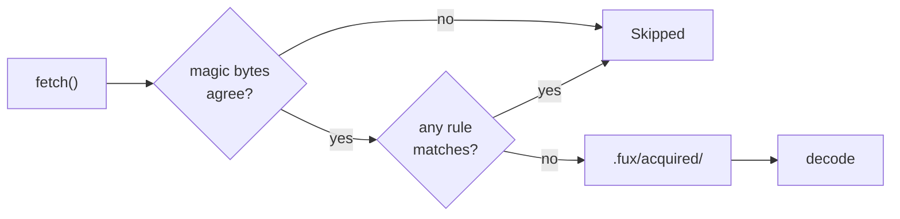

# ADR-REFUSAL: a sign-in wall is not a document, and only the bytes may say so

## §1 — For humans

A fetch can succeed and still not return the document. A sign-in wall, a
session-expired interstitial, a paywall, a 403 shell, the Office web viewer
sent in place of a workbook — each arrives as a well-formed page that decodes
perfectly. Nothing downstream can tell it from the real thing, so it lands in
the index as a document, and the failure surfaces weeks later as a confident
wrong answer that a human has to notice.

`.fux/refusals.toml` names those responses. It is a table of rules, matched
against the response **before** it is decoded, and a match records a skip
rather than a record. Fux ships no knowledge of any vendor: the rules are the
consumer's, and the shipped starter is a starting point they own and edit.

Underneath it sits one check that is fux's and cannot be turned off. If a
response declares itself an `.xlsx` and does not begin `PK\x03\x04`, it is not
one. That is a fact about **formats**, which is engine business; everything
above it is a fact about somebody's identity provider, which is not.



<details>
<summary><b>ASCII twin</b> — the same diagram, for terminals, diffs, and any reader without a Mermaid renderer</summary>

```text
                     fux's, always on        the consumer's, additive
                    +------------------+    +-------------------+
  fetch() --------> | magic-byte floor | -> | .fux/refusals.toml| -> acquired -> decode
                    +------------------+    +-------------------+
                            | no                    | match
                            v                       v
                        +---------+             +---------+
                        | Skipped |             | Skipped |
                        +---------+             +---------+
```

</details>

### Examples

The shipped starter, against four responses — one a real capture from a live
OneDrive share link, three stand-ins carrying only the properties the rules
test. The probe's README says which is which, and why the real ones are not
committed:

```console
$ python3 tools/refusal-probe/probe.py <repo> tools/refusal-probe/cases.toml
rules loaded: 6
  document-request-returned-a-web-page
  password-form-in-response
  suspiciously-small-document
  microsoft-entra-sign-in
  saml-or-oidc-handoff
  office-web-viewer-shell

REFUSED   the real Office web viewer, captured from a 1drv.ms share link
          167,681 bytes, text/html
          this is the Office web viewer, not the workbook - append &download=1
          to the share link so the URL returns the FILE instead of the app
          that displays it [office-web-viewer-shell]

ACCEPTED  the same URL with &download=1 -- a workbook (stand-in)
          6,727 bytes, application/vnd.openxmlformats-officedocument.spreadsheetml.sheet

REFUSED   a workbook URL that returned a sign-in page (stand-in)
          114 bytes, application/vnd.openxmlformats-officedocument.spreadsheetml.sheet
          declared application/vnd.openxmlformats-
          officedocument.spreadsheetml.sheet but the body does not start like
          one — the response is not the document it claims to be

ACCEPTED  an ordinary wiki page, which must NOT be refused (stand-in)
          1,321 bytes, text/html

```

The third case is the floor firing, and the fourth is the property that
matters more than any refusal: **an ordinary page must still be a document.**

---

## §2 — For agents

### Context

Ingest had exactly one way to reject a response: the fetcher raising. A fetcher
that returns bytes has, by the contract, succeeded — so every refusal page that
came back with a body became an indexed document.

The concrete case was a Microsoft 365 share link. It returns `text/html`, 160 KB
of it, which decodes cleanly to two words of prose and indexes without a
complaint. The URL is not broken and the session is not expired; the server is
answering the question *"show me this workbook"* with the application that
displays workbooks, and a fetcher cannot tell that from an answer.

**Output — the failure as it appeared, before any rule existed:**

```console
$ fux add "https://1drv.ms/x/c/.../TOKEN?e=PtMf2M"
note: https://1drv.ms/x/c/.../TOKEN?e=PtMf2M
      decoded to 2 word(s) from 160,068 bytes (0.0 words/KB) - indexed, but that is thin enough to be an
      application shell or a redirect stub rather than the document. If you asked for a
      file, check the URL returns the FILE and not the app that displays it.
```

That note is the thin-decode warning, and it is *after* the fact: the record
was written. The document in the index is the viewer's chrome.

### Decision

1. **Refusal is checked after `_unpack` and before persist and decode.** A
   refusal is never retained and never decoded. Retaining a login page would
   keep the wrong bytes and make them look authoritative
   ([ADR-ACQUIRED](0050_acquired-plane.md) decision 6).

2. **The rules table is `.fux/refusals.toml` — a consumer file, in a fixed
   location, additive only.** It sits beside `.fuxignore`, `tune.toml` and
   `output.toml`, none of which are relocatable either. A rule can only **add**
   a refusal; there is no syntax that exempts a response from the floor.

3. **Fux ships no vendor knowledge.** The starter table is written by `fux
   setup`, write-if-missing, and is the consumer's from that moment. No rule in
   the engine names Microsoft, Okta or anyone else; the shipped file does,
   because it is an example a consumer edits rather than a behaviour the engine
   guarantees.

4. **Every condition is pure over the bytes.** The six are `content_type`,
   `requested_suffix`, `requested_suffix_not`, `body_contains`,
   `body_starts_with`, `max_bytes`. There is no `status`, no `final_url_host`,
   no "were you redirected".

   ⚠ **This is [ADR-FETCHER](0019_fetcher.md) decision 13 holding, and it was
   nearly broken here.** The first Phase 2 specification carried `status`,
   `final_url_host`, `final_url_contains` and an always-on off-origin check.
   Decision 13 says fux *never reads a status code, a header, or an error
   string* — and its own veto check names this module's caller by path, so
   building the spec as written would have tripped a veto condition on an
   accepted record. The build stopped rather than proceeding. `content_type` is
   admissible because a MIME type is **format** vocabulary; a `302` is
   **transport** vocabulary and belongs to whatever protocol the fetcher
   happens to speak. Separately, `fetch()` returns `(bytes, content_type)` and
   has no way to deliver a status at all — the boundary and the signature agreed.

   **The cost of holding the line was measured, not assumed.** An identity
   provider that bounces you still has to return a page, and that page is HTML
   where a document was requested — caught by `document-request-returned-a-web-page`
   without knowing the provider exists. Provider-specific detection survives as
   `body_contains` over form-field names (`name="loginfmt"`, `name="SAMLRequest"`),
   which are an API between the page and its own backend and so outlive the
   redesigns that rewrite every visible string.

5. **Conditions within a rule are ANDed; values within a condition are ORed.**
   One rule is one signature. A rule that declares no conditions would refuse
   every document, so it is refused at load.

6. **The magic-byte floor is fux's, always on, and not configurable.** Five
   types have a fixed unambiguous signature (`PK\x03\x04` for the OOXML and ODF
   family, `%PDF-` for PDF). A type absent from that table is simply not
   checked — guessing a signature would turn the floor into a source of false
   refusals, and a floor that cries wolf gets switched off.

7. **`""` is a real value in the suffix lists, and only there.** It is how a
   rule says *"a URL that names no extension"*, which every share link is.
   ⚠ **Its absence blinded five of six rules** on exactly the URLs this feature
   was built for, and its presence in `suspiciously-small-document` refused
   every extensionless page in the corpus. An empty `content_type` prefix or an
   empty `body_contains` needle would match every response instead, so both are
   refused at load.

8. **Missing is silence; malformed raises; an unknown condition raises.** A
   repo with no refusals file is a legitimate configuration protected by the
   floor. A rules file that silently failed to parse would look exactly like
   that, and the consequence — a login page in the index — is discovered weeks
   later by a human reading an answer. A typo'd condition that quietly does
   nothing is a rule that reads as protection and is not.

9. **`BODY_SCAN_BYTES` is 1 MiB, and the number is measured.** The first value
   was 64 KiB, reasoning about the wrong risk: the cost it feared was scanning
   a 40 MB workbook for a login string, but a workbook is binary and
   `_searchable_text` already declines to decode it. What reaches this path is
   HTML, which is being decoded anyway. ⚠ **The rule written to catch the
   Office viewer could not see its own marker**, which sits past 64 KiB:

   ```console
   $ python3 - <<'EOF'                     # against the committed capture
   from pathlib import Path
   raw = Path("tools/refusal-probe/captures/onedrive-viewer-shell.html").read_bytes()
   print(f"page: {len(raw):,} bytes")
   for m in (b"WacFrame_Excel", b"WOPISrc=", b"_wopiContextJson", b"viewerinternal.aspx"):
       at = raw.find(m)
       print(f"  {m.decode():<20} " + (f"first at byte {at:>7,}" if at >= 0 else "absent"))
   EOF
   page: 167,681 bytes
     WacFrame_Excel       first at byte 101,198
     WOPISrc=             absent
     _wopiContextJson     absent
     viewerinternal.aspx  absent

   # refusals.BODY_SCAN_BYTES: was 65,536 — now 1,048,576
   ```

   ⚠ **Read the three `absent` lines.** Those markers came from
   `excel.cloud.microsoft` and are **not in the page a `1drv.ms` link actually
   lands on**. A rule written from the wrong capture matches nothing and reads
   as protection — which is decision 8's concern arriving through the data
   rather than the syntax. The rule that works was written from the real
   capture. **This is why decision 3 refuses to put vendor knowledge in the
   engine**: the engine cannot recapture, and a consumer can.

10. **A refusal reason is recorded verbatim as the skip reason, and is written
    as an instruction.** `[rule-name]` is appended so a report can say which
    rule caught it. The Office rule's reason names the fix — append
    `&download=1` — because the reader of that message is trying to ingest a
    workbook, not diagnose a viewer.

**Output — the strictness, every branch:**

```console
$ # no .fux/refusals.toml at all
  -> 0 rule(s), no error

$ # malformed TOML
  -> FuxError: .../refusals.toml: invalid TOML (Expected ']]' at the end of an
     array declaration (at line 1, column 7))

$ # a typo'd condition
  -> FuxError: .../refusals.toml: rule 'x': unknown condition(s): body_contain —
     known: content_type, requested_suffix, requested_suffix_not, body_contains,
     body_starts_with, max_bytes. A typo'd condition would silently do nothing,
     leaving a rule that reads as protection and is not

$ # a rule with no conditions
  -> FuxError: .../refusals.toml: rule 'x': declares no conditions, so it would
     refuse every document. Add at least one of: content_type, requested_suffix,
     requested_suffix_not, body_contains, body_starts_with, max_bytes

$ # an empty content_type prefix
  -> FuxError: .../refusals.toml: rule 'x': 'content_type' contains an empty
     string, which would match every response — remove it, or state the value
     you meant

$ # an empty requested_suffix
  -> 1 rule(s), no error          # decision 7: "" is a real suffix
```

### Consequences

**Easier.** A refusal that used to become a record now becomes a skip with a
reason a human can act on, and the reason names the fix rather than the
symptom. A consumer with a corporate SSO writes two rules once and every URL
behind it is covered.

**Harder.** `.fux/refusals.toml` is a file that can be wrong in a way nothing
else notices — a rule too broad silently drops real documents. Decision 8's
strictness catches malformed and typo'd rules; it cannot catch a
*well-formed rule that is wrong about the world*, and nothing can. That is why
the reason string is recorded on the skip: the evidence a rule is over-broad is
a skip list full of documents a human recognises.

**Owed.** This check is structurally blind to the opposite failure: **large
input, empty output.** It runs before decode, so a 160 KB page that decodes to
two words passes every rule and then produces almost nothing. That is a decode
observation and it needed a separate mechanism — the thin-decode warning in
`urlsrc._warn_if_thin`, which is `(words/KB) < 2.0` **and** `words < 50`, an OR
away from firing on real short documents. It warns and never refuses, because
"the decoder found little" is not the same claim as "this is not the document".

**Also owed, and filed in [`work/OPEN-WORK.md`](../../work/OPEN-WORK.md):**
`fux doctor` does not report how many URLs were refused, or by which rule, so
an over-broad rule is visible only in a run's own output.

### Alternatives considered

- **Transport conditions — `status`, `final_url_host`, off-origin.** The
  original specification, and the one that was stopped. Rejected under decision
  4 on a veto condition, not on taste; and the byte-pure conditions turned out
  to be near-redundant with it, so the cost of holding the boundary was close
  to zero.
- **Vendor detection in the engine.** Rejected under decision 3, and decision 9
  shows why with a captured example: the markers a vendor rule needs differ
  between two of the *same vendor's own* hosts, and the engine cannot recapture.
- **Refuse after decode, on word count.** Rejected: it conflates two questions.
  A refusal page and a genuinely terse document both decode short, and the
  action for each is opposite. Both mechanisms now exist, separately, and the
  post-decode one warns rather than refusing.
- **A `[refusals]` table in `fux.toml`.** Rejected for the reason
  ADR-URL-LIST gives for the URL list: a growing list of multi-line entries in
  a TOML file is one diff hunk and one merge conflict.
- **Making the magic-byte floor configurable.** Rejected under decision 6. Its
  whole value is that it is one thing a consumer cannot get wrong, and the
  first request to disable it would come from someone whose real problem was a
  mislabelled `Content-Type`.

### Reference (required)

- [`src/fux/ingest/refusals.py`](../../src/fux/ingest/refusals.py) — the matcher, and the module docstring that argues decision 4 in place
- [`src/fux/templates/refusals.toml.txt`](../../src/fux/templates/refusals.toml.txt) — the six shipped rules
- [`tests/ingest/test_refusals.py`](../../tests/ingest/test_refusals.py) — 37 tests over the matcher, including the `""`-suffix case and the two fixtures that were wrong before the code was
- [`tools/refusal-probe/`](../../tools/refusal-probe/README.md) — the shipped rules against real captured responses; [`tests/ingest/test_refusal_probe.py`](../../tests/ingest/test_refusal_probe.py) runs its cases in CI
- [ADR-FETCHER](0019_fetcher.md) decision 13 — the boundary this record holds, and whose veto check named this module's caller

### Veto condition

**Reopen this decision if:** a refusal is captured that no combination of the
six byte-pure conditions can express — a real response, saved to a file, that a
consumer cannot write a rule for. That is the only evidence that would justify
widening the fetcher contract, and decision 4 says so in the module itself.

**How to check it:** the captured response is the check. Save it under
[`tools/refusal-probe/captures/`](../../tools/refusal-probe/README.md), add a
`[[case]]`, and run the probe with the rules a consumer would reasonably write.
If no rule can match it, the condition has fired.
[`tests/ingest/test_refusal_probe.py`](../../tests/ingest/test_refusal_probe.py)
runs every case in CI, so this stays a check rather than a habit.

```console
$ python3 tools/refusal-probe/probe.py <repo> tools/refusal-probe/cases.toml ; echo "exit=$?"
… 4 cases, shown in full under §1 Examples …
exit=0                                          # 2026-09-01, `expect` all matched
```

`2026-09-01 — not fired.` The one refusal that motivated the feature is
expressible, and the two responses that must **not** be refused are not.

---

## References

*Every source this record cites, gathered in one place. §2's **Reference
(required)** names the grounding; this is the complete list. An archived
document is never listed here — the body may name one, but archive is not
evidence.*

**Records** — [ADR-LAWS](0001_laws.md) · [ADR-DOTFUX](0003_fux-directory.md) ·
[ADR-URL-INGEST](0008_url-ingest.md) · [ADR-URL-LIST](0018_url-list.md) ·
[ADR-FETCHER](0019_fetcher.md) · [ADR-DECODE](0042_decode.md) ·
[ADR-ACQUIRED](0050_acquired-plane.md)

**Code**

- [`src/fux/ingest/refusals.py`](../../src/fux/ingest/refusals.py)
- [`src/fux/ingest/urlsrc.py`](../../src/fux/ingest/urlsrc.py)
- [`src/fux/templates/refusals.toml.txt`](../../src/fux/templates/refusals.toml.txt)
- [`tests/ingest/test_refusals.py`](../../tests/ingest/test_refusals.py)
- [`tests/ingest/test_refusal_probe.py`](../../tests/ingest/test_refusal_probe.py)
- [`tools/refusal-probe/probe.py`](../../tools/refusal-probe/probe.py)

**Work**

- [`archive/open/W-98-acquired-plane.md`](../../archive/open/W-98-acquired-plane.md) — the item that produced this record, **named and not cited**: it was archived on 2026-09-01 when all four phases landed, and two of its own claims were wrong
