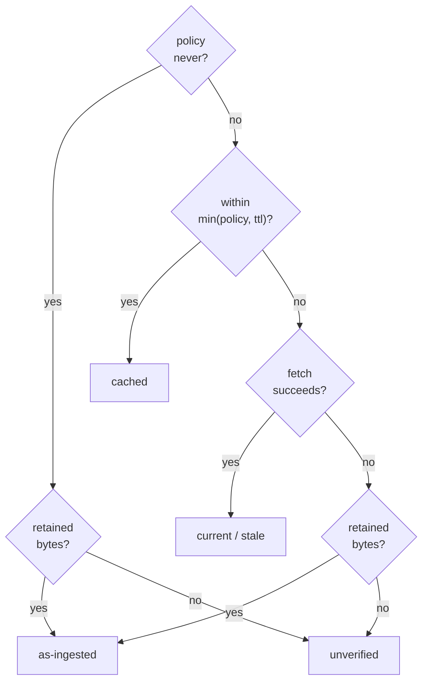

# ADR-URL-FRESHNESS: what a citation may claim, and how often it has to earn it

## §1 — For humans

When fux quotes a `url:` document, the honest question is *how do you know that
is still what the source says?* — and there is more than one true answer. Fux
just looked and it matched. Fux just looked and it did **not** match. Fux looked
recently. Fux could not look at all.

Each of those is a different strength of claim, and the failure this record
exists to prevent is a weaker one being reported as a stronger one. So they are
six distinct labels and nothing ever folds one into another:

| label | what it means |
|---|---|
| `current` | fetched now; the source matches the index |
| `stale` | fetched now; the source has changed |
| `cached` | a copy fetched within the ttl matched; **we looked recently, not now** |
| `as-ingested` | the source was unreachable, but the passage still matches the exact bytes the record was built from, held in `.fux/acquired/` |
| `unverified` | we did not look, and have nothing to compare |
| `as-ingested` *(mismatched)* | the retained bytes disagree with the index — an **index defect**, not a stale source |

`ttl=` on a URL line says how long that URL may go unchecked. It is a **bound
that narrows**: it can make a URL checked more often than the caller's policy
asks, never less. With the default policy — caching off — no line can turn
caching on.



<details>
<summary><b>ASCII twin</b> — the same diagram, for terminals, diffs, and any reader without a Mermaid renderer</summary>

```text
  policy=never ---------------> retained bytes? -- yes --> as-ingested
                                       |  no
                                       +--------------> unverified

  policy=always --> inside min(policy, ttl)? -- yes --> cached
                              |  no
                              v
                        fetch succeeds? -- yes --> current | stale
                              |  no
                              v
                        retained bytes? -- yes --> as-ingested
                              |  no
                              +-----------------> unverified
```

</details>

### Examples

The six verdicts, from the constructors that build them:

```console
constructor                  label         current  note
----------------------------------------------------------------------------
verify('a','a')              current       True     source matches the index
verify('a','b')              stale         False    source has changed since ingest
verify('a', None)            unverified    None     not fetched
cached('a','a', 30, 300)     cached        True     served from the local fetch cache, 30s old
as_ingested('a','a')         as-ingested   True     source unreachable; matches the bytes it was ingested from
as_ingested('a','b')         as-ingested   False    source unreachable, AND the index disagrees with the …
```

---

## §2 — For agents

### Context

Before this record, a `url:` citation could say four things, and the fourth was
doing too much work. `unverified` meant *"we did not look"* — and it was also
what fux said when it **tried** to look and could not: signed out, offline, the
host unreachable, the share link expired. Those are not the same, and the
difference is not academic. A corpus where every URL sits behind a session
degrades wholesale to `unverified` the moment that session lapses, and an agent
reading the bundle cannot distinguish *"nobody asked me to check"* from *"I
tried and the world would not answer"*.

[ADR-ACQUIRED](0147_acquired-plane.md) put the fetched bytes on disk, which made
a third thing possible: compare the passage against the exact input the record
was built from. That is a **real comparison** — it catches an index that has
drifted from its own source bytes — and it is strictly more than `unverified`
has ever been able to say. It needed a name that was neither `current` nor
`unverified`, because it is neither.

Separately, `ttl=` was added to the URL line grammar in the same work item, and
**nothing consumed it.** It parsed, it validated, it round-tripped through `fux
update`, and no code path turned it into a bound. That is precisely the failure
[`freshness.py`](../../src/fux/refer/freshness.py) refused `max_age_seconds` over
— *a knob that silently does nothing is the worst available outcome, because a
caller passing it reasonably believes they bounded their staleness* — and
shipping it that way would have contradicted the argument in the module's own
docstring.

### Decision

1. **Six labels, and `label` is the only thing that computes one.** Nothing
   downstream re-derives a verdict from `current`; the ordering lives in one
   property, in one module.

2. **A weaker claim never collapses into a stronger one.** `cached` is not
   `current`: *we looked recently* is a different claim from *we just looked*.
   `as-ingested` is not `current` either: it says nothing about the world right
   now. A caller that wants to treat them alike may; the engine will not do it
   on their behalf.

3. **`as-ingested` outranks `unverified` and is outranked by everything that
   reached the source.** The precedence in `Verdict.label` is `cached` →
   `as-ingested` → `unverified` → `current`/`stale`. `cached` sits above
   `as-ingested` because a TTL hit means fux went out within the window; the
   retained-bytes comparison never went out at all.

4. **`current` still records whether the shas agreed, on every verdict.** Both
   `cached` and `as_ingested` keep the comparison result alongside the fact that
   it was not a fresh look. Dropping either would make the verdict a smaller
   claim than the truth.

5. **A mismatch against retained bytes is an index defect, not staleness.** The
   source did not change; the record disagrees with the bytes it was built from.
   The note says `rebuild this record` rather than `source has changed`, and the
   label stays `as-ingested` rather than becoming `stale` — reporting it as
   `stale` would send a reader to the wrong system.

6. **The retained-bytes path decodes through the SAME functions ingest used.**
   `from_acquired` imports `_decode_fetched` and `sanitize` from
   `ingest/urlsrc.py` rather than reimplementing them.
   ⚠ **This is the property the whole fallback rests on.** A verify-time sha is
   compared against an ingest-time sha; if the two pipelines diverge by one
   line, every retained document is `as-ingested` with `current=False` forever —
   a defect that presents as a working feature.
   `tests/refer/test_refer_acquired.py::test_the_sha_matches_what_ingest_would_have_recorded`
   is the assertion, and it exists because the failure would otherwise be silent.

6a. 🔴 **The LIVE path did not, for sixteen days, and every URL citation in
   every repo fell back to a weaker verdict.** Decision 6 was written about
   `from_acquired` and `_fetch_url` was left on the old contract: it required
   the fetcher to return a `str`, while both shipped fetchers have returned
   `(bytes, content type)` since 2026-08-26 (W-86 P8). So the live fetch raised
   `fetcher returned tuple, expected str` on every `url:` document and the
   verdict became `as-ingested` or `unverified` — **never `current`, never
   `stale`**.

   - ⚠ **Nothing looked broken.** Both fallbacks are legitimate verdicts with
     honest notes, so the freshness feature reported itself as working while
     the network half of it had never run. The note named the cause and no test
     read it.
   - **Fixed 2026-09-11** (W-140 row 1): `_fetch_url` takes `root`, unpacks
     through `_unpack` and decodes through `_decode_fetched`, so the live path
     and the retained path now produce the same bytes from the same response.
     `tests/refer/test_source.py` asserts the identity of both functions, not
     just of `sanitize` — **decision 6's rule stated for one caller is how the
     other one got missed.**
   - **A decoder is now load-bearing at verify time.** A response whose type
     nothing claims raises with `decode.reason()`'s sentence and the verdict is
     `unverified`; it is not silently treated as prose. The pre-2026-08-26
     `str` ramp still verifies, because `_unpack` keeps it.

7. **A blob that is missing, deleted by hand, or no longer decodes yields
   `None`, which is `unverified`.** *We have nothing to compare* must not be
   dressed up as a comparison that happened.

8. **Only `url:` documents take this path.** A `file:` document is on disk
   already; reading the checkout is not a fetch and never was.

9. **`ttl=` is a duration on the URL line, defaulting to `24h`, resolved through
   the same three layers as `keep` and `meta`** — built-in default, then
   `[sources.url] ttl`, then the line. The grammar is `0` or
   `<integer><s|m|h|d>`. It is stored **verbatim** as written: `1h` round-trips
   as `1h`, never as `3600`, because the value goes back into a committed file.

10. **`ttl` is the first typed attribute in the source-list grammar.** Every
    attribute before it was a closed enum, which a duration cannot be; the
    `Attribute` record gained an optional `validate` callable rather than a
    second parser. **`--ttl` on the CLI is validated by that same callable**, so
    `--ttl 1x` and a hand-written `ttl=1x` fail identically. Two validators
    would drift.

11. **The effective interval is `min(policy.cache_ttl_seconds, declared)` — a
    line may narrow it and can never widen it.** Both halves answer a different
    failure:

    - **Cannot widen**, so a URL line can never serve a cached byte to a caller
      who did not ask for caching. The policy default is `0`, and `min(0,
      86400)` is `0` — W-60 verdict F holds by arithmetic rather than by a rule
      somebody has to remember. This matters because `ttl` defaults to `24h` on
      *every* line: without the bound, adding a URL would quietly switch
      caching on.
    - **Can narrow**, so `ttl=0` means *always go out for this one*, whatever
      the caller's policy says. That is the case a per-URL attribute exists for:
      a runbook that must never be answered from a cached copy sits in the same
      corpus as a spec that may.

    The same `min(configured, declared)` shape as `max_parallel`, and for the
    same reason: a declaration may lower a bound, never raise it.

12. **A `ttl` of 0 also suppresses the cache WRITE, not just the read.** A copy
    that is written and never read is a copy of an access-controlled document
    sitting on disk for no benefit — which is the L2 cost with none of the L2
    payoff.

13. **The URL list is read only when the caller has already opted into
    caching.** With the default policy nothing is opened, so the common path
    costs no file read and gains no new failure mode. When the caller *has*
    opted in, a malformed URL list raises exactly as it does in `fux ingest` —
    a file that exists and is wrong is the case a loader refusal is for
    ([ADR-DOTFUX](0102_fux-directory.md)).

14. **`.fux/refusals.toml` and `.fux/acquired/` do not participate in a
    verdict.** A refusal is caught before the bytes are retained, so a refusal
    page can never become an `as-ingested` comparison.

**Output — the same query, the same offline fetcher, with and without the
retained bytes.** This is the whole record in one block:

```console
$ # with .fux/acquired/ populated
  verdict : as-ingested
  current : True
  note    : https://intranet/deploy-runbook: fetcher raised RuntimeError: could not resolve host …
  quoted  : 1 citation(s) quoted

$ # with the plane empty
  verdict : unverified
  current : None
  note    : https://intranet/deploy-runbook: fetcher raised RuntimeError: could not resolve host …
  quoted  : 0 citation(s) quoted
```

The second is what every offline citation used to be. The first is a citation
that can still be quoted, with an honest label on how much it is worth.

**Output — decision 11's arithmetic, every case:**

```console
    policy   line ttl=   effective   what it means
--------------------------------------------------------------------------
         0           -           0   default policy, no line   -> cache off
         0       86400           0   default policy, ttl=24h   -> STILL off (cannot widen)
      3600           -        3600   opted in, no line         -> policy stands
      3600         900         900   opted in, ttl=15m         -> narrowed
      3600           0           0   opted in, ttl=0           -> this URL always goes out
       300       86400         300   opted in, ttl=24h         -> capped at the policy
```

⚠ **A per-document verdict is now the COMMON case on `answer`, not the edge
(W-108, 2026-09-05).** `refer()` is called with three candidates instead of
one, and `_obtain`'s two `as-ingested` fallback points and its `unverified`
degradation now run **per candidate within a single answer**. One `url:`
citation that cannot be fetched costs its own citation; the other two documents
still answer. Nothing in this record's arithmetic changed — `min(policy,
declared)` and the six labels are untouched — but the vocabulary is now used
several times per answer, and a bundle can carry three different labels at once.

⚠ **`strategy` in `_obtain` means SOURCE strategy — `GIT` or `URL` — and
nothing else, as of 2026-09-06.** For part of one day the same module also
carried a *chunk* strategy threaded from the decoder through `_readable`, so
`refer/__init__.py` had two unrelated variables spelled `strategy`, one of them
this record's. The chunk one is gone
([ADR-CHUNKING](0153_chunking.md) decision 1 — what a passage is is derived,
not declared), and `_readable` returns two values rather than three. **No
verdict, no label and no arithmetic in this record changed**; the note exists
because a reader of `_obtain` who met the collision would have had a live
reason to misread it, and that reason should not be rediscovered from a diff.

🔴 **Consequence a caller must not get wrong:** `citation.freshness` in
`--json` is the verdict for **the winning passage's** document. It was
`documents[0]`'s until W-108, which was the same object while there was one
candidate and is routinely a *different* one now. Reporting candidate one's
`current` beside candidate two's passage would be exactly the collapse these
six labels exist to prevent, and `query/__init__.py::_freshness_of` is where it
is prevented.

⚠ **`ttl` and `archived` answer different questions about the same URL, and
2026-09-11 put them on adjacent lines** (W-126). `ttl` is this record's: **how
long may this citation go unchecked** — a statement about fux's confidence in
its own copy, resolved through three layers because a source can answer it for
all its pages. `archived` is a statement about **the page's standing in the
world**, resolved through two.

🔴 **Neither implies the other, and the combination that proves it is the
useful one:** a retired page is exactly the page whose bytes will never change
again, so `archived=true ttl=720h` is a perfectly coherent line — *this is
retired, and re-checking it weekly is enough*. A reader who folded the two
would conclude that a retired page needs no freshness policy, which is the
opposite of what a citation to a retired page needs.

⚠ **`ttl` is now the only `validate=` attribute on a LIVE committed list**
(2026-09-11). This record added the first typed attribute — `Attribute` grew an
optional `validate` callable because a duration cannot be a closed enum — and
`decoder` on the types list was the only other user.

**`decoder`'s spec did not disappear, it went vestigial.** `.fux/sources/types`
became `.fux/formats.toml` ([the comparison](../../work/compare/types-toml.compare.md),
ADR-TYPES decision 12), and `sourcelist.TYPES` survives only as the `fux add
--types` dispatch token and as the grammar `fux setup` reads when converting a
legacy file. **So the typed-attribute machinery has exactly one live user, and
it is this one** — if `ttl` ever leaves the line grammar, `Attribute.validate`
has none, and whoever removes it should know that before deleting the seam.

⚠ **The duration grammar itself is unaffected**: `sourcelist.parse_duration` is
still the single definition, and `[sources.url] ttl` still validates through it
rather than through a second copy ([ADR-CONFIG](0113_config.md) decision 12).

15. 🔴 **`ttl` is ASK-TIME. It does not reach `fux update`, and the attribute
    that does is `update=`.** Two clocks sit on the same line and this is the
    sentence that keeps them apart.

    | attribute | when it acts | what it decides |
    |---|---|---|
    | **`ttl=`** *(this record)* | **ask time** — inside `fux answer` | how long a citation may go **unchecked** before fux re-verifies it |
    | **`update=`** ([ADR-URL-LIST](0116_url-list.md) decision 14) | **update time** — `fux update`, `fux ingest --refresh-urls` | whether fux goes back for the document **at all** |

    - **`ttl=0` is not `update=never`.** `ttl=0` means *check on every answer*
      — maximally networked. `update=never` means *never fetch again* —
      maximally offline. Opposite ends of different axes, and a reader who
      merges them will configure the opposite of what they meant.
    - **`update=` is two words and takes no duration, deliberately**, so the two
      can never be confused at a glance. That is recorded where the attribute is
      defined rather than restated here.
    - **A pinned URL's `ttl` is not dead.** `update=never keep=true` still
      verifies at ask time against the retained bytes and reports `as-ingested`;
      `ttl` still bounds how often that comparison is redone. Pinning removes
      the socket, not the verification.

**A fetch this plane triggers is now bounded, and the bound is on waiting**
(W-140 row 15, 2026-09-11). `Policy.timeout_seconds` validated its value,
travelled in `as_record()` and was read by nothing, so `mode = always` could
hang a query forever. The verdicts here are unchanged: a timeout raises
`FuxError` on the same path a failed fetch takes, which is `as-ingested`
against retained bytes and `unverified` without them —
[ADR-REFER](0127_refer-plane.md) carries the mechanism and what it does not
promise.

### Consequences

**Easier.** An offline or signed-out corpus keeps answering, with citations that
say exactly what they are worth. A per-document check interval becomes a
one-word edit on a line in a committed file, reviewable in a diff, rather than a
caller-side argument nobody can see.

**Harder.** Six labels is more than four, and every consumer of the bundle —
`ask --why`, `answer --receipt`, `fux verify`, the MCP result, `output.schema.json`
— has to know all six. The schema's enum is the machine-checked half of that;
`tests/refer/test_refer_acquired.py::test_the_output_schema_carries_the_sixth_verdict`
asserts the prose no longer says *four-state*.

**Owed, and filed in [`work/OPEN-WORK.md`](../../work/OPEN-WORK.md):**

- ~~**`fux doctor` does not report the `as-ingested` share.**~~ **Closed
  2026-09-05 (W-101).** `doctor.freshness_counts()` reports it, as the
  `freshness verdicts` check and as `fux doctor --json`'s `freshness` block;
  both this record's veto and
  [ADR-ACQUIRED](0147_acquired-plane.md)'s identical one can now be run.
  ⚠ **Over journalled answers only.** A freshness verdict exists at answer
  time and only the **opt-in** receipt journal (`--journal`) persists one, so a
  repo that has never journalled reports **unknown** rather than a zero share.
  That is the honest reading and it is the reason nothing new is retained: L8's
  journal already existed, and where it is off there is no number to have.
- **`ttl=` bounds the TTL fetch cache and nothing else.** It does not yet
  influence which URLs `fux daemon` sweeps first, which is the other place a
  per-URL interval obviously belongs.

### Alternatives considered

- **Reuse `unverified` for the retained-bytes case.** The cheapest option, and
  wrong under decision 2: it would report a real comparison as no comparison,
  and the whole point of the plane is that the comparison happened.
- **Report the retained-bytes match as `current`.** Rejected harder, and in the
  other direction. It is the exact failure the three-state shape was built to
  prevent — a claim about the world made from bytes that never left the disk.
- **A mismatch against retained bytes reported as `stale`.** Rejected by
  decision 5. It reads naturally and sends the reader to the wrong system: the
  source is fine, the record is not.
- **`ttl=` overrides the caller's policy outright.** The obvious reading of "a
  line wins", and it silently defeats W-60 verdict F: `ttl` defaults to `24h` on
  every line, so a caller who never opted into caching would start being served
  cached bytes as soon as anyone added a URL. Rejected by decision 11 — and the
  `min` is why the default value is harmless rather than load-bearing.
- **`max_age_seconds` on the policy.** Rejected before this record, and the
  argument still stands: the committed record carries no ingest time, so an age
  bound could not be honoured. `ttl=` is not that knob wearing a new name — it
  bounds *how long a check may be skipped*, which is a wall-clock question the
  TTL store is already the one place allowed to answer.
- **Storing `ttl` resolved to seconds on `UrlEntry`.** Rejected by decision 9:
  the value round-trips into a committed file, and rewriting a consumer's `1h`
  as `3600` behind their back is the kind of diff that makes people stop
  trusting the tool.

### Reference (required)

- [`src/fux/refer/freshness.py`](../../src/fux/refer/freshness.py) — the six labels, and the `max_age_seconds` refusal this record does not undo
- [`src/fux/refer/source.py`](../../src/fux/refer/source.py) — `from_acquired`, and decision 6's imported-never-reimplemented rule
- [`tests/refer/test_freshness_ttl.py`](../../tests/refer/test_freshness_ttl.py) · [`tests/refer/test_refer_acquired.py`](../../tests/refer/test_refer_acquired.py) · [`tests/refer/test_ttl_resolution.py`](../../tests/refer/test_ttl_resolution.py) — 45 tests, including the four that pin decision 11's arithmetic
- [`src/fux/doctor.py`](../../src/fux/doctor.py) — `freshness_counts()` and `AS_INGESTED_VETO_SHARE`, this veto's instrument (W-101, 2026-09-05)
- [ADR-ACQUIRED](0147_acquired-plane.md) — the plane the fourth verdict reads from
- [ADR-CACHE](0131_cache.md) — the TTL store `ttl=` bounds, and the argument for keeping two caches provably separate

### Veto condition

**Reopen this decision if:** `as-ingested` exceeds a quarter of verified `url:`
citations on a corpus whose sources are all reachable. That would mean the
verdict is masking a broken fetch path rather than covering a rare one, and the
fix is the fetch path, not a wider vocabulary.

**How to check it:** `fux doctor --json` — the `as-ingested` count against total
verified citations.

**Output (captured 2026-09-05, this repo, no journal yet):**

```console
$ fux doctor --json | python -c "import json,sys; print(json.load(sys.stdin)['freshness'])"
{}
```

> The empty object is **unknown, not zero**: no answer here has been run with
> `--journal`. A populated one reads
> `{"current": 41, "as-ingested": 3, "unverified": 6}` and the veto compares
> `as-ingested` against the sum — the quarter lives once, in
> `doctor.AS_INGESTED_VETO_SHARE`, so the two records cannot drift apart on the
> number they share.

---

## References

*Every source this record cites, gathered in one place. §2's **Reference
(required)** names the grounding; this is the complete list. An archived
document is never listed here — the body may name one, but archive is not
evidence.*

**Records** — [ADR-LAWS](0001_LAWS.md) · [ADR-DOTFUX](0102_fux-directory.md) ·
[ADR-URL-LIST](0116_url-list.md) · [ADR-FETCHER](0117_fetcher.md) ·
[ADR-REFER](0127_refer-plane.md) · [ADR-CACHE](0131_cache.md) ·
[ADR-PROVENANCE](0143_provenance.md) · [ADR-ACQUIRED](0147_acquired-plane.md) ·
[ADR-REFUSAL](0148_refusals.md)

**Code**

- [`src/fux/refer/freshness.py`](../../src/fux/refer/freshness.py)
- [`src/fux/refer/source.py`](../../src/fux/refer/source.py)
- [`src/fux/refer/__init__.py`](../../src/fux/refer/__init__.py)
- [`src/fux/ingest/sourcelist.py`](../../src/fux/ingest/sourcelist.py)
- [`src/fux/ingest/urlsrc.py`](../../src/fux/ingest/urlsrc.py)
- [`src/fux/config.py`](../../src/fux/config.py)
- [`src/fux/query/output.schema.json`](../../src/fux/query/output.schema.json)

**Tests**

- [`tests/refer/test_freshness_ttl.py`](../../tests/refer/test_freshness_ttl.py)
- [`tests/refer/test_refer_acquired.py`](../../tests/refer/test_refer_acquired.py)
- [`tests/refer/test_ttl_resolution.py`](../../tests/refer/test_ttl_resolution.py)

**Work**

- [`archive/open/W-98-acquired-plane.md`](../../archive/open/W-98-acquired-plane.md) — the item that produced this record, **named and not cited**: it was archived on 2026-09-01 when all four phases landed, and two of its own claims were wrong
