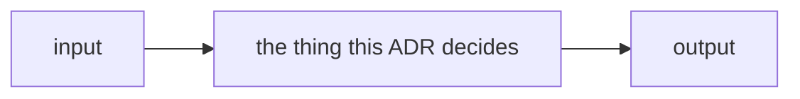

# ADR-<NAME>: <short decision title>

> **How to use this file.** Copy it to `docs/adr/000N_<short-name>.md`, take the
> next free number, and give the record a **NAME** — that name is how every
> other doc cites it. Delete these instruction blockquotes as you fill it in.
>
> **The frontmatter above is the exact shape**, six keys in that order:
> `type` (always `ADR`) · `name` · `title` (`NAME (NNNN) — …`) · `description` ·
> `status` (`proposed` | `accepted` | `superseded`) · `timestamp`.
> **Quote any value containing `: `** — `fux`'s parser is permissive and will
> read it, but strict YAML refuses the whole block, which makes the record's
> metadata invisible to GitHub, editors and every generator. `name` and `status`
> must match the `**Name:**` and `**Status:**` lines below, and the title must
> carry its number. All of that is checked by
> [`tests/test_adr_frontmatter.py`](../../tests/test_adr_frontmatter.py).

- **Name:** `ADR-<NAME>` — cite this everywhere; never cite the number
- **Status:** proposed | accepted | superseded by ADR-<NAME>
- **Date:** YYYY-MM-DD
- **Feature:** <the one feature this record belongs to — one feature, one ADR>
- **Owns:** <the `src/` or `tools/` components this record claims — must match
  the ownership table in [`README.md`](README.md)>
- **Laws:** <the ADR-LAWS numbers this decision is bound by, e.g. L1, L3 — do
  not restate them here>

---

## §1 — For humans

> **One screen, maximum.** If it does not fit, the extra belongs in §2.

<Two or three short paragraphs: what changed, and why anyone should care.>

**Diagram — Mermaid and its ASCII twin. Update both, always, together.** Keep
the twin inside the `<details>` block below; the blank line after `</summary>`
is what makes the fence render.



<details>
<summary><b>ASCII twin</b> — the same diagram, for terminals, diffs, and any reader without a Mermaid renderer</summary>

```text
   +-------+      +-----------------------------+      +--------+
   | input | ---> | the thing this ADR decides  | ---> | output |
   +-------+      +-----------------------------+      +--------+
```

</details>

### Examples — *if applicable*

> **Real, and copied from a capture — never invented.** Two or three at most:
> the smallest set that shows a reader what this decision looks like in use.
> The exhaustive set belongs in the regression run this record cites, and in
> §2. **Delete this section** when the decision has no user-visible surface (a
> schema, a naming rule, a principle).

```console
$ <command>
<output, verbatim>
```

### Charts — *if applicable*

> **The default is no chart, and most records should have none.** Add one only
> when a *shape* carries the argument better than a sentence does: a threshold
> that was met, a distribution that justified a constant, a cost that grows. A
> chart restating a number already in the prose is noise — delete this section
> instead.
>
> Rules, when you do add one:
>
> - **Same both-formats discipline as the diagram** — a Mermaid block and a
>   collapsed ASCII twin, updated together.
> - **One measure per chart.** Never two y-scales; two measures means two
>   charts.
> - **Every number is measured or computed**, from the run this record cites or
>   from the code's own constants. State which, under the chart.
> - **Label the series, not every point.** A value on every point is noise.

```mermaid
xychart-beta
    title "<what the shape shows>"
    x-axis "<x label>" [1, 2, 3, 4]
    y-axis "<y label>" 0 --> 10
    line [1, 4, 7, 9]
```

<details>
<summary><b>ASCII twin</b> — the same chart, for terminals, diffs, and any reader without a Mermaid renderer</summary>

```text
  <y label>
   10 |                          *
    5 |            *
    0 +----*---------------------------
        1     2     3     4   <x label>

  source: <the run or the constants these numbers come from>
```

</details>

---

## §2 — For agents

### Context

What forces are at play? What problem does this feature solve? Why now?

### Decision

The decision, stated plainly. Present tense, imperative where it binds.

### Consequences

What becomes easier, what becomes harder, what we now owe. Name the debt and
file it in [`work/OPEN-WORK.md`](../../work/OPEN-WORK.md) if it is real.

### Alternatives considered

What else was on the table, and why each lost. One line per option minimum; if
the fork was genuine, link its
[`work/compare/`](../../work/compare/README.md) doc rather than re-arguing it.

### Reference (required)

At least one grounding reference — a paper, a live doc, code at a path, or
measured evidence under
[`work/regression/`](../../work/regression/README.md). A decision with no
reference is incomplete.

**Never an archived doc.** An archived file may be *named* here; it may not
*back* a claim. Repoint at the live successor.

- <title> — <url or repo path>

### Veto condition

> **Write a condition to check, never an event to await.** State exactly what
> would have to become **true** for this decision to reopen, in terms someone
> can evaluate today — a command, a threshold, a file that exists or doesn't.
> An event ("revisit when we scale") never fires, because nobody is waiting.

**Reopen this decision if:** <the checkable condition>

**How to check it:** `<command or the exact place to look>`
