# The Fux Index: Index-and-Refer Retrieval over Git-Carried Knowledge

**Arpit Arya** · drafted with Claude (Anthropic)
*v1.0 — 2026-09-14 · supersedes v0.2 (2026-08-09), kept byte-for-byte at
[`archive/paper/`](../../archive/paper/the-fux-index-paper-v0.2.md)*

> **How to read this paper.** It describes fux **as it ships** at
> `3.0.0-alpha.0`, not as it was designed. Every claim is
> traceable: a decision cites its Standing Record by name (`SR-RANKING d3`),
> a number cites the run under `work/regression/` that produced it and the
> class the run was filed under (*blind* or *informed*, [§8](#8-evaluation-discipline)).
> Where the design of 2026-08-09 said something different, [§9](#9-what-was-designed-and-not-built)
> says so rather than quietly rewriting it. Diagrams are rendered under
> [`figures/`](figures/) from Mermaid sources kept beside them; the Mermaid is
> also inlined so the page renders without the images.

---

## Abstract

Agents working inside a codebase need ranked, cited answers from the *written*
knowledge around it — decisions, runbooks, specs, wiki pages — that lives partly
in the repository and partly in systems with their own owners and ACLs. The two
usual answers both fail the agent: copying that content into a search store
creates a second truth that drifts; traversing it live gives no ranking and no
verification.

Fux is an **index-and-refer** system. The only durable artifact is a small,
deterministic index — per-document term statistics, per-field lengths, a link
graph and a source ledger — committed to git as 256 canonical JSONL shards,
while every byte of content stays in the system that owns it. A question is
answered by ranking entirely from the index with BM25F over five fields,
fetching only the cited documents from their sources through consumer-owned
fetchers, verifying each by content hash, re-scoring passages on the fetched
bytes, and citing the verdict. Freshness is verified per answer, never
maintained per corpus.

The engine is stdlib-only Python with a zero-dependency Node reader held
byte-equal to it by test, offline by default, and deterministic to the byte:
the same sources produce the same index and the same root hash on any machine.
Measured at the 10 000-document design point, warm `ask` is **12.46 ms p95**
on the accelerator and **50.2 ms** on the default scan, against a 150 ms bar;
the committed index packs to **230 bytes per document** on a synthetic corpus
and **4 922** on real prose. Two of the original design's pillars — pruned
postings and a dense vector lane — were measured and removed; the wheel went
from 6.84 MB to 233 KB in the process.

The contribution this paper makes beyond the architecture is the discipline
that produced those numbers: every ranking change is pre-registered before a
number exists, classified blind or informed by who authored what, judged by a
paired McNemar floor that no net of fewer than six flips can clear, and filed
with per-query rows — and the failures are filed with the same care as the
passes. [§10](#10-open-work) is the roadmap as it stands in the live queue.

---

## 1. The problem, and the laws that shape the answer

### 1.1 Who asks

The consumer is a software agent in a coding session — Claude Code, Copilot,
Kiro, Codex. Before it changes an artifact it needs the reasons behind it: the
record that governs a module, the runbook a deploy follows, the decision that
superseded last quarter's design. Three properties follow, and they are the
whole design:

- **Ranked retrieval with citations.** "Which document best answers this?" is
  a scoring question. Graph traversal alone cannot answer it, and an uncited
  answer is unusable by an agent that will act on it.
- **Content has owners.** Repository docs belong to git; a wiki page belongs
  to the wiki, with its own ACLs and history. Copying either into a store
  reproduces, in the tool's own storage layer, the drift the tool exists to
  cure.
- **The envelope is hostile.** Per-repository, offline-capable, no server, no
  API key, no model on the path, auditable by procurement.

Fux indexes **documents, not code**: no AST, no symbols, no call graph; source
extensions are not on the default type list. It is the knowledge-side
complement to code-graph tools, and it joins one only where a document names a
file path.

### 1.2 The laws

Every rule fux has is stated in exactly one Standing Record. Ten of them are
*laws*: they outrank every other record, and a law changes only on the
maintainer's ruling, named in the record (`SR-LAW-0`). The handles below are
the ones the rest of this paper uses.

| handle | the law, in one line | record |
|---|---|---|
| **L0** | SRs are the only source of truth; a conflicting record is void in the conflicting part; every other artifact links to a record and never restates it | SR-LAW-0 |
| **L1** | `$0`, FOSS-only — OSI-approved licences by SPDX id; source-available fails; dependencies ship packaged (the *zero*-dependency guarantee was withdrawn 2026-09-06; a runtime dependency now needs an accepted record) | SR-LAW-1 |
| **L2** | Content is never durable outside its source system; the index holds statistics; the one exception is an explicit per-source `snapshot` policy | SR-LAW-2 |
| **L3** | Deterministic: same sources → byte-identical index and root hash; no wall clock, no unseeded randomness, no set-order dependence, no model in the maintenance path | SR-LAW-3 |
| **L4** | Offline by default; network only inside explicit, fenced, opt-in paths; an import-fence test enforces it | SR-LAW-4 |
| ~~**L5**~~ | **RETIRED 2026-09-20.** Hashed meta was the default for non-git sources, enforced at write time, closing an ACL-mismatch leak. The mechanism was deleted outright and the leak is now an **accepted, documented exposure**. The handle is never reused | SR-LAW-5 (superseded) |
| **L6** | Say *index*, never *db* | SR-LAW-6 |
| **L7** | Python ≥ 3.11 | SR-LAW-7 |
| **L8** | A use record is never committed — *gitignored* is the test | SR-LAW-8 |
| **L10** | The consumer is served build output, never source — one generated artefact per plane; the exemptions are `.fux/decoders/`, `.fux/fetchers/` and (ruled 2026-09-14) `.fux/observers/`, because there readable source *is* the contract | SR-LAW-10 |

L9 is retired: the environment rule became a WORK record
(SR-WORK-ENVIRONMENTS) and the handle is never reused.

### 1.3 Index-and-refer in one picture



<details><summary>Mermaid source — Figure 1</summary>

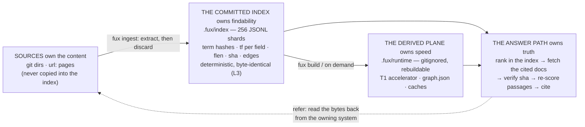
```mermaid
flowchart LR
  S["SOURCES own the content<br/>git dirs · url: pages<br/>(never copied into the index)"]
  I["THE COMMITTED INDEX owns findability<br/>.fux/index — 256 JSONL shards<br/>term hashes · tf per field · flen · sha · edges<br/>deterministic, byte-identical (L3)"]
  L["THE DERIVED PLANE owns speed<br/>.fux/runtime — gitignored, rebuildable<br/>T1 accelerator · graph.json · caches"]
  A["THE ANSWER PATH owns truth<br/>rank in the index → fetch the cited docs<br/>→ verify sha → re-score passages → cite"]
  S -- "fux ingest: extract, then discard" --> I
  I -- "fux build / on demand" --> L
  I --> A
  L --> A
  A -. "refer: read the bytes back<br/>from the owning system" .-> S
```

</details>

Sources own content. The committed index owns *findability*. The derived plane
owns *speed*. The answer path owns *truth*. Nothing in the first box is ever
copied into the second — that sentence is L2, and it is the reason the rest of
the design has the shape it has.

---

## 2. What is on disk

### 2.1 The `.fux/` directory — three kinds of file

`.fux/` holds three kinds of thing and the distinction is enforced: **committed**
files travel with the repository; **derived** files under `.fux/runtime/` are
gitignored and rebuildable from the committed ones; **acquired** files under
`.fux/acquired/` are gitignored and *not* rebuildable (they are fetched bytes
kept for later verification). `.fux/.gitignore` names `runtime/` and
`acquired/` and never a wildcard, and `fux doctor` asserts with `git
check-ignore` that the index itself is not ignored (SR-FUX-DIRECTORY d1–d5).



<details><summary>Mermaid source — Figure 2</summary>

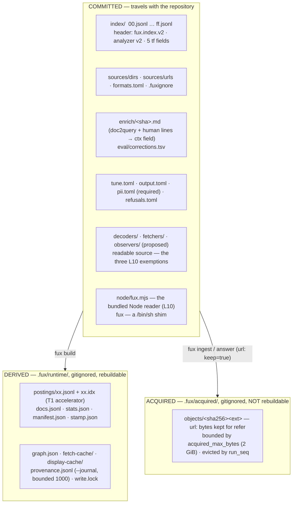
```mermaid
flowchart TB
  subgraph COMMITTED["COMMITTED — travels with the repository"]
    c1["index/  00.jsonl … ff.jsonl<br/>header: fux.index.v2 · analyzer v2 · 5 tf fields"]
    c2["sources/dirs · sources/urls · formats.toml · .fuxignore"]
    c3["enrich/&lt;sha&gt;.md  (doc2query + human lines → ctx field)<br/>eval/corrections.tsv"]
    c4["tune.toml · output.toml · pii.toml (required) · refusals.toml"]
    c5["decoders/ · fetchers/ · observers/ (proposed)<br/>readable source — the three L10 exemptions"]
    c6["node/fux.mjs — the bundled Node reader (L10)<br/>fux — a /bin/sh shim"]
  end
  subgraph DERIVED["DERIVED — .fux/runtime/, gitignored, rebuildable"]
    d1["postings/xx.jsonl + xx.idx (T1 accelerator)<br/>docs.jsonl · stats.json · manifest.json · stamp.json"]
    d2["graph.json · fetch-cache/ · display-cache/<br/>provenance.jsonl (--journal, bounded 1000) · write.lock"]
  end
  subgraph ACQUIRED["ACQUIRED — .fux/acquired/, gitignored, NOT rebuildable"]
    a1["objects/&lt;sha256&gt;&lt;ext&gt; — url: bytes kept for refer<br/>bounded by acquired_max_bytes (2 GiB) · evicted by run_seq"]
  end
  COMMITTED -- "fux build" --> DERIVED
  COMMITTED -- "fux ingest / answer (url: keep=true)" --> ACQUIRED
```

</details>

Two committed files deserve a sentence each. `pii.toml` is **required**: every
verb except `setup`, `tune` and `output` stops without it, because redaction
happens before extraction and a missing ruleset is not a default, it is an
unanswered question (SR-PII d17). And `.fux/decoders/` holds a *copy* of every
one of the seventeen built-in decoders — the copies are what run, so a consumer
edits one in place and the edit is the contract (L10).

### 2.2 The committed index — canonical JSONL, sharded by hash

The index is doc-major JSONL in exactly 256 shards, `00.jsonl` … `ff.jsonl`,
shard chosen by `blake2b(id, digest_size=1)`. One canonical encoder writes
every line — sorted keys, `(",", ":")` separators, `ensure_ascii=False`, no
floats, no nulls, NFC — and a shard is rewritten only if its bytes differ
(SR-INDEX-LIFECYCLE d1–d4). Every shard opens with the same header:

```json
{"_format":"fux.index.v2","analyzer":"v2","tf_fields":["body","heading","title","path","ctx"]}
```

A foreign header is refused, never mixed. Term keys are the first eight bytes of
a blake2b hash; a collision fails the build rather than merging two words
(SR-INDEX-LIFECYCLE d8; SR-POSTINGS d2). Git is the Merkle tree: the root
hash that names a corpus state is the commit's.



<details><summary>Mermaid source — Figure 3</summary>

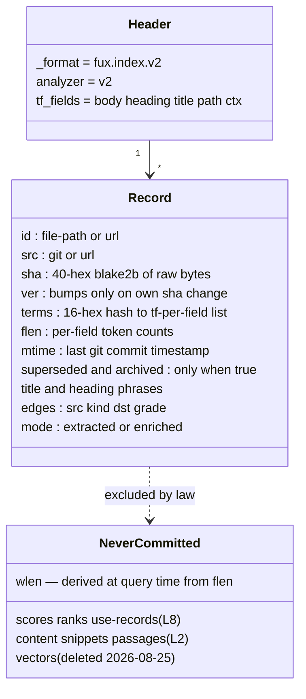
```mermaid
classDiagram
  class Header {
    _format = fux.index.v2
    analyzer = v2
    tf_fields = body heading title path ctx
  }
  class Record {
    id : file-path or url
    src : git or url
    sha : 40-hex blake2b of raw bytes
    ver : bumps only on own sha change
    terms : 16-hex hash to tf-per-field list
    flen : per-field token counts
    mtime : last git commit timestamp
    superseded and archived : only when true
    title and heading phrases
    edges : src kind dst grade
    mode : extracted or enriched
  }
  class NeverCommitted {
    wlen — derived at query time from flen
    scores ranks use-records (L8)
    content snippets passages (L2)
    vectors (deleted 2026-08-25)
  }
  Header "1" --> "*" Record
  Record ..> NeverCommitted : excluded by law
```

</details>

What a record carries (SR-INDEX-RECORD): an identity (`id`, `src`, `loc`); a
ledger (`sha` of the *raw* bytes taken before redaction, `ver` that bumps only
when the document's own `sha` changes); retrieval statistics (`terms` as
`{hash: [tf per field]}` with trailing zeros omitted, `flen` per field);
priors (`mtime` from the last git commit, `superseded`/`archived` only when
true); display (`title` and `phrases`); the graph (`edges`, re-resolved every
run); and policy (`mode`). ⚠ **Display used to fork on privacy** — `title_h`
instead of `title`/`phrases` when `meta` was `hashed` — and `meta` was the
second policy field; **both were deleted on 2026-09-20 and `_format` stepped to
v4** (SR-LAW-5, superseded). What it never carries is
as important: weighted length `wlen` is derived at query time from `flen` and
the current weights, so retuning a field weight never touches a committed byte;
no score, no rank, no content, no vector.

Body-first sparse encoding of the five fields measured **−36.7 %** on `tf`
bytes against the two-field layout it replaced; 92.5 % of postings are body-only
(SR-POSTINGS §1). The earlier vector lane had been 23.0 % of the committed
index — 8 094 chunk vectors across 1 304 records, 2.79 MB of 12.16 MB — before
it was removed ([§9](#9-what-was-designed-and-not-built)).

### 2.3 The derived plane and the acquired plane

`.fux/runtime/` is what `fux build` makes and what a clone can regenerate: the
T1 accelerator's term-major postings and their 62-byte `.idx` entries,
`docs.jsonl`, `stats.json`, a `manifest.json` and `stamp.json` that say which
committed bytes it was built from, `graph.json`, the fetch and display caches, a
bounded provenance journal, and `write.lock`. `.fux/acquired/` keeps `url:`
bytes by SHA-256 under a byte budget (default 2 GiB) with eviction by run
sequence, never by mtime (SR-ACQUIRED d1–d11); refusals are never stored.

---

## 3. Ingest — extract, then discard

`fux ingest` is five steps — walk, decode, extract, resolve edges, write — with
two gates inside them that carry laws.



<details><summary>Mermaid source — Figure 4</summary>

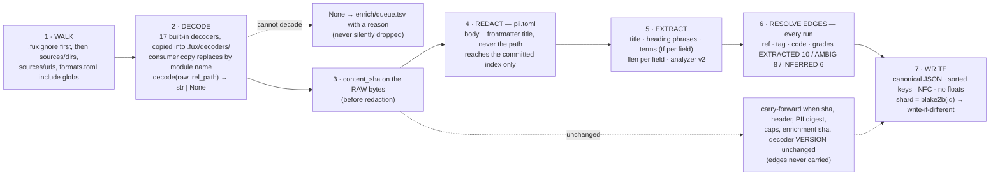
```mermaid
flowchart LR
  W["1 · WALK<br/>.fuxignore first, then sources/dirs,<br/>sources/urls, formats.toml include globs"]
  D["2 · DECODE<br/>17 built-in decoders, copied into .fux/decoders/<br/>consumer copy replaces by module name<br/>decode(raw, rel_path) → str | None"]
  Q["None → enrich/queue.tsv with a reason<br/>(never silently dropped)"]
  H["3 · content_sha on the RAW bytes<br/>(before redaction)"]
  R["4 · REDACT — pii.toml<br/>body + frontmatter title, never the path<br/>reaches the committed index only"]
  X["5 · EXTRACT<br/>title · heading phrases · terms (tf per field)<br/>flen per field · analyzer v2"]
  E["6 · RESOLVE EDGES — every run<br/>ref · tag · code · grades EXTRACTED 10 / AMBIG 8 / INFERRED 6"]
  O["7 · WRITE<br/>canonical JSON · sorted keys · NFC · no floats<br/>shard = blake2b(id) → write-if-different"]
  CF["carry-forward when sha, header, PII digest,<br/>caps, enrichment sha, decoder VERSION unchanged<br/>(edges never carried)"]
  W --> D --> H --> R --> X --> E --> O
  D -. "cannot decode" .-> Q
  H -. "unchanged" .-> CF -.-> O
```

</details>

**Walk.** `.fuxignore` is read first and outranks everything; then
`sources/dirs` (one path per line, `!` excludes, `archived=true` and
`enrich=true` attributes), `sources/urls` (per-line `fetch=`, `ttl=`, `keep=`,
`enrich=`, `archived=`, `update=`), and `formats.toml`'s `include` globs and
`[decoders]` table. (⚠ `meta=` was a seventh URL attribute until 2026-09-20.)

**Decode.** Seventeen built-in decoders — csv, docx, drawio, html, image, ini,
json, jsonl, mail, pdf, pptx, rtf, svg, toml, xlsx, xml, yaml — are listed by
name, never discovered by directory scan (L3). The protocol is one function,
`decode(raw, rel_path) -> str | None`; `None` queues the document in
`enrich/queue.tsv` with a reason and is never a silent drop. Tabular sources
become one passage per row, capped by `[index] max_table_rows` (default
20 000).

**The two gates.** The content hash is taken on the *raw* bytes; redaction
under `pii.toml` then runs on the body and frontmatter title (never the path)
and reaches the committed index only — acquired bytes, refer passages and
`fux answer` quotes are unredacted, which is the asymmetry the design intends.
⚠ **There used to be a second gate here and it was deleted on 2026-09-20**:
for any non-git source, `meta: hashed` was enforced inside `write_index` per
record before a shard was touched (L5; SR-INDEX-LIFECYCLE d13). **The placement
argument outlives the rule** — a check that lives in one caller is a convention,
not a property of the index — and it is why redaction sits where it does.

**Extract.** Title, heading phrases, `terms` with a tf per field, and `flen`
per field. The analyzer is v2: split identifiers, lowercase, drop stopwords,
Porter-stem (75/75 published test vectors), then blake2b-64 (SR-RANKING d9).

**Carry-forward.** When a document's `sha`, the index header, the PII ruleset
digest, the `[index]` caps, its enrichment content sha and the decoder's
`VERSION` are all unchanged, extraction is carried forward from the committed
record; `edges` are never carried — they are re-resolved every run because
their targets may have moved (SR-INGEST d1b, d15). Carry-forward made a
re-ingest 22.7–26.4× faster; 92 % of the old full ingest had been the
embedding step that no longer exists
(`2026-08-20-ingest-cost-profile`).

### 3.1 Enrichment — the model stays outside the wall

Fux never calls a model (L3). What it offers instead is a *place* for model
output and a check on it.



<details><summary>Mermaid source — Figure 5</summary>

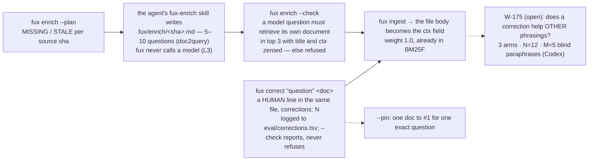
```mermaid
flowchart LR
  P["fux enrich --plan<br/>MISSING / STALE per source sha"]
  A["the agent's fux-enrich skill writes<br/>.fux/enrich/&lt;sha&gt;.md — 5–10 questions (doc2query)<br/>fux never calls a model (L3)"]
  C["fux enrich --check<br/>a model question must retrieve its own document<br/>in top 3 with title and ctx zeroed — else refused"]
  H["fux correct &quot;question&quot; &lt;doc&gt;<br/>a HUMAN line in the same file, corrections: N<br/>logged to eval/corrections.tsv; --check reports, never refuses"]
  PIN["--pin: one doc to #1 for one exact question"]
  I["fux ingest → the file body becomes the ctx field<br/>weight 1.0, already in BM25F"]
  M["W-175 (open): does a correction help OTHER phrasings?<br/>3 arms · N=12 · M=5 blind paraphrases (Codex)"]
  P --> A --> C --> I
  H --> I
  H -.-> PIN
  I -.-> M
```

</details>

`fux enrich --plan` lists what is MISSING or STALE per source sha. The
consumer's agent, through the `fux-enrich` skill, writes
`.fux/enrich/<sha>.md`: five to ten questions the document answers — the
doc2query idea (Nogueira et al. 2019) with the generator outside the tool. The
file body is indexed as the `ctx` field. `fux enrich --check` refuses a
model-written question that does not retrieve its own document in the top 3
with `title` and `ctx` zeroed — self-retrieval with the field it feeds
switched off, so a question cannot pass by being indexed (SR-ENRICH d15–d16).

`fux correct "<question>" <doc>` appends a **human** line to the same file,
bumps `corrections: N` in its frontmatter and logs the pair to
`eval/corrections.tsv`; `--check` reports on a human line but never refuses it,
and `--pin` is the deliberately brittle escape hatch that forces one document
to #1 for one exact question (SR-ENRICH d19, d19a). Whether a correction helps
*other phrasings* of the same question — the claim that made this design win
over an editorial pin — is unmeasured and is W-175 ([§10](#10-open-work)).

---

## 4. Query — rank in the index, then verify

### 4.1 The verbs



Twenty-three verbs in seven groups (SR-CLI §1). The ones a reader of this paper
needs: `ask` (ranked list with scores), `find` (paths only), `answer` (one
answer, referring the top three), `lexical` (BM25F alone, frozen, byte-identical
to `ask` today — it exists so that the graph-composed `ask` of W-161 has a
control), `explain` / `graph` / `path` (the graph plane), `inspect` (the index
X-ray), `correct` and `enrich` (§3.1), `doctor` (read-only health), `mcp` (the
protocol surface), `verify` (re-runs a receipt). Exit codes are `0`, `1`
(error) and `130` (interrupted); "No confident matches." is exit `0` on
stderr. Every read verb takes `--json`, `--band`, `--why`, `--expand`, `-q`
and the `--fast`/`--scan` pair.

### 4.2 `ask`, end to end



<details><summary>Mermaid source — Figure 7</summary>

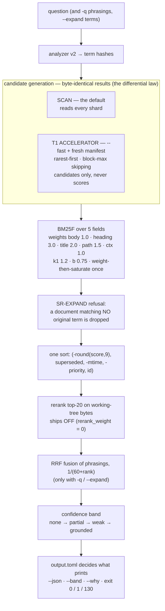
```mermaid
flowchart TB
  Q["question (and -q phrasings, --expand terms)"]
  AN["analyzer v2 → term hashes"]
  subgraph CAND["candidate generation — byte-identical results (the differential law)"]
    SC["SCAN — the default<br/>reads every shard"]
    T1["T1 ACCELERATOR — --fast + fresh manifest<br/>rarest-first · block-max skipping<br/>candidates only, never scores"]
  end
  BM["BM25F over 5 fields<br/>weights body 1.0 · heading 3.0 · title 2.0 · path 1.5 · ctx 1.0<br/>k1 1.2 · b 0.75 · weight-then-saturate once"]
  RF["SR-EXPAND refusal:<br/>a document matching NO original term is dropped"]
  TB["one sort: (-round(score,9), superseded, -mtime, -priority, id)"]
  RR["rerank top-20 on working-tree bytes<br/>ships OFF (rerank_weight = 0)"]
  RRF["RRF fusion of phrasings, 1/(60+rank)<br/>(only with -q / --expand)"]
  CB["confidence band<br/>none → partial → weak → grounded"]
  OUT["output.toml decides what prints<br/>--json · --band · --why · exit 0 / 1 / 130"]
  Q --> AN --> CAND --> BM --> RF --> TB --> RR --> RRF --> CB --> OUT
```

</details>

**Candidates.** The default path is a scan of every shard. With `--fast` and a
fresh manifest, the T1 accelerator produces the same candidate set from
term-major postings blocked at 128 with per-field maxima in a 62-byte index
entry: rarest term first, an exact threshold, and a block skipped when
`round(bound, 9) < round(theta, 9)` — block-max skipping (Ding & Suel 2011)
without a codec (SR-T1-ACCELERATOR d2–d8). The accelerator never scores; it
hands candidates and statistics to the one scorer. That is the **differential
law**: accelerator and scan are byte-identical on `ask --json`, and a test says
so on every change (SR-ASK d1–d5).

**Scoring.** BM25F over `body, heading, title, path, ctx` with weights
`(1.0, 3.0, 2.0, 1.5, 1.0)`, `k1 = 1.2`, `b = 0.75`, weight-then-saturate once,
`idf = log((n − df + 0.5)/(df + 0.5) + 1)` (SR-RANKING d1–d4). The `title`,
`path` and `ctx` weights are recorded as *carried forward from nothing* —
starting points, not measured values. The three ranking priors the design once
had (`archived_weight`, `superseded_weight`, `recency_half_life_days`) were
**removed on 2026-09-13** after W-143 measured that no single global value of
any of them clears a zero-broken bar on any rung; `superseded` and `mtime`
reach ranking only through the tie-break now.

**One sort.** `(-round(score, 9), superseded, -mtime, -priority, id)`. Before
W-111 fixed this, 4.38 % of top-5 orderings on the playground were decided by
`id` alone (`2026-08-25-rank-flip-susceptibility`).

**Rerank.** A proximity reranker over the top 20, re-reading working-tree
bytes, ships **off** (`rerank_weight = 0`): its cost is measured — +18.9 ms p50
at rung 100, +15.3 ms at rung 1 000, a constant not a slope
(`2026-09-13-rerank-cost`) — and its benefit could not clear the floor on the
playground (28 → 32, net 4; `2026-08-24-rerank-and-goldens`, marked). W-154
waits on a quality endpoint that does not yet exist.

### 4.3 Expansion and fusion

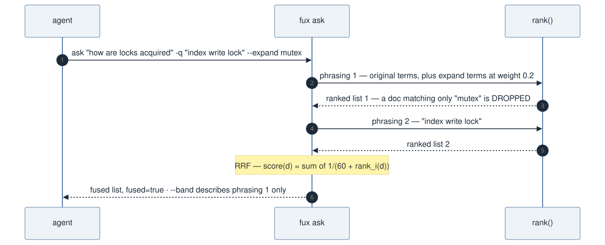

<details><summary>Mermaid source — Figure 8</summary>

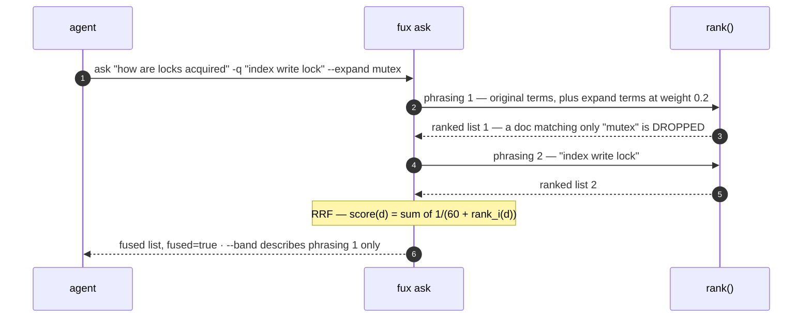
```mermaid
sequenceDiagram
  autonumber
  participant A as agent
  participant F as fux ask
  participant R as rank()
  A->>F: ask "how are locks acquired" -q "index write lock" --expand mutex
  F->>R: phrasing 1 — original terms, plus expand terms at weight 0.2
  R-->>F: ranked list 1 — a doc matching only "mutex" is DROPPED
  F->>R: phrasing 2 — "index write lock"
  R-->>F: ranked list 2
  Note over F: RRF — score(d) = sum of 1/(60 + rank_i(d))
  F-->>A: fused list, fused=true · --band describes phrasing 1 only
```

</details>

`--expand` adds caller-supplied terms at `[ranking] expand_weight = 0.2` (the
1:5 ratio Query2doc reports; recorded as unmeasured here). The rule that makes
expansion safe is a **refusal**: a document that matches no *original* term is
dropped inside `rank()`, so an expansion can reorder the answer set but never
invent a member of it (SR-EXPAND d3). `-q` is repeatable; phrasings are fused
in rank space by reciprocal rank fusion, `1/(k + rank)` with `k = 60` (Cormack,
Clarke & Büttcher 2009), not a tune key, and `--json` says `"fused": true`.
The W-109 gate measured **16 fixed / 0 broken, 28/50 → 44/50** on the
playground goldens (`2026-09-05-expand`, informed).

### 4.4 The graph plane



<details><summary>Mermaid source — Figure 9</summary>

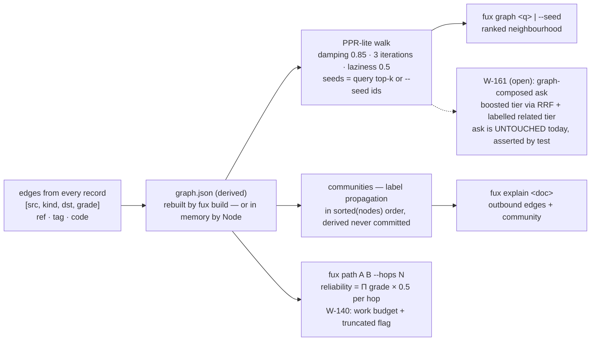
```mermaid
flowchart LR
  E["edges from every record<br/>[src, kind, dst, grade]<br/>ref · tag · code"]
  G["graph.json (derived)<br/>rebuilt by fux build — or in memory by Node"]
  P["PPR-lite walk<br/>damping 0.85 · 3 iterations · laziness 0.5<br/>seeds = query top-k or --seed ids"]
  C["communities — label propagation<br/>in sorted(nodes) order, derived never committed"]
  V1["fux explain &lt;doc&gt;<br/>outbound edges + community"]
  V2["fux graph &lt;q&gt; | --seed<br/>ranked neighbourhood"]
  V3["fux path A B --hops N<br/>reliability = Π grade × 0.5 per hop<br/>W-140: work budget + truncated flag"]
  W["W-161 (open): graph-composed ask<br/>boosted tier via RRF + labelled related tier<br/>ask is UNTOUCHED today, asserted by test"]
  E --> G --> P --> V2
  G --> C --> V1
  G --> V3
  P -.-> W
```

</details>

Every record's `edges` — `ref`, `tag`, `code`, graded EXTRACTED 10, AMBIG 8,
INFERRED 6 — are assembled into a derived `graph.json` (Node rebuilds it in
memory instead). `fux graph` runs a lazy personalised-PageRank walk — damping
0.85, three iterations, laziness 0.5, the laziness added because the plain walk
let a three-hop neighbour outrank a two-hop one — seeded by the query's top-k or
by `--seed` ids with mass in argument order (SR-GRAPH d3–d6, d9–d13).
Communities come from label propagation in `sorted(nodes)` order and are
derived, never committed. `fux path` enumerates directed routes with
reliability = product of grades × 0.5 per hop; because it enumerates every
simple route, `--hops 6` on this repository's 738-node graph took 84.6 s
against 0.65 s at `--hops 2`, and the 2026-09-14 ruling bounds the walk's
*work* and returns `truncated` in every rendering rather than capping the
argument (W-140, `compare/path-hops-bound`). Three parameters — edge `kinds`,
link-IDF (`1/(1 + ln(1 + n))`; `CLAUDE.md` with 180 inbound links ≈ 0.16) and
`max_hops` — shipped inert on 2026-09-14 ahead of W-161. **`ask` does not touch
the graph today**, and a test asserts it; the composed `ask` is pre-registered
and unmeasured ([§10](#10-open-work)).

### 4.5 `answer` — the refer plane



<details><summary>Mermaid source — Figure 10</summary>

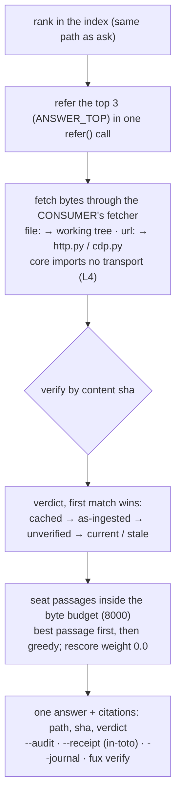
```mermaid
flowchart TB
  R["rank in the index (same path as ask)"]
  T["refer the top 3 (ANSWER_TOP) in one refer() call"]
  F["fetch bytes through the CONSUMER's fetcher<br/>file: → working tree · url: → http.py / cdp.py<br/>core imports no transport (L4)"]
  V{"verify by content sha"}
  L["verdict, first match wins:<br/>cached → as-ingested → unverified → current / stale"]
  S["seat passages inside the byte budget (8000)<br/>best passage first, then greedy; rescore weight 0.0"]
  O["one answer + citations: path, sha, verdict<br/>--audit · --receipt (in-toto) · --journal · fux verify"]
  R --> T --> F --> V --> L --> S --> O
```

</details>

`answer` ranks exactly as `ask` does, then *refers* the top three documents in
one call (SR-ANSWER d11) — three rather than one because on 18 of 43 playground
queries the winning passage came from document 2 or 3, and the change measured
**13 fixed / 0 broken, recall 0.4341 → 0.8256** at a byte cost of 2 517 →
6 467 (`2026-09-05-answer-top3`, informed). Bytes are fetched through the
consumer's own fetcher — `http.py` or `cdp.py` in `.fux/fetchers/` — so the
core imports no transport (L4). Each document is verified by content sha and
labelled with one of **five** verdicts, first match wins: `cached`,
`as-ingested`, `unverified`, then `current` or `stale` (SR-URL-FRESHNESS;
SR-REFER d19). Per-URL `ttl=` defaults to 24 h and the effective TTL is the
minimum of the declared value and the policy's, whose default is 0 — caching
off unless asked for. Passages are seated inside a byte budget (8 000 default,
80 bytes of citation overhead each), best passage first then greedy; the
passage re-score uses the same arithmetic as the document reranker at weight
0.0 (SR-REFER d10–d12, d21). R4 measured a cold `k = 10` answer at **1.113 s
p95** against a 3 s bar, warm at 0.016 s (`2026-08-20-refer-plane-r4`); the
fetches are serial.

Provenance is a first-class surface: `--why` explains matched terms per
document, the four gates, the cut line and the tune deltas; `--receipt` emits
an unsigned in-toto statement; `--journal` (the only writing flag) appends to a
gitignored, bounded journal; `fux verify <receipt>` re-runs it to a four-state
verdict (SR-ASK d12; SR-CLI d9b; SR-PROVENANCE).

### 4.6 Confidence — a band, not a number



<details><summary>Mermaid source — Figure 11</summary>

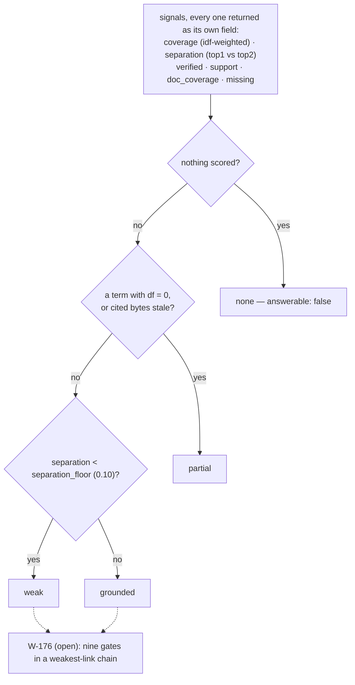
```mermaid
flowchart TB
  S["signals, every one returned as its own field:<br/>coverage (idf-weighted) · separation (top1 vs top2)<br/>verified · support · doc_coverage · missing"]
  N{"nothing scored?"}
  P{"a term with df = 0,<br/>or cited bytes stale?"}
  W{"separation &lt; separation_floor (0.10)?"}
  B0["none — answerable: false"]
  B1["partial"]
  B2["weak"]
  B3["grounded"]
  G["W-176 (open): nine gates in a weakest-link chain"]
  S --> N
  N -- yes --> B0
  N -- no --> P
  P -- yes --> B1
  P -- no --> W
  W -- yes --> B2
  W -- no --> B3
  B2 -.-> G
  B3 -.-> G
```

</details>

Fux does not emit a probability. It computes independent signals — idf-weighted
`coverage`, `separation` between the top two scores, `verified`, `support`,
`doc_coverage`, and the `missing` terms — returns each as its own field, and
folds them into a **band** by first-true-wins: `none` (nothing scored;
`answerable: false`), `partial` (a query term with `df = 0`, or cited bytes
`stale`), `weak` (`separation` below `separation_floor`, 0.10 — recorded as "a
starting value with no standing"), else `grounded` (SR-CONFIDENCE d3, d6,
d12–d13). The band is always emitted over MCP; on the CLI it prints under
`--band` or `[cli] band = true` in `output.toml` (d11).

**The honest state of abstention.** On a blind set of 20 unanswerable
questions fux answered 20 of 20, twice, fourteen days apart
(`2026-08-28-blind-unanswerable`, `2026-09-11-…-rerun`); on the golden ladder,
0 abstentions of 124 on every rung while the key holds 12 unanswerables
(`2026-09-12-golden-ladder`); in the benchmark, 10 of 10 planted unanswerables
answered by both versions. The engine can abstain only when nothing matches at
all. The nine gates that address this were ruled on 2026-09-14 and are W-176
([§10](#10-open-work)): the verdict stays a weakest-link chain — one failed
gate makes the answer unanswerable and names the gate — never a blended score,
because a single `0.73` averages independent failure modes and an agent handed
`0.73` hedges in prose where an agent handed `answerable: false` stops.

---

## 5. Two readers, one set of bytes



<details><summary>Mermaid source — Figure 12</summary>

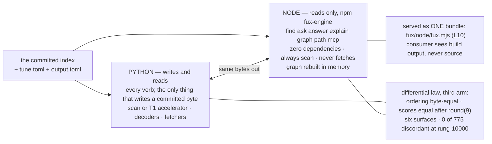
```mermaid
flowchart LR
  I["the committed index<br/>+ tune.toml + output.toml"]
  P["PYTHON — writes and reads<br/>every verb; the only thing that writes a committed byte<br/>scan or T1 accelerator · decoders · fetchers"]
  N["NODE — reads only, npm fux-engine<br/>find ask answer explain graph path mcp<br/>zero dependencies · always scan · never fetches<br/>graph rebuilt in memory"]
  B["served as ONE bundle: .fux/node/fux.mjs (L10)<br/>consumer sees build output, never source"]
  D["differential law, third arm:<br/>ordering byte-equal · scores equal after round(9)<br/>six surfaces · 0 of 775 discordant at rung-10000"]
  I --> P
  I --> N
  N --- B
  P <-- "same bytes out" --> N
  P --- D
  N --- D
```

</details>

Python writes and reads — every verb, and the only thing that writes a
committed byte. Node (`fux-engine` on npm, invoked as `fux`) is a second
*reader*: seven read verbs, zero dependencies, always the scan, never fetches,
rebuilds the graph plane in memory, and declines to refer what it cannot
decode (SR-NODE-SEARCH d3–d4, d9–d11). It reads `tune.toml` and `output.toml`
as Python does — until 2026-09-12 it did not, and this repository disagreed on
90 of 174 orderings; after, 0 of 199.

The consumer sees Node as **one generated file**, `.fux/node/fux.mjs`, built at
publish into both registries (L10): 244 KB where the vendored source tree had
been 44–47 files. The Python side is served the same way — installed by pip,
with `.fux/decoders/` and `.fux/fetchers/` the readable exceptions.

The two readers are the third arm of the differential law: ordering byte-equal,
printed scores equal after `round(9)`, across six surfaces (`find`, `ask`, the
graph verbs, an MCP stdio session, `fux.api` against `node/src/index.mjs`,
bundle against module tree). `Math.log` and `math.log` differ by one ulp on
655 of 100 000 arguments on darwin and 722 on glibc; none survives `round(9)`
(`2026-09-05-node-log-divergence`, blind). Three semantics had to be
reimplemented in Node to get there: half-even rounding, `repr(float)`
thresholds, and code-point string comparison — 30 of 324 string pairs had
disagreed. On `rung-00100` and `rung-10000`: **0 of 775 discordant**
(`2026-09-12-node-tune-and-surfaces`).

Two more surfaces read the same bytes. `fux mcp` is a hand-rolled stdio
JSON-RPC server with three tools — `fux_search`, `fux_passage`, `fux_related`
— and deliberately **no** `answer`: the agent is the answerer (SR-MCP d1–d3,
d11). `from fux import open` is a read-only library whose `as_dict()` equals
the `--json` payload, with one `output.schema.json` shared by CLI, Python and
Node (SR-API).

---

## 6. Agent surfaces and maintenance

### 6.1 What `fux setup` writes, and where



<details><summary>Mermaid source — Figure 13</summary>

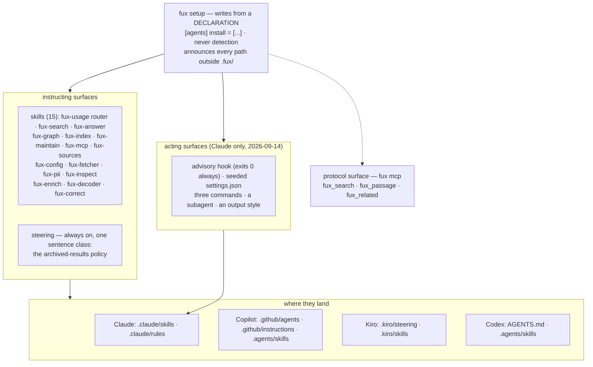
```mermaid
flowchart TB
  SU["fux setup — writes from a DECLARATION<br/>[agents] install = [...] · never detection<br/>announces every path outside .fux/"]
  subgraph INSTRUCTING["instructing surfaces"]
    SK["skills (15): fux-usage router · fux-search · fux-answer<br/>fux-graph · fux-index · fux-maintain · fux-mcp · fux-sources<br/>fux-config · fux-fetcher · fux-pii · fux-inspect<br/>fux-enrich · fux-decoder · fux-correct"]
    ST["steering — always on, one sentence class:<br/>the archived-results policy"]
  end
  subgraph ACTING["acting surfaces (Claude only, 2026-09-14)"]
    AC["advisory hook (exits 0 always) · seeded settings.json<br/>three commands · a subagent · an output style"]
  end
  subgraph VENDORS["where they land"]
    V1["Claude: .claude/skills · .claude/rules"]
    V2["Copilot: .github/agents · .github/instructions · .agents/skills"]
    V3["Kiro: .kiro/steering · .kiro/skills"]
    V4["Codex: AGENTS.md · .agents/skills"]
  end
  MCP["protocol surface — fux mcp<br/>fux_search · fux_passage · fux_related"]
  SU --> INSTRUCTING --> VENDORS
  SU --> ACTING --> V1
  SU -.-> MCP
```

</details>

Fux ships *policy*, not only facts (SR-AGENT-POLICY d1). `fux setup` installs
from a declaration — `[agents] install` — never from detection, and announces
every path it writes outside `.fux/`. Four vendors are served: Claude, GitHub
Copilot, Kiro and OpenAI Codex. Surfaces are classified by what they *do*
(SR-AGENT-SURFACES): *instructing* (fifteen guide skills behind a `fux-usage`
router, plus steering), *acting* (a hook that is advisory and always exits 0,
seeded settings, commands, a subagent, an output style — Claude only as of
2026-09-14), *protocol* (the MCP tool descriptions, one file read by both
runtimes) and *emitted* (CLI output, the busiest surface fux has). The test
that decides steering from skill: *does an agent that has never heard of fux
still need this sentence to avoid being wrong?* Only the archived-results
policy passes it; skills that write committed code (`fux-enrich`,
`fux-decoder`) are never ambient (d9, d9a).

### 6.2 Keeping the index current without blocking anyone



<details><summary>Mermaid source — Figure 14</summary>

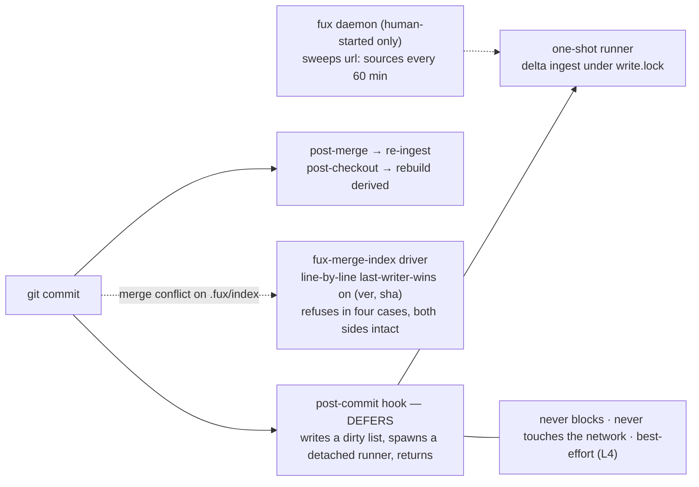
```mermaid
flowchart LR
  C["git commit"]
  PC["post-commit hook — DEFERS<br/>writes a dirty list, spawns a detached runner, returns"]
  RN["one-shot runner<br/>delta ingest under write.lock"]
  PM["post-merge → re-ingest<br/>post-checkout → rebuild derived"]
  MD["fux-merge-index driver<br/>line-by-line last-writer-wins on (ver, sha)<br/>refuses in four cases, both sides intact"]
  DA["fux daemon (human-started only)<br/>sweeps url: sources every 60 min"]
  L["never blocks · never touches the network · best-effort (L4)"]
  C --> PC --> RN
  C --> PM
  C -. "merge conflict on .fux/index" .-> MD
  DA -.-> RN
  PC --- L
```

</details>

The `post-commit` hook **defers**: it writes a dirty list, spawns a detached
one-shot runner and returns, so the commit pays git's cost and nothing else.
That is the answer to R5, which measured an inline hook at 44.4 s on 100 000
documents, 3.52 s at 10 000, 0.651 s at 1 000 against a 1 s bound
(`2026-08-20-r5-hook-latency`, FAIL); after the deferral a one-document
re-ingest at 10 000 is 0.84 s (`2026-08-23-r5-rerun`). `post-merge`
re-ingests, `post-checkout` rebuilds the derived plane; all are best-effort,
cannot block, and never touch the network. Every index writer takes one
`write.lock` (SR-MAINTENANCE d1–d8).

Merging two branches that both ingested is a git merge driver,
`fux-merge-index`: line-by-line last-writer-wins on `(ver, sha)`, refusing in
four cases with ordinary conflict markers and both sides intact
(SR-MERGE-DRIVER d1–d7); R6-MERGE-RERUN passed (`2026-08-22-r6-rerun`). The
daemon that sweeps `url:` sources is started only by a human.

### 6.3 The observer hook (proposed)


<details><summary>Mermaid source — Figure 15</summary>

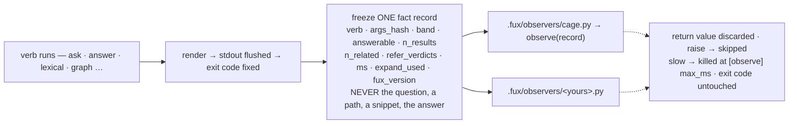
```mermaid
flowchart LR
  V["verb runs — ask · answer · lexical · graph …"]
  R["render → stdout flushed → exit code fixed"]
  F["freeze ONE fact record<br/>verb · args_hash · band · answerable · n_results<br/>n_related · refer_verdicts · ms · expand_used · fux_version<br/>NEVER the question, a path, a snippet, the answer"]
  O1[".fux/observers/cage.py → observe(record)"]
  O2[".fux/observers/&lt;yours&gt;.py"]
  X["return value discarded · raise → skipped<br/>slow → killed at [observe] max_ms · exit code untouched"]
  V --> R --> F --> O1
  F --> O2
  O1 -.-> X
  O2 -.-> X
```

</details>

Ruled on 2026-09-14 and recorded as SR-OBSERVE (`proposed`): after a verb has
fully rendered, fux hands every file in `.fux/observers/` one frozen record of
counts and names — never the question, a path, a snippet or the answer — and
discards whatever comes back. A raising observer is skipped, a slow one is
killed at `[observe] max_ms`, and the verb's output and exit code are
byte-identical with zero, one or a misbehaving observer installed. Fux ships no
observer and names no subscriber; the first will be `cage`'s search-usage leg.
The hook is *after* render and not before the verb on purpose: a pre-verb
middleware would make `ask` a function of consumer code, and L3 would be gone.
`.fux/observers/` is the third L10 exemption for the same reason the other two
exist — the consumer writes that code.

---

## 7. What is measured

Every number below names its run under `work/regression/` and the class it
was filed under. Four runs from 2026-08-24/25 are *marked*: they were filed
under a bar that admits chance, and by the maintainer's ruling they are marked
rather than re-judged, because nothing supersedes a measurement except a better
measurement. Their "no change" verdicts survive; their improvement claims do
not.

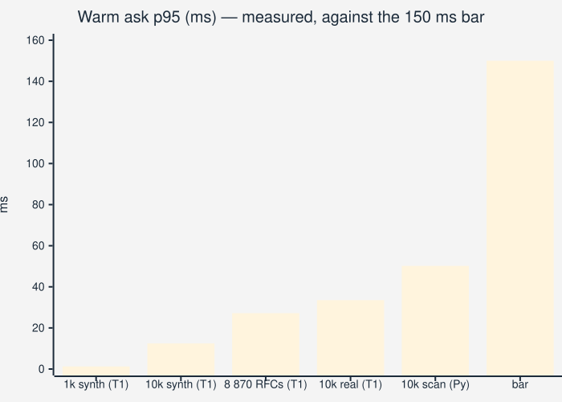

| what | value | run · date | class |
|---|---|---|---|
| Warm `ask` p95, synthetic, T1 | **1.25 ms** at 1 000 docs · **12.46 ms** at 10 000 · linear in document count; scan 25.07 ms | `2026-08-22-r9-t2-at-10k` · R9 PASS vs 150 ms | — |
| Warm `ask` p95, real corpus, T1 | **27.2 ms** worst case on 8 870 RFCs (scan 4 248.8 ms); 5 536 differential comparisons | `2026-08-12-m2-accelerator` · R3 PASS | — |
| Warm `ask` p95, real 10k, T1 | 33.53 ms; per-field bound costs +0.0 % blocks | `2026-08-23-fork3-per-field-bound` | — |
| Python scan p95 at 10k, in-process | **50.2 ms** over 240 queries | `2026-09-05-node-log-divergence` | blind |
| Cold `answer`, k = 10 | 1.113 s p95 vs 3 s; warm 0.016 s | `2026-08-20-refer-plane-r4` · R4 PASS | — |
| Committed bytes per document | **230** packed (synthetic 10k: 14.2 MB tree, 2.3 MB packed) · **4 922** packed on real prose | `2026-08-22-r9-t2-at-10k` · `2026-08-21-r7-preliminary-analysis` | — |
| Benchmark index, 2.0.0-alpha.7 vs 1.0.0 | 5.1 % smaller (13 360 vs 14 076 B/doc) | `2026-09-13-benchmark-captures` | informed |
| Wheel size | 6.84 MB → **233 KB** after the vector lane left; index −22.6 %; full ingest 6.8× faster | `2026-08-25-model-removal` | informed |
| P1 — pruned postings | **FAIL**: best of five selectors 35.9 pts below unpruned recall@20 at 6 % retention | `2026-08-09-pruning-rerun` | — |
| DENSE-CHUNK — vector lane | **FAIL**: 0 fixed / 2 broken vs ≥ 3 / 0 | `2026-08-24-dense-lane-gate` | — |
| Vector determinism, same build | arm64 vs x86-64: cosine 1.000000, 124/124 int8 vectors identical; two *implementations*: 0/125 identical, 41/50 top-5 discordant | `2026-09-12-vector-gate-crossarch` · `2026-09-05-vector-gate` | informed |
| Four ranking priors (W-143) | **NO** for all four on every rung: every value reaching 13/13 current-seeking drags history-seeking to ≤ 5/13 | `2026-09-12-priors-and-tables` | informed |
| Table tokens in `flen` (W-144) | excluding them: hit@1 0/30 → 30/30, p ≈ 0; the ranker loses above a table share of 0.26–0.29 (ladder median 0.344) | `2026-09-12-reaim-and-instruments` | informed |
| Table *is* the answer (W-155) | the same exclusion: `dump` 30/30 → 0/30, `content` 0/30 → 30/30 — decided by *where* the term sits | `2026-09-13-table-is-the-answer` | informed |
| `--expand` / `-q` (W-109) | 16 fixed / 0 broken; 28/50 → 44/50 | `2026-09-05-expand` | informed |
| `answer` top-3 | 13 fixed / 0 broken; recall 0.4341 → 0.8256; 8/43 `grounded` → `weak` | `2026-09-05-answer-top3` | informed |
| Playground recall (43 complete goldens) | recall@1 0.5969 · @3 0.8566 · @5 0.9535 · @10 0.9884; annotator κ = 0.960 | `2026-08-28-first-recall` · `-annotator-agreement` | informed |
| Abstention | 0 of 20 blind unanswerables, twice; 0 of 124 on every golden rung; 10/10 planted answered | `2026-08-28-blind-unanswerable` · `2026-09-12-golden-ladder` · `2026-09-13-benchmark-captures` | blind set / informed |
| Rerank cost | +18.9 / +18.0 ms p50 at rung 100 (ask / answer); +15.3 / +14.8 at rung 1 000; a constant | `2026-09-13-rerank-cost` | surface capture |
| Rerank benefit | 28 → 32 on the playground, net 4 — cannot clear the floor | `2026-08-24-rerank-and-goldens` | marked |
| Hook latency (R5) | inline: 44.4 s @100k · 3.52 s @10k · 0.651 s @1k vs 1 s → **FAIL**, hence deferral; one-doc re-ingest 0.84 s @10k after | `2026-08-20-r5-hook-latency` · `2026-08-23-r5-rerun` | — |
| Ingest carry-forward | 22.7× / 26.4× faster re-ingest | `2026-08-20-ingest-cost-profile` | — |
| Two readers | 0 of 775 orderings discordant on `rung-00100` + `rung-10000`; `Math.log` one-ulp on 655/100 000, none survive `round(9)` | `2026-09-12-node-tune-and-surfaces` · `2026-09-05-node-log-divergence` | blind |
| `path --hops` | 0.65 s at 2 hops · 7.33 s at 5 · **84.6 s at 6** on 738 nodes / 4 446 edges | `compare/path-hops-bound` (2026-09-12) | — |
| `inspect` floors | unreachable ≤ 0.01 and near-duplicate ≤ 0.20 ship *provisional*; boilerplate at 0.60 is weak; ladder vocabulary 9 619 → 20 163 terms over 100×, Heaps β 0.599 → 0.20 | `2026-09-14-inspect-floors` | blind |
| Golden ladder | rungs seed(20) / 100 / 200 / 500 / 1 000 → seven rungs to 10 000; 124 released questions, 12 unanswerable; hit@5 ≤ 94/124 by structure at rung 1 000; **not yet scored** — phase 5 is Codex's, 2026-09-30 | `2026-09-12-golden-ladder` | informed |

Two things the table says between its rows. First, the headline latency is an
accelerator number and the *default* path is the scan — 50.2 ms at 10 000
documents, still a third of the bar. Second, the only recall figures fux has
are informed: they come from a playground set whose questions were visible to
the people tuning the engine. The golden ladder exists to replace them, and its
key is sealed until Codex regenerates it.

---

## 8. Evaluation discipline

The architecture is the smaller half of what this repository has learned. The
larger half is how it decides whether a ranking change is real.



<details><summary>Mermaid source — Figure 17</summary>

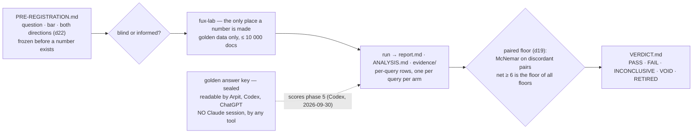
```mermaid
flowchart LR
  PR["PRE-REGISTRATION.md<br/>question · bar · both directions (d22)<br/>frozen before a number exists"]
  CL{"blind or informed?"}
  ENV["fux-lab — the only place a number is made<br/>golden data only, ≤ 10 000 docs"]
  RUN["run → report.md · ANALYSIS.md · evidence/<br/>per-query rows, one per query per arm"]
  FL{"paired floor (d19):<br/>McNemar on discordant pairs<br/>net ≥ 6 is the floor of all floors"}
  V["VERDICT.md<br/>PASS · FAIL · INCONCLUSIVE · VOID · RETIRED"]
  K["golden answer key — sealed<br/>readable by Arpit, Codex, ChatGPT<br/>NO Claude session, by any tool"]
  PR --> CL --> ENV --> RUN --> FL --> V
  K -. "scores phase 5 (Codex, 2026-09-30)" .-> RUN
```

</details>

**Pre-registration.** A prediction is frozen in `PRE-REGISTRATION.md` before
any number exists and is never edited afterwards, not even to fix a link; a
threshold never moves — re-judging at a new size is a new id; ids are never
reused; a verdict is added to, never edited (SR-RS d1–d5). Since 2026-09-11
every pre-registration states **both directions** — more of the good thing
*and* no more of the bad thing — and reports headroom per endpoint per
direction, so "no detected change" with zero headroom reads *Inconclusive*
(d22). Test data must exercise the feature it measures; a missing input is a
data defect fixed in the data, never a null (d23).

**Blind or informed.** A run is *blind* only if every artifact — enrichment,
prompt, chunking, tune, analysis — was authored with no access to the queries,
judgments or prior scores. An informed run is reclassified, never banned, and
never supplies a delta on its own (d11–d13; the TREC manual/automatic split).
The authorship section has been mandatory since 2026-08-25.

**The paired floor.** Two arms are compared by an exact McNemar test on the
discordant pairs. A net of one to five flips cannot reach α = 0.05 at *any*
pair count (best attainable p: 1.00, 0.50, 0.25, 0.125, 0.0625), so **six is
the floor of all floors** — and only when all six flip the same way; eight are
needed at 8–12 discordant pairs, sixteen at fifty. Per-query rows, one per
query per arm, are mandatory, and `verdict.py` computes the exact binomial
(d19, d19a; ruled 2026-08-28). Four earlier runs filed under a ±2 floor are
marked for exactly this reason.

**Five endings.** PASS · FAIL (recorded as *a success of the method* — P1 and
R5 are the examples) · INCONCLUSIVE (the instrument could not decide) · VOID
(the bar could not decide; only the maintainer voids) · RETIRED.

**Three environments** (SR-WORK-ENVIRONMENTS, 2026-09-11). `fux-playground`
is the maintainer's hands only — no agent, no test, no number. `fux-lab` runs
every measurement, on the golden data only, at or under 10 000 documents.
`fux-benchmark` compares exactly two versions — the current build and the
newest previous major — on corpora of 100 to 10 000 documents, and its captures
are the seven SR-WORK-BENCHMARK names. Golden data is **local-only**; CI's
corpus arm was dropped on 2026-09-14.

**The golden ladder and its sealed key.** `work/golden/` holds rungs built and
committed before the questions directory was opened, 124 released questions in
a 40/30/20/10 category mix, 12 of them unanswerable. The answer key is readable
by the maintainer, Codex and ChatGPT and by **no Claude session, by any tool**
— a leak does not fail loudly, it yields a benchmark number that looks clean.
Every golden number is *informed* until Codex regenerates the key on
2026-09-30 (W-145).

**Design point.** 10 000 documents, a ceiling on both measurement and
commitment since 2026-08-22 (SR-WORK-SCALE). No prediction is stated above it.

---

## 9. What was designed and not built

v0.2 of this paper (2026-08-09) proposed a specific machine. Most of it was
measured and did not ship. The paper is not rewritten to hide that; the
mapping is the record.



<details><summary>Mermaid source — Figure 18</summary>

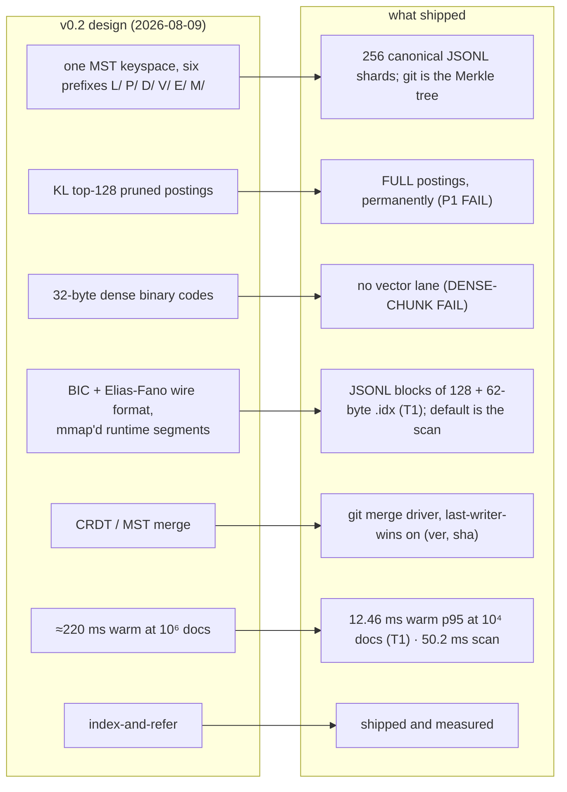
```mermaid
flowchart LR
  subgraph V02["v0.2 design (2026-08-09)"]
    d1["one MST keyspace, six prefixes L/ P/ D/ V/ E/ M/"]
    d2["KL top-128 pruned postings"]
    d3["32-byte dense binary codes"]
    d4["BIC + Elias-Fano wire format,<br/>mmap'd runtime segments"]
    d5["CRDT / MST merge"]
    d6["≈220 ms warm at 10⁶ docs"]
    d7["index-and-refer"]
  end
  subgraph V10["what shipped"]
    b1["256 canonical JSONL shards; git is the Merkle tree"]
    b2["FULL postings, permanently (P1 FAIL)"]
    b3["no vector lane (DENSE-CHUNK FAIL)"]
    b4["JSONL blocks of 128 + 62-byte .idx (T1); default is the scan"]
    b5["git merge driver, last-writer-wins on (ver, sha)"]
    b6["12.46 ms warm p95 at 10⁴ docs (T1) · 50.2 ms scan"]
    b7["shipped and measured"]
  end
  d1 --> b1
  d2 --> b2
  d3 --> b3
  d4 --> b4
  d5 --> b5
  d6 --> b6
  d7 --> b7
```

</details>

| v0.2 said | what happened | where it is recorded |
|---|---|---|
| Six key prefixes in one Merkle-Search-Tree keyspace with a state-based-CRDT merge | Never built. Git itself supplies the Merkle tree; the committed plane is 256 canonical JSONL shards; merge is a git merge driver with last-writer-wins on `(ver, sha)` | SR-INDEX-LIFECYCLE · SR-MERGE-DRIVER |
| Pruned per-document term statistics — KL-ranked top-128 terms | **Falsified.** P1 closed FAIL 2026-08-09: 35.9 points below unpruned recall@20 at 6 % retention. Full postings, permanently; *"if pruning appears in any milestone's diff, that is a plan violation"* | SR-POSTINGS d8 · `2026-08-09-pruning-rerun` |
| 32-byte dense binary codes as part of the committed index; a dense scan at 35–50 ms | Built, measured, **deleted** 2026-08-25. DENSE-CHUNK: 0 fixed / 2 broken. The lane, the model, the committed vectors and `ask --hybrid` are gone; the wheel went 6.84 MB → 233 KB | SR-ASK d9 · `2026-08-24-dense-lane-gate` · `2026-08-25-model-removal` |
| BIC + 4-bit impacts, MPH dictionary, Elias-Fano offsets, ~2.5 GB of mmap'd runtime segments | None built. The derived plane is JSONL blocks of 128 with a 62-byte binary index entry, and the *default* query path is a scan that needs no build at all | SR-T1-ACCELERATOR d3 |
| ≈ 220–290 MB committed at 10⁶ documents; ≈ 220 ms warm | Not re-derived. 10⁶ is two orders of magnitude above the design point. At 10⁴: 230 packed B/doc synthetic, 4 922 real; 12.46 ms p95 on the accelerator, 50.2 ms on the scan | SR-WORK-SCALE · R9 |
| Ingest modes *inferred* and *AI-assisted*; YAKE phrases; model-inferred edges | Renamed `extracted` / `enriched` (`inferred` was an edge grade). Enrichment is an agent skill producing doc2query questions into a committed file; fux never calls a model | SR-ENRICH · SR-GRAPH d8a |
| Sources: git dirs, Confluence, SharePoint, web; adapters capped at three | What exists is `file:` and `url:`, the latter through consumer-owned `http.py` and `cdp.py`. No Confluence adapter | SR-FETCHER · SR-CDP-FETCHER |
| P4 cold answer ≤ 3 s *(k = 10, parallel)* · P5 clone→first-answer ≤ 5 min *(inflate + rederive)* · P7 20-doc commit re-indexes < 1 s | R4 PASS at 1.113 s — serially; there is no inflate step, the scan needs no build; R5 FAIL at scale, and the hook now defers | `2026-08-20-refer-plane-r4` · `2026-08-20-r5-hook-latency` |

The paper's central claim survived intact and is the thing that was measured:
a small deterministic index carried in git, content left where it lives,
freshness verified per answer. The engine that lost a semantic lane got
smaller, not less able.

A third of what §9 lists was removed *by the method §8 describes* — P1, R5 and
DENSE-CHUNK are FAIL verdicts on pre-registered bars, filed with the same care
as the passes. That is the strongest evidence this paper offers that the
discipline works.

---

## 10. Open work

The live queue is `work/OPEN-WORK.md`; this section is a snapshot of it on
2026-09-14, the day its *Blocked on Arpit* inbox became empty for the first
time. Balls: 🟢 nothing blocks it · 🟣 gated on a named date · 🟡 waiting on
another item.



<details><summary>Mermaid source — Figure 19</summary>

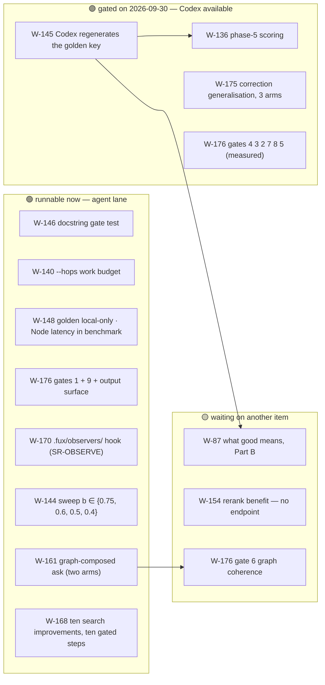
```mermaid
flowchart LR
  subgraph NOW["🟢 runnable now — agent lane"]
    W146["W-146 docstring gate test"]
    W140["W-140 --hops work budget"]
    W148["W-148 golden local-only · Node latency in benchmark"]
    W176a["W-176 gates 1 + 9 + output surface"]
    W170["W-170 .fux/observers/ hook (SR-OBSERVE)"]
    W144["W-144 sweep b ∈ {0.75, 0.6, 0.5, 0.4}"]
    W161["W-161 graph-composed ask (two arms)"]
    W168["W-168 ten search improvements, ten gated steps"]
  end
  subgraph DATE["🟣 gated on 2026-09-30 — Codex available"]
    W145["W-145 Codex regenerates the golden key"]
    W136["W-136 phase-5 scoring"]
    W175["W-175 correction generalisation, 3 arms"]
    W176b["W-176 gates 4 3 2 7 8 5 (measured)"]
  end
  subgraph WAIT["🟡 waiting on another item"]
    W87["W-87 what good means, Part B"]
    W154["W-154 rerank benefit — no endpoint"]
    W176c["W-176 gate 6 graph coherence"]
  end
  W145 --> W87
  W145 --> W136
  W161 --> W176c
```

</details>

### 10.1 Search quality — the 3.0 program

- 🟢 **W-161 — the graph-composed `ask`.** `ask` becomes lexical → graph →
  split → confidence → refer: a *boosted* tier where lexical matches that the
  walk also reaches are fused by RRF with the lexical list, and a separate,
  labelled *related* tier of documents the walk reached that lexical never
  retrieved — presented, never scored as answers. `answer` reads `ask`.
  `lexical` stays frozen as the control. The atoms (`fux lexical`, `fux graph
  --seed`, the three inert walk parameters) shipped 2026-09-14; two measured
  arms are pre-registered (`2026-09-14-graph-ask`) and want link-dependent
  golden questions, which are Codex's to write.
- 🟢 **W-168 — ten search improvements, one program.** Anchor text as a field;
  corpus-mined expansion; an unstemmed identifier field; RM3 pseudo-relevance
  feedback; supersession-aware ranking; SDM passage proximity; community
  diversification (MMR); a git authority prior; an intent → document-type
  prior; section-level units. Each step is its own golden question →
  pre-registration → build → measure → keep/remove; never two in one arm.
- 🟢 **W-144 — tables and `flen`.** Ruled (d) on 2026-09-14: sweep BM25's
  `b ∈ {0.75, 0.6, 0.5, 0.4}` over the three measured families with both
  controls, ship the first value that nets positive on all three; fall back to
  excluding table tokens plus an idf guard; no sixth field in 3.0.
- 🟣 **W-175 — does a correction generalise?** Three arms — the maintainer's
  own dogfooding, fux's own documentation tree, Codex end-to-end — N = 12
  corrections × M = 5 blind paraphrases each; the harness is agent work now,
  every number waits for Codex.

### 10.2 Knowing when not to answer

- 🟢/🟣 **W-176 — the nine abstention gates.** Ruled (a): all nine, in order,
  each behind its own flag, kept or removed on its own row. Gate 1 (`weak` ⇒
  `answerable: false`) and gate 9 (consumer steering) and the output surface
  land now; answer-type check, passage co-occurrence, IDF-weighted coverage,
  identifier hard-fail, verification floor and QPP (NQC, Clarity) are measured
  behind flags once the golden key carries enough unanswerable questions
  (Codex, 2026-09-30); graph coherence after W-161. The verdict stays a
  weakest-link chain; every signal is returned as its own field.

### 10.3 The instrument

- 🟣 **W-145** — Codex regenerates the sealed golden answer key; until then
  every golden number is informed. 🟣 **W-136** — phase-5 scoring of the
  ladder, Codex's hands. 🟡 **W-87** — what a quality number means, Part B,
  needs the uncontaminated key. 🟡 **W-154** — the reranker's price is
  measured, its benefit needs an endpoint that does not exist yet, and every
  obvious one is circular.
- 🟢 **W-148** — golden is local-only (CI keeps manifest checks only); Node's
  latency joins `fux-benchmark` beside Python's; the harness stays scratch.

### 10.4 Surfaces and hygiene

- 🟢 **W-170 — `.fux/observers/`.** Build SR-OBSERVE ([§6.3](#63-the-observer-hook-proposed));
  the record flips to `accepted` in that change.
- 🟢 **W-140 — `--hops`.** A node-expansion budget in `routes()`, `truncated`
  in every rendering including `--json` and MCP.
- 🟢 **W-146 — L0's remainder.** The narrow reading of *never restates* for
  docstrings, plus `test_docstring_defaults.py` so a docstring's default can
  never disagree with its record.

### 10.5 Parked, with reopen triggers

The vector plane (`fux embed`, `.fux/vectors/`, `--qvec`, rank-space fusion)
was closed unbuilt on 2026-09-14 and sits in the backlog as `B-245`: it
reopens only when a corpus with rank contracts exists *and* doc2query's
ceiling is measured, and then as a compare document first. T2 segments, a
ranking tuner, knowledge CI, knowledge diff, MCP-as-adapter and a wavelet
self-index are parked with their own triggers in `work/proposals/`.

---

## 11. Governance, briefly



<details><summary>Mermaid source — Figure 20</summary>

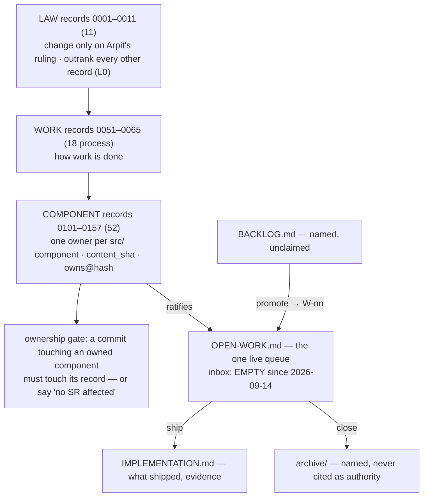
```mermaid
flowchart TB
  L["LAW records 0001–0011 (11)<br/>change only on Arpit's ruling · outrank every other record (L0)"]
  W["WORK records 0051–0065 (18 process)<br/>how work is done"]
  C["COMPONENT records 0101–0157 (52)<br/>one owner per src/ component · content_sha · owns@hash"]
  G["ownership gate: a commit touching an owned component<br/>must touch its record — or say 'no SR affected'"]
  B["BACKLOG.md — named, unclaimed"]
  O["OPEN-WORK.md — the one live queue<br/>inbox: EMPTY since 2026-09-14"]
  I["IMPLEMENTATION.md — what shipped, evidence"]
  A["archive/ — named, never cited as authority"]
  L --> W --> C --> G
  B -- "promote → W-nn" --> O -- "ship" --> I
  O -- "close" --> A
  C -- "ratifies" --> O
```

</details>

Eighty-odd Standing Records in three kinds — law (11), process (18),
component (52) — each stamped with a `content_sha` and each component record
declaring the `src/` paths it owns. A test fails any commit that changes an
owned component without touching its record, unless the commit says `no SR
affected` on its own line — a claim under the author's name in history. Work
moves from a backlog of the named-but-unclaimed, through one live queue with a
ball on every row, into an implementation log; a closed item's file is moved
to the archive and never deleted, and nothing in the archive may ground a live
claim. The discipline exists because the failure it prevents was observed: a
record was once amended into self-contradiction, the code implemented the wrong
sentence, and CI stayed green throughout.

---

## 12. Limitations

Content in a dead external source is unrecoverable by design in refer mode;
the ledger proves *that* and *what hash* was known, never *what was said*, and
`snapshot` exists for the documents where that is unacceptable. Live
verification puts the network on an opt-in query path — a fenced exception to
L4, off by default. `url:` fetches are serial. The only recall figures are
informed, from a playground set; the blind instrument exists and is unscored.
Abstention is, today, the absence of any match. BM25F's `title`, `path` and
`ctx` weights and `expand_weight` are recorded starting points, not measured
values, and the one measured attempt to tune priors found no global value that
does not trade one intent for another. ⚠ **Hashed meta traded `explain`-surface
readability for leak safety and was removed on 2026-09-20** — the readability is
bought back and the ACL-mismatch leak is now accepted rather than closed. The
design point is 10 000 documents and nothing here is claimed above it.

---

## References

The records under `records/` are the primary source for every claim above;
`records/BIBLIOGRAPHY.md` carries the per-area literature tables. Works this
version of the design actually rests on:

1. Robertson, S., Zaragoza, H. *The Probabilistic Relevance Framework: BM25 and
   Beyond.* Foundations and Trends in IR, 2009. — BM25F, the scorer.
2. Cormack, G. V., Clarke, C. L. A., Büttcher, S. *Reciprocal Rank Fusion
   outperforms Condorcet and individual rank learning methods.* SIGIR 2009. —
   `-q` fusion, `k = 60`.
3. Ding, S., Suel, T. *Faster top-k document retrieval using block-max
   indexes.* SIGIR 2011. — the T1 accelerator's skip test.
4. Nogueira, R. et al. *Document Expansion by Query Prediction.* arXiv
   1904.08375, 2019; Gospodinov, MacAvaney, Macdonald. *Doc2Query−−: When Less
   is More.* arXiv 2301.03266, 2023. — enrichment and the self-retrieval check.
5. Wang, L. et al. *Query2doc.* arXiv 2303.07678, 2023; Jagerman, R. et al.
   arXiv 2305.03653, 2023. — the `expand_weight` starting point.
6. Haveliwala, T. *Topic-Sensitive PageRank.* WWW 2002. — personalised
   PageRank, the graph walk's ancestor.
7. Raghavan, U. N., Albert, R., Kumara, S. *Near linear time algorithm to
   detect community structures.* Phys. Rev. E, 2007. — label propagation.
8. McNemar, Q. *Note on the sampling error of the difference between
   correlated proportions.* Psychometrika, 1947. — the paired floor.
9. Voorhees, E., Harman, D. (eds.) *TREC: Experiment and Evaluation in
   Information Retrieval.* MIT Press, 2005. — the manual/automatic split behind
   *blind* and *informed*.
10. Chow, C. K. *On optimum recognition error and reject tradeoff.* IEEE
    Trans. IT, 1970; El-Yaniv, R., Wiener, Y. *On the foundations of
    noise-free selective classification.* JMLR 2010. — the abstention framing.
11. Porter, M. F. *An algorithm for suffix stripping.* Program, 1980. — the
    analyzer, with its published test vectors.
12. RFC 8785 *JSON Canonicalization Scheme*; RFC 7464 / JSON Lines. — the
    committed encoding.
13. in-toto Attestation Framework. — the `--receipt` statement shape.
14. Megiddo, N., Modha, D. *ARC: A Self-Tuning, Low Overhead Replacement
    Cache.* FAST 2003. — implemented; not on the CLI path.
15. Büttcher, S., Clarke, C. *A Document-Centric Approach to Static Index
    Pruning.* CIKM 2006; Carmel, D. et al. SIGIR 2001. — the pruning literature
    P1 tested and this design does not use.
16. Graphify. *Code knowledge graphs for AI coding assistants.* — the
    code-side complement; fux parses no code.
