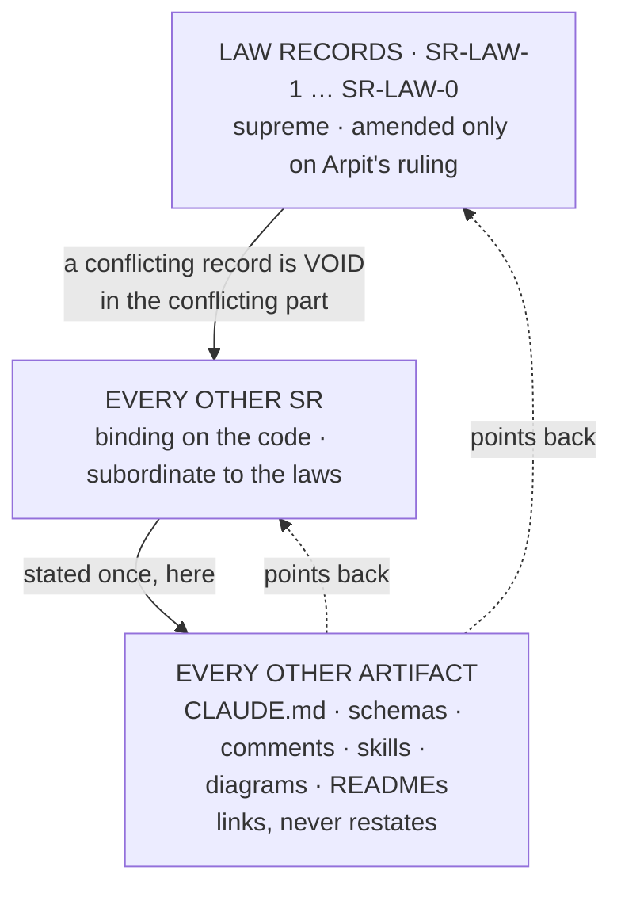

<!-- COMPONENTS-START — GENERATED from records/README.md's OWNERSHIP and DESCRIBES tables by scripts/gen-components.py. Do not edit by hand: change the table, then run `python scripts/gen-components.py --write`. -->

**Owns** — the components this record decides:

- [`scripts/gen-components.py`](../scripts/gen-components.py) · file
- [`scripts/gen-laws.py`](../scripts/gen-laws.py) · file
- [`tests/test_claude_md_laws.py`](../tests/test_claude_md_laws.py) · file
- [`tests/test_record_components.py`](../tests/test_record_components.py) · file

<!-- COMPONENTS-END -->

# SR-LAW-0 — L0 — SRs are the only source of truth

## §1 — For humans

> **This record is the HOME of law L0 — §2's first block IS the law** — and it
> is also the one place the two-level structure itself is explained. It
> superseded [SR-LAWS](0001_LAWS.md) decision 1 on 2026-09-06, and
> W-122 ([its landing record](../work/IMPLEMENTATION.md)) carried out the
> migration on 2026-09-12: every law's normative text now lives in its own
> `SR-LAW-n` record and [`CLAUDE.md`](../CLAUDE.md) carries a generated,
> test-bound copy.

**The one-line case.** Every rule fux has was being stated in two or three
places at once, and the copies drifted silently while every mechanical check
stayed green.

**The handle:** *SRs are the only source of truth, and the Law records
outrank every other record* — the one-line form from
[SR-LAWS](0001_LAWS.md)'s table. ⚠ **A handle is not the law**; read the law in §2 below.

**The two levels.**



<details><summary><b>ASCII twin</b></summary>

```text
        ┌──────────────────────────────────────────────┐
        │  LAW RECORDS  SR-LAW-1 … SR-LAW-0          │  supreme
        │  amended only on Arpit's ruling               │
        └───────────────────┬──────────────────────────┘
                            │ a conflicting record is VOID
                            │ in the conflicting part
        ┌───────────────────▼──────────────────────────┐
        │  EVERY OTHER SR                              │  binding, subordinate
        └───────────────────┬──────────────────────────┘
                            │ stated once, here
        ┌───────────────────▼──────────────────────────┐
        │  EVERY OTHER ARTIFACT                         │  links, never restates
        │  CLAUDE.md · schemas · comments · skills      │
        └──────────────────────────────────────────────┘
```

</details>

**What it costs.** A rule can no longer be explained where it is used. A
reader of `config.py` follows a link instead of reading a comment. That is
the trade: one hop of indirection, bought with the end of silent drift.

## §2 — For agents

### The law (normative)

🔴 **This block IS law L0.** It is the only normative statement of it, and
[`CLAUDE.md` §Non-negotiable constraints](../CLAUDE.md) carries a **generated**
copy of it — rendered from these bytes by
[`scripts/gen-laws.py`](../scripts/gen-laws.py) and held byte-equal by
[`tests/test_claude_md_laws.py`](../tests/test_claude_md_laws.py).
Amend it **here**, then run `python scripts/gen-laws.py --write`.
Amending a law needs Arpit's ruling, named in this record
([SR-LAW-0](0002_LAW-0-authority.md) decision 3).

<!-- LAW-TEXT:BEGIN L0 -->
- **L0** · **SRs are the only source of truth, and the Law records outrank
  every other record.** Every rule is *stated* in exactly one SR; every other
  artifact — `CLAUDE.md`, a schema, a config comment, a skill, a diagram —
  **links to it and never restates it**, and a change is made in the record
  first. The Law records `SR-LAW-0`…`SR-WORK-ENVIRONMENTS` outrank every other SR: **a
  record that conflicts with a Law is void in the conflicting part**, never a
  trade-off to weigh. **A Law changes only on Arpit's ruling, named in the
  record**; an ordinary SR a session may accept.
  ⚠ **The test that decides a restatement:** *could this artifact and the
  record disagree while both still look correct?* If yes it is a restatement
  and is forbidden; if it would simply fail, it is an implementation
  (`config.py` naming a key) or an enforcement (a runtime schema, a test) and
  is permitted.
  ⚠ **`CLAUDE.md` §Non-negotiable constraints is NOT normative** — since
  2026-09-12 each law is stated in its own `SR-LAW-n` record, and what
  `CLAUDE.md` carries is generated from those records and held equal by a test.
  Precedence is **judgment, never a gate** — no parser reads *"does this
  contradict L2"* — and a record self-contradicting inside one file stays
  ungated. [SR-LAW-0](0002_LAW-0-authority.md).
<!-- LAW-TEXT:END L0 -->

### Context

**Two failures, recorded, and one shape between them.** A configuration key
was accepted in a record, assigned in the ownership table, and never
implemented — `acquired_max_bytes`, whose only mention was prose. Before it,
an accepted amendment contained two sentences contradicting each other and
the code implemented the wrong one. Both passed every mechanical check fux
has, because the freshness gate proves a record was **touched**, never that
it is **true**.

**The check could not be written, and the reason was structural.** A
configuration key crossed four artifacts — the record, `config.schema.json`,
`config.py`, and its consumer — and no check spanned two of them. Any check
over four sources of truth is an approximation, and shipping a loose one is
the moving-threshold failure in another costume.

**So the fix is not a better check. It is fewer sources.** Ruled by Arpit,
2026-09-06: *"SRs are the only source of truth… if there is a change, the
SR changes and then it points to it"*, *"it is a two level thing — all the
SRs are supposed to be followed, but none of the SRs can break the Law
SRs"*, and *"CLAUDE.md is not a law, it is just a pointer to SRs, and you
want to keep it that way."*

### Decision

**1. Source.** Every rule fux has is *stated* in exactly one SR. Every other
artifact — `CLAUDE.md`, a schema file, a config comment, a skill, a README, a
diagram, a docstring — **links to it and never restates it**. A change is made
in the record first; everything else keeps pointing.

**1a. The records are always up to date — IN THE CHANGE THAT MAKES THEM
WRONG.** (Arpit, 2026-08-18, emphatic and standing: *always* make sure the SRs
are up to date. Not at the end of the milestone, not when someone asks.)

Three obligations, and none is optional:

1. **No behaviour change lands without its record updated in the same change.**
   Same commit, not the next one.
2. **If a change genuinely touches no recorded decision, say so out loud** —
   `no SR affected`, on its own line in the commit message. **That is a claim
   under your name in git history, which is the point. Silence is not an
   answer.**
3. **Before a session ends, re-read the records you touched code under.** A
   record describing behaviour the code no longer has is **worse than no
   record: it reads as authority.**

⚠ **Obligations 1 and 2 are enforced; obligation 3 is not, and cannot be.**
[SR-WORK-OWNERSHIP](0054_WORK-ownership.md) decision 3 is the gate, and what it
proves is that an owning record was **touched** — it never reads the record. **A
record can be amended into self-contradiction in the same commit and every
mechanical check fux has will pass.** W-83 is the case: an accepted amendment
contradicted itself, the code implemented the wrong sentence, and CI was green
the whole way.

**So obligation 3 is the only thing covering coherence.** Ruled 2026-08-27
(W-82 ruling 18) as *stated rather than mechanised*, because the two-strikes
rule ([SR-WORK-SESSION](0060_WORK-session.md) decision 13) makes a **second**
recorded occurrence the trigger for a gate, and this has happened once.

⚠ **Stated here from 2026-09-14** (W-173, accepted by Arpit). It had been
stated in `CLAUDE.md` §Law zero — a hand-written second copy of this record's
own subject, which decision 4's test classes as a restatement and decision 1
therefore forbids.

**2. Precedence.** The Law records `SR-LAW-0` … `SR-WORK-ENVIRONMENTS` outrank every
other SR. **A record that conflicts with a Law is void in the conflicting
part** — a defect to fix on contact, never a trade-off to weigh. An ordinary
record may narrow a law's application to its own subject; it may never widen,
except, or contradict one.

**2a. On contact, the conflicting sentence is DELETED from the lower document —
never softened, never footnoted, never left standing beside a pointer.** (Arpit,
2026-09-14, ruling on W-156: *"SRs are the only standing records and are
prioritised over everything else. If there is a conflict, the SR is prioritised
and the other document is cleared of it."*) The order is fixed: a Law record
outranks an ordinary record, and any record outranks every non-record artifact
in decision 1's list. The first case: SR-WORK-ENVIRONMENTS decision 2 (*every
measurement runs in `fux-lab` on the golden test data*) and SR-RS's former
sentence *"never ship a ranking change off a single synthetic corpus"* could not
both hold, so the sentence left SR-RS. **The single-corpus rule is gone; the
evidence a ranking change needs is SR-RS decision 19's paired floor on golden
data, and nothing else.**

**3. Amendment is entrenched.** A Law record changes **only on Arpit's ruling,
named in the record**. An ordinary SR a session may accept under the
lifecycle. Without this clause "supreme" is decoration: a hierarchy whose top
level is as easy to edit as its bottom is a flat hierarchy with extra words.

**4. The restatement test — describes / implements / enforces.** This decides
every case, and it is the difference between a law that is followed and one
that is routed around.

| kind | example | verdict |
|---|---|---|
| **describes** a rule a second time | a `doc:` string in a schema file; a `fux.toml` comment explaining what a key means; **a docstring's table of keys and their defaults** | 🔴 forbidden — becomes a link |
| **explains** mechanism or rationale beside the code | a docstring saying *why* `UrlSource` resolves in this order, or *how* a walk terminates | ✅ permitted — prose about the code is not a second statement of a rule (Arpit, 2026-09-14, W-146: the narrow reading) |
| **implements** it | `config.py` naming the key it parses | ✅ permitted — it *is* the thing the record governs |
| **enforces** it | a runtime-loaded schema, a test | ✅ permitted — an executable check, not a second statement |

**4a. The docstring gate.** A docstring may name a key; it may not carry a
default the record does not. `tests/test_docstring_defaults.py` (owed by W-146)
extracts every `key = value` / `default: value` literal from docstrings under
`src/fux/` and asserts each equals the value the owning record declares —
that is what turns the narrow reading from judgment into an enforcement, and
closes the exposure that `UrlSource` and SR-CONFIG could disagree while both
looked correct.

**4b. BUILT 2026-09-15 (W-146), and three things it found are worth more than
the gate.**

**① The exposure is real in principle and there was NO DRIFT in practice.**
`UrlSource`'s docstring, SR-CONFIG decision 5 and `config.py`'s loader all agree
today: `.fux/fetchers/http.py` and `"hashed"`, three artifacts, one value each.
**A gate that goes green on its first run is the good outcome**, not a wasted
one — the alternative was finding out later.

**② Step 2 of W-146 found NOTHING TO DO.** Its instruction was *turn any
docstring that is only a key-and-default table into a one-line link*. There is
no such docstring under `src/fux/`. The narrow reading had already been applied
correctly on 2026-09-14 — the two artifacts whose whole content was descriptions
of keys (`config.schema.json` and `fux setup`'s `fux.toml` comments) were
removed then, and nothing else qualified.

**③ 🔴 The gate asserts against the CODE, not the record, and that is a
deliberate narrowing of 4a's wording.** A record declares a key's **existence**
— the `keys` block is dotted paths and sigils — and may name a value only in
prose, which decision 6 says cannot make a key real. A parser reading values out
of prose would be guessing. So: the **name** is bound to the record by
`tests/test_sr_config_keys.py`, in both directions; the **value** is bound to
the loader by `tests/test_docstring_defaults.py`; and a docstring can drift from
neither. **The claim narrows, the enforcement does not.**

⚠ **And a fourth, about gates rather than about docstrings.** The first version
matched a bare `` `key = value` `` anywhere in a docstring and produced **twelve
false positives**, then eight — every inline example of that shape, and every
TOML key whose name collided with a Python parameter in the same module. **A
gate that fires wrongly is worse than one that does not fire**: it teaches every
reader to pass over it, which is how SR-FIND veto 4 grepped a line that does not
exist and read as passing for weeks. The pattern now requires a default claim to
**say** it is one, and the file carries a self-test proving it can still fail.

⚠ **The cost of that narrowing, stated: the gate is thin.** One claim in the
whole tree is checkable today. It is a tripwire for a drift that has not
happened yet, not a survey of the codebase.

**The test in one sentence:** *could this artifact and the record disagree
while both still look correct?* If yes, it is a restatement. If it would
simply fail, it is an implementation or an enforcement.

**5. A generated view is permitted, and only while a test binds it.**
`CLAUDE.md`'s law section may carry the law text **generated** from these
records between markers, because a test asserting equality makes disagreement
impossible. ⚠ **Remove the test and the block violates decision 1** — the
permission is the test, not the generation.

**5a. This record owns the generators and the binds that make the permission
real** — **Arpit's ruling of 2026-09-21** (*review all the records and link
files or folders into each and every SR*), dispositioned as **W-208**, now closed. ⚠ **The law text in
§2 is untouched**; what this adds is which components this record answers for: [`scripts/gen-laws.py`](../scripts/gen-laws.py) with
[`tests/test_claude_md_laws.py`](../tests/test_claude_md_laws.py), and
[`scripts/gen-components.py`](../scripts/gen-components.py) with
[`tests/test_record_components.py`](../tests/test_record_components.py). They
are not about laws or about ownership — **they are decision 5, executable**, and
a change to how a view is rendered or to whether it is still bound is a change
to this decision. They sat unowned until W-208, so nothing mechanical opened
this record when either moved. ⚠ **[`scripts/gen-golden.py`](../scripts/gen-golden.py)
and `tests/test_claude_md_golden.py` are the third such pair and stay with
[SR-WORK-GOLDEN](0066_WORK-golden.md)**, which already owns them; W-208's table
listed `gen-golden.py` among the unowned paths and it was not one, and moving an
owner is not what that item authorised.

**6. A key is real only if it is in its record's declared block.** Prose
naming a key does not create it. `acquired_max_bytes` sat "documented but
never parsed" precisely because its only mention was prose in a decision
paragraph, where nothing could check it.

**7. The migration LANDED on 2026-09-12** (W-122). Each law's normative text
moved into its own `SR-LAW-n` record, fenced by a pair of `LAW-TEXT` HTML
comment markers;
[`scripts/gen-laws.py`](../scripts/gen-laws.py) renders `CLAUDE.md`'s
§Non-negotiable constraints from the ten blocks, rewriting link targets from
record-relative to repo-root-relative and doing nothing else;
[`tests/test_claude_md_laws.py`](../tests/test_claude_md_laws.py) holds the two
byte-equal and refuses a verbatim third copy anywhere in a live document.

⚠ **Two things the migration corrected on the way, both factual rather than
normative.** L0's own text enumerated the supreme records as `SR-LAW-0`…`SR-LAW-8`
while L9 had existed since 2026-09-11 (Arpit's ruling that day made L9 a law; the
enumeration simply lagged — **L9 was retired on 2026-09-13** and is now
[SR-WORK-ENVIRONMENTS](0052_WORK-environments.md), a WORK record), and it named `this file` where it meant `CLAUDE.md`,
which stopped being true the moment the text moved. Neither changes what any law
permits or forbids.

### Consequences

- **The gate that could not be written becomes a parser.** With one source,
  SR-CONFIG's fenced key tree ↔ `config.py` is checkable in both directions,
  and the SR-TUNE ↔ `tune.py` twin with it.
- **`CLAUDE.md` stops being normative** and becomes a router — permanently, by
  Arpit's ruling. Its process sections (triage, answer length, the three-file
  session discipline, the worklog) **stay**: they govern how an agent behaves
  in a session, there is no record for that, and inventing one would be the
  same duplication in a new place.
- **One documentation-only schema file is deleted** — `config.schema.json`,
  every field of which was a `doc:` string describing a key.
  ⚠ **This consequence said TWO until 2026-09-12 and was wrong about the
  second.** `derive/runtime.schema.json` is not documentation:
  [`tests/derive/test_runtime_schema.py`](../tests/derive/test_runtime_schema.py)
  asserts its struct string, its field codes, its doc-table field set and its
  runtime version against `derive/format.py` in both directions. **A declaration a
  test holds equal to the code enforces**, which decision 4 permits — so it
  stays, and W-122's plan to delete it is void in that part. The four
  runtime-loaded schemas were never in question for the same reason.
- **This record supersedes [SR-LAWS](0001_LAWS.md) decision 1**
  (*"CLAUDE.md is the single normative home"*), accepted 2026-09-06, the same
  day. SR-LAWS is restructured to the meta-rules and the index; the law text
  moves to the nine `SR-LAW-n` records.

### ⚠ What is gated, and what is not

**Decision 1 is partly checkable.** The key-tree gates catch a record and its
code disagreeing about configuration. Nothing catches a rule restated in
English in a skill file.

🔴 **Decision 2 is judgment and will stay judgment.** No parser reads *"does
this record contradict L2."* Precedence tells a reader which side to take
once a conflict is found; it does not find one.

🔴 **A record contradicting itself inside one file is still ungated**, exactly
as it was before L0. Both strikes that motivated this law would have been
caught by the source clause; neither would have been caught by a parser
reading for contradiction. The two-strikes rule ([SR-WORK-SESSION](0060_WORK-session.md) decision 13) is answered by removing the
duplication, not by inventing a check that cannot exist.

### Alternatives considered

| option | why not |
|---|---|
| Keep `CLAUDE.md` normative, add a check per artifact | the check is an approximation over four sources; two sessions refused to write it, correctly |
| One flat level — all SRs equal | nothing decides a conflict; the laws stop being laws the first time an ordinary record disagrees |
| Laws supreme but amendable like any record | the hierarchy is decoration; entrenchment is what makes decision 2 mean something |
| Move the process sections into SRs too | there is no record for *"how an agent behaves in a session"*, and creating one recreates the duplication under a new name |
| Delete `CLAUDE.md`'s law section outright | agents read it first; a generated, test-bound block keeps the first read intact without a second source |

### Reference (required)

- Arpit's ruling, 2026-09-06 — quoted verbatim in §2 Context.
- [`work/IMPLEMENTATION.md`](../work/IMPLEMENTATION.md) §W-122 — the migration this record authorises, as it landed. Its item file was deleted with its queue row (OPEN-WORK rule 2). **W-146 carried the remainder and closed 2026-09-15** — its last row became [SR-WORK-GOLDEN](0066_WORK-golden.md), the second generated view decision 5 permits; the item file is [archived](../archive/open/W-146-the-rest-of-l0.md).
- **The two strikes:** `acquired_max_bytes` — named in a record and the ownership table, never parsed, `NameError` on every retaining fetch (2026-09-01); `max_parallel` — two contradicting sentences in one accepted amendment, the code implementing the wrong one ([`archive/open/W-83-the-unconfigured-fetch-ceiling.md`](../archive/open/W-83-the-unconfigured-fetch-ceiling.md)).
- [`scripts/gen-components.py`](../scripts/gen-components.py) and [`tests/test_record_components.py`](../tests/test_record_components.py) — decision 5's second view, the records' `COMPONENTS` block ([SR-WORK-OWNERSHIP](0054_WORK-ownership.md) decision 16 decides its shape).
- **Precedent for a generated view:** [SR-TUNE](0135_tuning.md) already names `tune.specimen()` in `src/fux/tune.py` as the authority for `.fux/tune.toml`.
- US Constitution, Article VI, Clause 2 (the Supremacy Clause) and Article V (the amendment path) — the two-level shape and the reason entrenchment is part of it, not an addition to it.

### Veto condition

**Reopen if any of these becomes true:**

1. A rule is found stated normatively in two artifacts and **neither is
   generated-and-test-bound** — decision 1 is not holding and the failure is
   its own evidence.
2. **A generated view exists without the test that binds it.** Two are owed
   here: [`tests/test_claude_md_laws.py`](../tests/test_claude_md_laws.py) for
   `CLAUDE.md`'s law block, and
   [`tests/test_record_components.py`](../tests/test_record_components.py) for
   the records' `COMPONENTS` block. Either is the whole of decision 5's
   permission for its view; deleting either reopens this record, and
   `python scripts/gen-laws.py --check` and
   `python scripts/gen-components.py --check` are the same assertions as
   commands.
3. A Law record is amended in a commit that does not name Arpit's ruling.
4. An ordinary record is found contradicting a law and the conflict is
   resolved by **weighing** rather than by voiding the record's clause.
