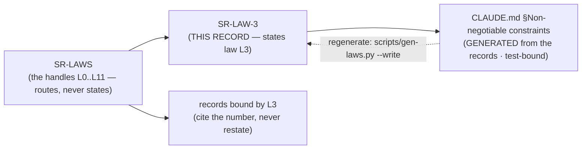

# SR-LAW-3 — L3 — deterministic; no model in the maintenance path

## §1 — For humans

> **This record is the HOME of law L3 — §2's first block IS the law**, and the
> rest of this record is its rationale: why it exists, what it has cost, how its
> wording has moved, and what would reopen it.
> [`CLAUDE.md` §Non-negotiable constraints](../CLAUDE.md) carries a
> **generated** copy, held byte-equal by
> [`tests/test_claude_md_laws.py`](../tests/test_claude_md_laws.py) —
> [SR-LAW-0](0002_LAW-0-authority.md) decisions 1 and 5, on Arpit's ruling of
> 2026-09-06. ⚠ **`CLAUDE.md` is not the source any more**; amend the law here.

**The one-line case.** If two people run `fux ingest` on the same commit and get different bytes, every other guarantee fux makes is a coincidence.

**The handle:** *Deterministic — no model in the maintenance path* — the one-line form from [SR-LAWS](0001_LAWS.md)'s
table. ⚠ **A handle is not the law**; read the law in §2 below.

**Determinism is not a nice property here; it is the audit.** A committed index that two machines reproduce byte-for-byte is a claim anyone can check with `git diff`. One that they do not is a claim nobody can check at all.

**What the law forbids, concretely:**

- wall-clock output anywhere on the maintenance path — timestamps derive from `SOURCE_DATE_EPOCH` or source mtime
- unseeded randomness
- set-iteration-order dependence
- floats in the committed plane — *not byte-reproducible across platforms*
- **a model call, at any point in maintenance** — not to summarize, not to pick better terms, not once

**Where a model IS legal.** `fux enrich` is **its own command**, run deliberately, whose output is **pinned to `.fux/enrich/` and then ingested deterministically**. That boundary is the entire reason L3 survives contact with enrichment: the model's output becomes an input, committed and reviewable, before ingest ever sees it.

### ⚠ Since 2026-09-06, this law stands alone

Two laws used to stand between fux and an embedding model: [L1](0003_LAW-1-zero-cost.md) made one uninstallable, L3 kept it off the maintenance path. **L1's amendment removed the first.** L3 still holds the maintenance path — but it says nothing about *query* time, and a query-time model is now held off only by [SR-RERANK](0138_rerank.md)'s cross-machine determinism refusal, which is a decision rather than a law.

**Diagram — Mermaid and its ASCII twin. Update both, always, together.**



<details>
<summary><b>ASCII twin</b> — the same diagram, for terminals, diffs, and any reader without a Mermaid renderer</summary>

```text
       SR-LAW-3   <-- THIS RECORD states law L3
            |
            | scripts/gen-laws.py  (test-bound, byte-equal)
            v
   CLAUDE.md §Non-negotiable constraints
        (GENERATED -- not the source)

               SR-LAWS
     (the handles L0..L11 -- routes, never states)
                   |
          +--------+---------+
          v                  v
      SR-LAW-3          records bound by L3
   (the law, plus its     (cite the number,
    rationale, history     never restate)
    and veto)
```

</details>

---

## §2 — For agents

### The law (normative)

🔴 **This block IS law L3.** It is the only normative statement of it, and
[`CLAUDE.md` §Non-negotiable constraints](../CLAUDE.md) carries a **generated**
copy of it — rendered from these bytes by
[`scripts/gen-laws.py`](../scripts/gen-laws.py) and held byte-equal by
[`tests/test_claude_md_laws.py`](../tests/test_claude_md_laws.py).
Amend it **here**, then run `python scripts/gen-laws.py --write`.
Amending a law needs Arpit's ruling, named in this record
([SR-LAW-0](0002_LAW-0-authority.md) decision 3).

<!-- LAW-TEXT:BEGIN L3 -->
- **L3** · **Deterministic — no model in the maintenance path.** Same sources →
  byte-identical index and root hash. No wall-clock output, no unseeded
  randomness, no set-iteration-order dependence. No maintenance path may ever
  call a model — not to be "smarter" at ingest, not to summarize, not once.
<!-- LAW-TEXT:END L3 -->

### Context

L3 predates the record set: it lives in the steering doc every session reads
first, and [SR-LAWS](0001_LAWS.md) gave it a citable handle so a decision could
name it without quoting it. **What was still missing was a place to put the
reasoning** — why the law is worth its cost, what it has already been narrowed
by, and what would have to become true to reopen it.

That material had been accumulating inside `SR-LAWS` itself, which was becoming
one record carrying eight subjects. This record is L3's share of it, split out
on 2026-09-06 at Arpit's ruling.

### Decision

**1. Same sources produce a byte-identical index and root hash.** This is the testable form of the law and the one the differential harness asserts.

**2. No model call on the maintenance path — no exceptions, no *"just for this format"*.** The prohibition is on the *path*, not on the *quality* of the model.

**3. Enrichment is a separate command whose output is pinned and then ingested.** Enrichment never runs inside `fux ingest`. That boundary is what keeps this law true, and it is why `inferred` was retired as a mode name — `INFERRED` is the edge grade for model-derived, and the collision was the point.

**4. Completion order never reaches a committed byte.** Threading is legal because `fetch_all` ends with a sort. **Sequential fetching was never what made the index deterministic — the trailing sort is.**

### Consequences

- **Easier:** review. A reviewer diffs the index and sees exactly what changed.
- **Easier:** the compliance story — reproducibility is a regulatory word, and fux gets it for free.
- **Harder:** every ranking improvement must be arithmetic somebody can read, not a model somebody trusts.
- ⚠ **Since L1's amendment, a third-party dependency on the ingest path can break this law silently.** A parser upgrade changes extracted text, which changes `terms`, which changes the root hash. **Pinning is what holds L3 now**, and the differential harness cannot see it because it runs on one machine.
- ⚠ **The laws do not protect against a non-reentrant fetcher** producing plausible documents attributed to the wrong URLs. The bytes stay identical run to run and every determinism check passes. The defence is a declared `MAX_PARALLEL`, not a law.

### Alternatives considered

- **Allow a model at ingest behind a flag, off by default.** Rejected: a flag that changes committed bytes is a second index format wearing a disguise, and the two would diverge the first time anyone used it.
- **Allow floats in the committed plane and round on read.** Rejected: rounding is platform-dependent too, and the guarantee is byte-identity, not approximate agreement.
- **Assert determinism by spot-checking a few documents.** Rejected on evidence — the differential harness asserts over thousands of comparisons because a spot check is what let the two query paths disagree undetected.

### Reference (required)

- `CLAUDE.md` §Non-negotiable constraints — the normative text. Repo path: [`../../CLAUDE.md`](../CLAUDE.md)
- [SR-EXTRACTED](0115_extracted-mode.md) — every property a pure function of bytes, path and link structure
- [SR-ENRICH](0137_enrich.md) — the command boundary that keeps this law true
- [SR-RANKING](0111_ranking.md) — one scorer, one sort, and the differential law
- Reproducible Builds — the same argument, made for compilers: https://reproducible-builds.org/docs/definition/

### Veto condition

**Reopen if** two machines produce different root hashes from the same sources at the same commit.

**Also reopen if** anything proposes a model call inside `fux ingest`, or an unpinned dependency on the maintenance path — the second is the new failure mode L1's amendment created and this law now carries alone.

**How to check it:**

```bash
uv run python tools/differential/run.py     # scan is the oracle; the two paths agree byte-for-byte
grep -rn "import random\|time.time()\|datetime.now" src/fux/ingest/
# expect: no output on the maintenance path
```
