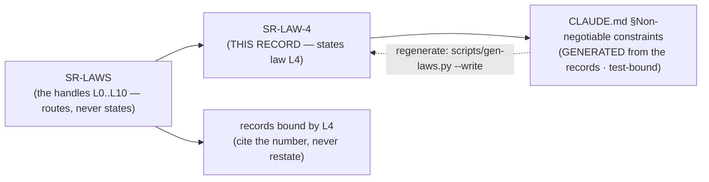

# SR-LAW-4 — L4 — offline by default

## §1 — For humans

> **This record is the HOME of law L4 — §2's first block IS the law**, and the
> rest of this record is its rationale: why it exists, what it has cost, how its
> wording has moved, and what would reopen it.
> [`CLAUDE.md` §Non-negotiable constraints](../CLAUDE.md) carries a
> **generated** copy, held byte-equal by
> [`tests/test_claude_md_laws.py`](../tests/test_claude_md_laws.py) —
> [SR-LAW-0](0002_LAW-0-authority.md) decisions 1 and 5, on Arpit's ruling of
> 2026-09-06. ⚠ **`CLAUDE.md` is not the source any more**; amend the law here.

**The one-line case.** A knowledge tool that can reach the network by accident is a data-exfiltration tool that has not had its accident yet.

**The handle:** *Offline by default* — the one-line form from [SR-LAWS](0001_LAWS.md)'s
table. ⚠ **A handle is not the law**; read the law in §2 below.

**The default is no socket.** Ranking, ingest of local directories, the index, `find`, `doctor` and the whole accelerator are offline by construction, and an import fence test asserts that the modules on those paths cannot even import a transport.

**Two networked paths exist today**, both fenced, both opt-in, both announcing themselves on stderr:

| path | what it does |
|---|---|
| `fux add <URL>` | records the line **and fetches that one URL** |
| `fux update` | re-reads what is already listed |

**Network code lives in the consumer's repo, not in the package.** `fux setup` writes `http.py` and `cdp.py` into `.fux/fetchers/`, where they become the consumer's own code. That is why the package can keep zero network lines while URLs still work — and it is a decision of [SR-CDP-FETCHER](0118_cdp-fetcher.md), not of this law.

### ⚠ The narrowing that already happened once

**Nine records and eleven module docstrings** had narrowed *"network access only inside explicit, fenced, opt-in paths"* down to `--refresh-urls` **specifically**. So when `fux add <URL>` arrived as a second fenced path, it read as an amendment to L4. **It was not.** The law says *paths*, plural, and the count was never part of it. The records were corrected and `CLAUDE.md` was not touched.

**This is the restatement hazard in its purest form** — text that was true when written, became the thing everyone cited, and then made a legal new case look like a law change. It is why [SR-LAWS](0001_LAWS.md) forbids restating a law, and why the named paths live in [SR-CLI](0101_cli-surface.md) rather than here.

**Diagram — Mermaid and its ASCII twin. Update both, always, together.**



<details>
<summary><b>ASCII twin</b> — the same diagram, for terminals, diffs, and any reader without a Mermaid renderer</summary>

```text
       SR-LAW-4   <-- THIS RECORD states law L4
            |
            | scripts/gen-laws.py  (test-bound, byte-equal)
            v
   CLAUDE.md §Non-negotiable constraints
        (GENERATED -- not the source)

               SR-LAWS
     (the handles L0..L10 -- routes, never states)
                   |
          +--------+---------+
          v                  v
      SR-LAW-4          records bound by L4
   (the law, plus its     (cite the number,
    rationale, history     never restate)
    and veto)
```

</details>

---

## §2 — For agents

### The law (normative)

🔴 **This block IS law L4.** It is the only normative statement of it, and
[`CLAUDE.md` §Non-negotiable constraints](../CLAUDE.md) carries a **generated**
copy of it — rendered from these bytes by
[`scripts/gen-laws.py`](../scripts/gen-laws.py) and held byte-equal by
[`tests/test_claude_md_laws.py`](../tests/test_claude_md_laws.py).
Amend it **here**, then run `python scripts/gen-laws.py --write`.
Amending a law needs Arpit's ruling, named in this record
([SR-LAW-0](0002_LAW-0-authority.md) decision 3).

<!-- LAW-TEXT:BEGIN L4 -->
- **L4** · **Offline by default.** Network access only inside explicit, fenced,
  opt-in paths. An import fence test enforces it.
<!-- LAW-TEXT:END L4 -->

### Context

L4 predates the record set: it lives in the steering doc every session reads
first, and [SR-LAWS](0001_LAWS.md) gave it a citable handle so a decision could
name it without quoting it. **What was still missing was a place to put the
reasoning** — why the law is worth its cost, what it has already been narrowed
by, and what would have to become true to reopen it.

That material had been accumulating inside `SR-LAWS` itself, which was becoming
one record carrying eight subjects. This record is L4's share of it, split out
on 2026-09-06 at Arpit's ruling.

### Decision

**1. Offline is the default and needs no flag.** A user who never types a URL never opens a socket.

**2. A networked path is explicit, fenced, opt-in, and says so on stderr.** The stderr notice is not decoration: it is how a user in an air-gapped environment finds out that something tried.

**3. The law says *paths*, plural.** Adding a fenced path is not an amendment. **Narrowing the law to the paths that happen to exist today is a defect to fix on contact.**

**4. `fux doctor` never fetches.** It is offline and read-only by contract — the one command that reads everything and changes nothing.

### Consequences

- **Easier:** deployment in regulated and air-gapped environments, where *"it cannot reach the network"* is a checkbox somebody has to tick.
- **Harder:** URL freshness needs a deliberate act. `ttl=` and `fux update` exist because the law will not let staleness fix itself in the background.
- ⚠ **L4 does not close the use-record gap.** [L8](0010_LAW-8-use-record.md)'s 2026-08-27 ratification dropped its transmission clause, and L4 is *offline by default* with an existing fenced path — a journal POSTed through that fence would not obviously violate it. **What holds is the code, not this law.**

### Alternatives considered

- **A single networked path, so the law can name it.** Rejected: it is what nine records did by accident, and it made a legal second path look illegal.
- **An HTTP client inside `src/fux/refer/`.** Rejected under this law and the adapter cap; it also duplicates a contract that already ships.
- **Fetch quietly, without the stderr notice.** Rejected: the notice is the only way an operator learns the tool went out.

### Reference (required)

- `CLAUDE.md` §Non-negotiable constraints — the normative text. Repo path: [`../../CLAUDE.md`](../CLAUDE.md)
- [SR-CLI](0101_cli-surface.md) decision 1e — the named fenced paths, cited rather than restated
- [SR-FETCHER](0117_fetcher.md) · [SR-CDP-FETCHER](0118_cdp-fetcher.md) — consumer-owned network code
- [SR-PROVENANCE](0142_provenance.md) — `fux verify` never fetches

### Veto condition

**Reopen if** a module on an offline path gains a transport import, or if a networked path ships without its stderr notice.

**Also reopen if** anything proposes transmitting a use record — telemetry, a support bundle, a `doctor --json` upload, a hosted judge. ⚠ **That is not an L4 violation and must not be reported as one**; it is the gap L8's ratification left open, and this is one of the two trip-wires accepted in its place.

**How to check it:**

```bash
grep -rn "urlopen\|socket\|http.client" src/fux --include='*.py' | grep -v "ingest/urlsrc.py\|refer/"
# expect: no output — the fence
```
