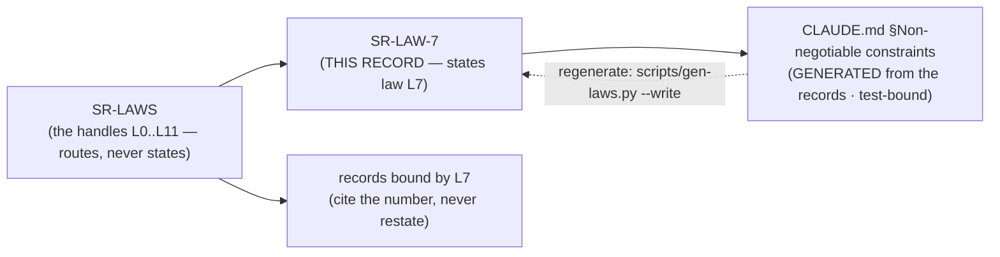

# SR-LAW-7 — L7 — Python ≥ 3.11

## §1 — For humans

> **This record is the HOME of law L7 — §2's first block IS the law**, and the
> rest of this record is its rationale: why it exists, what it has cost, how its
> wording has moved, and what would reopen it.
> [`CLAUDE.md` §Non-negotiable constraints](../CLAUDE.md) carries a
> **generated** copy, held byte-equal by
> [`tests/test_claude_md_laws.py`](../tests/test_claude_md_laws.py) —
> [SR-LAW-0](0002_LAW-0-authority.md) decisions 1 and 5, on Arpit's ruling of
> 2026-09-06. ⚠ **`CLAUDE.md` is not the source any more**; amend the law here.

**The one-line case.** 3.11 is where the standard library got good enough that refusing dependencies stopped being painful.

**The handle:** *Python ≥ 3.11* — the one-line form from [SR-LAWS](0001_LAWS.md)'s
table. ⚠ **A handle is not the law**; read the law in §2 below.

**This law is the enabler of the others, which is the only reason a version floor is a law at all.**

| what 3.11 gives | the dependency it replaced |
|---|---|
| `tomllib` | `tomli` / `toml` — and every config file fux reads is TOML |
| PEP 604 `X \| Y`, PEP 585 generics | `typing_extensions` |
| `ExceptionGroup`, `except*` | hand-rolled aggregation in the fetch pool |
| `Self`, `LiteralString` | `typing_extensions` again |
| ~10–60% CPython speedup | a chunk of the accelerator's margin, free |

**`tomllib` is the load-bearing one.** `.fux/tune.toml`, `.fux/output.toml`, `.fux/pii.toml`, `.fux/refusals.toml` and `fux.toml` are all read with it. Under 3.10 every one of those needs a third-party parser — which, before 2026-09-06, [L1](0003_LAW-1-zero-cost.md) forbade outright.

⚠ **L1's amendment weakened this law's justification without changing the law.** A TOML parser is now installable. **3.11 remains the floor** — the typing and `ExceptionGroup` arguments stand on their own, and lowering it would buy compatibility with a Python nobody is deploying — but the *strongest* argument for it is no longer *"there is no alternative"*.

**Diagram — Mermaid and its ASCII twin. Update both, always, together.**



<details>
<summary><b>ASCII twin</b> — the same diagram, for terminals, diffs, and any reader without a Mermaid renderer</summary>

```text
       SR-LAW-7   <-- THIS RECORD states law L7
            |
            | scripts/gen-laws.py  (test-bound, byte-equal)
            v
   CLAUDE.md §Non-negotiable constraints
        (GENERATED -- not the source)

               SR-LAWS
     (the handles L0..L11 -- routes, never states)
                   |
          +--------+---------+
          v                  v
      SR-LAW-7          records bound by L7
   (the law, plus its     (cite the number,
    rationale, history     never restate)
    and veto)
```

</details>

---

## §2 — For agents

### The law (normative)

🔴 **This block IS law L7.** It is the only normative statement of it, and
[`CLAUDE.md` §Non-negotiable constraints](../CLAUDE.md) carries a **generated**
copy of it — rendered from these bytes by
[`scripts/gen-laws.py`](../scripts/gen-laws.py) and held byte-equal by
[`tests/test_claude_md_laws.py`](../tests/test_claude_md_laws.py).
Amend it **here**, then run `python scripts/gen-laws.py --write`.
Amending a law needs Arpit's ruling, named in this record
([SR-LAW-0](0002_LAW-0-authority.md) decision 3).

<!-- LAW-TEXT:BEGIN L7 -->
- **L7** · **Python ≥ 3.11** (`tomllib`, modern typing). Match the surrounding style.
<!-- LAW-TEXT:END L7 -->

### Context

L7 predates the record set: it lives in the steering doc every session reads
first, and [SR-LAWS](0001_LAWS.md) gave it a citable handle so a decision could
name it without quoting it. **What was still missing was a place to put the
reasoning** — why the law is worth its cost, what it has already been narrowed
by, and what would have to become true to reopen it.

That material had been accumulating inside `SR-LAWS` itself, which was becoming
one record carrying eight subjects. This record is L7's share of it, split out
on 2026-09-06 at Arpit's ruling.

### Decision

**1. Python ≥ 3.11 is the floor,** declared in `requires-python` and asserted by the classifier list.

**2. Match the surrounding style.** Modern typing throughout; no `typing_extensions`, no `from typing import List`.

**3. The floor rises only for a reason that is named,** never because a newer version exists. Tested against 3.11–3.14.

### Consequences

- **Easier:** every config path, with no parser to vendor or install.
- **Harder:** an enterprise fleet pinned to 3.9 or 3.10 cannot run fux at all. That is a real deployment cost in exactly the environments fux targets, and the floor was chosen knowing it.
- ⚠ **The justification narrowed on 2026-09-06** without the law moving. Recorded here so a later session does not find the `tomllib` argument, notice it is now optional, and conclude the floor is.

### Alternatives considered

- **Support 3.9+ with a vendored TOML parser.** Rejected when written: it was hand-rolling a parser to avoid a dependency, to support a Python that gets nothing else fux wants. ⚠ Reopenable in principle since L1's amendment; **still refused**, because the cost is a permanent compatibility surface for a shrinking population.
- **Require 3.12+.** Rejected: nothing in the build needs it, and each bump strands deployments for free.

### Reference (required)

- `CLAUDE.md` §Non-negotiable constraints — the normative text. Repo path: [`../../CLAUDE.md`](../CLAUDE.md)
- `pyproject.toml` — `requires-python = ">=3.11"`, the executable form of this law
- PEP 680 (`tomllib`) — https://peps.python.org/pep-0680/
- [SR-CONFIG](0113_config.md) · [SR-TUNE](0135_tuning.md) — the readers that depend on it

### Veto condition

**Reopen if** a supported Python drops below 3.11 in `pyproject.toml`, or if a `typing_extensions` import appears.

**How to check it:**

```bash
grep -n 'requires-python' pyproject.toml        # expect: >=3.11
grep -rn 'typing_extensions' src/               # expect: no output
```
