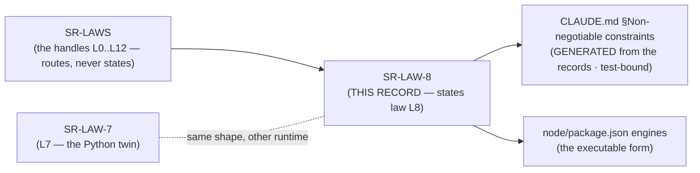

# SR-LAW-8 — L8 — Node ≥ 22

## §1 — For humans

> **This record is the HOME of law L8 — §2's first block IS the law**, and the
> rest of this record is its rationale: why it exists, what it has cost, how its
> wording has moved, and what would reopen it.
> [`CLAUDE.md` §Non-negotiable constraints](../CLAUDE.md) carries a
> **generated** copy, held byte-equal by
> [`tests/test_claude_md_laws.py`](../tests/test_claude_md_laws.py) —
> [SR-LAW-0](0002_LAW-0-authority.md) decisions 1 and 5. ⚠ **`CLAUDE.md` is
> not the source**; amend the law here.

**The one-line case.** Fux ships two readers, and until 2026-09-28 only one of
them had a floor written down as a law. [L7](0009_LAW-7-python-312.md) says
which Python; nothing said which Node, so the npm half's floor was whatever
`node/package.json` happened to say — `>=20`, a line that had already reached
end of life.

**The handle:** *Node ≥ 22* — the one-line form from [SR-LAWS](0001_LAWS.md)'s
table. ⚠ **A handle is not the law**; read the law in §2 below.

| Node line | status on 2026-09-28 | end of life |
|---|---|---|
| 20 (Iron) | **end of life** | 2026-04-30 |
| **22 (Jod)** | maintenance LTS — **the floor** | 2027-04-30 |
| 24 (Krypton) | active LTS | 2028-04-30 |

**Diagram — Mermaid and its ASCII twin. Update both, always, together.**



<details>
<summary><b>ASCII twin</b> — the same diagram, for terminals, diffs, and any reader without a Mermaid renderer</summary>

```text
       SR-LAWS  (the handles L0..L12 -- routes, never states)
          |
          v
       SR-LAW-8   <-- THIS RECORD states law L8   . . .  SR-LAW-7 (the Python twin)
          |                    |
          |                    +--> node/package.json "engines": { "node": ">=22" }
          | scripts/gen-laws.py  (test-bound, byte-equal)
          v
   CLAUDE.md §Non-negotiable constraints
        (GENERATED -- not the source)
```

</details>

---

## §2 — For agents

### The law (normative)

🔴 **This block IS law L8.** It is the only normative statement of it, and
[`CLAUDE.md` §Non-negotiable constraints](../CLAUDE.md) carries a **generated**
copy of it — rendered from these bytes by
[`scripts/gen-laws.py`](../scripts/gen-laws.py) and held byte-equal by
[`tests/test_claude_md_laws.py`](../tests/test_claude_md_laws.py).
Amend it **here**, then run `python scripts/gen-laws.py --write`.
Amending a law needs Arpit's ruling, named in this record
([SR-LAW-0](0002_LAW-0-authority.md) decision 3).

<!-- LAW-TEXT:BEGIN L8 -->
- **L8** · **Node ≥ 22** — the Node read plane's floor, as [L7](0009_LAW-7-python-312.md) is Python's. Every Node artefact fux publishes declares `"engines": { "node": ">=22" }`, and CI tests no Node older than 22.
<!-- LAW-TEXT:END L8 -->

### Context

The Node read plane ([SR-NODE-SEARCH](0153_node-search.md)) ships to npm as one
bundled `fux.mjs` ([L10](0012_LAW-10-bundled-output.md)). Its floor lived in one
place, `node/package.json`'s `engines` field, at `>=20`. No record decided it,
and CI ran Node 20 and 22. Node 20 reached end of life on 2026-04-30, so by
2026-09-28 the floor was a runtime nobody should deploy.

### Decision

**1. Node ≥ 22 is the floor.** ✅ **Ruled 2026-09-28 by Arpit** (Cowork, W-234):
*"create a new law for node similar to Python … just after Python"*, and asked
which floor, **Node ≥ 22**. It is declared in `node/package.json`'s `engines`,
which is also the published package's manifest.

**2. It breaks in the next release**, under **Breaking** in the CHANGELOG, in
the same release as L7's move to 3.12. npm warns on an `engines` mismatch rather
than refusing, unless the consumer sets `engine-strict`. **The law is the
declaration and the test matrix, not a runtime refusal**, and nothing in the
bundle checks `process.version`.

**3. CI tests the floor and the newest LTS**, 22 and 24. A matrix that still
lists 20 claims support the law withdrew.

**4. It is a law, not a tunable, so [L12](0014_LAW-12-values-live-in-config.md)
does not reach it.** A version floor is not a weight, a threshold or a timeout.
It lives where the package manager reads it, `package.json`, and a copy in
`constants.toml` would be a second source for the same fact.

**5. The floor rises only for a reason that is named,** the same rule
[L7](0009_LAW-7-python-312.md) decision 3 states for Python. The natural next
reason is Node 22's end of life on 2027-04-30.

### Consequences

- **Easier:** one supported Node line fewer to test, and a floor that names a
  runtime still receiving security fixes.
- **Harder:** a consumer on Node 20 gets an `EBADENGINE` warning, and nothing
  stops them running an untested combination. Accepted, and stated in the
  CHANGELOG entry.
- ⚠ **The Python harness in CI does not move with this law.** The arm jobs in
  `fast.yml` and `main.yml` pin a Python for the build step. That is L7's business, not L8's.

### Alternatives considered

- **Node ≥ 20, unchanged.** Rejected: it is past end of life, and a law naming
  an unsupported runtime would be written already stale.
- **Node ≥ 24.** Not chosen: 22 is still supported until 2027-04-30, and
  raising further strands consumers for no named reason.
- **No law, a record decision in SR-NODE-SEARCH.** Rejected by the ruling: the
  Python floor is a law, and the two readers are held to the same standard.

### Reference (required)

- Node.js release schedule — https://github.com/nodejs/Release (`schedule.json`:
  v20 end 2026-04-30, v22 end 2027-04-30, v24 end 2028-04-30; read 2026-09-28)
- `node/package.json` — `"engines": { "node": ">=22" }`, the executable form of this law
- npm `engines` — https://docs.npmjs.com/cli/configuring-npm/package-json#engines
- [SR-LAW-7](0009_LAW-7-python-312.md) — the Python twin · [SR-NODE-SEARCH](0153_node-search.md) — the reader it bounds

### Veto condition

**Reopen if** `node/package.json` declares a floor other than `>=22`, if a CI
matrix lists a Node older than 22, or when Node 22 reaches end of life
(2027-04-30).

**How to check it:**

```bash
grep -n '"engines"' node/package.json                      # expect: >=22
grep -n -E "node(-version)?: *\[?['\"]?[0-9]" .github/workflows/*.yml   # expect: nothing below 22
```
