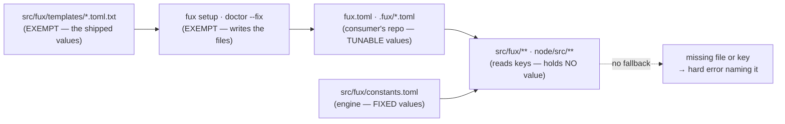

# SR-LAW-12 — L12 — every value lives in a config file, never in code

## §1 — For humans

> **This record is the HOME of law L12 — §2's first block IS the law**, and the
> rest of this record is its rationale: why it exists, what it costs, and what
> would reopen it.
> [`CLAUDE.md` §Non-negotiable constraints](../CLAUDE.md) carries a
> **generated** copy, held byte-equal by
> [`tests/test_claude_md_laws.py`](../tests/test_claude_md_laws.py) —
> [SR-LAW-0](0002_LAW-0-authority.md) decisions 1 and 5. ⚠ **`CLAUDE.md` is not
> the source**; amend the law here, then run `python scripts/gen-laws.py --write`.

**The one-line case.** `MINED_WEIGHT = 0.5` in `query/mined.py` is a second
home for a value `.fux/tune.toml` already states. Two homes drift, and the one
in code wins silently whenever the file forgets it.

**The handle:** *Every value lives in a config file, never in code* — the
one-line form from [SR-LAWS](0001_LAWS.md)'s table. ⚠ **A handle is not the
law**; read the law in §2 below.

**Two kinds of value, two homes:**

| the value | example | its one home | who may edit it |
|---|---|---|---|
| **tunable** — a person could choose it differently and the code is still right | `mined_weight`, `k1`, `rerank_weight`, `max_phrases`, a TTL, a sample size, a timeout | a committed TOML in the consumer's repo — `fux.toml`, `.fux/tune.toml`, another `.fux/*.toml`, or a new one | the consumer |
| **fixed** — changing it changes what a committed byte means | `SCHEMA = "fux.graph.v1"`, `RULES_VERSION = 3`, `FIXED_SHARDS = 256`, `"pii-digest"` | the engine's **internal constants file**, `src/fux/constants.toml`, shipped inside both distributions | fux, in a release |

| what a function did BEFORE 2026-09-27 | what L12 requires |
|---|---|
| `MINED_WEIGHT = 0.5` in the module; `tune.py` falls back to it when the key is absent | the key is read from `.fux/tune.toml`; absent → error naming `[ranking] mined_weight` |
| `delete .fux/tune.toml and nothing changes` (SR-TUNE) | delete it and every ranked verb stops, naming the file |
| `fux.toml` omits a key so a raised default arrives with no edit (SR-CONFIG) | every key is written; a new default reaches a repo through `fux setup` / `fux doctor --fix`, never silently |
| `def sample(n=100)` | `n` is read from config and passed in; no literal default |
| `SCHEMA = "fux.graph.v1"` in `graph/plane.py` | read from `src/fux/constants.toml` |

**Diagram — Mermaid and its ASCII twin. Update both, always, together.**



<details>
<summary><b>ASCII twin</b> — the same diagram, for terminals, diffs, and any reader without a Mermaid renderer</summary>

```text
  src/fux/templates/*.toml.txt    EXEMPT -- the shipped values
            |
            |  fux setup / fux doctor --fix   (EXEMPT -- writes the files)
            v
  fux.toml  .fux/*.toml           src/fux/constants.toml
  (consumer: TUNABLE values)      (engine: FIXED values)
            |                               |
            +---------------+---------------+
                            v
              src/fux/**  node/src/**     reads keys, holds NO value
                            :
                            :  no fallback
                            v
              missing file or key -> hard error naming it
```

</details>

---

## §2 — For agents

### The law (normative)

🔴 **This block IS law L12.** It is the only normative statement of it, and
[`CLAUDE.md` §Non-negotiable constraints](../CLAUDE.md) carries a **generated**
copy of it — rendered from these bytes by
[`scripts/gen-laws.py`](../scripts/gen-laws.py) and held byte-equal by
[`tests/test_claude_md_laws.py`](../tests/test_claude_md_laws.py).
Amend it **here**, then run `python scripts/gen-laws.py --write`.
Amending a law needs Arpit's ruling, named in this record
([SR-LAW-0](0002_LAW-0-authority.md) decision 3).

<!-- LAW-TEXT:BEGIN L12 -->
- **L12** · **Every value lives in a config file, never in code.** A *tunable* value — a weight, threshold, limit, timeout, TTL or sample size — is read from a committed TOML file: `fux.toml`, `.fux/tune.toml`, or another `.fux/*.toml`. A *fixed* engine value — a schema id, a format or rules version, the shard count, an artefact file name — is read from the engine's internal constants file, `src/fux/constants.toml`, shipped inside both distributions. Python and Node read the same key from the same file. **A missing file or key is a hard error that names it; no module constant, function body or parameter default supplies a fallback.** The only places a literal value may sit are `setup.py` and `src/fux/templates/`, which write the config files, and `tests/`, `tests_e2e/`, `tools/` and `scripts/`.
<!-- LAW-TEXT:END L12 -->

### Context

Fux already had the file for tunables. [SR-TUNE](0135_tuning.md) made
`.fux/tune.toml` the home of every knob that changes order, and
[SR-CONFIG](0113_config.md) made `fux.toml` the home of policy. Neither made
the file the **only** home. Both kept the engine's own default in code and let
the file override it:

- `src/fux/query/mined.py` holds `MINED_WEIGHT = 0.5`; `src/fux/tune.py`
  imports it and falls back to it; `node/src/config/tune.mjs` imports the Node
  twin and does the same. One value, four literal sites, one of them a comment.
- SR-TUNE's file header says *"delete the file and nothing changes"* — true only
  because every value also lives in code.
- SR-CONFIG deliberately leaves keys out of `fux.toml` so a raised default
  *"reaches this repo without an edit"* — a consumer's ranking changed by a
  version bump they never saw in a diff.

On 2026-09-27 a scan counted **276** module-level literal constants under
`src/fux/` and **70** under `node/src/`, plus **16** Python functions with a
numeric parameter default. Not all are tunables — many are schema ids,
versions and artefact names — but each sits in code, and a tunable among them
has two homes.

Two homes fail three ways:

1. **Drift.** The template says one number, the code says another, and the file
   the consumer reads says neither because the key is absent.
2. **Silence.** A missing key is indistinguishable from a deliberate default.
   Nothing tells the consumer their ranking came from a constant they cannot see.
3. **Twin divergence.** Python and Node each carry the literal. Byte equality
   between the planes is then a property of two hand-edited numbers.

### Decision

**1. A tunable value has one home: a committed TOML file in the consumer's
repository.** `fux.toml`, `.fux/tune.toml`, `.fux/output.toml`,
`.fux/formats.toml`, `.fux/pii.toml`, `.fux/refusals.toml` — or a **new**
`.fux/*.toml` when no existing file's boundary fits. Which file a key goes in
is decided by that file's own record (SR-TUNE's boundary rule, SR-CONFIG's
policy scope); L12 decides only that it goes in one. **The first new file is
`.fux/inspect.toml`** — `fux inspect`'s finding thresholds, sample sizes and
list lengths, which decide what counts as a finding rather than how output
renders, so they do not belong in `output.toml` (Arpit, 2026-09-27, R6).

**2. A fixed engine value has one home: `src/fux/constants.toml`.** A value is
*fixed* when changing it changes what a committed byte means — a schema id, a
format or rules version (`RULES_VERSION`, `ANALYZER_VERSION`), the shard count,
the name of an artefact file under `.fux/index/`. It is **not** a consumer
knob, so it never appears in a consumer's tree; it ships inside the wheel and,
per [L10](0012_LAW-10-bundled-output.md), inside the Node bundle. Arpit,
2026-09-27: *"another internal-to-code file for the rest of the values like
SCHEMA, RULES_VERSION."*

**3. Missing is an error, always.** A missing file, a missing table or a missing
key stops the command with a message that names the file, the table and the
key. No module constant, function body or parameter default supplies a value in
its place. `fux doctor` reports every missing key in one pass; `fux setup` and
`fux doctor --fix` write missing keys from the packaged template, and nothing
else writes them.

**4. Python and Node read the same key from the same file.** Neither plane
carries its own copy of a value. Byte equality between the planes follows from
one source, not from two literals kept equal by hand.

**5. The exemptions are closed at five places**, by name:

| exempt | why |
|---|---|
| `src/fux/setup.py` | it writes the config files |
| `src/fux/templates/` | it holds the values the config files are written from — **the one home of every shipped tunable value** |
| `tests/`, `tests_e2e/` | fixtures and expected values are literals by nature |
| `tools/` | repo-internal measurement and golden tooling, never shipped |
| `scripts/` | repo-internal generators and gates, never shipped |

A further exemption is an amendment to this record with Arpit's ruling named in
it.

**6. What is NOT a value.** Arithmetic identities (`0`, `1`, `-1` as identity
or index), empty collections, `None` as a sentinel, the names of config keys
themselves, user-facing message text, and regular expressions that *are* the
parsing logic. These are code, not settings. Added by Arpit, 2026-09-27, on the
W-225 classification (R1–R3):

- **Enum tags and wire vocabulary** — `"grounded"`, `"stale"`, `"reproduced"`,
  `"git"`/`"url"`, `"prose"`. An identifier compared by name and emitted in
  JSON is a contract, like a key name; a tag in TOML invites a renamed field.
  The Python/Node parity tests pin both planes.
- **Closed vocabularies** — `KNOWN_AGENTS`, the set `fux.toml [agents] install`
  selects from.
- **Presentation counts** — how many config errors print at once
  (`MAX_REPORTED`), display rounding digits, and the *"first N, then (+M
  more)"* cut inside a message. Message formatting, not behaviour. ⚠ **A regex a consumer might
reasonably want to change is a value** — that is why PII patterns already live
in `.fux/pii.toml`.

**6a. What decision 6 does NOT cover — ruled by Arpit, 2026-09-27, on the R5
scan (R7–R10 of [the classification](../work/compare/l12-classify.compare.md)).**
The recommendation for both of the first two was *not-a-value*; he ruled the
stricter reading, and the list above is therefore **closed** rather than an
example set:

- **R7 · A number fixed by a file format, a protocol or the algorithm is a
  `fixed` value** — a PNG chunk offset, a GIF marker byte, a hex radix, a bit
  mask, a hash IV, a JSON-RPC error code, an index into a fixed-shape record,
  `indent=2`, Markdown's six heading levels, an exit code. Each goes to
  `src/fux/constants.toml`, named. Only `0`, `1` and `-1` *as identity or
  index* stay code. A refactor that removes the literal outright (tuple
  unpacking, `len(signature)`) is as good as a key.
- **R8 · A boolean parameter default is a value.** Every one goes; the caller
  passes the flag. Where the CLI reads the flag's default from
  `output.toml`, the API reads it there too (decision 9a's `path` hops, made
  general).
- **R9 · The release vehicle is 3.0, breaking** — the missing-key stop ships
  with a CHANGELOG migration line (`fux doctor --fix` once), and **no automatic
  `--fix`**: a write the consumer did not ask for is the silent default this
  law removes.
- **R10 · `__version__` stays in `src/fux/__init__.py`.** It is packaging's
  attribute, [SR-WORK-RELEASE](0063_WORK-release.md) is its one home, and the
  version-parity test already binds its copies. Allow-listed by name.

**6b. Three calls the build left open — ruled by Arpit, 2026-09-28** (Cowork,
*"go with the recommendation"*, on [the classification](../work/compare/l12-classify.compare.md)
§"Where the build departed" and §Stage 7):

- **R11 · The library's defaults have their own root, `output.toml [api]`.** R8's
  *"the API reads it where the CLI does"* is narrowed: the API reads `[api]`, not
  `[cli]`, because `[cli] band` ships `false` and would switch the library's
  confidence block off for every caller. [SR-OUTPUT](0143_output-defaults.md) decision 25
  holds the keys.
- **R12 · A record type's boolean field default is NOT a value.** A dataclass
  field such as `AskResult.archived = False` or `UrlEntry.keep = False` states the
  shape of a record — *absent means no* — and is not a knob; it joins decision 6's
  closed list. **Only booleans**: a dataclass field holding any other literal
  (`Policy.timeout_seconds = 5`, `UrlEntry.ttl = "24h"`) is still a value, as
  stage 6 built. ⚠ This narrows the veto condition's *"class or dataclass field
  default"* on purpose; R8 reaches parameters, not record fields.
- **R13 · The sixteen `for-arpit` sites.** The OOXML part names and the magic
  bytes (`MAGIC`, `MAGIC_BY_DECODER`) are `fixed` → `constants.toml
  [decoders.*.format]`, as the image signatures are. The bodies of files fux
  writes (`_GITIGNORE`, `_SHIM`, `CACHEDIR_TAG`, `HOOKS`, `_PREAMBLE`) move to
  `src/fux/templates/*.txt`, decision 5's home for what setup writes. The
  source-list grammar (`DIRS`, `TYPES`, `URLS`) is grammar under decision 6 —
  reopened only if a consumer should be able to add an attribute.

**7. `--no-tune` reads the packaged template, not code.** The "is it me or the
config?" switch survives: it swaps the consumer's `.fux/tune.toml` for the one
`fux setup` would write today. It never falls back to a constant.

**8. A record that conflicts with L12 is void in the conflicting part**
([SR-LAW-0](0002_LAW-0-authority.md)). Named, so nobody has to find them:

- [SR-TUNE](0135_tuning.md) — *absent, empty or commented out means every
  default*; *delete the file and nothing changes*; `DEFAULT_TUNE` and every
  `DEFAULT_*` constant.
- [SR-CONFIG](0113_config.md) — keys deliberately left out of `fux.toml` so a
  raised default arrives unedited.
- Every component record whose owned module holds a tunable or fixed literal —
  the migration enumerates them.

**9a. Six values that had two homes get one** (Arpit, 2026-09-27, R4). Each
choice keeps today's behaviour:

| value | the one home |
|---|---|
| shard count | `fixed` in `constants.toml`; `fux.toml [index] shards` becomes a check that refuses any other number |
| the reranker | two knobs, two keys: the query-time gate `tune.toml [ranking] rerank_weight` (ships `0.0`) and the uplift cap `WEIGHT` (`1.0`) get distinct names |
| `path` hops | the Python API reads `output.toml [cli.path] hops` like the CLI; its own `6` goes |
| fetch-cache TTL | the key ships `0` (cache off, as today); `300` is the documented recommendation, never a fallback |
| parallelism for an undeclared fetcher | `fixed` — SR-FETCHER decision 5 makes it behaviour, not a knob |
| inspect's data-file suffixes | `fixed` |

**9b. Every decoder cap enters the extract-config digest** (Arpit, 2026-09-27).
A cap such as `MAX_INFLATED` or `MAX_CELL_CHARS` changes committed bytes. Once
a consumer can edit it in `formats.toml [limits.<decoder>]`, no hand-bumped
decoder `VERSION` follows the edit — so the digest must, or a changed cap
leaves an index that `fux ingest --check` still calls current.

**9. ✅ This law is satisfied as of 2026-10-04** (W-225 stage 8). The migration
W-225 ran in eight stages from 2026-09-27; its last, 5f, moved `src/fux/inspect/`.
Every literal left in `src/fux/**` and `node/src/**` is either read from a TOML
file or listed in `tests/l12_allow.toml` under one of decision 6's categories.
No category waits on a decision (`pending-w228` and `for-arpit` are empty and
gone). New code may not add an unlisted literal, and
`tests/test_l12_values_live_in_config.py` fails on one.
**Until 2026-10-04 this decision read "NOT satisfied today."**

### Consequences

- **Easier:** one place to read what fux will do. A consumer's ranking is
  exactly the file in their diff. Python/Node parity has one source.
- **Harder:** every consumer file must carry every key, so the templates grow,
  and a fresh engine run against an old `.fux/` stops until `fux doctor --fix`
  is run.
- 🔴 **A cost paid deliberately: a raised default no longer reaches a consumer
  silently.** Today a `[ranking]` default change (step 4's `mined_weight = 0.5`)
  reaches every repo that does not pin it. Under L12 it reaches a repo only
  when its owner runs `fux doctor --fix` or edits the key. The CHANGELOG entry
  for a default change becomes a migration instruction, not a notice.
- **`--no-tune` changes meaning slightly:** from *"engine defaults"* to
  *"what `fux setup` writes today"*. The two were equal by construction, and
  now they are equal by definition.
- **The internal constants file is a new owned component** and needs an owner
  record and a row in [`records/README.md`](README.md)'s ownership table when it
  lands.

### Alternatives considered

- **Keep defaults in code; require the file to override only.** Rejected: that
  is the status quo, and it is what produces two homes.
- **Put fixed values in the consumer's TOML too.** Rejected by Arpit,
  2026-09-27. A consumer editing `RULES_VERSION` or the shard count corrupts
  their own index with no error. Fixed values get an internal file instead.
- **Keep fixed values as code constants.** Rejected by Arpit the same day. A
  version or schema id has one home like any other value, and Node and Python
  must not each carry one.
- **Fall back to the template when a key is missing.** Rejected: a silent
  fallback is a default under another name, and L12 exists to make a missing
  key loud. The template is written into the file by setup, never read in its
  place.
- **Exempt only `setup.py`.** Rejected: tests, tools and scripts are never
  shipped and never read by a consumer; forcing their literals through TOML
  buys nothing.

### Reference (required)

- `CLAUDE.md` §Non-negotiable constraints — the generated view. Repo path: [`../../CLAUDE.md`](../CLAUDE.md)
- W-225 — every value lives in a config file (closed 2026-10-04) — the migration
- [SR-TUNE](0135_tuning.md) · [SR-CONFIG](0113_config.md) — the two records L12 overrides in part
- [SR-LAW-10](0012_LAW-10-bundled-output.md) — why the internal constants file ships inside the bundle
- [`src/fux/tune.py`](../src/fux/tune.py) · [`node/src/config/tune.mjs`](../node/src/config/tune.mjs) — the loaders that fall back today

### Veto condition

**Reopen if** a literal value outside decision 6's categories — at module
level, in a class or dataclass field default (other than decision 6b R12's
record-shape booleans), in a parameter default, in a
`.get(key, <literal>)` fallback, or inline in a function body — exists in
`src/fux/**` or `node/src/**` outside `setup.py` and `templates/`; or if a new
exemption is added without an amendment to this record.

**How to check it:** one AST-based test (Python `ast`; a tokenizer pass over
`.mjs`), built by W-225, that fails on any such literal not in its reviewed
allow-list of decision-6 sites. ⚠ **The three greps this section first carried
are NOT the check** — the W-225 classification (2026-09-27) found they reach
about 60 % of what this law forbids: they miss `_PRIVATE` constants, dataclass
defaults (`Tune` itself), `.get(key, <number>)` fallbacks, Node parameter
defaults and every inline literal. A clean grep does not mean L12 is met
(Arpit, 2026-09-27, R5). Until the test lands, the greps are a rough count:

```bash
grep -rEn '^[A-Z][A-Z0-9_]+\s*(:[^=]+)?=\s*[-0-9."'"'"'(]' src/fux --include='*.py' \
  | grep -v -e '^src/fux/setup\.py' -e '^src/fux/templates/'
grep -rEn '^(export )?const [A-Z][A-Z0-9_]+\s*=\s*[-0-9."'"'"'(\[]' node/src --include='*.mjs'
```
