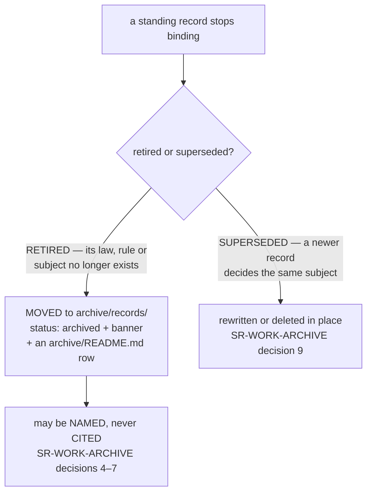

<!-- COMPONENTS-START — GENERATED from records/README.md's OWNERSHIP and DESCRIBES tables by scripts/gen-components.py. Do not edit by hand: change the table, then run `python scripts/gen-components.py --write`. -->

**Owns** — the components this record decides:

- [`tests/test_retired_records_archived.py`](../tests/test_retired_records_archived.py) · file

<!-- COMPONENTS-END -->

# SR-LAW-13 — L13 — a retired SR is archived, never deleted

## §1 — For humans

> **This record is the HOME of law L13 — §2's first block IS the law**, and the
> rest of this record is its rationale. [`CLAUDE.md` §Non-negotiable
> constraints](../CLAUDE.md) carries a **generated** copy, held byte-equal by
> [`tests/test_claude_md_laws.py`](../tests/test_claude_md_laws.py)
> ([SR-LAW-0](0002_LAW-0-authority.md) decisions 1 and 5). Amend the law here.

**The one-line case.** A law or rule that is retired still carries the argument
for it — the leak it closed, the measurement that justified it, the trigger
that would bring it back. Deleting the record loses that argument; leaving it in
`records/` makes a dead rule look live. **Moving it to the archive keeps the
argument where it can be found and puts it where nobody mistakes it for law.**

**Arpit, 2026-09-28:** *"create a new law if an sr is retired archive it"*, then
*"no need for superseded part"*.

**What it does not change.** A **superseded** record — one replaced by a newer
decision on the same subject — is still rewritten or deleted in the change that
supersedes it ([SR-WORK-ARCHIVE](0062_WORK-archive.md) decision 9): its argument
lives on in its successor. Only a **retired** record, whose subject has no
successor, is archived.

**Diagram — Mermaid and its ASCII twin. Update both, always, together.**



<details>
<summary><b>ASCII twin</b> — the same diagram, for terminals, diffs, and any reader without a Mermaid renderer</summary>

```text
  a standing record stops binding
      |
      +-- RETIRED (no successor)   -> MOVED to archive/records/, mirroring its path
      |                               status: archived, a dated banner, an archive row
      |                               -> may be NAMED, never CITED
      |
      +-- SUPERSEDED (a successor) -> rewritten or deleted in place
                                      (SR-WORK-ARCHIVE decision 9)
```

</details>

---

## §2 — For agents

### The law (normative)

🔴 **This block IS law L13.** It is the only normative statement of it, and
[`CLAUDE.md` §Non-negotiable constraints](../CLAUDE.md) carries a **generated**
copy of it — rendered from these bytes by
[`scripts/gen-laws.py`](../scripts/gen-laws.py) and held byte-equal by
[`tests/test_claude_md_laws.py`](../tests/test_claude_md_laws.py).
Amend it **here**, then run `python scripts/gen-laws.py --write`.
Amending a law needs Arpit's ruling, named in this record
([SR-LAW-0](0002_LAW-0-authority.md) decision 3).

<!-- LAW-TEXT:BEGIN L13 -->
- **L13** · **A retired SR is archived, never deleted.** When a standing record's
  law, rule or subject is retired, the record is **moved** to `archive/records/`,
  mirroring its path, **in the same change that retires it** — with a row in
  `archive/README.md`, `status: archived`, and a top banner `ARCHIVED <date> —
  retired by <ruling>` (no *superseded by* line). An archived record may be
  **named, never cited** as grounding for a live claim
  ([SR-WORK-ARCHIVE](0062_WORK-archive.md) decisions 4–7). **Superseded records
  are out of scope**: they are still rewritten or deleted in the change that
  supersedes them (SR-WORK-ARCHIVE decision 9). A retired law handle is never
  reused.
<!-- LAW-TEXT:END L13 -->

### Context

Records were never archived (SR-WORK-ARCHIVE decision 9, Arpit 2026-09-06): the
archive tier of that time gave readers a second file that looked authoritative.
Two laws have retired since — **L9** on 2026-09-13, which moved into a WORK
record, and **L5** on 2026-09-20, whose mechanism was deleted outright. L5's
record stayed in `records/` at `status: superseded` with its whole argument,
because *a reopen is cheaper than a rediscovery* — and so a retired law sat in
the live set, and the generator had to learn to skip it. This law gives that
record a home that says what it is.

### Decision

**1. A retired record is MOVED, never deleted.** `records/NNNN_<name>.md` →
`archive/records/NNNN_<name>.md`, in the change that retires it.

**2. It is marked as archived three ways**, so no reader can take it for live:
`status: archived` in its frontmatter, the banner `ARCHIVED <date> — retired by
<ruling>` as its first body line, and a row in `archive/README.md`
(SR-WORK-ARCHIVE decisions 1–3). **No "superseded by" line** (Arpit): a retired
record has no successor to name.

**3. Named, never cited.** SR-WORK-ARCHIVE decisions 4–7 apply unchanged. Its
register row and any handle table **name** it; live prose may link to it by its
archive path; nothing live is grounded in it.

**4. Superseded records are out of scope** (Arpit: *"no need for superseded
part"*). SR-WORK-ARCHIVE decision 9 still governs them.

**5. A retired law's handle is never reused** — [SR-LAWS](0001_LAWS.md)'s rule,
restated here only as the scope boundary it is.

**6. Backfill, 2026-09-28:** SR-LAW-5 (`0007`, retired 2026-09-20) is moved to
`archive/records/`. **The records deleted on 2026-09-06 are not restored** — git
holds them, and this law begins with its own ruling.

**7. Enforcement** —
[`tests/test_retired_records_archived.py`](../tests/test_retired_records_archived.py):
no file in `records/` carries a retired status (`superseded`, `retired`,
`archived`), and every file in `archive/records/` carries `status: archived`,
the banner, and an `archive/README.md` row. `scripts/gen-laws.py` refuses a
retired law record in `records/` rather than skipping it.

### Consequences

- **Easier:** the argument for a dead rule is one path away, and the live set
  holds only what binds.
- **Harder:** retiring a record is a four-part move — the file, its banner and
  status, its archive row, and every live link repointed to the archive path.
- ⚠ **The retired/superseded line is judgment.** A record whose subject survives
  in another record is superseded, not retired; this law cannot mechanise that
  call, and the test checks only the outcome of it.

### Alternatives considered

- **Keep retired records in `records/` at `status: superseded`** — what L5 did.
  Rejected: a dead law in the live set, which the generator had to be taught to
  skip, and which every reader of `records/` has to know to discount.
- **Delete them, as decision 9 did in 2026-09.** Rejected by this ruling for
  retired records: the argument has no successor to live on in.
- **Archive superseded records too.** Rejected (Arpit, 2026-09-28): their
  argument lives in their successor, and a second file is the confusion the
  2026-09-06 deletion fixed.

### Reference (required)

- [SR-WORK-ARCHIVE](0062_WORK-archive.md) — the archive and the naming-versus-citing rule
- [SR-LAWS](0001_LAWS.md) — the handle table and the never-reuse rule
- [`archive/README.md`](../archive/README.md) — the map every archived file needs
- [`tests/test_retired_records_archived.py`](../tests/test_retired_records_archived.py) — decision 7

### Veto condition

**Reopen if** a retired record's argument is found to need a live home (a
reopen that would un-archive it), or if the retired/superseded line is disputed
often enough that the scope has to be mechanised.

**How to check it:** `tests/test_retired_records_archived.py` green.
