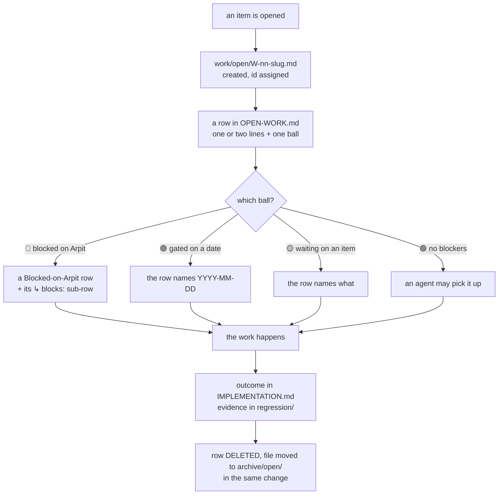

# SR-WORK-OPEN-QUEUE — how OPEN-WORK works

## §1 — For humans

> **This record is the HOME of the work-queue discipline — §2's first block IS
> the rule set**, and the rest of the record is why it exists, what it costs,
> and what would reopen it.

**One file says what is open, and it is the only one.** An item is a row in
[`work/OPEN-WORK.md`](../work/OPEN-WORK.md) and a file in
[`work/open/`](../work/open/README.md). The row is one or two lines and carries
a **ball** saying what the item is waiting for. When the item closes the row is
**deleted** — never ticked — so the length of the file is the amount of work
actually pending.

**The first WORK record.** Like the law records, the work records are a family
with their own range — `0051`–`0100`. Unlike them, there is no rendered copy:
the queue references this record and states no rule itself.



<details><summary>the same diagram, as text</summary>

```text
an item is opened
  -> work/open/W-nn-slug.md created, id assigned
  -> a row in OPEN-WORK.md: one or two lines + exactly one ball
       which ball?
         RED    blocked on Arpit  -> a Blocked-on-Arpit row + its "blocks:" sub-row
         PURPLE gated on a date   -> the row names YYYY-MM-DD
         YELLOW waiting on an item-> the row names what
         GREEN  no blockers       -> an agent may pick it up
  -> the work happens
  -> outcome in IMPLEMENTATION.md, evidence in regression/
  -> row DELETED, file moved to archive/open/, in the same change
```

</details>

**The one thing to carry away:** a row that is still there is still open, and
that is the only thing the file says.

## §2 — For agents

### The queue discipline (normative)

**A · What the file is**

1. **`work/OPEN-WORK.md` is the single live queue.** Ordering lives in it.
2. **No separate prioritisation or sequencing document.** A second document
   naming what to do next is always the stale one.
3. **Its length is the signal of how much is actually pending.** A queue that
   narrates its own history stops being that signal.
4. **It is an index.** One or two lines per item; the detail lives in that
   item's file under `work/open/W-nn-slug.md`.

**B · An item's lifecycle**

5. **Maintained in the same change as the work**, never afterwards. A session
   that updates the queue "at the end" has already lied to the one after it.
6. **An item with no file gets one, and an id, before it gets a row** — and the
   row gets its ball the day it is filed.
7. **`W-nn` ids are never reused.**
8. **Completed items are removed, never ticked.** The row is deleted and the
   detail file moves to `archive/open/`.
9. **Closing is legal only once** the outcome is recorded in
   `work/IMPLEMENTATION.md` and any evidence is filed under `work/regression/`.
10. **A resolved thing leaves the file entirely — including the sentence saying
    it resolved.** No tombstones, no DONE rows, no `closed/`. An item's row may
    state that its *decision* is made and its build is not; that is status, not
    a tombstone.
11. ⚠ **Check what the row was the ONLY home of before deleting it.** If the row
    carries the single written statement of something, move that statement to a
    record first.
12. **On every execution, whatever the outcome** — success, failure, blocked,
    interrupted, abandoned — the affected rows are updated before the session
    ends. A failed run records the failure with a one-line why. **Never mark an
    item done with failing tests.**

**C · The shape of a row**

13. **One or two lines per item, always.**
14. **A row is:** ball, optional 🧨, optional 🔺, id, lane, what is open, and a
    link to the item's file.
15. **At most 280 characters.** Two 2 000-character lines are not a one-liner.
16. **A row has no body** — no nested bullet, no table, no indented paragraph.
17. **Every row links its own detail file**, and the `W-nn` in the row matches
    the file it links.
18. **A *Blocked on Arpit* row is short too.**
19. **Everything else goes in the item's file:** status, evidence, records,
    rulings, hazards, history.

**D · The balls**

20. **A ball on every row, always, and exactly one.**
21. 🔴 **blocked on Arpit's decision — directly, or through any chain of items
    that ends at one.**
22. 🟣 **gated on a named date — directly, or through any chain that ends at
    one.** The row that owns the gate names the date as `YYYY-MM-DD`; a row
    behind it names the item it waits on.
23. 🟡 **waiting on another item, or on Codex, whose chain ends at neither Arpit
    nor a date** — the row names what.
24. 🟢 **no blockers, good to go.**
25. **Red wins, then purple.** An item waiting on several things is 🔴 if any
    chain ends at Arpit, else 🟣 if any chain ends at a date.
26. **A date-gated item is not in the inbox.** *Blocked on Arpit* is what he
    decides; once he has ruled *"wait until <date>"* the row leaves that table.
27. ⚠ **The chain is read from the row's own words, by a fixed verb list** —
    `blocked on` · `after` · `waiting on` · `waits on`, followed by the id. A
    row that names a blocker any other way names one the check cannot see.
28. **When a state changes, re-ball that row and every row waiting on it.**
29. 🧨 **broken, or getting worse every day it waits.** Any session sets or
    clears it, on any ball.
30. 🔺 **do first — set and removed only by Arpit.** An agent never adds one.
31. **Mark order:** the ball, then 🧨, then 🔺, then the id.
32. **An agent picks from 🟢 only:** 🟢 🧨 🔺 → 🟢 🔺 → 🟢 🧨 → 🟢. 🔴, 🟣 and 🟡 wait.
33. **A session names every 🔴 decision in its first output, 🔺 first.**
34. **A 🔺 item waiting on an item without 🔺 is flagged to Arpit**, never fixed
    by giving the blocker a 🔺.

**E · Ordering**

35. **Two lanes, ordered independently — they run concurrently.** `arpit` needs
    a human's hands; `agent` an agent can execute alone. Order **within** a
    lane; never across them.
36. **Priority is damage that accrues with elapsed time**, above damage that is
    merely present-but-static. Only the former gets worse by waiting.
37. **Grouped by what closing it takes** — `fux build` (code), `testing` (a run
    or a harness), `adr update` (a ruling or a record, no code and no
    measurement).
38. **Each item's file names the record its change will have to update.** If it
    cannot name one, it says **"no SR affected"** out loud.

**F · The Blocked-on-Arpit inbox**

39. **The header carries the inbox**, and each item's file carries its `filed`
    date.
40. **`age` is arithmetic: today minus `filed`, recomputed on every read, never
    copied.**
41. **Any inbox row older than 5 days is named, with its age, in the session's
    first output.**
42. **Every inbox row is followed by a `↳ blocks:` sub-row** naming every item
    that decision holds up, directly or through another item — or
    `nothing else in the queue`.
43. **An item waiting on a decision joins that sub-row in the same edit.**
44. **An inbox row is always 🔴.** A date gate is not a decision owed.
45. **A row points only at things that exist.**

**G · Standing, and forbidden**

46. **The markers here are assertions, not evidence. Re-derive, do not read.**
    Reconcile against `work/regression/`, `work/IMPLEMENTATION.md` and the repo
    itself before treating anything as pending or done. A stale ✅ overstates
    progress; a stale pending row an unrelated commit already closed
    understates it — **both are the same class of defect**.
47. **No git housekeeping, ever.** Nothing in the queue says what is or is not
    committed, staged, pushed or unpushed, in this repo or any other. **If a
    repository's state blocks work, name what the work needs**, never its git
    status.
48. **A WORKLOG entry per substantive exchange** — a chat-only session counts.
49. **This file and the item's detail file on any status change**, a
    DOC-REGISTRY row bump for any doc touched, and INTERVIEW kept current
    *during* the session.
50. **Reconcile before you report.**
51. **Records are cited by name**, never by number.
52. **No behaviour change lands without its record updated in the same change.**
53. **The lab persists.** `~/my_programs/fux-lab` is never deleted or rebuilt.

**H · Closing an item — archive, never delete** *(appended 2026-09-13)*

54. **An item's detail file is NEVER deleted.** Closing **moves**
    `work/open/W-nn-slug.md` to `archive/open/`, byte for byte, in the same
    change that deletes its row. Rules 8 and 10 govern the **queue**: *"a
    resolved thing leaves the file entirely"* means it leaves `OPEN-WORK.md`.
    It has never meant it leaves the repository.
55. **Every closure archives, whatever the outcome** — shipped, partly shipped,
    superseded, renumbered, merged into another item, withdrawn, or ruled
    won't-do. **A closure with no code is still a closure**, and its file is
    the one worth most: when nothing was built, the argument is all there was.
56. **The mover is the noticer.** An item some other change already closed is
    archived by the session that notices it, as part of rule 46's reconcile.
    **If the file is already gone, that session files a recovery item** rather
    than letting the loss stand.
57. **Archiving is not done until the archive map names a successor.**
    `archive/README.md` §`open/` gets a row in the same change — the file, the
    close date, and where the live answer lives now. That is what
    `tests/test_archive_law.py` demands, and an archived file without a row is
    an unfinished close, not a finished one.
58. **`archive/open/` is history, not evidence.** No live doc links into it and
    no argument cites it as authority. The durable record of a closed item is
    its record plus its `WORKLOG` entry; the archived file is *why the call was
    made*, kept for the reader who asks two months later.

### Context

**The rules above were stated twice and owned nowhere.** `CLAUDE.md`
§OPEN-WORK carried one copy, `OPEN-WORK.md`'s own footer carried another, and
no record carried either — so under [SR-LAW-0](0002_LAW-0-authority.md)
decision 1 they were a restatement by that record's own test: *could this
artifact and the record disagree while both still look correct?*

**The exposure was not hypothetical and it fired twice.**
[W-122](../work/IMPLEMENTATION.md)'s inventory named the gap on 2026-09-12. On
2026-09-13 a session added a fourth ball and had to hand-edit both copies to
keep them equal, with nothing checking the two. `CLAUDE.md`'s two-strikes rule
makes the second occurrence the trigger for a gate.

**And the enforcement had no owner.** The two tests that enforce most of these
rules could name no owning record, so the freshness gate could never demand
them — which is how `blocks_subrows()` keyed on the wrong regex group and left
both `↳ blocks:` checks validating a single row for two days, green throughout.

### Decision

1. **The work-queue discipline has one home, and it is this record.** The block
   above is normative. Every other artifact links to it and does not restate it.

2. **`OPEN-WORK.md` is the LIST and nothing else** (Arpit, 2026-09-13). It
   carries the Blocked-on-Arpit table and the open items, and **no rule text at
   all** — not the lane tags, not the ball legend, not the standing
   obligations. `CLAUDE.md` §OPEN-WORK is a pointer to this record on the same
   terms. **No copy, generated or otherwise, exists anywhere else**, which is
   the strictest form of [SR-LAW-0](0002_LAW-0-authority.md) decision 1: there
   is nothing to hold equal, because there is nothing to disagree with.
   **The single exception is the ball legend** (Arpit, 2026-09-13): a row is
   unreadable without knowing what its first character means, so the queue
   carries the two lines below — **exactly these, immediately under its header,
   and nothing further.** They are declared here so the two cannot drift, and
   `tests/test_work_queue_rules_have_one_home.py` holds the queue's copy equal
   to this one.

   <!-- LEGEND:BEGIN -->
   **A ball on every row, always one:** 🔴 blocked on Arpit, directly or through another item · 🟣 gated on a named date, directly or through another item · 🟡 waiting on another item · 🟢 no blockers.
   **Optional, after the ball:** 🧨 broken or getting worse · 🔺 do first (Arpit only). Full legend: [SR-WORK-OPEN-QUEUE](../records/0051_WORK-open-queue.md) rules 20–34.
   <!-- LEGEND:END -->

   ⚠ **The legend is a caption, not a summary.** It names the four balls and
   stops. Precedence, the chain, the verb list, who may set a 🔺 and what an
   agent may pick up are rules 20–34 and stay here — the legend growing a third
   line is the footer coming back one sentence at a time.

3. **The rules keep their numbers, 1–53.** A number is how a row, a commit
   message or a review names a rule, so the numbering is part of the contract:
   *rule 27* must mean one thing forever. Renumbering is a contract change, and
   a new rule is appended rather than inserted.

4. **This record is `kind: process` and owns its two enforcing tests** —
   `tests/test_open_work_rows_are_short.py` and
   `tests/test_open_work_is_not_stale.py`. That is what the kind means: a
   process record's enforcement is a test, so it owns that test, and the
   freshness gate demands this record when either one changes.

4a. **An inbox age is checked to within a day, not exactly** (amended
    2026-09-13). *Today* is not one date worldwide: at 18:37 UTC the session
    writing the ages was on IST, where it was already the 14th, and all eight
    CI runners were on UTC, where it was not. **No number satisfies both**, so
    an exact check is a gate that fires on geography — for a whole working day,
    every day, for anyone east of UTC.
    ⚠ **What the slack costs is one day and no more.** An age copied forward is
    wrong by one on the first day and by two on the second, so a carried number
    is still caught, a day later. The rule this enforces is CLAUDE.md's
    **5-day** threshold, which one day cannot hide.
    ⚠ **It does not make the age optional.** `filed` must still be an ISO date
    and the age must still be arithmetic against it.

5. **WORK records are a family with their own range: `0051`–`0100`**
   (Arpit, 2026-09-13), named `SR-WORK-<SUBJECT>` in files
   `NNNN_WORK-<slug>.md`. They stand to *how work is done* as the `SR-LAW-n`
   records stand to the laws: one subject per record, one normative block, and
   every other artifact referencing it rather than restating it.
   ⚠ **The Law range is narrowed to `0001`–`0050` by this**, of which
   `0013`–`0050` stay reserved and empty. If either family passes its ceiling,
   renumber deliberately — do not borrow from the other.

6. **A law still outranks a WORK record.** These rules govern how work is
   tracked; they never license a change a law forbids, and a WORK record that
   conflicts with a law is void in the conflicting part.

7. **Archive, never delete — and the two artifacts that said otherwise are
   fixed** (Arpit, 2026-09-13: *"once a work item is implemented, archive it.
   Do not delete it. Even closure, archive it."*). Rules 54–58 above.

   ⚠ **This was already ruled once, on 2026-08-19, and still failed.**
   `work/open/README.md` contract 2 has said *move its file to `archive/open/`*
   since that day. It held for 76 items and failed for **35**, because two
   other artifacts contradicted it in passing and neither looked like a rule:

   - **rule 10's *"leaves the file entirely"***, read out of context, reads as
     deletion — it is about the queue, and now says so; and
   - **`work/DOC-REGISTRY.md`'s trigger for `work/open/`**, which literally
     read *"its file is created with its index row and **deleted with it**"*.
     A freshness trigger is not where anyone looks for the lifecycle rule,
     which is exactly why it went uncorrected for three weeks.

   Both are corrected in this change. **The recovery ran the same day as
   W-157**: 20 files came back for 19 ids — nine from committed history,
   **eleven from `git fsck --unreachable` loose objects**, which a `git gc`
   would have taken — and **20 ids are lost for good**, their bytes in no commit
   and no loose object. The rule is enforced from here on by
   [`tests/test_no_work_item_is_lost.py`](../tests/test_no_work_item_is_lost.py);
   the per-file map is
   [`archive/README.md`](../archive/README.md) §*Recovered 2026-09-13*, and the
   outcome is [`work/IMPLEMENTATION.md`](../work/IMPLEMENTATION.md).

### Consequences

- **A rule changes in exactly one place and appears in exactly one place.**
  Nothing to regenerate, nothing to hold equal, and no second thing a reader can
  quote. The cost is the extra hop from the queue to this record.
- **The two tests gain an owner**, so editing either one without opening this
  record fails the freshness gate. That is the hole the register named for
  itself in [SR-WORK-OWNERSHIP](0054_WORK-ownership.md) decision 7, closed here for this
  subject.
- ⚠ **Roughly twenty of the fifty-three rules are enforced by nothing** — 1, 2,
  5, 7, 11, 12, 29, 30, 32, 33, 35, 36, 37, 38, 47, 48, 50, 51 and 53. Writing
  them down does not gate them, and this record does not claim it does. What
  changed is that they are now *stated once* and can be cited, not that a check
  reads them.
- ⚠ **Two rules used to exist only inside a test** — the 280-character cap
  (15) and *an inbox row is always 🔴* (44). A rule whose only statement is its
  enforcement is the inverse of L0's failure and just as bad: there is nothing
  to read, and changing the check changes the rule. Both are now stated here,
  and the test is the enforcement rather than the source.

- ⚠ **The cost of the three weeks is already paid and cannot be undone by a
  rule.** 35 closed items have a `WORKLOG` entry and an `IMPLEMENTATION` row
  and **no argument** — the file that said why is only in history. Rule 57's
  map row is what stops the next one being merely *moved and forgotten*.

### Alternatives considered

- **Leave the rules in `CLAUDE.md` and the footer, and write no record.**
  Rejected: they were then stated twice and owned nowhere, which is the
  condition this record was written to end.
- **Keep the text at the foot of the queue as a GENERATED VIEW**, rendered from
  this record and held byte-equal by a test — the mechanism
  [SR-LAW-0](0002_LAW-0-authority.md) decision 5 permits for the laws. **Built,
  shipped, and withdrawn the same day on Arpit's ruling** (2026-09-13): *the
  queue is the list; everything else belongs in the record and is only
  referenced from there.* The argument for it was that a session reading the
  queue should not need a second file; the argument against it won, and is the
  stronger one — **a generated copy is still a copy**, it doubles what a reader
  can cite, and the queue's length stops meaning what rule 3 says it means when
  130 lines of it are rendered rules. ⚠ **Do not reintroduce it** without
  ruling on this decision first; it looks like a pure convenience and is not.
- **One record per rule group, `SR-WORK-ROWS`, `SR-WORK-BALLS`, and so on.**
  Rejected: the groups are not independently decidable, the balls are meaningless
  without the lanes, and the queue would then reference seven records to explain
  one row.
- **Put the rules in `SR-LAW-0`.** Rejected: L0 governs where a rule lives, not
  how work is queued. Folding process into the authority law would make a law
  change every time a ball is added.
- **A pointer at the foot instead of at the head.** Rejected as cosmetic: what
  matters is that the queue states no rule, not where it says so.

### Reference (required)

- [SR-LAW-0](0002_LAW-0-authority.md) decisions 1 and 5 — one home per rule, and
  a generated view permitted for exactly as long as a test binds it.
- [SR-WORK-OWNERSHIP](0054_WORK-ownership.md) decisions 7 and 11 — the owns-nothing hole
  this record closes for its own subject, and the `kind` that selects its gate.
- [`scripts/gen-laws.py`](../scripts/gen-laws.py) and
  [`tests/test_claude_md_laws.py`](../tests/test_claude_md_laws.py) — the
  generated-view mechanism the laws use, considered and **not** taken here; the
  reason is in *Alternatives considered*.
- [`tests/test_open_work_rows_are_short.py`](../tests/test_open_work_rows_are_short.py)
  and [`tests/test_open_work_is_not_stale.py`](../tests/test_open_work_is_not_stale.py)
  — the nineteen mechanical checks behind these rules.

### Veto condition

**Check these, do not wait for them.**

1. **A rule's text appears in any file but this one.** `OPEN-WORK.md` regrowing
   a legend, `CLAUDE.md` regrowing a numbered list, a skill or a README
   explaining what a ball means — each is the duplication returning, and the
   convenient ones return first.
2. **`OPEN-WORK.md` grows a section that is not the list.** The header, the
   inbox table and the open items are the whole file.
3. **A rule is renumbered, or a new rule is inserted rather than appended.** A
   citation like *"rule 27"* then resolves differently depending on when it was
   written.
4. **Either owned test is edited in a change that does not open this record.**
   The freshness gate has stopped covering the enforcement.
5. **A WORK record is written outside `0051`–`0100`,** or a law record inside
   it. The two families have started borrowing numbers from each other.
6. **A rule here forbids something a law permits, or permits something a law
   forbids.** Decision 6 says which side wins; a conflict that survives review
   means nobody applied it.
7. **A `W-nn` id resolves to neither `work/open/` nor `archive/open/`.** That
   is the mechanical shape of this failure and the only one worth checking: an
   item that is neither open nor archived was deleted. Pre-convention ids
   (`W-00`–`W-14`, `W-20`, `W-21`, `W-40`, `W-41`) are exempt by name, never by
   range — a range grows to cover the next loss.
