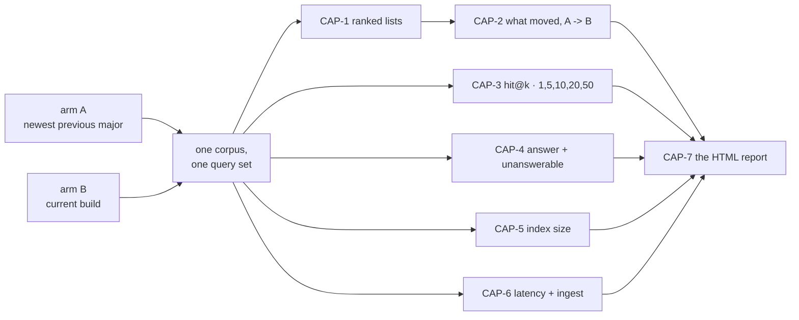

# SR-WORK-BENCHMARK — what every benchmark run captures

## §1 — For humans

> **This record is the HOME of the capture set.** It says *what is always
> captured*, never *how a run is executed* — the procedure is
> [`work/benchmark/RUNBOOK-BENCHMARK.md`](../work/benchmark/RUNBOOK-BENCHMARK.md),
> and which environment may run it is
> [SR-WORK-ENVIRONMENTS](0052_WORK-environments.md).

**The one-line case.** A benchmark answers one question — *what changed between
the previous version and this one?* — and a run that captured only some of the
answer cannot be re-read later. **Seven captures, and a run files all seven.**

| id | capture | granularity |
|---|---|---|
| **CAP-1** | the **ranked list** each arm returned — ordered document ids and scores | per query, per arm, per corpus |
| **CAP-2** | **what moved** between the arms — entered, left, and rank delta per document | per query, per corpus |
| **CAP-3** | **hit@k** for **k = 1, 5, 10, 20, 50** against the planted key | per query, per arm, per corpus |
| **CAP-4** | the **answer layer** — answered or declined; on the planted unanswerables, declined or fabricated | per question, per arm, per corpus |
| **CAP-5** | the **committed index size** — bytes, bytes per document, shard count | per corpus, per arm |
| **CAP-6** | the **speed** — query p50/p95 on interleaved arms, ingest and build wall-clock | per corpus, per arm |
| **CAP-7** | an **HTML report** of all six | one per run, always |

**Arpit, 2026-09-13, ruling:** *"Hit@5, maybe hit@1, hit@5, hit@10, hit@20,
hit@50… Benchmark should be how the previous version was and how the current
version is. That is quality and what are the documents that came up? Did their
ranks change? Then how is the answer and unanswerable thing working? How big is
the size of the index? How fast it is… ultimately an HTML report of these things
should always be generated."*

🔴 **Halt gates are not captured, and that is the ruling, not an omission.**
Determinism (the same-corpus repeat) and the differential law (`ask --fast` ≡
`ask --scan`) **must always pass** — Arpit, same ruling: *"they are more of a
functionality purpose."* They belong to `tests/` and `tests_e2e/`, which test
code. A benchmark compares two versions; it does not re-prove the engine works.

**Diagram — Mermaid and its ASCII twin. Update both, always, together.**



<details>
<summary><b>ASCII twin</b> — the same diagram, for terminals, diffs, and any reader without a Mermaid renderer</summary>

```text
  arm A (newest previous major) --+
                                  +--> one corpus, one query set --+
  arm B (current build) ----------+                                |
                                                                   |
      +------------------------------------------------------------+
      |
      +--> CAP-1 ranked lists ---> CAP-2 what moved (A -> B) --+
      +--> CAP-3 hit@k  1,5,10,20,50 -------------------------+
      +--> CAP-4 answer + unanswerable ------------------------+--> CAP-7 HTML report
      +--> CAP-5 index size ----------------------------------+
      +--> CAP-6 latency + ingest ----------------------------+
```

</details>

---

## §2 — For agents

### The capture set (normative)

🔴 **This block IS the rule.** No other file carries a copy — amend it here.

**Every benchmark run files all seven captures, or it is not a benchmark run.**

**CAP-1 — the ranked lists.** The ordered document ids and their scores, as each
arm returned them, **per query, per arm, per corpus**. This is the artefact the
*next* run is compared against, so it is filed whether or not anything moved.

**CAP-2 — what moved.** Arm A against arm B, per query: which documents
**entered** the list, which **left** it, and the **rank delta** for every
document present in both. A count of changed queries is not CAP-2; the
per-document movement is.

**CAP-3 — hit@k.** `k ∈ {1, 5, 10, 20, 50}`, per query, per arm, against the
corpus's **planted key**. **hit@5 is the headline**; the other four are captured
every run and read beside it, because a gain at 5 that is a loss at 1 is a
different result from a gain at both.

**CAP-4 — the answer layer.** Per question, per arm: did `answer` **answer or
decline**; and on the corpus's **planted unanswerables**, did it **decline or
fabricate**. Both halves, every run — a decline rate with no answer rate is
unreadable, and the reverse hides the failure that matters.

**CAP-5 — the committed index size.** Per corpus, per arm: `.fux/index/` bytes,
bytes per document, shard count.

**CAP-6 — the speed.** Per corpus, per arm: query **p50 and p95** with the arms
**interleaved** (`A B A B`, never A-then-B), and `fux ingest` and `fux build`
wall-clock.

**CAP-7 — the HTML report.** One self-contained, theme-aware HTML file per run,
carrying all six captures. **Always generated**, not on request.

**The granularity is the rule.** CAP-1 to CAP-4 are **per-query rows**; CAP-5
and CAP-6 are **per-corpus-per-arm rows**. A total is a *rendering* of a
capture, never the capture — a run that files only totals cannot be re-read by
anybody, including its own author.

### Context

Five benchmark-shaped runs are filed and no two capture the same things. The
2026-08-28 pair carries graded pairs, unanswerables and byte counts but no
`hit@20`/`hit@50` and no retained ranked lists; the 2026-09-12 run carries
ranked lists and latency and **no quality at all**, because
[SR-WORK-ENVIRONMENTS](0052_WORK-environments.md) then read *"never was it
right"*. Each run answered the question its own plan asked, and none can be
compared with the next — which is the one thing a benchmark exists to do.

Arpit ruled the set on 2026-09-13, and ruled out the gates in the same breath.

### Decision

**1. The seven captures above are mandatory**, at the stated granularity, for
every benchmark run. A run missing one is not filed as a benchmark.

**2. hit@k is captured at k = 1, 5, 10, 20, 50** — five columns, every run.
**hit@5 is the headline**; the rest are context and are never dropped for being
undramatic.

**3. The benchmark corpora carry a planted key.** CAP-3 and CAP-4 need
relevance judgments and well-formed unanswerables, so the corpus **generator
plants them** and emits the pairs mechanically. ⚠ **This reverses the
no-answer-key clause** that [SR-WORK-ENVIRONMENTS](0052_WORK-environments.md)
decision 3 carried until today; that record now references this one.
**Planted ≠ sealed** — the golden answer key belongs to the lab
([`work/golden/`](../work/golden/README.md)) and never moves into a benchmark
corpus.

**4. Halt gates are not part of a benchmark.** Determinism and the differential
law are **functionality**, proved by `tests/` and `tests_e2e/`, and a benchmark
neither runs nor reports them. **They must always pass** — a benchmark executed
while either is failing is measuring a broken engine, which is a reason to stop,
not a capture.

**5. CAP-7 is a rendering of the filed rows, never a second source.** ⚠ **It
carries no number the filed run does not**, and where the two disagree the
report is wrong.

⚠ **AMENDED 2026-09-13. This decision used to read *"generated by the harness,
not written by a session"*, full stop, and that sentence was false the day
decisions 7-10 landed** — the three reports under
[`work/benchmark/reports/`](../work/benchmark/reports/README.md) were written by
a session, from the template, against runs that had already closed. **The
generated-not-written rule is the destination and is stated as decision 8; until
[W-158] lands, a session writes the report from
[`TEMPLATE.html`](../work/benchmark/reports/TEMPLATE.html) and says in the report
that it did.** What is load-bearing either way is the sentence above it: every
number is read from the filed rows, and nothing is measured to fill a gap.

**6. A benchmark rules no threshold.** The captures are reported; whether a
movement is a regression is a person reading the rows. A benchmark that wants a
bar writes a **pre-registration** with its own id space and files a verdict
under [SR-RS](0133_predictions.md) — the `CAP-` ids name captures, never bars.

**7. Where the captures live — two paths, and the split is deliberate.**
The **evidence** stays with its run under
[`work/regression/`](../work/regression/README.md), per the contract that
directory already states. **CAP-7 does not**: every benchmark's HTML report
lives at one path, dated, under
[`work/benchmark/reports/`](../work/benchmark/reports/README.md).

```text
work/regression/<date>-<run>/
  report.md                     the run, classified blind|informed (SR-RS)
  ANALYSIS.md                   the diagnosis
  evidence/
    ARMS.toml                   the two versions, resolved
    ranked-lists.jsonl          CAP-1
    rankdiff.jsonl              CAP-2
    hits.jsonl                  CAP-3   hit@1,5,10,20,50 per query per arm
    answers.jsonl               CAP-4   answered|declined|fabricated
    index-size.csv              CAP-5
    latency.csv                 CAP-6

work/benchmark/reports/
  TEMPLATE.html                 the skeleton every report is built from
  <yyyy-mm-dd>-<run>.html       CAP-7 — one per run, and the ONLY home for it
```

⚠ **`<yyyy-mm-dd>-<run>` is the run directory's own name**, character for
character, with `.html` on the end. **One run, one report**, and the pairing is
mechanical rather than a matter of reading the file.

**Why CAP-7 leaves the run directory** (Arpit, 2026-09-13). The other six
captures are *evidence* and are read beside the run that produced them. CAP-7 is
a *rendering*, and its reader is a person comparing runs — who had to open four
directories to find four files under three different names. **One dated
directory is the index those readers did not have.** The cost is that a run
directory is no longer self-contained, and the naming rule is what pays it.

**8. A benchmark run generates its report — always, and from the template.**
Not on request, not when someone remembers. A report is built from
[`TEMPLATE.html`](../work/benchmark/reports/TEMPLATE.html), which carries one
section per capture and nothing this record does not ask for. ⚠ **The template
is a skeleton, never a second statement of the rule** — where it and this record
disagree, the template is the defect (SR-LAW-0).

**9. A capture with no number keeps its section and says so.** A report that
drops an empty section reads as a capture that was never required — which is the
confusion decision 1 exists to end. It states which capture, and why this run has
no number for it. 🔴 **A run is never re-executed to fill a gap**: filed reports
are frozen, and a better number is a new run with its own date.

**10. Every number on a report carries its direction of goodness** (Arpit,
2026-09-13) — **↑ higher is better**, **↓ lower is better**, or **— neither, a
change is a signal and not a score**. On every metric, every axis, every stat.
A reader who does not already know which way `coverage` or `bytes/doc` points
cannot read the chart, and a chart that cannot be read is not a capture.
⚠ **A direction says which way a metric points and nothing else** — never that a
difference is real, large enough to act on, or a regression. Decision 6 is
unchanged by it.

### Consequences

- ✅ **BUILT THE SAME DAY** (W-150). `fux-benchmark/bin/judged.py` plants the
  key, `bench.py` gained `hits`, `answers` and `report`, and
  [`2026-09-13-benchmark-captures`](../work/regression/2026-09-13-benchmark-captures/report.md)
  is the first run that files all seven. The consequences below are what
  building it established.
- 🔴 **The key is PLANTED and it cost NO CORPUS BYTE**, which was not obvious in
  advance. It is derived from the corpus generator's own construction rules —
  document `i`'s domain, subject and unique reference token are decided before a
  byte is written — so `gen_corpus.py --keys` writes it into tiers that already
  exist and **asserts `corpus_sha256` did not move.** **No corpus was
  regenerated and every filed timing still compares**, which is the outcome
  worth recording: the cheap route (regenerate with planted facts) would have
  voided every number these corpora have ever produced.
- ⚠ **The TIMING set keeps no key, and that is the shape the answer took.** Its
  words are scattered randomly *inside* each document, so a key for it can only
  be built by re-reading the corpus — a key that agrees with whatever ranked it.
  The judged set is its own file. **Decision 1 does not say which query set
  CAP-3 runs against, and this is why.**
- **The unanswerables are absent by CONSTRUCTION, not by inspection** — a
  reference token past the pool's last document, a volume number past it, and a
  `<domain> <word> handbook` whose word is not in the generator's source file at
  all. **That is what makes `fabricated` a finding** rather than an observation
  about the corpus that happens to exist.
- **The harness gained an HTML emitter.** CAP-7 is per-run and automatic, built
  from the filed rows and carrying no number they do not.
  🔴 **AMENDED 2026-09-13, and the amendment is owed work, not a claim:**
  decisions 7-10 moved CAP-7 to `work/benchmark/reports/<yyyy-mm-dd>-<run>.html`
  and gave it a template and a direction-of-goodness rule. **The harness emits
  neither that path nor that shape yet** — the three reports now in that
  directory were rebuilt by hand from filed rows, and a new run's report is
  written from the template by the session that files it until **W-158** lands.
  What the emitter produced on 2026-09-13 is kept at
  `archive/benchmark-reports/`.
- 🔴 **The first run under the set produced a finding on its first day, and it is
  CAP-4's.** Both versions answered **10 of 10** planted unanswerables, with a
  citation — and the current build reported `band: "partial"`, `answerable:
  true` and **named the absent word in `missing`**, one at `coverage: 0.0009`.
  Fourth recorded occurrence of the abstention shape; **first instrument that
  names the missing term.** CAP-4 existing is what made it legible, which is the
  case for the capture set in one line.
- 🔴 **The baseline is at 2026-09-13** and reaches no frozen report — the same
  discipline `CLASSIFY_SINCE` uses, for the same reason: turning a rule on by
  editing the evidence it governs is the failure the rule is about.
- **Easier:** two runs a major apart are now comparable, because they captured
  the same seven things.
- **Harder:** a benchmark costs more per run than it did on 2026-09-12. That is
  the trade Arpit took, and the alternative was five incomparable runs.

### Alternatives considered

- **Latency and ranked lists only** — the shape in force until today. Rejected
  by Arpit, 2026-09-13: it cannot answer *did quality change between versions?*,
  which is the reason to benchmark two versions at all.
- **Keep the halt gates inside the benchmark.** Rejected in the same ruling —
  they always pass, so capturing them buys nothing per run and pays for itself
  every run. The risk this accepts is stated in decision 4.
- **hit@5 alone.** Rejected: a single k hides the shape of a ranking change, and
  four more columns cost nothing once the rows exist.
- **Let each run choose its metrics, as its pre-registration sees fit.** This is
  what produced five incomparable runs. A pre-registration still chooses the
  *bars*; it may not choose whether the captures happen.

### Reference (required)

- [SR-WORK-ENVIRONMENTS](0052_WORK-environments.md) — which environment runs a
  benchmark, with which two arms, on which corpora
- [SR-RS](0133_predictions.md) — classification, per-query rows, the resolution
  floor, and how a verdict is ruled. **This record restates none of it**
- [`work/regression/2026-09-12-benchmark-l9/report.md`](../work/regression/2026-09-12-benchmark-l9/report.md)
  — the run that captured CAP-1 and CAP-6 and nothing else, which is the case
  for the set
- [`work/benchmark/README.md`](../work/benchmark/README.md) — the plans, the
  frozen pre-registrations and the id spaces
- **Per-query relevance judgments as the unit of evidence** — Voorhees & Harman,
  *TREC: Experiment and Evaluation in Information Retrieval* (2005), the
  pooled-judgment method benchmarks are graded by —
  <https://mitpress.mit.edu/9780262220736/trec/>
- **Keeping a result per commit so the next run has something to compare
  against** — the airspeed velocity (`asv`) model —
  <https://asv.readthedocs.io/>

### Veto condition

**Reopen this decision if** any of these becomes true — check them, do not wait
for them:

1. **A benchmark run is filed on or after 2026-09-13 missing any of CAP-1 to
   CAP-7.**
2. **A capture is filed as a total** where the set says per-query — a `hit@5`
   rate with no rows behind it.
3. **An HTML report carries a number the filed run does not.**
4. **A halt gate is found failing** while a benchmark is being run against the
   same build — decision 4 assumes they pass, and that assumption is the whole
   of its safety.
5. **Any file states this capture set instead of referencing this record.**

**How to check it:**

```bash
ls work/regression | awk '$0 >= "2026-09-13"' | grep -i bench
# then, per run: evidence/ carries ranked-lists.jsonl, rankdiff.jsonl,
# hits.jsonl, answers.jsonl, index-size.csv, latency.csv -- and the run
# directory carries an .html report
uv run pytest -q tests/test_benchmark_capture.py
```

---

## References

*Every source this record cites, gathered in one place. §2's **Reference
(required)** names the grounding; this is the complete list. An archived
document is never listed here — the body may name one, but archive is not
evidence.*

**Records** — [SR-WORK-ENVIRONMENTS](0052_WORK-environments.md) · [SR-RS](0133_predictions.md) · [SR-WORK-QUALITY](0056_WORK-quality.md)

**Code**

- [`tests/test_benchmark_capture.py`](../tests/test_benchmark_capture.py)
- [`tests/test_regression_runs.py`](../tests/test_regression_runs.py)

**Measured evidence**

- [`work/regression/2026-09-12-benchmark-l9/report.md`](../work/regression/2026-09-12-benchmark-l9/report.md)
- [`work/regression/2026-08-28-benchmark-v1-vs-head/report.md`](../work/regression/2026-08-28-benchmark-v1-vs-head/report.md)

**Project docs**

- [`work/benchmark/README.md`](../work/benchmark/README.md)
- [`work/benchmark/RUNBOOK-BENCHMARK.md`](../work/benchmark/RUNBOOK-BENCHMARK.md)
- [`work/setup/fux-benchmark.md`](../work/setup/fux-benchmark.md)
- [`work/golden/README.md`](../work/golden/README.md)

**Papers and specifications**

- Voorhees, E. & Harman, D., *TREC: Experiment and Evaluation in Information
  Retrieval* (2005) — per-query relevance judgments as the unit of evidence
  <https://mitpress.mit.edu/9780262220736/trec/>
- *airspeed velocity* — benchmark results kept per commit so the next run has a
  baseline
  <https://asv.readthedocs.io/>
