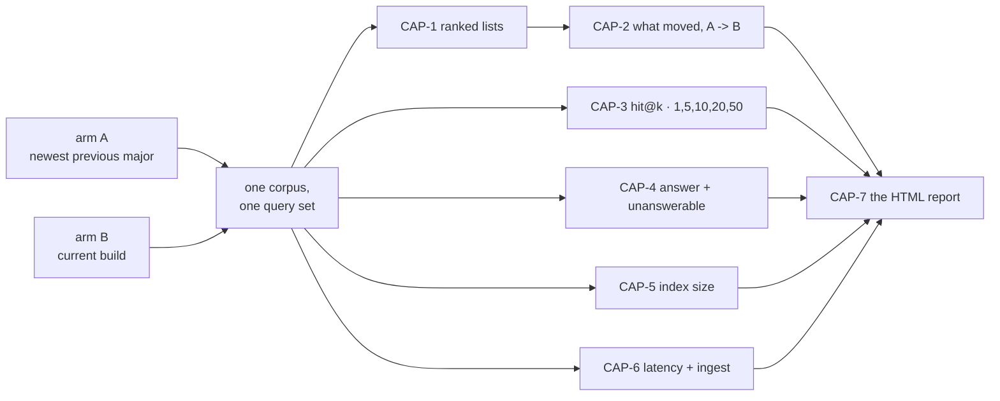

# SR-WORK-BENCHMARK — what every benchmark run captures

## §1 — For humans

> **This record is the HOME of the capture set.** It says *what is always
> captured*, never *how a run is executed* — the procedure is
> [`work/benchmark/RUNBOOK-BENCHMARK.md`](../work/benchmark/RUNBOOK-BENCHMARK.md),
> and which environment may run it is
> [SR-WORK-ENVIRONMENTS](0052_WORK-environments.md).

**The one-line case.** A benchmark answers one question — *what changed between
the previous version and this one?* — and a run that captured only some of the
answer cannot be re-read later. **Seven captures, and a run files all seven.**

| id | capture | granularity |
|---|---|---|
| **CAP-1** | the **ranked list** each arm returned — ordered document ids and scores | per query, per arm, per corpus |
| **CAP-2** | **what moved** between the arms — entered, left, and rank delta per document | per query, per corpus |
| **CAP-3** | **hit@k** for **k = 1, 5, 10, 20, 50** against the planted key | per query, per arm, per corpus |
| **CAP-4** | the **answer layer** — answered or declined; on the planted unanswerables, declined or fabricated | per question, per arm, per corpus |
| **CAP-5** | the **committed index size** — bytes, bytes per document, shard count | per corpus, per arm |
| **CAP-6** | the **speed** — query p50/p95 on interleaved arms, ingest and build wall-clock | per corpus, per arm |
| **CAP-7** | an **HTML report** of all six | one per run, always |

**Arpit, 2026-09-13, ruling:** *"Hit@5, maybe hit@1, hit@5, hit@10, hit@20,
hit@50… Benchmark should be how the previous version was and how the current
version is. That is quality and what are the documents that came up? Did their
ranks change? Then how is the answer and unanswerable thing working? How big is
the size of the index? How fast it is… ultimately an HTML report of these things
should always be generated."*

🔴 **Halt gates are not captured, and that is the ruling, not an omission.**
Determinism (the same-corpus repeat) and the differential law (`ask --fast` ≡
`ask --scan`) **must always pass** — Arpit, same ruling: *"they are more of a
functionality purpose."* They belong to `tests/` and `tests_e2e/`, which test
code. A benchmark compares two versions; it does not re-prove the engine works.

**Diagram — Mermaid and its ASCII twin. Update both, always, together.**



<details>
<summary><b>ASCII twin</b> — the same diagram, for terminals, diffs, and any reader without a Mermaid renderer</summary>

```text
  arm A (newest previous major) --+
                                  +--> one corpus, one query set --+
  arm B (current build) ----------+                                |
                                                                   |
      +------------------------------------------------------------+
      |
      +--> CAP-1 ranked lists ---> CAP-2 what moved (A -> B) --+
      +--> CAP-3 hit@k  1,5,10,20,50 -------------------------+
      +--> CAP-4 answer + unanswerable ------------------------+--> CAP-7 HTML report
      +--> CAP-5 index size ----------------------------------+
      +--> CAP-6 latency + ingest ----------------------------+
```

</details>

---

## §2 — For agents

### The capture set (normative)

🔴 **This block IS the rule.** No other file carries a copy — amend it here.

**Every benchmark run files all seven captures, or it is not a benchmark run.**

**CAP-1 — the ranked lists.** The ordered document ids and their scores, as each
arm returned them, **per query, per arm, per corpus**. This is the artefact the
*next* run is compared against, so it is filed whether or not anything moved.

**CAP-2 — what moved.** Arm A against arm B, per query: which documents
**entered** the list, which **left** it, and the **rank delta** for every
document present in both. A count of changed queries is not CAP-2; the
per-document movement is.

**CAP-3 — hit@k.** `k ∈ {1, 5, 10, 20, 50}`, per query, per arm, against the
corpus's **planted key**. **hit@5 is the headline**; the other four are captured
every run and read beside it, because a gain at 5 that is a loss at 1 is a
different result from a gain at both.

**CAP-4 — the answer layer.** Per question, per arm: did `answer` **answer or
decline**; and on the corpus's **planted unanswerables**, did it **decline or
fabricate**. Both halves, every run — a decline rate with no answer rate is
unreadable, and the reverse hides the failure that matters.

**CAP-5 — the committed index size.** Per corpus, per arm: `.fux/index/` bytes,
bytes per document, shard count.

**CAP-6 — the speed.** Per corpus, per arm: query **p50 and p95** with the arms
**interleaved** (`A B A B`, never A-then-B), and `fux ingest` and `fux build`
wall-clock.

**CAP-7 — the HTML report.** One self-contained, theme-aware HTML file per run,
carrying all six captures. **Always generated**, not on request.

**The granularity is the rule.** CAP-1 to CAP-4 are **per-query rows**; CAP-5
and CAP-6 are **per-corpus-per-arm rows**. A total is a *rendering* of a
capture, never the capture — a run that files only totals cannot be re-read by
anybody, including its own author.

### Context

Five benchmark-shaped runs are filed and no two capture the same things. The
2026-08-28 pair carries graded pairs, unanswerables and byte counts but no
`hit@20`/`hit@50` and no retained ranked lists; the 2026-09-12 run carries
ranked lists and latency and **no quality at all**, because
[SR-WORK-ENVIRONMENTS](0052_WORK-environments.md) then read *"never was it
right"*. Each run answered the question its own plan asked, and none can be
compared with the next — which is the one thing a benchmark exists to do.

Arpit ruled the set on 2026-09-13, and ruled out the gates in the same breath.

### Decision

**1. The seven captures above are mandatory**, at the stated granularity, for
every benchmark run. A run missing one is not filed as a benchmark.

**2. hit@k is captured at k = 1, 5, 10, 20, 50** — five columns, every run.
**hit@5 is the headline**; the rest are context and are never dropped for being
undramatic.

**3. The benchmark corpora carry a planted key.** CAP-3 and CAP-4 need
relevance judgments and well-formed unanswerables, so the corpus **generator
plants them** and emits the pairs mechanically. ⚠ **This reverses the
no-answer-key clause** that [SR-WORK-ENVIRONMENTS](0052_WORK-environments.md)
decision 3 carried until today; that record now references this one.
**Planted ≠ sealed** — the golden answer key belongs to the lab
([`work/golden/`](../work/golden/README.md)) and never moves into a benchmark
corpus.

**4. Halt gates are not part of a benchmark.** Determinism and the differential
law are **functionality**, proved by `tests/` and `tests_e2e/`, and a benchmark
neither runs nor reports them. **They must always pass** — a benchmark executed
while either is failing is measuring a broken engine, which is a reason to stop,
not a capture.

**5. CAP-7 is a rendering of the filed rows, never a second source.** ⚠ **It
carries no number the filed run does not**, and where the two disagree the
report is wrong.

⚠ **AMENDED 2026-09-13. This decision used to read *"generated by the harness,
not written by a session"*, full stop, and that sentence was false the day
decisions 7-10 landed** — the three reports under
[`work/benchmark/reports/`](../work/benchmark/reports/README.md) were written by
a session, from the template, against runs that had already closed. **The
generated-not-written rule is the destination and is stated as decision 8; until
[W-158] lands, a session writes the report from
[`TEMPLATE.html`](../work/benchmark/reports/TEMPLATE.html) and says in the report
that it did.** What is load-bearing either way is the sentence above it: every
number is read from the filed rows, and nothing is measured to fill a gap.

**6. A benchmark rules no threshold.** The captures are reported; whether a
movement is a regression is a person reading the rows. A benchmark that wants a
bar writes a **pre-registration** with its own id space and files a verdict
under [SR-RS](0133_predictions.md) — the `CAP-` ids name captures, never bars.

**7. Where the captures live — two paths, and the split is deliberate.**
The **evidence** stays with its run under
[`work/regression/`](../work/regression/README.md), per the contract that
directory already states. **CAP-7 does not**: every benchmark's HTML report
lives at one path, dated, under
[`work/benchmark/reports/`](../work/benchmark/reports/README.md).

```text
work/regression/<date>-<run>/
  report.md                     the run, classified blind|informed (SR-RS)
  ANALYSIS.md                   the diagnosis
  evidence/
    ARMS.toml                   the two versions, resolved
    ranked-lists.jsonl          CAP-1
    rankdiff.jsonl              CAP-2
    hits.jsonl                  CAP-3   hit@1,5,10,20,50 per query per arm
    answer-layer.jsonl          CAP-4   answered|declined|fabricated
    index-size.csv              CAP-5
    latency.csv                 CAP-6

work/benchmark/reports/
  TEMPLATE.html                 the skeleton every report is built from
  <yyyy-mm-dd>-<run>.html       CAP-7 — one per run, and the ONLY home for it
```

⚠ **`<yyyy-mm-dd>-<run>` is the run directory's own name**, character for
character, with `.html` on the end. **One run, one report**, and the pairing is
mechanical rather than a matter of reading the file.

**Why CAP-7 leaves the run directory** (Arpit, 2026-09-13). The other six
captures are *evidence* and are read beside the run that produced them. CAP-7 is
a *rendering*, and its reader is a person comparing runs — who had to open four
directories to find four files under three different names. **One dated
directory is the index those readers did not have.** The cost is that a run
directory is no longer self-contained, and the naming rule is what pays it.

**8. A benchmark run generates its report — always, and from the template.**
Not on request, not when someone remembers. A report is built from
[`TEMPLATE.html`](../work/benchmark/reports/TEMPLATE.html), which carries one
section per capture and nothing this record does not ask for. ⚠ **The template
is a skeleton, never a second statement of the rule** — where it and this record
disagree, the template is the defect (SR-LAW-0).

**9. A capture with no number keeps its section and says so.** A report that
drops an empty section reads as a capture that was never required — which is the
confusion decision 1 exists to end. It states which capture, and why this run has
no number for it. 🔴 **A run is never re-executed to fill a gap**: filed reports
are frozen, and a better number is a new run with its own date.

**10. Every number on a report carries its direction of goodness** (Arpit,
2026-09-13) — **↑ higher is better**, **↓ lower is better**, or **— neither, a
change is a signal and not a score**. On every metric, every axis, every stat.
A reader who does not already know which way `coverage` or `bytes/doc` points
cannot read the chart, and a chart that cannot be read is not a capture.
⚠ **A direction says which way a metric points and nothing else** — never that a
difference is real, large enough to act on, or a regression. Decision 6 is
unchanged by it.

**11. The template and the emitter agree by MARKER, and the emitter writes no
direction of its own.** (W-158, 2026-09-14 — decisions 8–10 built.)

`fux-benchmark/bin/report.py <run>` renders
[`TEMPLATE.html`](../work/benchmark/reports/TEMPLATE.html) into
`work/benchmark/reports/<run>.html`. It substitutes the template's `{{TOKENS}}`
and replaces every region between a `fux:fill:NAME` marker comment and its
`fux:end:NAME` partner. **Everything outside a marker is copied through byte
for byte** — the CSS, slide 2's how-to-read table, slide 11's guard rails, and
**every numeric column header with its direction marker on it.**

🔴 **That last clause is decision 10's enforcement, and it is structural rather
than careful.** The directions live in the template's own `<thead>` rows, so a
direction is a property of the **metric**; an emitter that wrote them would
restate them once per report and two reports would be free to disagree. The
emitter writes exactly one direction anywhere, on a table the template has no
header for, and that is the only exception.

- **A marker renamed or deleted makes the emitter REFUSE**, naming which. A
  section silently dropped would be a page that looks generated and states
  nothing where a capture should be — worse than a failure, because a failure
  gets fixed.
- **The date on a generated report is the RUN DIRECTORY'S**, never today's. A
  report regenerated a year later must say when the run executed; a wall-clock
  read would silently re-date frozen evidence.
- **The emitter reads `report.md`'s frontmatter as filed evidence.** The run's
  own `description` becomes the cover's lead and its `classification` the
  cover's label — quoted, never composed. *A generated sentence about what a
  run meant is the one thing this emitter must not write.*
- **Where an expected capture file is absent and the same measurement is filed
  under another name, it is read and the substitution is STATED on the page.**
  `2026-09-12-benchmark-l9` filed no `index-size.csv` and its `ARMS.toml`
  carries `index_bytes` per arm per corpus, so CAP-5 has a number and says
  where it came from. A silent substitution would have the page claim a capture
  the run's file list does not have.

⚠ **11a. A generated report is THINNER than a hand-authored one, and the three
written by hand before this are left exactly as they are.** The template's
CAP-2 figure is an inline SVG a person draws; the emitter draws none and
**says so in the figure's place** rather than omitting it. Regenerating
`2026-09-13-benchmark-captures` was tried and **rejected on the evidence**: the
generated page loses the hand-built per-corpus hit@k breakdown and **adds**
numbers the hand-built page does not carry, and decision 9's frozen-report rule
admits a regeneration only when the diff carries no new number. **From the next
run onward the emitter is the report**; the three before it are frozen.

🔴 **11b. The harness this decision now depends on is UNCOMMITTED.**
`~/my_programs/fux-benchmark` is a git repo with **zero commits** and every file
untracked, so `bin/report.py` exists on one machine. **Decisions 8–10 are
therefore enforced by a file that a `rm -rf` would end**, and nothing in this
repository would notice — `tests/test_benchmark_capture.py` checks that a report
was *filed*, never that anything can still generate one. Stated rather than
fixed: whether that environment gets a commit is
W-148 (closed 2026-09-15)'s territory and
Arpit's, and it is named there.

**12. The NODE READER IS A COLUMN, not a separate benchmark** (W-148 row 2;
Arpit, 2026-09-14).

Node's query latency has never been measured. `PRE-REGISTRATION-NODE`'s N4
fence — `p95 ≤ 150 ms` — was retired with that document and moved here, so the
bar was **stated rather than silently dropped**, and then nothing measured it
because no instrument existed.

**The ruling: add the Node measurement to `fux-benchmark` in the same shape as
Python's** — same rungs, same `p95`, **one more column**. Not a second harness
and not a second report.

⚠ **A column, because the question is a comparison.** Node against Python on
the same corpus, same queries, same run, is the number anybody actually wants;
two separate reports from two runs would be two absolute numbers measured under
different machine load, which decision 6's *a benchmark rules no threshold*
already refuses to let anyone read as a delta.

🔴 **Until that column is filed, N4 is UNMEASURED and no document may say
otherwise.** The structural argument — *Node's scan is the same algorithm over
the same shards* — says where to expect the number and **is not the number**,
and filing it as one would be the exact failure
[SR-RS](0133_predictions.md) decision 22 names.

⚠ **This got harder on 2026-09-15**, and the reason is worth carrying: W-161's
graph tier makes a Node `ask` rebuild the graph plane in memory, which parses
every committed record — work the Python reader does not do, because it reads
one derived file ([SR-NODE-SEARCH](0153_node-search.md) decision 17a). **So the
first Node latency number will contain that cost**, and a run that does not
separate it will attribute a tier's price to the reader.

**12a. MEASURED 2026-09-15 (W-179), and the split decision 12 demanded is what
makes the number mean anything.**

| arm | docs-00100 p50 | docs-01000 p50 |
|---|---|---|
| `A` — Python 1.0.0 | 51.9 ms | 208.0 ms |
| `B` — Python HEAD | 77.7 ms | 231.2 ms |
| `B-node` — the vendored reader, as shipped | 63.2 ms | **269.5 ms** |
| `B-node-nograph` — the same reader, graph tier off | **26.3 ms** | **26.4 ms** |

🔴 **The Node reader is SUB-LINEAR in corpus size** — 26.3 → 26.4 → **42.7 ms**
across a **100×** corpus — and every bit of its growth is W-161's in-memory
graph rebuild: **36.9 ms** at 100 documents, **243.1 ms** at 1 000, and
**3 157 ms** at 10 000. ⚠ *Flat* was the two-tier reading and is narrowed here:
the reader grows **16 ms** across that 100×, against Python's 52 → 1 952 ms.

⚠ **Read the column without the split and you get the opposite answer.**
`B-node` 269.5 ms against `B` 231.2 ms says *the Node reader is slower than
Python*; it is **8.7× faster**, and a tier that ships **on and unmeasured**
costs ten times the reader. **That is the misattribution decision 12 named in
advance, and it would have been believed.**

**So N4 has a number where it had none** — and **which** number depends entirely
on the arm: `B-node-nograph` clears the retired `p95 ≤ 150 ms` fence at **every**
tier including 10 000 (**83.7 ms**), while `B-node` misses it by 1.8× at 1 000
documents and by **36×** at 10 000. ⚠ **N4 is
not RULED**: decision 6 says a benchmark rules no threshold, and this run rules
none.

🔴 **The load-bearing number belongs to [W-161](../work/open/W-161-graph-composed-ask.md)
rather than to W-179.** Its queue row says both tiers *"ship on and unmeasured"*;
one of them is now priced on one reader. **The tier's price on PYTHON is a
different run** — it reads a derived file instead of rebuilding — **and the
tier's VALUE is unmeasured on either**, gated on Codex's link-dependent
questions. A cost without a benefit is half an argument.

⚠ **`B` is an editable install pointing at the working tree**, so it reports
`2.0.1` and is not the published `2.0.1`. **Two runs of "arm B" are not
necessarily the same engine** — true of every filed benchmark number here, not
only this one. [The run](../work/regression/2026-09-15-node-column/report.md).

**13. `fux-benchmark` IS SCRATCH, its commits are optional, and decisions 8–10
are enforced by a file that exists on one machine** (W-148 row 3; Arpit,
2026-09-14 — *"if you do it, great; if not, also fine"*).

The harness repository has **zero commits** and every file untracked. W-158
rewrote its `bin/report.py` so that decisions 8, 9 and 10 are enforced by code
rather than by whoever is writing the report — and **that code now exists
nowhere else.**

🔴 **Nothing here would notice it going.** `tests/test_benchmark_capture.py`
checks that a report was *filed*; it cannot check that another one could be
generated. So a wiped `fux-benchmark` leaves every past report intact and every
future one impossible, **silently** — and this paragraph is the only warning
that exists, which is why it is in a record rather than in a queue item that
closes.

⚠ **It is not a defect to fix by committing the harness.** Arpit ruled the
commits optional and the environment scratch
([SR-WORK-ENVIRONMENTS](0052_WORK-environments.md)); committing it would make
the environment something more than scratch, which is a change to what that
record says it is. **Stated, not remedied** — the cost is known and accepted.

**14. The report's SPINE IS ONE SLIDE PER CAPTURE, titled by its CAP id, each
comparing arm A against arm B** (Arpit, 2026-09-15).

**CAP-1 to CAP-6 each get their own slide**, in id order, and **the slide's
title names the capture** — `CAP-3 — hit@k`, not *"how much moved"*. A reader
looking for a capture finds a slide with that capture's name on it, and a
capture cannot be read as absorbed into a neighbour.

**Each of the six is a COMPARISON**, on one slide: **arm A (newest previous
major) against arm B (current build)**, with the direction of goodness on every
column (decision 10). ⚠ **A capture rendered for one arm alone is not this
slide** — *what changed between the two versions* is the question the report
exists to answer, and six separate one-arm renderings do not answer it.

🔴 **CAP-7 gets NO slide of its own, and that is the ruling rather than a
dropped section** (Arpit, 2026-09-15). **CAP-7 *is* the report**; a slide
comparing this report to the previous one carries no number the run filed, which
decision 5 forbids. Where the report came from — which run, generated or
hand-written, which emitter — is the **cover's**, per decision 11.

**The framing slides stay, all of them**: the cover, *which way is good*, the
arms, the null control, the headroom and the guard rails. They **surround** the
spine. A framing slide never replaces a CAP slide, and a CAP slide never
absorbs one.

**Decision 9 is unchanged and now bites harder.** Six titled slides means a
capture with no number **keeps its titled slide** and says which capture it is
and why this run has none — the confusion decision 1 exists to end, made
structural by the title.

⚠ **This is a change to the template AND the emitter, in one change**
(decision 11). Today's `TEMPLATE.html` has **no CAP-1 slide at all** — the
ranked lists are only ever seen through CAP-2's rankdiff — and it titles its
sections by *finding* rather than by capture. So: new `fux:fill:` markers, the
CAP ids in the `<thead>` region the emitter copies through byte for byte, and
the emitter's marker set moved in the same commit, or it refuses.

✅ **RATIFIED AND BUILT 2026-09-15** — W-187, archived. Twelve slides:
cover · which way is good · the arms · the null control · **CAP-1 · CAP-2 ·
CAP-3** · headroom · **CAP-4 · CAP-5 · CAP-6** · guard rails. The emitter gained
`_fill_ranked` and the `ranked` marker, and **stopped writing titles at all** —
its 13 `<h2>`s became `<p class="finding">` subtitles under the template's own
`CAP-n` headings, which is decision 10's argument applied to titles: a title is a
property of the CAPTURE, a finding is a property of the run.

⚠ **CAP-1 had no slide before this** — the ranked lists were only ever seen
through CAP-2's rankdiff, which is why the change was a new section and not a
rename. **Every filed report was rebuilt to the spine the same day** — decision 15,
which supersedes the frozen-report reading of 11a for SHAPE alone.

**15. EVERY FILED REPORT IS REBUILT TO THE SPINE, and a capture with no number
says so and names the run that will carry it** (Arpit, 2026-09-15).

> *"update the benchmark template and the existing benchmark reports. if a
> number exists great add it to the new report if it doesnt say that it doesnt
> exis… and what is done is done, in future capture that number"*

**The three rules this ruling sets, and they are narrow:**

- **A number the run filed goes on the rebuilt report.** Reading a filed row is
  not re-executing anything, and a report that omits a number its own run
  produced is the gap decision 1 exists to close.
- **A capture with no number keeps its titled slide, says which capture, says
  why, and says that the next run captures it.** *What is done is done* — the
  forward obligation is on the next run, never on re-running a frozen one.
- **Nothing is measured to fill a gap.** 🔴 **No engine was run**, no corpus was
  touched, and no filed row changed.

⚠ **This supersedes decision 11a's *"the three written by hand are left exactly
as they are"* for SHAPE and nothing else.** 11a's reason stands and is why the
rebuild was done as an edit rather than a regeneration: the generated page is
thinner than a hand-authored one, so **the hand-built content was kept and
re-titled**, not replaced by emitter output. What 11a refused was *losing* a
hand-built breakdown; what this decision requires is *finding* each capture by
its own name.

**Rebuilt legacy reports keep their own narrative order.** Decision 14's *id
order* binds a report the emitter generates. A report written as an argument —
the 2026-09-13 deck's numbered sections, the two 2026-08-28 decks' result-first
openings — keeps that order, and each says on its guard-rails slide that it was
rebuilt and that its order is the run's own. **Renumbering an argument to satisfy
a template would make the page worse to read and would change nothing about
finding a capture**, which the title already solves.

✅ **DONE 2026-09-15, all five filed benchmark runs:**

| report | what the rebuild did |
|---|---|
| `2026-08-28-benchmark-v1-vs-head` | CAP-1 and CAP-2 split out of one combined slide, each stating why no number exists; hit@20/hit@50 named as absent on the CAP-3 slide |
| `2026-08-28-benchmark-contested` | CAP-1/CAP-2 and CAP-5/CAP-6 split into four titled slides, each keeping the paragraph the hand-built deck already carried |
| `2026-09-12-benchmark-l9` | regenerated by the emitter — **CAP-1 now carries 600 filed lists**, which the old page showed only as a sentence inside CAP-2 |
| `2026-09-13-benchmark-captures` | **gained a CAP-1 slide with numbers** read from its own `ranked-lists.jsonl` (120 lists, 60 per arm, depth 10); CAP-5 and CAP-6 split; all 18 original slides kept |
| `2026-09-15-node-column` | 🔴 **had no report at all** — CAP-7 has been mandatory since 2026-09-13 and this run filed none. Generated: CAP-6 from the two `latency-<tier>.csv` files **with the substitution stated**, the other five saying they have no number |

⚠ **One defect was found by doing this and fixed in the emitter:** an absent
`ingest`/`build` phase printed **`0.0 s`** — a fabricated zero, which decision 9
forbids in as many words. It prints `—` now, and `2026-09-15-node-column` is the
run that would have carried the zero.

**16. THE NODE READER IS A COLUMN IN EVERY CAPTURE, not only in CAP-6** (Arpit,
2026-09-15). Decision 12 put it in the latency table; this puts it in the rest.

> *"in benchmark I want few more numbers — this is for node search versus
> Python search … ranked list, what moved, hit@k, answer layer and speed."*

**`B-node` joins CAP-1, CAP-2, CAP-3 and CAP-4**, in every run, on every tier
the run uses (⚠ as first written this said *and `B-node-nograph`*; 16a below
struck the tier-off arm the same day). Arpit ruled *columns in every run* over a
separate parity run: two readers that are only compared occasionally drift
between comparisons, and the drift is invisible until someone looks.

🔴 **AND THE READING RULE IS THE OPPOSITE OF AN A/B PAIR.** `A` against `B` asks
*what changed between two versions*, where a difference is the finding. `B`
against `B-node` asks *do the two readers agree*, where **0 discordant is the
expected result and any difference is a DEFECT in one of them** —
[SR-NODE-SEARCH](0153_node-search.md)'s claim, and `node/README.md`'s: *same
ids, same order, same locators, same band*. **Same table shape, opposite
meaning, and the slide says so** — a reader who takes a reader disagreement for
a quality delta has read a bug as a result.

**It is reported, never gated** (Arpit, same exchange). Decision 4 keeps gates
in `tests/`; a benchmark rules no threshold (decision 6). What the report
carries is the **discordant count, the first differing rank, and max |Δscore|
against a stated tolerance** — the float question
`PRE-REGISTRATION-NODE`'s `log()` cell was left open on and that the retired
N0–N4 table never measured.

⚠ **CAP-5 and the ingest/build half of CAP-6 have NO Node column, by
construction** — the Node reader writes no index. Those slides **say so**; a
blank cell would read as a number nobody took.

**Nearly all of it is retention, not measurement.**
`fux-benchmark/bin/bench.py::ask_node` already runs `node fux.mjs ask --json`
and **returns the ranked list beside the timing, which the harness then
discards.** CAP-1 and CAP-3 are that list being kept. **CAP-4 is the exception**
and costs a real pass, because `answer` is a different verb — and its parity
claim covers locators and the band, so a column comparing only
answered/declined tests less than what is claimed.

✅ **RATIFIED AND BUILT 2026-09-15; MEASURED 2026-09-16 and reader parity is
EXACT.** [The run](../work/regression/2026-09-16-node-column/report.md) on
`docs-00100`: **`B|B-node` 60 of 60 ranked lists identical, max |Δscore| =
0.000000**, hit@k identical at every k, and **0 of 52** answer-layer rows
differing in verdict, band or citation.

🔴 **The zero is the cell `PRE-REGISTRATION-NODE`'s `log()` left unmeasured, and
it is stronger than *the lists match*** — two readers can agree on order from
different arithmetic; this says they compute the same numbers. `A|B` for
contrast: 29 of 60 differ, max |Δscore| 0.754.

⚠ **`answer_node` had never executed**, and this decision's own warning — a
missing `confidence` block would make every Node row read `answered` — **did not
materialise**: Node carries the full block, differing from Python only in JSON
float rendering. **It produces no error when absent**, which is why the check was
worth running before the sweep rather than after it.

W-188 closed on that run. The original ratification text follows:

⚠ **As ratified (2026-09-15), the numbers were UNMEASURED** — the harness and the
report carried the columns and **no run had been executed**
(a Cowork bridge shell reaches neither the arm venvs nor the corpora).
[W-188](../archive/open/W-188-node-column-every-capture.md) stayed open for the run,

🔴 **16a. THE ARMS ARE `A` · `B` · `B-node`. THE TIER-OFF ARM IS NOT A
BENCHMARK ARM** (Arpit, 2026-09-15: *"No need for no graph. We are setting a
benchmark. So pair A, B, and B and B-node."*).

**A benchmark measures what ships.** `[graph] ask_boost` and `ask_related`
default to `true` (`src/fux/tune.py`, and the Node reader reads the same keys),
so the shipped reader has the tier **on**. A tier-off column would put a
configuration nobody is served into every run's tables, every run, forever.

**Two pairs, and they still read in opposite directions:** `A|B` is the version
delta and the finding; `B|B-node` is reader parity, where **0 discordant is
expected and a difference is a defect**. The `tier` pair is deleted.

⚠ **The attribution the tier-off arm was invented for is DONE and FILED, once**
— decision 12a priced the tier at 36.9 ms · 243.1 ms · ~2.4 s, which is what
stopped `B-node` 269.5 ms against `B` 231.2 ms being read as *"the Node reader
is slower"*. **That run stands as filed history**; it does not become a standing
column.

🔴 **What the tier is WORTH is still unmeasured, and it is [W-161](../work/open/W-161-graph-composed-ask.md)'s,
not a benchmark's.** Reproduce the probe with `[graph] ask_boost = false` in a
work dir's `tune.toml` when that question is taken up. **Nothing in this record
now measures it, and no document may say otherwise.**

**What landed:** `bench.py` — `answer_node()` (the one pass the column costs),
`--node-arms` on `hits` and `answers`, and a rank comparison generalised from
one hard-coded `A`/`B` pair to `RANK_PAIRS` with **three kinds that read three
different ways**:

| pair | kind | a difference means |
|---|---|---|
| `A` ↔ `B` | `version` | the finding — this is CAP-2 |
| `B` ↔ `B-node` | `reader` | 🔴 a **defect** in one reader: two readers, one index, identical output claimed |

🔴 **Conflating the two would file a defect as a delta**, so the kind is on every
row. ⚠ **A third kind, `tier`, existed for one hour on 2026-09-15 and was struck
by 16a above** — the rows carry `pair_kind` so a future kind costs no migration.

New evidence file **`parity.jsonl`** — per query per pair: identical, first
differing rank, **max |Δscore|**, depth both sides. CAP-2's fill now counts the
`version` pair only; a row with no `pair` predates the split and is read as the
version pair.

⚠ **A defect found while wiring it, and fixed:** `cmd_file` wrote CAP-4 to
**`answers.jsonl`** — a name `.gitignore` bans **anywhere in the tree** (the
sealed key's name, banned by name rather than by path). Decision 7 names the
file `answer-layer.jsonl`, so the harness had been writing a file the repository
refuses to carry, and the gate demanding it passed only where it sat untracked.

**Also carried:**
the five further numbers proposed and not ruled: cold start
separated from query work (today's Node p50 is one process per query and
carries `node` boot), peak RSS, the graph tier's effect on **ranking** rather
than only latency, failure parity on a stale index, and the 10 000 tier for both
readers.

### Consequences

- ✅ **BUILT THE SAME DAY** (W-150). `fux-benchmark/bin/judged.py` plants the
  key, `bench.py` gained `hits`, `answers` and `report`, and
  [`2026-09-13-benchmark-captures`](../work/regression/2026-09-13-benchmark-captures/report.md)
  is the first run that files all seven. The consequences below are what
  building it established.
- 🔴 **The key is PLANTED and it cost NO CORPUS BYTE**, which was not obvious in
  advance. It is derived from the corpus generator's own construction rules —
  document `i`'s domain, subject and unique reference token are decided before a
  byte is written — so `gen_corpus.py --keys` writes it into tiers that already
  exist and **asserts `corpus_sha256` did not move.** **No corpus was
  regenerated and every filed timing still compares**, which is the outcome
  worth recording: the cheap route (regenerate with planted facts) would have
  voided every number these corpora have ever produced.
- ⚠ **The TIMING set keeps no key, and that is the shape the answer took.** Its
  words are scattered randomly *inside* each document, so a key for it can only
  be built by re-reading the corpus — a key that agrees with whatever ranked it.
  The judged set is its own file. **Decision 1 does not say which query set
  CAP-3 runs against, and this is why.**
- **The unanswerables are absent by CONSTRUCTION, not by inspection** — a
  reference token past the pool's last document, a volume number past it, and a
  `<domain> <word> handbook` whose word is not in the generator's source file at
  all. **That is what makes `fabricated` a finding** rather than an observation
  about the corpus that happens to exist.
- **The harness gained an HTML emitter.** CAP-7 is per-run and automatic, built
  from the filed rows and carrying no number they do not.
  🔴 **AMENDED 2026-09-13, and the amendment is owed work, not a claim:**
  decisions 7-10 moved CAP-7 to `work/benchmark/reports/<yyyy-mm-dd>-<run>.html`
  and gave it a template and a direction-of-goodness rule. **The harness emits
  neither that path nor that shape yet** — the three reports now in that
  directory were rebuilt by hand from filed rows, and a new run's report is
  written from the template by the session that files it until **W-158** lands.
  What the emitter produced on 2026-09-13 is kept at
  `archive/benchmark-reports/`.
- 🔴 **The first run under the set produced a finding on its first day, and it is
  CAP-4's.** Both versions answered **10 of 10** planted unanswerables, with a
  citation — and the current build reported `band: "partial"`, `answerable:
  true` and **named the absent word in `missing`**, one at `coverage: 0.0009`.
  Fourth recorded occurrence of the abstention shape; **first instrument that
  names the missing term.** CAP-4 existing is what made it legible, which is the
  case for the capture set in one line.
- 🔴 **The baseline is at 2026-09-13** and reaches no frozen report — the same
  discipline `CLASSIFY_SINCE` uses, for the same reason: turning a rule on by
  editing the evidence it governs is the failure the rule is about.
- **Easier:** two runs a major apart are now comparable, because they captured
  the same seven things.
- **Harder:** a benchmark costs more per run than it did on 2026-09-12. That is
  the trade Arpit took, and the alternative was five incomparable runs.

### Alternatives considered

- **Latency and ranked lists only** — the shape in force until today. Rejected
  by Arpit, 2026-09-13: it cannot answer *did quality change between versions?*,
  which is the reason to benchmark two versions at all.
- **Keep the halt gates inside the benchmark.** Rejected in the same ruling —
  they always pass, so capturing them buys nothing per run and pays for itself
  every run. The risk this accepts is stated in decision 4.
- **hit@5 alone.** Rejected: a single k hides the shape of a ranking change, and
  four more columns cost nothing once the rows exist.
- **Let each run choose its metrics, as its pre-registration sees fit.** This is
  what produced five incomparable runs. A pre-registration still chooses the
  *bars*; it may not choose whether the captures happen.

### Reference (required)

- [SR-WORK-ENVIRONMENTS](0052_WORK-environments.md) — which environment runs a
  benchmark, with which two arms, on which corpora
- [SR-RS](0133_predictions.md) — classification, per-query rows, the resolution
  floor, and how a verdict is ruled. **This record restates none of it**
- [`work/regression/2026-09-12-benchmark-l9/report.md`](../work/regression/2026-09-12-benchmark-l9/report.md)
  — the run that captured CAP-1 and CAP-6 and nothing else, which is the case
  for the set
- [`work/benchmark/README.md`](../work/benchmark/README.md) — the plans, the
  frozen pre-registrations and the id spaces
- **Per-query relevance judgments as the unit of evidence** — Voorhees & Harman,
  *TREC: Experiment and Evaluation in Information Retrieval* (2005), the
  pooled-judgment method benchmarks are graded by —
  <https://mitpress.mit.edu/9780262220736/trec/>
- **Keeping a result per commit so the next run has something to compare
  against** — the airspeed velocity (`asv`) model —
  <https://asv.readthedocs.io/>

### Veto condition

**Reopen this decision if** any of these becomes true — check them, do not wait
for them:

1. **A benchmark run is filed on or after 2026-09-13 missing any of CAP-1 to
   CAP-7.**
2. **A capture is filed as a total** where the set says per-query — a `hit@5`
   rate with no rows behind it.
3. **An HTML report carries a number the filed run does not.**
4. **A halt gate is found failing** while a benchmark is being run against the
   same build — decision 4 assumes they pass, and that assumption is the whole
   of its safety.
5. **Any file states this capture set instead of referencing this record.**

🔴 **CAP-4's file is `answer-layer.jsonl`, and the name is load-bearing**
(2026-09-13, the gate's first CI run). `.gitignore` bans `**/answers.jsonl`
**anywhere in the tree** — the golden answer key's name, banned by name rather
than by path after a copy of the key turned up somewhere the path rule could not
reach. A capture called `answers.jsonl` therefore can never be committed: the
gate demanded a file the repository refuses to carry, and passed only on the
machine that had it sitting untracked. **The seal is not narrowed to fix this**
— the capture is renamed, because a run's answer layer over a generated ladder
rung is measurement evidence and the sealed key is not.

**How to check it:**

```bash
ls work/regression | awk '$0 >= "2026-09-13"' | grep -i bench
# then, per run: evidence/ carries ranked-lists.jsonl, rankdiff.jsonl,
# hits.jsonl, answer-layer.jsonl, index-size.csv, latency.csv -- and the run
# directory carries an .html report
uv run pytest -q tests/test_benchmark_capture.py
```

---

## References

*Every source this record cites, gathered in one place. §2's **Reference
(required)** names the grounding; this is the complete list. An archived
document is never listed here — the body may name one, but archive is not
evidence.*

**Records** — [SR-WORK-ENVIRONMENTS](0052_WORK-environments.md) · [SR-RS](0133_predictions.md) · [SR-WORK-QUALITY](0056_WORK-quality.md)

**Code**

- [`tests/test_benchmark_capture.py`](../tests/test_benchmark_capture.py)
- [`tests/test_regression_runs.py`](../tests/test_regression_runs.py)

**Measured evidence**

- [`work/regression/2026-09-12-benchmark-l9/report.md`](../work/regression/2026-09-12-benchmark-l9/report.md)
- [`work/regression/2026-08-28-benchmark-v1-vs-head/report.md`](../work/regression/2026-08-28-benchmark-v1-vs-head/report.md)

**Project docs**

- [`work/benchmark/README.md`](../work/benchmark/README.md)
- [`work/benchmark/RUNBOOK-BENCHMARK.md`](../work/benchmark/RUNBOOK-BENCHMARK.md)
- [`work/setup/fux-benchmark.md`](../work/setup/fux-benchmark.md)
- [`work/golden/README.md`](../work/golden/README.md)

**Papers and specifications**

- Voorhees, E. & Harman, D., *TREC: Experiment and Evaluation in Information
  Retrieval* (2005) — per-query relevance judgments as the unit of evidence
  <https://mitpress.mit.edu/9780262220736/trec/>
- *airspeed velocity* — benchmark results kept per commit so the next run has a
  baseline
  <https://asv.readthedocs.io/>
