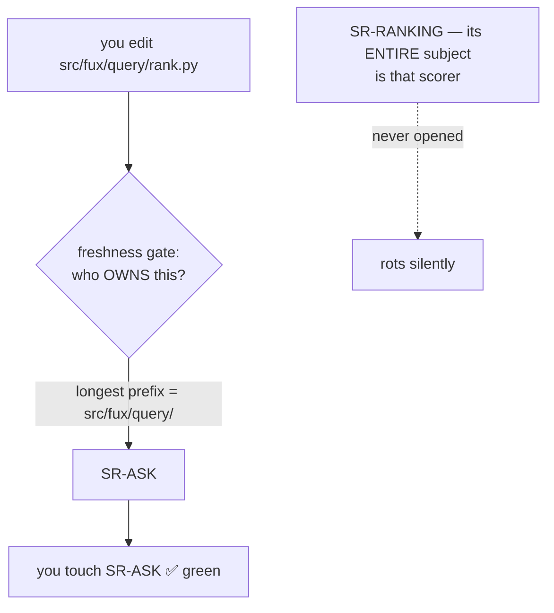

# SR-WORK-OWNERSHIP — `owns` and `describes`

## §1 — For humans

**The rule that decides which record must be opened when code changes has never
been a record.** It lives as prose in `records/README.md` — a *register*, which
documents — and is enforced by two tests. A rule with a gate and no record is
the one shape this project has repeatedly found expensive: nothing can supersede
it, nothing can veto it, and its reasoning is wherever someone last wrote a
paragraph.

This record decides it, and adds the relation
[W-82 ruling 4](../archive/open/W-82-rulings-2026-08-27.md) called for.

**The defect, concretely.** Ownership is matched by longest path prefix:



<details><summary>ASCII twin — update together, always</summary>

```text
  you edit src/fux/query/rank.py
        |
        v
  gate: who OWNS this?  --longest prefix--> src/fux/query/ -> SR-ASK
        |
        v
  you touch SR-ASK  ------------------------------->  GREEN

  SR-RANKING (whose entire subject IS that scorer)
        |
        +-- never opened, never flagged  ----------->  ROTS
```
</details>

**That ran through the whole of W-76 while sixteen records went stale.** The
check was not wrong — it is **narrower than it reads**.

**The fix is a second, additive relation.**

| relation | how many | what it means |
|---|---|---|
| **`owns`** | **exactly one** per component | this record decides what that component is |
| **`describes`** | any number | this record's subject *reaches into* that component without owning it |

The gate then demands **the owner and every describer**. Ownership is untouched,
so there is still never a question of who owns what.

⚠ **It widens *which* records must be opened. It says nothing about whether the
edit was coherent** — that is the separate gap ruling 18 filed, and this record
does not close it.

### Examples

`SR-OUTPUT` decided that every gated flag in `cli.py` must be declared
`default=None`. It owns `src/fux/output_config.py`; it owns nothing in
`cli.py`. Before this record, someone could add a flag to `cli.py`, touch
SR-CLI, go green, and leave SR-OUTPUT's constraint silently unenforced —
which is exactly the defect that shipped six flags at `default=False`.

```text
component                    owns                describes
src/fux/cli.py               SR-CLI             SR-OUTPUT
src/fux/query/__init__.py    SR-ASK             SR-CONFIDENCE, SR-OUTPUT
src/fux/derive/accel.py      SR-T1-ACCELERATOR  SR-CONFIDENCE
src/fux/query/rank.py        SR-RANKING         SR-TUNE
```

---

## §2 — For agents

### Context

- **`records/README.md` §Ownership is prose in a register.** It states
  most-specific-wins, the carve-out rule, the may-own-nothing cases and the
  `W-nn` placeholder — all load-bearing, none decided by a record.
- **Two tests enforce it**: `tests/test_sr_ownership.py` (the table and the
  tree agree) and `tests/test_sr_freshness.py` (a changed component's owner
  was opened). A gate without a record cannot be superseded or vetoed.
- **The register already names the hole in its own prose**: *"A record that
  describes a component it does not own has no mechanical protection at all.
  Open both."* — an instruction to a human, enforced by nothing.
- [W-82 ruling 4](../archive/open/W-82-rulings-2026-08-27.md) ruled the relation
  in; **this record is where it lands**, on Arpit's call 2026-08-27 that it
  deserves a record rather than another paragraph.

### Decision

1. **Two relations, and only two.** `owns` is exactly one record per component;
   `describes` is any number, including none. **`describes` never substitutes
   for `owns`** — a component with no owner fails, whatever describes it.

2. **Both are declared in the register, in two tables.** `## Ownership` between
   `<!-- OWNERSHIP-TABLE-START/END -->` and `## Describes` between
   `<!-- DESCRIBES-TABLE-START/END -->`. **Separate grids, not one grid with a
   second column**: the ownership table's own claim is *"this table is the
   answer, not a judgement call"*, and two relations in one row make it
   ambiguous which one the gate is enforcing. The markers exist so both tests
   parse rather than hard-code — a table a test hard-codes is two sources.

3. **The freshness gate demands the owner AND every describer.** One change, in
   `owning_records`, and the whole gate widens; nothing else in it moves.

4. **A describes row states WHY, in the same cell as everything else here.** A
   bare pair is unauditable — the register's rows carry their reason precisely
   so a later reader can tell a real relation from a defensive one.

5. **Most specific wins, for `owns` only.** A carve-out is justified by a
   **different decision**, not a different concern — the existing rule, now
   recorded. `describes` needs no such rule: it is a set, and every member
   fires.

6. ⚠ **A record that describes many components and owns none is a smell, not an
   error.** It usually means a carve-out was owed and `describes` was reached
   for instead, because `describes` is cheaper. **Not mechanised**: the
   threshold would be arbitrary and a wrong one would push people to under-
   declare, which is worse than the smell. Named here so a reviewer can see it.

7. **This record owns nothing**, and that is one of the two honest cases the
   register already allows: it states a mechanism spread across components each
   already claimed. ⚠ **The consequence is that the freshness gate cannot demand
   it** — so if the ownership model changes, nothing mechanical opens this file.
   It is the exact hole this record is about, and it is not closed for itself.

8. **It does NOT check coherence.** `describes` widens *which* records must be
   touched. Whether the edit made them agree is ruling 18's gap, still open.

9. **A commit is judged against the register AS IT STOOD AT THAT COMMIT.**
   Amended 2026-08-27, the day this record landed, because widening the gate
   broke it: `git show <sha>:records/README.md` is parsed per commit, so a row,
   a record or a relation that did not exist then does not judge now.

   - **The bug was in the widening itself.** `describes` was invented on
     2026-08-27 and the gate read it from the working tree, so **three commits
     from weeks earlier** were flagged for not updating a record under a rule
     written after they landed — SR-RANKING describing `src/fux/query/`. The
     same read convicted five more on **SR-CONFIDENCE** and **SR-OUTPUT**,
     records that did not exist when those commits were written.
   - **It is the third occurrence, so it is gated rather than absorbed.**
     `records/RULE-SINCE` records the other two — the SR-CACHE carve-out
     (2026-08-21) and the register renumber (2026-08-22). Both times the remedy
     was to move the baseline forward, which **retires every commit before it
     to excuse the few after**: 95 commits of auditability, to forgive three.
   - **An old register with no `DESCRIBES` markers is an empty relation, not a
     parse error** — the relation did not exist yet, and that is what empty
     means.
   - ⚠ **A register too old to parse is SKIPPED for that commit, not treated as
     empty.** Silently forgiving a commit is the failure this gate exists to
     prevent, so the escape is deliberate, narrow and named.
   - **It does not weaken anything going forward.** From the moment a row lands,
     every later commit is held to it — which is what "never retroactively"
     always meant, and what the gate's own docstring had been claiming while the
     code did the opposite.

10. 🔴 **`describes` is FILE-scoped and the descriptions it encodes are
    KEY-scoped. Veto condition 6 has fired, by Arpit's ruling of 2026-09-11, and
    the baseline moved.** Recorded here because the veto says *check, do not
    wait* — and it was checked and it was true.

    - **What fired it.** `94231b2` added the single string `"codex"` to
      `[agents] install` in `src/fux/config.py`. Three records describe that
      file — SR-ACQUIRED, SR-PII, SR-URL-FRESHNESS — because each owns
      **keys** in it, and **none of them owns that key**. The gate demanded all
      three. It was right about the table and wrong about the change.
    - ⚠ **Decision 9 did NOT fail, and the distinction is the whole entry.**
      Veto 6 was written expecting a fifth `RULE-SINCE` entry to mean
      *retroactive conviction is back*. This is not that. The register was
      correct at that commit and is correct now; `_register_at` read it
      correctly. **A fourth shape of the old cause and a first instance of a new
      one look identical from the baseline line, and only the prose tells them
      apart** — which is why `RULE-SINCE`'s fifth entry leads with the cause.
    - **The remedy Arpit ruled** — *"fix only the latest, leave the old ones"* —
      is that the baseline moves to `ce425c7`. **The cost is every commit before
      2026-09-11 losing re-auditability**, the largest such cost yet, and it is
      stated in `RULE-SINCE` rather than buried here.
    - 🔴 **THE OVER-FIRING IS NOT FIXED.** The next commit that touches
      `src/fux/config.py` for any reason will again be required to touch every
      record describing that file, whatever key it changed. This decision buys
      one red commit; it does not buy the defect.
    - **Key-scoped `describes` was DECLINED, not rejected on merit**, in the
      same exchange, alongside rebasing the offending commit and a one-sha
      waiver list. It remains the real fix and it remains large: it makes the
      describes table a key grid, and it needs a parser that can say which keys
      a diff touched. **Whoever reopens this is reopening a declined option, not
      arguing against a decided one.**

**The `describes` relation may narrow itself to SYMBOLS** (W-140 row 20,
2026-09-11): `` `path::name,name` `` in the register's component column, and
the gate demands that record only when the change touches one of those
top-level definitions.

- 🔴 **Why it was needed.** The relation is per FILE, and
  `src/fux/query/__init__.py` is described by four records while
  `src/fux/ingest/run.py` is described by two. Changing one function in either
  demanded a line in every one of them — and the lines that had nothing to say
  said *nothing here changed*. **Written twice in one session, then seven
  records in one change**, at which point it stopped being a nuisance and
  became noise that teaches a reader to skip record edits. A gate whose output
  is routinely ignorable is a gate that has stopped working.
- **A bare path still means the whole file**, so every row written before this
  is unchanged. Narrowing on absence would have switched the gate off across
  most of the table.
- **An undecidable diff demands everybody.** A new file, unparseable source, a
  non-Python file, or an edit outside every top-level block returns *cannot
  tell*, and the gate treats that as every symbol. **It may narrow on a fact
  and never on a guess** — the alternative is a check that quietly stops
  firing, which is the failure this record exists to prevent.
- ⚠ **The dangerous direction is a list that is too SHORT**, and nothing can
  check for it. A test asserts every named symbol exists (a typo would
  otherwise disable a record silently); completeness is judgment, so a row is
  narrowed only by someone who has read every mention of that record's subject
  in the file. **Two rows are narrowed today** — SR-PII on `cli.py` and
  SR-OUTPUT on `query/__init__.py` — each verified that way, and the rest are
  left whole deliberately rather than swept.

11. **`kind` says which gate a record answers to; `owns` says which components
    it claims. They are different questions** (Arpit, 2026-09-13). Every record
    declares `kind: law | component | process`, and the kind selects an
    **additional** gate — it never switches off the ownership and freshness
    gates, which apply to any record with a non-empty `owns` whatever its kind.
    The three definitions and their counts are in the register's
    [§The three kinds](README.md); they are stated there once and not repeated
    here.
    ⚠ **It is written, not derived.** `law` is derivable from the filename;
    `component` and `process` are not separable from `owns` — **SR-POSTINGS owns
    `tools/pruning-eval` and is a component record, SR-WORK-QUALITY owns
    `tools/quality` and is a process one.** Identical shape, opposite kind.
    ⚠ **What it exposed, and did not close.** Thirteen `component` records carry
    `owns: []`, so the freshness gate can never demand them — the same hole
    decision 7 admits for this record, now counted rather than felt. Decision 7's
    *two honest cases* is what a record in that list has to claim, one at a time
    and on Arpit's ruling; **the rule that would gate it — a `component` record
    must own something — is proposed and NOT in force.** Inventing an owner to
    satisfy a check would be worse than the hole.


12. **Every record carries a `content_sha` of itself** (Arpit, 2026-09-13):
    SHA-256 over the whole file with its own `content_sha:` line removed, LF,
    UTF-8, full hex, stamped by [`scripts/sr-hash.py`](../scripts/sr-hash.py)
    and checked by `tests/test_sr_content_hash.py`.
    **Why it is owed at all:** a record is amended in place, so *"which version
    of SR-X was this written against?"* has no answer from the file. The hash is
    that answer, quotable from outside git — a vendored copy, an agent policy
    file, a doc pinning the rule it was written against.
    ⚠ **It covers the frontmatter too, deliberately.** Hashing only the body
    would let `owns`, `status` and `laws` move without moving the hash, and those
    are the changes a pinning reader cares about most.
    ⚠ **It tells you THAT a record moved, never what moved**, and it is not a
    signature: it says nothing about who changed it or whether the change was
    ruled. It is a drift detector.
    ⚠ **Stamped in the SAME change that amends the record.** A hash stamped
    later describes a version nobody read.


13. **Every `owns:` claim carries the content hash of what it owns** (Arpit,
    2026-09-13): `path@<12 hex>`, SHA-256 over the file's LF-normalised bytes,
    or over `relpath\0filehash` for every file under a directory, sorted.
    Stamped by [`scripts/sr-owns.py`](../scripts/sr-owns.py) **before**
    `sr-hash.py`, because stamping a claim changes the record.
    🔴 **A directory's file list comes from `git ls-files`, not from the
    filesystem** (amended 2026-09-13, first CI run of the gate). Walking the
    directory put whatever the working tree happened to hold into the hash:
    `node/` grows a gitignored `node/dist/` the moment anyone builds the
    bundle, so a claim stamped on that machine could not match the same commit
    on a runner, and `tests/test_sr_owns_hash.py` failed on all eight CI jobs
    while passing locally for the session that stamped it. **A record owns what
    the commit carries** — tracked files, read from the working tree so an
    uncommitted edit still moves the hash and settles in the commit that lands
    it.
    **What it adds over the freshness gate:** that gate proves the owning record
    was *touched*; this proves the claim still matches the *bytes*. A comma
    satisfies the first and cannot satisfy the second.
    ⚠ **The hash is not part of the identity.** The ownership table names paths
    and nothing else, and `test_sr_owns_consistency.py` strips the suffix before
    comparing — one failure, one cause: the wrong owner there, a stale hash in
    `test_sr_owns_hash.py`.
    ⚠ **It cannot tell a redesign from a typo**, and it never will: a hash moves
    on both. A failure is a prompt to **re-read the record**, not an instruction
    to re-stamp it — the same place [SR-LAW-0](0002_LAW-0-authority.md) leaves
    coherence.
    ⚠ **The risk is noise, and it is the one to watch.** Every edit to an owned
    file fails the check until it is re-stamped, including edits no record could
    describe. **If it starts being obeyed without reading, narrow what is owned
    — never loosen the check**, which is the moving-threshold failure this repo
    has already refused twice.


14. **This is a WORK record** (Arpit, 2026-09-13). Who owns which component, and
    what a record must carry to claim one, is **how work is done** — it says
    nothing about what the engine guarantees a consumer, which is what a law or
    a component record says. It moved `0146` → `0054`, and the hole it left at
    `0146` was closed by shifting `0147`–`0156` down one, because a file number
    is an ordinal and nothing identifies a record by one
    ([the register's own convention](README.md)).
    ⚠ **That renumber is the fourth in this repo's history and the second to
    cost no `RULE-SINCE` entry.** The first three each moved the freshness
    baseline and made a stretch of history un-auditable; decision 9 — *a commit
    is judged against the register as it stood at that commit* — is why the last
    two did not. **This is the decision working, and it is worth saying out loud
    because nothing else would have noticed.**


15. **A numbered record path in a live file must RESOLVE**
    (`tests/test_record_paths_resolve.py`, 2026-09-13). This record's gates ask
    *did the owner move when the code did*; none of them asks *does this
    citation still point at a file*. **Two renumbers proved that gap the
    expensive way** — 2026-09-11 (the laws got their own range) and 2026-09-13
    (`records/` to the repo root, then the WORK range). Both repointed the
    records and the queue; both left **the rest of the tree** behind. After the
    second: **40 dead paths in `src/fux/` docstrings, 11 in `tests/`, 5 in the
    decoders `fux setup` writes into a consumer's repo, 24 in the agent
    skills** — and CI was green through all of it.

    - **It fails on exactly one thing:** a reference `NNNN_<slug>.md` that does
      not resolve **while `records/` holds that same `<slug>` under a different
      number.** The record exists; the citation points at where it used to be.
      Nothing else is a renumber miss, and nothing else fails.
    - **A slug no live record has is PERMITTED** — that is a retired record
      being *named* in prose, which CLAUDE.md §"Archive is not evidence"
      allows. The gate never forces a name into a link.
    - ⚠ **The frozen set is a stated exemption, not an oversight:** `archive/`,
      `work/regression/`, `work/golden/`, `work/WORKLOG.md`, `CHANGELOG.md`
      and any `PRE-REGISTRATION*`. These **should** carry the number that was
      true when they were written. Repointing `work/regression/**` would be
      worse than stale — a `"gold"` field in `evidence/results.json`, naming
      the document that WAS the right answer under the path it had on the day
      of the run, is a **measured datum**, not a link, and rewriting it
      falsifies the run. *(That mistake was made and reverted in
      the change that filed this decision; it is recorded because the next
      session's instinct will be the same one.)*
    - ⚠ **Generated planes are skipped, authored ones are not.**
      `.fux/index/`, `.fux/runtime/`, `.fux/enrich/`, `.fux/acquired/` and
      `.fux/node/` are rebuilt; `.fux/decoders/` and `.fux/fetchers/` are
      **authored source and stay checked** — [L10](0011_LAW-10-bundled-output.md)
      makes readable source the contract there.
    - ⚠ **This gate does not make a numbered citation CORRECT, only
      resolvable.** The standing rule is still *cite by NAME, never by number*.
      Every path it checks is a citation that should not have carried a number.
      It is the floor under that rule and never a substitute for it.

### Consequences

- **Every describes row is a row someone must maintain.** The relation is only
  as good as its declarations, and nothing detects a missing one — the gate can
  only enforce what the table already says.
- ⚠ **A widened gate fails commits that used to pass.** That is the point, and
  it will feel like friction the first few times; the alternative is the silent
  rot the diagram shows. ⚠ **It must fail only the commits written under the
  widened rule** — see decision 9. Widening the gate over history is not
  strictness, it is a false positive that trains people to reach for the escape
  hatch.
- **The register is now read from git history, not just the working tree.** One
  `git show` per commit, cached; the check stays sub-second on this repo's
  history and needs `fetch-depth: 0`, which CI already sets.
- **Carve-outs stay preferable where they fit.** If a record's subject IS a
  file, own it. `describes` is for a subject that *reaches into* a component
  another record legitimately owns.
- ⚠ **The seed table is deliberately small and first-hand.** Four rows, each
  verified against a change made in the session that wrote this record, rather
  than a sweep guessing at intent. **An unaudited bulk fill would make the
  relation look enforced while asserting things nobody checked.**

### Alternatives considered

| option | why not |
|---|---|
| **a third column on the ownership table** | one grid, fewest places to look — but two relations share a row and the table stops being unambiguous about which one the gate enforces |
| **a `describes:` key in each record's frontmatter** | local to the author, but the register stops being the single place the mapping is readable, and `test_sr_owns_consistency.py` asserts table↔`owns:` agreement in **both** directions; a second such test would be owed or the guarantee lost |
| **make the freshness gate file-level instead** | the real fix, and far larger: every directory-level row becomes N rows, and the register triples in size for a gain `describes` gets for four rows |
| **leave it as the prose instruction** *(status quo)* | *"Open both"* is what already failed, silently, for sixteen records |

### Reference (required)

- [`tests/sr_lib.py`](../tests/sr_lib.py) — `describes_table`, `describers_of`
- [`tests/test_sr_ownership.py`](../tests/test_sr_ownership.py) — the table's own checks
- [`tests/test_sr_freshness.py`](../tests/test_sr_freshness.py) — `owning_records`, widened; `_register_at` and the three tests pinning decision 9
- [`records/RULE-SINCE`](RULE-SINCE) — the three baseline moves decision 9 exists to stop needing
- **Prior art:** CODEOWNERS assigns exactly one reviewing team per path by
  last-match-wins, and is widely reported to under-notify precisely because it
  is single-valued — the same single-owner limitation this record works around
  rather than a coincidence.
  <https://docs.github.com/en/repositories/managing-your-repositorys-settings-and-features/customizing-your-repository/about-code-owners>

### Veto condition

**Check these, do not wait for them.**

1. **A component appears in the describes table and not in the ownership
   table.** `describes` has become a way to avoid deciding an owner.
2. **A record is listed as describing a component it also owns.** The row is
   noise, and noise in a table people maintain by hand is how the table stops
   being trusted.
3. **`owning_records` stops including describers.** The gate has silently
   narrowed back to what it was, and every test still passes.
   ⚠ **Or it stops reading the historical register** — `owning_records` called
   without `register=`, or `_register_at` returning the working tree's copy —
   which restores retroactive conviction and, with it, the pressure to move
   `RULE-SINCE` forward and lose history. Pinned by
   `test_a_row_written_after_a_commit_does_not_convict_it`.
6. **A `kind: process` record owns no test.** The kind's only enforcement is
   that its rule has one; a process record owning nothing is the drawer this
   record warned about, open. ⚠ **Not gated today** — SR-WORK-OWNERSHIP and
   SR-PORT-LIST are both in that state as written.
7. **`records/RULE-SINCE` gains a fourth entry.** Decision 9 was supposed to
   end the need to move the baseline for this cause; a new entry naming a
   reassignment, a renumber or a new record means it did not.
   ⚠ **FIRED 2026-09-11 — and on a cause this condition did not anticipate.**
   The fifth entry names **file-scoped `describes` against key-scoped
   descriptions**, which is neither a reassignment, a renumber nor a new record,
   so decision 9 is intact. **Read decision 10 before reading this as decision 9
   failing.** The condition stands as written for a sixth entry, and it now
   carries the lesson that *the baseline moved* is not by itself a diagnosis.
4. **A describes row carries no reason.** Unauditable rows accumulate until
   nobody can tell which relations are real.
5. **A record describes more than a handful of components while owning none.**
   Decision 6's smell, gone structural.

## References

- [W-82 ruling 4](../archive/open/W-82-rulings-2026-08-27.md) — the ruling
- [SR-LAWS](0001_LAWS.md) — Law zero, *name the record or say "no SR affected"*
- [SR-RS](0133_predictions.md) · [SR-OUTPUT](0143_output-defaults.md) ·
  [SR-CONFIDENCE](0141_confidence.md) — the records the seed rows come from
