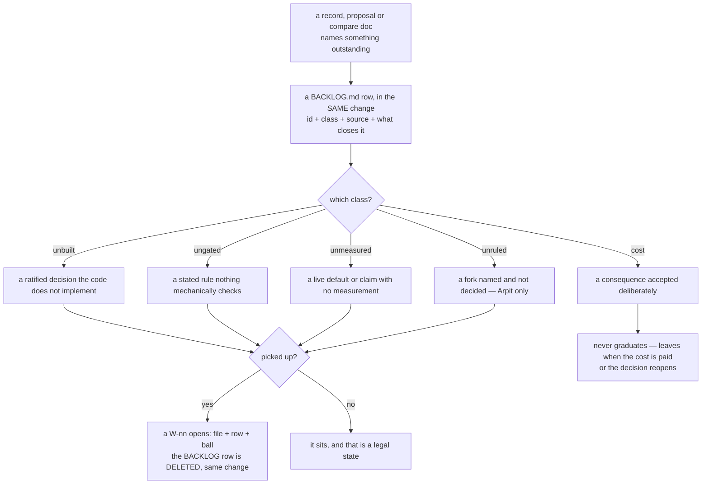

# SR-WORK-BACKLOG — how BACKLOG.md works

## §1 — For humans

> **This record is the HOME of the backlog discipline — §2's first block IS the
> rule set**, and the rest of the record is why it exists, what it costs, and
> what would reopen it.

**The records already knew.** Seventy records were read on 2026-09-13 and they
name **241** things that are decided and unbuilt, stated and
ungated, shipped and unmeasured, or forked and unruled. Every one of them was
written down honestly, once, in the record that noticed it — and then it was
findable only by whoever happened to read that record. **A hole nobody can
enumerate is a hole nobody can prioritise.**

[`work/BACKLOG.md`](../work/BACKLOG.md) is the enumeration. It is the second
work file and the last one: **the queue says what is being done, the backlog
says what has been named and is not.** Nothing in it is a commitment, nothing in
it is new, and nothing in it may be cited as evidence — every row is a pointer
at the record, proposal or compare doc that already said it.

**The one thing to carry away:** a row in `OPEN-WORK.md` is work; a row here is
a debt that has been admitted. **Its length is not a signal**, and reading it as
one is the single mistake this record exists to prevent.



<details><summary>the same diagram, as text</summary>

```text
a record, proposal or compare doc names something outstanding
  -> a BACKLOG.md row, in the SAME change: id + class + source + what closes it
       which class?
         unbuilt    a ratified decision the code does not implement
         ungated    a stated rule nothing mechanically checks
         unmeasured a live default or claim with no measurement behind it
         unruled    a fork named and not decided - Arpit only
         cost       a consequence accepted deliberately
  -> picked up?
       yes -> a W-nn opens (file + row + ball); the BACKLOG row is DELETED in
              the same change
       no  -> it sits, and that is a legal state
       cost rows never graduate: they leave when the cost is paid, or when the
       decision that accepted them reopens
```

</details>

---

## §2 — For agents

### The backlog discipline (normative)

**A · What the file is**

1. **`work/BACKLOG.md` is the single list of named-but-unclaimed work.**
   Everything in it is already stated somewhere else, and nothing in it is being
   done.
2. **It is an index of pointers, not a home.** A row states nothing its source
   does not; **the source is the authority** and the row is a finding aid.
3. ⚠ **Its length is not a signal, and this inverts
   [SR-WORK-OPEN-QUEUE](0051_WORK-open-queue.md) rule 3.** The queue's length is
   how much is pending; the backlog's length is **how honest the records have
   been**. A shrinking backlog is not progress and a growing one is not decay.
   A session that trims it to look better has destroyed the only thing it does.
4. **It carries no rule text.** Every rule is here, and the file links to this
   record rather than restating it —
   [SR-LAW-0](0002_LAW-0-authority.md) decision 1.
5. **It is not evidence and it is not a commitment.** No row promises that
   anything happens, and no live claim may be backed by one. Cite the source.

**B · What feeds it**

6. **Three sources, and only three:** anything a **record** names as
   outstanding; every file in [`work/proposals/`](../work/proposals/README.md);
   and an idea raised in a session that earns neither a record nor a proposal.
7. **An item is never in both `BACKLOG.md` and `OPEN-WORK.md`.** The queue
   wins: the moment an item has a `W-nn`, its backlog row is gone.
8. **A live fork with two implementations is a `compare/` doc, not a row here.**
   The backlog may point at one; it does not replace one.
9. **A veto condition is not a backlog item.** A veto is a check that runs
   today; a backlog item is work that does not.
10. **A rejected alternative is not a backlog item.** *Deferred, not dismissed*
    is; *rejected* is not. The record's own word decides.

**C · The shape of a row**

11. **`B-nnn` ids, assigned in filing order and never reused.**
12. **A backlog item has NO detail file**, and that is the whole difference from
    an open item. The detail is in the source, which is already maintained. A
    second copy is a second thing to keep true.
13. **One line per item, at most 400 characters, no body** — no nested bullet,
    no indented paragraph. ⚠ **The queue's cap is 280**
    ([SR-WORK-OPEN-QUEUE](0051_WORK-open-queue.md) rule 15); this one is wider by
    exactly the second citation a backlog row carries and a queue row does not —
    the source, by name, with its location inside it. **It is not a licence for
    prose.**
14. **A row is:** id, the outstanding thing in the source's own vocabulary, the
    source cited **by name** with a link, and what would close it. **The class
    is the group heading**, not a column.
15. **Every row cites a source that exists and a location inside it** — a
    decision number, a section, or the ⚠ line. A row a reader cannot check
    against its source is a rumour.
16. **Every row names what would close it.** Without one it is a wish, and it
    will sit there forever — the [`proposals/`](../work/proposals/README.md)
    directory's own rule, applied to every row.

**D · The five classes**

17. **`unbuilt`** — a ratified decision the code does not implement.
18. **`ungated`** — a stated rule nothing mechanically checks.
19. **`unmeasured`** — a live default, constant or claim with no measurement
    behind it.
20. **`unruled`** — a fork named and not decided. **Only Arpit closes one**, and
    a parked proposal is always this class.
21. **`cost`** — a consequence accepted deliberately. ⚠ **A `cost` row never
    graduates.** It leaves when the cost is paid or when the decision that
    accepted it reopens, and it exists so that nobody rediscovers it as news and
    reopens a settled argument.
22. **One class per row.** Where two fit, the class is **what would have to
    happen first** — an unmeasured default that then needs a ruling is
    `unmeasured`.

**E · How an item leaves**

23. **Promotion is opening a `W-nn`** — a detail file under
    [`work/open/`](../work/open/README.md), a row in `OPEN-WORK.md`, and a ball
    — **and deleting the backlog row in the same change.**
24. **Deleted, never ticked.** No tombstones, no DONE rows, no `closed/`.
    ⚠ **There is nothing to archive**, and that is not an exception to
    [SR-WORK-OPEN-QUEUE](0051_WORK-open-queue.md) rules 54–58 — those archive an
    item's **detail file**, and a backlog row has none (rule 12). A promoted
    item's file is created at promotion and archived when its `W-nn` closes,
    exactly as any other.
25. ⚠ **Check what the row was the only home of before deleting it.** A row that
    carries the single written statement of something moves that statement to a
    record first.
26. **A row whose source is rewritten so the item no longer exists is deleted in
    that change** — by the session that rewrote the source.
27. **A proposal's row follows its proposal.** `graduated` and still parked: the
    row stays and names the successor. `rejected`, or the file leaves the
    directory: the row goes.

**F · Ordering, and the one obligation**

28. **Grouped by class, then by source, ascending. There is no priority
    order here** — priority is the queue's job, and a second ranked list is
    always the stale one ([SR-WORK-OPEN-QUEUE](0051_WORK-open-queue.md) rule 2,
    applied to this file).
29. ⚠ **A record that names something outstanding gets its backlog row in the
    same change.** This is the obligation this record adds to every session, and
    it is the only one.
30. **Nothing regenerates this file.** *Named as outstanding* is a judgement, not
    a grep — the first sweep found the word *deferred* used as a scoring term in
    [SR-T1-ACCELERATOR](0110_accelerator.md) and as a debt in
    [SR-TUNE](0135_tuning.md), in the same sentence shape.
31. **A law, and then the queue, outrank this record.** Nothing here licenses a
    change a law forbids, and nothing here competes with `OPEN-WORK.md` for what
    a session does next.

### Context

**The records are honest and the honesty was unfindable.** Every record in this
repo names its own holes — that is what the ⚠ and 🔴 lines are, and the
[TEMPLATE](TEMPLATE.md) asks for them by name in *Consequences* (*"name the debt
and file it in `work/OPEN-WORK.md` if it is real"*). The instruction has been
followed for the debts somebody was about to work on, and **not** for the
two hundred-odd that nobody was.

**The register already said so, about itself.** Its own rule reads: *"a row with
`built: no` or `partial` names work somebody has to do, and belongs to an item
in `work/OPEN-WORK.md` — otherwise it is a decision nobody is going to act on,
which is a wish."* Five records carry `no` or `partial` today. **The queue is
the wrong home for all five**, because putting them there breaks
[SR-WORK-OPEN-QUEUE](0051_WORK-open-queue.md) rule 3: the queue's length would
stop being the amount of work actually pending.

**So the rule was unsatisfiable as written**, and the pressure went where
unsatisfiable rules always go — nowhere. The items stayed in the records, one
sentence each, spread across seventy files and 1.4 MB.

### Decision

1. **The backlog exists, it is one file, and it is
   [`work/BACKLOG.md`](../work/BACKLOG.md).** The block above is normative; the
   file is the list and states no rule.

2. **Five classes, and they are exhaustive** — `unbuilt`, `ungated`,
   `unmeasured`, `unruled`, `cost`. They are not severities. They are the
   answer to *what kind of thing has to happen*, which is what decides who can
   do it: an agent can close an `unbuilt` or an `ungated`; only a measurement
   closes an `unmeasured`; **only Arpit closes an `unruled`.**

3. **`cost` rows never graduate, and they are the reason this file is not a
   TODO list.** An accepted cost is not work — it is an argument that has
   already been had. It is written down so that the next session finds the
   argument instead of re-opening it, and so that the day the cost stops being
   acceptable, the row is already there to promote.

4. **No detail files.** An open item earns one because a builder needs a brief;
   a backlog item does not, because nobody is building it and the record is
   already the brief. **This is what keeps the backlog cheap enough to be
   complete**, and completeness is its only value.

5. **The length of this file is not a signal** (rule 3). It is stated as a
   decision rather than left to inference because every reader arrives from
   `OPEN-WORK.md`, where the opposite is true and load-bearing.

6. **`B-nnn` ids, never reused**, on the same terms as `W-nn`: an id is how a
   row, a commit message or a ruling names one item forever.

7. ⚠ **This record is `kind: process` and owns no test today.** The kind's
   contract is that a process record owns its enforcement
   ([SR-WORK-OWNERSHIP](0054_WORK-ownership.md) decision 11), and the test that
   would enforce rules 11–16 — `tests/test_backlog_rows_are_short.py`, the
   sibling of the queue's — **was not written**. This record landed ungated by
   its own standard, `built: no` in the register, and **that hole was itself the
   first row in the file it governs.** Writing a rule and calling it enforced is
   the failure both this record and the queue's exist to name.

   ✅ **CLOSED 2026-09-14 (W-164 gate 1, from B-001).**
   `tests/test_backlog_rows_are_short.py` enforces rules 11–16 and the register
   reads `built: yes`.

   🔴 **It was red on the live file on its first run, and twice — one defect
   and one misreading, which is worth telling apart:**

   - **A real rule-13 violation.** `B-129` ran to 444 characters against a cap
     of 400, carrying a trailing *"(was: …)"* whose parenthesis was never even
     closed. Trimmed to 385; the live successor it points at was already named.
   - **A misreading of rule 11, in the test.** The first draft asserted the ids
     ascend down the whole file and reported `B-241` before `B-047` as a defect.
     **It is not one.** Rule 14 makes the class the group heading, so this file
     is five ordered sections and a row's position is its CLASS, not its age —
     *filing order* is about assignment, and it survives grouping. The check
     narrowed to "ascending within each section", which is still worth having:
     a row out of order inside one is a row somebody inserted rather than
     appended.

   ⚠ **What the gate does NOT check, and cannot.** Rule 15 asks for a location
   *inside* the cited source — a decision number, a section, the ⚠ line. That
   the file exists is checkable; that the sentence there says what the row claims
   is not. **The row's own accuracy stays a human obligation**, exactly as the
   queue's rule 4 does. So does which of the five classes a row belongs in.

8. **A law outranks this record, and so does the queue.** These rules govern
   what is remembered, never what is done next.

### Consequences

- **241 items become countable in one read**, grouped by
  what would have to happen to close them. That is the whole benefit and it is
  worth the file.
- ⚠ **Rule 29 is enforced by nothing.** A session that amends a record and does
  not file the row leaves the backlog quietly incomplete, and an incomplete
  backlog is worse than none — it reads as an inventory and is a sample.
  Decision 7's test does not close this either; **no check can tell that a
  sentence names a debt.**
- ⚠ **The first sweep is a claim, not a proof.** It was one reading of seventy
  records by four agents on one day. Rows are traceable and checkable
  individually; **the set's completeness is not**, and the file says so at its
  head.
- **Five register rows can finally satisfy their own rule** without inflating
  the queue — `built: no` and `partial` now have a home that is not
  `OPEN-WORK.md`.
- ⚠ **A third work file is a real cost.** `OPEN-WORK.md`, `BACKLOG.md` and
  `proposals/` is now three places to look for *"is this known?"*, and rules 6
  to 10 exist entirely to keep the boundaries sharp. **If a session cannot say
  which of the three a thing belongs in, it belongs in `proposals/`** — that is
  [`work/README.md`](../work/README.md)'s existing tie-break, unchanged.
- **The queue's length keeps its meaning.** That property was under pressure the
  moment the register asked for 241 rows in it, and this record
  is what takes the pressure off.

### Alternatives considered

- **Put them in `OPEN-WORK.md`.** Rejected, and it is the option the register's
  own wording asks for. It destroys
  [SR-WORK-OPEN-QUEUE](0051_WORK-open-queue.md) rule 3 — a queue of 253 rows,
  of which 12 are live, is not a signal of how much is pending, and the twelve
  become unfindable. The register's sentence is amended instead.
- **A detail file per backlog item, like `work/open/`.** Rejected: 241 files
  restating 241 record sentences, each free to drift from the record that owns
  it. The record is the brief already, and rule 12 says so.
- **Generate the file from the records mechanically.** Rejected, and this was
  tried in the sweep that produced it: a grep for *deferred*, *not built*,
  *nobody has measured* returns the accelerator's *deferred-terms ceiling* — a
  scoring mechanism — beside SR-TUNE's *deferred, not dismissed* — a real debt.
  **Naming a debt is judgement**, and a generator that guesses reads as
  authority (rule 30).
- **Extend `work/proposals/` to hold them.** Rejected: a proposal is an
  **undecided idea** with a graduation trigger; an unbuilt decision is
  **decided**, and filing it as a proposal reopens a ruling that was taken. The
  two are kept separate and the backlog indexes both.
- **Leave them in the records and rely on reading.** Rejected: that is the state
  this record ends. Seventy files, 1.4 MB, and the answer to *"what do we owe?"*
  available only to whoever read all of it that week.
- **Order the file by priority.** Rejected: rule 28. Two ranked lists in one
  repo, and the one nobody is executing goes stale first.

### Reference (required)

- [SR-WORK-OPEN-QUEUE](0051_WORK-open-queue.md) rules 2, 3, 8, 11 and 54 — the
  queue's length as a signal, deletion rather than ticking, the
  check-the-only-home rule this record adopts whole, and the archive rule that
  has nothing to act on here because a backlog row carries no file.
- [SR-WORK-OWNERSHIP](0054_WORK-ownership.md) decisions 7 and 11 — the
  owns-nothing hole and the `kind: process` contract this record lands on the
  wrong side of, deliberately and out loud (decision 7).
- [SR-LAW-0](0002_LAW-0-authority.md) decision 1 — one home per rule, which is
  why the file carries none.
- [`records/README.md`](README.md) §The register — *"a row with `built: no` or
  `partial` names work somebody has to do"*, the rule that had no satisfiable
  home before this one.
- [`work/BACKLOG.md`](../work/BACKLOG.md) — the list itself, and the evidence
  that all 241 exist.

### Veto condition

**Check these, do not wait for them.**

1. **The same item has a row in `BACKLOG.md` and `OPEN-WORK.md`.** Rule 7 has
   stopped being applied, and a reader now has two states for one thing.
2. **A backlog row was worked on without a `W-nn` being opened.** The promotion
   path is being bypassed, which means work is happening with no ball, no lane
   and no detail file.
3. **`BACKLOG.md` grows a section that is not the list** — a legend, a rule, a
   narrative of what was closed. The queue's footer, returning in a new file.
4. **A row cites a source that does not name it**, or names no source at all.
   The file has started inventing work instead of indexing it.
5. **Somebody reads the file top-down as a priority order**, or trims it to make
   it shorter. Rules 3 and 28.
6. **A `cost` row was promoted to a `W-nn`** without the decision that accepted
   the cost being reopened first. Decision 3.

**How to check it:** `python -c "..."` does not exist yet — see decision 7. Until
`tests/test_backlog_rows_are_short.py` is written, the check is
`grep -c '^| B-' work/BACKLOG.md` against the ids in `work/OPEN-WORK.md`, by eye.

---

## References

*Every source this record cites, gathered in one place. §2's **Reference
(required)** names the grounding; this is the complete list. An archived
document is never listed here — the body may name one, but archive is not
evidence.*

**Records** — [SR-WORK-OPEN-QUEUE](0051_WORK-open-queue.md) · [SR-WORK-OWNERSHIP](0054_WORK-ownership.md) · [SR-LAW-0](0002_LAW-0-authority.md) · [SR-T1-ACCELERATOR](0110_accelerator.md) · [SR-TUNE](0135_tuning.md)

**Project docs**

- [`work/BACKLOG.md`](../work/BACKLOG.md)
- [`work/OPEN-WORK.md`](../work/OPEN-WORK.md)
- [`work/README.md`](../work/README.md)
- [`work/open/README.md`](../work/open/README.md)
- [`work/proposals/README.md`](../work/proposals/README.md)
- [`records/README.md`](README.md)
- [`records/TEMPLATE.md`](TEMPLATE.md)
