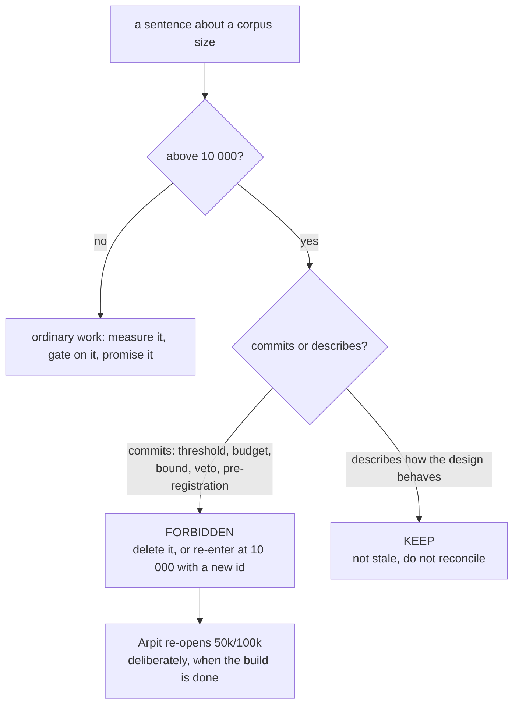

<!-- COMPONENTS-START — GENERATED from records/README.md's OWNERSHIP and DESCRIBES tables by scripts/gen-components.py. Do not edit by hand: change the table, then run `python scripts/gen-components.py --write`. -->

**Owns nothing** — [SR-WORK-OWNERSHIP](0054_WORK-ownership.md) decision 7, case (a|b); this record's own decisions say which.

<!-- COMPONENTS-END -->

# SR-WORK-SCALE — the 10 000-document ceiling

## §1 — For humans

> **This record is the HOME of the scale rule.** `CLAUDE.md` references it and
> states no part of it. Before this record existed the rule lived in that file
> alone, as ninety-three lines of prose nothing could check.

**One number decides what fux is judged at: 10 000 documents** (Arpit,
2026-08-21). Everything built here is designed, measured and ruled at that size.

**Since 2026-08-22 the number is also a ceiling, and it binds two different
things.** It bars *measuring* above 10 000, and it bars *promising* anything
above 10 000 — a threshold, a budget, a bound, a veto condition, a
pre-registration. Those are the two failure modes that cost real work: a session
with spare capacity running a 50 000-document bench nobody asked for, and a
document quietly committing fux to a number no one will ever verify.

**It does not touch the design.** A paragraph describing how the architecture
behaves at 10⁵–10⁶ documents is a description, and descriptions stay. The whole
rule reduces to one question asked per sentence: *does this commit, or does it
describe?*



<details>
<summary><b>ASCII twin</b> — the same diagram, for terminals, diffs, and any reader without a Mermaid renderer</summary>

```text
  a sentence about a corpus size
        |
        +-- at or below 10 000 --> ordinary work: measure, gate, promise
        |
        +-- above 10 000 --> commits or describes?
                                |
                                +-- COMMITS   -> forbidden. delete, or re-enter
                                |               at 10 000 with a NEW id
                                |
                                +-- DESCRIBES -> keep. not stale. do not reconcile
                                                (only Arpit re-opens 50k/100k)
```

</details>

---

## §2 — For agents

### Context

**The design point was 10⁵–10⁶ documents until 2026-08-21.** It was replaced by
10 000 because that is the size fux is actually built and evaluated at, and the
gap between the two was being paid for twice: in measurement time at sizes
nobody would ship against, and in written commitments nobody could keep.

**The ceiling arrived a day later, for a different reason.** Arpit, 2026-08-22:
*"no testing should go beyond ten thousand documents"*, and — *"anything that
talks about commitments for fifty thousand or hundred thousand or above that,
remove those commitments… there should be no rules or promises for it."* The
first clause is about spending; the second is about honesty.

**Two predictions were withdrawn under it the same day**, which is what makes it
a rule with teeth rather than a preference: **R7** (committed-index size, its
budget frozen at 100k) and **R8** (a graph-verb bound at 100k, never
registered).

⚠ **The rule has a failure mode of its own, and it has nearly fired.** Read as
*"remove anything mentioning 100 000"*, it licenses deleting correct
architectural prose — the paper's §4 names no corpus size at all, so no size
ruling can make it stale, and a session that "reconciled" it would be destroying
a correct document to satisfy a rule that does not apply to it.

### Decision

1. **The design point is 10 000 documents.** Fux is built, measured and judged
   at that size, and a feature holds up there or it does not hold up.

2. **10 000 is a ceiling on MEASUREMENT.** Above it: do not measure, do not run
   a bench, do not file a verdict.

3. **10 000 is a ceiling on COMMITMENT.** Above it: do not write a threshold, a
   budget, a bound, a veto condition or a pre-registration, and do not block
   work on one.

4. **50 000 and 100 000 are re-entered deliberately, by Arpit, when the build is
   done.** They are not a queue a session may start drawing from because it has
   capacity.

5. **R7 and R8 are retired and their ids are never reused.** If either question
   is wanted again it returns as a **new prediction at 10 000 with a new id** —
   never a revival at a smaller size, which would be moving a frozen threshold
   in disguise ([SR-RS](0133_predictions.md)).

6. **The ceiling does not reach the design's reach.** Arpit, 2026-08-22: *"since
   we are limiting it till ten k, that does not mean that we need to update the
   design. Later on, we will build it for fifty k, hundred k, and so on."* Fux is
   still architected to scale.

7. **The test is applied per sentence: commitments go, descriptions stay.** Does
   the sentence *commit* to something above the ceiling, or *describe* how the
   design behaves there? A description is **not stale**, and
   **architectural prose is never "cleaned up" to match the current test
   target.**

8. **It does not un-measure anything.** Verdicts already filed above 10 000 —
   R5's hook latency at 100 000 above all — **stand exactly as measured** and are
   never edited. A scope change is not a re-judgement.

9. **It does not delete a feature.** Arpit: *"whatever features are built, let's
   keep them — they are going to be helpful either way."* Nothing is ripped out
   for being bigger than the current target.

10. **It does not forbid an argument about scale.** *"This cost is constant in
    the corpus"* is a structural claim, not a measurement, and it stays
    legitimate. What is forbidden is going and **measuring** it at 50 000 to
    prove the point.

11. **The deployment filter did not change when the scale filter did.** A
    10 000-document corpus inside a corporation is still inside that
    corporation. Enterprise realities remain design inputs: Windows-first
    fleets, proxies and SSO in front of every internal site, air-gapped and
    regulated environments, multi-team corpora with access boundaries, audit and
    compliance demands. None of these got cheaper when the corpus got smaller.

12. **The per-feature question is:** *"does this hold up on a 10 000-document
    corpus inside that corporation, and does it foreclose 50k later?"* The
    second clause is a check against painting into a corner — **not a licence to
    build for a size nobody is measuring, and not a licence to measure one.**
    **Answer it by reasoning, never by running a 50 000-document bench.**

13. **A gate judged at a deferred size is not a blocker.** A verdict measured at
    100 000 stands as measured; it is **re-judged at 10 000 by a new
    pre-registration**, never by editing the old one. Records and compare docs
    arguing from the old design point are stale until reconciled, and that
    reconciliation is a work item, not a silent edit.

14. **Anton remains a convenient testbed. Do not design in reference to it.**

15. **This record's enforcement is unbuilt, and that is stated rather than
    implied.** Decisions 2 and 3 are mechanically checkable in principle — a
    scan for a number above 10 000 next to a commitment word in a live document
    — and nothing checks them today. The record owns no component, which
    [SR-WORK-OWNERSHIP](0054_WORK-ownership.md) decision 7 permits only when the
    case is named: **this is the honest case of a rule whose subject is what a
    sentence may claim, where a checker that cannot tell a description from a
    commitment would fail the very distinction decision 7 rests on.** Writing a
    looser check to have one would be the moving-threshold failure wearing a
    helpful face.

### Consequences

- **A session cannot spend hours at 50 000 documents to satisfy curiosity**, and
  cannot be asked to. That is the saving the rule was bought for.
- **Some questions have no answer for now**, and the honest response is to say
  so rather than to measure at a size that is closed.
- **Two prediction ids are permanently gone**, which makes the register's
  numbering non-contiguous. That is correct: a reused id would let a withdrawn
  claim return wearing the authority of a registered one.
- **The debt this leaves is decision 15's** — the two clauses that matter most
  are guarded by reading alone.

### Alternatives considered

- **Keep 10⁵–10⁶ as the design point.** Lost on cost: every gate becomes a
  multi-hour run, and fux was measuring sizes no user had.
- **A ceiling on measurement only, leaving commitments alone.** Lost 2026-08-22
  in Arpit's own words — the promises were the more expensive half, because a
  written bound at 100k reads as a guarantee forever and nobody was going to
  verify it.
- **Delete every mention of 100 000 from the repo.** Rejected as data loss: it
  destroys correct architectural prose and the filed verdicts that stand as
  measured. Decisions 7, 8 and 9 exist to forbid exactly this reading.
- **Re-register R7 and R8 at 10 000 under their old ids.** Rejected: a frozen
  threshold may never move, and re-pointing an id at a smaller size is moving
  one while appearing to honour it.

### Reference (required)

- [SR-RS](0133_predictions.md) — the prediction system: a frozen claim, the four
  ways one ends, and why a threshold may never move. The rule this record defers
  to for everything about an `R` id.
- [`docs/paper/the-fux-index-paper.md`](../docs/paper/the-fux-index-paper.md)
  §4, §8 — one keyspace (naming no corpus size, the worked example for decision
  7) and the falsifiable-prediction sequencing.
- [`work/regression/2026-08-09-pruning-rerun/VERDICT.md`](../work/regression/2026-08-09-pruning-rerun/VERDICT.md)
  — P1's FAIL, the measured precedent that a recorded negative is a successful
  outcome.
- [`work/regression/2026-08-20-r5-hook-latency/VERDICT.md`](../work/regression/2026-08-20-r5-hook-latency/VERDICT.md)
  — the 100 000-document measurement decision 8 protects.

### Veto condition

**Reopen this decision if:** Arpit re-opens a size above 10 000 — that is, a
pre-registration filed under `work/regression/` or `tools/` names a corpus above
10 000 documents **and** cites his ruling authorizing it. Until such a file
exists, the ceiling holds.

**How to check it:** `grep -rlE '(50|100) ?000|50k|100k' work/regression/*/PRE-REGISTRATION*.md tools/*/PRE-REGISTRATION*.md`
— any hit is either a pre-2026-08-22 frozen document (which stands, decision 8)
or Arpit's re-opening (which fires this veto). The run directory's own date
separates them.

---

## References

*Every source this record cites, gathered in one place. §2's **Reference
(required)** names the grounding; this is the complete list. An archived
document is never listed here — the body may name one, but archive is not
evidence.*

**Records** — [SR-RS](0133_predictions.md) · [SR-WORK-OWNERSHIP](0054_WORK-ownership.md) · [SR-WORK-BENCHMARK](0053_WORK-benchmark.md) · [SR-WORK-ENVIRONMENTS](0052_WORK-environments.md)

**Measured evidence**

- [`work/regression/2026-08-09-pruning-rerun/VERDICT.md`](../work/regression/2026-08-09-pruning-rerun/VERDICT.md)
- [`work/regression/2026-08-20-r5-hook-latency/VERDICT.md`](../work/regression/2026-08-20-r5-hook-latency/VERDICT.md)

**Project docs**

- [`docs/paper/the-fux-index-paper.md`](../docs/paper/the-fux-index-paper.md)
- [`tools/pruning-eval/PRE-REGISTRATION.md`](../tools/pruning-eval/PRE-REGISTRATION.md)
