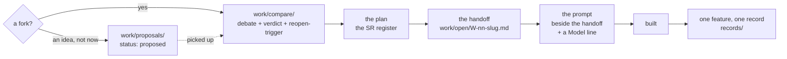

<!-- COMPONENTS-START — GENERATED from records/README.md's OWNERSHIP and DESCRIBES tables by scripts/gen-components.py. Do not edit by hand: change the table, then run `python scripts/gen-components.py --write`. -->

**Owns** — the components this record decides:

- [`tests/test_handoff_names_its_model.py`](../tests/test_handoff_names_its_model.py) · file

<!-- COMPONENTS-END -->

# SR-WORK-LIFECYCLE — how a feature travels from fork to record

## §1 — For humans

> **This record is the HOME of the lifecycle.** `CLAUDE.md` references it and
> states no stage itself.

**Nothing substantial is built here straight from a conversation.** A feature
passes through stages, each leaving a committed artifact, and the artifacts are
the reason a different model can pick the work up cold three weeks later.

**The stages exist to separate deciding from building.** A fork gets argued in a
compare doc *before* anyone writes code; an idea nobody is building yet gets
parked as a proposal rather than lost; the spec and the state of an item live in
one file so they cannot drift apart.

**The one rule inside the pipeline that is easy to skip and expensive to skip is
the model line.** Model choice is a silent failure mode: an under-powered model
on a judgment-heavy task does not error, it returns confident, plausible, wrong
work, and the cost lands later, on someone else.



<details>
<summary><b>ASCII twin</b> — the same diagram, for terminals, diffs, and any reader without a Mermaid renderer</summary>

```text
   a fork? --yes--> work/compare/ (debate + verdict + reopen-trigger)
        |                  |
        |                  v
        |            the plan (the SR register)
        |                  v
        |            the handoff  -> work/open/W-nn-slug.md
        |                  v
        |            the prompt   -> beside the handoff, names a Model
        |                  v
        |               built --> one feature, one record -> records/
        |
        +--an idea, not now--> work/proposals/ (status: proposed)
                                     ..picked up.. -> compare doc or plan entry
```

</details>

---

## §2 — For agents

### Context

**Two failures produced this pipeline.** Work that started before the fork was
settled, and had to be thrown away when the fork went the other way; and specs
that lived in a directory of their own, away from the item's state, so a reader
found a handoff and could not tell whether it had been executed.

**The handoff directory was retired on 2026-08-18** and its contents moved into
the one archive. One item, one file, spec and state together.

**The model line came from a measured shape of failure**, not from a preference
about cost: a judgment-heavy task handed to a model that cannot carry it returns
work that passes review because it reads well.

### Decision

1. **On a fork, a compare doc comes first.** Whenever a decision has multiple
   viable options, write it in [`work/compare/`](../work/compare/README.md)
   before building: the debate, a matrix, grounded references, a proposed verdict
   Arpit accepts or overrides, and an explicit **reopen-trigger**.

2. **On a parked idea, a proposal doc.** An idea worth keeping but not being
   built now goes in [`work/proposals/`](../work/proposals/README.md) with the
   same rigor and `status: proposed`. Parked, not lost: when picked up it
   graduates to a compare doc or a plan entry.

3. **The plan is the design of record**, and it is updated *before* building:
   what, why, scope in and out, the decision. Its home is the register,
   [`records/README.md`](README.md).

4. **The handoff is self-contained and lives in the item's own detail file**
   under [`work/open/`](../work/open/README.md) — context, definition-of-done,
   constraints, key files, edge cases, tests, open questions. **There is no
   handoff directory**, and creating one re-opens a decision taken on
   2026-08-18.

5. **The prompt is paste-ready and sits beside its handoff** — the four moves,
   in order: explore, plan, implement, verify.

6. **Every handoff and prompt names the model that should execute it** — a
   `**Model: <name>**` line at the top plus one sentence of *why*, and it is
   stated out loud when the prompt is handed over.

7. **The three models, by what the task is:**

   | model | the task it is for |
   |---|---|
   | **Opus** | the output quality *is* the deliverable and no test can catch a bad one: design, architecture, debate, ambiguous diagnosis, interpreting a confusing measurement, **calling a gate**, anything touching the non-negotiable constraints |
   | **Sonnet** | well-specified implementation against a written definition-of-done with tests to verify it; mechanical suite runs |
   | **Haiku** | mechanical bulk edits with an exact, unambiguous rule |

8. **When borderline, say Opus and say why it was close.** A handoff detailed
   enough to be Sonnet-executable is itself the signal that the design phase was
   finished.

9. **One feature, one record**, written from [`TEMPLATE.md`](TEMPLATE.md) on
   completion, with its components added to the ownership table in the same
   change. **The convention — the shape, the kinds, the numbering ranges and
   which range a new record takes — is stated in the register and is not
   repeated here.**

10. **Every rule, record and material decision carries a reference** — a paper,
    a post, or a concrete example link. One with no reference is incomplete:
    ground the claim, do not assert it.

11. **An implemented proposal is archived in the change that writes its record**
    — moved into [`archive/`](../archive/README.md), stamped `status:
    implemented` with the record link, and given a row naming its live
    successor. Active directories hold live work only; the archive's own rules
    are [SR-WORK-ARCHIVE](0062_WORK-archive.md)'s.

12. **The one mechanical clause is BUILT; the rest cannot be.**
    `tests/test_handoff_names_its_model.py` checks decision 6 — every file under
    `work/open/` carries a `**Model:**` line — and that **no second handoff
    directory has reappeared under `work/`**, because a handoff has one home
    and two would be free to disagree. The retired one is in
    [`archive/`](../archive/README.md) and is history.
    (Built 2026-09-14, W-173 item 9.)

    ⚠ **Naming the retired path here was itself a defect**, caught by
    `tests/test_archive_law.py` in the same change: a live record that spells a
    retired live path is how somebody goes looking for it.

    ⚠ **It reads the line's PRESENCE, never its correctness.** Nothing can know
    whether a diagnosis needed Opus, and a check that guessed would be worse
    than none: it would teach sessions to write the model the checker expects.

    🔴 **`**Model: NONE — <who, and why not a model>**` is a legal answer, and
    that is the opposite of leniency.** W-136 and W-145 are executed by
    **Codex, on Arpit's account** — the sealed benchmark's premise is that no
    Claude session sees the answers, and a Claude model executing W-145 would
    reproduce the contamination it exists to remove. *What should execute this*
    still has an answer there; **a blank line is the only wrong response**, and
    letting one pass is what the earlier absence of a check did.

    🔴 **Its collector guard compares against the DIRECTORY, not against a
    queue size** (2026-09-21). It asserted `len(items()) > 3` — a guard against
    *a collector that matches nothing is a test that always passes*, which is the
    right worry and was the wrong instrument. Closing W-199 took the queue to
    exactly three items and turned a healthy, correctly reconciled queue red:
    **a threshold on the backlog's size is a gate that fires on the absence of
    work rather than on a defect.** It now asserts the collector and
    `work/open/*.md` name the same set, which catches the thing it was reaching
    for — a pattern that stops matching, an exemption that grows, an empty
    directory — and cannot go stale when an item closes.

    **Everything else this record says is unenforced and has to be.** The
    record owns no `src/` component under the terms
    [SR-WORK-OWNERSHIP](0054_WORK-ownership.md) decision 7 sets: **the subject
    is the ORDER work happens in, and no change to the engine can make an order
    true or false.**

### Consequences

- **A fork costs a document before it costs code**, which is the whole point and
  is also the most common thing a session skips under time pressure.
- **An idea can be refused without being destroyed**, so "no, not now" stops
  being an argument about whether the idea was good.
- **A handoff is worth reading on its own**, which is what lets the work move
  between models and between surfaces.
- ✅ **Decision 12's debt is PAID** (2026-09-14): the model line is the stage
  most often dropped and the only one a check could catch, and it is now
  checked. **The check's own finding was that two items have no Claude model at
  all** — and that the honest shape is a required line that may say `NONE`,
  rather than an exemption nobody would ever revisit.

### Alternatives considered

- **A separate handoff directory.** Held until 2026-08-18 and retired: a spec
  away from its item's state cannot tell a reader whether it was executed.
- **No model line, leaving the choice to whoever runs the prompt.** Lost because
  the failure is silent — the wrong model produces confident, plausible, wrong
  work, and the cost surfaces after the work is accepted.
- **Naming a model only when it is unusual.** Rejected: the default then lives in
  whoever is reading, which is exactly the silence decision 6 closes.

### Reference (required)

- [`records/README.md`](README.md) — the register: the record shape, the three
  kinds, and the numbering ranges this record defers to entirely.
- [`records/TEMPLATE.md`](TEMPLATE.md) — the record every completed feature is
  written from.
- [`work/compare/README.md`](../work/compare/README.md) and
  [`work/proposals/README.md`](../work/proposals/README.md) — the two document
  classes decisions 1 and 2 create, and their live sets.
- [`work/open/README.md`](../work/open/README.md) — one detail file per open
  item, spec and state together.

### Veto condition

**Reopen this decision if:** a handoff-shaped document appears outside an item's
own detail file — that is, a directory other than `work/open/` starts carrying
specs for open work — or if `work/open/` files stop carrying a model line, which
would mean decision 6 has become decoration.

**How to check it:** `ls work/handoff 2>/dev/null; grep -rLc '\*\*Model' work/open/*.md`
— the first must not exist; the second names every open item missing the line.

---

## References

*Every source this record cites, gathered in one place. §2's **Reference
(required)** names the grounding; this is the complete list. An archived
document is never listed here — the body may name one, but archive is not
evidence.*

**Records** — [SR-WORK-OWNERSHIP](0054_WORK-ownership.md) · [SR-WORK-ARCHIVE](0062_WORK-archive.md) · [SR-WORK-OPEN-QUEUE](0051_WORK-open-queue.md) · [SR-WORK-BACKLOG](0055_WORK-backlog.md) · [SR-RS](0133_predictions.md)

**Project docs**

- [`records/README.md`](README.md) · [`records/TEMPLATE.md`](TEMPLATE.md)
- [`work/compare/README.md`](../work/compare/README.md)
- [`work/proposals/README.md`](../work/proposals/README.md)
- [`work/open/README.md`](../work/open/README.md)
- [`archive/README.md`](../archive/README.md)
