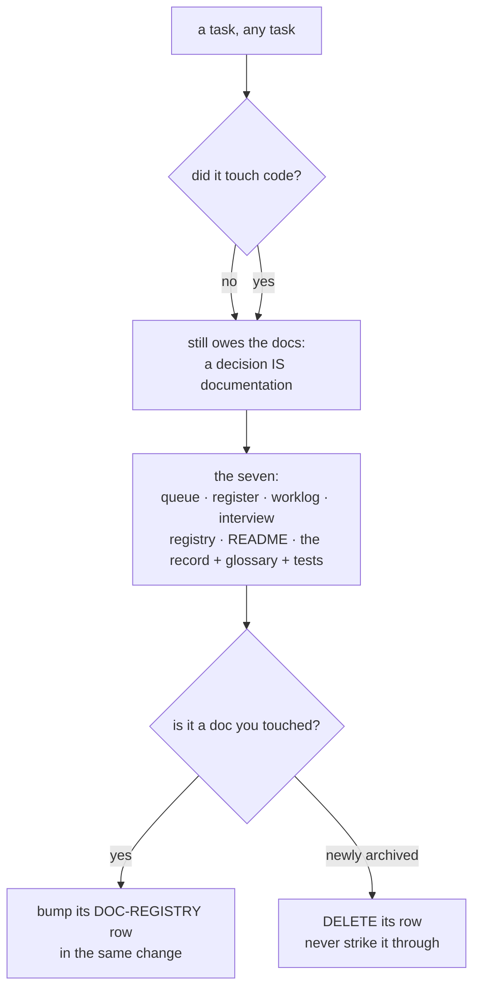

# SR-WORK-DOCS — documentation style, discipline, and what every task owes the docs

## §1 — For humans

> **This record is the HOME of the documentation contract.** `CLAUDE.md`
> references it and states none of the three rule groups itself.

**A doc here is read by an agent that will act on the first answer it finds.**
That single fact produces the form rules: short points, one idea each, the
takeaway first, no paragraph longer than a few lines. A wall of text is not a
style problem, it is a correctness problem — the answer is in there somewhere and
the reader acts before finding it.

**An agent may edit the file it is judged by**, which is unusual and deliberate
(Arpit, 2026-08-27). The protection is no longer structural, so it is two
obligations instead: say it out loud, and only ever to record a ruling of
Arpit's or to correct something untrue.

**Every task updates the docs — including a task that touched no code.** A
decision, a scope change or a plan is documentation. The set is seven files, and
the registry that tracks their freshness carries live documents only.



<details>
<summary><b>ASCII twin</b> — the same diagram, for terminals, diffs, and any reader without a Mermaid renderer</summary>

```text
  a task, any task
      |
      +-- touched code? no --+
      |                      |--> still owes the docs (a decision IS documentation)
      +-- touched code? yes -+
                             v
        the seven: queue . register . worklog . interview . registry . README .
                   the record + glossary + tests
                             v
          touched a doc?      -> bump its DOC-REGISTRY row, same change
          archived a doc?     -> DELETE its row (never strike through)
```

</details>

---

## §2 — For agents

### Context

**All three rule groups lived in `CLAUDE.md` and nowhere else** until 2026-09-14
— eighty-four lines of prose in the file every session reads first, which made
them the most-read and least-checkable rules in the repo.

**The editing rule has a history worth carrying.** This file previously said
*"Agent-steering files are proposed, never auto-applied — an agent proposes a
change as a named diff and does not apply it to itself"*, which is why
`CLAUDE.md` carried a PROPOSED header from 2026-08-09 until the 2026-08-19
rewrite was adopted. **Arpit removed it**: the proposal step had become a way for
a ruling he had already made to sit unapplied in a ledger nobody reads.

⚠ **What that rule was protecting is now unguarded.** An agent can change the
instructions it is about to be judged by, in the same session, and nothing
mechanical will flag it.

**One misreading has already cost three sessions.** A rule written for normative
content was applied to a statement of fact: three sessions read *"there is no
package on `main` yet"* while `fux-engine` was on PyPI, because nobody would
"propose a diff" to fix a fact.

### Decision

1. **No large paragraphs.** Split dense prose into short points, one idea per
   point; keep a paragraph to **3–4 lines**; if it runs longer it is two points.

2. **Make it roomy.** Blank lines between points and sections, tables for
   option and field comparisons, headings to break up anything long.

3. **Lead each point with the takeaway**, bolded where that helps scanning.

4. **Fix form on contact.** When you touch a doc carrying a wall of text, split
   it in the same change — *"fix stale docs on contact"* governs **form**, not
   only facts.

5. **Chat answers follow the same rule.** Cowork and Claude Code alike: precise,
   short paragraphs, takeaway first. The length rules themselves are
   [SR-WORK-SESSION](0060_WORK-session.md)'s.

6. **An agent may edit the agent-steering files directly** (Arpit, 2026-08-27),
   `CLAUDE.md` included. There is no proposal step.

7. **Two obligations replace the prohibition, and both are judgment:**
   **(a) say it out loud** — a change to `CLAUDE.md` is named in the session's
   output and in the worklog entry, never folded silently into a larger diff;
   **(b) a ruling of Arpit's, or a fact** — edit it to record a decision he made
   or to correct something untrue about the repo, and **never to grant yourself
   latitude you were not given.**

8. **Statements of fact are exempt from every ceremony.** A version number, a
   path, a "does not exist yet" that now exists: fixed on contact, in the change
   that notices it, with a registry bump. The rule protects what a steering file
   *instructs*, never what it *claims*.

9. **The split is `docs/` and `work/`.** `docs/` holds what the project **is**;
   `work/` holds what is **happening to it** and is the shared memory between
   sessions. [`work/README.md`](../work/README.md) is the map, and is read once.

10. **Every task updates the documentation, and a task is not done until the
    docs are true.** At minimum, and in this order:

    | # | document | what it owes |
    |---|---|---|
    | 1 | [`work/OPEN-WORK.md`](../work/OPEN-WORK.md) | the live tracker: on **every** execution, whatever the outcome — success, failure, blocked, interrupted, abandoned — the affected rows are updated before the session ends. A failed run records the failure with a one-line why, and **an item is never marked done with failing tests**. Its rules are [SR-WORK-OPEN-QUEUE](0051_WORK-open-queue.md)'s |
    | 2 | [the register](README.md) | the design of record: milestone and record status stay truthful when behaviour or scope changes |
    | 3 | [`work/WORKLOG.md`](../work/WORKLOG.md) | an entry per substantive exchange — [SR-WORK-SESSION](0060_WORK-session.md) |
    | 4 | [`work/INTERVIEW.md`](../work/INTERVIEW.md) | the agent-succession handoff: read before your first substantive change, updated when direction, strategy or a major decision changes, and you add yourself to its maintainer line when you do |
    | 5 | [`work/DOC-REGISTRY.md`](../work/DOC-REGISTRY.md) | a bumped row for any doc you touched; a new maintained doc gets a new row in the same change |
    | 6 | [`README.md`](../README.md) · [`CHANGELOG.md`](../CHANGELOG.md) | the public front door — status, guarantees, reading order; the changelog on any released change |
    | 7 | the relevant record, [`docs/GLOSSARY.md`](../docs/GLOSSARY.md) for any new recurring term, and every test the behaviour change needs | |

11. **The registry lists LIVE documents only.** An archived doc's row is
    **deleted** in the change that archives it — not struck through, not
    annotated "retired" — the same discipline the queue applies to closed items.
    **No row may point into `archive/`, every row's target must exist, and one
    document gets exactly one row.** Enforced by
    [`tests/test_doc_registry.py`](../tests/test_doc_registry.py).

12. **Every relative link in a live document resolves.** Enforced by
    [`tests/test_doc_links.py`](../tests/test_doc_links.py), whose exemptions are
    frozen-by-law documents — the append-only worklog, filed regression runs,
    pre-registrations, the archive, the changelog, the template's placeholders —
    each exempt because repairing its links would make it false, not because
    repairing them is inconvenient.

13. **Durable repo-wide knowledge is folded into `CLAUDE.md` concisely**, in the
    change that produces it, with the detail in the linked doc. If a future agent
    would act differently knowing something, it belongs there or is linked from
    there.

14. **A `kind: process` record owns its enforcement**, and this one owns the two
    tests above — both of which had **no owner at all** until this record
    existed, so the freshness gate could not fire for either.

### Consequences

- **Two previously ungated tests gained an owner**, which means a change to
  either now demands this record and a reader can find out why the rule exists.
- **The editing rule stays unguarded**, deliberately. Decision 7 is the only
  cover, and a second recorded misuse is what would turn it into a check.
- **The seven-document list is long enough that a session under pressure skips
  part of it.** Items 1 and 5 are the two that bite: an un-updated queue makes
  the queue's length meaningless, and a missing registry bump makes freshness
  unknowable.

### Alternatives considered

- **Keep the proposal step for agent-steering files.** Removed 2026-08-27 by
  Arpit: it parked his own rulings in a ledger nobody read. The exposure it
  covered is stated in decision 7 rather than restored.
- **Apply the proposal step to facts as well as instructions.** This is what
  actually happened for three sessions and it produced a false claim standing
  while a package was live. Decision 8 exists because of it.
- **One record for docs, sessions, and the OKF bundle together.** Rejected: the
  bundle answers to an external spec and its own test
  ([SR-WORK-OKF](0061_WORK-okf.md)), and the session files are a different
  subject with a different failure mode.
- **Let the registry annotate retired rows instead of deleting them.** Rejected
  on the queue's precedent: a struck-through row is still a row, and the file's
  length stops meaning what it claims to mean.

### Reference (required)

- [`tests/test_doc_registry.py`](../tests/test_doc_registry.py) and
  [`tests/test_doc_links.py`](../tests/test_doc_links.py) — this record's
  enforcement, and the executable statement of decisions 11 and 12.
- [`work/README.md`](../work/README.md) — the map decision 9 names.
- [`work/DOC-REGISTRY.md`](../work/DOC-REGISTRY.md) — the freshness tracker
  itself, and the trigger column that says when each row is owed.
- [SR-LAW-0](0002_LAW-0-authority.md) — why a steering file links and never
  restates, which is what made this record necessary.

### Veto condition

**Reopen this decision if:** a `CLAUDE.md` edit widens an agent's own latitude
without a ruling behind it, for the second recorded time — the point at which
decision 7 stops being an obligation and becomes a gate.

**How to check it:** `git log -p --follow -- CLAUDE.md | grep -nE '^\+.*(may|allowed to|at your discretion|if you judge)'`
read against the worklog entry for the same commit; a change with no ruling named
is the occurrence this veto counts.

---

## References

*Every source this record cites, gathered in one place. §2's **Reference
(required)** names the grounding; this is the complete list. An archived
document is never listed here — the body may name one, but archive is not
evidence.*

**Records** — [SR-LAW-0](0002_LAW-0-authority.md) · [SR-WORK-SESSION](0060_WORK-session.md) · [SR-WORK-OKF](0061_WORK-okf.md) · [SR-WORK-OPEN-QUEUE](0051_WORK-open-queue.md) · [SR-WORK-ARCHIVE](0062_WORK-archive.md)

**Code**

- [`tests/test_doc_registry.py`](../tests/test_doc_registry.py)
- [`tests/test_doc_links.py`](../tests/test_doc_links.py)

**Project docs**

- [`work/README.md`](../work/README.md) · [`work/DOC-REGISTRY.md`](../work/DOC-REGISTRY.md)
- [`work/INTERVIEW.md`](../work/INTERVIEW.md) · [`work/WORKLOG.md`](../work/WORKLOG.md)
- [`docs/GLOSSARY.md`](../docs/GLOSSARY.md)
