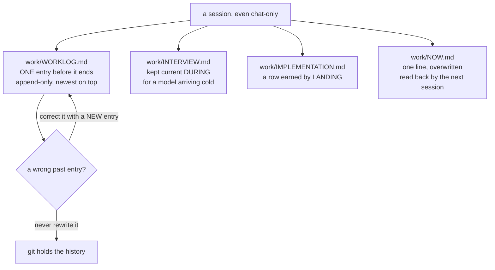

# SR-WORK-SESSION — what a session owes before it ends

## §1 — For humans

> **This record is the HOME of the session contract.** `CLAUDE.md` references it
> and states none of it.

**A session ends and takes its context with it.** Everything the next one knows
was written down deliberately, which is why three files are owed every time —
including a chat-only session where no code moved. If no code moved, that is
itself the entry.

**The three are not interchangeable.** The worklog is the granular, per-exchange
trail, appended and never edited. The interview is the strategic state of play,
kept current *during* the work and written for a different model arriving
mid-task with zero other context. The milestone log is the evidence store, and a
row in it is earned by landing, never by being planned.

**How an agent speaks is part of the contract too** — one-line transition
markers rather than summaries, and answers that lead with the answer and stop.
A recap of work whose diff is already on screen is not a service.



<details>
<summary><b>ASCII twin</b> — the same diagram, for terminals, diffs, and any reader without a Mermaid renderer</summary>

```text
  a session (even chat-only)
     |-- work/WORKLOG.md        one entry before it ends; append-only, newest on top
     |-- work/INTERVIEW.md      kept current DURING; for a model arriving cold
     |-- work/IMPLEMENTATION.md a row is earned by LANDING, never by planning
     |-- work/NOW.md            one line, overwritten, read back next session

  a wrong past entry -> correct it with a NEW entry, never a rewrite
                        (git holds the history)
```

</details>

---

## §2 — For agents

### Context

**Sessions here are concurrent and short-lived.** Cowork, Claude Code and
scheduled tasks all touch the same files on the same machine, and a session can
die mid-task. Every rule below exists because something was lost that way.

**The mandatory cost line was dropped on 2026-08-21** after 58 of 58 entries had
said `unmeasured` — a field nobody could fill is a field that teaches readers to
skip the form.

**Two hazards were recorded on 2026-09-12, on one machine in one day.** A peer
session committed a fix to code this session had written and not yet committed;
and a loaded machine produced a clean, localised anomaly that read exactly like a
real regression and would have been filed as one.

### Decision

1. **Every session appends exactly one worklog entry before it ends** —
   [`work/WORKLOG.md`](../work/WORKLOG.md) — covering what was asked, what got
   done, what was decided or left open, and the single next step. **A chat-only
   session counts**; if no code moved, that is the entry.

2. **The worklog is append-only, newest on top, and a past entry is never
   edited.** A wrong old entry is corrected by a **new** entry. The one exception
   is a repo-wide mechanical rename, where every reference is repointed in one
   change and the entry doing it says so.

3. **[`work/INTERVIEW.md`](../work/INTERVIEW.md) is kept current DURING the
   session**, not in a wrap-up pass. Four maintained sections: state of play ·
   in-flight work with the immediate next step · standing constraints · lessons
   learned. **A stale interview at handoff is as serious as a missing changelog
   entry.**

4. **[`work/IMPLEMENTATION.md`](../work/IMPLEMENTATION.md) is the evidence
   store** the queue reconciles against before anything is called done. **A row
   is earned by landing, never by being planned.**

5. **[`work/NOW.md`](../work/NOW.md) carries one line, overwritten.** It is read
   back into the next session, so a session that dies mid-task leaves a note
   rather than a mystery.

6. **Announce every transition in one line — a marker, never a summary.** Name
   the item id and what is starting before you start; on finishing, `✓ <id>` and
   immediately what starts next, on one line. **A finish with no next is a stop,
   and a stop is its own sentence.**

   ```text
   → W-56: building fux-lab from SETUP-LAB
   ✓ W-56 lab environment · → W-56 playground corpus
   ✓ W-56 · → W-59: the R4 measurement
   ```

7. **Keep a todo list for anything with more than two steps, current during the
   work.** A list updated at the end is a report, not a plan.

8. **Ten lines or fewer unless more was asked for, and lead with the answer.**
   Reasoning only when asked or when the answer depends on it; tables and code
   over prose. **Length follows the work, not the effort** — a four-hour change
   can be three lines.

9. **Never summarise work you just did** — the diff showed it. **No closing
   offers**: ask a real question or stop. A transition marker is a pointer; a
   summary is a substitute for reading.

10. **Concurrent sessions are real.** Re-derive `git status` immediately before
    staging, **re-apply your changes to `work/*.md` right before committing**,
    and **commit with explicit pathspecs** — `git commit -- <paths>` — when the
    index carries another session's work.

11. **Ground truth over prose.** Before writing any status claim — release
    state, test counts, "nothing pending", "X is done" — check it against the
    source of truth: `git log`/`status`/`tag`, the code, or a command that
    reproduces it. **A doc repeating another doc is not a second source.**

12. **Say what you are running, and when, to anyone sharing the machine.** A
    loaded machine does not produce noise; it produces a clean, localised anomaly
    in exactly the shape a real regression takes — noise gets distrusted, this
    gets filed. Interleaving arms (`A B A B`) defends the *difference* and never
    the absolute number. Recorded as an unguarded gap in
    [`work/setup/fux-benchmark.md`](../work/setup/fux-benchmark.md) standing rule 0a.

13. 🔴 **TWO STRIKES → A GATE. A failure class this file records twice becomes
    a test or a mechanical check IN THE SAME CHANGE that records the second
    occurrence.** Recurring lessons are gated, not re-learned. (Arpit,
    2026-08-12.)

    **It is an obligation on the session that writes the second entry**, which
    is why it lives here: the worklog is where a failure class becomes
    countable, and the moment of counting is the only moment anybody is looking.

    ⚠ **Stated here from 2026-09-14, and it had been stated in `CLAUDE.md` and
    nowhere else** — while [SR-LAW-0](0002_LAW-0-authority.md),
    [SR-WORK-OPEN-QUEUE](0051_WORK-open-queue.md),
    [SR-RS](0133_predictions.md) and [SR-OUTPUT](0143_output-defaults.md) all
    cited *"`CLAUDE.md`'s two-strikes rule"* as authority. Under L0 that made
    `CLAUDE.md` the normative home of a rule four records rest on, which is
    exactly the shape L0 forbids, and folding §Triage first out of `CLAUDE.md`
    would have deleted the only statement of it. Found by W-173 on contact.

    ⚠ **What it does NOT say**, and the distinction is the whole of it: a gate
    is owed for a **failure class**, not for a failure. Two unrelated mistakes
    are two mistakes. The same mistake in the same shape twice is a class, and
    the second entry is where somebody has to stop and build the check.

    ⚠ **Unenforced, and it has to be.** A check for *"did this change add a
    gate?"* would grade the presence of a test, which is the thing a session
    can satisfy without satisfying the rule. Decision 13a below is the same
    argument for this record as a whole.

13a. **This record's enforcement is unbuilt, and the honest case is named.**
    Decisions 1 and 5 are mechanically checkable — an entry exists for today, a
    pointer was overwritten — but a check would grade *presence*, never
    truthfulness, and an entry written to satisfy a gate is the failure the
    worklog exists to prevent. Under
    [SR-WORK-OWNERSHIP](0054_WORK-ownership.md) decision 7 the record owns
    nothing rather than claiming a component that would not measure what it
    cares about.

### Consequences

- **A new session can start cold** from four files, which is the only reason
  handing work between models works at all.
- **The worklog grows monotonically** — over eleven thousand lines today — and
  that is accepted: it is a trail, not a summary, and the interview is what a
  reader in a hurry opens instead.
- **Decisions 8 and 9 are in permanent tension with a thorough session's
  instinct to explain itself.** The rule wins; the explanation goes in the
  worklog entry, where someone can choose to read it.
- **Nothing here is gated** (decision 13), so all of it rests on the session
  doing it.

### Alternatives considered

- **A mandatory cost line on every entry.** Shipped, then dropped 2026-08-21
  after 58 of 58 entries said `unmeasured`.
- **Editing a past worklog entry to correct it.** Rejected permanently: an
  append-only log whose past can move is not evidence of anything.
- **A wrap-up pass that writes the interview at the end.** Rejected — the
  session that dies mid-task is exactly the one whose state mattered, and it
  never reaches its wrap-up.
- **A test asserting a worklog entry exists per session.** Considered and
  refused in decision 13: it grades presence, and a gate-satisfying entry is
  worse than none because it looks like a handoff.

### Reference (required)

- [`work/WORKLOG.md`](../work/WORKLOG.md) — the log itself, and its header's
  statement of the entry format decision 1 requires.
- [`work/INTERVIEW.md`](../work/INTERVIEW.md) — the succession document
  decision 3 governs.
- [`work/setup/fux-benchmark.md`](../work/setup/fux-benchmark.md) standing rule
  0a — where decision 12's hazard is recorded as unguarded.
- [SR-WORK-OPEN-QUEUE](0051_WORK-open-queue.md) — the queue's own obligations,
  which this record defers to and does not restate.

### Veto condition

**Reopen this decision if:** a second session loses work to a file that was owed
and not written — that is, the worklog records a hand-off failure whose cause is
a missing entry or a stale interview for the second time, which is the trigger
that turns a stated obligation into a gate.

**How to check it:** `grep -nic 'stale INTERVIEW\|no worklog entry\|lost the handoff' work/WORKLOG.md`
— read the hits, since the count includes this record's own citation of the rule.

---

## References

*Every source this record cites, gathered in one place. §2's **Reference
(required)** names the grounding; this is the complete list. An archived
document is never listed here — the body may name one, but archive is not
evidence.*

**Records** — [SR-WORK-OPEN-QUEUE](0051_WORK-open-queue.md) · [SR-WORK-OWNERSHIP](0054_WORK-ownership.md) · [SR-WORK-DOCS](0059_WORK-docs.md) · [SR-WORK-ENVIRONMENTS](0052_WORK-environments.md)

**Project docs**

- [`work/WORKLOG.md`](../work/WORKLOG.md) · [`work/INTERVIEW.md`](../work/INTERVIEW.md)
- [`work/IMPLEMENTATION.md`](../work/IMPLEMENTATION.md) · [`work/NOW.md`](../work/NOW.md)
- [`work/setup/fux-benchmark.md`](../work/setup/fux-benchmark.md)
