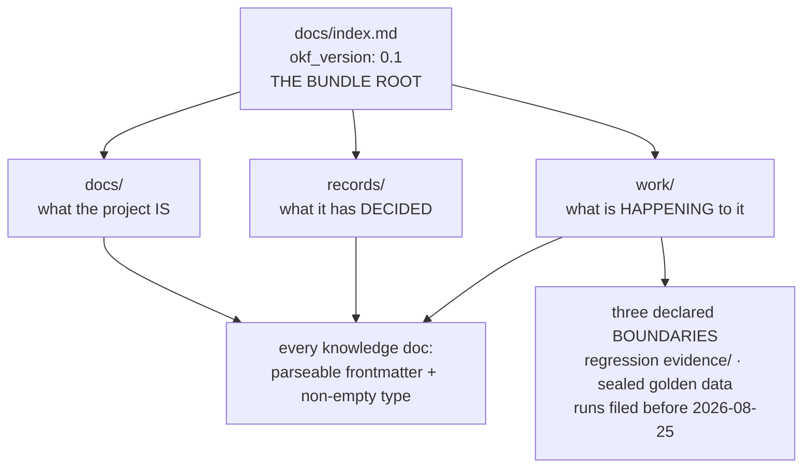

# SR-WORK-OKF — the repo is an OKF knowledge bundle

## §1 — For humans

> **This record is the HOME of the bundle rule.** `CLAUDE.md` references it and
> states none of it.

**Fux's docs are not just markdown in directories — they are a declared
knowledge bundle** in Google's Open Knowledge Format (OKF v0.1), an open spec
for knowledge as a directory of markdown files with YAML frontmatter. The point
is that a consumer can walk the tree mechanically: one required field, `type`,
on every knowledge document.

**The bundle is three trees** — `docs/` (what the project is), `records/` (what
it has decided) and `work/` (what is happening to it) — rooted at
[`docs/index.md`](../docs/index.md), which declares the version and spans all
three.

**A conformance claim is only worth what checks it.** For three months the repo
claimed plain conformance while 94 of 314 files failed the bar, protected by a
repo-invented exemption the spec does not contain.



<details>
<summary><b>ASCII twin</b> — the same diagram, for terminals, diffs, and any reader without a Mermaid renderer</summary>

```text
  docs/index.md  (okf_version: 0.1)  = THE BUNDLE ROOT
      |-- docs/     what the project IS
      |-- records/  what it has DECIDED
      |-- work/     what is HAPPENING to it
              |
              v
     every knowledge doc: parseable frontmatter + non-empty `type`
              |
              +-- three declared BOUNDARIES (not waivers):
                    regression evidence/ . sealed golden data .
                    runs filed before 2026-08-25
```

</details>

---

## §2 — For agents

### Context

**The format was adopted to make the docs machine-walkable**, which is the same
property fux sells: knowledge that a tool can enumerate, not prose a human has to
find.

**The bundle spanned one tree until 2026-08-18**, when it split into *what the
project is* and *what is happening to it*. `records/` moved to the repo root on
2026-09-13. **Neither move changed the bundle** — only its shape — because the
root index spans whatever the trees are.

🔴 **The exemption that had to go.** `CLAUDE.md` used to say *"ALL-CAPS markdown
files carry no YAML frontmatter… exempt from the `type` requirement"*. The spec
has no such rule. Measured in
[`work/proposals/positioning-documents-not-code.md`](../archive/proposals/positioning-documents-not-code.md)
§6: **94 of 314 files failed the bar the repo was claiming to meet.** The rule
had been prose and nothing else since adoption.

### Decision

1. **The documentation follows OKF v0.1**, and the claim is plain conformance —
   not conformance with local exceptions.

2. **The bundle is `docs/` + `records/` + `work/`**, rooted at
   [`docs/index.md`](../docs/index.md), which declares `okf_version: "0.1"` and
   indexes all three. **Repo-root `CLAUDE.md` and `README.md` are tool entry
   points outside the bundle.**

3. **Every knowledge document in the bundle carries a non-empty `type`** — the
   only field OKF requires. `type: Compare Doc` · `Proposal` · `Standing Record`
   · `Handoff` · `Paper`, and for the trackers `Queue` · `Log` · `Index` ·
   `Glossary` · `Pointer`.

4. **There is no ALL-CAPS exemption**, and a new ALL-CAPS file declares a `type`
   like every other. The exemption was retired 2026-09-12.

5. **Provenance keys are legal OKF extensions**, and a consumer must preserve
   keys it does not know.

6. **`work/WORKLOG.md` follows OKF's `log.md` convention** — date-grouped,
   newest first.

7. **The conformance bar is OKF §9:** parseable frontmatter and a non-empty
   `type` everywhere; **be permissive when consuming.**

8. **Three things sit outside the bundle, and each is a boundary rather than a
   waiver** — regression `evidence/` (primary data, not a knowledge document),
   the sealed `work/golden/` test data
   (which [no Claude session reads](../work/golden/README.md)), and regression runs filed before 2026-08-25 (frozen, on the same
   baseline and for the same stated reason as `CLASSIFY_SINCE` in
   [`tests/test_regression_runs.py`](../tests/test_regression_runs.py)). **The
   test's docstring carries the reason for each**, which is what makes them
   boundaries a reader can argue with.

9. **The scope is declared in [`docs/index.md`](../docs/index.md); the test is
   what keeps the declaration true.** Enforced by
   [`tests/test_okf_bundle.py`](../tests/test_okf_bundle.py) since 2026-09-12.

10. **A `kind: process` record owns its enforcement**, and this one owns that
    test — which had **no owner** until this record existed.

### Consequences

- **A new tracker costs one frontmatter block**, and a new directory under a
  bundle root brings every file in it into scope.
- **The bundle's shape can move without the claim moving**, which is what made
  the `records/` relocation a non-event for conformance.
- **The three boundaries are the honest cost.** Each is a place a consumer
  walking the bundle finds nothing, and each is stated rather than silently
  skipped.
- **The count is asserted, not assumed** — the test fails if the tree shrinks
  below the document count it expects, so a move that silently drops a root is
  caught.

### Alternatives considered

- **Keep the ALL-CAPS exemption and claim conformance anyway.** This is what the
  repo did until 2026-09-12, and it was false: a claim of plain conformance with
  94 failing files is a claim nobody could rely on.
- **Keep the exemption and claim "OKF-inspired".** Rejected: the value of the
  format is that a consumer can walk the tree without knowing local conventions,
  and a qualified claim returns exactly the burden the format removes.
- **Waive the three boundaries into the bundle by giving them frontmatter.**
  Rejected for the frozen runs and the sealed data: editing a filed measurement
  to satisfy a doc gate breaks a stronger rule than the one it satisfies.

### Reference (required)

- [OKF v0.1 specification](https://github.com/GoogleCloudPlatform/knowledge-catalog/blob/main/okf/SPEC.md)
  — the format itself, and §9's conformance bar.
- [The annotated OKF guide](https://okf.md/spec/) — the readable companion.
- [`tests/test_okf_bundle.py`](../tests/test_okf_bundle.py) — this record's
  enforcement; its docstring states why each of the three boundaries is one.
- [`work/proposals/positioning-documents-not-code.md`](../archive/proposals/positioning-documents-not-code.md)
  §6 — the measurement that found 94 of 314 files failing the claimed bar.

### Veto condition

**Reopen this decision if:** the bundle root stops spanning a live tree — a new
top-level directory of knowledge documents exists that
[`docs/index.md`](../docs/index.md) does not index — or OKF publishes a version
past 0.1 whose required fields differ.

**How to check it:** `ls -d */ | grep -vE '^(src|tests|tests_e2e|tools|node|scripts|archive|dist|docs|records|work)/'`
names any new top-level directory; `grep -n 'okf_version' docs/index.md` states
the version the repo claims.

---

## References

*Every source this record cites, gathered in one place. §2's **Reference
(required)** names the grounding; this is the complete list. An archived
document is never listed here — the body may name one, but archive is not
evidence.*

**Records** — [SR-WORK-DOCS](0059_WORK-docs.md) · [SR-RS](0133_predictions.md) · [SR-WORK-SESSION](0060_WORK-session.md)

**Code**

- [`tests/test_okf_bundle.py`](../tests/test_okf_bundle.py)
- [`tests/test_regression_runs.py`](../tests/test_regression_runs.py)

**Project docs**

- [`docs/index.md`](../docs/index.md)
- [`work/proposals/positioning-documents-not-code.md`](../archive/proposals/positioning-documents-not-code.md)
- [`work/golden/README.md`](../work/golden/README.md)

**Papers and specifications**

- Google Cloud Platform, *Open Knowledge Format (OKF) v0.1* — the one field this
  record turns into a gate.
  <https://github.com/GoogleCloudPlatform/knowledge-catalog/blob/main/okf/SPEC.md>
