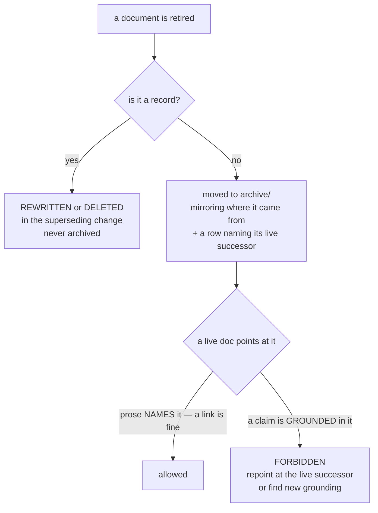

<!-- COMPONENTS-START — GENERATED from records/README.md's OWNERSHIP and DESCRIBES tables by scripts/gen-components.py. Do not edit by hand: change the table, then run `python scripts/gen-components.py --write`. -->

**Owns** — the components this record decides:

- [`tests/test_archive_law.py`](../tests/test_archive_law.py) · file

<!-- COMPONENTS-END -->

# SR-WORK-ARCHIVE — one archive, and archive is not evidence

## §1 — For humans

> **This record is the HOME of the archive rule.** `CLAUDE.md` references it and
> states none of it.

**There is one archive and it is [`archive/`](../archive/README.md) at the repo
root** (Arpit, 2026-08-10, restated 2026-08-18). Nothing under `docs/` or `work/`
is an archive. A second one is how a reader ends up citing a retired document
believing it was live.

**The load-bearing rule is about grounding, not linking.** An archived document
may be *named* — *"superseded by X"*, *"W-52's trigger"* — and that sentence may
carry a hyperlink. What it may never do is **back a live claim**, because nothing
guarantees the file was not overwritten after it was retired.

**Records are the one exception to archiving at all** (Arpit, 2026-09-06): a
superseded record is rewritten or deleted in the change that supersedes it, so
there is no second file left behind to be found and mistaken for current.



<details>
<summary><b>ASCII twin</b> — the same diagram, for terminals, diffs, and any reader without a Mermaid renderer</summary>

```text
  a document is retired
      |
      +-- a record?  yes -> REWRITTEN or DELETED in the superseding change
      |                     (never archived; records/ is the whole set)
      |
      +-- a record?  no  -> moved to archive/, mirroring its origin,
                            + a row naming its live successor (or "none")
                                  |
              a live doc NAMES it (link included)  -> allowed
              a live claim is GROUNDED in it       -> forbidden: repoint at the
                                                      successor, or re-ground it
```

</details>

---

## §2 — For agents

### Context

**Two archives existed once**, and the cost was not theoretical: a citation
resolved into a tree the reader believed was live.

**The naming-versus-citing distinction was ruled on 2026-08-27** because the
stricter reading — no link may point into `archive/` — would have forced ~40
existing, correct sentences to be rewritten, and a rule that makes correct prose
illegal gets routed around.

⚠ **A test for the distinction was written and deliberately removed rather than
shipped red.** It could not tell naming from citing, and adjudicating it by
writing a looser check would have been the moving-threshold failure in a
different costume.

### Decision

1. **Exactly one archive exists: [`archive/`](../archive/README.md) at the repo
   root.** Nothing under `docs/` or `work/` is an archive.

2. **Anything archived is MOVED there, into a directory mirroring where it came
   from** — the handoff directory, for instance, retired wholesale into
   `archive/handoff/`.

3. **Every archived document gets a row in `archive/README.md` naming its live
   successor**, or saying plainly that it has none.

4. **An archived document may be NAMED in prose, and that sentence may link to
   it** — including from a Reference block. This rule governs where a claim is
   **grounded**, never whether a hyperlink may point somewhere. The ~40 existing
   links into `archive/` all stand: **no repointing is owed and no test is owed.**

5. **An archived document may NEVER back a live claim.** Nothing guarantees the
   file was not overwritten after retirement, so it is not evidence.

6. **When repointing a citation away from an archived doc, point it at the live
   successor** — do not just delete the link. A deleted link leaves the claim
   ungrounded and nobody can see that anything is missing.

7. **If an archived doc was a claim's only support, the claim needs new
   grounding** — code, a live doc, or a measured run under
   [`work/regression/`](../work/regression/README.md).

8. ⚠ **The exposure this leaves is real and unguarded, and is stated rather than
   patched:** a Reference block can consist entirely of archive links, leaving a
   claim ungrounded with nothing flagging it. **Decisions 4–7 are the only
   guard.**

9. **Records are never archived** (Arpit, 2026-09-06). A superseded record is
   **rewritten or deleted in the change that accepts its successor**, and the
   successor states in prose what it replaced. `records/` is the whole set, a
   citation resolves there or it does not resolve at all, and **no live document
   may link to a retired record — the file is gone.**

10. **`archive/v0.26-docs/adr/` keeps its own name and `ADR-NNNN` citation
    form.** It is frozen and separately numbered, and renaming a frozen tree to
    match a live convention is how an archive stops being evidence of what was.
    Cited as *"archived SR-NNNN"* **with its path**, never as a bare number.

11. **Links inside `archive/` are never repaired.** The tree is frozen, so its
    links are exempt from the resolution gate — a repair would make the archived
    document describe a tree it never saw.

12. **A `kind: process` record owns its enforcement**, and this one owns
    [`tests/test_archive_law.py`](../tests/test_archive_law.py) — which had **no
    owner** until this record existed. It fails on a second `archive` directory
    anywhere, and on a live doc still pointing at one where the rule forbids it.

### Consequences

- **Retiring a document is a three-part move** — the file, its row, and any live
  citation of it — and skipping the third leaves a claim grounded in a frozen
  file.
- **Decision 9 means record history lives only in git.** That is the trade
  [SR-LAW-0](0002_LAW-0-authority.md)'s amend-in-place rule already made; this
  record just refuses to build a second home for it.
- **Decision 8 is a named hole.** It is the one thing here a check could plausibly
  cover and does not, and it was closed once and reopened deliberately.

### Alternatives considered

- **Two archives, one per tree.** Lost 2026-08-10: a citation into either cannot
  be distinguished from a live one by a reader in a hurry.
- **Forbid every link into `archive/`.** Lost 2026-08-27: it makes ~40 correct
  sentences illegal and forces deletions that leave claims silently ungrounded.
- **Ship the naming-versus-citing test anyway, red.** Rejected: a red gate that
  cannot be satisfied trains everyone to ignore gates, and loosening it until it
  passed would have made it assert something weaker than the rule.
- **An archive tier for superseded records.** Deleted outright on 2026-09-06.
  Keeping retired records gave a reader a second file that looked authoritative;
  the register's own history note records what that cost.

### Reference (required)

- [`tests/test_archive_law.py`](../tests/test_archive_law.py) — this record's
  enforcement: one archive, and no live doc pointing into it where it may not.
- [`archive/README.md`](../archive/README.md) — the map decision 3 requires: every
  archived document and its live successor.
- [`records/README.md`](README.md) §One directory, one state — decision 9's home
  in the register, and the deletions that implemented it.
- [`tests/test_doc_links.py`](../tests/test_doc_links.py) — decision 11's
  exemption, stated as code.

### Veto condition

**Reopen this decision if:** a second `archive` directory exists anywhere in the
tree, or a checker appears that can distinguish *naming* an archived document
from *grounding* a claim in one — the latter would close decision 8's hole and
make the removed test shippable.

**How to check it:** `find . -type d -name archive -not -path './.git/*'` must
print exactly `./archive`.

---

## References

*Every source this record cites, gathered in one place. §2's **Reference
(required)** names the grounding; this is the complete list. An archived
document is never listed here — the body may name one, but archive is not
evidence.*

**Records** — [SR-LAW-0](0002_LAW-0-authority.md) · [SR-WORK-DOCS](0059_WORK-docs.md) · [SR-WORK-LIFECYCLE](0058_WORK-lifecycle.md) · [SR-RECORD](0109_index-record.md)

**Code**

- [`tests/test_archive_law.py`](../tests/test_archive_law.py)
- [`tests/test_doc_links.py`](../tests/test_doc_links.py)

**Project docs**

- [`archive/README.md`](../archive/README.md)
- [`records/README.md`](README.md)
- [`work/regression/README.md`](../work/regression/README.md)
