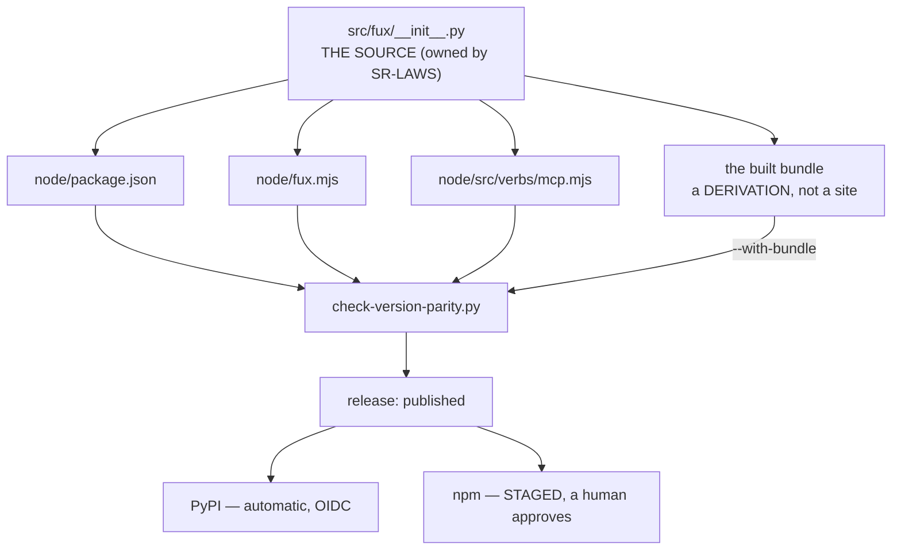

# SR-WORK-RELEASE — one name in two registries, and what actually blocks a merge

## §1 — For humans

> **This record is the HOME of the release contract.** `CLAUDE.md` references it
> and states none of it. The version's *history* is
> [`CHANGELOG.md`](../CHANGELOG.md)'s and is not repeated anywhere.

**One package name, two registries, two different paths.** A GitHub release
publishes to PyPI automatically over OIDC; the npm half **stages** and waits for
a human to approve it on npmjs.com. That asymmetry is npm's own recommendation
and was taken deliberately — both jobs hang off one `release: published` trigger.

**The version number has one source and several copies.** The source is the
Python package's own `__init__`; the Node reader carries three more hand-written
strings, and the published bundle carries a generated one. Nothing checked them
until 2026-09-12, so a bump that missed one would have shipped a wheel and a
tarball naming different releases.

**The merge wall protects history, not quality.** There are no required status
checks on `main`. Admins are included, force-push and deletion are refused, and
that is the whole of it — so **reading CI is the author's job**, not something
the wall guarantees.



<details>
<summary><b>ASCII twin</b> — the same diagram, for terminals, diffs, and any reader without a Mermaid renderer</summary>

```text
  src/fux/__init__.py  = THE SOURCE (owned by SR-LAWS, not by this record)
      |-- node/package.json          \
      |-- node/fux.mjs                >  four hand-written SITES
      |-- node/src/verbs/mcp.mjs     /
      |-- the built bundle            = a DERIVATION (checked --with-bundle)
                  |
                  v
        scripts/check-version-parity.py
                  |
        one trigger: release: published
                  |-- PyPI : automatic (OIDC)
                  +-- npm  : STAGED, a human approves on npmjs.com
```

</details>

---

## §2 — For agents

### Context

**A false claim stood in `CLAUDE.md` until 2026-09-12:** that the Python
package's `__init__` was the *only* copy of the version. W-107's Node reader had
added three more hand-written strings and nothing compared them.

**The consequence was shippable, not hypothetical.** A bump that missed one site
would publish a PyPI wheel and an npm tarball claiming different releases, and
both registries would accept it.

**The bundle looked like a fifth site and is not one.** It is generated, so what
has to be checked is the *derivation* — the built artefact against the source —
rather than a string somebody might forget to edit.

### Decision

1. **The distribution name is `fux-engine`; the import package is `fux`.** One
   name in both registries.

2. **The version's source is the Python package's own `__init__`**, which
   `pyproject.toml` reads dynamically. **That component belongs to SR-LAWS and is
   not claimed here** — one component, one owner.

3. **It is the SOURCE, not the only copy.** Four hand-written sites exist today:
   the source, `node/package.json`, `node/fux.mjs` and `node/src/verbs/mcp.mjs`.

4. **[`scripts/check-version-parity.py`](../scripts/check-version-parity.py) is
   the enforcement**, run by
   [`tests/test_version_parity.py`](../tests/test_version_parity.py) on every
   push and by the release workflow before a release builds.

5. **Add a site to that script's `SITES` the moment a fifth copy appears.** The
   check is only as complete as its list, and the list is hand-maintained by
   design — a discovered site is a defect to record, not to infer.

6. **The published bundle is a DERIVATION, not a fifth site**, and what is
   checked is the derivation: `--with-bundle <path>` asserts the built bundle's
   generated header and its `VERSION` constant against the source. **The release
   workflow runs it on the very artefact it is about to ship**, and the test
   builds one on every push.

7. **Both registries are reached from one `release: published` trigger** in
   [`publish.yml`](../.github/workflows/publish.yml).

8. **Both registries publish automatically over OIDC, with no human in either
   path** (Arpit, 2026-09-14). One `release: published` trigger, two jobs, two
   live versions.

   ⚠ **This decision said the opposite until 2026-09-14**, and the sentence it
   replaces was *"npm STAGES and waits for a human to approve on npmjs.com —
   npm's own recommendation, taken deliberately. A release is not fully out
   until somebody approves the npm half."* It is reproduced because the reason
   it went is worth more than the rule was.

   🔴 **The gate was never walked through, and nothing said so.** `2.0.0`
   staged on 2026-09-13; `2.0.1` staged on 2026-09-14; **neither was ever
   approved.** npm's `latest` went on pointing at `2.0.0-alpha.7` — published
   2026-09-02 — while PyPI moved twice, so two releases were live on one
   registry and absent from the other for a day and a half. **The release
   workflow was green every time**, because staging IS its success: the
   asymmetry was invisible to every mechanism in this repository, including the
   `IMPLEMENTATION.md` rows that dutifully recorded *"npm: STAGED, waiting on a
   human"* and were read by nobody as *"npm: not released"*.

   ✅ **What the old rule bought was real, and is what it cost that decided
   it.** A human with 2FA between CI and the registry is a genuine guard
   against a compromised workflow publishing in fux's name — npm recommends it
   for that reason. What it bought was never exercised: the approval was not a
   review, it was a chore, and the chore did not get done. **A guard that is
   reliably skipped provides no protection and hides the fact that it is
   providing none.** Provenance is what survives — `--provenance` signs from
   OIDC and is unchanged, so the attestation the staged tarball carried is the
   attestation the published one carries.

   ⚠ **A precondition of a release now lives outside this repository.** The
   direct publish works only while **`Allow npm publish` is ticked on the
   `fux-engine` trusted publisher at npmjs.com**. Untick it and the npm job
   fails with a registry refusal that no diff in this tree explains. It cannot
   be asserted from here, and the only written trace is this paragraph,
   [SR-NODE-SEARCH](0153_node-search.md) decision 14, and the comment beside
   the step.

8a. **Two versions are still staged and this change does not publish them.**
   `2.0.0` and `2.0.1` are in the npmjs.com queue as of 2026-09-14; the switch
   reaches the NEXT release. They are cleared by hand or superseded by a
   version that goes out on the new path — **until one of those happens npm
   serves `2.0.0-alpha.7`**, whatever `CHANGELOG.md` says.

9. **The version's history lives in [`CHANGELOG.md`](../CHANGELOG.md) and
   nowhere else.** A release list in a steering file or a record is a second copy
   that drifts on every bump.

10. **`main` has no required status checks.** What the wall gives is
    `enforce_admins: true`, no force-push and no deletion: **history is
    protected, the quality gate is not.** Source of truth:
    [`.github/branch-protection.json`](../.github/branch-protection.json).

11. **So CI green is yours to check.** Read `gh pr checks <n>` yourself and **do
    not merge on red.** Nothing mechanical will stop you, which is the point of
    stating it.

12. **A `kind: process` record owns its enforcement**, and this one owns the
    parity script and its test — **neither of which had an owner** until this
    record existed, despite being the only thing standing between a missed bump
    and two registries disagreeing.

### Consequences

- **A version bump is a five-place edit** (four sites plus the changelog), and
  the check is what makes that survivable.
- **A release has a human step by design.** The npm half can sit unapproved, and
  a session that announces "released" before that approval is wrong.
- **Nothing blocks a bad merge.** Decision 11 is a standing obligation, not a
  gate, and it is the most likely rule here to be skipped under time pressure.
- **`scripts/` is now a claimed root in the ownership table**, which it was not
  before this record.

### Alternatives considered

- **One version string, read by the Node reader at runtime.** Rejected in W-107's
  design: the Node plane ships as a bundle with no access to the Python package,
  so the string has to exist on its side.
- **Treat the bundle as a fifth hand-edited site.** Rejected: it is generated, so
  a site entry would be checking a file nobody edits while leaving the generator
  unchecked. Decision 6 checks the derivation instead.
- **Publish npm automatically, like PyPI.** Rejected on npm's own guidance —
  a staged publish is the recommended path for a package with a public install
  base, and the human step is the last chance to catch a bad artefact.
- **Add required status checks to `main`.** Not rejected — **not decided.** It is
  Arpit's call, and this record states the wall as it is rather than the wall
  someone assumed.

### Reference (required)

- [`scripts/check-version-parity.py`](../scripts/check-version-parity.py) — the
  `SITES` list and the `--with-bundle` assertion, which are decisions 3–6 as code.
- [`tests/test_version_parity.py`](../tests/test_version_parity.py) — the gate
  that runs it on every push.
- [`.github/workflows/publish.yml`](../.github/workflows/publish.yml) — one
  trigger, two jobs, and the staged npm approval.
- [`.github/branch-protection.json`](../.github/branch-protection.json) — the
  merge wall, exactly as configured.

### Veto condition

**Reopen this decision if:** a fifth hand-written version site exists that
`SITES` does not name, or `main` gains a required status check — either changes
what this record says is true.

**How to check it:** `grep -rn "2\.0\.0\|__version__" node/package.json node/fux.mjs node/src/verbs/mcp.mjs src/fux/__init__.py`
against the `SITES` list in the script, and
`python -c "import json;print(json.load(open('.github/branch-protection.json')).get('required_status_checks'))"`
— `None` means decision 10 still holds.

---

## References

*Every source this record cites, gathered in one place. §2's **Reference
(required)** names the grounding; this is the complete list. An archived
document is never listed here — the body may name one, but archive is not
evidence.*

**Records** — [SR-LAWS](0001_LAWS.md) · [SR-LAW-10](0011_LAW-10-bundled-output.md) · [SR-NODE-SEARCH](0153_node-search.md) · [SR-WORK-SESSION](0060_WORK-session.md)

**Code**

- [`scripts/check-version-parity.py`](../scripts/check-version-parity.py)
- [`tests/test_version_parity.py`](../tests/test_version_parity.py)
- [`hatch_build.py`](../hatch_build.py)

**Project docs**

- [`.github/workflows/publish.yml`](../.github/workflows/publish.yml)
- [`.github/branch-protection.json`](../.github/branch-protection.json)
- [`CHANGELOG.md`](../CHANGELOG.md)
