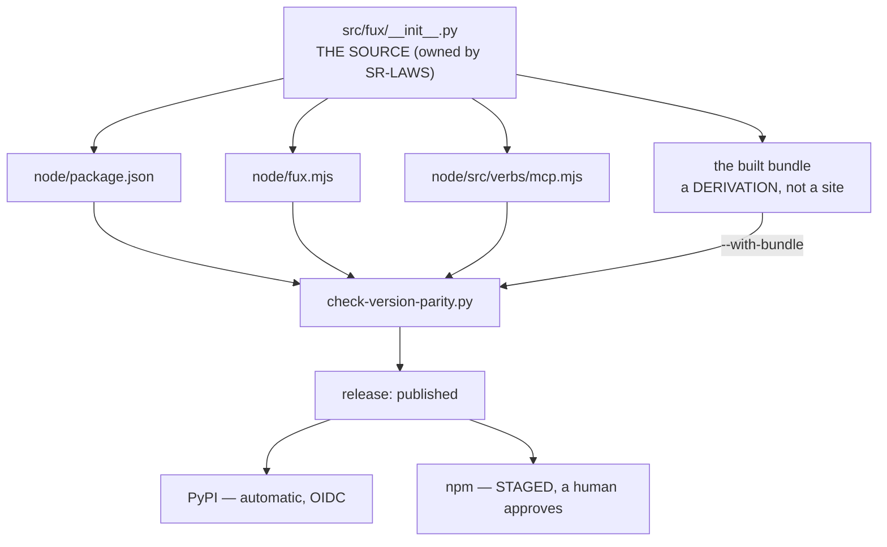

<!-- COMPONENTS-START — GENERATED from records/README.md's OWNERSHIP and DESCRIBES tables by scripts/gen-components.py. Do not edit by hand: change the table, then run `python scripts/gen-components.py --write`. -->

**Owns** — the components this record decides:

- [`scripts/check-version-parity.py`](../scripts/check-version-parity.py) · file
- [`scripts/ci-key.py`](../scripts/ci-key.py) · file
- [`tests/test_ci_key.py`](../tests/test_ci_key.py) · file
- [`tests/test_version_parity.py`](../tests/test_version_parity.py) · file

**Describes** — reaches into, does not own:

- `node/dist/fux.mjs` · owned by [SR-NODE-SEARCH](0153_node-search.md)

<!-- COMPONENTS-END -->

# SR-WORK-RELEASE — one name in two registries, and what actually blocks a merge

## §1 — For humans

> **This record is the HOME of the release contract.** `CLAUDE.md` references it
> and states none of it. The version's *history* is
> [`CHANGELOG.md`](../CHANGELOG.md)'s and is not repeated anywhere.

**One package name, two registries, two different paths.** A GitHub release
publishes to PyPI automatically over OIDC; the npm half **stages** and waits for
a human to approve it on npmjs.com. That asymmetry is npm's own recommendation
and was taken deliberately — both jobs hang off one `release: published` trigger.

**The version number has one source and several copies.** The source is the
Python package's own `__init__`; the Node reader carries three more hand-written
strings, and the published bundle carries a generated one. Nothing checked them
until 2026-09-12, so a bump that missed one would have shipped a wheel and a
tarball naming different releases.

**The merge wall protects history, not quality.** There are no required status
checks on `main`. Admins are included, force-push and deletion are refused, and
that is the whole of it — so **reading CI is the author's job**, not something
the wall guarantees.


```mermaid
flowchart TD
    V["src/fux/__init__.py<br/>THE SOURCE (owned by SR-LAWS)"] --> P1["node/package.json"]
    V --> P2["node/fux.mjs"]
    V --> P3["node/src/verbs/mcp.mjs"]
    V --> D["the built bundle<br/>a DERIVATION, not a site"]
    P1 --> C["check-version-parity.py"]
    P2 --> C
    P3 --> C
    D -->|"--with-bundle"| C
    C --> R["release: published"]
    R --> A["PyPI — automatic, OIDC"]
    R --> B["npm — STAGED, a human approves"]
```

<details>
<summary><b>ASCII twin</b> — the same diagram, for terminals, diffs, and any reader without a Mermaid renderer</summary>

```text
  src/fux/__init__.py  = THE SOURCE (owned by SR-LAWS, not by this record)
      |-- node/package.json          \
      |-- node/fux.mjs                >  four hand-written SITES
      |-- node/src/verbs/mcp.mjs     /
      |-- the built bundle            = a DERIVATION (checked --with-bundle)
                  |
                  v
        scripts/check-version-parity.py
                  |
        one trigger: release: published
                  |-- PyPI : automatic (OIDC)
                  +-- npm  : STAGED, a human approves on npmjs.com
```

</details>

---

## §2 — For agents

### Context

**A false claim stood in `CLAUDE.md` until 2026-09-12:** that the Python
package's `__init__` was the *only* copy of the version. W-107's Node reader had
added three more hand-written strings and nothing compared them.

**The consequence was shippable, not hypothetical.** A bump that missed one site
would publish a PyPI wheel and an npm tarball claiming different releases, and
both registries would accept it.

**The bundle looked like a fifth site and is not one.** It is generated, so what
has to be checked is the *derivation* — the built artefact against the source —
rather than a string somebody might forget to edit.

### Decision

1. **The distribution name is `fux-engine`; the import package is `fux`.** One
   name in both registries.

2. **The version's source is the Python package's own `__init__`**, which
   `pyproject.toml` reads dynamically. **That component belongs to SR-LAWS and is
   not claimed here** — one component, one owner.

3. **It is the SOURCE, not the only copy.** Four hand-written sites exist today:
   the source, `node/package.json`, `node/fux.mjs` and `node/src/verbs/mcp.mjs`.

4. **[`scripts/check-version-parity.py`](../scripts/check-version-parity.py) is
   the enforcement**, run by
   [`tests/test_version_parity.py`](../tests/test_version_parity.py) on every
   push and by the release workflow before a release builds.

5. **Add a site to that script's `SITES` the moment a fifth copy appears.** The
   check is only as complete as its list, and the list is hand-maintained by
   design — a discovered site is a defect to record, not to infer.

6. **The published bundle is a DERIVATION, not a fifth site**, and what is
   checked is the derivation: `--with-bundle <path>` asserts the built bundle's
   generated header and its `VERSION` constant against the source. **The release
   workflow runs it on the very artefact it is about to ship**, and the test
   builds one on every push.

7. **Both registries are reached from one `release: published` trigger** in
   [`publish.yml`](../.github/workflows/publish.yml).

8. **Both registries publish automatically over OIDC, with no human in either
   path** (Arpit, 2026-09-14). One `release: published` trigger, two jobs, two
   live versions.

   ⚠ **This decision said the opposite until 2026-09-14**, and the sentence it
   replaces was *"npm STAGES and waits for a human to approve on npmjs.com —
   npm's own recommendation, taken deliberately. A release is not fully out
   until somebody approves the npm half."* It is reproduced because the reason
   it went is worth more than the rule was.

   🔴 **The gate was never walked through, and nothing said so.** `2.0.0`
   staged on 2026-09-13; `2.0.1` staged on 2026-09-14; **neither was ever
   approved.** npm's `latest` went on pointing at `2.0.0-alpha.7` — published
   2026-09-02 — while PyPI moved twice, so two releases were live on one
   registry and absent from the other for a day and a half. **The release
   workflow was green every time**, because staging IS its success: the
   asymmetry was invisible to every mechanism in this repository, including the
   `IMPLEMENTATION.md` rows that dutifully recorded *"npm: STAGED, waiting on a
   human"* and were read by nobody as *"npm: not released"*.

   ✅ **What the old rule bought was real, and is what it cost that decided
   it.** A human with 2FA between CI and the registry is a genuine guard
   against a compromised workflow publishing in fux's name — npm recommends it
   for that reason. What it bought was never exercised: the approval was not a
   review, it was a chore, and the chore did not get done. **A guard that is
   reliably skipped provides no protection and hides the fact that it is
   providing none.** Provenance is what survives — `--provenance` signs from
   OIDC and is unchanged, so the attestation the staged tarball carried is the
   attestation the published one carries.

   ⚠ **Two preconditions of a release now live outside this repository.** The
   direct publish works only while **`Allow npm publish` is ticked on the
   `fux-engine` trusted publisher at npmjs.com**, and only while that
   publisher's **Environment name reads `npm`** — the same name as
   `publish-npm`'s `environment:` in `publish.yml` (Arpit, 2026-09-29; blank on
   both sides before, so npm releases never appeared under the repository's
   Deployments). The OIDC token carries the job's environment and npm refuses a
   claim it has not saved, so the two names change together or not at all. Untick it and the npm job
   fails with a registry refusal that no diff in this tree explains. It cannot
   be asserted from here, and the only written trace is this paragraph,
   [SR-NODE-SEARCH](0153_node-search.md) decision 14, and the comment beside
   the step.

8a. **Two versions are still staged and this change does not publish them.**
   `2.0.0` and `2.0.1` are in the npmjs.com queue as of 2026-09-14; the switch
   reaches the NEXT release. They are cleared by hand or superseded by a
   version that goes out on the new path — **until one of those happens npm
   serves `2.0.0-alpha.7`**, whatever `CHANGELOG.md` says.

9. **The version's history lives in [`CHANGELOG.md`](../CHANGELOG.md) and
   nowhere else.** A release list in a steering file or a record is a second copy
   that drifts on every bump.

10. **`main` has no required status checks.** What the wall gives is
    `enforce_admins: true`, no force-push and no deletion: **history is
    protected, the quality gate is not.** Source of truth:
    [`.github/branch-protection.json`](../.github/branch-protection.json).

11. **So CI green is yours to check.** Read `gh pr checks <n>` yourself and **do
    not merge on red.** Nothing mechanical will stop you, which is the point of
    stating it.

11a. **A release, unlike a merge, IS gated on CI** (2026-09-23). The publish
    workflow's first step refuses unless [`ci.yml`](../.github/workflows/ci.yml)
    holds a green verdict for the code being released — every stage of it,
    FULL included (`ci.yml` and `node-arm.yml` both, until decision 13 merged
    them on 2026-09-29). ⚠ **Until 2026-09-30 this read *"green on the exact
    commit, as a push to `main`"*; decision 14 keys it by the tree instead**,
    because a FULL cell may now skip on a verdict an earlier commit with the
    same code earned. **So create the GitHub release only after it finishes.** Created earlier,
    the gate fails, and re-running the job once CI is green publishes it. This
    is two strikes made into a gate
    ([SR-WORK-SESSION](0060_WORK-session.md) d13): `3.0.0-alpha.2` and
    `3.0.0-alpha.3` were both published over a red `main`. The second time, the
    red ladder hid a macOS `fux serve` bug and a Windows test bug until the
    next push. ⚠ **The gate is `publish.yml`, and this sentence only names
    it.** Decision 10 is unchanged: merges stay ungated.

12. **A `kind: process` record owns its enforcement**, and this one owns the
    parity script and its test — **neither of which had an owner** until this
    record existed, despite being the only thing standing between a missed bump
    and two registries disagreeing.

13. **CI is one workflow in two stages, and only the whole of it gates a
    release** (Arpit, 2026-09-29: the pipeline took 14–15 minutes and he asked
    for two; work reaches `main` by PR *and* by direct push).
    [`ci.yml`](../.github/workflows/ci.yml):
    - **FAST** runs on **every push, `main` included**, and on fork PRs:
      Linux, Python 3.12, Node 22 — both suites under `pytest -n auto`,
      packaging, the Node units, and the differential arm's repo pass spread
      over ten `--shard` runners. It is the two-minute **signal**, and gates
      nothing.
    - **FULL** runs on push to `main`, nightly and by hand, and **starts only
      when FAST has finished**, whatever FAST concluded: the Python matrix on
      3 OSes (3.12–3.14; Linux 3.12 is FAST's), the arm on 3 OSes × Node 22/24
      with **both** passes in three shards per cell. The ladder manifests
      moved into FAST's `build` job on 2026-09-30 (W-243). **Decision 11a
      waits on the verdict decision 14 saves.**
    - 🔴 **One file, not two, and that is measured, not taste.** As
      `fast.yml` + `main.yml`, a push to `main` started both at once; the full
      lane took the account's runner slots (20 jobs, 5 on macOS) and FAST's
      two-minute verdict took six. `needs:` gives FAST the runners first.
      ⚠ **It stays** (W-243 step 4, 2026-09-30): the run is 38 jobs against
      the plan's cap of 20 and 8 macOS jobs against 5, so the condition for
      dropping it — every job fits under the cap — does not hold.
    - ⚠ **A newer push cancels an older run on the same ref, `main`
      included**, so the old FULL stage never holds the runners the new FAST
      stage needs. The cost: a sha superseded mid-run has no completed run and
      cannot be released — release the newer one.
    - ⚠ **`publish.yml` keeps its file name.** The PyPI and npm trusted
      publishers are bound to it; a rename would fail the next release at the
      registry for a reason no diff shows.
    - ⚠ **What this trades away:** a Windows- or macOS-only break is found
      minutes after it lands, not before. Decision 10 already meant CI blocked
      no merge; the change is how fast the author hears, not what is blocked.

14. **FULL skips a cell whose verdict is already known; FAST never skips**
    (Arpit, 2026-09-30, W-243 step 2: *"Hash one makes sense"*).
    - **The key** is [`scripts/ci-key.py`](../scripts/ci-key.py): a digest of
      every path that can change a FULL verdict, plus — per cell — the OS,
      the runner image (`ImageOS`, `ImageVersion`) and the resolved Python and
      Node versions. A cell that goes green saves its key in the Actions
      cache; a later push with the same key skips that cell's work.
    - 🔴 **An EXCLUDE list, never an include list.** Everything counts as code
      unless the script names it inert, so a new top-level folder is code by
      default: a wrong exclusion costs speed, never correctness. **What is
      inert is decided by the script and nowhere else**; the rule it follows
      is `work/`, `docs/`, `CHANGELOG.md`, and Markdown outside the four code
      roots (`src/`, `node/`, `tests/`, `tests_e2e/`). The committed
      `.fux/index/` is code — it is the arm's own corpus.
    - ⚠ **`records/` is inert, checked rather than assumed.** Two thirds of
      the unit suite reads `records/`, `work/` or `docs/`, so a documentation
      change CAN redden a test. It is inert anyway because FAST runs the whole
      suite on every push, and what the exclusion can delay is only an
      OS-specific break caused by prose — until the nightly run, never past a
      release.
    - 🔴 **Only a push reads a verdict.** The nightly run and a manual dispatch
      run FULL whole — the backstop for what the key cannot see: dependencies
      CI installs unpinned (`pip install -e`, not `uv.lock`) and runner drift.
    - **The store is the Actions cache, not a commit status**, because a
      status is attached to a sha and the question is asked of a key; the
      cache answers *"does this key exist"* in one lookup (`lookup-only`), and
      an entry is written once and never changed.
    - **The release gate (11a) reads one aggregate key**, `ci-key.py
      verdict` — the tree digest alone — which `ci.yml`'s `verdict` job saves
      only when every FAST job and every FULL cell is green, each cell fresh or
      on its own saved key. Still running, red and missing all refuse, with
      the old wording. **A release commit bumps the version in `node/`, so its
      key is always new and its FULL run always fresh.**
    - ⚠ **What this trades away.** Measured over the last 40 commits on
      2026-09-30: **17 would have skipped FULL**, not the 22 estimated when it
      was ruled — five more re-ingest the committed index, which is code by
      the rule above. And an Actions cache entry unused for seven days is
      evicted: a release cut later than that is refused until a dispatched
      run re-earns the key.

### Consequences

- **A version bump is a five-place edit** (four sites plus the changelog), and
  the check is what makes that survivable.
- **A release has a human step by design.** The npm half can sit unapproved, and
  a session that announces "released" before that approval is wrong.
- **Nothing blocks a bad merge.** Decision 11 is a standing obligation, not a
  gate, and it is the most likely rule here to be skipped under time pressure.
- **`scripts/` is now a claimed root in the ownership table**, which it was not
  before this record.

### Alternatives considered

- **One version string, read by the Node reader at runtime.** Rejected in W-107's
  design: the Node plane ships as a bundle with no access to the Python package,
  so the string has to exist on its side.
- **Treat the bundle as a fifth hand-edited site.** Rejected: it is generated, so
  a site entry would be checking a file nobody edits while leaving the generator
  unchecked. Decision 6 checks the derivation instead.
- **Publish npm automatically, like PyPI.** Rejected on npm's own guidance —
  a staged publish is the recommended path for a package with a public install
  base, and the human step is the last chance to catch a bad artefact.
- **Add required status checks to `main`.** Not rejected — **not decided.** It is
  Arpit's call, and this record states the wall as it is rather than the wall
  someone assumed.

### Reference (required)

- [`scripts/check-version-parity.py`](../scripts/check-version-parity.py) — the
  `SITES` list and the `--with-bundle` assertion, which are decisions 3–6 as code.
- [`tests/test_version_parity.py`](../tests/test_version_parity.py) — the gate
  that runs it on every push.
- [`.github/workflows/publish.yml`](../.github/workflows/publish.yml) — one
  trigger, two jobs, and the staged npm approval.
- [`.github/workflows/ci.yml`](../.github/workflows/ci.yml) — the two stages
  of decision 13, and the per-cell and aggregate verdicts of decision 14.
- [`scripts/ci-key.py`](../scripts/ci-key.py) and
  [`tests/test_ci_key.py`](../tests/test_ci_key.py) — decision 14's key, its
  exclude list, and the wiring that makes the gate read what CI saves.
- [`.github/actions/full-verdict/action.yml`](../.github/actions/full-verdict/action.yml)
  — the per-cell lookup, and the rule that only a push reads.
- [`.github/branch-protection.json`](../.github/branch-protection.json) — the
  merge wall, exactly as configured.

### Veto condition

**Reopen this decision if:** a fifth hand-written version site exists that
`SITES` does not name, or `main` gains a required status check — either changes
what this record says is true.

**How to check it:** `grep -rn "2\.0\.0\|__version__" node/package.json node/fux.mjs node/src/verbs/mcp.mjs src/fux/__init__.py`
against the `SITES` list in the script, and
`python -c "import json;print(json.load(open('.github/branch-protection.json')).get('required_status_checks'))"`
— `None` means decision 10 still holds.

---

## References

*Every source this record cites, gathered in one place. §2's **Reference
(required)** names the grounding; this is the complete list. An archived
document is never listed here — the body may name one, but archive is not
evidence.*

**Records** — [SR-LAWS](0001_LAWS.md) · [SR-LAW-10](0012_LAW-10-bundled-output.md) · [SR-NODE-SEARCH](0153_node-search.md) · [SR-WORK-SESSION](0060_WORK-session.md)

**Code**

- [`scripts/check-version-parity.py`](../scripts/check-version-parity.py)
- [`tests/test_version_parity.py`](../tests/test_version_parity.py)
- [`hatch_build.py`](../hatch_build.py)

**Project docs**

- [`.github/workflows/publish.yml`](../.github/workflows/publish.yml)
- [`.github/workflows/ci.yml`](../.github/workflows/ci.yml)
- [`.github/branch-protection.json`](../.github/branch-protection.json)
- [`CHANGELOG.md`](../CHANGELOG.md)
