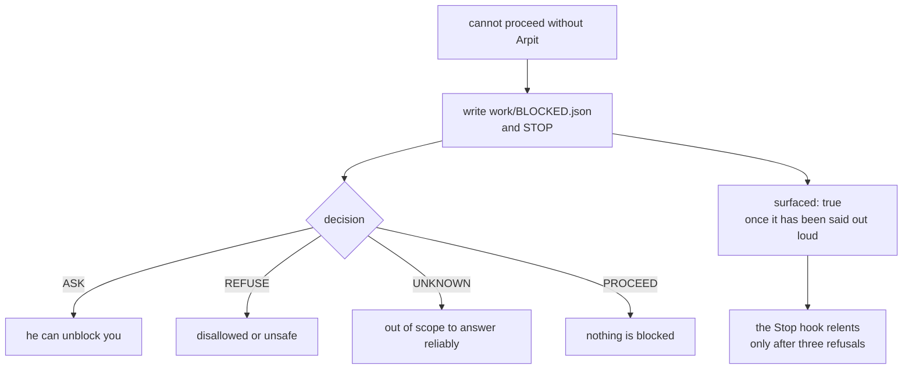

# SR-WORK-BLOCKERS — a blocker is a file, not a remark

## §1 — For humans

> **This record is the HOME of the blocker contract.** `CLAUDE.md` references it
> and states none of it.

**A blocker mentioned in passing is not a blocker.** It is a file:
[`work/BLOCKED.json`](../work/BLOCKED.json), written the moment a session cannot
proceed without Arpit, after which the session **stops**. A sentence buried at the
end of a long session is the failure this exists to prevent.

**The expensive failure is not being blocked — it is routing around it.**
Choosing a plausible default and continuing is how a week of work lands on the
wrong side of a decision nobody made.

**Three hooks enforce this rather than trusting anyone to remember**, and the
third is not about blockers at all: it is a per-asset write lock, so two sessions
editing the same file collide loudly while two sessions editing different files
run in parallel.



<details>
<summary><b>ASCII twin</b> — the same diagram, for terminals, diffs, and any reader without a Mermaid renderer</summary>

```text
  cannot proceed without Arpit
        -> write work/BLOCKED.json  and STOP
              decision: ASK     (he can unblock you)
                        REFUSE  (disallowed or unsafe)
                        UNKNOWN (out of scope to answer reliably)
                        PROCEED (nothing is blocked)
        -> surfaced: true, once it has actually been said out loud
              the Stop hook refuses to end the turn three times, then relents
```

</details>

---

## §2 — For agents

### Context

**Blockers used to be remarks**, and remarks lose. The pattern was consistent
enough to gate: a session hits a question only Arpit can answer, picks the more
likely branch to keep moving, and the branch is found to be wrong after the work
has been built on top of it.

**A file is enforceable and a remark is not.** Once the blocker is a path, a hook
can read it, a prompt can carry it, and a turn can be refused while it is
unsurfaced.

### Decision

1. **A blocker is a file, not a remark.** The moment you cannot proceed without
   Arpit, write [`work/BLOCKED.json`](../work/BLOCKED.json) and stop.

2. **The file's shape:**

   ```json
   {"decision":"ASK","reason":"one line","questions":["the minimum question"],
    "safe_alternative":"what you can do meanwhile, or \"\"","surfaced":false,"filed":"YYYY-MM-DD"}
   ```

3. **`decision` takes exactly four values** — `ASK` (he can unblock you) ·
   `REFUSE` (disallowed or unsafe) · `UNKNOWN` (out of scope to answer reliably) ·
   `PROCEED` (nothing is blocked).

4. **`questions` carries the MINIMUM question.** A blocker that asks four things
   costs four decisions and usually needed one.

5. **`safe_alternative` is what can be done meanwhile**, or the empty string —
   never a guess at what he would have said.

6. **Do not work around a blocker.** Picking a plausible default and continuing
   is the failure this record exists for. **Say it, set `surfaced: true`, stop.**

7. **Three hooks enforce it**, declared in
   [`.claude/settings.json`](../.claude/settings.json):

   | hook | what it does |
   |---|---|
   | `UserPromptSubmit` | prepends [`work/BLOCKED.json`](../work/BLOCKED.json) and the queue's inbox to every prompt, so a pending decision cannot go unmentioned — [`inject-inbox.sh`](../.claude/hooks/inject-inbox.sh) |
   | `Stop` | refuses to end a turn while a blocker is unsurfaced, three times, then relents — [`stop-if-blocked.sh`](../.claude/hooks/stop-if-blocked.sh) |
   | `PreToolUse` | one writer **per asset**: a write locks only the file it targets (`.claude/.locks/<hash>/owner`, TTL 900s), so two sessions editing the queue at once is blocked while two sessions editing different files run in parallel — [`session-lock.sh`](../.claude/hooks/session-lock.sh) |

8. **The `Stop` hook relents after three refusals, deliberately.** A hook that
   can never be escaped becomes a hang, and a hung session cannot even report
   that it is blocked. **Three refusals is a prompt, not a cage** — and a session
   that takes the third exit while still blocked has broken decision 6 rather
   than found a loophole.

9. **The lock is per asset, not per session** — the fix for a wall that used to
   serialise unrelated work. Two sessions are expected here, not tolerated.

10. **A `kind: process` record owns its enforcement**, and this one owns the three
    hook scripts. `guard-golden-answer.sh` and `require-progress.sh` are **not**
    claimed: the first belongs to the sealed benchmark's rule and the second to
    the session contract, and each is owed to whichever record states its subject.

### Consequences

- **Being blocked is now visible from outside the session** — the file is in the
  tree and the next prompt carries it, which is what makes a pending decision
  survive a session ending.
- **Every blocker costs Arpit's attention**, so decision 4's minimum-question
  rule is what keeps the mechanism from becoming a queue of its own.
- **The relent in decision 8 is a deliberate hole.** It is the one place the
  enforcement can be walked past, and it is stated rather than hidden.
- **The lock's TTL is 900 seconds**, so a session that dies holding a lock blocks
  one file for fifteen minutes.

### Alternatives considered

- **Say it in the response and carry on.** This is the prior state, and it is what
  produced work built on unmade decisions.
- **A `Stop` hook that never relents.** Rejected: it converts a blocker into a
  hang, and the session then cannot deliver the one thing it owes — the question.
- **One global write lock per session.** Rejected after it serialised sessions
  working on unrelated files; decision 9's per-asset lock replaced it.
- **A blocker as a queue row instead of a file.** Rejected: the queue is a list
  whose rules are [SR-WORK-OPEN-QUEUE](0051_WORK-open-queue.md)'s, and a row
  cannot be read by a hook before the prompt runs.

### Reference (required)

- [`.claude/settings.json`](../.claude/settings.json) — where the three hooks are
  declared, and the executable form of decision 7.
- [`.claude/hooks/stop-if-blocked.sh`](../.claude/hooks/stop-if-blocked.sh) — the
  three-refusal behaviour decision 8 describes.
- [`.claude/hooks/session-lock.sh`](../.claude/hooks/session-lock.sh) — the
  per-asset lock, its path shape and its TTL.
- [SR-WORK-OPEN-QUEUE](0051_WORK-open-queue.md) — the inbox the first hook
  injects, and the rules governing it.

### Veto condition

**Reopen this decision if:** a session takes the `Stop` hook's third exit while a
blocker is still unsurfaced, or the per-asset lock is observed blocking two
sessions that were editing different files.

**How to check it:** `test -f work/BLOCKED.json && python -c "import json;d=json.load(open('work/BLOCKED.json'));print(d['decision'], d['surfaced'])"`
— a `PROCEED` means nothing is blocked; anything else with `surfaced: false` at
the end of a turn is this veto firing. `ls .claude/.locks/` names every lock held
right now.

---

## References

*Every source this record cites, gathered in one place. §2's **Reference
(required)** names the grounding; this is the complete list. An archived
document is never listed here — the body may name one, but archive is not
evidence.*

**Records** — [SR-WORK-OPEN-QUEUE](0051_WORK-open-queue.md) · [SR-WORK-SESSION](0060_WORK-session.md) · [SR-AGENT-SURFACES](0155_agent-surfaces.md)

**Code**

- [`.claude/settings.json`](../.claude/settings.json)
- [`.claude/hooks/inject-inbox.sh`](../.claude/hooks/inject-inbox.sh)
- [`.claude/hooks/stop-if-blocked.sh`](../.claude/hooks/stop-if-blocked.sh)
- [`.claude/hooks/session-lock.sh`](../.claude/hooks/session-lock.sh)

**Project docs**

- [`work/BLOCKED.json`](../work/BLOCKED.json)
