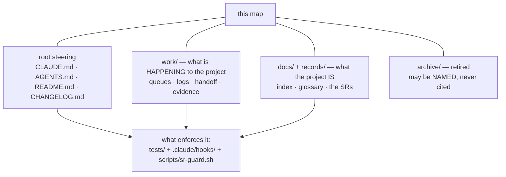

# SR-WORK-GOVERNANCE — the governance map

## §1 — For humans

**This repo governs itself with documents, and until now nothing said which
ones.** Roughly ninety markdown and JSON files decide how work happens here,
spread across the repo root, `work/`, `docs/` and `records/`. This record is the
index none of them is: for each one, what it governs, who reads it, what
mechanically enforces it, and what obliges you to touch it.

**It names homes and states no rule that has one.** The queue's rules are
[SR-WORK-OPEN-QUEUE](0051_WORK-open-queue.md)'s, the doc contract is
[SR-WORK-DOCS](0059_WORK-docs.md)'s, the archive rule is
[SR-WORK-ARCHIVE](0062_WORK-archive.md)'s. A map that restates them becomes a
second, drifting copy of each — which is the failure this record is built to not
repeat.

**It carries no counts, and that is the decision worth reading.** Its
predecessor tracked how many files each directory held. Those numbers were
recounted on 2026-08-25 after drifting, and by 2026-09-14 had drifted again —
`open/` read 5 against 14 on disk, `regression/` 29 against 71, the register 41
against 82. A file whose only job is to be the index cannot be the one that is
stale, so the numbers are gone: the directory is its own count.



<details>
<summary><b>ASCII twin</b> — the same diagram, for terminals, diffs, and any reader without a Mermaid renderer</summary>

```text
                          +----------------+
                          |   this map     |
                          +-------+--------+
        +----------------+--------+--------+-----------------+
        |                |                 |                 |
  root steering       work/            docs/ + records/    archive/
  CLAUDE AGENTS    what is HAPPENING   what the project IS  retired:
  README CHANGELOG  queues, logs,      index, glossary,     NAMED, never
                    handoff, evidence  the SRs              cited
        |                |                 |
        +----------------+--------+--------+
                                  v
            tests/ + .claude/hooks/ + scripts/sr-guard.sh
```

</details>

---

## §2 — For agents

### Context

**The map lived at `work/governance.md` and was the only file in the bundle with
no `type` frontmatter** until the 2026-09-12 OKF pass gave it one. It was
written as a survey, not a record: no frontmatter, no owner, no gate, and a body
mixing the map with a post-mortem of a process-diet round (P7) that had already
been decided.

**Its counts drifted twice, which is the whole argument for this record's
shape.** The file itself carried the warning — *"a file whose whole job is to be
the index cannot be the one that is stale"* — dated the recount, and drifted
again anyway inside three weeks. Prose that must be recounted by hand is not an
index; it is a claim with an expiry nobody is watching.

**Its entries went stale in the other direction too.** By 2026-09-14 the table
still listed `DOGFOOD.md`, which no longer exists, and named neither
`AGENTS.md`, `work/BACKLOG.md` nor `work/LESSONS.md`, which do.

### Decision

1. **This record is the HOME of the governance map.** `work/governance.md` is
   archived; nothing else holds a map of what governs what.

2. **The map has four layers**, and every governing file sits in exactly one:
   **root steering** (what an agent reads first), **`work/`** (what is
   *happening* to the project), **`docs/` + `records/`** (what the project
   *is*), and **`archive/`** (retired — may be named, never cited).

3. **Root steering.**

   | file | governs | audience | enforced by | update trigger |
   |---|---|---|---|---|
   | [`CLAUDE.md`](../CLAUDE.md) | the agent contract — triage, scope, lifecycle, layout, the generated law block | **agent** (read first, every session) | [`tests/test_claude_md_laws.py`](../tests/test_claude_md_laws.py) holds the generated block byte-equal to [SR-LAWS](0001_LAWS.md); the rest is convention | any rule changes |
   | [`AGENTS.md`](../AGENTS.md) | how any agent runs fux here — the rung list, the vocabulary-gap rule, search before grep | **agent**, every vendor surface | the agent-surface set under [SR-AGENT-SURFACES](0155_agent-surfaces.md) | the surfaces or the run instructions change |
   | [`README.md`](../README.md) | what fux is, for a reader outside the process | **human** | none | status, guarantees or architecture change |
   | [`CHANGELOG.md`](../CHANGELOG.md) | release history | **human** | convention; link-exempt by [SR-WORK-DOCS](0059_WORK-docs.md) decision 12 | every released change |

4. **`work/` — the live session-memory layer.**

   | file/dir | governs | audience | enforced by | update trigger |
   |---|---|---|---|---|
   | [`OPEN-WORK.md`](../work/OPEN-WORK.md) | the single live queue — the list only | both | [`test_open_work_rows_are_short.py`](../tests/test_open_work_rows_are_short.py) · [`test_open_work_is_not_stale.py`](../tests/test_open_work_is_not_stale.py) · [`test_no_work_item_is_lost.py`](../tests/test_no_work_item_is_lost.py) · [`test_work_queue_rules_have_one_home.py`](../tests/test_work_queue_rules_have_one_home.py) | the same change as the work it tracks |
   | [`BACKLOG.md`](../work/BACKLOG.md) | the named-but-unclaimed, in five classes — the list only | both | [`test_backlog_rows_are_short.py`](../tests/test_backlog_rows_are_short.py) | a record names something nobody is doing |
   | `open/W-nn-*.md` | one detail spec per open item, and its handoff | agent (executor) | [`test_handoff_names_its_model.py`](../tests/test_handoff_names_its_model.py) · [`test_no_work_item_is_lost.py`](../tests/test_no_work_item_is_lost.py) | opened with the item, archived with it |
   | [`BLOCKED.json`](../work/BLOCKED.json) | the machine-readable gate state | agent | [`.claude/hooks/stop-if-blocked.sh`](../.claude/hooks/stop-if-blocked.sh) · [`inject-inbox.sh`](../.claude/hooks/inject-inbox.sh) | a session blocks or unblocks |
   | [`INTERVIEW.md`](../work/INTERVIEW.md) | cold-start state of play for the next session | agent | none | **during** the session, not at the end |
   | [`IMPLEMENTATION.md`](../work/IMPLEMENTATION.md) | the milestone log — what shipped, when | both | none | a milestone lands |
   | [`WORKLOG.md`](../work/WORKLOG.md) | the per-session trail, append-only | both (audit) | none; link-exempt because repairing its links would make it false | every session |
   | [`LESSONS.md`](../work/LESSONS.md) | dated build lessons — a log, because the date is the lesson | both | none | a failure teaches something durable |
   | [`NOW.md`](../work/NOW.md) | the one-line current-state pointer | both | read by a hook on every prompt | every session transition |
   | [`MACHINE.md`](../work/MACHINE.md) | environment and surface quirks | agent | none | a surface breaks in a new way |
   | [`DOC-REGISTRY.md`](../work/DOC-REGISTRY.md) | per-doc freshness for **live** docs, one row each | both | [`test_doc_registry.py`](../tests/test_doc_registry.py) | any registered doc is touched |
   | [`compare/`](../work/compare/README.md) | live forks — verdict and reopen-trigger | both | none | a fork opens, closes, or its trigger fires |
   | [`proposals/`](../work/proposals/README.md) | parked, undecided ideas | both | none | filed, graduates, or rejected |
   | [`regression/`](../work/regression/README.md) | measured evidence other docs cite | both | [`test_regression_runs.py`](../tests/test_regression_runs.py) | every measurement run |
   | [`setup/`](../work/setup/README.md) | how the three siblings are stood up; their jobs are [SR-WORK-ENVIRONMENTS](0052_WORK-environments.md)'s | human | [`test_setup_docs.py`](../tests/test_setup_docs.py) · [`test_work_environments.py`](../tests/test_work_environments.py) | any sibling changes |
   | [`golden/`](../work/golden/README.md) | the sealed benchmark's test data | agent | [`.claude/hooks/guard-golden-answer.sh`](../.claude/hooks/guard-golden-answer.sh) · [`test_golden_schema.py`](../tests/test_golden_schema.py) | the key's authors change it, never a session |
   | [`docs/paper/`](../docs/paper/the-fux-index-paper.md) | architecture of record and its falsifiable predictions | both | [`test_prediction_register.py`](../tests/test_prediction_register.py) | architecture changes, or a prediction is measured |
   | `architecture-*.svg` | visual architecture; `docs/architecture-*.png` are rendered from them | human | none | the plane, verb, reader or record shape one draws changes |

5. **`docs/` + `records/` — what the project is.**

   | file/dir | governs | audience | enforced by | update trigger |
   |---|---|---|---|---|
   | [`docs/index.md`](../docs/index.md) | the OKF bundle root and reading order across `docs/` + `work/` + `records/` | both | [`test_okf_bundle.py`](../tests/test_okf_bundle.py) | either tree's structure changes |
   | [`docs/GLOSSARY.md`](../docs/GLOSSARY.md) | recurring terms, defined once | human | none | a term is coined or redefined |
   | [`records/README.md`](README.md) | the register — convention, the three kinds, the number ranges, ownership and `describes` | both | [`test_sr_ownership.py`](../tests/test_sr_ownership.py) · [`test_sr_owns_consistency.py`](../tests/test_sr_owns_consistency.py) · [`test_sr_register_status.py`](../tests/test_sr_register_status.py) | a record's state, ownership or number changes |
   | `records/NNNN_*.md` | one decision per completed feature or ruled measurement | both (§1 human, §2 agent) | [`test_sr_frontmatter.py`](../tests/test_sr_frontmatter.py) · [`test_sr_freshness.py`](../tests/test_sr_freshness.py) · [`test_sr_content_hash.py`](../tests/test_sr_content_hash.py) · [`test_sr_owns_hash.py`](../tests/test_sr_owns_hash.py) · [`test_record_paths_resolve.py`](../tests/test_record_paths_resolve.py) | the owning code, or the decision, changes |
   | [`records/TEMPLATE.md`](TEMPLATE.md) | the shape a new record must follow | agent (author) | none | the convention changes |
   | [`records/RULE-SINCE`](RULE-SINCE) | the freshness gate's audit baseline | agent (tooling) | read by [`test_sr_freshness.py`](../tests/test_sr_freshness.py) | the gate's rule tightens — and see [SR-WORK-OWNERSHIP](0054_WORK-ownership.md) veto 6 first |

6. **`archive/` — one archive, at the repo root, mirroring the live tree.** An
   archived document may be **named**; it may never ground a live claim, and no
   live row may point into it. The rule is
   [SR-WORK-ARCHIVE](0062_WORK-archive.md)'s and is not restated here;
   [`tests/test_archive_law.py`](../tests/test_archive_law.py) fails when a
   second `archive/` appears anywhere else.

7. **No counts.** This map states no number of files, rows, runs or records.
   A count in prose is a fact with an expiry date and no gate, and this map's
   counts expired twice. Where a number matters, the directory listing is the
   number.

8. **A governing file gets its row here in the change that adds it, and loses
   it in the change that retires it** — the same discipline
   [SR-WORK-DOCS](0059_WORK-docs.md) decision 11 puts on the registry. A row for
   a file that no longer exists is the defect this record's predecessor shipped.

9. **Audience is a skew, not a partition.** `CLAUDE.md`, `AGENTS.md`,
   `OPEN-WORK.md`, `BLOCKED.json` and the `open/W-nn` specs skew agent;
   `README.md`, `GLOSSARY.md` and the architecture SVGs skew human. Everything
   else is written for both by design — the §1/§2 split inside each record is
   the same idea applied per-file.

10. **SR maintenance is remitted to the hooks, not to prose.** Law zero — the
    records are always up to date — is enforced by
    [`scripts/sr-guard.sh`](../scripts/sr-guard.sh) as a **`commit-msg`** hook
    (`ln -sf ../../scripts/sr-guard.sh .git/hooks/commit-msg`), **not**
    `pre-commit`: the `no SR affected` escape hatch needs the commit message,
    which does not exist yet at `pre-commit` time. `test_sr_freshness.py` runs
    the identical check in CI. Nobody reconciles a record by discipline.

### Consequences

- **The map is now gated as a record** — frontmatter checked, links checked,
  path references checked — where before it was the only governance document
  with no owner and no gate at all.

- **Nothing mechanically proves the map is complete.** A new steering file that
  nobody adds a row for is invisible to every test in this repo; decision 8 is
  an obligation, and the veto condition below is how it gets caught. This is the
  known hole and it is stated rather than papered over.

- **Three dated observations died with the old file**, deliberately: the P7
  process-diet post-mortem, the settled-against items in it, and the
  *"8 of ~18 test files guard prose"* figure that its own audit had already
  disproved (35 of 836 tests, ≈4%). A record carries no history; git has it.

- **Two ideas that were still parked kept a home** — filed as `B-246`
  (`WORKLOG.md` archive-and-truncate) and `B-247` (`DOC-REGISTRY.md` scoped to
  untested prose) in [`work/BACKLOG.md`](../work/BACKLOG.md), under `unruled`,
  because both need a ruling and neither has one.

### Alternatives considered

- **Keep the counts, with a recount date.** This is exactly what the old file
  did, and it is what failed — twice, the second time inside three weeks of the
  first recount. Rejected on its own record.

- **Keep the counts and own a test that recomputes them.** Real, and rejected as
  disproportionate: it buys a number nobody acts on, at the price of a test that
  fails on every ordinary `ls`-changing commit. The directory is already the
  count.

- **Leave `work/governance.md` live as a thin pointer to this record.** Rejected
  (Arpit, 2026-09-14): two files on one subject is how the counts drifted in the
  first place, and a pointer file still needs a registry row, a `type`, and a
  reader's attention.

- **Fold the map into [SR-WORK-DOCS](0059_WORK-docs.md).** Rejected: that record
  is the documentation *contract* — how a doc is written and what a task owes.
  The map is an inventory, it changes on a different trigger, and merging the
  two makes each harder to keep true.

### Reference (required)

- [`records/README.md`](README.md) — the register the map's `records/` row
  points at, and the home of the kinds, ranges and ownership model.
- [SR-WORK-DOCS](0059_WORK-docs.md) — the documentation contract; decisions 9
  and 11 are what decisions 2 and 8 above apply to a map.
- [SR-WORK-ARCHIVE](0062_WORK-archive.md) — the one-archive rule decision 6
  names and does not restate.
- [SR-LAW-0](0002_LAW-0-authority.md) — why a governing file links and never
  restates, which is the constraint this map is written under.

### Veto condition

**Reopen this decision if:** a file that governs how work happens here exists,
is live, and has no row in decisions 3–5 — the map is incomplete, which is the
one failure mode a map cannot survive.

**How to check it:** compare the map's rows against the tree's governing files —

```console
$ ls *.md work/*.md work/*/README.md docs/*.md records/README.md records/TEMPLATE.md
```

every entry is either in a row above, evidence (`work/regression/`,
`work/golden/`), or a record — and if it is none of those three, this veto has
fired.

---

## References

*Every source this record cites, gathered in one place. §2's **Reference
(required)** names the grounding; this is the complete list. An archived
document is never listed here — the body may name one, but archive is not
evidence.*

**Records** — [SR-LAWS](0001_LAWS.md) · [SR-LAW-0](0002_LAW-0-authority.md) · [SR-WORK-OPEN-QUEUE](0051_WORK-open-queue.md) · [SR-WORK-ENVIRONMENTS](0052_WORK-environments.md) · [SR-WORK-OWNERSHIP](0054_WORK-ownership.md) · [SR-WORK-DOCS](0059_WORK-docs.md) · [SR-WORK-ARCHIVE](0062_WORK-archive.md) · [SR-AGENT-SURFACES](0155_agent-surfaces.md)

**Code**

- [`scripts/sr-guard.sh`](../scripts/sr-guard.sh)
- [`tests/test_claude_md_laws.py`](../tests/test_claude_md_laws.py) · [`tests/test_sr_freshness.py`](../tests/test_sr_freshness.py) · [`tests/test_sr_frontmatter.py`](../tests/test_sr_frontmatter.py) · [`tests/test_sr_ownership.py`](../tests/test_sr_ownership.py) · [`tests/test_sr_owns_consistency.py`](../tests/test_sr_owns_consistency.py) · [`tests/test_sr_owns_hash.py`](../tests/test_sr_owns_hash.py) · [`tests/test_sr_content_hash.py`](../tests/test_sr_content_hash.py) · [`tests/test_sr_register_status.py`](../tests/test_sr_register_status.py)
- [`tests/test_archive_law.py`](../tests/test_archive_law.py) · [`tests/test_doc_registry.py`](../tests/test_doc_registry.py) · [`tests/test_okf_bundle.py`](../tests/test_okf_bundle.py) · [`tests/test_record_paths_resolve.py`](../tests/test_record_paths_resolve.py)
- [`tests/test_open_work_rows_are_short.py`](../tests/test_open_work_rows_are_short.py) · [`tests/test_open_work_is_not_stale.py`](../tests/test_open_work_is_not_stale.py) · [`tests/test_no_work_item_is_lost.py`](../tests/test_no_work_item_is_lost.py) · [`tests/test_work_queue_rules_have_one_home.py`](../tests/test_work_queue_rules_have_one_home.py) · [`tests/test_backlog_rows_are_short.py`](../tests/test_backlog_rows_are_short.py) · [`tests/test_handoff_names_its_model.py`](../tests/test_handoff_names_its_model.py)
- [`tests/test_regression_runs.py`](../tests/test_regression_runs.py) · [`tests/test_setup_docs.py`](../tests/test_setup_docs.py) · [`tests/test_work_environments.py`](../tests/test_work_environments.py) · [`tests/test_golden_schema.py`](../tests/test_golden_schema.py) · [`tests/test_prediction_register.py`](../tests/test_prediction_register.py)
- [`.claude/hooks/stop-if-blocked.sh`](../.claude/hooks/stop-if-blocked.sh) · [`.claude/hooks/inject-inbox.sh`](../.claude/hooks/inject-inbox.sh) · [`.claude/hooks/guard-golden-answer.sh`](../.claude/hooks/guard-golden-answer.sh)

**Project docs**

- [`CLAUDE.md`](../CLAUDE.md) · [`AGENTS.md`](../AGENTS.md) · [`README.md`](../README.md) · [`CHANGELOG.md`](../CHANGELOG.md)
- [`work/OPEN-WORK.md`](../work/OPEN-WORK.md) · [`work/BACKLOG.md`](../work/BACKLOG.md) · [`work/BLOCKED.json`](../work/BLOCKED.json) · [`work/INTERVIEW.md`](../work/INTERVIEW.md) · [`work/IMPLEMENTATION.md`](../work/IMPLEMENTATION.md) · [`work/WORKLOG.md`](../work/WORKLOG.md) · [`work/LESSONS.md`](../work/LESSONS.md) · [`work/NOW.md`](../work/NOW.md) · [`work/MACHINE.md`](../work/MACHINE.md) · [`work/DOC-REGISTRY.md`](../work/DOC-REGISTRY.md)
- [`work/compare/README.md`](../work/compare/README.md) · [`work/proposals/README.md`](../work/proposals/README.md) · [`work/regression/README.md`](../work/regression/README.md) · [`work/setup/README.md`](../work/setup/README.md) · [`work/golden/README.md`](../work/golden/README.md) · [`docs/paper/the-fux-index-paper.md`](../docs/paper/the-fux-index-paper.md)
- [`docs/index.md`](../docs/index.md) · [`docs/GLOSSARY.md`](../docs/GLOSSARY.md)
