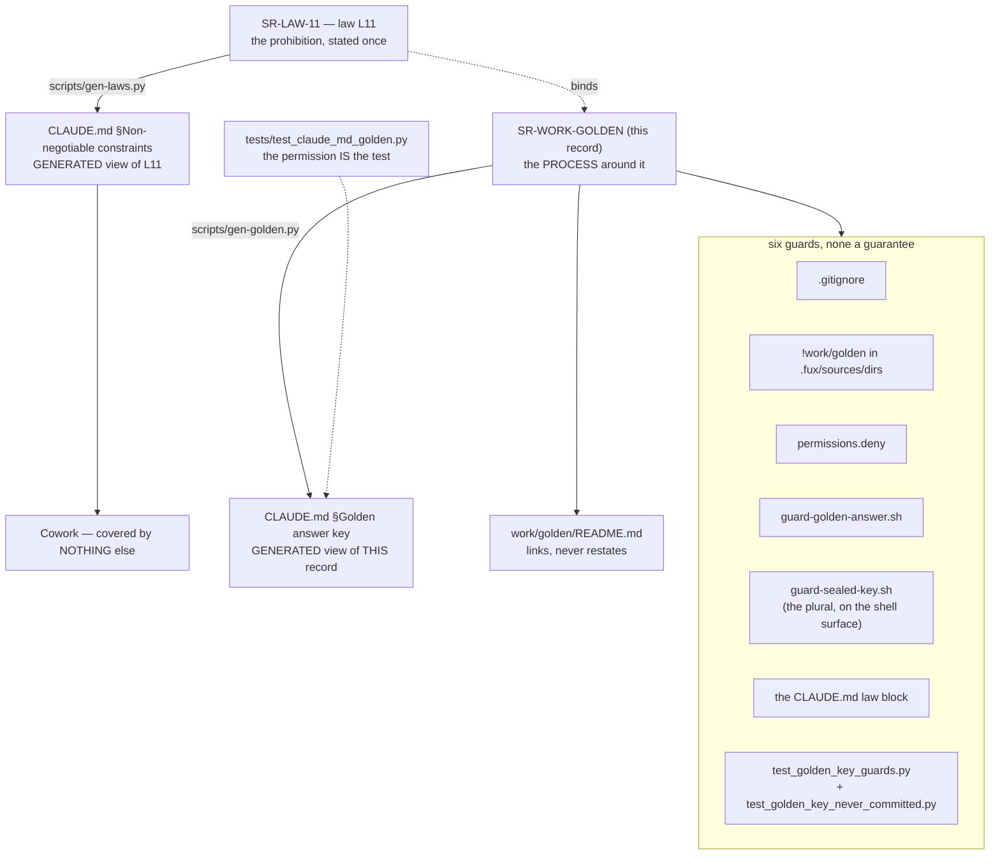

<!-- COMPONENTS-START — GENERATED from records/README.md's OWNERSHIP and DESCRIBES tables by scripts/gen-components.py. Do not edit by hand: change the table, then run `python scripts/gen-components.py --write`. -->

**Owns** — the components this record decides:

- [`.claude/hooks/guard-golden-answer.sh`](../.claude/hooks/guard-golden-answer.sh) · file
- [`.claude/hooks/guard-sealed-key.sh`](../.claude/hooks/guard-sealed-key.sh) · file
- [`scripts/gen-golden.py`](../scripts/gen-golden.py) · file
- [`tests/test_claude_md_golden.py`](../tests/test_claude_md_golden.py) · file
- [`tests/test_golden_hook_prose.py`](../tests/test_golden_hook_prose.py) · file
- [`tests/test_golden_key_guards.py`](../tests/test_golden_key_guards.py) · file
- [`tests/test_settings_never_committed_unlocked.py`](../tests/test_settings_never_committed_unlocked.py) · file
- [`tools/golden-difficulty/`](../tools/golden-difficulty) · dir

<!-- COMPONENTS-END -->

# SR-WORK-GOLDEN — the sealed answer key

## §1 — For humans

> ⚠ **The prohibition is [L11](0012_LAW-11-sealed-answer-key.md), and this record
> states none of it.** Read the law before doing anything near `work/golden/`.
> **This record is the HOME of the process around it** — the guards, what Claude
> may read, and the generated view in `CLAUDE.md`. How the benchmark is *run* is
> [`work/golden/README.md`](../work/golden/README.md)'s, and which environment may
> run it is [SR-WORK-ENVIRONMENTS](0052_WORK-environments.md)'s.

**Why the split.** The rule — *no agent reaches an answer, and no Claude session
holds one by any route* — is absolute, so it belongs in the one class of record
that cannot be traded away by an ordinary decision. It became **law L11** on
2026-09-15. Everything around it is process, and process is what changes: the
guard list has grown twice, the questions moved from one set to two the same day,
and what Claude may read moves when a set is released.

**Two sets, one custody (Arpit, 2026-09-15).** **Set 1** is authored by Codex;
**set 2** is authored by Claude, over the same Codex-written seed documents.
Their *questions* are two instruments and this record keeps them apart. Their
*answers* are one thing and they are Arpit's: since 2026-09-18 a key **may** sit
on his machine at one address.

⚠ **This paragraph used to end *"and the one route an answer travels is a paste
into a chat, which is Codex's route"*. That route was RETIRED on 2026-09-21.**
Two things killed it: it made every scoring turn wait on Arpit's availability,
and on that same day he pasted a key into a *Claude* session to get a score — the
law called it a leak and he called it *"on me"*. A route whose safe use depends
on remembering which chat window you are in is not a route. What replaced it is a
**locked state with a named switch**, `just golden-unlock`, in his hand alone.
That is [L11](0012_LAW-11-sealed-answer-key.md) decision 14 and is not restated
here; the **mechanics** are decision 15 below.

🔴 **Six guards stand behind the law and none of them is a guarantee.** Claude
Code and Codex run as the same Mac user, so no file permission can tell them
apart, and the hooks and the deny rules only bind the surface that honours them.
**Cowork honours none of them** — it reads `CLAUDE.md`, and that is the entire
reason the law is reproduced there rather than merely linked. ⚠ **The guard list
became load-bearing again on 2026-09-18**, when L11 decision 3 permitted a key on
disk; between 2026-09-15 and that date these six defended an empty room.



<details>
<summary><b>ASCII twin</b> — the same diagram, for terminals, diffs, and any reader without a Mermaid renderer</summary>

```text
  SR-LAW-11 — law L11: the prohibition, stated once
        |
        |-- scripts/gen-laws.py --> CLAUDE.md  Non-negotiable constraints
        |                                 |
        |                                 +--> Cowork: covered by NOTHING else
        |
        +-- binds --> SR-WORK-GOLDEN (this record) — the PROCESS
                            |
                            |-- scripts/gen-golden.py --> CLAUDE.md  Golden answer key
                            |          ^
                            |   tests/test_claude_md_golden.py holds the two byte-equal
                            |   (the permission IS the test — SR-LAW-0 decision 5)
                            |
                            |-- work/golden/README.md — links, never restates
                            |
                            +-- six guards, none a guarantee:
                                  .gitignore
                                  !work/golden in .fux/sources/dirs
                                  permissions.deny in .claude/settings.json
                                  .claude/hooks/guard-golden-answer.sh
                                  .claude/hooks/guard-sealed-key.sh
                                  the CLAUDE.md law block itself
                                  (+ test_golden_key_guards.py, which fails
                                   when any of them stops covering a spelling)
```

</details>

---

## §2 — For agents

### Context

**The rule was ruled on 2026-09-11 and had no record until 2026-09-15.** It lived
in two places — `CLAUDE.md` §Golden answer key and
[`work/golden/README.md`](../work/golden/README.md) §The one rule — and in
neither of them as a statement anything owned. Under
[SR-LAW-0](0002_LAW-0-authority.md) decision 1 that is a restatement by its own
test: *could these two disagree while both still look correct?* They could, and
one of them is the only thing standing between a chat agent and a contaminated
benchmark.

**W-146 row 17 named the gap on 2026-09-12 and then deliberately did not close
it.** The obvious move — delete the `CLAUDE.md` paragraph, link to a record —
**would have removed Cowork's only cover**, because Cowork reads `CLAUDE.md` and
does not read `records/`. So the row sat in the Blocked-on-Arpit inbox rather
than being resolved by an agent's own reading of a law.

**Arpit ruled it on 2026-09-15: write the record, and keep the paragraph as a
generated view** — and then, the same day, ruled the prohibition itself into a
**law**, on the ground that a rule with no exceptions must not sit in a record
an ordinary decision can supersede. What is left here is everything that is not
the rule.

### Decision

1. **This record states none of the prohibition.** It is
   [L11](0012_LAW-11-sealed-answer-key.md), stated once there and carried into
   `CLAUDE.md` §Non-negotiable constraints by
   [`scripts/gen-laws.py`](../scripts/gen-laws.py). **A second statement of it
   here would be the restatement [SR-LAW-0](0002_LAW-0-authority.md) decision 1
   forbids**, and this record's own history is why: the rule spent four days in
   two hand-maintained copies.

2. **What this record carries instead is the process, and `CLAUDE.md` gets a
   generated view of it.**

<!-- GOLDEN-TEXT:BEGIN -->
🔴 **Golden answers are closed to every agent by law
[L11](0012_LAW-11-sealed-answer-key.md)** — §Non-negotiable constraints above.
Read it before anything near `work/golden/`. **This block states none of it.** It
is the surrounding process:

- **There are three question sets.** **Set 1** — questions and answers authored
  by **Codex** (Arpit, 2026-09-15). **Set 2** — authored by **Claude** from
  `work/golden/seed/` only (same ruling). **Set 3** — authored by **Claude**
  (Arpit, 2026-09-20), carrying the failing-shape identifiers and the
  link-bearing documents that three measurements were blocked on. Two authors
  make question-authorship bias visible instead of invisible; the sets are scored
  and reported separately, and **every number on an agent-authored set — set 2
  and set 3 — is `informed` permanently**, because its author and its runner are
  the same model family.
- 🔴 **An agent-authored set is created whenever a measurement would otherwise
  wait on Codex** (Arpit, 2026-09-20: *"no feature waits on Codex"*). The cost is
  that the set is `informed` for ever and can never be the clean arm; the thing
  it buys is that a measurement blocked on another party's availability becomes a
  measurement that can be run. **Set 1 stays the only externally-authored set**,
  and a claim that needs a set Claude did not write still needs set 1.
- **Arpit holds both answer halves, and since 2026-09-18 a key may sit on his
  machine at one address.** That address is **`work/golden/golden-answers/`** —
  gitignored, never committed, **closed to every agent on both spellings** while
  the tree is LOCKED. He deleted the old singular directory on 2026-09-15 and
  ruled the plural one permitted three days later, on W-197; **the deletion is
  not erased by the permission**, it is why there is now exactly one name.
  ⚠ **No Claude session creates, empties or removes either directory** — each is
  a tool call that reaches into it.
- 🔴 **LOCKED is a STATE now, and the way out is one switch in Arpit's hand**
  (L11 decision 14, 2026-09-21). `just golden-unlock` takes down the deny rules
  and the two hook registrations; a session may then read the key **for scoring
  and review and nothing else**; `just golden-retire <set>` moves that set's
  questions *and* answers into `work/golden/retired/`, where they become
  ordinary reusable test data that **never carries a golden claim again**; `just
  golden-lock` puts every guard back byte-identically and the next generation is
  authored sealed as `set-<gen>-<x|u>`. 🔴 **No agent runs any of those three, or
  touches the file that holds the state** — that is the same breach as opening
  the key. A session that needs the key says it is blocked and stops.
  ⚠ **The paste route is RETIRED**, and **every golden number is `informed`
  permanently from the first unlock** — a measurement the builder's model family
  could not have seen no longer exists in this project, and locking again does
  not bring it back. ⚠ **Never committed is the one clause no state relaxes.**
- 🔴 **A switch operation gets its OWN work item — but ONLY when an open item
  actually waits on it** (Arpit, 2026-09-22, amended the same day). When one
  does, `golden-unlock`, `golden-lock` or `golden-retire <set>` gets its own
  🔴 inbox row that **names the verb and says Arpit types it**, and **the lock
  item is filed together with its unlock item**, never afterwards. **When
  nothing waits, there is no item** — a row that sends him to open the tree for
  no reason is worse than no row. ⚠ **Scoring alone never needs an unlock:**
  `tools/golden-score/score.py` started from his own shell reads the key in the
  LOCKED state, because L11's scoring carve-out attaches to his hand.
- **What Claude MAY read:** `work/golden/seed/`, the READMEs and the prompts, and
  a released `questions/set-N.jsonl` (ids and text only). **The six prompts**,
  the ladder, the rungs and what a result may claim are in
  [`work/golden/README.md`](../work/golden/README.md).
- 🔴 **The guards are the defence again, because there is something on disk.**
  `.gitignore`; `!work/golden` in `.fux/sources/dirs`; `permissions.deny` in
  `.claude/settings.json`; `.claude/hooks/guard-golden-answer.sh`, which matches
  what a tool call *targets* and fails closed; the generated law block itself;
  and two tests — `test_golden_key_guards.py`, which fails if a guard stops
  covering **either spelling**, and `test_golden_key_never_committed.py`, which
  answers from `git ls-files` and opens nothing. ⚠ **Between 2026-09-15 and
  2026-09-18 this bullet said the guards were a backstop around an empty room.
  The room is not empty.**
- **The three routes no guard sees.** A recursive `grep`, `rg`, `find` or `ls`
  over `work/` that never names the folder — L11 makes excluding `work/golden/`
  part of the rule. **A paste**: an answer put into a Claude session's context by
  any hand is a leak to declare, never a permission that arrived by another door.
  And **a Cowork session's mount**, which reaches the directory with a plain
  shell call that no deny rule and no hook sees — **accepted, not closed.**
- **The 2026-09-15 reset, and what has been written since.** Arpit deleted the
  provisional Claude-authored key and the 124 released questions; the seed corpus
  and the ladder survived. **Every id from the old set (`g001…`) is orphaned and
  never reused**, so a filed number from it may not be compared with anything
  scored on set 1, set 2 or set 3. ⚠ **Between 2026-09-15 and 2026-09-21 this
  bullet said both sets were unwritten. They were written on 2026-09-16** —
  `set-1.jsonl` (125) and `set-2.jsonl` (124), commit `742e1aa9` — **and
  `set-3.jsonl` (125) on 2026-09-21.** The questions are on disk; **the answers
  are Arpit's and are not**, which is the half this record is actually about, and
  a bullet that said *neither exists* let a reader take the wrong half of that
  sentence for the current state for five days.
<!-- GOLDEN-TEXT:END -->

3. **The generator and its bind.**
   [`scripts/gen-golden.py`](../scripts/gen-golden.py) renders decision 2's block
   between `CLAUDE.md`'s `<!-- GOLDEN:BEGIN … -->` / `<!-- GOLDEN:END -->`
   markers, rewriting link targets from record-relative to repo-root-relative and
   doing nothing else;
   [`tests/test_claude_md_golden.py`](../tests/test_claude_md_golden.py) holds the
   two byte-equal. ⚠ **Delete that test and the `CLAUDE.md` block becomes an
   illegal restatement** — [SR-LAW-0](0002_LAW-0-authority.md) decision 5 permits
   the view for exactly as long as the bind exists.

4. **The `CLAUDE.md` view is not decoration, and it is not for Claude Code.**
   Claude Code is already restrained by `permissions.deny` and by the hook.
   **Both views exist for Cowork and for a recursive `grep` that never names the
   folder** — the two paths every other guard misses. A change that removes them
   removes the only cover those two have, whatever else it puts in their place.

5. **`work/golden/README.md` links to the law and states none of the rule.** It
   is the home of the *process of running the benchmark* — the five phases, who
   writes what, the ladder, the rungs, what a result may claim. It may not carry
   a second statement of who may read the key.

6. **This record owns the hook, the generator and the bind.**
   `.claude/hooks/guard-golden-answer.sh` was left unowned on purpose by
   [SR-WORK-BLOCKERS](0064_WORK-blockers.md) decision 10 — *"it belongs to the
   sealed benchmark's rule"* — and this is the record of that rule's enforcement.
   `scripts/gen-golden.py` and `tests/test_claude_md_golden.py` come with
   decision 3. A `kind: process` record owns its enforcement, and these three are
   it.

7. **What the hooks can and cannot see, stated rather than assumed — and the one
   convention that follows from it.** A hook checks what a tool call **targets**
   — `file_path`, `notebook_path`, `path`, `glob`, a `Glob` pattern — and,
   separately, the **whole text of a `Bash` command**. It fails closed on input
   it cannot parse. **A recursive grep over `work/` that never names the folder
   is not caught**; that residual hole is decision 4's reason for existing, not a
   defect to fix in the hook.

   ⚠ **The `Bash` branch does not tell prose from access, and it never will.** A
   shell command is matched on its text, so a heredoc, an `echo`, a `python -c`
   or a commit message that merely *writes a sentence* naming a key path is
   **refused** — while the same sentence through the **Write/Edit** tool passes,
   because those calls are checked by `file_path` alone. ⚠ **An earlier form of
   this decision said "writing prose about the rule is not blocked" without that
   split, and it was wrong about the half a session actually meets**: the class
   was recorded four times before anyone ruled on it, the fourth in
   [the 2026-09-21 ladder rebuild](../work/regression/2026-09-21-ladder-set-3-rebuild/ANALYSIS.md)
   §6.

   🔴 **Ruled 2026-09-21 (Arpit, W-209): the hooks are neither narrowed nor
   widened, and the convention is** — *prose that must spell a key path is
   written with the Write/Edit tool, never through a shell command.* Teaching a
   guard to recognise prose means teaching it to judge a shell command's
   intent, which is the one judgement the guard design refuses to make; the cost
   of the convention is one tool choice, and the cost of the alternative is a
   guard that can be talked past. Narrowing the hook to path-shaped tokens, and a
   docs lint forbidding the spelling, were both offered the same day and
   **declined**.

   **The gate is [`tests/test_golden_hook_prose.py`](../tests/test_golden_hook_prose.py)**
   (two strikes → a gate, [SR-WORK-SESSION](0060_WORK-session.md) decision 13),
   which pins all three behaviours against the **locked** state: a shell command
   spelling a key path is denied even when it only writes prose; the same prose
   in a Write/Edit `content` field is allowed; a call that *targets* either
   spelling is denied. It opens nothing, and it asserts the **committed** guard
   bytes — the state a guard is in unless a human has deliberately taken it out.

8. **Three question sets, and they are separate instruments** (Arpit,
   2026-09-15 for the first two; 2026-09-20 for the third). **Set 1** — ids
   `s1-001…` — is authored by **Codex**, per
   [`prompts/2-codex-questions.md`](../work/golden/prompts/2-codex-questions.md).
   **Set 2** — ids `s2-001…` — and **set 3** — ids `s3-001…` — are authored by
   **Claude** from `work/golden/seed/` and nothing else, per
   [`prompts/3-claude-questions.md`](../work/golden/prompts/3-claude-questions.md),
   which is written for **set N** rather than for one set; each is written in its
   own designated session that hands questions *and* answers to Arpit in the
   chat, writes no file, and never runs a rung. ⚠ **The id namespaces must not
   collide**: a prediction file names ids and nothing else, and one ambiguous id
   silently scores the wrong set. ⚠ **The sets are numbered, not named after
   their author** (Arpit, 2026-09-15) — the author is a fact about a set, not its
   identity, and a number survives a change of author.

9. **The sets are run on the same ladder and reported apart.** Same rungs, same
   engine commit, one `predictions.jsonl` per set per rung
   (`predictions-set-1.jsonl` / `predictions-set-2.jsonl`), plus one
   `handoff-set-N.jsonl` carrying what fux answered. **A cross-set comparison is
   the point** — the same engine on two authors' questions — and **a pooled
   number across both sets is meaningless** and is never written.

10. **Custody replaces the per-run key question.** The old *"(1) the file
    `golden-answer/answers.jsonl`, or (2) the chat?"* question is **removed from
    prompts 1, 3 and 5**, because [L11](0012_LAW-11-sealed-answer-key.md) gives
    it one permanent answer. A prompt that still asks it is stale and is fixed,
    not answered.

11. **Scoring is a chat Arpit is present for, and that is a schedule
    constraint.** Phase 5 cannot be a batch job over a file: Arpit pastes the
    rows the run needs into a Codex chat and Codex returns per-query results
    carrying no answer text and no relevant-document names. **An item waiting on
    phase 5 is waiting on Arpit's availability**, not on an agent, and the queue
    says so rather than showing it as agent-closable.

12. **Verifying a key's shape, schema, size or freshness is Arpit's and Codex's
    work, permanently.** An item that needs it is blocked on them and is never
    agent-closable — the cost L11 names in its Consequences, recorded here so the
    queue treats it as a fact rather than as a thing to route around.

13. **Difficulty is a derived, checkable property of a question — never a
    judgement call.** The schema, the discrimination count and the per-rung
    distractor measure are
    [`work/golden/README.md`](../work/golden/README.md) §*Difficulty*, and the
    scorer that computes them is [`tools/golden-difficulty/`](../tools/golden-difficulty/).
    🔴 **Difficulty is never derived from fux's own results** — *hard = fux got it
    wrong* makes every stratified claim a tautology — and it never appears in a
    released `questions/*.jsonl`, for the same reason the `type` field does not:
    a runner that knows a question is unanswerable can abstain by arithmetic.

14. **An agent-authored set is created whenever a measurement would otherwise
    wait on Codex** (Arpit, 2026-09-20 — *"no feature waits on Codex"*). It is a
    **standing rule**, not a one-off permission for set 3: when a feature's
    evidence needs input the golden data does not carry — a failing identifier
    shape, link-bearing documents, a paraphrase family — Claude authors a new
    numbered set for it rather than the item sitting 🟡 on another party's
    availability.

    🔴 **What it costs, and the cost is permanent.** Every number on such a set is
    `informed` for ever ([L11](0012_LAW-11-sealed-answer-key.md) decision 7), so
    it can never be the clean arm and never grounds a generalisation estimate.
    **Set 1 remains the only externally-authored set**, and a claim that needs one
    still needs set 1 and still waits.

    🔴 **What it buys, and why the trade is worth naming.** Before this rule,
    *"the test data does not contain the input this feature acts on"* made an item
    **unmeasurable** under [SR-RS](0133_predictions.md) decision 23 — filed as
    such, never reported as a null, and stuck. Three items sat there at once
    (W-161's arms, W-176 gate 6, the identifier families now in W-205 part 2).
    **An `informed` measurement is worth more than no measurement**, provided the
    label travels with every number, which decision 9's never-pool rule and
    SR-RS's classification already enforce.

    ⚠ **It does not license authoring a set to rescue a result.** The trigger is a
    **missing input**, checkable before any arm runs — the corpus does not contain
    the thing the feature acts on. A set written after a disappointing number, to
    give it somewhere better to land, is the failure
    [SR-RS](0133_predictions.md) decision 10b exists to stop, and this rule is not
    a way around it.

    ⚠ **Each set costs one authoring session under L11's carve-out, and the
    carve-out is per set** — one session, chat only, no file, and that session
    never returns to the benchmark. Authoring set 3 gives nobody reach into set 1
    or set 2.

15. **The switch's MECHANICS live here; the permission is
    [L11](0012_LAW-11-sealed-answer-key.md) decision 14 and this record states
    none of it.** What follows is how the thing works, which is process, and
    process is what this record is for.

    **One program, four verbs** —
    [`tools/golden-switch/switch.py`](../tools/golden-switch/switch.py), driven by
    [`just`](../justfile): `golden-unlock`, `golden-lock`, `golden-retire <set>`,
    and `golden-state`. 🔴 **The first three are Arpit's hand and no agent's**,
    by the law. **`golden-state` is safe for anyone**, including an agent: it
    reads one file under `.claude/` and prints `locked` or `unlocked`, so a test
    or a session can ask which state a tree is in without going near the key.

    **Exactly one file is mutated, and that is the design.** `unlock` removes the
    `permissions.deny` rules naming the key and **deregisters** the two
    `PreToolUse` hooks from `.claude/settings.json`; it copies that file's bytes
    and their digest into a gitignored `.claude/.golden-lock/` first, and `lock`
    puts those bytes back and verifies the digest.

    🔴 **The hook FILES are never edited or moved, only deregistered** — which is
    what makes `lock`'s byte-identical promise cheap rather than a claim. A
    restore that does not match the digest is **a breach to declare**, not a
    thing to overwrite, and `lock` refuses rather than guessing.

    ⚠ **Restoring from the stash rather than from git is deliberate.**
    `git checkout -- .claude/settings.json` would also revert any unrelated edit
    somebody made to that file while the tree was open, silently. The stash puts
    back exactly what was taken.

    🔴 **`.gitignore` and `!work/golden` in `.fux/sources/dirs` are untouched in
    both states**, because *never committed* is the clause no state relaxes. The
    switch's own test asserts the program cannot even *reach* those two files —
    it may print their names to tell an operator what it left alone, and a line
    that names one beside anything that opens a file fails the gate.

    **`unlock` matches on the marker, never on a list**, so it cannot leave a
    rule behind that somebody forgot to add to a list here; and it **refuses**
    when it recognises no guard at all, because that means either the tree is
    already open by some other route — a breach — or `settings.json` has been
    restructured and the program no longer understands it. Both are stop
    conditions.

    **`retire <set>` moves the questions AND the answers together**, into
    `work/golden/retired/<set>/` with a README saying the set no longer carries a
    golden claim. It refuses half a set: questions without answers is how the
    retired tier becomes a second place where half a benchmark lives.

    🔴 **The answers land as `expected.jsonl`, and the name is a fix, not a
    preference.** `.gitignore` carries `**/answers.jsonl` so that a key file
    cannot be committed at **any** depth — one of the guards. The first
    implementation moved the key to `answers.jsonl`, so all three sets retired
    **successfully and uncommittably**: the switch printed success, and
    `git check-ignore` silently claimed every file. **A committed home that git
    refuses is not a home.**

    ⚠ **Two fixes were available and they are not equal.** Negating the ignore
    rule for that directory punches a hole in a pattern whose whole job is to
    catch a key **anywhere**; renaming the destination leaves every guard exactly
    as it was. The name is also the truer one — these are expected values for
    ordinary tests, not answers to a sealed benchmark, which is the semantic
    shift decision 14 describes made visible in the filesystem.
    **`tests/test_golden_switch.py::test_a_retired_set_can_actually_be_committed`**
    asks git rather than the filesystem, and is the gate that class now owes.

    🔴 **A second guard fired on the first retirement, and it fired correctly.**
    `tests/test_golden_key_never_committed.py` detects *a golden id beside a
    key-only field in any committed file*, and a retired set's rows are exactly
    that. It caught the commit — ⚠ **after it, not before**, because that gate
    reads **tracked** files and can only bite once something is committed.
    `work/golden/retired/` is now exempt **by decision 14 and by nothing else**,
    as a path prefix, with the hole named in the file: **nothing checks that a
    retirement was real**, so a key copied under that prefix by hand passes. One
    prefix, and `git log` shows who added a file to it — narrower than the three
    routes the law already names, and named the same way.

    ⚠ **The retired README carries OKF frontmatter**, because this tree is a
    declared bundle and every document in it must declare a `type`. The first
    implementation wrote a bare heading and put three undeclarable files into the
    bundle — found by the same real retirement.

    ✅ **Measured end to end on 2026-09-22.** Arpit ran `unlock`, a session
    scored phase D, he ran `retire` three times and `lock`. The restore was
    **byte-identical** (`git diff` on `.claude/settings.json` is empty),
    `just golden-guards` passes all eight checks, and the suite went from
    **5 354 passed / 42 skipped** open to **5 398 passed / 2 skipped** shut — the
    42 being exactly the locked-shape arm coming back. 🔴 **The guards proved
    themselves on the session that built them**: the first `ls` of the key
    directory after the lock was refused by the hook.

    **Three surfaces learned the two states in the same change**, and each in the
    way that keeps it honest:

    | surface | locked | unlocked |
    |---|---|---|
    | [`tests/test_golden_key_guards.py`](../tests/test_golden_key_guards.py) | asserts the deny rules and both registrations | skips those, and asserts **the stash exists** — a switch that cannot close again is a one-way door |
    | [`tests/test_golden_hook_prose.py`](../tests/test_golden_hook_prose.py) | asserts decision 7's convention | **skips whole**: the hooks are deregistered, so the convention has nothing to enforce |
    | `just golden-guards` | the usual seven checks | says *UNLOCKED, by design* and checks the stash |

    ⚠ **The `golden-guards` change is the one worth arguing about.** Reporting a
    correct unlocked state as **FAIL** would train whoever runs it to ignore a red
    line, which is the one thing a guard check must never do. Reporting it as
    *ok* would be worse. It says what state the tree is in and checks the
    invariant that actually holds there.

    🔴 **The gap the switch opens, named because no guard covers it.** `just
    golden-unlock` contains none of the strings the `Bash` deny patterns match,
    so **nothing mechanical stops an agent running it** — the environment check
    inside the program is a tripwire an agent can defeat in one line. **L11
    decision 14's sentence is the whole defence**, exactly as it is for a
    recursive `grep` over `work/`. This is the fourth route in that class, and it
    is the first one this project built on purpose.


16. 🔴 **A switch operation is a work item — but only when something in the queue
    actually waits on it** (Arpit, 2026-09-22, twice the same day).

    **The first form:** *"whenever I need to unlock the golden answers or lock the
    golden answers have separate work items just for that which explicitly says
    that I need to unlock it or lock it."* **The amendment, on reviewing the
    first two items filed under it:** *"is any item block on golden unblock ?? if
    no then no need for work item."*

    **So the test is one question: does an OPEN item wait on this verb?**

    - **Yes →** `golden-unlock`, `golden-lock` or `golden-retire <set>` gets its
      own `work/open/W-nn-*.md` and its own 🔴 row in the Blocked-on-Arpit inbox
      of [`work/OPEN-WORK.md`](../work/OPEN-WORK.md). The row **names the verb
      and says Arpit types it**; the file carries the exact command, what it
      mutates and what may start once it has run. 🔴 **The unlock item and its
      lock item are filed together, in the same change** — a tree stays open
      when the only reminder to close it lived in a session that ended, and
      [L11](0012_LAW-11-sealed-answer-key.md) forbids a session from closing it
      itself, so nothing but a queue row can carry that obligation.
    - **No →** no item. **A row that sends him to open the tree for nothing is a
      cost, not a precaution** — LOCKED is the resting state, and every unlock is
      a window in which a Claude tool call can reach the key.

    🔴 **Scoring alone never needs an unlock, and that is what the first two items
    got wrong.** W-216 said scoring `set-2-u` *needs the key and the key is behind
    the lock*. It is not: L11 decision 13's scoring carve-out attaches to **his
    hand**, so `tools/golden-score/score.py` started from his own shell reads
    the key **while LOCKED** — *"an unlock does NOT replace it."* **The lock binds
    a Claude tool call; it has never bound him.** An unlock is for a **session**
    that must read the key for review, and nothing else. W-216 and W-217 were
    withdrawn and archived unchanged the day they were filed, and they are this
    decision's worked counter-example.

    ⚠ **This does not move the permission an inch.** An item is a reminder and a
    handle, never an authorization: no agent runs any of the three verbs, and a
    filed item is not a session's licence to run the one it names.
    `golden-state` stays the one verb safe for anyone.

### Consequences

- **The prohibition outranks every other record now**, and this one is the
  process that surrounds it. A change to the rule is an amendment to
  [SR-LAW-11](0012_LAW-11-sealed-answer-key.md) on Arpit's ruling; a change to
  the guards or to what Claude may read is a change here.
- **`CLAUDE.md` §Golden answer key can no longer be edited in place** — the test
  fails until this record changes and the generator runs, which is the point.
- 🔴 **The residual hole is unchanged and is not closed by this record.** A
  recursive grep that never names the folder, and any surface that ignores hooks
  and deny rules, are still stopped only by an agent reading L11 and obeying it.
  **A law makes the rule harder to argue with, not harder to ignore.**
- **Cowork remains covered by exactly two generated blocks.** Decision 4 says so
  out loud so that the next session to shrink `CLAUDE.md` knows what it is
  holding.

### Alternatives considered

| option | why not |
|---|---|
| Keep stating the prohibition here as well as in L11 | two normative-looking copies of one rule that can drift while both look correct — SR-LAW-0 decision 1, exactly, and the state this record was written to end |
| Delete this record and fold the process into L11 | a law record that also carries a guard list and a release schedule is a law about two subjects; the guard list has already changed twice and a law that changes on an agent's reading is not a law |
| Delete the `CLAUDE.md` blocks, link to the records | the move row 17 refused for three days. Cowork does not read `records/`; the link covers nothing it reaches |
| Fold it into [SR-WORK-BENCHMARK](0053_WORK-benchmark.md) | that record's subject is **what a run captures**, and its decision already says *"planted ≠ sealed — the golden answer key belongs to the lab and never moves into a benchmark"*. Merging them re-makes the conflation it exists to prevent |
| Fold it into [SR-WORK-ENVIRONMENTS](0052_WORK-environments.md) | that record decides **which machine** runs what. The key's readership is not an environment question, and a leak on any machine is the same leak |
| Rely on the hook alone and drop the prose | the hook binds one surface. Cowork is not that surface, and the hook's own header says what it cannot see |
| Harden the hook to catch a recursive grep | it would have to block every `grep` over `work/`, which is most of a session's reading. A gate that fires wrongly is worse than one that does not fire — SR-LAW-0 decision 4's fourth warning |

### Reference (required)

- [SR-LAW-11](0012_LAW-11-sealed-answer-key.md) — the law this record surrounds
  and does not state.
- [SR-LAW-0](0002_LAW-0-authority.md) decision 5 — *a generated view is permitted,
  and only while a test binds it*; decisions 2 and 3 above are that permission
  applied, and its veto condition 2 is the shape of this record's.
- [`work/golden/README.md`](../work/golden/README.md) — the process this record
  does not state: the five phases, the ladder, the rungs and what a result may
  claim.
- [SR-WORK-BLOCKERS](0064_WORK-blockers.md) decision 10 — where
  `guard-golden-answer.sh` was explicitly left unowned, and for whom.
- [SR-RS](0133_predictions.md) — `blind` versus `informed`, which is the
  currency a leak spends.

### Veto condition

**Reopen this decision if:** the `CLAUDE.md` §Golden answer key block exists
without [`tests/test_claude_md_golden.py`](../tests/test_claude_md_golden.py)
binding it, or a guard named in decision 2 is removed without a sixth taking its
place, **or a prompt is found still asking Arpit where the key should live** —
decision 10 removed that question and a prompt that re-grows it is drift back
toward a key file. **Also reopen if** the two sets are found sharing an id
namespace, or a filed number pools them: decision 9 is the claim that makes two
sets worth having, and a pooled figure quietly retires it. ⚠ **A Claude session
found to have held an answer reopens
[SR-LAW-11](0012_LAW-11-sealed-answer-key.md), not this record** — that is
evidence about the rule's sufficiency, and the rule is not here.

**How to check it:**

```console
$ python scripts/gen-golden.py --check && test -f tests/test_claude_md_golden.py
$ grep -rl 'or (2) the chat' work/golden/prompts/ ; echo "expect: no output"
$ python3 tools/golden-difficulty/difficulty.py --selftest
```

— the first proves the two copies agree and that the permission making the copy
legal still exists; the second proves no prompt has re-grown the custody
question; the third proves the difficulty scorer decision 13 names still runs on
its synthetic fixtures. A failure of any is this veto firing.

---

## References

*Every source this record cites, gathered in one place. §2's **Reference
(required)** names the grounding; this is the complete list. An archived
document is never listed here — the body may name one, but archive is not
evidence.*

**Records** — [SR-LAW-0](0002_LAW-0-authority.md) · [SR-LAW-11](0012_LAW-11-sealed-answer-key.md) · [SR-WORK-ENVIRONMENTS](0052_WORK-environments.md) · [SR-WORK-BENCHMARK](0053_WORK-benchmark.md) · [SR-WORK-BLOCKERS](0064_WORK-blockers.md) · [SR-RS](0133_predictions.md)

**Code**

- [`scripts/gen-golden.py`](../scripts/gen-golden.py)
- [`scripts/gen-laws.py`](../scripts/gen-laws.py)
- [`tools/golden-difficulty/`](../tools/golden-difficulty/) — the difficulty scorer decision 13 names
- [`tests/test_claude_md_golden.py`](../tests/test_claude_md_golden.py)
- [`.claude/hooks/guard-golden-answer.sh`](../.claude/hooks/guard-golden-answer.sh)
- [`.claude/settings.json`](../.claude/settings.json)

**Project docs**

- [`CLAUDE.md`](../CLAUDE.md)
- [`work/golden/README.md`](../work/golden/README.md)
- [`work/golden/questions/README.md`](../work/golden/questions/README.md)
- [`work/open/W-136-golden-benchmark.md`](../archive/open/W-136-golden-benchmark.md)
- [`work/open/W-190-question-difficulty.md`](../archive/open/W-190-question-difficulty.md)
