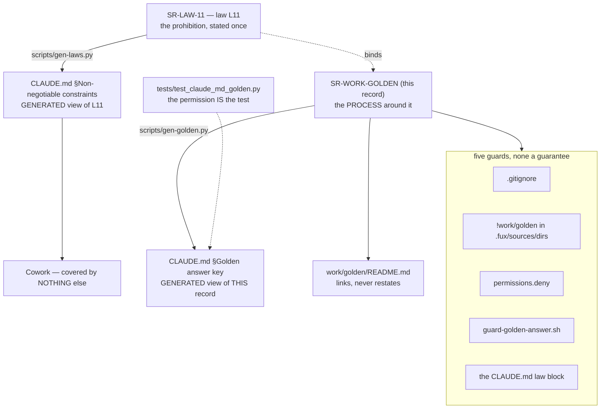

# SR-WORK-GOLDEN — the sealed answer key

## §1 — For humans

> ⚠ **The prohibition is [L11](0012_LAW-11-sealed-answer-key.md), and this record
> states none of it.** Read the law before doing anything near `work/golden/`.
> **This record is the HOME of the process around it** — the guards, what Claude
> may read, and the generated view in `CLAUDE.md`. How the benchmark is *run* is
> [`work/golden/README.md`](../work/golden/README.md)'s, and which environment may
> run it is [SR-WORK-ENVIRONMENTS](0052_WORK-environments.md)'s.

**Why the split.** The rule — *no Claude session opens the answer key, ever, by
any route* — is absolute, so it belongs in the one class of record that cannot be
traded away by an ordinary decision. It became **law L11** on 2026-09-15.
Everything around it is process, and process is what changes: the guard list has
grown twice, and what Claude may read moves when Codex releases the questions.

🔴 **Five guards stand behind the law and none of them is a guarantee.** Claude
Code and Codex run as the same Mac user, so no file permission can tell them
apart, and the hook and the deny rules only bind the surface that honours them.
**Cowork honours none of them** — it reads `CLAUDE.md`, and that is the entire
reason the law is reproduced there rather than merely linked.



<details>
<summary><b>ASCII twin</b> — the same diagram, for terminals, diffs, and any reader without a Mermaid renderer</summary>

```text
  SR-LAW-11 — law L11: the prohibition, stated once
        |
        |-- scripts/gen-laws.py --> CLAUDE.md  Non-negotiable constraints
        |                                 |
        |                                 +--> Cowork: covered by NOTHING else
        |
        +-- binds --> SR-WORK-GOLDEN (this record) — the PROCESS
                            |
                            |-- scripts/gen-golden.py --> CLAUDE.md  Golden answer key
                            |          ^
                            |   tests/test_claude_md_golden.py holds the two byte-equal
                            |   (the permission IS the test — SR-LAW-0 decision 5)
                            |
                            |-- work/golden/README.md — links, never restates
                            |
                            +-- five guards, none a guarantee:
                                  .gitignore
                                  !work/golden in .fux/sources/dirs
                                  permissions.deny in .claude/settings.json
                                  .claude/hooks/guard-golden-answer.sh
                                  the CLAUDE.md law block itself
```

</details>

---

## §2 — For agents

### Context

**The rule was ruled on 2026-09-11 and had no record until 2026-09-15.** It lived
in two places — `CLAUDE.md` §Golden answer key and
[`work/golden/README.md`](../work/golden/README.md) §The one rule — and in
neither of them as a statement anything owned. Under
[SR-LAW-0](0002_LAW-0-authority.md) decision 1 that is a restatement by its own
test: *could these two disagree while both still look correct?* They could, and
one of them is the only thing standing between a chat agent and a contaminated
benchmark.

**W-146 row 17 named the gap on 2026-09-12 and then deliberately did not close
it.** The obvious move — delete the `CLAUDE.md` paragraph, link to a record —
**would have removed Cowork's only cover**, because Cowork reads `CLAUDE.md` and
does not read `records/`. So the row sat in the Blocked-on-Arpit inbox rather
than being resolved by an agent's own reading of a law.

**Arpit ruled it on 2026-09-15: write the record, and keep the paragraph as a
generated view** — and then, the same day, ruled the prohibition itself into a
**law**, on the ground that a rule with no exceptions must not sit in a record
an ordinary decision can supersede. What is left here is everything that is not
the rule.

### Decision

1. **This record states none of the prohibition.** It is
   [L11](0012_LAW-11-sealed-answer-key.md), stated once there and carried into
   `CLAUDE.md` §Non-negotiable constraints by
   [`scripts/gen-laws.py`](../scripts/gen-laws.py). **A second statement of it
   here would be the restatement [SR-LAW-0](0002_LAW-0-authority.md) decision 1
   forbids**, and this record's own history is why: the rule spent four days in
   two hand-maintained copies.

2. **What this record carries instead is the process, and `CLAUDE.md` gets a
   generated view of it.**

<!-- GOLDEN-TEXT:BEGIN -->
🔴 **`work/golden/golden-answer/` is closed to Claude by law
[L11](0012_LAW-11-sealed-answer-key.md)** — §Non-negotiable constraints above.
Read it before anything near `work/golden/`. **This block states none of it.** It
is the surrounding process:

- **What Claude MAY read:** `work/golden/seed/`, the READMEs and the prompts,
  and `work/golden/questions/questions.jsonl` **after Codex releases it** (post
  ladder freeze). The five phases, the ladder, the rungs and what a result may
  claim are in [`work/golden/README.md`](../work/golden/README.md).
- **Five guards stand behind the law and not one is a guarantee** —
  `.gitignore`; `!work/golden` in `.fux/sources/dirs`; `permissions.deny` in
  `.claude/settings.json`; `.claude/hooks/guard-golden-answer.sh`, which matches
  what a tool call *targets* and fails closed; and the generated law block
  itself. Claude Code and Codex run as the **same Mac user**, so no file
  permission can tell them apart, and a surface that honours neither hooks nor
  deny rules — **Cowork is one** — is restrained by the law text alone.
- **The route no guard sees** is a recursive `grep`, `rg`, `find` or `ls` over
  `work/` that never names the folder. L11 makes excluding `work/golden/` part of
  the rule; nothing mechanical will catch you.
- **The key in use is provisional and that relaxes nothing.** It is
  Claude-authored, every run scored against it is `informed`, and it is being
  replaced — a leak from a draft key contaminates the sessions building against
  its successor.
<!-- GOLDEN-TEXT:END -->

3. **The generator and its bind.**
   [`scripts/gen-golden.py`](../scripts/gen-golden.py) renders decision 2's block
   between `CLAUDE.md`'s `<!-- GOLDEN:BEGIN … -->` / `<!-- GOLDEN:END -->`
   markers, rewriting link targets from record-relative to repo-root-relative and
   doing nothing else;
   [`tests/test_claude_md_golden.py`](../tests/test_claude_md_golden.py) holds the
   two byte-equal. ⚠ **Delete that test and the `CLAUDE.md` block becomes an
   illegal restatement** — [SR-LAW-0](0002_LAW-0-authority.md) decision 5 permits
   the view for exactly as long as the bind exists.

4. **The `CLAUDE.md` view is not decoration, and it is not for Claude Code.**
   Claude Code is already restrained by `permissions.deny` and by the hook.
   **Both views exist for Cowork and for a recursive `grep` that never names the
   folder** — the two paths every other guard misses. A change that removes them
   removes the only cover those two have, whatever else it puts in their place.

5. **`work/golden/README.md` links to the law and states none of the rule.** It
   is the home of the *process of running the benchmark* — the five phases, who
   writes what, the ladder, the rungs, what a result may claim. It may not carry
   a second statement of who may read the key.

6. **This record owns the hook, the generator and the bind.**
   `.claude/hooks/guard-golden-answer.sh` was left unowned on purpose by
   [SR-WORK-BLOCKERS](0064_WORK-blockers.md) decision 10 — *"it belongs to the
   sealed benchmark's rule"* — and this is the record of that rule's enforcement.
   `scripts/gen-golden.py` and `tests/test_claude_md_golden.py` come with
   decision 3. A `kind: process` record owns its enforcement, and these three are
   it.

7. **What the hook can and cannot see, stated rather than assumed.** It checks
   what a tool call **targets** — `file_path`, `notebook_path`, `path`, `glob`, a
   `Glob` pattern, and a `Bash` command naming the folder — so writing prose about
   the rule is not blocked, and **a recursive grep over `work/` that never names
   the folder is not caught**. It fails closed on input it cannot parse. That
   residual hole is decision 4's reason for existing, not a defect to fix in the
   hook.

8. **No agent puts the key in the repository by default** (Arpit, 2026-09-11).
   Every agent that would create, read or change it — Codex, in phases 1, 3 and
   5 — first asks Arpit whether the key is a file or is pasted in chat, and waits.
   Claude never uses the key either way, so a Claude prompt carries no such
   question.

9. **Verifying the key's shape, schema, size or freshness is Codex's work,
   permanently.** An item that needs it is blocked on Arpit or Codex and is never
   agent-closable — the cost L11 names in its Consequences, recorded here so the
   queue treats it as a fact rather than as a thing to route around.

### Consequences

- **The prohibition outranks every other record now**, and this one is the
  process that surrounds it. A change to the rule is an amendment to
  [SR-LAW-11](0012_LAW-11-sealed-answer-key.md) on Arpit's ruling; a change to
  the guards or to what Claude may read is a change here.
- **`CLAUDE.md` §Golden answer key can no longer be edited in place** — the test
  fails until this record changes and the generator runs, which is the point.
- 🔴 **The residual hole is unchanged and is not closed by this record.** A
  recursive grep that never names the folder, and any surface that ignores hooks
  and deny rules, are still stopped only by an agent reading L11 and obeying it.
  **A law makes the rule harder to argue with, not harder to ignore.**
- **Cowork remains covered by exactly two generated blocks.** Decision 4 says so
  out loud so that the next session to shrink `CLAUDE.md` knows what it is
  holding.

### Alternatives considered

| option | why not |
|---|---|
| Keep stating the prohibition here as well as in L11 | two normative-looking copies of one rule that can drift while both look correct — SR-LAW-0 decision 1, exactly, and the state this record was written to end |
| Delete this record and fold the process into L11 | a law record that also carries a guard list and a release schedule is a law about two subjects; the guard list has already changed twice and a law that changes on an agent's reading is not a law |
| Delete the `CLAUDE.md` blocks, link to the records | the move row 17 refused for three days. Cowork does not read `records/`; the link covers nothing it reaches |
| Fold it into [SR-WORK-BENCHMARK](0053_WORK-benchmark.md) | that record's subject is **what a run captures**, and its decision already says *"planted ≠ sealed — the golden answer key belongs to the lab and never moves into a benchmark"*. Merging them re-makes the conflation it exists to prevent |
| Fold it into [SR-WORK-ENVIRONMENTS](0052_WORK-environments.md) | that record decides **which machine** runs what. The key's readership is not an environment question, and a leak on any machine is the same leak |
| Rely on the hook alone and drop the prose | the hook binds one surface. Cowork is not that surface, and the hook's own header says what it cannot see |
| Harden the hook to catch a recursive grep | it would have to block every `grep` over `work/`, which is most of a session's reading. A gate that fires wrongly is worse than one that does not fire — SR-LAW-0 decision 4's fourth warning |

### Reference (required)

- [SR-LAW-11](0012_LAW-11-sealed-answer-key.md) — the law this record surrounds
  and does not state.
- [SR-LAW-0](0002_LAW-0-authority.md) decision 5 — *a generated view is permitted,
  and only while a test binds it*; decisions 2 and 3 above are that permission
  applied, and its veto condition 2 is the shape of this record's.
- [`work/golden/README.md`](../work/golden/README.md) — the process this record
  does not state: the five phases, the ladder, the rungs and what a result may
  claim.
- [SR-WORK-BLOCKERS](0064_WORK-blockers.md) decision 10 — where
  `guard-golden-answer.sh` was explicitly left unowned, and for whom.
- [SR-RS](0133_predictions.md) — `blind` versus `informed`, which is the
  currency a leak spends.

### Veto condition

**Reopen this decision if:** the `CLAUDE.md` §Golden answer key block exists
without [`tests/test_claude_md_golden.py`](../tests/test_claude_md_golden.py)
binding it, or a guard named in decision 2 is removed without a sixth taking its
place. ⚠ **A Claude session found to have read the key reopens
[SR-LAW-11](0012_LAW-11-sealed-answer-key.md), not this record** — that is
evidence about the rule's sufficiency, and the rule is not here.

**How to check it:**

```console
$ python scripts/gen-golden.py --check && test -f tests/test_claude_md_golden.py
```

— the first half proves the two copies agree, the second proves the permission
that makes the copy legal still exists. A failure of either is this veto firing.

---

## References

*Every source this record cites, gathered in one place. §2's **Reference
(required)** names the grounding; this is the complete list. An archived
document is never listed here — the body may name one, but archive is not
evidence.*

**Records** — [SR-LAW-0](0002_LAW-0-authority.md) · [SR-LAW-11](0012_LAW-11-sealed-answer-key.md) · [SR-WORK-ENVIRONMENTS](0052_WORK-environments.md) · [SR-WORK-BENCHMARK](0053_WORK-benchmark.md) · [SR-WORK-BLOCKERS](0064_WORK-blockers.md) · [SR-RS](0133_predictions.md)

**Code**

- [`scripts/gen-golden.py`](../scripts/gen-golden.py)
- [`scripts/gen-laws.py`](../scripts/gen-laws.py)
- [`tests/test_claude_md_golden.py`](../tests/test_claude_md_golden.py)
- [`.claude/hooks/guard-golden-answer.sh`](../.claude/hooks/guard-golden-answer.sh)
- [`.claude/settings.json`](../.claude/settings.json)

**Project docs**

- [`CLAUDE.md`](../CLAUDE.md)
- [`work/golden/README.md`](../work/golden/README.md)
- [`work/open/W-145-codex-regenerates-the-key.md`](../work/open/W-145-codex-regenerates-the-key.md)
