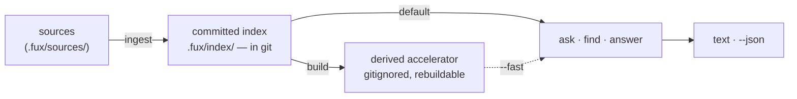

<!-- COMPONENTS-START — GENERATED from records/README.md's OWNERSHIP and DESCRIBES tables by scripts/gen-components.py. Do not edit by hand: change the table, then run `python scripts/gen-components.py --write`. -->

**Owns** — the components this record decides:

- [`src/fux/__main__.py`](../src/fux/__main__.py) · file
- [`src/fux/cli.py`](../src/fux/cli.py) · file
- [`src/fux/progress.py`](../src/fux/progress.py) · file
- [`src/fux/sources.py`](../src/fux/sources.py) · file

<!-- COMPONENTS-END -->

# SR-CLI — the command-line surface

## §1 — For humans

`fux` has **flat verbs and no subcommand tree**, in groups:

| group | verbs | |
|---|---|---|
| **lifecycle** | `setup` · `doctor` · `inspect` | set the repo up, check the environment, then X-ray the index — `doctor`'s fix is a command or a config edit, `inspect`'s is a change to the corpus ([SR-INSPECT](0156_inspect.md)) |
| **write** | `ingest` · `build` | one writes the committed plane, one derives from it. **`ingest` is the first ingest AND every re-ingest**, directories and URLs alike — decision 16 |
| **sources** | `add` · `remove` · `enrich` · `correct` | maintain what is indexed — `add` and `remove` write lines and end in an ingest, `enrich` plans and validates a MODEL's text, and `correct` writes one question a PERSON typed ([SR-ENRICH](0137_enrich.md) decision 19). ⚠ **`update` was a fourth verb here and decision 16 deleted it** |
| **read** | `ask` · `find` · `answer` · `lexical` | differ only in how much they commit to. `lexical` is the words alone, **frozen** — decision 12 |
| **graph** | `explain` · `graph` · `path` | answer with **relationships**, never with a ranking |
| **serve** | `mcp` · `daemon` | long-running processes; the only verbs that do not return |
| **maintenance** | `hooks` · `tune` · `output` · `verify` | wire the repository to keep its own index in step, print the tunables and the output defaults, and re-run a provenance receipt against this tree |

⚠ **`output` was missing from this table until 2026-09-14 (W-164 gate 2).**
The verb shipped with [SR-OUTPUT](0143_output-defaults.md) and
`.fux/README.md`'s own verb table listed it; this one did not, in the table this
record explicitly *"promises to keep true"*. Two hand-maintained copies of one
list with nothing comparing them, and **the record was the stale copy** — which
is the direction that matters under L0, because every other artifact is supposed
to defer to this one. `tests/test_verb_table_agreement.py` holds the two tables
and `build_parser()` together now.

🔴 **The parser is what settles a disagreement, and that is the whole design of
that test.** Comparing two documents can only say they differ; it cannot say
which is right, and a session that guessed had an even chance of editing the
README to match a stale record.

**The grouping is the mental model; the count is not.** What a verb does to the
two planes survives a new verb where a count does not — which is why the table
above is what this record promises to keep true, and why *"how many verbs are
there"* is answered by `build_parser()` rather than by this file.

**Flat verbs are not a tree, at any number.** `add` dispatches on its entry
rather than becoming `fux source add`; `path` takes two positionals and
`--hops` rather than becoming `fux graph path`; `daemon` takes a positional
`start`/`stop`/`status` rather than becoming a subparser. Nesting is the thing
this record refuses, not arithmetic.

**The graph group is the one that does not rank.** `ask`/`find`/`answer` return
documents ordered by relevance; `explain`/`graph`/`path` return relationships
the documents themselves stated. That is why they are a group rather than three
more read verbs — see [SR-GRAPH](0126_graph.md).

The three query verbs differ only in **how much they commit to**. `find` gives
you locations and stays out of the way. `ask` gives you a ranked list with
scores, which is what you want when you are judging the engine. `answer`
commits to one result, which is what an agent wants when it needs a value, not
a menu. All three take the same query, the same `--json`, the same
`--fast`/`--scan` pair, and the same `--no-tune`.

Everything that can fail renders as `error: <message>` on stderr and exits
non-zero. **`main` is the only place that catches** — internals raise, and a
traceback reaching a user is a bug, not a diagnostic.

**Diagram — Mermaid and its ASCII twin. Update both, always, together.**



<details>
<summary><b>ASCII twin</b> — the same diagram, for terminals, diffs, and any reader without a Mermaid renderer</summary>

```text
   sources            committed index          derived accelerator
 (.fux/sources/) --> .fux/index/ (in git) -->  (gitignored, rebuildable)
               ingest                build          |
                          |                         |
                          | default                 | --fast
                          |    (reference scan)     |
                          v                         v
                     +-------------------------------+
                     |    ask   ·   find   ·  answer |
                     +-------------------------------+
                                     |
                              text  ·  --json
```

</details>

### Examples

The shape of the surface, and what a failure looks like:

```console
$ fux doctor
[OK] python version: 3.11, fux 0.32.0
[OK] repo root: /repo
[OK] .fux/ writable: /repo/.fux
[OK] index not gitignored: the committed index is tracked
[OK] .fux/ layout declared: every entry is declared
[OK] accelerator: not built - `ask` uses the reference scan; run `fux build` for the fast path

$ fux ask "why did pruning fail"
2.1973  Pruning was measured and failed  (docs/pruning.md)
```

Errors are rendered only here, at the boundary, with `exit 1`:

```console
$ fux build
error: .fux/index/aa.jsonl:2: the quoted 16-hex token '30aef0c52cf11116' appears
outside `terms` … Refusing to build a divergent accelerator.
# exit 1
```

---

## §2 — For agents

### Context

The verb surface shipped before it was written down: the only statements of it
were `argparse` help strings and
[`tests_e2e/test_verbs.py`](../tests_e2e/test_verbs.py). That is a gap with
teeth for this project specifically —

- **Agents are the primary caller.** Fux exists so coding agents can ask
  questions of a corpus. `--json` is the actual product surface, and it had no
  recorded schema.
- **Exit codes are API.** CLAUDE.md's error contract names four, and nothing
  recorded which are actually produced.
- **The defaults are decisions, not conveniences.** The scan is the default
  query path because it needs no build step, and `--fast` is what opts into the
  accelerator. That reads as an ordinary flag to anyone who has not read
  [SR-T1-ACCELERATOR](0110_accelerator.md).

### Decision

**1. Flat verbs, grouped by what they touch.** **No nesting, ever** — that is
the constraint. A new verb takes flags or positionals, never a subcommand tree,
and lands in one of the groups in §1 or argues for a new one in this record.

**1a. `add` / `remove` maintain the corpus, over all three source
lists.** The entry picks the list — anything with a `scheme://` is a URL,
`--types` says type pattern, everything else is `dirs`, which already accepts a
directory *or* a single file. The common cases need no flag at all, which is
what makes a flat verb sufficient here rather than merely mandated. They write
every attribute explicitly ([SR-URL-LIST](0116_url-list.md) decision 12) and
edit one line, so a human's grouping comments survive.

⚠ **Since 2026-09-11 the type list is `.fux/formats.toml`** ([SR-TYPES](0128_types-list.md)
decision 12), and every verb hands a `--types` edit to `ingest/typesfile.py`
instead of the line grammar. **The one-line rule holds there too**: `add` inserts
one glob into `include`, or one `ext = "module"` into `[decoders]` when a decoder
reads the extension (moving a bare `"*.ext"` out of `include` if it was there);
`remove` deletes one line. Two things differ and are stated: **a layout fux did
not write is refused** rather than reformatted, and **`remove --types` never
excludes** — the types list has no subtraction, so a pattern that is not in it
is an error naming `.fux/.fuxignore`. A leftover `.fux/sources/types` stops every
verb until `fux setup` converts it.

**1b. `add` and `remove` write lines; `ingest` never touches one.** One
sentence, and it is the whole reason the verbs do not overlap. Attribute
edits belong to `add`, which is already an upsert. Re-reading a source belongs
to `ingest`, which is why `fux ingest <entry>` can take an entry without that
meaning "create it" — an entry nobody listed is a loud error, because an
`ingest <entry>` that silently created lines would be a second `add`.
Re-fetching is re-reading, so it is `ingest`'s.

⚠ **This sentence named `update` until 2026-09-15**, when decision 16 deleted
that verb and moved its whole surface here. The rule did not change; the verb
under it did.

**1c. `fux add <URL>` fetches that one URL.** Scoped to the URL just added,
announced on stderr, `--no-fetch` to opt out. Recording a URL without fetching
it is a no-op, so any other default would mean "`add` ingests by default"
silently did not apply to the one entry kind where it costs something.

| rejected alternative | why not |
|---|---|
| **record-only, like `git remote add`** | right for a manifest something else reads later; wrong for an index whose whole value is being current. The URL would sit listed and unindexed until an unrelated command ran |
| **a required `--fetch` flag** | makes the useful case the long one, and makes the short one a trap that looks like it worked |
| **fetch the whole list** | a scoped fetch is the point: adding one URL should not re-request every other page in the corpus |

Precedent surveyed: [`uv add`](https://docs.astral.sh/uv/reference/cli/) locks
and syncs by default (`--no-sync` opts out) and
[`helm repo add`](https://helm.sh/docs/helm/helm_repo/) records *and* fetches.
The rejected pole is
[`cargo add`](https://doc.rust-lang.org/cargo/commands/cargo-add.html) and
`git remote add`.

**The fetch does not gate the write.** A URL whose fetch fails keeps its line
and exits 1 — recording and fetching are separate outcomes, and deleting the
line because a site was down would make the committed list a function of
network weather.

**1d. The engine has exactly two named networked paths, and this record names
them**: `fux add <URL>` and `fux ingest`. Both are fenced, both announce on
stderr that they went out.

⚠ **"Opt-in per invocation" stopped being true of the second one on
2026-09-15** (decision 16). A bare `fux ingest` goes to the network, so the
opt-in is now the *verb* rather than a flag on it, and the opt-**out** is
`--no-fetch`. **The count is not the law and never was** — see decision 16.

**L4's text does not change, and must not.** It reads *"network access only
inside explicit, fenced, opt-in paths"* — already plural, already satisfied.
Restating L4 here would be the defect [SR-LAWS](0001_LAWS.md) decision 3
exists to prevent, so this decision names the paths and cites the law rather
than paraphrasing it.

**1e. `setup` writes the files a consumer owns, write-if-missing** — `fux.toml`,
the source lists, both fetchers, `.fux/tune.toml`, and the agent policy files.
It is the only verb that may run before a repo root exists, because it is what
creates one ([SR-DOTFUX](0102_fux-directory.md) decision 6). Everything it
writes is the consumer's from that moment, and no later run rewrites any of it.

**1f. `hooks` writes outside `.fux/`, and is the only verb that does so
uninvited.** It takes flags — `--install` (the default), `--status`,
`--uninstall`, `--json` — rather than becoming `fux hooks install`. Because it
writes into `.git/hooks/` and `.gitattributes` it refuses to overwrite anything
it did not write, and says so. The reasoning is
[SR-MAINTENANCE](0129_hooks.md)'s.

> **`fux-merge-index` is a separate console script, not a verb**, and that is
> not a surface inconsistency: git invokes a merge driver as a bare command
> with positional arguments and offers no way to pass a subcommand.

**1g. `mcp` and `daemon` are verbs, not flags, because they do not return.**
`fux ask --serve` would be a different program wearing the same name.
[SR-MCP](0136_mcp.md) owns the JSON-RPC protocol and the tool surface;
[SR-MAINTENANCE](0129_hooks.md) owns what the daemon does. What binds here is
the shape: both are flat, both are in the **serve** group, and `daemon`'s
`start` / `stop` / `status` are **positional and mutually exclusive** —
`fux daemon --start --stop` must not parse, and a subparser would have been the
first tree on this surface.

**1h. `tune` is flat and takes no arguments at all.** Veto 1 refuses
`fux <verb> <subverb>`, so `fux tune print` was never on the table. **It prints
the specimen tunables file and never writes one**: `tomllib` reads and nothing
in the stdlib writes TOML, so a writer would mean either a third-party runtime
dependency (L1) or fux round-tripping a commented file it promised never to
rewrite ([SR-DOTFUX](0102_fux-directory.md)). The human pastes; the file stays
theirs. It reads no repo state either, so it works before `fux setup` has run
and outside a root — the second verb with that property, earned the opposite
way to `setup`: by writing nothing rather than by creating the root.

**2. The three query verbs share one parser.** Every one takes a positional
`query`, `--json`, a mutually exclusive `--fast`/`--scan` pair (`--scan`, the
default, is redundant with it but kept for explicit bug reproduction), and
`--no-tune`. `ask` and `find` add `--top N` (default 5); `answer` does not,
because committing to one result is its whole job. `answer` adds `--no-refer`.
Divergence between the three is a defect.

**2a. `fux enrich [TARGET]` — an optional positional that FILTERS and never
widens.** W-104, Arpit 2026-09-01. `--plan` and `--check` both accept one `loc`
or URL, spelled exactly as the index spells it, and report on that document
alone; with no `TARGET`, on every declared scope as before.

Three properties, and each is there to stop a specific misread:

| property | why it is not a preference |
|---|---|
| **a positional, not a flag** | it is the *subject* of the verb, like `ask`'s query — a `--target=` reads as a filter on a bulk run, which is the framing that got a one-document request executed as a scope |
| **exact match, never a prefix or a glob** | a selector that silently matches two documents is how one document becomes a bulk run. Ambiguity is refused, not resolved |
| **it filters what is reported; it cannot make a document plannable** | a document no `enrich=true` line reaches stays unenrichable, and naming it here changes nothing ([SR-ENRICH](0137_enrich.md) decision 4 — which directories are enriched is a human's declaration in `fux.toml`) |

⚠ **It is also not a gated flag, so [SR-OUTPUT](0143_output-defaults.md)
decision 10 does not reach it.** That rule binds `store_true` flags in this file
to `default=None`; a `nargs="?"` positional defaults to `None` by construction
and there is nothing to gate. SR-OUTPUT records it by name under its 2026-09-02 note.

**3. `--no-tune` is one flag on five verbs**, not a knob per tune table.
`ask` · `find` · `answer` · `graph` · `path` ignore `.fux/tune.toml` and answer
on the engine's defaults. The question it answers is *"is it me or the
config?"*, and bisecting that across six switches is an experiment where one
switch is a single re-run. Decision 2's shared query parser carries it for the
three read verbs, so those cannot diverge on it. **`explain` does not carry
it** — it reads no tunable, and a flag wired to nothing is a lie with a help
string.

**4. `main` is the only boundary.** It catches `FuxError` → `error: <msg>` on
stderr, exit `exc.exit_code`; and `KeyboardInterrupt` → exit 130. Internals
raise. Any traceback that reaches a user is a bug.
⚠ **It is also where one repository precondition is checked, before any
handler runs** (2026-09-11): a missing `.fux/pii.toml` stops the verb. The rule,
its exemptions and why are [SR-PII](0148_pii.md) decision 17's, not this
record's; what this record owns is the placement — **before dispatch**, so a
verb added later is gated without its author knowing the gate exists.

**5. Exit codes: fux produces `0` ok · `1` error · `130` interrupted.
`argparse` produces `2` for a usage error, before this contract applies at all**
(amended by Arpit 2026-09-16, W-193).

**No `raise FuxError` site passes `exit_code=2` and none may.** The `2` comes
from `ArgumentParser.error`, which calls `sys.exit(2)` **before `cli.main`'s
boundary is ever reached** — so decision 4's *"`main` is the only boundary"*
holds exactly: the one place fux renders an error never sees it.

**A consumer sees `2` for an unknown verb, an unknown flag, or a malformed
command line**, with argparse's usage message on stderr. That is the convention
their tooling already assumes.

⚠ **The strict-mode reservation on `2` is RETIRED, and the retirement is the
point of the amendment.** This decision read *"`2` is reserved and not
produced … do not treat `2` as live"* — a statement about `FuxError` that a
reader could only take as a statement about the process. **A reservation nothing
could ever claim is what makes a consumer read `fux update` → `2` as *the runner
broke* rather than *the verb is gone*,** and W-177 is what turned that from a
latent wrong sentence into a real consequence: `fux update` was in the released
2.0.1 and is in people's pipelines.

**Not taken** (W-193's other two options): overriding `ArgumentParser.error` to
raise `FuxError` — it changes the exit code of every malformed command line fux
has ever accepted, on the strength of one deleted verb; and renumbering the
reservation — it keeps a dead reservation alive and documents two meanings on
one code.

**6. "No confident matches." is exit 0, and goes to STDERR.** An honest decline
is a successful answer, not a failure. Callers test the output, not the exit
code, for emptiness — `--json` is the reliable way to do that.

⚠ **The stream half was added 2026-09-14 (W-165 fix 2).** The exit code is
unchanged and is the decision this clause was always about; what moved is where
the sentence is written, so that `fux find`'s stdout carries paths and nothing
else. Stated on all three query verbs at once — [SR-ASK](0103_ask.md) decision 7,
[SR-FIND](0104_find.md) decision 6, [SR-ANSWER](0105_answer.md) decision 7 —
because *"the same rule as `ask`"* is what those records say and a split would
have made it false. **`fux graph` still writes it to stdout**, in both readers.

**7. Off-by-default flags are decisions.** `--fast` opts into the derived
accelerator and is off by default: the scan needs no build step and the
accelerator is asserted byte-identical to it, so the only cost of defaulting to
scan is speed. `--scan` forces the same reference path explicitly, for bug
reproduction. The default does not flip without new evidence and a separate
sign-off.

**8. `fux --version` stays instant.** Handlers import their modules lazily
inside the dispatch functions. Adding a module-level import to `cli.py` breaks
this and is a defect.

**9. Bare `fux` prints help and exits 1.** No arguments is a usage error, not a
no-op.

**9b. `verify` is a verb because it takes a FILE, not a query.**
[SR-PROVENANCE](0142_provenance.md) emits a receipt from `fux answer
--receipt`; `fux verify <receipt>` re-runs it. Every flag on the query parser —
`--top`, `--fast`, `--scan`, `--no-tune` — is meaningless on a command whose
input is a path, so it could not have hung off `answer` without carrying five
inapplicable flags. It sits in **maintenance** rather than **read** because it
answers a question about the repository's own state, not about the corpus.

⚠ **`answer` gained three flags in the same change** — `--audit`, `--receipt`,
`--journal` — and they are three rather than one because they are three
different asks. **`--journal` is the only one that WRITES**, and folding it into
`--receipt` would make a local plaintext record of questions reachable by
somebody who only wanted to see one.

**10. Everything the CLI prints must encode on a Windows console.** `sys.stdout`
there defaults to the active codepage — `cp1252` on a Western install — so a
character outside it makes `print()` raise `UnicodeEncodeError`: the command
**crashes and exits non-zero** rather than rendering badly. Use `->` and
`[OK]`, not `→` and `✓`.
[`tests/test_windows_console_safe.py`](../tests/test_windows_console_safe.py)
parses every module under `src/fux/` and refuses a non-`cp1252` character in
any string reaching `print()`, `FuxError()` or `.write()`. Docstrings are
exempt (never encoded), as is `progress.py`'s bar (stderr, TTY-gated). **Its
scope is calls rather than literals** because `store/canonical.py` and
`ingest/urlsrc.py` hold U+2028/U+2029/U+0085 as the sentinels they *strip*, and
a guard that flags the code defending against a character is one people learn
to switch off.

**11. `fux inspect` is a verb, not a flag on `doctor`.** Stated once in
[SR-INSPECT](0156_inspect.md) decision 1; the boundary is the remedy, not the
subject — `doctor`'s finding is fixed by a command or a config edit and
`inspect`'s by a change to the corpus.

**12. 🔴 `fux lexical` and `fux ask` are TWO VERBS OVER ONE BODY, and `lexical`
is FROZEN.** (W-160.)

`ask --scan` already computed BM25F alone. What this adds is a **contract**:

- **`lexical` is BM25F → rerank → RRF over `-q`. No graph stage, ever.**
- **A future component added to the lexical core is a NEW VERB or a TUNABLE,
  never a change to this one.** That sentence is the whole decision; everything
  else here is what makes it hold.
- **It exists because [W-161 → W-204](../work/open/W-204-golden-outputs-scoring-and-version-benchmark.md) gives
  `ask` a graph tier.** After that, `ask --scan` is no longer *the words alone*
  — and nothing would have said so. Every ranking verdict needs a baseline arm
  that cannot quietly acquire a stage.

⚠ **Two things make the freeze real rather than asserted, and both were found
by running it rather than by reasoning about it.**

1. **One parser factory, not two flag blocks.** `_ask_shaped_parser` builds both
   verbs' surface, so a flag added to `ask` reaches `lexical` by construction.
   Two hand-kept copies would drift the moment one gained a flag, and the drift
   would be invisible — both parsers would work.
2. 🔴 **`lexical` must appear in `output_config.CLI_VERBS`, and omitting it made
   the two verbs print differently from one ranking.** A verb absent from that
   table has **no key resolved at all**, so `args.sections` stayed `None`,
   `getattr(args, "sections", True)` read it as falsy, and `ask` printed `§`
   heading lines while `lexical` printed none. Nothing failed: the file loaded,
   the query ran, the scores were identical. It is
   [SR-OUTPUT](0143_output-defaults.md)'s W-140 row 14 trap — *an absent entry
   never resolves `--json`* — arriving through a different door.
   **And `lexical` reads `[cli.ask]`'s subtable** (`VERB_READS`), because a
   subtable of its own would let a consumer's committed file make the two verbs
   differ, and would have made every repo that already has an `output.toml`
   exit 1 on a verb they had never run.

**The gate is `tests_e2e/test_relational.py::test_lexical_is_byte_identical_to_ask`,
and it compares TEXT and `--json`** — comparing only `--json` would have missed
the `§` defect, because `headings` is in the payload either way.

**13. `fux graph` takes a query OR `--seed`, and the query form is DEFINED as
the seed form over the query's top-k.** (W-160.) Mass follows **argument
order**, the same rank-mass rule the query form applies to top-k.

⚠ **Not an argparse mutually-exclusive group, because one of the two is
required and argparse cannot say both** — such a group refuses a positional. The
check lives in `cmd_graph`, where it can name which of the two mistakes was
made, and both mistakes have their own test.

⚠ **A hand-named seed reports `score: null` and `rank: n`, not a score.** The
query form's seed score is a BM25F number a reader can line up against `ask`'s
output; there is none here. Printing the walk's internal `1/(i+1)` mass would
put a **third** incomparable value in a column SR-GRAPH already warns not to
compare across roles — and it diverged: seed 0's mass is exactly `1.0`, which
`json.dumps` writes `1.0` and `JSON.stringify` writes `1`. **A differential
divergence on the first line of the new output, from a value no ranking would
ever produce**, caught by running both readers rather than by a test. `null` is
`null` in both.

**10a. And the stream itself is UTF-8, on every platform** (amended
2026-09-13, found by the Windows e2e suite's first run).
`cli.main` reconfigures `sys.stdout`/`sys.stderr` to `encoding="utf-8",
errors="replace"` before it parses an argument, and `fux-merge-index` does the
same.

🔴 **Decision 10 governs what fux writes ABOUT ITSELF; what broke was DATA.**
The ASCII-literal rule cannot reach a document title, a path, or a passage —
those come from the corpus, and a corpus is UTF-8 by construction. On Windows
`sys.stdout` was the active code page, so `fux ask --json` piped to a file or
to an agent emitted **cp1252 bytes**, and an em dash in a title arrived as
`0x97`. Thirteen `tests_e2e` tests failed with `UnicodeDecodeError` the first
time that suite ran there — reading fux's own output.

**JSON settles it:** RFC 8259 §8.1 says UTF-8, so `--json` had no other legal
encoding, and the index, the Node reader and every fetcher already agree.

⚠ **Decision 10 and its test STAY.** They are not made redundant: a legacy
console is still cp437/cp1252 for *rendering*, and `->`/`[OK]` is what keeps
fux legible there. What changed is the bytes on a pipe, and that a character
outside the console's page now degrades instead of raising out of a verb that
had already done its work.

11. **`ask` gained a `--sections` / `--no-sections` pair — the decision is
    [SR-OUTPUT](0143_output-defaults.md) decision 21, noted here only because
    the flags themselves live in `cli.py`, which this record owns.** Both
    halves are `default=None` (decision 7/10's `--band` pattern repeated): an
    absent flag has to stay distinguishable from an explicit one, or a
    `[cli.ask] sections` key in `.fux/output.toml` would be unreachable from
    the command line. The mutually-exclusive group is the mechanism a
    default-on flag needs — a lone `store_true` can only ever turn the lines
    back on, never off against a file that says `false`.

12. **The progress bar's line budget is the terminal's width, less one
    column — not a constant.** `progress.py` assumed **80** and never asked,
    so on a wide window a path that fits comfortably was still elided:
    `archive/compare/keyspace-unification.compare` painted as
    `…/compare/keyspace-unification.compare`, with the leading `…mpare/` left
    as a fragment that reads like a directory and is not one.

    - **What the constant was protecting is real, and is kept.** `\r` returns
      to the start of the *terminal* line, so a line that wrapped cannot be
      erased and the "no partial line" guarantee stops holding. **80 stays as
      the fallback** for when there is nothing to measure — a pipe under
      `--progress`, a Windows console reporting 0, a test's fake stream.
    - **`COLUMNS` wins over the `ioctl`**, because it is the knob a user
      reaches for and the one a harness sets.
    - **The last column is deliberately left empty.** Writing into it puts
      most terminals in the *pending wrap* state, where the next character
      lands on the following row — the wrapped line `\r` cannot take back.
    - **Measured once per `Progress`, never per paint.** A resize mid-run
      breaks `\r` repainting whatever was returned, so re-measuring buys
      nothing — and it would put 100 000 `ioctl`s on the ingest path R5 timed
      at 44.4 s.
    - ⚠ **This does not touch a committed byte.** The bar is stderr-only and
      TTY-gated (decision 9), so stdout stays byte-identical with it on or
      off and [SR-LAWS](0001_LAWS.md) L3 is not in play. Terminal width is an
      output-shaping input, not an index input.
    - ⚠ **Still unguarded: display width ≠ `len()`.** A path holding a CJK
      character or an emoji counts as one per character and renders as two
      columns, so it can still wrap. No corpus here has hit it and no test
      covers it; it is named rather than fixed.

    Reference: [`src/fux/progress.py`](../src/fux/progress.py)
    `_terminal_width`, and the two width tests in
    [`tests/test_progress.py`](../tests/test_progress.py).

---

### The commands

Every block below is verbatim from
[the capture](../work/regression/2026-08-18-cli-surface/report.md) or
[the source-verbs capture](../work/regression/2026-08-21-source-verbs/report.md).
The corpus is the three-document fixture in
[`evidence/fixture.sh`](../work/regression/2026-08-18-cli-surface/evidence/fixture.sh)
— **scores are properties of that fixture, not of the engine**, and the version
string is the one the capture ran under.

#### `fux setup` — write what is mine, once

Optional and explicit. Everything is write-if-missing, so a second run is a
no-op and an edited file is never clobbered.

```console
$ fux setup
  wrote .fux/README.md
  wrote .fux/.gitignore
  wrote .fux/fetchers/http.py
  wrote .fux/fetchers/cdp.py
  wrote .fux/sources/dirs
  wrote .fux/sources/urls
  wrote fux.toml
setup: 7 file(s) written. They are yours: commit them, edit them, fux will not rewrite them.
next: add entries to .fux/sources/dirs, then `fux ingest`
# exit 0

$ fux setup
  kept  .fux/fetchers/http.py (yours; never rewritten)
  kept  .fux/fetchers/cdp.py (yours; never rewritten)
  kept  .fux/sources/dirs (yours; never rewritten)
  kept  .fux/sources/urls (yours; never rewritten)
  kept  fux.toml (yours; never rewritten)
setup: nothing to do - every consumer-owned file is already here
next: add entries to .fux/sources/dirs, then `fux ingest`
# exit 0
```

**`fux ingest` writes none of that.** `ensure_layout` writes only
`.fux/README.md` and `.fux/.gitignore`, so a repo that wanted an index never
receives code it did not ask for.

**`--no-agents` opts out of the agent policy files**, and it is an opt-*out*
because the failure it prevents is silent — an agent citing a retired design
confidently, with a correct-looking citation
([SR-AGENT-POLICY](0132_agent-policy.md) decision 5). Its durable form is
`[agents] install = []` in `fux.toml`, so a one-shot escape and a standing
preference are both expressible. ⚠ **`setup` prints the paths it wrote outside
`.fux/` and how to turn them off.** That announcement is **mandatory**, not
cosmetic — with a default-on install it is the entire remaining safeguard, and
SR-AGENT-POLICY's veto 1 fires on any agent file written without appearing in
it.

#### `fux doctor` — is this repo in a fit state?

Read-only. Every check prints `[OK]` or the reason it is not.

```console
$ fux doctor
[OK] python version: 3.11, fux 0.32.0
[OK] repo root: /root/fuxlab/demo
[OK] fux.toml loads: fux.toml
[OK] .fux/ writable: /root/fuxlab/demo/.fux
[OK] index not gitignored: the committed index is tracked
[OK] .fux/ layout declared: every entry is declared
[OK] accelerator: not built - `ask` uses the reference scan; run `fux build` for the fast path
# exit 0
```

The gitignore check is not decoration: a `.fux/*` blanket silently eating the
committed index is the failure mode [SR-DOTFUX](0102_fux-directory.md) was
written around.

**Every check, its level, and whose subject it reports on, is
[SR-DOCTOR](0152_doctor.md)'s** — including why `fux.toml loads` exists, and the
rule that a check degrading to `skipped` must name the row that does fail. This
record owns the **verb**: its flags, its exit codes and its `--json` shape.

**`--json` is not optional on this verb.** `doctor` is where an agent asks
whether the repo is healthy, and a status an agent cannot parse is not a status
for this product's actual audience. The background-runner state is **a check
inside `doctor`, not a verb** — veto 1 forbids `fux index status`, and `doctor`
already has the shape (`Check(ok, level, name, detail)`). The check is
**read-only**: it reports a stale lock and names the command to clear it, and
never clears it ([SR-MAINTENANCE](0129_hooks.md) decision 1c).

**Promotion to a `fux status` verb is a checkable condition, not a feeling.**
Promote when a caller needs runner state without wanting doctor's other checks
— concretely, when a script or agent path parses `fux doctor --json` and
discards everything but the runner block, or when running the other checks is a
cost (latency, a git call, a false FAIL) rather than a bonus. Until one of
those is observed **and named in the change that promotes it**, the check stays
where it is. That evidence belongs in `work/regression/` or a WORKLOG entry,
not in a commit message.

#### `fux ingest` — sources → committed index

Writes the committed plane. Builds the accelerator too, unless told not to.

```console
$ fux ingest
ingested 3 docs (3 changed), 0 skipped, 3 shards written
accelerator: 78 terms, 78 blocks, 82 postings (derived, not committed)
# exit 0
```

Re-running with nothing changed writes nothing — the count of *changed* docs
and *shards written* both drop to zero:

```console
$ fux ingest --no-accelerator
ingested 3 docs (0 changed), 0 skipped, 0 shards written
# exit 0
```

Unindexable files are reported, never silently dropped. The capture below is a
**first** run; a later run prints only what is new, then one counted line naming
both ways to see the rest — the suppression is
[SR-INGEST](0106_ingest.md) decision 4, and the summary count is untouched by
it (`2 skipped` is every skip, not the new ones):

```console
$ fux ingest --list-skipped
docs/empty.md: empty
docs/logo.png: binary
# exit 0

$ fux ingest
ingested 3 docs (0 changed), 2 skipped, 0 shards written
  skip docs/empty.md: empty
  skip docs/logo.png: binary
accelerator: 78 terms, 78 blocks, 82 postings (derived, not committed)
# exit 0
```

| flag | effect |
|---|---|
| `--list-skipped` | print skipped files and why, then exit — no writes |
| `--no-accelerator` | skip the derived build. **Results are unaffected** — only speed |
| `--full` | re-extract every document instead of carrying unchanged ones forward. **Bytes are unaffected** — only speed, and it is the complete term-collision check ([SR-INGEST](0106_ingest.md) decision 1b) |
| `--stop` | take over from a live background runner without running |

**`fux ingest` takes over from a live runner**: it stops a background runner
holding the lock and then runs; `--stop` is the same takeover without the run.
No new verb — `fux ingest` already owns the re-index, so stopping one is the
same territory. **`--stop` and `--full` are unrelated axes and read oddly side
by side**, which is the honest cost of putting it here; the alternative was a
`fux reindex` verb overlapping `ingest`, which is worse. Full semantics are
[SR-MAINTENANCE](0129_hooks.md) decision 1d.

⚠ **`--stop` with no runner is success, not an error.** Exit 0 saying nothing
was running. A verb whose job is "make sure it is not running" has done its job
when it was not running; exiting non-zero there breaks every script that calls
it defensively.

#### `fux build` — committed index → derived accelerator

Rebuilds the derived plane alone. Nothing it writes is committed, so it is
always safe to re-run and never needs to be.

```console
$ fux build
accelerator rebuilt from the committed index: 3 docs, 78 terms, 78 blocks, 82 postings
# exit 0
```

#### `fux add` / `fux remove` — maintain what is indexed

**`add` records and then does the work** — one of the engine's two named
networked paths when the entry is a URL, and it says so on stderr:

```console
$ fux add handbook
added     handbook archived=false
  in .fux/sources/dirs
ingested 3 docs (1 changed, 2 carried forward), 1 skipped, 1 shards written
  skip docs/architecture.pdf: not an indexed file type
accelerator: 20 terms, 20 blocks, 21 postings (derived, not committed)
# exit 0

$ fux add https://wiki.corp/runbook --cdp --no-keep
added     https://wiki.corp/runbook fetch=cdp keep=false
  in .fux/sources/urls
ingested 4 docs (1 changed, 3 carried forward), 1 skipped, 1 shards written
  skip docs/architecture.pdf: not an indexed file type
accelerator: 26 terms, 26 blocks, 27 postings (derived, not committed)
[stderr] fetching  https://wiki.corp/runbook (network — this URL only)
# exit 0
```

**Adding a file never overrides the type allowlist** — inclusion is a
conjunction with no precedence ([SR-DIR-LIST](0120_dir-list.md) /
[SR-TYPES](0128_types-list.md)), so the line is written, the check still runs,
and the verb says how to change it. Exit 0: this is a fact about the corpus,
not an error.

```console
$ fux add docs/architecture.pdf
added     docs/architecture.pdf archived=false
  in .fux/sources/dirs
ingested 3 docs (0 changed, 3 carried forward), 1 skipped, 0 shards written
  skip docs/architecture.pdf: not an indexed file type
accelerator: 20 terms, 20 blocks, 21 postings (derived, not committed)
  -> the line is listed, and the type allowlist rejects it. `fux add '*.pdf' --types` allows it; adding a file never overrides the allowlist
# exit 0
```

**`remove` states which branch it took.** Its own line is deleted; a path held
only by a listed ancestor is subtracted with the `!` the grammar already has:

```console
$ fux remove handbook
removed   handbook
  in .fux/sources/dirs
ingested 2 docs (0 changed, 2 carried forward), 0 not indexed, 0 skipped, 0 shards written, 1 records deleted
accelerator: 7 terms, 7 blocks, 9 postings (derived, not committed)
  dropped file:handbook/rota.md from the index
# exit 0

$ fux remove docs/onboarding.md
excluded  /docs/onboarding.md
  in .fux/.fuxignore — docs still listed; this path is subtracted from it
ingested 1 docs (0 changed, 1 carried forward), 1 not indexed, 0 skipped, 0 shards written, 1 records deleted
  (1 already recorded in .fux/.fuxignore; 'fux ingest --list-skipped' lists them all)
accelerator: 4 terms, 4 blocks, 4 postings (derived, not committed)
  dropped file:docs/onboarding.md from the index
# exit 0

$ fux remove docs/onboarding.md
[stderr] error: docs/onboarding.md is already excluded by .fux/.fuxignore:1 (`/docs/onboarding.md`), which is left alone. Nothing further to remove — delete that pattern to put it back
# exit 1

$ fux remove elsewhere/nope.md
[stderr] error: elsewhere/nope.md is not in <root>/.fux/sources/dirs: it has no line of its own, and no listed entry covers it. Both were checked. `fux add elsewhere/nope.md` would list it; nothing needs removing
# exit 1
```

⚠ **Three things in that transcript changed on 2026-09-14 and every one is
captured from the shipped CLI, not written by hand** (W-165):

1. **`excluded  /docs/onboarding.md` … `in .fux/.fuxignore`** — the exclusion
   moved next door (SR-FUXIGNORE decision 5a), and so did the `in …` line, which
   would otherwise point a reader at a file `git diff` shows unchanged. It is
   anchored with a leading `/`, because a bare name in that grammar means *at any
   depth*.
2. **`, 1 records deleted`** — the summary counts what left (SR-INGEST
   Consequences). Present only when the count is non-zero.
3. **Removing it twice is exit 1.** Removing something already removed is an
   error, which is the contract the `!`-line form kept.

**`fux ingest` re-reads; `--check` writes nothing** and is offline for files:

```console
$ fux ingest --check
  fresh  2 others
nothing has drifted.
# exit 0
```

**And the bare verb says what it is about to go out for** (decision 16a):

```console
$ fux ingest
fetching  1 of 1 listed URL(s) (network) — 1 known stale. `fux ingest --refetch-all` fetches every one
ingested 4 docs (1 changed, 3 carried forward), 0 not indexed, 0 skipped, 1 shards written
accelerator: 24 terms, 24 blocks, 25 postings (derived, not committed)
# exit 0

$ fux ingest --no-fetch
ingested 4 docs (0 changed, 4 carried forward), 0 not indexed, 0 skipped, 0 shards written
accelerator: 24 terms, 24 blocks, 25 postings (derived, not committed)
# exit 0
```

**Bare `fux add` lists all three, as the loader sees them** — sorted, deduped,
every attribute resolved, and a `*` on any line fux did not write:

```console
$ fux add
.fux/sources/dirs:
* docs archived=false
  docs/architecture.pdf archived=false
  handbook archived=false

* 1 line(s) do not state every attribute, so fux did not write them. They load fine (the reader is lenient); `fux add <entry>` rewrites one in full.
.fux/formats.toml:
  *.adoc
  *.markdown
  *.md
  *.org
  *.pdf decoder=pdf
  *.rst
  *.txt
.fux/sources/urls:
  https://wiki.corp/runbook fetch=cdp keep=false
# exit 0
```

The `*` is [SR-URL-LIST](0116_url-list.md) decision 13 made visible: the
reader is lenient so a hand-made or merged list still loads, and a line missing
an attribute **was not written by fux** — worth reporting, never worth
refusing.

| flag | verb | effect |
|---|---|---|
| `--types` | `add` · `remove` | the entry is a file-type pattern, not a path, edited in `.fux/formats.toml` (SR-TYPES decision 12). ⚠ Since 2026-09-01 `add` also records the binding — a `[decoders]` line naming the module that would have read the pattern anyway, resolved from the LIVE registry so the written line preserves today's dispatch rather than describing it ([SR-TYPES](0128_types-list.md) decision 11). There is **no `--decoder` flag**: the binding is a property of the extension, so overriding one is a file edit, not a per-invocation choice |
| `--cdp` / `--http` | `add` | URLs: record `fetch=`. Both at once is an error, not a silent pick |
| ~~`--plain` / `--hashed`~~ | `add` | **REMOVED 2026-09-20** (W-194) — they recorded `meta=`, which no longer exists. The flags are gone rather than accepted-and-ignored, so a script still passing one **fails at argparse** instead of silently recording nothing |
| `--archived` | `add` | dirs: record `archived=true` |
| `--no-ingest` | `add` · `remove` | edit the line only — the `git remote add` behaviour, on request |
| `--no-fetch` | `add` · `ingest` | URLs: record and ingest offline. On `ingest` it is the whole offline form |
| `--dry-run` | `add` · `remove` | print the line and the plan; write nothing |
| `--check` | `ingest` | read-only drift report; does not fetch. Beats `--list-skipped` when both are given ([SR-INGEST](0106_ingest.md) decision 21) |
| `--refetch-all` | `ingest` | fetch every listed URL, not only the stale ones. **Named `--all` on `fux update`** — decision 16b |
| `--failed` | `ingest` | fetch only the URLs whose last run failed; the most specific selector |
| `--no-fetch` | `ingest` | open no socket. Same flag, same meaning as on `add`; what `fux hooks` writes |

#### `fux ask` — ranked results with scores

`<score>  <title>  (<loc>)`, best first.

```console
$ fux ask "why did pruning fail"
1.6378  Pruning was measured and failed  (docs/pruning.md)
# exit 0

$ fux ask "index" --top 2
0.2219  The committed index format  (docs/index-format.md)
0.1937  The refer plane  (docs/refer.md)
# exit 0
```

`--explain` appends the path that answered — `[accelerator]` or `[scan]`. This
is how you tell a slow answer from a wrong one:

```console
$ fux ask "why did pruning fail" --explain
1.6378  Pruning was measured and failed  (docs/pruning.md)

[accelerator]
# exit 0

$ fux ask "why did pruning fail" --scan --explain
1.6378  Pruning was measured and failed  (docs/pruning.md)

[scan]
# exit 0
```

Identical scores from both paths is the **differential law** of
SR-T1-ACCELERATOR holding. Three documents does not test it; its evidence is
the [M2 run](../work/regression/2026-08-12-m2-accelerator/report.md).

`--json` is the agent surface — `results[]` of `{id, title, loc, score}`:

```console
$ fux ask "why did pruning fail" --json
{
  "results": [
    {
      "id": "file:docs/pruning.md",
      "title": "Pruning was measured and failed",
      "loc": "docs/pruning.md",
      "score": 1.637847521978314
    }
  ]
}
# exit 0
```

A decline is exit 0, with no results:

```console
$ fux ask "quantum tunnelling in badgers"
No confident matches.
# exit 0
```

**`ask` declares a pending re-index on stderr.** Since the hook defers
([SR-MAINTENANCE](0129_hooks.md) decision 1b), the committed index can be
several commits behind rather than one, so `ask` states the pending count on the
answer rather than leaving it to `fux doctor` to be asked. Three constraints:

1. **stderr, not stdout** — `--json` is a contract, and the surface captures
   compare stdout bytes. If the count is ever wanted *inside* `--json`, that is
   a new key and therefore a breaking change to be taken here, in the same
   commit — not a detail settled in code.
2. **ASCII only** — decision 10.
3. **It is a declaration, not a gate.** `ask` never refuses to answer because
   the index is behind, and never re-indexes on the caller's latency. Stating
   the staleness is the whole of the behaviour.

#### `fux find` — locations, one per line

No scores, no titles, no decoration. Built to be piped.

```console
$ fux find "what format is the committed index"
docs/index-format.md
docs/refer.md
docs/pruning.md
# exit 0
```

`--json` carries the same shape as `ask`, so a caller can switch verbs without
changing its parser:

```console
$ fux find "what format is the committed index" --json
{
  "results": [
    {
      "id": "file:docs/index-format.md",
      "title": "The committed index format",
      "loc": "docs/index-format.md",
      "score": 1.9505698733817989
    },
    {
      "id": "file:docs/refer.md",
      "title": "The refer plane",
      "loc": "docs/refer.md",
      "score": 0.3380831805329466
    },
    {
      "id": "file:docs/pruning.md",
      "title": "Pruning was measured and failed",
      "loc": "docs/pruning.md",
      "score": 0.2588384394244381
    }
  ]
}
# exit 0
```

#### `fux answer` — one result, or an honest decline

No `--top`: committing to one answer is the point. `--no-refer` is the only
flag on this surface that opts *out* of a default-on behaviour rather than into
one — it skips the refer plane and answers from the index's own structure.

```console
$ fux answer "quantum tunnelling in badgers"
No confident matches.
# exit 0
```

**`"source"` is the field to watch.** It is `"index"` when the answer came from
the index's own structure and `"refer"` when a passage was fetched and
re-scored, and it selects the sub-shape of the payload — see
[SR-ANSWER](0105_answer.md).

#### Errors and exits

```console
$ cd /tmp && fux ask "anything"
error: no fux.toml or .git found — run from inside a configured repo
# exit 1

$ fux
usage: fux [-h] [--version] {…} ...      # … verb list omitted; it is build_parser()'s, not this file's …
# exit 1
```

| code | meaning | produced today |
|---|---|---|
| `0` | ok — **including an honest decline** | yes |
| `1` | error; message on stderr as `error: <msg>` | yes |
| `2` | blocking (strict) | **no — reserved** |
| `130` | interrupted (`KeyboardInterrupt`) | yes |

---

⚠ **`fux update --all` added 2026-08-28** (W-82 ruling 3), **and it is
`fux ingest --refetch-all` since 2026-09-15** (decision 16b). The verb refreshes
only the URLs the dirty list names; the flag forces the full sweep. **There is
deliberately no `--dirty`/`--stale`/`--changed`** — if the dirty list is the right
thing to refresh, it should not have to be asked for. A behaviour change to a
shipped verb, free now and a deprecation cycle once anyone scripts it. See
[SR-URL-INGEST](0107_url-ingest.md) decision 8.

⚠ **The networked verb prints a validated-URL count from 2026-08-28.** One line:
`N URL(s) unchanged by validate(); no body fetched`. **An optimisation that
fails silently in the safe direction looks identical to one that never ran**, so
the count is the only way a person can tell `validate()` is working. Silent when
zero. See [SR-FETCHER](0117_fetcher.md) decision 12.

⚠ **`ask`, `find` and `answer` gained `--expand TEXT`, and `ask`/`find` gained
a repeatable `-q/--query`, on 2026-09-05** (W-109,
[SR-EXPAND](0149_expand.md)). Both are plain valued options, so decision 10's
`default=None` rule for gated flags does not reach them — there is no
`store_true` collapse to avoid and no `.fux/output.toml` value for either to
shadow. Named here anyway, for the reason `--all` and `--keep` were: this record
constrains *every gated flag* in `cli.py`, so an option deliberately outside
that set is recorded or a later reader "corrects" it toward a three-state
resolution it has nothing to resolve against.

⚠ **`answer` takes `--expand` and NOT `-q`** — [SR-ANSWER](0105_answer.md)
decision 4: one answer to one question. Expanding a question's vocabulary is not
asking a second question.

⚠ **`find` gained `--phrase TEXT`, `--under PREFIX` and `--all` on
2026-09-05** (W-111, [SR-FIND](0104_find.md)). `--phrase` and `--under` are
valued options and sit outside decision 10's `default=None` rule for the same
reason `--expand` does — no `store_true` collapse to avoid, no file value to
shadow.

⚠ **`--all` IS a `store_true`, and it is deliberately outside decision 10 too.**
That rule exists to keep a committed `.fux/output.toml` value reachable from
the command line; `--all` has no such key and is not gated, because a filter
that silently applied itself from a config file would make `fux find` return a
different set of paths in two clones of the same repo. It is per-invocation by
design.

**`fux add <URL> --no-update`** records `update=never`
([SR-URL-LIST](0116_url-list.md) decision 14): this document is pinned and
`fux ingest` will not fetch it again, `--refetch-all` included.

⚠ **That `add` still fetches ONCE, and `--help` says so rather than only this
record.** One fetch is what makes the line ingestable at all — a pinned URL that
was never fetched has no record to freeze. The flag governs every run after.
A person reading `--no-update` and expecting no network at all would be
reasonable, which is why the correction belongs in the terminal.

⚠ **A flag that is parsed and never read is worse than one that errors, and
this surface had one for six days.** `fux update --failed` was declared, helped
and documented — *fetch only the URLs whose last run failed* — and fell through
to the ordinary narrow pass, so it fetched the **stale** set and reported that
as a success. Nothing in the surface capture could show it: the flag parsed, the
command exited 0, and the summary was a true statement about a different
selection. Fixed 2026-09-11 (W-140 row 4); `--failed` is the most specific
selector and wins over `--refetch-all`, because answering a narrower request with a
wider sweep is the same defect wearing a different hat.

**What this costs the capture:** a verbatim capture proves a flag is *accepted*,
never that it is *read*. The gap is closed for this flag by a test that asserts
the selection, not the output.

⚠ **And the mirror of it: a flag that IS read, for something it should not
decide.** `fux hooks` selected report-instead-of-install from `args.json` — the
field the output config fills — so a repo rendering JSON had a `fux hooks` that
installed nothing (W-140 row 10). **`--json` is an output format on every verb
of this surface and never a mode**; the resolver now keeps the flag as typed so
a verb that genuinely needs *the user asked* can have it without a rendering
default reaching its behaviour. [SR-MAINTENANCE](0129_hooks.md) carries the
verb's half.

⚠ **And a third of the same family: `fux add` wrote the ENGINE's defaults onto
a line in a repo that had configured its own** (W-140 row 5). A verb on this
surface writes a consumer's committed file, so what it writes is a claim about
their policy — resolving `[sources.url]` before rendering the line is the fix,
and [SR-URL-LIST](0116_url-list.md) carries it. **Three defects in one day
where a verb's behaviour came from the wrong layer**: the output config, the
engine defaults, and an unread flag.

**`fux answer --cache-ttl DURATION`** (W-140 row 6, 2026-09-11). The surface's
first flag whose value is a duration, and it is parsed by
`sourcelist.parse_duration` — the source list's own grammar — so `--cache-ttl
1x` and a hand-written `ttl=1x` fail identically
([SR-URL-FRESHNESS](0147_url-freshness.md) decision 10). A second duration
parser on this surface would be the drift that decision exists to prevent.

**`fux ingest --check --json`** (W-140 row 14, 2026-09-12; `fux update --check
--json` until decision 16 moved the verb). The form whose
entire purpose is being read by something else had no machine-readable output —
and it **exits 0 whether or not anything drifted**, deliberately, because drift
is a fact and a non-zero exit would make *your docs changed* look like a broken
command to every script that checks status. Together those left one way to act
on the answer: parse a table meant for a person.

- **Exit 0 in JSON too.** The caller reading JSON is the one that most needs
  *drifted* and *failed* kept apart, and `drifted` is in the payload.
- **The structured view is built beside the text, never parsed out of it** —
  one traversal, two renderings. A JSON view derived from a human table is a
  second format that can disagree with the first.
- **`ingest` joins `CLI_VERBS` with an EMPTY key tuple**, like `doctor` and
  `hooks`: the empty tuple is the declaration that this verb is shaped by
  [SR-OUTPUT](0143_output-defaults.md), and an absent entry would leave
  `--json` unresolvable from `[cli.json]`.

**14. `ask` and `lexical` part on ONE ARGUMENT, and `--related` is a pair with
no config key behind it** (W-161).

**14a. The freeze survived the split, and this is how.** Decision 12 froze
`fux lexical` — *a future component added to the lexical core is a new verb or
a tunable, never a change to this one*. W-161 added the graph tier to `ask`, and
the two verbs now differ. They are still **one body**: `_ask_shaped(args, *,
compose)`, which forces both `[graph] ask_*` booleans off when `compose` is
false. **Forcing rather than trusting the caller is the load-bearing half** — a
repository whose `tune.toml` turns the tier on must not be able to make the
frozen baseline verb stop being a baseline, and every ranking verdict in this
repository cites `lexical` as its control.

**14b. `--related` / `--no-related` is a pair, and is NOT backed by
`.fux/output.toml`.** A pair for `--sections`' reason
([SR-OUTPUT](0143_output-defaults.md) decision 10): the tier is on by default,
so a bare `store_true` could only ever turn it on again. **Why it has no key in
that file is [SR-OUTPUT](0143_output-defaults.md) decision 23**, which owns the
question and is not restated here. What this record carries is the flag's own
resolution: `None` means *the tune decides* — `[graph] ask_related` — which is
`--no-tune`'s own shape.

⚠ **The flag reaches `lexical` too and is inert there.** `_ask_flags` is the
single source of both parsers precisely so they cannot drift (decision 12), and
`lexical` has no tier by definition. Giving `lexical` its own parser to remove a
flag that already does nothing would reintroduce the drift the factory exists to
prevent.


**15. `cli.main` has ONE post-verb dispatch point, and it is the last thing it
does** (W-170).

`args.func(args)` runs, its exit code is captured, stdout is flushed, and only
then does anything in `.fux/observers/` run —
[SR-OBSERVE](0157_observe.md). **That ordering is what makes *observe-only*
structural rather than a rule somebody has to keep**: by the time consumer code
runs there is nothing left for it to influence.

⚠ **`fux mcp` is excluded by name**, not by accident: a long-lived server
calling consumer code once per request is a different decision.

⚠ **It never raises.** A hook that can fail a verb is a hook that makes fux
look broken because somebody's analytics is. Everything in that path — finding
the root, reading `fux.toml`, the dispatch itself — is wrapped, and a malformed
`fux.toml` falls back to the default cap rather than failing twice.


**16. 🔴 `fux update` is DELETED and `fux ingest` absorbs its whole surface**
(Arpit, 2026-09-15, Cowork; W-177). **One verb over the corpus:** the first
ingest and every re-ingest, for directories and URLs alike.

> *"Remove `fux update` completely. I want `--check` to be there in ingest as
> well. `--all`, `--failed`. Everything that is there in update, move it to
> ingest. The first time you ingest something you'll be using `fux ingest`;
> next time when you're trying to update something you'll still be using `fux
> ingest`, be it for directories, be it for URLs."*

**16a. A bare `fux ingest` goes to the network.** It fetches the URLs known to
be stale and announces it on stderr. **Narrow-by-default survives the move
untouched** — [SR-URL-INGEST](0107_url-ingest.md) and W-82 ruling 3 are about
*which* URLs, never which verb, and nothing here reopens them.

**16b. The flags, and the one rename.**

| on `update` | on `ingest` | owned by |
|---|---|---|
| *(bare)* | *(bare)* — fetch the stale URLs | this record, [SR-INGEST](0106_ingest.md) |
| `--all` | **`--refetch-all`** | [SR-URL-INGEST](0107_url-ingest.md) |
| `--failed` | `--failed`, still the most specific selector | [SR-URL-FRESHNESS](0147_url-freshness.md) |
| `--check` | `--check` — read-only, offline, **exit 0 always** | [SR-INGEST](0106_ingest.md) |
| `--json` | `--json`, the drift report | [SR-OUTPUT](0143_output-defaults.md) decision 15 |
| `<entry>` | positional `<entry>`, one listed entry | this record, decision 1b |
| — | **`--no-fetch`**, the offline form | this record, decision 16c |

**`--all` is renamed because of where it lands.** On `update` it sat alone; on
`ingest` it sits beside `--full`, and *all* and *full* read as synonyms while
one selects **URLs** and the other re-extracts **documents**. One of them opens
a socket and the other cannot.

**16c. The offline form is `fux ingest --no-fetch`** — the same flag, with the
same meaning, that `fux add` already carries. It is **public surface on
purpose**: CI and an air-gapped clone have to be able to ask for an offline
ingest by hand. **No `--offline` alias.**

**16d. The hook/daemon split is by CALLER, not by flag default.** `fux hooks`
writes `--no-fetch` into `post-merge`; `fux daemon` writes the bare verb. The
freshness daemon is the thing whose job *is* freshness; a git hook stays
local-only. `--spawn-runner` and `--runner` inherit whichever side spawned
them, and the hook side is offline by construction.

**16e. No deprecation alias, and the hidden `--refresh-urls` goes too.** W-63
deleted `fux url` outright and kept `ingest --refresh-urls` only because that
flag was older and likelier to be in someone's CI. `update` was **three weeks
old** and the same argument does not reach it. `--refresh-urls` is worse than
gone: on the verb it now sits on it would silently name *what already happens*.
**The break rides 3.0**, not a 2.1 patch — 3.0 is already the breaking release
— and `CHANGELOG.md` carries a breaking-change block.

**16f. What this REVERSES, and why that is legal.**
[W-63](../archive/open/W-63-source-verbs.md) decision 3 folded
`fux ingest --refresh-urls` into `fux update` so the engine would have exactly
two networked paths, *both explicitly named*. This reverses that; the paths are
`fux add <URL>` and `fux ingest` now.

🔴 **No law changes, and the reason is in the law.**
[SR-LAW-4](0006_LAW-4-offline-by-default.md) says *paths*, plural, and its own
§"The narrowing that already happened once" is the record of exactly this
mistake — **reading a count as the rule** — being made before. Decision 1d's
count was a fact about the surface of the day, never a constraint on it.

⚠ **What the move costs.** `fux ingest` was offline *by construction* and the
import fence asserted that the modules on its path cannot import a transport.
After this it cannot be. **The fence does not disappear — it moves**: the L4
test now asserts that an ingest invoked with `--no-fetch` imports no transport
and opens no socket, which is the invocation the git hooks actually run.


**`fux add --fetch <stem>`** (W-199 D1, 2026-09-20) — the general form of
`--cdp` / `--http`, which stay as the two aliases they always were. 🔴 **Without
it, `fux add <url>` RESOLVES a stem** through `[sources.url.routes]` and the
fetchers' `ROUTES` claims, and **refuses** when nothing matches, naming the host
it tried and the stems on disk. There is no default fetcher to fall back to
([SR-FETCHER](0117_fetcher.md) decision 16). ⚠ **An existing line's `fetch=` is
left alone on a re-add** — the line is a pin a human meant, and re-adding a URL
to change its `ttl` must not silently re-route it.

### Consequences

- 🔴 **`_apply_output_defaults` no longer degrades when `.fux/output.toml` is
  absent, and that is a REGRESSION shipped knowingly on 2026-08-28.**
  [SR-OUTPUT](0143_output-defaults.md) decision 19 made the file the sole
  source of truth, so this file's resolver now raises where it used to fall
  back to `DEFAULT_OUTPUT`. **`.fux/output.toml` is write-if-missing
  ([SR-DOTFUX](0102_fux-directory.md) decision 6), so it reaches new repos
  only — and every pre-existing repo therefore hard-fails on `ask`/`find`
  with exit 1.** 49 tests fail on `main`; the `tests_e2e/` fixtures
  hand-write `fux.toml` without running `fux setup`, which is the shape of a
  real consumer repo. **Merged on Arpit's explicit instruction with the
  breakage named**; the fork (fall back on a missing file, or give existing
  repos a migration path) is the first item in
  [`work/OPEN-WORK.md`](../work/OPEN-WORK.md).
- **`--no-output-config` now bypasses the file rather than reading it.** It
  sets `root = None` and resolves against `DEFAULT_OUTPUT`, so the flag is a
  true escape hatch: it cannot fail on a file it never opens. **That is the
  only supported way to run a repo that has no `output.toml`** until the fork
  above is ruled.
- **`json` is resolved in its own pass, before every other key.** It selects
  which chain the rest walk — `[cli.json.<verb>]` is reachable only once JSON
  rendering is on — so resolving it alongside them would make that table
  reachable by flag and unreachable by file, which is the case it exists for.
- **`mcp` is not a `CLI_VERBS` entry**, and the guard is `keys is None`, not
  `not keys`: `explain`, `doctor`, `hooks` and `daemon` legitimately declare an
  empty key tuple and still resolve `--json`. Only an absent entry means *this
  verb is not shaped by that file*.
- **Adding a verb costs a record.** A group row, a decision, and a line in the
  §1 table — paid in the same change, which is what the rule is for.
- **The `--json` shape is a contract, in three shapes, and they do not
  converge.** `{results[]}` of `{id, title, loc, score}` for `ask`/`find`;
  `{answer, citation, source}` for `answer`, where `source` selects the
  sub-shape (`"index"`: `answer={title, phrases}`, `citation={id, loc, score}`;
  `"refer"`: `answer={passages: [{heading, text, score}]}`,
  `citation={id, loc, sha, freshness}` — [SR-ANSWER](0105_answer.md)); and the
  graph payloads (`{doc, edges[], community}` · `{nodes[]}` ·
  `{from, to, paths[]}`). Flattening the last into the first would lose the hop
  list that is the whole point of `path`. Changing a key is a breaking change
  and needs this record updated in the same commit.
- **The write verbs have no `--json`, deliberately.** `--json` is the read
  surface. A machine-readable `add` is a reasonable thing to want and is not
  free — it would need a shape for "recorded, fetched, ingested, and here is
  what left the index" — so it waits for a caller who needs it rather than
  being guessed at now.
- **Exit codes are stable across the source verbs.** `add` exits 1 only when a
  fetch it announced failed; a listed file the type allowlist rejects exits 0,
  because that is a fact about the corpus rather than a failure of the command.
- **`2` stays in the contract unused.** A reader could reasonably call that
  dead API; the alternative — removing it and re-adding it later — is worse,
  because exit codes are what scripts branch on.
- **Capturing the surface finds defects that testing it does not.** Four came
  out of the source-verbs capture alone: an L4 announcement that fired against
  an empty URL list; `add --types` silently replacing the built-in allowlist; a
  skip reported as a failed fetch; and `explain` answering for a document not
  in the corpus. Each did something defensible and *said* something false,
  which is the class of defect a behaviour test does not catch and a reader
  does.
  [ANALYSIS](../work/regression/2026-08-21-source-verbs/ANALYSIS.md).

### Alternatives considered

- **Document the CLI in `README.md` instead of a record.** Rejected: the README
  is the front door and gets rewritten per release; the defaults here are
  *decisions* with measured evidence behind them, and they need somewhere with
  a veto condition.
- **Generate this from `--help` output.** Rejected: `--help` states flags, not
  the reasoning. "`--fast` uses the accelerator" is help; "it is off because
  the scan needs no build step and flipping it needs a separate sign-off" is
  the record. A generator would produce the first and drop the second.
- **Merge into SR-T1-ACCELERATOR.** Rejected: the accelerator record is about
  a *derived index and a differential law*; the verb surface outlives it.
  Keeping them separate means replacing the accelerator does not orphan the CLI
  contract.
- **Illustrative examples rather than captured output.** Rejected on this
  project's own terms — a plausible-looking invented transcript is exactly the
  class of thing the pre-registration discipline exists to stop. The capture
  cost one container run and immediately found a real bug.
- **A `fux source add` tree, a `fux graph path` tree, a `fux daemon --start`
  flag set.** Each rejected under decision 1; the daemon case is the sharpest,
  because mutually exclusive states as flags let `--start --stop` parse.

### Reference (required)

- The implementation — [`src/fux/cli.py`](../src/fux/cli.py); the parser is
  the whole surface.
- The captured transcript, with its reproduce fixture —
  [`work/regression/2026-08-18-cli-surface/`](../work/regression/2026-08-18-cli-surface/report.md).
- The source-verb capture —
  [`work/regression/2026-08-21-source-verbs/report.md`](../work/regression/2026-08-21-source-verbs/report.md).
- Existing end-to-end coverage of the verbs —
  [`tests_e2e/test_verbs.py`](../tests_e2e/test_verbs.py).
- The measured basis for `--fast` being off by default —
  [SR-T1-ACCELERATOR](0110_accelerator.md) and the
  [M2 run](../work/regression/2026-08-12-m2-accelerator/report.md).
- Python's own guidance on the boundary pattern this follows —
  https://docs.python.org/3/library/argparse.html#exiting-methods

### Veto condition

**Reopen this decision if any of the following becomes true.** Each is a check,
not a wait:

1. **A verb takes a subcommand** — `fux <verb> <subverb>` parses anywhere on
   the surface. Nesting is what this record refuses, so nesting is what the
   veto names. A count is not a condition anyone checks.
2. **`--fast` no longer matches the evidence** — the accelerator/scan
   differential fails under `tools/differential/`.
3. **`--version` stops being instant**, i.e. `cli.py` grows a module-level
   import of anything under `fux.` beyond `__version__` and `errors`.
4. **Exit code `2` starts being produced**, which makes decision 5 false.
5. **`ask`'s staleness declaration reaches stdout** — in any form, including
   inside `--json`. That breaks the byte-stability the `--json` contract and
   the surface captures both rest on.
6. **A `fux status` verb appears without the promotion evidence** named in the
   `doctor` section — i.e. nobody can point at a caller that wanted runner
   state and not doctor's other checks. Then the surface grew a verb by habit,
   which is what keeping it flat is for.

**How to check it:**

```bash
# 1. no verb has grown a subcommand tree — the thing this record refuses
python3 -c "import sys; sys.path.insert(0,'src'); from fux.cli import build_parser
sub = build_parser()._subparsers._group_actions[0]
print(sorted(sub.choices))
nested = [n for n, p in sub.choices.items() if p._subparsers is not None]
print('nested:', nested)"
# expect: nested: []   <- this IS the veto. The printed name list is the
# surface as build_parser() defines it; this record does not duplicate it,
# because a copy here is what goes stale.

# 2. the accelerator default is still off
python3 -c "import sys; sys.path.insert(0,'src'); from fux.cli import build_parser
ask = build_parser()._subparsers._group_actions[0].choices['ask']
print({a.dest: a.default for a in ask._actions if a.dest == 'fast'})"
# expect: {'fast': False}

# 3. --version is still lazy
grep -n '^from \.\|^import ' src/fux/cli.py
# expect only: argparse, sys, `from . import __version__`, `from .errors import FuxError`

# 4. exit 2 is still unproduced
grep -rn 'exit_code=2' src/
# expect: no output
```

---

## References

*Every source this record cites, gathered in one place. §2's **Reference
(required)** names the grounding; this is the complete list. An archived
document is never listed here — the body may name one, but archive is not
evidence.*

**Records** — [SR-LAWS](0001_LAWS.md) · [SR-DOTFUX](0102_fux-directory.md) ·
[SR-ANSWER](0105_answer.md) · [SR-INGEST](0106_ingest.md) ·
[SR-T1-ACCELERATOR](0110_accelerator.md) · [SR-URL-LIST](0116_url-list.md) ·
[SR-DIR-LIST](0120_dir-list.md) · [SR-GRAPH](0126_graph.md) ·
[SR-TYPES](0128_types-list.md) · [SR-MAINTENANCE](0129_hooks.md) ·
[SR-AGENT-POLICY](0132_agent-policy.md) · [SR-MCP](0136_mcp.md) ·
[SR-TUNE](0135_tuning.md)

**Code**

- [`src/fux/cli.py`](../src/fux/cli.py)
- [`src/fux/sources.py`](../src/fux/sources.py)
- [`src/fux/progress.py`](../src/fux/progress.py)
- [`tests/test_windows_console_safe.py`](../tests/test_windows_console_safe.py)
- [`tests_e2e/test_verbs.py`](../tests_e2e/test_verbs.py)

**Measured evidence**

- [`work/regression/2026-08-12-m2-accelerator/report.md`](../work/regression/2026-08-12-m2-accelerator/report.md)
- [`work/regression/2026-08-18-cli-surface/report.md`](../work/regression/2026-08-18-cli-surface/report.md)
- [`work/regression/2026-08-18-cli-surface/evidence/fixture.sh`](../work/regression/2026-08-18-cli-surface/evidence/fixture.sh)
- [`work/regression/2026-08-21-source-verbs/report.md`](../work/regression/2026-08-21-source-verbs/report.md)
- [`work/regression/2026-08-21-source-verbs/ANALYSIS.md`](../work/regression/2026-08-21-source-verbs/ANALYSIS.md)

**Papers and specifications**

- `cargo add` — prior art for the `add` verb
  <https://doc.rust-lang.org/cargo/commands/cargo-add.html>
- `helm repo add` — prior art for the `add` verb
  <https://helm.sh/docs/helm/helm_repo/>
- `uv` CLI reference — prior art for the `add` verb
  <https://docs.astral.sh/uv/reference/cli/>
- Python `argparse`, §Exiting methods — the boundary pattern this follows
  <https://docs.python.org/3/library/argparse.html#exiting-methods>
