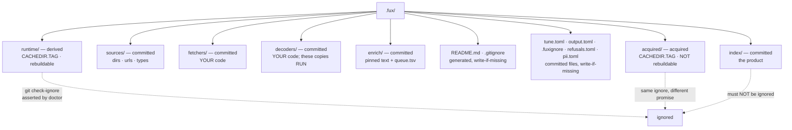

# SR-DOTFUX — the `.fux/` directory

## §1 — For humans

`.fux/` holds three kinds of thing that must never be confused. The index is
**committed** — it is the product, and it belongs in git. The accelerator is
**derived** — delete it any time, `fux build` brings it back. The fetched source
bytes are **acquired** — ignored like derived, and *not* rebuildable: only
re-acquirable, and only while the source still exists and the session that
reached it still holds ([SR-ACQUIRED](0145_acquired-plane.md)).

The third kind is not a subdivision of the second, and the distinction is the
whole reason it has a name. `runtime/` is defined by *"`fux build` can
reconstruct this"*. Nothing can reconstruct a blob whose source has gone.

The failure mode this layout exists to prevent is not exotic. Put both under
one dotdir and a single `.gitignore` line reading `.fux/*` quietly drops your
committed index from version control. Nothing errors. You find out when a
colleague clones the repo and the index is empty.

So: **every child is declared**, the generated `.gitignore` lists the ignored
directories by name and never a wildcard, and `fux doctor` asserts with git
itself that the index is not ignored.

**Diagram — Mermaid and its ASCII twin. Update both, always, together.**



<details>
<summary><b>ASCII twin</b> — the same diagram, for terminals, diffs, and any reader without a Mermaid renderer</summary>

```text
  .fux/
    |
    +-- index/        COMMITTED   the product; not rebuildable from anything
    +-- sources/      COMMITTED   dirs . urls . types, one entry per line
    +-- fetchers/     COMMITTED   your code, fux never rewrites it
    +-- decoders/     COMMITTED   your code; THESE COPIES RUN, not the package's
    +-- enrich/       COMMITTED   pinned enrichment text + queue.tsv
    +-- tune.toml     COMMITTED   how results are ORDERED, + [index] (write-if-missing)
    +-- output.toml   COMMITTED   how a result is SHOWN (write-if-missing)
    +-- .fuxignore    COMMITTED   what is NOT indexed, .gitignore's grammar
    +-- refusals.toml COMMITTED   what a REFUSAL looks like here (SR-REFUSAL)
    +-- pii.toml      COMMITTED   what is REDACTED from the index; REQUIRED (SR-PII)
    +-- README.md     COMMITTED   the declaration table (write-if-missing)
    +-- .gitignore    COMMITTED   names ignored dirs; NEVER `*`
    |
    +-- runtime/      derived     accelerator segments  [CACHEDIR.TAG]
    |   +-- fetch-cache/          the TTL fetch cache, nested here
    |
    +-- acquired/     ACQUIRED    the bytes a fetch returned  [CACHEDIR.TAG]
        +-- objects/<xx>/<sha><ext>
        +-- manifest.json         url -> sha, advisory and gitignored

   Both bottom two are gitignored. Only `runtime/` can be rebuilt.
   `fux doctor` runs `git check-ignore` and fails if index/ is ignored.
```

</details>

### Examples

What `fux ingest` generates, and the two files that make the layout checkable:

```console
$ find .fux -maxdepth 2 -type d | sort
.fux
.fux/acquired
.fux/acquired/objects
.fux/fetchers
.fux/index
.fux/runtime
.fux/runtime/postings
.fux/sources

$ cat .fux/.gitignore
# Gitignored planes, BY NAME. NEVER add `*` here: `.fux/index/`,
# `.fux/sources/`, `.fux/fetchers/` and `.fux/decoders/` are committed,
# and a blanket ignore would drop them from git silently. `fux doctor`
# checks exactly that.
#
# `runtime/` is DERIVED: rebuildable from the committed index by
# `fux build`. `acquired/` is not -- it holds the bytes a fetch actually
# returned, which can only be re-acquired while the source is still
# reachable. Both are ignored; only one can be regenerated.
runtime/
acquired/
```

The check that matters is against git itself, not the file's text:

```console
$ fux doctor
[OK] index not gitignored: the committed index is tracked
[OK] .fux/ layout declared: every entry is declared
```

---

## §2 — For agents

### Context

`.fux/` accumulates planes: the committed index, the source lists, the consumer
fetchers and decoders, the runtime accelerator, a TTL fetch cache nested inside
it, and now the retained source bytes. Nothing declared which of them git should
carry.

The hazard is asymmetric. A derived directory accidentally committed is noise
someone notices. A **committed directory accidentally ignored is silent data
loss** — and this repo's own `.gitignore` once carried a `.fux/*` blanket that
would have eaten `sources/` and `fetchers/` without a word.

An ignore rule is also the kind of thing a reviewer's eye slides over. It has to
be a machine's job.


### Amendment 2026-09-12 — the generated README is also the onboarding document

**What changed.** `_readme()` in [`fuxdir.py`](../src/fux/store/fuxdir.py)
emitted only the declaration table, the fetcher note and the rules. It now
appends four sections after them: **What fux is**, **The commands** (the SR-CLI
group table), **Calling fux from a script, in any language**, and **For an AI
agent**. Arpit's instruction, 2026-09-12.

**Why the README and not the docs site.** This file is the one piece of fux
prose that **arrives inside the consumer's repo and is committed there**. A
teammate who opens `.fux/` to find out what these directories are is the same
person who wants to know what the tool does and how to call it from a script,
and they are already looking at the only fux document their clone contains.

**The scripting section states the integration contract, which had no home:**

- `--json` on every read verb; **never parse the prose output**.
- Exit codes `0` / `1` / `2` / `130`, errors on stderr as `error: <message>`.
- Read paths are offline and deterministic, so a call is safe in a loop.

**There is deliberately no SDK**, and the README says so: fux is a process that
reads files, writes stdout and exits. Worked examples ship for shell, Python,
Node and Go, plus the two agent routes (`fux mcp`, or the installed skills).
**A binding would be a second surface to version**, and the CLI contract is
already frozen by [SR-CLI](0101_cli-surface.md).

⚠ **Three constraints the amendment does not relax.**

1. **Still ASCII-only** — `ensure_layout` writes with `.encode("ascii")` and a
   single em-dash fails the write on a Windows console. Every added line was
   checked against that encode.
2. **Still write-if-missing.** A consumer who annotated their README keeps it
   and will never see these sections. **That is the correct trade** — decision 1
   makes the file theirs — but it means the new content reaches existing repos
   only when someone deletes the file, and nothing prompts them to.
3. **The table is still generated from the four dicts.** The new prose is
   static text appended after it; it states no per-entry fact that could drift
   from `COMMITTED` / `DERIVED` / `ACQUIRED`.

⚠ **The one thing now at risk of drift:** the verb-group table duplicates
SR-CLI §1. If a verb group changes there, this README is a second place to fix,
and nothing checks it. Named here rather than left to be discovered.

### Decision

**1. Every child of `.fux/` is declared committed, derived or acquired**, in a
table in the generated `.fux/README.md`. Undeclared entries are a `fux doctor`
warning, not a shrug.

⚠ **A third kind was added rather than a second gitignore line**, and the
argument is one property: `runtime/` *means* rebuildable, and an acquired blob
is not. Filing it under `DERIVED` would make the generated README tell a reader
`rm -rf` is safe when it is not, and the README is generated precisely so that
nobody has to remember which directories are which. See
[SR-ACQUIRED](0145_acquired-plane.md) decision 1.

**2. The declaration, in full.** It is generated from
[`fuxdir.py`](../src/fux/store/fuxdir.py)'s `COMMITTED`, `COMMITTED_FILES`,
`DERIVED`, `ACQUIRED` and `GENERATED_FILES` — that module is the source, this
table is the reasoning.

| entry | kind | what it is, and why that kind |
|---|---|---|
| `index/` | committed | the product; nothing can recompute it |
| `sources/` | committed | `dirs` · `urls`, one entry per line, on the one grammar in [SR-URL-LIST](0116_url-list.md). ⚠ **`types` lived here until 2026-09-11** and is `formats.toml` now (the row below) |
| `formats.toml` | committed | which files are documents and which decoder reads each extension — `include` plus `[decoders]` ([SR-TYPES](0128_types-list.md) decisions 11–12). **Optional**: absent means the built-in default. Write-if-missing — a repo that already has the file keeps it, bindings and all; a repo with only the old `sources/types` has it **converted** by `fux setup`, never rewritten in place |
| `fetchers/` | committed | consumer code — decision 4 |
| `decoders/` | committed | consumer code — decision 5 |
| `enrich/` | committed | pinned enrichment text, one file per **source content sha**, plus `queue.tsv`. It cannot be re-derived: a model wrote it, in an agent, once, and [SR-ENRICH](0137_enrich.md) decision 1 refuses to call one. Committed also means **every clone has identical coverage**, so L3 holds with a wider input rather than a weaker property. Keying by source sha means editing a document orphans its enrichment automatically — staleness is structural rather than a check someone has to remember |
| `tune.toml` | committed | how results are **ordered** — plus `[index]` (`max_phrases`, `max_table_rows`), the one table that changes what is indexed ([SR-TUNE](0135_tuning.md) decision 13, 2026-09-11). A preference that does not travel with the clone is not one: two clones would rank the same corpus differently, which is the surprise this split exists to remove |
| `.fuxignore` | committed | what is **not** indexed, in `.gitignore`'s grammar — the one home for exclusion, read before the source lists and outranking them in both directions ([SR-FUXIGNORE](0144_fuxignore.md)). Committed for the same reason `tune.toml` is: a corpus that differed by clone is the surprise this split removes. Written header-only by `fux setup`. ⚠ **`fux ingest` REWRITES two delimited blocks at its top** — the not-indexed and skipped lists ([SR-FUXIGNORE](0144_fuxignore.md) decision 11), sorted, wall-clock-free, whole rather than appended, and **above every hand-written line** so a human's `!` always wins. This row said *never rewritten* until 2026-09-12 (W-140 row 8); it is the one committed file under `.fux/` that a verb edits, which is exactly the fact a reader of this table needs |
| `README.md` · `.gitignore` | committed | generated, write-if-missing |
| `node/` | committed | the **vendored Node read plane** ([SR-NODE-SEARCH](0153_node-search.md)), as **BUILD OUTPUT** — [L10](0011_LAW-10-bundled-output.md). **Two shapes, and `fux setup` decides which:** **A** (the default) is four files — the bundled `fux.mjs`, `package.json`, `mcp-tools.json`, `README.md`, **244 KB**, offline; **C** (a monorepo, auto-detected) is `package.json` alone, declaring `fux-engine@<version>`, with the reader installed into `node/node_modules/`. **Overwritten on a version or shape difference, and PRUNED**: an upgrade deletes whatever the previous engine left, `node_modules/` excepted. ⚠ **It was 47 files / 223 KB of fux's own module tree until 2026-09-12** — the measurement that produced the ruling, kept because this row claiming *"no build step"* and *"196 KB"* while both had moved is exactly the drift L10's §Context describes. Committed because the audience is a host with **no Python**: a gitignored copy could only be regenerated by the interpreter that is, by construction, not there, so gitignoring it withholds the file from exactly the person it is for — and it is still smaller than the `decoders/` Python committed beside it |
| `fux` | committed | a small `/bin/sh` shim — `.fux/fux find rollback` in a clone with nothing installed, mode `0755`. **It RESOLVES the reader in three rungs** since 2026-09-12 ([SR-NODE-SEARCH](0153_node-search.md) decision 16): the vendored bundle (`node .fux/node/fux.mjs`), then this member's `node_modules/.bin/fux`, then every ancestor's — because npm, yarn 1 and Berry-with-`node-modules` hoist that bin to the workspace root and **pnpm and bun do not** ([measured](../work/regression/2026-09-12-workspace-dotpath-probe/report.md), [Berry](../work/regression/2026-09-12-yarn-berry-probe/report.md)). **It is the one entry point correct in every shape, and the only one a README may name** |
| `refusals.toml` | committed | what a **refusal** looks like in this organisation — the sign-in walls, paywalls and viewer shells a server returns instead of the document ([SR-REFUSAL](0146_refusals.md)). Consumer-owned and additive; the engine ships no vendor knowledge, and the always-on magic-byte floor is not configurable from it. Committed because *"what does a login page look like here"* is a team fact, exactly like `.fuxignore` |
| `pii.toml` | committed | what is **redacted** from the committed index and nowhere else ([SR-PII](0148_pii.md)). Written by `fux setup` from the starter, never rewritten — and **the one consumer file that is required**: every command refuses in a repo without it (SR-PII decision 17) |
| `runtime/` | **derived** | accelerator segments, the fetch cache at `runtime/fetch-cache/`, the write lock, the URL counters, the skip ledger, and `enrich-progress.tsv` — which machine has handled which queued document, **local by design** so two people's progress cannot conflict on a pull |
| `acquired/` | **acquired** | the bytes a fetch returned, for URLs whose line says `keep=true` — `objects/<sha[:2]>/<sha><ext>` plus an advisory `manifest.json`. Ignored and `CACHEDIR.TAG`-tagged like derived, and **not rebuildable**: `fux build` cannot produce it, only a re-fetch against a source that still exists. It is what lets an offline citation say `as-ingested` instead of `unverified` ([SR-URL-FRESHNESS](0147_url-freshness.md)), and it is bounded and evicted rather than unbounded |

⚠ **`COMMITTED_FILES` exists because its absence was a live defect.** `DECLARED`
was built from committed *directories* only, so a committed **file** had no row
anywhere and `fux doctor` reported it as undeclared — this record's veto
condition 1, firing, on `tune.toml` and `.fux/enrich/` at once. Found by
checking the claim rather than asserting it. **`.fuxignore` got its row in the
change that introduced it**, which is what the table is for.

**3. The generated `.gitignore` names the ignored directories and never a
wildcard.** `runtime/` and `acquired/`, one line each, with the header saying
which is rebuildable and which is not. A `*` in that file is a defect regardless
of what follows it. One directory-level rule per plane is also why a new file
under either needs no new ignore line.

⚠ **`acquired/` being gitignored is checked by machine, not trusted to a
reader.** It holds source content — bytes fetched out of somebody's document
system — and a repo that committed it would be publishing them. `fux doctor`
fails as an **error**, not a warning, when `.fux/acquired/` is not ignored; it
is the one acquired-plane check that is not merely informational.

**4. `fux doctor` asserts the ignore rule against git**, not against the file's
text — `git check-ignore` on the index path. The check is of the *effective*
state, which is the only state that matters.

**5. Every gitignored plane carries `CACHEDIR.TAG`** — derived and acquired
alike
([bford.info/cachedir](https://bford.info/cachedir/)), so backup tools,
`tar --exclude-caches` and IDE indexers skip them without per-tool
configuration. See [SR-CACHEDIR-TAG](0121_cachedir-tag.md). ⚠ **For
`acquired/` the tag is doing more than saving disk**: keeping fetched source
bytes out of a backup is the same L2 concern that makes the gitignore an error
rather than a warning.

**6. Scaffolding has two moments. Everything in both is write-if-missing except one shape — see 6a.**
One generator doing both jobs is how a repo that wanted an index ends up
holding code.

| moment | writes | why |
|---|---|---|
| **`ensure_layout`**, at the head of every ingest | `.fux/README.md`, `.fux/.gitignore`, **`.fux/node/` + `.fux/fux`** — 🔴 **and NOTHING outside `.fux/`**: [SR-NODE-SEARCH](0153_node-search.md) decision 15 wires `.fux/node` into the consumer's root manifest, and **that edit belongs to `fux setup` alone**, precisely because this row's own rule is that a no-op ingest produces a no-op diff. ✅ **Structural since 2026-09-12, not a convention**: `detect_workspace`/`wire_workspace` live in `setup.py`, and `ensure_layout(root, node_shape=...)` takes the decided shape as a keyword it never computes — an ingest keeps whatever shape is already on disk and can flip nothing | **mandatory and idempotent** — a fresh clone must be correct before a byte is written into the directory. The reader is here rather than in `setup` for the same reason: a clone with no Python has to be able to read the index the first time anyone ingests, not only after someone remembers to run `setup` |
| **`fux setup`** | `fux.toml`, `sources/dirs`, `sources/urls`, `formats.toml`, `tune.toml`, `output.toml`, `.fuxignore`, `refusals.toml`, `pii.toml`, `fetchers/*.py`, `decoders/*.py`, the agent policy files, and the repo-root `AGENTS.md` under decision 9's conditions | **optional, explicit, once per repo** — a consumer asked for it |

**`ensure_layout` must never write a fetcher**, and nothing in either column is
ever overwritten: a consumer's annotations and edits survive every run.
`fux setup` is also the one verb permitted to run before a repo root exists,
because it is what writes the `fux.toml` that makes a directory a root.

⚠ **A change to a write-if-missing template reaches new repos only.** `fux
setup` never rewrites an existing file, so a corrected template does not reach
a repo that already has one — including this one. That is not a bug in the
promise: a rewrite would eat a consumer's annotations, the same reason `fux
tune` prints a specimen instead of editing `tune.toml`. **If a change must
reach existing repos, the mechanism is a loader refusal or a `doctor` check —
never a rewrite.** `fux setup`'s own `report.kept` is the evidence the file was
left alone.
⚠ **`pii.toml` is the worked case (2026-09-11).** The starter reaches an
existing repo through [SR-PII](0148_pii.md) decision 17's refusal, which names
`fux setup` — never by fux writing the file on its own. The list above had also
lost `output.toml`, `.fuxignore` and `refusals.toml`; restored in the same
change.

⚠ **A worked instance of that ⚠, 2026-08-27.** `sources/types` shipped as a
template of nothing but comments, and a types file with no live pattern is one
`read_types` refuses — so **`fux setup` followed by `fux ingest` failed on every
fresh repo** ([SR-TYPES](0128_types-list.md) decision 10, amended). The template
now writes the default out as live lines. Per this decision it reaches **new
repos only**, so every repo already holding the broken file — including this one
— is reached by a `doctor` check, `types list usable`, and not by a rewrite.
That is this ⚠ working as designed, not an exception to it.

⚠ **A third worked instance, 2026-09-11 — a file that MOVED.** The types list
left `sources/types` for `formats.toml` ([SR-TYPES](0128_types-list.md) decision
12). Every existing repo holds the old file, and this decision's two mechanisms
reach it: **a loader refusal** — `read_types`, `decode` and every `fux source`
verb stop on the old file and name the command — and **a `doctor` row**, `types
list usable`. The third move is `fux setup` writing the NEW file from the old
one when the new one is missing: **write-if-missing on a path that does not
exist yet, not a rewrite of one that does.** The old file is never touched; the
human deletes it.

⚠ **A second worked instance, 2026-08-28 — and this one had a measured cost.**
[SR-FETCHER](0117_fetcher.md) decisions 12–13 added two **optional** functions
to the fetcher contract, `validate()` and `is_rate_limited()`. The shipped
`fetchers/http.py` template implements both; per this decision the template
reaches **new repos only**, and a repo created before the change measured
**0 of 7** `validate()` tokens learned until its `http.py` was replaced by
hand. The mechanism is again a `doctor` check — `fetcher optional functions`
(`doctor._fetcher_capabilities`) — which names each missing function, the
record that added it, and what the repo forfeits.

**Two properties this check has that the `types` one does not, both forced by
what a fetcher is:**

1. **It reads the file as TEXT and never imports it.** `doctor` is offline by
   its module contract, and a consumer's fetcher is free to open a session or
   a connection at import time. A capability check that ran the code would
   break that guarantee to answer a question about the source.
2. **It is a warning that never fails the command.** The `types` case is an
   `error` because the file **stops `fux ingest`**; a fetcher missing an
   optional function is **correct and supported**, so failing on it would
   train people to ignore a red doctor.

**The gap is made visible, not closed.** The consumer still copies the function
in themselves — which is this decision holding, not an exception to it.

⚠ **A THIRD worked instance, 2026-08-28 — and this one had already broken
`main` before it was caught.** [SR-OUTPUT](0143_output-defaults.md) decision
19 made a missing `.fux/output.toml` a hard `FuxError` at load time. The file
is write-if-missing, so it reaches **new repos only** — which meant `fux ask`,
`fux find` **and `fux doctor`** all exited 1, after an upgrade, in **every repo
that predates the file**. 49 tests went red on `main`.

**This is the sharpest available reading of this ⚠.** The two mechanisms named
above are *a loader refusal or a `doctor` check*. Decision 19 chose the
refusal — and a loader refusal is legitimate **only when the thing refused is
something the repo can be told to fix while still being able to run the verb
that tells it.** A refusal in `load()`, which every verb calls, took out
`doctor` too: the check that would have named the fix could not execute.
SR-OUTPUT decision 20 ruled it back: a missing file resolves to the engine
defaults, and the repo is reached by `doctor`'s `output.toml present` row.

⚠ **The distinction this decision now carries explicitly, so the next record
does not have to rediscover it:** a **loader refusal** is the right mechanism
for a file that **exists and is wrong** — `types list usable`'s subject, where
running on would silently empty an index. A **`doctor` check** is the right
mechanism for a file that is **simply absent** — because absence is the
expected state of every repo older than the file, and there are always more of
those than there are new ones. Decision 19 applied the first mechanism to the
second situation.

⚠ **A FIFTH worked instance, 2026-09-11 — and this one is the ⚠ running
BACKWARDS, which is why it is recorded rather than assumed symmetric.** Every
instance above is a template that **gained** something a new repo gets and an
old one does not. Here the `fux.toml` template **lost** a table: `[decode]
max_table_rows` moved to `.fux/tune.toml [index]` on Arpit's ruling
([SR-TUNE](0135_tuning.md) decision 13, [SR-CONFIG](0113_config.md)
decision 10). `fux setup` never rewrites a `fux.toml`, so **every repo set up
between 2026-09-06 and 2026-09-11 still carries the table**, and nothing in this
directory will take it out.

**The mechanism is a loader refusal, and by this decision's own distinction that
is the right one:** the file **exists and is wrong** — `types list usable`'s
situation, not `output.toml`'s absence. Running on would honour a row limit no
decoder reads any more, which is a value its author believes is in force and is
not.

- ✅ **`fux doctor` still runs**, which is the property decision 19 lost and
  which had to be checked here rather than assumed. Verified 2026-09-11 on a
  scratch repo carrying `[decode] max_table_rows = 500`: `fux ingest` exits 1
  naming the move, and `fux doctor` completes every other row.
- ✅ **And `doctor` now NAMES it — fixed 2026-09-11**, in the change after the
  one that filed it. It used to degrade to `fetcher optional functions: skipped
  (no readable fux.toml)` and report that as `[OK]`, so a repo whose `fux.toml`
  refuses got a **green doctor beside a broken ingest** — the same shape as
  decision 19, one step milder: there the refusal took `doctor` out, here it
  left `doctor` running and uninformative. The fix is one row, `fux.toml loads`,
  at **error** level, printing the loader's own message verbatim
  ([SR-DOCTOR](0101_cli-surface.md) §`fux doctor`, which owns the row set).
- ⚠ **What made it invisible is worth more than the row.** No check was wrong.
  Each one deferred — *an unreadable `fux.toml` is `_repo_root`'s business*,
  *`_config`'s finding to report* — under the sound rule that a health command
  must not raise twice for one cause. **The finding evaporated because every
  check that saw it deferred to a check that did not exist.** So: whenever a
  check degrades to `skipped`, name the row that does fail. If none does, the
  degradation is a hole rather than politeness.

⚠ **A SIXTH worked instance, 2026-09-11, and it is the cheap shape.** The
`fux.toml` template gained a **commented** `#update = "auto"` block documenting
[SR-URL-LIST](0116_url-list.md) decision 14. Per this decision it reaches **new
repos only** — and here that costs nothing, because the key's default *is*
today's behaviour and an existing repo that never learns the key behaves
identically. **Contrast the fifth instance above**, where the template lost a
table that an old `fux.toml` still carried and a loader refusal was owed.
**The test is not "did the template change" but "can an old file now be
wrong?"** — a new key at the status-quo default cannot be, and a removed key
always is.

**6a. A FOURTH shape: committed, engine-owned, and OVERWRITTEN on a version
difference.** Added 2026-09-12 for [SR-NODE-SEARCH](0153_node-search.md) R2.

| shape | examples | rule |
|---|---|---|
| committed, **consumer-owned** | `fetchers/` `decoders/` `*.toml` | write-if-missing — a consumer's edit survives |
| committed, **engine-owned, annotatable** | `README.md` `.gitignore` | write-if-missing — a consumer annotates them |
| committed, **engine-owned, vendored** | **`node/`**, **`fux`** | **overwritten on a version OR SHAPE difference, and pruned** ← the prune landed 2026-09-12 with L10 |
| derived / acquired | `runtime/` `acquired/` | gitignored |

**Why the first three shapes were not enough.** Write-if-missing protects a
consumer's edit. **Nobody edits a vendored reader**, so there is no edit to
protect — and a stale one is not an old preference, it is a **wrong answer**: a
reader from before a `_format` bump either refuses the shards or, worse,
misreads them.

🔴 **The evidence is in this repository, and it already cost something.**
`decoders/` is write-if-missing, and the `doc`-suffix rename
(`csvdoc` → `csv`, 2026-09-06) shipped **with no migration**: a repo set up
before it still holds stale `<name>doc.py` files that claim the same extensions
and **win**. `tests/test_orphaned_modules.py` catches the shipped half and
nothing reaches a consumer's directory. Same mechanism, worse outcome.

**The payoff is structural.** The copy in `.fux/` is always written by the
Python that wrote the index, so **a `_format` mismatch cannot happen** — which
is strictly stronger than npm, where a consumer picks versions independently.

⚠ **Overwriting is conditional on the version, never unconditional.** This
directory is COMMITTED and `ensure_layout` runs at the head of **every ingest**,
so a no-op ingest has to produce a no-op diff. `ensure_node_reader` compares
`.fux/node/package.json`'s `version` against `fux.__version__` — **and, since
2026-09-12, its SHAPE against the declared one** — and returns immediately when
both match. `fux doctor`'s `node reader` row reports the drift it can still
see, which now includes a stale `src/` tree and a shape-C manifest with nothing
installed behind it.

⚠ **The trigger is version OR shape OR layout**, and the third clause is not
tidiness: gating on the version alone left this repository's own `.fux/node/`
holding 44 stale modules *after* the code that removes them had landed, because
the stale directory was written by the same version. `_layout_is_stale` compares
the names present against the names the declared shape should hold — no bundle
is built to answer it, so it is free on the ingest path.

⚠ **And when it does rewrite, it PRUNES.** Before 2026-09-12 it wrote the new
files and deleted none, so a repository that had ever run `fux setup` kept every
file a previous engine put there — 37 to 47 stale `.mjs` modules, which is what
made [L10](0011_LAW-10-bundled-output.md)'s *"a local edit is invisible"* a live
exposure rather than a hypothetical. `_prune_node_reader` deletes everything the
declared shape does not name, **`node_modules/` excepted**: that holds shape C's
installed reader, and removing it would leave a manifest pointing at nothing.

**7. `fetchers/` is consumer code and fux never rewrites it.** It is loaded by
path, and only under the two fenced paths — `fux add <URL>` and `fux update`.
The two files fux can put there ship as package data with an extension Python's
import machinery cannot resolve, so **fux copies them and never imports them**
([SR-FETCHER](0117_fetcher.md) decision 1). One known consequence, accepted:
linters that skip hidden directories by default (ruff does) will not lint them.

**8. `decoders/` is consumer code too, and the copies are what run.** `fux
setup` writes all seventeen built-in decoders there, write-if-missing, and **the
modules inside the installed package are not consulted while a copy exists** —
so a consumer invited to override a decoder can read the ones they are
overriding, in their own repo.

**It follows `fetchers/`'s ownership model and not its packaging model.** A
fetcher ships as `templates/*.py.txt` because it carries network code that must
not be importable inside an offline package
([SR-CDP-FETCHER](0118_cdp-fetcher.md) decision 8). A decoder is stdlib-only
and offline, so it is already a legitimate module: **the module is the
template**, copied out verbatim, and there is exactly one copy of every decoder
in the repo rather than two that agree by habit. Three consequences that bite if
forgotten:

1. ⚠ **After setup, `src/fux/decode/` does not execute in that repo.** Engine
   upgrades do not reach a consumer's decoders; they re-run `fux setup` after
   deleting the file they want refreshed. This was ruled with the cost on the
   table — the alternative (copies inert until edited) was declined.
2. **A deleted copy restores the built-in.** `rm .fux/decoders/pdf.py` must
   not silently stop indexing PDFs, which looks exactly like a corpus with no
   PDFs in it.
3. **It is committed and must never be gitignored** — sixteen files a consumer
   owns, dropped out of git without a word, is precisely what
   `.fux/.gitignore`'s own comment warns about.

**9. `fux setup` writes outside `.fux/`, and every such path is announced.**
The scaffolding contract had one boundary — *fux writes into its own directory
and `fux.toml`, and nowhere else* — and
[SR-AGENT-POLICY](0132_agent-policy.md) decisions 5 and 6 widen it: `setup`
also writes agent-policy renderings into `.claude/`, `.codex/`, `.github/` and
`.kiro/`, directories **Anthropic, OpenAI, GitHub and AWS own** — `.codex/`
since 2026-09-06 ([SR-AGENT-POLICY](0132_agent-policy.md) decision 11). Everything else about the
contract is unchanged — write-if-missing, and the same read-never-import
discipline the fetchers use.

**The boundary did not disappear, it acquired a safeguard.** Because the
install is default-on, `SetupReport` carries an `outside` list and `cmd_setup`
prints every path it wrote beyond `.fux/` along with how to turn them off. A
write that does not appear in that announcement is SR-AGENT-POLICY's veto
condition 1, and `tests/test_setup_agents.py` asserts both halves. ⚠ **Two
renderings are ambient** — Copilot's `applyTo: "**"` and Kiro's
`inclusion: always` enter *every* request in the consumer's repository,
including for developers not using fux. That cost is stated rather than
discovered, and the renderings are size-bounded by a test.

⚠ **And the repo-root `AGENTS.md` is now written on a second condition, which
is a scaffolding fact and belongs here.** It was written only for a full
install; since 2026-09-06 it is *also* written whenever a vendor in
`setup.AGENTS_MD_VENDORS` installs — today, `codex` alone
([SR-AGENT-POLICY](0132_agent-policy.md) decision 12). **A vendor whose only
always-on surface is that file must not be able to opt into skills and out of
the policy by narrowing one config line.**

⚠ **`.github/skills/` joined the outside set on 2026-09-06**
([SR-AGENT-POLICY](0132_agent-policy.md) decision 14). It is a *fourth*
directory under `.github/`, not a fourth vendor — the announcement contract and
`report.outside` are unchanged, and `test_optout_flag_leaves_no_vendor_directory_behind`
already covers it, because it checks the vendor root.

⚠ **`.github/skills/` and `.codex/` left the outside set on 2026-09-12, and
`.agents/skills/` replaced both** ([SR-AGENT-POLICY](0132_agent-policy.md)
decision 16, W-141). Codex and Copilot now share one directory, so the set
shrank from eighty-four files to seventy-one. **Two scaffolding facts change
with it:**

- **A path two vendors name is written, and announced, once** — `_write_agents`
  skips a path an earlier vendor wrote in the same run.
- **`.agents/` is a vendor root no single vendor owns**, and the opt-out test
  checks it beside the other four.
- ⚠ **`fux setup` never deletes**, so a repository set up before this keeps its
  old `.codex/skills/` and `.github/skills/` until the consumer removes them.

⚠ **`.claude/rules/` joined the outside set on 2026-09-11, and the set grew from
eighteen files to eighty-four** ([SR-AGENT-POLICY](0132_agent-policy.md) decision
15): ten guide skills on four surfaces, seven path-scoped pointers on three
vendors, and five Kiro auto guides, beside the existing seventeen vendor files
and `AGENTS.md`. Still write-if-missing, still announced
path by path, still one `--no-agents` away. ⚠ **The announcement is now long**
— that is the contract working, not a defect: veto condition 1 is *every* path
named. **The ambient cost moved too**: on a Kiro CLI without inclusion modes the
twelve new steering files are always-on, which SR-AGENT-POLICY decision 15c
states and bounds.

**10. `doctor` reports, and never repairs.** Every check returns
`Check(ok, level, name, detail)` and `--json` carries them. Three properties
this record binds:

- **Read-only, always.** A stale runner lock is named along with the command
  that clears it; `doctor` never clears it
  ([SR-MAINTENANCE](0129_hooks.md) veto 7). A pending re-index is a
  **warning** — it is the deferring hook working, not a broken repository.
- **Offline, always.** The URL section reports how many `url:` records exist,
  how many the last networked run confirmed, how many have never been
  re-fetched since first ingest, and how many are failing — naming any that
  have failed `FAILING_STREAK` runs in a row. Every number comes from the
  committed index and the gitignored counters under `runtime/`. It **never
  fetches**, and it **never deletes**: [SR-URL-INGEST](0107_url-ingest.md)
  decision 4 forbids treating a failed fetch as a deletion, and the cost of
  that rule is a permanently dead URL living in the index forever. This makes
  the cost legible instead of invisible.
- ⚠ **It reports the concurrency POLICY and refuses to compute the effective
  value.** The effective bound is `min(configured, declared)`; `declared` lives
  in a **consumer-owned Python file**, so reading it means importing it, and
  importing it runs whatever sits at that file's module level. **`doctor` is
  the command a person runs when something is already wrong** — it must stay
  out of the business of executing consumer code. It names the `min(...)` rule
  and leaves `fux update` to apply it. `tests/test_doctor.py` plants a fetcher
  whose module body raises and asserts the check still returns.

⚠ **`doctor.py` renders another plane's state and that is deliberate.** The
runner's status is computed in `maintain/runner.py::status()`, which
[SR-MAINTENANCE](0129_hooks.md) owns. A check that *formats* another plane's
state is this record's shape doing its job; a check that **decided** anything
about the runner would belong next door.

⚠ **`fux doctor` gained a `url daemon` check on 2026-08-28.** It reports the
resident clock's last sweep, and the case it exists for is `outcome: "ok"` with
`skipped > 0` — a sweep that looked healthy and did not index everything. **A
daemon that never ran is not a finding**: a check that fires for every repo is
one people learn to skip. See [SR-MAINTENANCE](0129_hooks.md) decision 12.

⚠ **A SIXTH `doctor` row class, 2026-09-11 (W-126 part B): `ranking priors`.**
Four ranking mechanisms — the archived demotion, the supersession demotion, the
proximity reranker and the recency decay — are **built, wired, and shipped at a
value that makes each return the score unchanged**. A repo that declares
`archived=true` or writes `supersedes:` gets nothing for it and **was not
told**. On fux's own corpus the row reads *391 document(s) declared
archived=true* against `archived_weight=1`.

**It is decision 10's first clause — `doctor` reports, and never repairs — in
its sharpest form**, because here the repair is *available, one line away, and
still refused*:

- **It names the count of documents each dead prior WOULD have acted on.** A
  knob that is off over 0 archived documents and one that is off over 391 are
  different findings, and a flat list of defaults cannot tell them apart.
- 🔴 **The row listed FOUR priors until 2026-09-13 and now lists ONE.** All
  three DOCUMENT priors — `superseded_weight`, `archived_weight`,
  `recency_half_life_days` — were removed rather than tuned (SR-TUNE decision
  15). **That is this row working, not this row weakening:** it made three dead
  knobs visible, a measurement then showed no global value sets any of them
  correctly, and they were closed. `rerank_weight` is what is left, and its
  question is cost rather than which value.
- 🔴 **It refuses to recommend a value**, and that refusal is test-bound
  (`test_it_refuses_to_recommend_a_value`). The only such change ever measured
  — `superseded_weight` at `0.5` — **fixed two queries and broke two**, and
  every broken one had the superseded document as its correct answer. A
  `doctor` row saying *"try 0.5"* would have handed out the exact change a
  frozen pre-registration already failed; in the end the knob was deleted
  rather than given a number.
- **A warning, never an error**, by this decision's second property: shipping
  at a default is not a broken install.

⚠ **A FOURTH worked instance, 2026-09-05 (W-101) — and this one is not about a
file reaching old repos.** Four things were reachable only from inside a run
that had already finished, and one was reachable from nowhere at all:

| what `doctor` gained | why it could not be seen before |
|---|---|
| `refusal rules` | a refusal count lived in one run's stderr; a rule matching everything empties the `url:` half of the corpus and leaves it looking like a corpus nobody ingested — [SR-REFUSAL](0146_refusals.md) decision 11 |
| `decoder bindings` | `registry()` refuses a broken `decoder=` binding **on the next ingest**; and a binding on an extension no document has resolves perfectly and indexes nothing forever, which is deliberately not an ingest error — [SR-DECODE](0139_decode.md) |
| `recency prior` | a corpus copied out of its git repository loses **every** `mtime`, so the whole recency prior switches off with nothing anywhere saying so |
| `freshness verdicts` | the `as-ingested` share is the **veto check** of two accepted records ([SR-ACQUIRED](0145_acquired-plane.md), [SR-URL-FRESHNESS](0147_url-freshness.md)) and neither veto could be run at all |
| redaction counts, on `pii rules` | `redact()` returned them, `run()` summed them, and nothing read the sum — [SR-PII](0148_pii.md) decision 15 |

**Three properties they share, and each is a rule this record already held:**

1. **Offline and read-only, without exception.** Two of them report on the
   networked plane and neither opens a socket: they read `url-state.json` and
   the committed index. `doctor` reports what a networked run *recorded*, and
   says that is what it is doing.
2. **A warning, never an error, wherever the finding is about the world.** A
   dead URL, a refused sign-in wall, a corpus with no git history and a share
   past a veto are all facts outside the repo. Failing on them trains people to
   ignore a red doctor, which decision 2's second property already argued.
3. ⚠ **A check that fires on a healthy repo is a check people learn to skip.**
   `decoder bindings` is the worked example: `fux setup` writes the entire
   built-in binding table, so on a corpus of markdown **27 of 36 bindings match
   no document** — every one correct, none of them news. Only a binding that
   differs from the built-in default for its extension is a line somebody
   typed, and that is the only place a typo can be.

**`.fux/.gitignore` carries a FOURTH kind of line: `__pycache__/`** (W-140
row 18, 2026-09-11). It is not a plane and never will be — it is CPython's
litter beside the modules `fux setup` writes into `.fux/decoders/` and
`.fux/fetchers/`, which ingest imports on the first run.

- **A repo whose own `.gitignore` carries the Python line never saw it**, which
  is why it survived: every repo fux was developed in had one. A repo that does
  not gets untracked bytecode inside the directory fux has just told it to
  commit.
- **By NAME and as a directory**, never `*.py[co]` and never a wildcard — a
  consumer's decoder and fetcher are committed Python, and an ignore that
  reached them would drop the product from git silently. That is the rule at
  the top of this file, holding for a line that is not a plane.

**The starter `.fux/sources/urls` header is DERIVED from the list spec**, not
transcribed. It said *"Two attributes, and the set is closed"* while the spec
had grown to seven, and *"`fux update` re-fetches every line"*, which stopped
being true when narrow-by-default landed and again when `update=never` did.
Every repo set up in between committed both sentences. `_seed_types` already
had the rule this needed — *derived, never transcribed* — so the file cannot
disagree with the engine that wrote it.

**`fux setup` announces a hand-written `AGENTS.md`, not its own.** The
announcement fires on a file fux did not write; it read *kept* instead, so
every run after the first re-printed the entire template at a file fux had
written, which already says what the note says is missing. The policy marker
decides it now — the same marker `tests/test_agent_policy_agreement.py`
compares on, so the two cannot disagree about what *fux's policy is in this
file* means.

### Amendment 2026-09-12 — the code for two decisions landed two commits late

**What happened.** `setup.py`'s move to the shared `.agents/skills/`
([SR-AGENT-POLICY](0132_agent-policy.md) decision 16, above) and
`store/fuxdir.py`'s Node vendoring — `ensure_node_reader`, `node_version`,
`_node_source`, `_packaged_node_files`, owned in the narrow by
[SR-NODE-SEARCH](0153_node-search.md) — were recorded in `24c0a3d` and
`6f518c6` while both files were deliberately held out of those commits. The code
lands here.

**Why it is written down.** For two commits this record described a `.fux/`
generator and a skill surface the package did not yet produce.
[SR-CONFIG](0113_config.md), after its decision 15, carries the general form:
a record ahead of its code is as misleading as one behind it, and the freshness
check can see neither.

### Consequences

- **The dotdir is safe to explain in one table.** A newcomer's first question —
  "what do I commit?" — is answered by a file fux generates.
- **Derived planes are disposable by contract.** `rm -rf .fux/runtime` is
  always safe; that property is what lets the accelerator be aggressive, and it
  costs at most one repeat of the skip list.
- ⚠ **The acquired plane is NOT disposable, and the dotdir no longer has a
  uniform answer to "can I delete this?"** `rm -rf .fux/acquired` loses the only
  local copy of bytes that may not be re-fetchable, and the loss is silent — the
  next `fux ask` simply degrades from `as-ingested` to `unverified`. Three
  things make the cost legible rather than discovered: the kind column in the
  generated README, the `.gitignore` header, and `fux doctor` reporting the
  plane's size and blob count. **A fourth is deliberately absent:** nothing
  stops you deleting it. It is a cache in the sense that the repo still works
  without it.
- **`doctor` gains a hard dependency on git** for the ignore check. Acceptable:
  the committed index's premise is that git carries it.
- ⚠ **`doctor` now parses the committed index**, which it never used to. Three
  checks need per-record fields, so `_records()` reads it **once per `run()`**
  and hands the same dict to all of them — a 10 000-document corpus parsed
  three times is a diagnostic command that feels broken. It degrades to `{}` on
  any failure: an unreadable index is another check's finding, and a traceback
  out of a health command is the worst possible answer to *"what is wrong"*.
- ⚠ **Two of the new checks report on the PAST, not on now.** `refusal rules`
  and `freshness verdicts` read counters that networked runs and journalled
  answers wrote. A repo that has never run `fux update`, or never passed
  `--journal`, is told it has **no data** — never shown a zero it would read as
  *"nothing was refused"* or *"nothing was as-ingested"*.
- **A committed file needs a row in `COMMITTED_FILES`, not just a mention
  here.** The veto below is what catches a decision recorded in prose and not
  in the generator.
- ⚠ **The prose the generator writes ABOVE the table is not generated**, and it
  lagged the third kind by a day: the table grew an `acquired` row while the
  paragraph above it still said every child is *"committed or derived"*. It was
  a true table under a false sentence, which is the failure mode this record's
  own template rules exist to prevent, arriving in generated output instead of
  in a record. Both halves now come from the same change.
- **Nothing in `tune.toml` outside `[index]` reaches the maintenance path.**
  `ingest`, `build` and the hooks read no ranking key. `[index]` is read by
  ingest, so that committed table IS inside the byte-identity argument L3 rests
  on — as `fux.toml` already was. `fux setup`'s `fux.toml` template lost its
  `[decode]` table and the tune.toml specimen gained `[index]` in the same
  change ([SR-TUNE](0135_tuning.md) decision 13).

### Alternatives considered

- **Two top-level directories** — `.fux/` committed, `.fux-cache/` derived.
  Rejected: two dotdirs to explain, two to configure in every tool, and the
  ignore rule becomes a path prefix that is just as easy to get wrong.
- **Ignore nothing; commit the accelerator too.** Rejected: the accelerator is
  large, changes on every ingest, and is a pure function of committed bytes.
  Committing it doubles diff noise to store what a command regenerates.
- **Filing `acquired/` under `DERIVED`.** One line, no new concept, and the
  ignore rule would have been identical. Rejected under decision 1: the two
  words carry different promises to a reader deciding whether to delete
  something, and the generated README is where that promise is made.
- **A separate `.fux-cache/` for the fetched bytes.** Rejected for the same
  reason as the two-top-level-directory option below, plus one of its own: a
  path outside `.fux/` is outside every check in this record.
- **Rely on documentation for the ignore rule.** Rejected on evidence — the
  blanket `.fux/*` rule was already in this repo, written by someone who had
  read the documentation.
- **A wildcard with negations** (`.fux/*` then `!.fux/index/`). Rejected: git's
  negation rules do not re-include files under an excluded *directory*, which
  is exactly the trap, and the correct form is subtle enough that the next
  editor will break it.
- **Decoder copies inert until edited.** Rejected under decision 8, with the
  upgrade cost on the table: a consumer reading `.fux/decoders/pdf.py` and
  finding it is not the code that ran is a worse surprise than an upgrade that
  needs a deliberate refresh.

**The generated `fux.toml` shows `[sources.url.config]` in its PER-FETCHER
form** (amended 2026-09-14). The commented specimen `fux setup` writes is
`[sources.url.config.cdp]` / `[sources.url.config.http]`, not a flat table with
`cdp_port` in it — because a scaffolded example is what a consumer uncomments,
and the flat form hands a Chrome-only key to `http.py`, which refuses keys it
does not know. The specimen was already commented out and so never broke a
generated repo; **fux's own `fux.toml` had it uncommented and did**, which is
how the defect reached a real corpus. See
[SR-FETCHER](0117_fetcher.md) decision 8 for the slicing rule itself — this
record owns only what the scaffold writes.

### Reference (required)

- The generator — [`src/fux/store/fuxdir.py`](../src/fux/store/fuxdir.py);
  the scaffolder — [`src/fux/setup.py`](../src/fux/setup.py); the checks —
  [`src/fux/doctor.py`](../src/fux/doctor.py).
- The generated layout, captured —
  [`work/regression/2026-08-18-ingest-and-index/`](../work/regression/2026-08-18-ingest-and-index/report.md) §1.
- The third category's own record — [SR-ACQUIRED](0145_acquired-plane.md), and the two records that consume it, [SR-REFUSAL](0146_refusals.md) and [SR-URL-FRESHNESS](0147_url-freshness.md)
- Cache-directory tagging — https://bford.info/cachedir/
- `gitignore` pattern semantics, including the directory-negation trap —
  https://git-scm.com/docs/gitignore


⚠ **2026-09-13:** every `subprocess` pipe under this record's components now names
`encoding="utf-8"` rather than inheriting the platform code page. Why, and what it
cost on Windows, is stated once in
[SR-T1-ACCELERATOR](0110_accelerator.md) decision 13.

### Veto condition

**Reopen this decision if** a child of `.fux/` exists that the README table does
not declare, if the effective ignore state stops matching the declaration, or if
a fourth kind is proposed. Three is already one more than a reader holds
comfortably; a fourth needs a property as sharp as *not rebuildable* was, and
must earn it against the alternative of a subdirectory.

**How to check it:**

```bash
# 1. every entry is declared (this is also what `fux doctor` reports)
fux doctor | grep 'layout declared'
# expect: [OK] .fux/ layout declared: every entry is declared

# 2. the ignore file is still narrow
grep -n '^\*\|/\*' .fux/.gitignore
# expect: no output — a wildcard here is the defect this record exists to stop

# 3. the committed index is genuinely tracked, per git itself
git check-ignore -v .fux/index/ ; echo "check-ignore exit=$?"
# expect: exit=1 (no match) — anything else means the index is being ignored

# 4. the acquired plane IS ignored — the inverse assertion, and an ERROR
git check-ignore -q .fux/acquired/ ; echo "check-ignore exit=$?"
# expect: exit=0 (matched). A non-match means fetched source bytes are
# staged for commit, which is why `fux doctor` fails rather than warns.
```

---

## References

*Every source this record cites, gathered in one place. §2's **Reference
(required)** names the grounding; this is the complete list. An archived
document is never listed here — the body may name one, but archive is not
evidence.*

**Records** — [SR-LAWS](0001_LAWS.md) · [SR-CLI](0101_cli-surface.md) ·
[SR-FUXIGNORE](0144_fuxignore.md) ·
[SR-URL-INGEST](0107_url-ingest.md) · [SR-CONFIG](0113_config.md) ·
[SR-URL-LIST](0116_url-list.md) · [SR-FETCHER](0117_fetcher.md) ·
[SR-CDP-FETCHER](0118_cdp-fetcher.md) ·
[SR-CACHEDIR-TAG](0121_cachedir-tag.md) · [SR-TYPES](0128_types-list.md) ·
[SR-MAINTENANCE](0129_hooks.md) · [SR-AGENT-POLICY](0132_agent-policy.md) ·
[SR-TUNE](0135_tuning.md) · [SR-ENRICH](0137_enrich.md) ·
[SR-DECODE](0139_decode.md) · [SR-ACQUIRED](0145_acquired-plane.md) ·
[SR-REFUSAL](0146_refusals.md) · [SR-URL-FRESHNESS](0147_url-freshness.md)

**Code**

- [`src/fux/doctor.py`](../src/fux/doctor.py)
- [`src/fux/setup.py`](../src/fux/setup.py)
- [`src/fux/store/fuxdir.py`](../src/fux/store/fuxdir.py)

**Measured evidence**

- [`work/regression/2026-08-18-ingest-and-index/report.md`](../work/regression/2026-08-18-ingest-and-index/report.md)

**Papers and specifications**

- `gitignore(5)` — pattern semantics, including the directory-negation trap
  <https://git-scm.com/docs/gitignore>
- The `CACHEDIR.TAG` specification — cache-directory tagging
  <https://bford.info/cachedir/>
