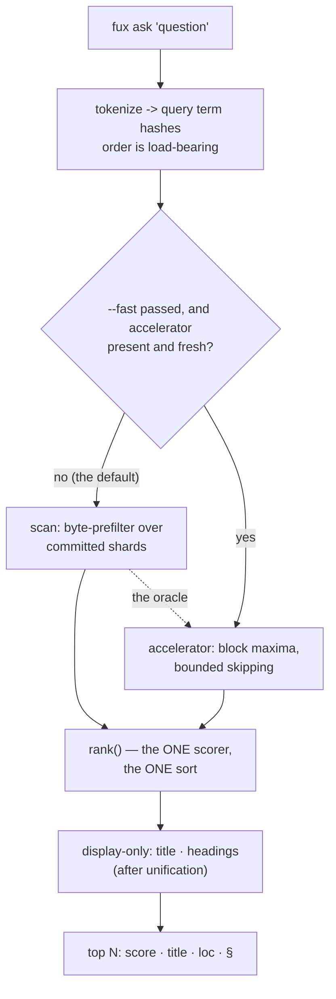

<!-- COMPONENTS-START — GENERATED from records/README.md's OWNERSHIP and DESCRIBES tables by scripts/gen-components.py. Do not edit by hand: change the table, then run `python scripts/gen-components.py --write`. -->

**Owns** — the components this record decides:

- [`node/src/query/compose.mjs`](../node/src/query/compose.mjs) · file
- [`node/src/query/headings.mjs`](../node/src/query/headings.mjs) · file
- [`node/src/query/run.mjs`](../node/src/query/run.mjs) · file
- [`node/src/query/scan.mjs`](../node/src/query/scan.mjs) · file
- [`node/src/verbs/answer.mjs`](../node/src/verbs/answer.mjs) · file
- [`node/src/verbs/ask.mjs`](../node/src/verbs/ask.mjs) · file
- [`node/src/verbs/find.mjs`](../node/src/verbs/find.mjs) · file
- [`src/fux/query/`](../src/fux/query) · dir

<!-- COMPONENTS-END -->

# SR-ASK — the `ask` verb

## §1 — For humans

`ask` is the verb agents call. Give it a question, get ranked documents with
scores and citations.

The design decision worth knowing is not about ranking quality. It is that
**two completely different machines can answer, and neither may change the
answer.** Every call is answered by the byte-prefilter scan over the committed
shards by default — no build step required. Passing `--fast` on a built repo
switches to the derived accelerator, which skips most of them. Same results,
byte for byte — including the low-order bits of every float in `--json`.

That is not achieved by being careful. Floating-point addition is not
associative, so a term-major accelerator that accumulated scores term-by-term
*would* differ from the doc-major scan in the last digits, and nothing would
look wrong. The fix is structural: **the accelerator produces candidates and
statistics, never scores.** Both paths hand the same candidate set to the same
`rank()`, which sums contributions in query-hash order exactly once.

So the differential law reduces to a claim a test can actually make: the
candidate sets and the corpus statistics are identical. Everything after that
is one code path.

**Diagram — Mermaid and its ASCII twin. Update both, always, together.**



<details>
<summary><b>ASCII twin</b> — the same diagram, for terminals, diffs, and any reader without a Mermaid renderer</summary>

```text
   fux ask "question"
          |
          v
   tokenize -> query term hashes        (order is load-bearing)
          |
          +-- --fast passed, and accelerator present and fresh? --no (default)--+
          |                                                                     |
         yes                                                                    v
          v                                    scan: byte-prefilter over
   accelerator: block maxima,                  committed shards
   bounded skipping                                           |
          |                                                   |
          +-------------------+-------------------------------+
                              v
                  rank()  -- the ONE scorer, the ONE sort
                              |
                              v
             display-only resolution: title, headings
                              |
                              v
                  top N:  score  title  (loc)  § heading

   The scan is the oracle. When the two disagree, the scan is right
   by definition -- which is why scoring lives in rank.py, shared.
```

</details>

### Examples

```console
$ fux ask "index format canonical" --top 3
4.0239  The committed index format  (docs/index-format.md)
0.6807  The refer plane  (docs/refer.md)
0.4647  Pruning was measured and failed  (docs/pruning.md)

$ fux ask "why did pruning fail" --explain
2.1973  Pruning was measured and failed  (docs/pruning.md)

[scan]

$ fux ask "why did pruning fail" --explain --fast
2.1973  Pruning was measured and failed  (docs/pruning.md)

[accelerator]
```

**A result also names the sections that match** (decision 8). Captured from
this repository, not typed:

```console
$ fux ask "definition of done" --top 3
5.0242  [archived] W-48 — three output-contract inconsistencies in the query verbs  (archive/open/W-48-query-output-contract.md)
        § Definition of done
5.0091  [archived] W-46 — a query verb crashed on a source install  (archive/open/W-46-hybrid-missing-model-crash.md)
        § Definition of done
5.0087  [archived] W-30 — Ratify SR-INGEST (ingest-mode naming)  (archive/open/W-30-ratify-adr-0001.md)
        § Definition of done
```

**`ask` is section-level; `answer` is line-level.** That is not a gap waiting
to be filled — a line range can only be computed on **fetched** bytes, and
`ask` is offline by default. A heading was committed at ingest and survives the
document being edited; a line range computed at ingest does not, and looks
exactly as right when it is wrong. Decision 8 carries the argument.

The law, demonstrated — two very different machines, identical bytes:

```console
$ diff <(fux ask "index format canonical" --json --top 5) \
       <(fux ask "index format canonical" --json --top 5 --fast) && echo IDENTICAL
IDENTICAL
```

---

## §2 — For agents

### Context

`ask` has to work in two situations that pull in opposite directions.

A **fresh clone** has committed shards and nothing else. It must answer without
a build step, or the "clone and ask" promise dies. That is the scan: read every
shard line as raw bytes, `json.loads` only the lines that pass a substring check
against the query's term hashes.

A **working repo** wants the accelerator — worst-case warm p95 of 27.2 ms on
8 870 RFCs against a 150 ms bar, where that same scan takes 4 248.8 ms.

Two implementations of one verb is where silent divergence lives. And a
retrieval engine that returns *slightly* different results depending on whether
someone ran `fux build` is worse than a slow one, because the difference is
invisible until it matters.

### Decision

**1. One scorer, one sort, one place.** `rank()` in `query/rank.py` is the only
code that computes a BM25F score, and both candidate generators call it and
nothing else.

**The scope of that claim is exact, and worth stating rather than inferring.**
This decision exists so the differential law has a subject: the arithmetic
turning a candidate into a BM25F score must happen **once, in one place, in one
order**, because floating-point addition is not associative and a second
implementation would differ in its low-order bits with nothing logically wrong.
A post-ranking stage that applies a **bounded multiplier to a finished score**
— the proximity reranker, [SR-RERANK](0138_rerank.md) — is not a second
opinion about how well a term matched, and it stays *inside* the law because it
is applied identically to whichever list `rank()` produced.

**2. The accelerator generates candidates and statistics, never scores.** This
is what makes the differential law testable rather than aspirational: the claim
becomes "the candidate set and `(n, total_flen, df)` are identical", and every
float after that comes from one code path in one order.

**2a. `total_wlen` is derived per query, never stored pre-weighted.**
`.fux/runtime/stats.json` stores `total_flen` — five raw per-field token-count
totals — and both generators weight it at query time. A pre-weighted total
would move `avg_wlen` on the scan path and not on the accelerator path the
moment a field weight became tunable, which is a differential-law break that a
rebuild would be needed to repair. The plane's side of it is
[SR-RUNTIME-STATS](0125_runtime-stats.md)'s.

**2b. `k1`, `b` and the five field weights travel as ONE frozen `Scoring`.**
`bm25f.weighted_tf`, `derive_wlen` and `score_record` take
`scoring: Scoring = DEFAULT_SCORING`; `derive/accel.py::block_bound` and the
three functions that call it thread the same object. All three numbers sit in
one fraction, so a caller free to pass the weights and forget `k1` could
reweight a numerator against a denominator computed at the old weights — one
object makes that unrepresentable. The argument is
[SR-RANKING](0111_ranking.md)'s.

**2c. `run_query` reads `.fux/tune.toml` once per invocation and threads it
down.** Once, not per call site: `cmd_graph` uses the tune for its seed query
*and* for its walk, and two loads could disagree if the file changed between
them — a neighbourhood built around seeds ranked under weights that did not
choose them. `--no-tune` is that single decision inverted: the file is not read
at all and the answer is the engine's own. The two paths are asserted
byte-identical **at every configured `Scoring`**, not only at the defaults —
[`tests/test_tune_boundary.py`](../tests/test_tune_boundary.py) carries a
mutation-verified differential sweep.

**3. Query-hash order is load-bearing.** `rank()` sums contributions in the
order `query_term_hashes()` produced, so both generators must derive that order
identically from the same string.

**4. The path is chosen for speed alone, and can never change a result.**
`--fast` uses the accelerator when it exists and is fresh; otherwise the scan.
`--scan` forces the reference path — **that is what a bug report reproduces
against.**

**5. The scan is the oracle.** When the two disagree the scan is right by
definition, and the disagreement is a build defect.

**6. `--explain` reports which path answered.** In text mode as a trailing
`[accelerator]` / `[scan]` line; in `--json` as a `"path"` key. The key is
present only when `--explain` is passed, so it is additive.

**7. No confident match prints `No confident matches.` and exits 0.** Absence
is an answer, not an error; a non-zero exit would make every "nothing found"
look like a failure to a caller.

⚠ **Amended 2026-09-14 (W-165 fix 2): the sentence goes to STDERR.** It was on
stdout from the day the verb shipped. **Exit code 0, `--json` and the wording are
all unchanged** — the fix is about the stream and nothing else, so a consumer
matching the text keeps matching it, on the other stream. All three query verbs
moved in one change, because SR-FIND decision 6 is *"the same rule as `ask`"* and
a split would have made that sentence false.

**8. `ask` cites at HEADING level, and never at line level.** Each result
carries the document's committed headings that match the query — best first, at
most three — rendered as indented `§` lines in text and as an always-present
`"headings"` array in `--json`.

**The refusal is the decision; the feature is what is left after it.** A line
citation on `ask` is not a matter of effort:

| unit | computed from | what `ask` would have to pay |
|---|---|---|
| line range | the **fetched** bytes, chunked | a fetch — L4 — or a positional index, 2–4× the postings |
| heading | `phrases`, **already committed** | nothing |

- **A line range on `ask` could only be computed at ingest, so it would
  describe the document as it was then.** Edit the file and it points at the
  wrong lines *while looking exactly as right as before*. That is the same
  defect class as a `cached` verdict reported as `current`: a field that
  answers confidently about something it no longer knows.
- **A heading survives editing.** `§ Rollback procedure` is still correct after
  a paragraph is inserted or the file is re-wrapped. Its staleness exposure is
  **`title`'s exactly** — same field, same document, same ingest — and no
  reader has ever been misled by a stale title.
- **`answer` is the verb that cites lines**, because it fetched the bytes and
  cites the sha it read them at ([SR-ANSWER](0105_answer.md)). The split is L2
  and L4 showing through the surface, not an omission.

**It is display-only, and that is load-bearing.** `headings_for` runs on the
**already-unified** result list after `run_query` returns — the same position
`_resolve_title` occupies — so whichever generator answered, both resolve
identically and there is **no seam for the differential law to break through**.
Nothing in `query/headings.py` computes or adjusts a score, and nothing in it
may.

Three sub-calls worth recording, because each could have gone the other way:

- **`"headings"` is always present, `[]` when nothing matches.** An absent key
  is a trap, not a signal — a caller cannot otherwise tell *"nothing matched"*
  from *"this fux is older than the feature"*. ⚠ **Amended 2026-08-28** — see
  the reopened sub-call below: there is now exactly one way to make the key
  absent, and it is the consumer saying so.
- **Zero matches prints nothing**, never the first three headings. Inventing
  relevance is what extracted mode exists to forbid, and a heading the query
  did not ask about is exactly that.
- ⚠ **The cap of three is `ask`'s, and it is NOT the tunable** (2026-09-11).
  The pool it selects from is a document's committed `phrases`, and that pool
  became configurable the same day — `.fux/tune.toml [index] max_phrases`,
  default **32**, where `ingest/extract.py` had a hard-coded 12
  ([SR-TUNE](0135_tuning.md) decision 13). **`MAX_HEADINGS` did not move and
  does not track it.** Raising `max_phrases` widens what a query can *match*;
  it never widens what a result *shows*, because the argument for three is
  about a reader's eye and not about how much the index holds. Two caps, two
  reasons — collapsing them into one knob would let an indexing decision
  silently redesign the output.

- **No `--headings` flag, and `find`'s stdout is untouched.** `find` is the
  pipeable verb — a `§` line there would be read as a filename, the argument
  [SR-DIR-LIST](0120_dir-list.md) decision 12 already made for the archived
  marker. `ask` is the agent-facing verb whose job is to make a citation
  actionable, so the useful behaviour is the default. **Reopen if** a real
  consumer's parse of `ask`'s stdout breaks; the flag is then the fix.

⚠ **REOPENED AND RULED, 2026-08-28 (Arpit, in Cowork) — `ask` has a
`sections` key.** The third sub-call above said *"no `--headings` flag"* and
named its own reopen condition. It is reopened here not by a broken parse but
by the general form of the same complaint: these lines were **the one part of
`ask`'s output nothing could turn off**, on the verb whose output shape is
otherwise entirely configurable
([SR-OUTPUT](0143_output-defaults.md) decision 21, which carries the full
argument and owns the key).

What changed, and what did not:

- **`sections` is a `[cli.ask]` key and a `--sections` / `--no-sections`
  pair.** The pair, rather than one `store_true`, because these lines are ON
  by default — one flag could only re-assert the default, leaving a repo with
  `sections = false` no way back from the command line.
- **It reaches BOTH renderings**: the `§` lines on stdout and the `headings`
  field in `--json`, together. One question, one key.
- ⚠ **The absent `headings` key is not the trap the first sub-call is about.**
  `[]` still means *nothing matched* — unchanged, still tested. Absent now
  means *the consumer said not to compute it*, which is
  [SR-CONFIDENCE](0141_confidence.md) decision 11's shape for `confidence`
  under `--band`: **never a claim about the document.**
- **The default did not move.** `BUILT_IN["sections"]` is `True`, so a repo
  that says nothing gets exactly what W-84 shipped.
- **`find` is still untouched**, and gains no such key: its `§`-free stdout is
  a design decision, not a default, and its `--json` shares `_as_dict`
  unchanged. **`[mcp]` gains no key either** — there is no text rendering
  there, and `headings` is what an agent reads.
- **Display-only is unchanged.** A key that decides whether a display-only
  list is printed cannot reach a score or an ordering; the differential law is
  untouched.

⚠ **This read: *a `hashed` record yields no headings by construction —
`store/writer.py` refuses to write `phrases` on one (L5) — rather than by a
special case.* W-194 deleted the shape on 2026-09-20.** A record with no
`phrases` still yields none, and it is still by construction rather than by a
special case; what changed is that the only way to get one is a document with
no headings.

**The pool is the record's first `max_phrases` headings** — `.fux/tune.toml
[index] max_phrases`, default 32 since 2026-09-11, 12 before
([SR-EXTRACTED](0115_extracted-mode.md) decision 9). A matching heading past
the cap is never shown; it still ranks, because `heading` tf reads every
heading. `MAX_HEADINGS = 3` here is unchanged.

**9. There is one ranking path.** BM25F, then the proximity reranker. A dense
lane was built, gated and deleted: `DENSE-CHUNK` measured **0 fixed / 2 broken
at every setting that fires** against a pre-registered `>= 3-fixed / 0-broken`
bar, because the model mean-pooled static token vectors and was therefore **as
order-blind as BM25F** — it broke the current-versus-superseded query a
semantic lane was most wanted for. There is no `--hybrid` flag, no
`query/dense.py`, and no `_maybe_fuse`.

**10. Display-only resolution happens after unification, never during
ranking.** `rank()` computes `AskResult.title` as a pure function of the record
with no cache access — that value is what the differential law compares. A
*second* lookup in `query/__init__.py` (`_resolve_title` / `_as_dict`) runs on
the already-unified `results` list after `run_query` returns, re-reads one shard
for the record's `sha`, then defers to `store.display_title`, the one function
every display-title resolution goes through. ⚠ **That second lookup is a no-op
since 2026-09-20** — it existed to turn a hashed record's `title_h` into the
real title through the display cache, and W-194 deleted both. **It is kept
rather than inlined because this decision names `_resolve_title` and P5 decided
the seam**; removing it is a change to this record, not a cleanup. `query/headings.py` occupies the same
position and reads the same record — which is why `_title_from` is split out, so
the shard is read once rather than twice. Both apply to `--json` as well as
text.

**11. `--json` has a declared shape, and it is the only PUBLIC one fux has.**
`query/output.schema.json` declares `ask_result`, `confidence`,
`answer_citation`, `answer_payload`, `passage`, and — since
[SR-PROVENANCE](0142_provenance.md) — `audit_record`, `derivation` and
`receipt`. **Every branch of `fux answer --json` is validated against it before
it is printed**, so fux cannot emit JSON that violates its own contract.

⚠ **That last sentence was FALSE until 2026-08-27 and the declaration asserted
it anyway.** Only the no-match branch went through `_emit`; the `refer` and
`index` branches printed unvalidated. SR-PROVENANCE decision 12 routed all
three. **This is the W-84 defect in a different file** — a promise in a
machine-facing declaration that no gate read — and it is the reason a claim
about enforcement now names the enforcing call site.

⚠ **Two promises were prose and checked by nothing.** This record tells callers
to branch on the `archived` **boolean** rather than on a prose note;
[SR-ANSWER](0105_answer.md) tells them to switch on `source`, and that `source`
must be present even on the no-match branch because *an absent key is a trap,
not a signal*. **A key quietly renamed breaks a consumer silently, at their end,
with no error at ours** — the one failure mode a declaration cannot be talked
out of.

**A contract violation raises rather than degrading**, which is the opposite of
how the reading paths behave and deliberately so: `coerce` exists because a file
on disk may have been written by an older version or a killed process, and
neither applies to a dict this process built three lines ago. **A violation here
is a bug in fux, not in the world.**

### The surface

| flag | effect |
|---|---|
| `--top N` | max results, default 5 |
| `--json` | machine-readable; `results[]` of `{id, title, loc, score, tie, archived, mtime, headings}` (`headings` omitted under `--no-sections`) |
| `--explain` | report the path: a trailing `[accelerator]`/`[scan]` line in text, a `"path"` key in `--json` |
| `--sections` / `--no-sections` | show or hide the matched `§ heading` lines — text and the `--json` `headings` field together. On by default; `[cli.ask] sections` sets it ([SR-OUTPUT](0143_output-defaults.md) decision 21) |
| `--fast` | use the derived accelerator when it exists and is fresh; identical results, faster |
| `--scan` | force the reference path explicitly (the default; kept for bug reproduction) |
| `--no-tune` | ignore `.fux/tune.toml` and answer on the engine's own defaults ([SR-TUNE](0135_tuning.md) decision 11) |
| `--why` | the derivation: matched terms per document, the four gates, the cut line, and the rerank and tune deltas ([SR-PROVENANCE](0142_provenance.md)) |

**12. `--why` is a SECOND QUERY, and never instrumentation of the first.**
[SR-PROVENANCE](0142_provenance.md) decision 2 owns the argument; what binds
*this* record is the consequence: **`rank.py`, `scan.py` and `derive/accel.py`
are untouched by it**, so the differential law and the pruning bound are outside
its blast radius entirely. `run_query` gained one additive out-parameter,
`trace_out`, which hands back the pre-truncation candidate window — the only
place the documents that were retrieved and cut still exist.

⚠ **`--why` is a different question from `--explain` and stays a separate
flag.** `--explain` answers *which code path ran*; `--why` answers *why this
document*. `--why` also pays for a second `run_query` when a tune file exists,
and folding that cost into a flag people already pass for latency debugging
would be a surprise.

`--no-tune` is on all three read verbs and on `graph` and `path` — not on
`explain`, which reads no tunable. It is one flag rather than one per tune table
because the question it answers is *"is it me or the config?"*;
[SR-CLI](0101_cli-surface.md) decision 3 carries the surface argument.

### What it looks like

Verbatim from
[the capture](../work/regression/2026-08-18-query-verbs/report.md). The
capture predates the scan-by-default flip in decision 4 and is **annotated
rather than edited** — a filed capture's own bytes are never rewritten. The
scores are unaffected, because the differential law makes them identical on
either path; only the flag that reaches the accelerator moved. Read
`$ fux ask "why did pruning fail" --explain` below as `--explain --fast` under
the current CLI.

```console
$ fux ask "index format canonical" --top 3
4.0239  The committed index format  (docs/index-format.md)
0.6807  The refer plane  (docs/refer.md)
0.4647  Pruning was measured and failed  (docs/pruning.md)

$ fux ask "why did pruning fail" --explain
2.1973  Pruning was measured and failed  (docs/pruning.md)

[accelerator]

$ fux ask "zzz nonexistent term"
No confident matches.
# exit 0
```

```console
$ fux ask "index format canonical" --json
{
  "results": [
    {
      "id": "file:docs/index-format.md",
      "title": "The committed index format",
      "loc": "docs/index-format.md",
      "score": 4.0238871954264575
    },
    ...
  ]
}
```

**The differential law, demonstrated** — the two paths, same query,
byte-identical:

```console
$ diff <(fux ask "index format canonical" --json --top 5) \
       <(fux ask "index format canonical" --json --top 5 --fast) && echo IDENTICAL
IDENTICAL
```

⚠ **`doc_coverage` added to the confidence block 2026-08-28**, and the `--band` block gained one field.
**`coverage` is unchanged**, `rank()` gained one line writing the top-ranked
record's matched hashes into the `stats_out` dict it already fills, and the band
**does not gate on the new field** — the gate is off on a measurement, see
[SR-CONFIDENCE](0141_confidence.md) decision 12's outcome. **No ordering, no
score and no existing field moved.**

⚠ **`--json`'s confidence block gained two more required fields, 2026-08-28:
`separation_floor` and `doc_coverage_floor`.** Both floors moved from engine
constants to `.fux/tune.toml` keys ([SR-CONFIDENCE](0141_confidence.md)
decision 13, [SR-TUNE](0135_tuning.md)), which means a bare `band: grounded`
no longer means the same thing across two repos unless the floor it was judged
under travels with it. `output.schema.json` marks both `"required": "always"`
for exactly that reason. **Neither floor can reach a score or an ordering** —
same guarantee the paragraph above states for `doc_coverage`.

**`output.schema.json` declares FIVE freshness states, not four** (2026-09-01;
⚠ **this read SIX and enumerated five until 2026-09-12** — W-140 row 1, corrected
against the enum itself, which has always had five members).
The schema this record owns is the contract every consumer reads, so the enum
moved with the plane: `verified` on the result envelope and `freshness` on a
citation both accept **`current` · `stale` · `unverified` · `cached` ·
`as-ingested`**, and the provenance key carries the same set per document.

- **`as-ingested` means *the source could not be reached, and the passage still
  matches the bytes the record was built from*** — a real comparison, so not
  `unverified`; silent about the world now, so not `current`
  ([SR-REFER](0127_refer-plane.md) decision 19,
  [SR-URL-FRESHNESS](0147_url-freshness.md)).
- **Nothing changed for `ask` and `find` themselves.** They fetch nothing, so
  they still always report `unverified` — *"we did not look"*, never *"we looked
  and it was fine"*. The wider enum is what `answer` and the MCP surface may
  now emit, and a consumer that switch-cases on the old four must be told, which
  is what the schema is for.
- ⚠ **The schema is where a state gets *declared*, and it is not where one gets
  *decided*.** Both files moved in the same change on purpose: an enum here that
  lags the plane is a lie a consumer can parse.

⚠ **`ask` is UNCHANGED by W-108, and that is the statement worth recording.**
This record owns `src/fux/query/` and the module changed on 2026-09-05, so the
freshness gate opened it — correctly. What moved is `cmd_answer`'s retrieval
width (`run_query(…, ANSWER_TOP)`) and `answer`'s printing;
[SR-ANSWER](0105_answer.md) decisions 11-13 carry them. **`cmd_ask`,
`cmd_find`, `run_query`, `rank()`, the sort key, unification and the
accelerator bound are untouched, and no golden or differential arm moved.**

⚠ **What a reader must NOT conclude from that**: `ask` and `answer` can now
disagree about which document is first, and they do on 18 of the 43 graded
queries. `ask` ranks **documents**; `answer` runs a cross-document **passage**
contest over `ask`'s top three and cites the winner. Neither is wrong; they
answer different questions, and decision 5 of SR-ANSWER (*"the same ranking as
`ask`, truncated"*) is now a statement about the **candidate set**, not about
the citation.

⚠ **`ask` and `find` gained `--expand` and `-q` on 2026-09-05 (W-109), and
the ranking they do is unchanged when neither is passed.** The scorer, the sort
key, unification and the accelerator bound are the same functions; with no
expansion `query/expand.py::Expansion.trivial` holds and `score_record`
performs **no multiply at all**, so the scores are the same floats
(`tests/query/test_expand.py::test_no_expansion_is_byte_identical`).
[SR-EXPAND](0149_expand.md) carries both decisions.

⚠ **Two things a consumer of this record must know:** `--json` gains
`"fused": true` on a multi-`-q` search and a fused `score` is **not** a BM25F
score (SR-EXPAND decisions 8-9); and a document matching none of the
**original** query's terms is dropped in `rank()` (decision 3), so `--expand`
can never widen the answer set to something the question does not touch.

⚠ **`ask --json` and `find --json` gained `tie` on 2026-09-05** (W-111,
[SR-RANKING](0111_ranking.md)) — `true` when this result's rounded score
equals another candidate's, so its position was decided by the declared
tie-break rather than by the ranking. Text `ask` prints `(tie)` **after the
score**, never after the locator: the `(loc)` a reader copies must stay a bare
locator, which is W-84's rule for headings applied again.

`tie` is `required: always` rather than additive-when-true, because `false` is
a claim a caller needs — *this ordering was earned* — and an absent key is
indistinguishable from an older fux (decision 11's own W-48 rule).

⚠ **`ask --json` and `find --json` gained `mtime` on 2026-09-13** (W-153,
[SR-API](0154_api.md) decision 7) — the document's committed git timestamp in
whole unix seconds, so a caller can see how old an answer is. **The prose output
is UNCHANGED**, deliberately: this buys a field for programmatic callers, and a
date on every CLI line is a separate taste decision nobody has made.

`mtime` is `required: always` on the same rule as `tie`, and here `null` is the
claim — *this document carries no committed date*. Unlike `tie`, that state is
**common**: a corpus copied out of its repository has no `mtime` anywhere, which
is exactly why an absent key would have been a trap.

⚠ **`find` gained `--phrase`, `--under` and `--all`** ([SR-FIND](0104_find.md)).
They filter what the ranking produced and retrieve nothing; `band` still
describes the unfiltered ranking.

⚠ **Touched 2026-09-11 by two changes to `query/__init__.py` that this record
does not describe.** `cmd_answer` gained `--cache-ttl` plumbing
([SR-ANSWER](0105_answer.md)) and `cmd_verify`'s re-run stopped fetching
([SR-PROVENANCE](0142_provenance.md) decision 14). **The scan, the unification
and `run_query` are unchanged.** Recorded because this record OWNS the module
and the gate reads whole files — the narrowing that would have spared this line
is [SR-WORK-OWNERSHIP](0054_WORK-ownership.md)'s symbol qualifier, which needs someone to
verify this record's whole reach before it can be used here.

**`query/refer_answer.py` builds its freshness policy from config** (W-174,
2026-09-14) — it hard-coded `Policy(mode=ALWAYS, …)` and now reads
`[sources.url] fetch_at_answer`. Named here because this record's
`src/fux/query/` claim covers the file; the decision is
[SR-URL-FRESHNESS](0147_url-freshness.md) decision 16 and the seam is
[SR-ANSWER](0105_answer.md), and **neither is restated here**.

⚠ **Nothing about `ask` changed.** `ask` and `find` do not enter the refer
plane at all, and the key is read on a path only `answer` takes.

**13. `ask` IS A COMPOSITION, and it is the one list fux prints that may not
be monotone in its own score** (W-161, ratified by Arpit 2026-09-13).

```
fux ask "<q>"  ==  lexical ─► graph ─► split ─► confidence ─► refer
```

`fux lexical` is BM25F, the proximity reranker and `-q` fusion — and **no
graph stage, ever** ([SR-CLI](0101_cli-surface.md) decision 12). `ask` is that,
then a walk over the committed graph seeded by its own top-k, then a split into
two tiers:

| | **Tier A — boosted** | **Tier B — `related`** |
|---|---|---|
| membership | in the lexical retrieval window | reached by the walk, absent from the window, **and holding no query term** |
| what the graph does | re-orders, by `RRF(lexical rank, PPR rank)`, k = 60 | admits at all |
| where it appears | the main `results` list | its own `related` list, each row with its route |
| counted as an answer | yes | **no** |
| feeds the band | yes | **no** |
| fetched by `answer` | yes | yes — the refer plane re-scores on the bytes |

**13a. A Tier A row keeps its BM25F score and is ordered by RRF, which makes
the list non-monotone — and that was `fuse.py`'s own rejected option.**
`-q` fusion refused *"reporting the best arm's BM25F score while ordering by
RRF"* because it produces *"a list whose second row scores higher than its
first, **with nothing saying why**."* The deciding clause is the last one, and
here something does: every walked row carries `boosted`, and every row the walk
**moved** carries `route` (`#7 -> #2 via graph`), printed beside the score.

**The alternative is worse here in a way it was not there.** `-q` fuses several
*questions*, where no single BM25F score is the document's score for "the
query". Tier A fuses one question's ranking with a walk over the corpus's
links: the score is still exactly this document's score for this question.
Replacing it with a reciprocal rank would discard the only number comparable
across queries **and silently demote every `ask`**, because `separation` is
calibrated against BM25F and a perfect fused top-2 differs by
`1/61 - 1/62 ≈ 0.0003`.

**13b. The PPR rank list includes the SEEDS, and leaving them out is a
systematic demotion rather than a degree of tuning.** `walk.expand()` drops the
seeds, because `fux graph`'s question is *what is around these documents*. Arm
A's question is *how should these documents be ordered*. With the seeds
excluded, every seed gets a lexical contribution alone (`1/61 = 0.01639` at
rank 1) while every walked neighbour gets lexical **plus** PPR
(`1/67 + 1/61 = 0.03132` at rank 7) — so **every neighbour outranks every seed,
on every query**. ⚠ **Measured on this repository before it was fixed**, not
predicted afterwards: `ask "luhn verhoeff" --top 3` returned the documents the
words ranked 6th, 7th and 9th. The composition calls `walk.ppr()` and ranks the
whole distribution.

**13c. `related` is ABSENT, not empty, when the tier did not run.** `[]` means
*no neighbours*; an absent key means `--no-related`, `[graph] ask_related =
false`, `fux lexical`, or a repository with no fresh `fux build`. Same shape as
`confidence` under `--band` ([SR-CONFIDENCE](0141_confidence.md) decision 11):
**absent means not asked for, never a claim about the corpus.**

**13d. A missing or stale derived plane degrades to *no tier*, never to an
error.** `graph/plane.py::load` refuses on three ordinary conditions — no plane,
a plane from another fux, a plane older than the last ingest — and all three are
states a correct repository is routinely in, because the plane is gitignored and
a clone has never run `fux build`. The graph verbs may refuse, since a
relationship is their whole product; **`ask` has an answer without one** and
prints a one-line note on stderr.

**13e. `fux find` SHARES TIER A AND NEVER COMPUTES TIER B.** Both halves are
decisions, and the first one was nearly taken by accident — `find` reaches
`run_query` like `ask` does, so it acquired the boost by inheritance before
anyone had asked whether it should.

- **It shares the boost because two ranked-document verbs must rank one corpus
  one way.** `find` is `ask`'s terse sibling; a boost that moved one and not the
  other would make `fux find` a second ranking wearing the same index, which is
  a worse defect than anything the tier is for.
- **It never gets `related`, because `find` is the verb for piping bare
  paths.** A labelled second block on its stdout is read by `xargs` as
  filenames. This is the same rule that keeps every `_declare_*` note on stderr,
  applied to a block that is legitimately stdout on `ask` and legitimately
  absent here.

⚠ **The request is the absence of `related_out`, and the work is skipped rather
than the rendering.** On the Node reader that is not an optimisation: computing
Tier B costs a record read per candidate **on top of** a plane rebuild that
parses every committed record ([SR-NODE-SEARCH](0153_node-search.md) decision
17a).

🔴 **Both tiers ship ON and UNMEASURED.** That is the state Arpit's ratification
puts them in, not an oversight: the two arms are frozen in
[`work/regression/2026-09-14-graph-ask/PRE-REGISTRATION.md`](../work/regression/2026-09-14-graph-ask/PRE-REGISTRATION.md),
committed before a line of the composition existed, and they cannot be measured
until the golden key carries link-dependent questions — Codex's under
[SR-RS](0133_predictions.md) decision 23, available 2026-09-30.
`[graph] ask_boost` and `[graph] ask_related` are how a failing arm is withdrawn
without touching the other.


**13. `ask` may now return a document that contains none of the query's words**
(W-168 step 1, 2026-09-15), when `[bm25f] anchor` is non-zero — which it is
not by default.

**What reaches the result is unchanged**: the same `AskResult`, the same
declared tie-break, the same `rank()`. What changed is candidate generation.
`query/scan.py` gains a second, targeted pass — the documents named by an
in-edge whose anchor terms match are fetched from the one shard `shard_for(id)`
names — and `derive/accel.py` seeds them from the anchor plane.

🔴 **That second pass is the feature.** A scoring fold alone does nothing for
these documents: their own lines carry none of the query's hashes, so the byte
prefilter never parsed them and they were never candidates at all. *A document
is never a candidate for a word it does not contain* — the sentence that had to
stop being true.

⚠ **The cost lands on the reference scan, and only when the field is on.** The
pass over every line gains one byte-level regex, because a document's anchor
LENGTH belongs in its `wlen` whether or not it matches and `avg_wlen` needs the
corpus total. At the default `0.0` no anchor branch runs and the scan does
exactly the work it did before.

⚠ **Every score `ask` returns moved on 2026-09-16**, and no behaviour in this
record changed. `[bm25f] b`'s default went `0.75 → 0.15`
([SR-RANKING](0111_ranking.md) decision 3, [W-144](../work/regression/2026-09-16-b-sweep-2/VERDICT.md))
— length normalisation is weaker, so a document with a table appendix is no
longer punished for length that says nothing about the query.

**What this record owns is unaffected**: the verb's shape, its flags, its
`--json`, the candidate path and the confidence block all behave identically.
🔴 **What a reader must not do is compare a score printed before that date with
one printed after** — the number is a rank key, not a quantity, and it was never
comparable across a tune change. **No re-ingest is needed**; `b` is applied at
query time.

**W-210 — `_compose` takes the caller's trace dict.** It already received
`stats` and `related_out`; it now also receives `trace_out`, and writes the
proximity reranker's per-document uplift into it beside `window` and
`pre_rerank` ([SR-RERANK](0138_rerank.md) decision 10).

⚠ **Into the CALLER's dict, never a module-level global**, and that is worth
stating because the first draft of the change did exactly the wrong thing.
`rank()`'s `stats_out` docstring says why in one line — **fux runs threads**, so
a diagnostic parked on the module is read by whichever query finished last. The
composition stage is not exempt from that because it happens to be further down.

### Consequences

- ⚠ **W-214 (2026-09-22) changed what `ask --band` MEANS without changing what
  it emits.** `answerable` is `band != none` again
  ([SR-CONFIDENCE](0141_confidence.md) decision 3a, Arpit's ruling reversing
  W-176 gate 1), so a `weak` answer now arrives `answerable: true`. **No key
  moved, no branch of this verb moved, and `_note_run` writes the same two
  fields** — but every consumer branching on `answerable` sees different
  behaviour from the same bytes, which is the most consumer-visible change this
  verb has carried. `output.schema.json`'s `answerable` and `failed` docs were
  rewritten in the same change, because the contract is where a consumer reads
  the rule.

- **`ask` reports counts to `.fux/observers/` and cannot be changed by one**
  (W-170, 2026-09-15). `_note_run` writes `band`, `answerable`, the two tier
  sizes, whether `--expand` was used and how many `-q` arms ran into a
  module-level dict, **after every render**, on all three of the verb's exits.
  🔴 **It passes no query, no `loc` and no document id**, and the cheapest place
  to get that right is the call site rather than the grep that checks it.
  `cli.main` dispatches once the exit code is fixed, so nothing an observer
  does can reach this verb — [SR-OBSERVE](0157_observe.md).

- 🔴 **`ask` is now the COMPOSED verb and `fux lexical` is the frozen baseline**
  (2026-09-14, W-160). Nothing `ask` returns has moved — `lexical` is `ask`'s
  body, byte for byte, and a test holds them equal. What changed is which of
  the two is allowed to move: **`ask` is, and `lexical` never is**
  ([SR-CLI](0101_cli-surface.md) decision 12).

  ⚠ **The reason this matters before `ask` has a second stage.** Every ranking
  verdict on record compares something against *the words alone*, and that arm
  has always been spelled `ask --scan`. The moment
  [W-161 → W-204](../work/regression/2026-09-22-golden-final-score/FINAL-SCORE.md) gives `ask` a graph tier,
  `ask --scan` stops being a lexical baseline — **and nothing in the repository
  would have said so.** Naming the baseline first is what keeps every earlier
  verdict's arm identifiable afterwards.

- **`ask` says once per process when the confidence floor is tuned off**
  (2026-09-14, W-164 gate 4). A repo whose `[confidence] separation_floor` is
  `0.0` can never answer `weak`, and [SR-CONFIDENCE](0141_confidence.md)
  decision 13 said of itself that nothing mechanical caught that. The person
  reading a `grounded` is the one who needs to know what it is worth, and they
  are not running `fux doctor`.

  **Once per PROCESS, on stderr, suppressed under `--json`** — the same contract
  every other declaration on this path keeps. `find` and `answer` say it too:
  they publish the same band, and stopping at `ask` would have made
  [SR-FIND](0104_find.md) decision 6's *"the same rule as `ask`"* false.

- **`rank()` carries an out-parameter, `stats_out`.** A caller may hand it a
  dict and receive the two corpus statistics only `rank()` holds — `df` and `n`
  — which is what [SR-CONFIDENCE](0141_confidence.md) builds its block from. It
  is written **after** the sort and never read back, so it cannot reach a score
  or an ordering; `run_query` gains the matching `confidence_out`. Both are
  additive keywords, so every existing caller is unchanged.
- **The analyzer has two views of one pipeline.** `analyze` returns analyzed
  terms and `analyze_pairs` returns `(surface, analyzed)`, because a report that
  says *"`mtl` is not in this corpus"* cannot be acted on and *"`mTLS`"* can.
  They **duplicate one loop deliberately** — `analyze` runs over every token in
  the corpus at ingest, and allocating a tuple per token to serve a per-query
  diagnostic is the wrong trade — and the duplication is gated by
  [`tests/query/test_analyzer.py`](../tests/query/test_analyzer.py) rather
  than by review.
- **A fresh clone answers immediately**, with no build step, at scan speed.
- **`fux build` is a pure optimisation** and the accelerator is disposable —
  because it cannot change what comes back.
- **`--json` floats are stable across paths**, so a caller can diff two runs
  and trust the result.
- **The scan's cost is the floor.** On a large corpus an unbuilt repo is slow —
  4 248.8 ms p95 at RFC scale. `fux doctor` says when the accelerator is
  missing or stale, so this is visible rather than mysterious.
- **`df` is counted from the parsed record, not the raw substring match.**
  `scan_candidates`'s prefilter finds candidate lines by a cheap substring
  search for a quoted 16-hex term hash — deliberately imprecise, since avoiding
  `json.loads` on non-candidates is the whole point. That imprecision used to
  leak into `df`: a hash quoted in a title, id or sha inflated `df` for every
  query touching it, which biases BM25F's IDF for the whole corpus. The
  prefilter still decides candidacy the same imprecise way; `df` is counted from
  the record's actual `terms` keys, which is exact. `derive/_build.py`'s
  `_assert_invariants` tripwire is unchanged and still worth keeping — it guards
  the accelerator against *any* query touching a stray hash, not just the one
  active at scan time.
- ⚠ **A multiplier applied in `rank()` alone is not enough, and this was a real
  defect.** *"Both generators funnel through one `rank()`, so a demotion applied
  there applies identically down both paths by construction"* holds for the
  **score** and not for the **candidate set**: the accelerator had already
  truncated on an unweighted bound before `rank()` ever ran, so at any weight
  but `1.0` the two paths could return different documents. **The weighting
  policy therefore lives in one type, `query/rank.py::Weighting`**, which both
  `rank()` and the accelerator's bound read — `Weighting.maximum` scales the
  deferred-terms ceiling and `theta` is drawn from weighted candidate scores.
  See [SR-T1-ACCELERATOR](0110_accelerator.md) §The weighted bound. **Any
  future multiplier must be expressed through `Weighting`** rather than applied
  in `rank()` directly, or it re-opens this defect silently.
- **`run_query` tolerates a missing or invalid `fux.toml` as the no-op
  default.** `ask`/`find` never required a valid config to answer, and this does
  not start requiring one — a corpus with no config file still scores exactly as
  before.
- **`query/refer_answer.py` and `query/headings.py` live under this record's
  directory claim**, and neither changes what this record decides.
  `refer_answer.py` is `answer`'s refer wiring, whose behaviour is
  [SR-ANSWER](0105_answer.md)'s; `headings.py` is decision 8's, display-only.
  Neither touches `rank()`, `scan.py` or `accel.py`.
- ⚠ **Directory-level ownership lets a change be discharged against the wrong
  record.** [`tests/test_sr_freshness.py`](../tests/test_sr_freshness.py)
  demands the *owning* record for a changed component, and this record owns
  `src/fux/query/` as a directory — so rewriting `bm25f.py`'s signatures
  satisfies the check by touching **this** record while
  [SR-RANKING](0111_ranking.md), whose entire subject is that scorer, need
  never be opened. The gate cannot see it. **Open both.**

### Alternatives considered

- **Line ranges on `ask`.** Rejected on two independent grounds, either of
  which is sufficient. **It would have to lie:** the range could only be
  computed at ingest, so one edit makes it wrong while it still looks right.
  **And it would cost the product's central promise:** line numbers need term
  positions — a positional index, conventionally 2–4× the postings (Zobel &
  Moffat 2006 §5) — against an index whose pitch is that it fits in git. The
  value is also thinnest where the cost is highest: for `file:` sources the
  document is already in the tree and a line number saves one `grep`, while
  `url:` sources, where it would help, are the ones most likely to have changed
  since ingest. `answer` cites lines because it fetches.
- **Show the first N headings when none match.** Rejected: a heading the query
  did not ask about, presented under a ranked result, reads as relevance.
  Silence is the honest output and costs a reader nothing.
- **Fold the heading into the locator** (`docs/mesh.md § Rollback procedure` as
  `loc`). Rejected: `loc` is an address a caller copies, pipes and passes to
  `fux_passage`. A section name is not part of one.
- **Score inside the accelerator, compare with a tolerance.** Rejected: a
  tolerance is a decision about how much divergence is acceptable, and nobody
  can defend a number for it. Structural identity needs no threshold.
- **Ship only the accelerator, require `fux build`.** Rejected: it breaks
  clone-and-ask, and it makes a derived artifact load-bearing for correctness.
- **Ship only the scan.** Rejected on measurement — 4 248.8 ms p95 is not an
  agent-facing latency.
- **A dense/semantic second lane, fused into the ranking.** Built, gated,
  measured and deleted — decision 9. The gate is the reason it is not here, and
  a future lane must pass the same one rather than inherit its slot.
- **Exit non-zero on no match.** Rejected: it conflates "the corpus does not
  contain this" with "something went wrong".

**`_load_fetchers` configures each fetcher with ITS OWN slice of
`[sources.url.config]`** (amended 2026-09-14). `refer_answer._load_fetchers`
resolves a fetcher per URL and calls `urlsrc.configure_fetcher`; it now passes
the fetcher's path so the slicing in
[SR-FETCHER](0117_fetcher.md) decision 8 applies at **answer** time exactly as
it does at ingest time. ⚠ **The two paths configuring a fetcher differently is
the false-staleness failure this function's own docstring exists to prevent** —
verifying with a differently-configured fetcher is verifying against a
different document.

### Reference (required)

- The verb — [`src/fux/query/__init__.py`](../src/fux/query/__init__.py);
  the shared scorer — [`rank.py`](../src/fux/query/rank.py) (its docstring
  is the normative statement of why scoring is shared); the reference path —
  [`scan.py`](../src/fux/query/scan.py).
- Decision 10's post-ranking title resolution — `_resolve_title`/`_as_dict` in
  [`query/__init__.py`](../src/fux/query/__init__.py); the cache-aware
  fallback they call — `display_title` in
  [`store/format.py`](../src/fux/store/format.py); full rationale on
  [SR-RECORD](0109_index-record.md).
- Decision 8's selection and its refusal —
  [`src/fux/query/headings.py`](../src/fux/query/headings.py) (its docstring
  is the normative statement of why `ask` may not cite lines); the committed
  headings it reads — `phrases` in
  [`src/fux/ingest/extract.py`](../src/fux/ingest/extract.py), owned by
  [SR-EXTRACTED](0115_extracted-mode.md).
- Captured behaviour, all flags —
  [`work/regression/2026-08-18-query-verbs/`](../work/regression/2026-08-18-query-verbs/report.md).
- The measured basis for the accelerator and the differential law —
  [`work/regression/2026-08-12-m2-accelerator/`](../work/regression/2026-08-12-m2-accelerator/report.md).
- Decision 9's gate —
  [DENSE-CHUNK](../work/regression/2026-08-24-dense-lane-gate/VERDICT.md).
- BM25F, the scoring model — Robertson & Zaragoza, *The Probabilistic Relevance
  Framework: BM25 and Beyond* (2009):
  https://www.staff.city.ac.uk/~sbrp622/papers/foundations_bm25_review.pdf

### Veto condition

**Reopen this decision if** the two paths ever return different bytes for the
same query, or if scoring appears anywhere but `rank()`.

**How to check it:**

```bash
# 1. the differential law, on this corpus
diff <(fux ask "any query" --json --top 5) <(fux ask "any query" --json --top 5 --fast) \
  && echo IDENTICAL

# 2. scoring still lives in exactly one place
grep -rln 'def rank(\|score_record' src/fux/query/
# expect: rank.py and bm25f.py only — a third file scoring is the veto

# 3. the accelerator still produces candidates, not scores
grep -n 'score' src/fux/derive/accel.py
# expect: no score arithmetic — block maxima and candidate selection only

# 4. decision 8's headings are still display-only
grep -n 'score\|rank\|sort(' src/fux/query/headings.py
# expect: only the local `scored` list of (-matches, position, phrase) and its
# sort — a BM25F term, a call into rank.py, or a read of the working tree is
# the veto
```


**Also reopen decision 13 (`ask` is a composition) if — ported 2026-09-24 from the
archived [`ask-graph-expansion.compare.md`](../archive/compare/ask-graph-expansion.compare.md):**
- **The composition tests cannot be made to hold** — the atoms (`fux lexical`,
  `fux graph --seed`) drift from what `ask` prints.
- **Node cannot reach digest equality on `graph.json`** within the differential
  harness.
- **The registered prediction fails.** Then `lexical` and `graph --seed` stay
  (they are not a ranking change) and **the failing tier alone** is withdrawn
  through `[graph] ask_boost` or `[graph] ask_related` — one arm per tier, each
  kept or removed on its own evidence.

---

## References

*Every source this record cites, gathered in one place. §2's **Reference
(required)** names the grounding; this is the complete list. An archived
document is never listed here — the body may name one, but archive is not
evidence.*

**Records** — [SR-LAWS](0001_LAWS.md) · [SR-CLI](0101_cli-surface.md) ·
[SR-FIND](0104_find.md) · [SR-ANSWER](0105_answer.md) ·
[SR-RECORD](0109_index-record.md) · [SR-RANKING](0111_ranking.md) ·
[SR-EXTRACTED](0115_extracted-mode.md) · [SR-DIR-LIST](0120_dir-list.md) ·
[SR-RUNTIME-STATS](0125_runtime-stats.md) ·
[SR-T1-ACCELERATOR](0110_accelerator.md) · [SR-TUNE](0135_tuning.md) ·
[SR-RERANK](0138_rerank.md)

**Code**

- [`src/fux/query/__init__.py`](../src/fux/query/__init__.py)
- [`src/fux/query/rank.py`](../src/fux/query/rank.py)
- [`src/fux/query/scan.py`](../src/fux/query/scan.py)
- [`src/fux/query/headings.py`](../src/fux/query/headings.py)
- [`src/fux/store/format.py`](../src/fux/store/format.py)
- [`tests/test_tune_boundary.py`](../tests/test_tune_boundary.py)

**Measured evidence**

- [`work/regression/2026-08-12-m2-accelerator/report.md`](../work/regression/2026-08-12-m2-accelerator/report.md)
- [`work/regression/2026-08-18-query-verbs/report.md`](../work/regression/2026-08-18-query-verbs/report.md)
- [`work/regression/2026-08-24-dense-lane-gate/VERDICT.md`](../work/regression/2026-08-24-dense-lane-gate/VERDICT.md)

**Papers and specifications**

- Robertson & Zaragoza, *The Probabilistic Relevance Framework: BM25 and
  Beyond* (2009) — the scoring model
  <https://www.staff.city.ac.uk/~sbrp622/papers/foundations_bm25_review.pdf>
- Zobel & Moffat, *Inverted Files for Text Search Engines* (ACM Computing
  Surveys 38(2), 2006) — §5 on positional postings, the cost decision 8
  declines to pay
  <https://people.eng.unimelb.edu.au/jzobel/fulltext/acmcs06.pdf>
