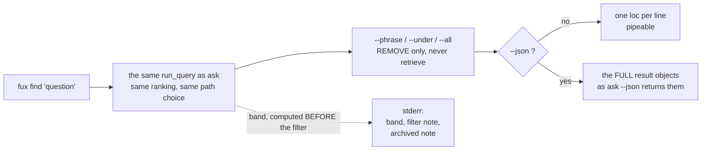

<!-- COMPONENTS-START — GENERATED from records/README.md's OWNERSHIP and DESCRIBES tables by scripts/gen-components.py. Do not edit by hand: change the table, then run `python scripts/gen-components.py --write`. -->

**Describes** — reaches into, does not own:

- [`src/fux/query/__init__.py::cmd_find`](../src/fux/query/__init__.py) · owned by [SR-ASK](0103_ask.md)

<!-- COMPONENTS-END -->

# SR-FIND — the `find` verb

## §1 — For humans

`find` is `ask` with the prose removed: one location per line, nothing else. It
exists so the output can go into a pipe.

```console
$ fux find "index format canonical" | xargs wc -l
```

The thing to understand is that **`find` does not run a different query.** It
calls the same ranking as `ask` and prints only `loc`. Same scores, same order,
same accelerator-or-scan choice — just a narrower projection of the result.

**Three filters narrow what is printed, and none of them retrieves anything.**
`--phrase`, `--under` and `--all` remove documents from the list the ranking
already returned; a document that did not make `--top` cannot be filtered *into*
the answer, and raising `--top` is what widens the pool. A pipe wants a narrower
list, not a cleverer one.

That leaves one surprise people meet the hard way: **`find --json` is not
terse.** It emits the full result objects, the same ones `ask --json` returns.
The terseness is a property of the text renderer, not of the verb.

**Diagram — Mermaid and its ASCII twin. Update both, always, together.**



<details>
<summary><b>ASCII twin</b> — the same diagram, for terminals, diffs, and any reader without a Mermaid renderer</summary>

```text
   fux find "question"
          |
          v
   the same run_query as ask        (same ranking, same accelerator-or-scan choice)
          |                          band is computed HERE, on the unfiltered list
          v
   --phrase / --under / --all       REMOVE rows; they retrieve nothing.
          |                         a filter can never add a document.
          |
          +-- --json ? --no--> one loc per line          <- pipeable, the point
          |
         yes
          v
     the FULL result objects: id, title, loc, score, headings
     as `ask --json` returns them -- terseness is text-mode only

   everything that is not a location  -->  stderr
   (band, the [filter] note, the archived note, the no-accelerator note)
```

</details>

### Examples

```console
$ fux find "index format canonical" --top 3
docs/index-format.md
docs/refer.md
docs/pruning.md
```

Same query, same ranking, through `ask` — the difference is presentation only:

```console
$ fux ask "index format canonical" --top 3
4.0239  The committed index format  (docs/index-format.md)
0.6807  The refer plane  (docs/refer.md)
0.4647  Pruning was measured and failed  (docs/pruning.md)
```

**And the surprise:** `--json` is *not* terse — it is the full result object.

---

## §2 — For agents

### Context

`ask`'s output is built for a human or an agent reading prose: score, title,
citation. That is the wrong shape for the other common use — feeding matches
into another command.

The question was whether "terse" should be a *flag on `ask`* or a *verb*. A
flag keeps the surface smaller; a verb keeps the contract stable. `find` won
because the shape of its output is a promise other tools depend on, and a
promise buried in a flag is one nobody notices they have broken.

**The second force arrives once the verb is in a pipe:** a ranked list is often
still broader than the caller wants, and the caller knows something the ranker
cannot — a path scope, an exact phrase, a term that must be present. The
pressure there is to make `find` cleverer at *retrieval*. That pressure is
refused: what the caller gets is a set of controls that subtract from the
ranking, never a second strategy that disagrees with it.

### Decision

**1. `find` returns exactly the same ranking as `ask`.** Same `run_query`, same
candidate generators, same `rank()`, same top-N truncation, and the same
treatment of `--expand` and of `-q`'s RRF fusion. It is a projection, never a
second retrieval strategy.

**2. Text mode prints `loc`, one per line, and nothing else** — no scores, no
titles, no headings, no markers. That is the pipeable contract, and it is why
[SR-ASK](0103_ask.md) decision 8's `§` lines are on `ask` alone: a heading in
this stream would be read as a filename. The same reasoning keeps the
`[archived]` marker off stdout ([SR-DIR-LIST](0120_dir-list.md) decision 12) —
that flag travels in `--json`, where a machine reader should look for it.

**3. `--json` returns the full result objects**, the same ones `ask --json`
returns for the same query and `--top`. Deliberate: a JSON consumer that wanted
only locations can select them, and a narrower JSON shape would make the two
verbs disagree about what a result *is*. **Byte-identity is claimed for the
plain case only** — no filter, no `-q`, no `--band`; see the consequence below,
which states where it stops and why.

**4. `--top`, `--fast`, `--scan`, `--no-tune`, `--expand` and `-q` behave exactly
as on `ask`** — scan by default, `--fast` opts into the accelerator when it
exists and is fresh ([SR-ASK](0103_ask.md) decision 4).

**5. `find` has no `--explain` and no `--why`.** Neither the path that answered
nor the derivation is part of the pipeable contract, and a diagnostic line in a
stream of paths is a defect rather than a courtesy. Both live on `ask`.

**6. No confident match prints `No confident matches.` on STDERR and exits 0** —
the same rule as `ask`. Stdout is empty, so a pipe sees zero paths rather than
one line of prose.

⚠ **Amended 2026-09-14 (W-165 fix 2): the sentence goes to STDERR.** It was on
stdout from the day the verb shipped. **Exit code 0, `--json` and the wording are
all unchanged** — the fix is about the stream and nothing else, so a consumer
matching the text keeps matching it, on the other stream. All three query verbs
moved in one change, because SR-FIND decision 6 is *"the same rule as `ask`"* and
a split would have made that sentence false.

**The case, and why it took this long.** `find` exists to be piped, so a line of
prose on the stream that otherwise holds nothing but paths turns an empty result
into one fake path. SR-FIND had this in Consequences from the start and tied
reopening to *"a real script observed breaking on it"*. **No script was ever
observed, and that is not what reopened it** — the surface's own documentation
did: the search skill told every agent to write `grep -qx "No confident matches."`
before piping `find`, which is a contract made of a string. A guard that has to
be documented is the defect, whether or not anyone has yet failed to write it.

⚠ **`fux graph` still writes it to stdout, in both readers.** Named here rather
than left to be discovered. W-165's scope was the three query verbs; widening it
silently would be a surface change with no record saying so.

**7. Three precision controls, and every one of them only ever REMOVES.**

| flag | keeps a document when |
|---|---|
| `--phrase "…"` | its **local text** contains the phrase, words adjacent and in order |
| `--under <prefix>` | its `loc` starts with the prefix |
| `--all` | its committed `terms` carry **every** query hash (grep's AND) |

`--under` matches the prefix the same way `Weighting.priority_for` does, so
`--under docs/adr` and a `[priority]` key spell a scope identically; a trailing
slash is neither required nor stripped, because inventing a component boundary
here would disagree with the resolver.

**8. A filter can never widen the pool.** A document the ranking did not place in
`--top` cannot be filtered into the answer; raising `--top` is what widens it.
Retrieving deeper and truncating afterwards — what the reranker does — was
refused for [SR-EXPAND](0149_expand.md) decision 11's reason: it would make
`support` describe a retrieval depth the caller never asked for, where
[SR-CONFIDENCE](0141_confidence.md) bounds it by `--top`. One consistent
meaning for `support` is worth more than a little extra recall on a filter.

**9. `band` is computed on the UNFILTERED ranking**, and a `[filter]` line on
stderr says so whenever a filter removed anything. Confidence is a claim about
the corpus's answer to the question, not about the subset a caller asked to
see; dropping rows cannot make fux more or less sure of what it found.

**10. A `url:` document is KEPT by `--phrase`, never dropped.** Offline it has no
text to test, and dropping it would report *"this page does not contain the
phrase"* on the strength of not having looked — [SR-RERANK](0138_rerank.md)
decision 8's rule, applied to a filter.

**11. `--phrase` uses the INDEX's analyzer**, so stopwords are dropped: `--phrase
"roll back"` matches *"roll the back"*. A phrase filter with its own notion of a
token would be a second analyzer disagreeing with the first.

**12. `--all` reads the committed record's `terms`, never fetched text.** `find`
is an offline verb, and the whole point of `--all` is that it is cheap.

**13. Everything that is not a location goes to stderr** — the band under
`--band`, the `[filter]` note, the archived note, the no-accelerator note.
stdout carries locations or it carries nothing.

**14. Fuzzy and prefix matching stay refused.** The committed plane stores term
*hashes*, so prefix enumeration needs a second committed structure. `missing`
says so.

**Output —** the unfiltered verb, from
[the 2026-08-18 capture](../work/regression/2026-08-18-query-verbs/report.md).

```console
$ fux find "index format canonical" --top 3
docs/index-format.md
docs/refer.md
docs/pruning.md
```

`--json` is the full object, not a list of paths:

```console
$ fux find "index format canonical" --json
{
  "results": [
    {
      "id": "file:docs/index-format.md",
      "title": "The committed index format",
      "loc": "docs/index-format.md",
      "score": 4.0238871954264575
    },
    ...
  ]
}
```

No match:

```console
$ fux find "zzz nonexistent term"
No confident matches.
# exit 0
```

### Consequences

- **Output is pipeable**, which is the whole point: `fux find … | xargs grep`.
- **`find --json` and `ask --json` are the same bytes** for the same query and
  `--top` **in the plain case**, so a caller can switch verbs without rewriting
  its parser. ⚠ **Two exceptions, stated rather than left to be discovered.** A
  filter makes `find`'s list a subset by construction — that is decision 7
  working. And when a payload carries **both** `fused` and `confidence` (`-q`
  together with `--band`), the two verbs emit those keys in the opposite order:
  `find` writes `fused` first, `ask` writes `confidence` first. The content is
  identical and a JSON consumer cannot tell; a consumer diffing bytes can.
  **That ordering is not a decision anybody took, it is one line in whichever
  verb moves, and it is not filed in
  [`work/OPEN-WORK.md`](../work/OPEN-WORK.md).**
- ✅ **`No confident matches.` goes to STDERR since 2026-09-14** (decision 6,
  W-165 fix 2), so stdout is empty and every line on it is a path. This bullet
  read the opposite — *"in a pipe that is a line of prose where a path was
  expected"* — for the whole life of the verb, which is the cost of filing a
  known defect as a consequence and then requiring an observed break to fix it.
  **What the old advice bought, and what is now unnecessary:** a script had to
  check for empty output or use `--json`. `--json` is still the right answer for
  a machine reader, and the empty case is still `{"results": []}` — that never
  changed and is not affected by the stream.
- **A filter can empty the list while the band still reads `grounded`.**
  Decision 9 makes that correct rather than surprising: the band describes the
  ranking, and the `[filter]` note on stderr is what tells a caller which of the
  two happened.
- **URL documents appear as URLs**, not filesystem paths, since `loc` is the
  location in its owning system. `xargs` on a mixed corpus will meet both.

### Alternatives considered

- **A `--terse` flag on `ask`** instead of a verb. Rejected: the output shape is
  a contract other tools depend on, and it is safer as a verb name than as a
  flag that someone later "improves".
- **`--json` emitting a bare array of locations.** Rejected: the two verbs would
  then disagree about what a result is, and any caller wanting a score would
  have to switch verbs and re-parse.
- **Exit 1 when nothing matches**, so shell pipelines short-circuit. Rejected
  for consistency with `ask`: absence is an answer. The `--json` empty array is
  the machine-readable form of that answer.
- ✅ **Sending `No confident matches.` to stderr** so stdout stays pure paths.
  Recorded here as *"genuinely arguable, and the strongest of the rejected
  options"*, and **taken on 2026-09-14**. The stated reason for rejecting it —
  *"it would make the three verbs behave differently from each other for the same
  condition"* — was a real objection to a **partial** move and no objection at
  all to a complete one. All three verbs moved in the same change, so the
  property that rejected it is preserved. ⚠ **The lesson is the shape of the
  rejection, not the verdict:** an option was turned down for a cost that only
  a narrower version of it carried, and the record kept that reasoning for a year
  without anyone noticing the option and its objection did not match.
- **Filters that retrieve deeper and truncate afterwards**, so a narrow
  `--phrase` still fills `--top`. Rejected — decision 8. It buys recall by
  making `support` mean two things.
- **Dropping `url:` documents that `--phrase` cannot read.** Rejected —
  decision 10. It would state a fact about bytes nobody fetched, which is the
  one thing this engine exists not to do.
- **Recomputing the band after filtering**, so it describes what was printed.
  Rejected — decision 9. The caller's subset is not the corpus's answer, and a
  confidence that moves when a caller narrows a view is not a confidence.

### Reference (required)

- The verb — [`src/fux/query/__init__.py`](../src/fux/query/__init__.py)
  (`cmd_find`), and `_filtered` beside it, which is where the three controls and
  the `url:`-kept rule are visible.
- The flags — [`src/fux/cli.py`](../src/fux/cli.py) (`p_find`).
- The shared ranking it projects — [SR-ASK](0103_ask.md).
- Captured behaviour of the unfiltered verb —
  [`work/regression/2026-08-18-query-verbs/`](../work/regression/2026-08-18-query-verbs/report.md).
- The filters' own run —
  [`work/regression/2026-09-05-declared-ties/`](../work/regression/2026-09-05-declared-ties/report.md),
  §*`find`'s three filters*: they are graded as precision controls rather than
  ranking changes, and it names the two cases that are judgement rather than
  plumbing — decisions 10 and 11.
- The tests that hold decisions 7–12 —
  [`tests/query/test_ties_and_filters.py`](../tests/query/test_ties_and_filters.py)
  and [`tests_e2e/test_verbs.py`](../tests_e2e/test_verbs.py).
- The convention this output shape follows — POSIX utility conventions, §Utility
  Description Defaults:
  https://pubs.opengroup.org/onlinepubs/9699919799/utilities/V3_chap01.html

### Veto condition

**Reopen this decision if** `find` and `ask` return different rankings for the
same query, `--top` and tune with no filter applied; or a filter is ever able to
put a document in the output that the ranking did not return; or `band` is ever
computed after filtering rather than before; or the three verbs ever disagree about which
stream the no-match line goes to.

⚠ **That last clause replaced *"or a real script is observed breaking on the
no-match line"* on 2026-09-14.** It never fired, and it was never going to: it
waited on an EVENT, in a repo whose own standing rule is that a veto states a
condition checkable today (see the SR convention). The line moved anyway, for a
reason the trigger could not see — the surface had to be documented with a
`grep -qx` guard. **The replacement is a condition**, and check 5 below is how it
is read.

**How to check it:**

```bash
# 1. find is still a projection of ask, not a second strategy.
#    The plain case only -- no filter, no -q, no --band -- which is exactly
#    the set of inputs decision 3 claims byte-identity for.
diff <(fux find "any query" --json --top 5) <(fux ask "any query" --json --top 5) \
  && echo IDENTICAL

# 2. text mode is still bare locations -- no scores, no headings, no markers
fux find "any query" --top 3 | grep -qE '^[0-9]+\.[0-9]+|^ *§|^\[' \
  && echo "VETO: something other than a location leaked into find"

# 3. a filter still only subtracts: the filtered list is a subset of the plain one
comm -13 <(fux find "any query" --top 20 | sort) \
         <(fux find "any query" --top 20 --under docs | sort) | grep . \
  && echo "VETO: a filter added a document the ranking did not return"

# 4. the band is still the unfiltered one -- the note fires on stderr, and the
#    band printed above it does not move when the filter drops rows
#
#    ⚠ THE PREFIX IS `confidence:`, NOT `[band]`. This check grepped for
#    `^\[band\]` from the day it was written until 2026-09-12 (W-140 row 4) and
#    could never match: `confidence.py` emits `confidence: weak - ...`. A veto
#    check that cannot fire does not read as broken, it reads as PASSING, which
#    is strictly worse than having no check. `[filter]` below is real.
fux find "any query" --top 20 --band              2>&1 1>/dev/null | grep '^confidence:'
fux find "any query" --top 20 --band --under docs 2>&1 1>/dev/null | grep -E '^confidence:|^\[filter\]'
#    The two `confidence:` lines must be IDENTICAL -- that is the actual claim,
#    and `[filter]` must appear only in the second.

# 5. there is NO prose on stdout. Both halves, because only the pair is the claim:
fux find "zzz nonexistent term" 2>/dev/null          # expect: nothing at all
fux find "zzz nonexistent term" 2>&1 >/dev/null      # expect: No confident matches.
#    And the same for the other two verbs -- the property is that they AGREE:
for v in ask answer; do fux $v "zzz nonexistent term" 2>/dev/null; done   # nothing
```

---

## References

*Every source this record cites, gathered in one place. §2's **Reference
(required)** names the grounding; this is the complete list. An archived
document is never listed here — the body may name one, but archive is not
evidence.*

**Records** — [SR-LAWS](0001_LAWS.md) · [SR-ASK](0103_ask.md) ·
[SR-DIR-LIST](0120_dir-list.md) · [SR-RERANK](0138_rerank.md) ·
[SR-CONFIDENCE](0141_confidence.md) · [SR-EXPAND](0149_expand.md)

**Code**

- [`src/fux/query/__init__.py`](../src/fux/query/__init__.py)
- [`src/fux/cli.py`](../src/fux/cli.py)
- [`tests/query/test_ties_and_filters.py`](../tests/query/test_ties_and_filters.py)
- [`tests_e2e/test_verbs.py`](../tests_e2e/test_verbs.py)

**Measured evidence**

- [`work/regression/2026-08-18-query-verbs/report.md`](../work/regression/2026-08-18-query-verbs/report.md)
- [`work/regression/2026-09-05-declared-ties/report.md`](../work/regression/2026-09-05-declared-ties/report.md)

**Project docs**

- [`work/OPEN-WORK.md`](../work/OPEN-WORK.md)

**Papers and specifications**

- POSIX utility conventions, §Utility Description Defaults — the output shape
  this projects
  <https://pubs.opengroup.org/onlinepubs/9699919799/utilities/V3_chap01.html>
