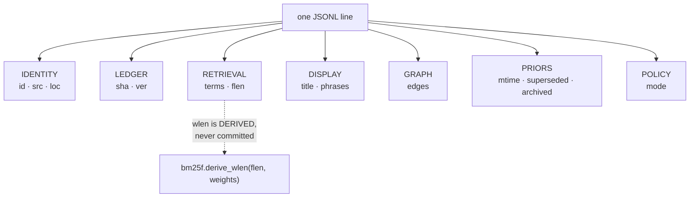

# SR-RECORD — one line of the committed index

## §1 — For humans

A shard file is JSONL. Its **first line is a header** pinning the schema and
the analyzer; **every line after it is one document**.

The test every property has to pass to be here is not "is it useful?" It is
**"is it a statistic, and is it worth a line-diff every time it changes?"** The
committed index lives in git, so every property is something a human will see
in a pull request for the rest of the project's life. Content fails that test
by law. So does anything derivable — it belongs in the runtime plane, which is
rebuilt and never reviewed.

**Fourteen property names — and which of them a given line carries is not
fixed.**

🔴 **THE PRIVACY FORK IS GONE. Amended 2026-09-20 (Arpit, W-194).** This
section read *"fifteen property names, plus `title_h`"*, and its first reason a
property was conditional was: **Privacy forks two** — *a `hashed` record carries
`title_h` instead of `title` and `phrases`, so no display text from a non-git
source ever lands in git.* **`meta` and `title_h` are deleted**, `fux.index` is
**v4**, and a url record is shaped exactly like a git one. ⚠ **The leak that
fork closed — a title alone telling a reader that a document they cannot open
exists — is an ACCEPTED, DOCUMENTED EXPOSURE**, and
[SR-LAW-5](0007_LAW-5-hashed-meta.md) (superseded) keeps the argument and the
reopen trigger. One reason a property is conditional is left:

- **Three are written only when they say something.** `archived` and
  `superseded` appear only when true, and `mtime` only when git could supply a
  commit timestamp. These are *facts most documents do not have*: a file outside
  git history has no commit timestamp, and the overwhelming majority of
  documents are neither archived nor superseded. Writing `false` and `null` on
  every line to preserve a uniform shape would put a byte cost on every record
  to record the absence of news — paid twice, in repository size and in every
  diff. **Absence is the default, it is free, and every reader defaults**:
  `r.get("archived", False)`, `r.get("mtime")`.

**Diagram — Mermaid and its ASCII twin. Update both, always, together.**



<details>
<summary><b>ASCII twin</b> — the same diagram, for terminals, diffs, and any reader without a Mermaid renderer</summary>

```text
   one JSONL line
        |
        +-- IDENTITY   id · src · loc
        +-- LEDGER     sha · ver
        +-- RETRIEVAL  terms · flen
        |                     |
        |                     +-- wlen is DERIVED at query time,
        |                         bm25f.derive_wlen(flen, weights)
        +-- DISPLAY    title · phrases
        +-- PRIORS     mtime · superseded · archived
        +-- GRAPH      edges
        +-- POLICY     mode

   (W-194, 2026-09-20: DISPLAY used to read "title · phrases -- or -- title_h",
    with POLICY's `meta = "hashed"` deciding which. Both fields are deleted.)
```

</details>

### Examples

The header line, then one document — captured from this repo's live
`.fux/index/`:

```console
$ head -1 .fux/index/d8.jsonl
{"_format":"fux.index.v2","analyzer":"v2","tf_fields":["body","heading","title","path","ctx"]}

$ sed -n '5p' .fux/index/d8.jsonl | head -c 200
{"archived":true,"edges":[],"flen":[4,0,2,9],"id":"file:archive/v0.26/tests_e2e/site/robots.txt","loc":"archive/v0.26/tests_e2e/site/robots.txt","meta":"plain","mode":"extracted","mtime":1786270142,"p
```

The same record, expanded (13 terms, of which 4 are shown):

```json
{
  "archived": true,
  "edges": [],
  "flen": [4, 0, 2, 9],
  "id": "file:archive/v0.26/tests_e2e/site/robots.txt",
  "loc": "archive/v0.26/tests_e2e/site/robots.txt",
  "meta": "plain",
  "mode": "extracted",
  "mtime": 1786270142,
  "phrases": [],
  "sha": "ee22f00a9ec474d01d82053ebe649ba13986e62e",
  "src": "git",
  "terms": { "14df123cc7d0ef53": [1], "8080e1a6da4f6be2": [0, 0, 1, 1],
             "dc38201b1ef530ef": [0, 0, 0, 1], "…": [] },
  "title": "robots.txt",
  "ver": 1
}
```

**Read the shape, not just the values.** `flen` is `[4, 0, 2, 9]` — four
entries, not five, because `ctx` is zero and trailing zeros are trimmed; a
path-only term is `[0, 0, 0, 1]` for the same reason. There is no `wlen` on the
line at all. `archived` is present *because it is true*; `superseded` is absent
because it is false.

And a **`url:` record**, which since W-194 differs from the one above only in
`src`, `loc` and the shape of the id. This block is an **illustration, not a
capture** — this corpus indexes no URL — and its `flen` is elided rather than
invented, because a fabricated length would teach nothing while reading exactly
like a measurement.

```json
{
  "id": "url:https://example.invalid/handbook/oncall",
  "loc": "https://example.invalid/handbook/oncall",
  "mode": "extracted",
  "phrases": [ "Escalation path", "Who to page" ],
  "flen": [ "…" ],
  "sha": "2643f1afb68339f2f808d85f67aad193b820dd86",
  "src": "url",
  "title": "Oncall handbook",
  "ver": 1
}
```

⚠ **Until 2026-09-20 this block showed a `hashed` record — `"meta": "hashed"`,
`"title_h": "h:30aef0c52cf11116"`, and no `title` or `phrases` — and the point
of it was the privacy fork.** There is no such record now.

---

## §2 — For agents

### Context

The committed plane is the product. Everything in it is paid for twice — once
in repository size, and once in every diff a reviewer reads, at every scale.
Anything that can be recomputed from what is already there is cheaper in the
runtime plane, where it is rebuilt on demand and nobody reviews it.

This record states what each field is *for*, which the schema file itself
cannot. **The schema is not frozen**, and three pressures have moved it, each
of which had to clear the bar above:

- a committed weighted length was a function of a query-time tunable;
- two tf fields could not hold enrichment vocabulary, `title` and `path` apart;
- the recency and supersession priors are facts a query path must not shell out
  to git to learn.

### Decision

**The header line.** Every shard opens with it, so a reader never infers field
meaning from position:

| property | value | purpose |
|---|---|---|
| `_format` | `"fux.index.v2"` | the schema id. A reader that does not know it must refuse, not guess — `store/reader.py` refuses a foreign shard outright rather than mixing it in |
| `analyzer` | `"v2"` | the tokenizer version — identifier splitting before lowercasing, then Porter stemming before hashing. Term hashes are only comparable within one analyzer version, and two analyzers in one index are undetectable at query time and corrupt every `df`; this is what makes that checkable |
| `tf_fields` | `["body","heading","title","path","ctx"]` | **the order of the `terms` and `flen` arrays**, and the reason **trailing zeros may be omitted**: `[1]` is body-only, unambiguously. Without it, `[0,1]` is ambiguous |

⚠ **`body` leads the tuple, and that is an encoding decision rather than a
scoring one.** A tf vector omits trailing zeros, so the cheapest shape to
encode is whichever field is most often the only one present — measured on this
repo, **92.5 % of postings are body-only**. Body-first plus trailing-zero
omission measured **−36.7 %** on tf bytes *while going from two fields to five*;
the obvious order, appending to `heading, body`, would have cost **+24 %**.
**Reordering the tuple changes every record and is a format bump, not a
refactor.**

**The document line — identity:**

| property | purpose |
|---|---|
| `id` | the primary key, and the shard input. `file:<path>` or `url:<url>`; the prefix is the namespace, so two sources cannot collide |
| `src` | which adapter owns this document — `"git"` or `"url"`. Determines the default `meta` policy, and who fetches it |
| `loc` | where to fetch it **in its owning system** — a repo-relative path, or the URL itself. Not a local path: the refer plane needs the address the *source* understands |

**Ledger — how change is detected:**

| property | purpose |
|---|---|
| `sha` | 40-hex blake2b of the raw bytes. Deliberately **not** a git blob sha1, so the same function covers URL documents that git never saw |
| `ver` | bumps strictly when *this* record's `sha` changes — never on an edge change. A version is a statement about the document, not its neighbourhood ([SR-INGEST](0106_ingest.md)) |

**Retrieval — what ranking consumes:**

| property | purpose |
|---|---|
| `terms` | the postings: `{16-hex term hash: [tf per field]}`, in `tf_fields` order, trailing zeros omitted. See [SR-POSTINGS](0112_postings.md) |
| `flen` | **per-field token counts**, same order, same trailing-zero rule. Not a length — a *fact*. The BM25F length normaliser `wlen` is derived from it at query time by [`bm25f.derive_wlen(flen, weights)`](../src/fux/query/bm25f.py), against the weights in force. A record *without* `flen` contributes to the corpus denominator and not the numerator, and both query paths must agree on that |

⚠ **The weighted length is not committed, and that is the point.** A committed
`wlen` was a **weighted** sum computed at ingest, which made a committed value a
function of a query-time tunable: change a field weight in `tune.toml` and the
numerator moves while the denominator stays baked in under the old weights —
corpus-wide silent misranking, with no diff to see. Committing the raw counts
and deriving the weighted sum in one function
([SR-TUNE](0135_tuning.md) decision 6) is what put the tunable back on the
tunable side of the line.

**Priors — facts scoring multiplies by:**

| property | purpose |
|---|---|
| `mtime` | the unix timestamp of the document's **last git commit** — not a filesystem mtime, which would differ on every clone and break L3. Feeds the recency prior, normalised against the corpus's newest commit so the prior can only ever demote. Written only when git could supply one; absent means no recency prior, which is also the shipped default |
| `superseded` | true when another document declares that it supersedes this one. A corpus-wide relation, resolved at ingest, **written only when true** |
| `archived` | true when the document was ingested under an archived-content rule. The record states the rule it was written under rather than every reader recomputing it ([SR-ARCHIVED-CONTENT](0134_archived-content.md)); **written only when true** |

⚠ **They are in the committed plane because the scan cannot shell out.**
Deriving a git timestamp per document at query time is one subprocess per
candidate, and at the 10 000-document design point that dwarfs the entire rest
of an ingest. Supersession is worse — it is a *relation*, not a property, so it
cannot be read off the document at all.

**The weights applied to them are tunable; the facts are not.** That split is
[SR-TUNE](0135_tuning.md) decision 1, and putting the facts on the committed
side is what lets both query paths weight the same document identically — the
failure found when a multiplier reached the scorer without reaching the
accelerator's pruning bound.

**Display — and the privacy fork:**

| property | purpose |
|---|---|
| `title` | shown in results. ⚠ **Read *"present only when `meta` is `\"plain\"`"* until W-194** (2026-09-20) deleted `meta`; every record may carry it now |
| `phrases` | heading-derived phrases — what [SR-ANSWER](0105_answer.md) returns, and what [SR-ASK](0103_ask.md) decision 8 cites as `§` headings. Same amendment as `title` |

**Graph and policy:**

| property | purpose |
|---|---|
| `edges` | resolved links to other `id`s. Re-resolved corpus-wide on every ingest, because a new document can resolve a previously dangling link |
| `mode` | how the record was built — `"extracted"` (deterministic, offline) or `"enriched"` (model-assisted). Records which contract produced these bytes |

**Two rules over the whole line:**

1. **Written through one canonical encoder** — sorted keys, `(",",":")`
   separators, `ensure_ascii=False`, no floats, no nulls, NFC text. Enforced at
   the write boundary, not trusted of callers.
2. **No quoted 16-hex token may appear outside `terms`.** `query/scan.py`
   derives `df` from raw bytes, so any other 16-hex string would be counted as a
   term by one query path and not the other. ⚠ **`title_h` was written as
   `"h:" + <16 hex>` for exactly this reason** — a character between the opening
   quote and the hex made the scan's pattern unable to match, so the two paths
   agreed by construction rather than by check. **The field is deleted (W-194)
   and the rule is not**: a `title` that happens to be 16 hex characters still
   trips it, and `tests/derive/test_differential.py` exercises that directly.

**The shape is declared once, in
[`store/index-record.schema.json`](../src/fux/store/index-record.schema.json).**
This record says what each field is *for*; the schema says what the field set,
the defaults and the omit rules **are**, and the code is checked against it
([SR-INDEX-LIFECYCLE](0108_index-lifecycle.md) decision 11). Neither is a
paraphrase of the other.

### Consequences

- **A document's change is one line in one shard**, so `git diff` is readable
  and merges land per document.
- 🔴 **The display cache is DELETED, with the fork it served** (W-194,
  2026-09-20). This consequence described the whole P5 machinery — ingest wrote
  the title to a gitignored `.fux/runtime/display-cache/` keyed by `sha`
  **before** `store/writer.py` would accept a hashed record, `display_title`
  resolved through it, a cold cache degraded to
  `"<hash> (uncached — title unavailable)"` rather than a bare hash, `phrases`
  was never materialised, and ranking passed no cache so a score stayed a pure
  function of the record. **None of it exists.** `display_title(record)` is
  `record["title"]`, and the only property worth carrying forward is the last
  one: **ranking is still a pure function of the committed record**, which it
  now is by construction rather than by care.
- **`title_h` used to break rule 2, and the fix was the field, not the rule.** A
  bare 16-hex token outside `terms` made the accelerator refuse to build over
  any corpus containing one — so the `hashed` default, an L5 default, shipped an
  index no `fux build` would accept. Fixed by prefixing the value rather than
  relaxing the invariant. ⚠ **Kept here although the field is gone**, because
  the lesson is about the invariant and not about `title_h`: the invariant is
  what stands between the engine and a fast wrong answer, and a check that has
  to be remembered is worse than a shape that cannot be got wrong.
- **Adding a property is a schema change**, requiring an `_format` bump and a
  re-ingest of every corpus. That cost is the point: it is what keeps the
  committed plane from accumulating conveniences.
- **Removing an optional property is not.** A key no reader looks for is inert,
  so an index still carrying it is read correctly and ranks identically; bumping
  would force a re-ingest that buys nothing. **Bumps are for shapes that would
  be *misread*, never for shapes that shrank.**
- **`terms` is not salted, and that was examined rather than overlooked.** A
  committed, per-index salt is not a salt — a cloner gets it too. A genuine
  per-deployment salt was considered and rejected as real added complexity (an
  out-of-band provisioning story for every query client) for a narrower gain
  than it looks like, since volume leakage (`terms`' tf, `flen`) reconstructs
  regardless of how the term keys were hashed. See
  [`meta-privacy.compare.md`](../archive/compare/meta-privacy.compare.md).

### Alternatives considered

- **Store the title alongside `title_h` for hashed records.** Rejected at the
  time: it defeats the mode entirely — the display text is exactly what must not
  reach git. ⚠ **Overtaken 2026-09-20**: Arpit deleted the mode, so the title is
  stored and there is no `title_h` beside it. **This row was right about the
  trade and the trade was taken deliberately** (W-194), which is a different
  thing from the row having been wrong.
- **Derive the length from `terms` instead of committing anything.** Rejected,
  and the reason is why the committed source is `flen` rather than `terms`:
  `terms` holds post-stopword tokens, so summing them is not the document's
  length, and BM25F needs the real one. The *weighting* moved to query time; the
  raw counts did not, because they cannot be recovered.
- **Position-based arrays instead of named keys**, to save bytes. Rejected: the
  committed plane's readability in a diff is worth more than the bytes, and
  `tf_fields` already handles the one place ordering is unavoidable.
- **Put `edges` in the runtime plane.** Rejected: edges are corpus-wide facts
  the graph lane needs at clone time, and they are small.
- **Commit dense vectors.** Built and removed. Measured on this repo before
  removal: **8 094 chunk vectors across 1 304 records, 2.79 MB of a 12.16 MB
  index — 23.0 %.** Nearly a quarter of the committed plane, for a lane that
  shipped `off` and measured worse when switched on
  ([SR-ASK](0103_ask.md) decision 9). The bar at the top of §2 is what it
  failed.

### Reference (required)

- The schema constants and the header —
  [`src/fux/store/format.py`](../src/fux/store/format.py); the declared
  shape —
  [`index-record.schema.json`](../src/fux/store/index-record.schema.json);
  the encoder — [`canonical.py`](../src/fux/store/canonical.py); record
  construction — [`src/fux/ingest/run.py`](../src/fux/ingest/run.py).
- ⚠ **The display cache (`store/displaycache.py`) and the write-time refusal
  (`assert_meta_policy`) were deleted by W-194 on 2026-09-20** and are named
  here rather than linked, because a link to a file that is not there is worse
  than a sentence saying it was removed. The resolution every verb still shares
  — `display_title` in
  [`store/format.py`](../src/fux/store/format.py); the verdicts that argued the
  mode —
  [`work/compare/meta-privacy.compare.md`](../archive/compare/meta-privacy.compare.md).
- Real records, both `plain` and `hashed`, as of 2026-08-18 —
  [`work/regression/2026-08-18-ingest-and-index/`](../work/regression/2026-08-18-ingest-and-index/report.md) §2 and §6.
- Canonical JSON, the prior art the encoder follows — RFC 8785:
  https://www.rfc-editor.org/rfc/rfc8785
- JSON Lines, the container format: https://jsonlines.org/

### Veto condition

**Reopen this decision if** a property appears that is derivable from the
others, or if `_format` changes without a migration path.

**How to check it:**

```bash
# 1. the header is present and current on every shard
head -1 .fux/index/*.jsonl | grep -c 'fux.index.v2'
ls .fux/index/*.jsonl | wc -l          # the two numbers must match

# 2. no property has appeared that the schema does not declare
python3 -c "
import json,glob
known = set(json.load(open('src/fux/store/index-record.schema.json'))['fields'])
known |= {'_format','analyzer','tf_fields'}
seen=set()
for f in glob.glob('.fux/index/*.jsonl'):
    for ln in open(f): seen |= set(json.loads(ln))
print('undeclared properties:', sorted(seen - known) or 'none')"

# 3. rule 2 — no bare 16-hex token outside terms. The build asserts it per
#    record and refuses rather than diverging.
fux build >/dev/null && echo "rule 2 holds on this corpus"
```

---

## References

*Every source this record cites, gathered in one place. §2's **Reference
(required)** names the grounding; this is the complete list. An archived
document is never listed here — the body may name one, but archive is not
evidence.*

**Records** — [SR-LAWS](0001_LAWS.md) · [SR-ASK](0103_ask.md) ·
[SR-ANSWER](0105_answer.md) · [SR-INGEST](0106_ingest.md) ·
[SR-INDEX-LIFECYCLE](0108_index-lifecycle.md) ·
[SR-POSTINGS](0112_postings.md) ·
[SR-ARCHIVED-CONTENT](0134_archived-content.md) · [SR-TUNE](0135_tuning.md)

**Code**

- [`src/fux/ingest/run.py`](../src/fux/ingest/run.py)
- [`src/fux/query/bm25f.py`](../src/fux/query/bm25f.py)
- [`src/fux/store/canonical.py`](../src/fux/store/canonical.py)
- `src/fux/store/displaycache.py` — **DELETED 2026-09-20 (W-194)**, named rather than linked
- [`src/fux/store/format.py`](../src/fux/store/format.py)
- [`src/fux/store/index-record.schema.json`](../src/fux/store/index-record.schema.json)
- [`src/fux/store/writer.py`](../src/fux/store/writer.py)

**Measured evidence**

- [`work/regression/2026-08-18-ingest-and-index/report.md`](../work/regression/2026-08-18-ingest-and-index/report.md)

**Project docs**

- [`work/compare/meta-privacy.compare.md`](../archive/compare/meta-privacy.compare.md)

**Papers and specifications**

- JSON Lines — the container format
  <https://jsonlines.org/>
- RFC 8785 (JSON Canonicalization Scheme) — the canonical-JSON prior art the
  encoder follows
  <https://www.rfc-editor.org/rfc/rfc8785>
