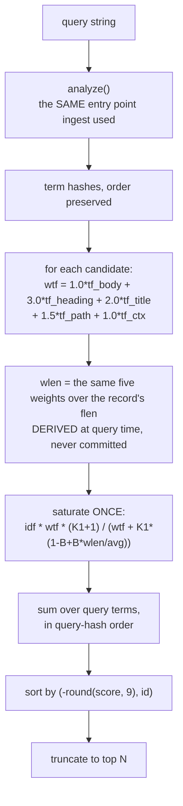
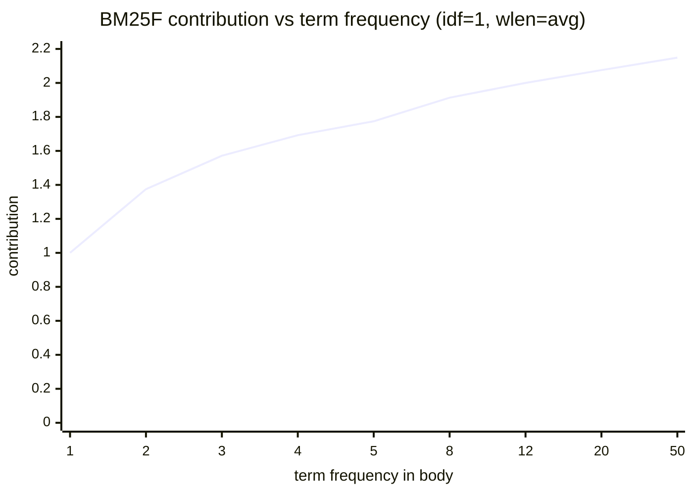

<!-- COMPONENTS-START — GENERATED from records/README.md's OWNERSHIP and DESCRIBES tables by scripts/gen-components.py. Do not edit by hand: change the table, then run `python scripts/gen-components.py --write`. -->

**Owns** — the components this record decides:

- [`src/fux/query/analyzer.py`](../src/fux/query/analyzer.py) · file
- [`src/fux/query/bm25f.py`](../src/fux/query/bm25f.py) · file
- [`src/fux/query/rank.py`](../src/fux/query/rank.py) · file
- [`src/fux/query/stem.py`](../src/fux/query/stem.py) · file
- [`src/fux/query/tokenize.py`](../src/fux/query/tokenize.py) · file

**Describes** — reaches into, does not own:

- [`node/src/query/rank.mjs`](../node/src/query/rank.mjs) · owned by [SR-NODE-SEARCH](0153_node-search.md)

<!-- COMPONENTS-END -->

# SR-RANKING — how documents are scored and ordered

## §1 — For humans

Fux ranks with **BM25F over five fields** — `body`, `heading`, `title`, `path`
and `ctx`, in that order — with a heading occurrence worth three body
occurrences, a title occurrence two, a path occurrence one and a half, and a
`ctx` occurrence exactly one.

The "F" matters, and it is the one thing implementers get wrong. BM25F does
**not** mean "score each field with BM25 and add the results". It means combine
the fields' term frequencies into one weighted count *first*, then saturate
that once. Summing per-field BM25 scores saturates **once per field**, and lets
a term spread thinly across all five outrank one that appears many times in the
field that actually matters.

**Saturation is the point of the model.** The tenth occurrence of a word tells
you almost nothing the third did not. So the contribution curve rises fast and
flattens: with these constants it can never exceed `K1 + 1 = 2.2` per term, no
matter how many times a word appears.

Two smaller decisions carry weight out of proportion to their size. **The same
analyzer runs at ingest and at query time** — one entry point, so the two sides
of a match cannot drift. And **the order is rounded before sorting**, then
tie-broken by `id`, which is what makes the two query paths byte-identical
rather than merely close.

**Diagram — Mermaid and its ASCII twin. Update both, always, together.**



<details>
<summary><b>ASCII twin</b> — the same diagram, for terminals, diffs, and any reader without a Mermaid renderer</summary>

```text
   query string
        |
        v
   analyze()          <- the SAME entry point ingest used to build `terms`
        |
        v
   term hashes, order preserved   (order is load-bearing: the sum is in it)
        |
        v
   per candidate:  wtf = 1.0*tf_body + 3.0*tf_heading + 2.0*tf_title
                       + 1.5*tf_path + 1.0*tf_ctx        <- weight FIRST
        |
        v
   wlen = the same five weights over the record's `flen`
        |                              <- DERIVED here, never committed
        v
   saturate ONCE:  idf * wtf * (K1+1)
                   -----------------------------------
                   wtf + K1 * (1 - B + B * wlen/avg)
        |
        v
   sum over query terms, in query-hash order
        |
        v
   sort by (-round(score, 9), id)      <- rounded, then tie-broken by id
        |
        v
   top N
```

</details>

### Examples

Scores are visible in `ask`, and identical in `find --json`:

```console
$ fux ask "index format canonical" --top 3
4.0239  The committed index format  (docs/index-format.md)
0.6807  The refer plane  (docs/refer.md)
0.4647  Pruning was measured and failed  (docs/pruning.md)
```

The float that the rounded sort protects:

```json
{ "loc": "docs/index-format.md", "score": 4.0238871954264575 }
```

### Charts

**Saturation — why the tenth occurrence barely counts.** One term, body only,
at an average-length document, `idf` held at 1.0 to isolate the shape.



<details>
<summary><b>ASCII twin</b> — the same chart, for terminals, diffs, and any reader without a Mermaid renderer</summary>

```text
  contribution (idf = 1, wlen = avg)          ceiling = K1 + 1 = 2.2
  2.2 - - - - - - - - - - - - - - - - - - - - - - - - - - - - - -
  2.0 |                                   *        *        *
      |                        *
  1.5 |         *    *    *
      |
  1.0 |    *
      |
  0.0 +----+----+----+----+----+---------+---------+-----------+--
       tf=1    2    3    4    5         8        12          50

  tf 1 -> 2 buys +0.375.   tf 12 -> 50 buys +0.148.
  The curve can never reach 2.2, however often a word appears.

  source: computed from src/fux/query/bm25f.py (K1=1.2, B=0.75 — the default at the time of this capture; it is 0.15 from 2026-09-16, decision 3)
```

</details>

**Length normalisation**, the other half of the same formula — weighted tf held
at 3.0, `idf` at 1.0:

<details>
<summary><b>ASCII twin</b> — a short document says more with the same word count</summary>

```text
  wlen (avg = 100)      contribution
      25                1.8723
      50                1.7600
     100                1.5714     <- an average-length document
     200                1.2941
     400                0.9565

  Four times the length costs roughly half the contribution.
  source: computed from src/fux/query/bm25f.py (K1=1.2, B=0.75 — the default at the time of this capture; it is 0.15 from 2026-09-16, decision 3)
```

</details>

---

## §2 — For agents

### Context

Ranking is where a retrieval engine is judged, and it is also where two
implementations of one query can diverge invisibly. Fux has two candidate
generators — the reference scan and the derived accelerator — and a promise
that they return identical bytes.

That promise is not achievable by writing the scorer carefully twice. It is
achievable by writing it once.

### Decision

**1. BM25F over five fields**, `body`, `heading`, `title`, `path` and `ctx`, in
`store.TF_FIELDS` order.

**Two fields could not carry what the corpus needed.** Enrichment vocabulary is
written by an agent into `.fux/enrich/<sha>.md` and is not body text
([SR-ENRICH](0137_enrich.md)); folding it into `body` would make it
unweightable, and **a generated signal that cannot be weighted separately from
the author's own words cannot be demoted when it is wrong.** `title` had nowhere
to go but `heading`, where it was silently double-counted. And `path` adds no
content — the path was already committed as `loc`, so indexing its segments
invents nothing and extracted-mode law is untouched.

**The order of the tuple is load-bearing and `body` is first**, which is an
encoding decision rather than a scoring one. A tf vector omits trailing zeros,
and 92.5 % of postings are body-only, so body-first measured **−36.7 %** on tf
bytes *while going from two fields to five*; appending to `heading, body` would
have cost **+24 %**. Reordering is a format bump, not a refactor.

**2. Weight then saturate — once.** `wtf = sum_i w_i * tf_i` over the five
fields, in `TF_FIELDS` order, then one saturation over `wtf`. **Never per-field
BM25 summed.** Going from two summands to five does not weaken the rule — it is
what makes it bite: five per-field BM25 scores saturate five times, and a term
present thinly in all five would then beat a term that genuinely dominates one.
`bm25f.weighted_tf()` is a single sum feeding a single saturation, and it
iterates over the *posting* rather than over the weights, so a body-only tf of
`[1]` costs nothing for the four fields it does not carry.

**3. The defaults are `K1 = 1.2`, `B = 0.15`, and `FIELD_WEIGHTS = (1.0, 3.0,
2.0, 1.5, 1.0)`** — body 1.0, heading 3.0, title 2.0, path 1.5, `ctx` 1.0,
aligned index-for-index with `TF_FIELDS`, and `bm25f.py` asserts the two are the
same length. A silent misalignment would weight `title` as `path` and produce a
ranking that is plausible and wrong, which is the failure mode with no symptom.

🔴 **`B` was `0.75` — the literature's value — until 2026-09-16, and `0.15` is
the first default here that is MEASURED rather than inherited**
([W-144](../work/regression/2026-09-16-b-sweep-2/VERDICT.md)).

`b` is the strength of length normalisation, and **a table inflates a document's
length with tokens that say nothing about the query** — so at `0.75` a document
is punished for an appendix it did not ask to be measured on. Under a rule frozen
before the sweep — *the first value, descending `0.4 → 0.3 → 0.2 → 0.15`, that
nets positive on both benefit families with every control holding* — `0.4` moves
neither family, `0.3` and `0.2` fix the rate-card case and leave the
prose-with-appendix case exactly where `0.75` does, and **`0.15` moves both**:
`+30` each, `p = 0.0000` on 30 discordant pairs against a required net of 12,
with `inverse`, `placebo`, `dump` and `verbose` all holding.

⚠ **Descending order is what makes it `0.15` and not something lower.** The rule
reports the smallest departure from `0.75` that works, never the best value.

⚠ **One synthetic corpus, and the run is `informed`.** 510 generated documents
built so the mechanism *can* move. It says a lower `b` ranks better **on
documents shaped like these**; real-corpus evidence is W-144's reopen trigger.
**A default shipped on one synthetic corpus is why this paragraph exists rather
than a silent value change.**

⚠ **`K1`, heading and body are still carried forward from the archived engine, so
its recorded numbers remain a free correctness check — but `B` is no longer one
of them.** `title`, `path` and `ctx` are carried forward from nothing: defensible
starting points, not measured optima. Listing them in one breath would dress
guesses as calibration.

⚠ **None of the seven is a constant.** They are the module-level defaults, and
`[bm25f]` in `.fux/tune.toml` can replace any of them per query
([SR-TUNE](0135_tuning.md)). An unconfigured corpus scores byte-identically to
a corpus with no tune file at all, which is what the suites run.

**3a. They travel as ONE frozen `Scoring` object, never as separate
arguments.** `weighted_tf`, `derive_wlen` and `score_record` take
`scoring: Scoring = DEFAULT_SCORING`; `Scoring` carries `k1`, `b` and the five
weights together, plus a `trivial` property so a default query can
short-circuit. The reason is decision 2's fraction read as a whole:

```
denom = wtf + k1 * (1 - b + b * wlen / avg_wlen)
```

`wtf` is the weights applied to the numerator, `wlen` is the *same* weights
applied to the denominator, and `k1` and `b` join them. Three separate
parameters make "pass the weights, forget `k1`" available at every call site —
reweighting half a formula, silently, corpus-wide. **One object makes it
unrepresentable.**

**4. `idf(df, n) = log((n - df + 0.5) / (df + 0.5) + 1)`** — the `+1` form, so
`idf` never goes negative on a term in most of the corpus.

**5. Corpus statistics are inputs, never derived inside the scorer.** `df`, `n`
and `avg_wlen` are computed by the candidate generator in the same pass that
finds candidates, and never stored pre-weighted.

**6. One scorer, one sort, one file.** `rank()` scores, sorts and truncates for
both paths, and **nothing else may compute a BM25F score against the corpus.**

**The scope of that claim is exact.** This decision exists to make the
differential law achievable: the arithmetic turning a candidate into a BM25F
score must happen **once, in one place, in one order**, because floating-point
addition is not associative and a second implementation would differ in its
low-order bits with nothing logically wrong. A **post-ranking stage** that
applies a bounded multiplier to a finished score is not a second opinion about
how well a term matched.

There is exactly one such stage — the proximity reranker
([SR-RERANK](0138_rerank.md)) — and two limits keep it from being a hole:

- **It never retrieves.** A document `rank()` did not return cannot be rescued
  by it, which is what keeps *the committed plane is sufficient to answer* true.
- **It ships off.** `[ranking] rerank_weight` defaults to `0`, so at the shipped
  defaults the stage is the identity and the ordering is byte-for-byte what this
  decision described before it existed.

It is applied identically to whichever list `rank()` produced, which is what
keeps it *inside* the differential law rather than an exception to it. **The
wording that must never be relaxed is *one scorer*, not *one stage*.**

**7. The sum is in query-hash order**, so both generators must derive that order
identically from the same string.

**8. The order is `(-round(score, 9), id)`.** Rounding before comparison makes
the order stable across paths; `id` makes ties deterministic. Both halves are
load-bearing — the accelerator's skip test is written against exactly this
comparison ([SR-T1-ACCELERATOR](0110_accelerator.md)).

**8a. `round(score, 9)` IS THE CROSS-RUNTIME CONTRACT for the score, and the
ordering is byte-equal regardless.** Two runtimes reading one committed index
agree on `round(score, 9)`, not necessarily on the score's last bit: `log` is
the one transcendental in `score_record`, and two IEEE-conforming
implementations of it disagree by one ulp on roughly 7 % of the arguments fux
can hand it. Measured, exhaustively over `idf`'s whole argument domain
(`df = 1..n`) on darwin/arm64 and glibc/x86-64:
[`work/regression/2026-09-05-node-log-divergence/`](../work/regression/2026-09-05-node-log-divergence/ADDENDUM-GLIBC.md).
**Nine places is not a tolerance chosen to make a comparison pass — it is the
resolution decision 8 already sorts at**, seven orders of magnitude above the
largest divergence measured. ⚠ **This licenses nothing about the ORDER**, which
stays byte-equal across runtimes: a different top-5 is a defect under this
decision, not a rounding difference. Arpit ruled this on 2026-09-06
([PRE-REG-NODE §2](../work/benchmark/PRE-REGISTRATION-NODE.md)); a
divergence above `~1e-9` relative on any platform pair voids it.

**9. One analyzer, shared by ingest and query.** Split identifiers, lowercase,
drop a fixed English stopword list, Porter-stem, then hash — **in that order**,
and two of the positions are easy to get backwards:

- **Splitting happens before lowercasing**, because case is the only signal that
  a boundary was ever there. Lowercase first and `getUserName` reaches the index
  as one opaque `getusername` — `get`, `user`, `name` are *gone*, not merely
  unused. Whole **and** parts are emitted, which keeps an exact-identifier query
  precise while `user name` finds the identifier at all.
- **Stemming happens before hashing**, so the hash is always taken of the final
  analyzed token. The Porter implementation is checked against the published
  test vectors and passes **75 of 75**.

**The shared half is the load-bearing half.** A one-step divergence between
ingest and query produces a **silent no-match** — the query hashes a string the
index never wrote, the term is not found, and there is no error to see. The
analyzer version is pinned in every shard header and a foreign shard is
*refused* rather than mixed in, because two analyzers in one index is
undetectable at query time and corrupts every `df`.

**10. Stopwords are filtered.** Added on measurement: a glossary's
dictionary-style repetition of "what"/"is"/"the" outranked a focused, correct
answer on a natural-language question. Standard IR practice, and the list is the
archived engine's own.

**11. A record without `flen` contributes to the corpus denominator and not the
numerator** — the scan's behaviour, which the build asserts the accelerator
reproduces. **`wlen` is derived, never committed**: it was a *weighted* sum
computed at ingest, which made a committed field a function of a tunable —
changing a field weight reweighted the numerator against a denominator baked in
under the old weights, a silent corpus-wide ranking error with nothing to see.
`flen` is a fact about the document; `wlen` is a policy applied to that fact,
and the two live on opposite sides of the commit.

⚠ **`doc_coverage` added to the confidence block 2026-08-28**, and the scorer is untouched.
**`coverage` is unchanged**, `rank()` gained one line writing the top-ranked
record's matched hashes into the `stats_out` dict it already fills, and the band
**does not gate on the new field** — the gate is off on a measurement, see
[SR-CONFIDENCE](0141_confidence.md) decision 12's outcome. **No ordering, no
score and no existing field moved.**

⚠ **`score_record` gained an optional per-term multiplier on 2026-09-05**
(W-109, [SR-EXPAND](0149_expand.md) decision 2): a `term_weights` map applied
to each summand, so an expansion's supplied words can be discounted without
touching the user's own.

**Per term, never per score.** Scaling the total would discount the query's own
terms in the same breath as the caller's guesses — and this is BM25F, where the
whole discipline is weight-then-saturate *once*, on the right quantity.

⚠ **`None` performs no multiply at all**, not a multiply by `1.0`. The branch is
skipped, so an unexpanded query does exactly the float arithmetic it did before
the parameter existed and the differential law cannot pick up a last-bit
difference from a feature nobody used.

🔴 **The tie-break is DECLARED since 2026-09-05 (W-111), in Arpit's ratified
order:**

```
(-round(score, 9),  superseded,  -mtime,  -priority,  id)
```

**`superseded` -> recency -> priority -> `id`.** `id` stays as the final,
total tie-break so the order remains total and machine-independent.

**What it replaces.** `id` alone — measured at
[**4.38 % of top-5 orderings decided by a document's name**](../work/regression/2026-08-25-rank-flip-susceptibility/ANALYSIS.md).
That was deterministic and meaningless: *the same arbitrary answer everywhere*.
Determinism was never the problem, and a **stated** answer costs exactly the
same as an arbitrary one.

🔴 **This turns no ranking prior on, and W-94 is untouched.** **None of these
signals is a weight and none of them can be:** `superseded_weight`,
`archived_weight` and `recency_half_life_days` were **all REMOVED on 2026-09-13**
(SR-TUNE decision 15), and `[priority]` — the one multiplier left — ships empty.
The key reads the same **facts** those weights read, and reads them **only where
the rounded scores are equal**. No score moves; no document passes one that
outscores it
(`tests/query/test_ties_and_filters.py::test_the_tie_break_never_moves_a_document_past_one_that_outscores_it`).
W-94 asked whether those knobs should change *scores*; the answer was that no
global value is correct for any of them, so they went — and **this tie-break is
now the ONLY route by which `superseded` or `mtime` reaches ranking at all.**
That raises its stakes and changes none of its rules: it still cannot promote or
demote a document past one that outscores it.

**The asymmetry that makes this work**: `superseded` and `mtime` are committed
**facts** that exist whether or not their weight is on, so they are readable at
the shipped defaults. That is the whole reason a tie-break can use them without
becoming a prior.

⚠ **`-priority` is UNREACHABLE, and saying so is better than implying
otherwise.** `[priority]` has no fact/weight split — `Weighting.priority_for`
**is** the weight, and `Weighting.of` multiplies the score by it. Two documents
with different priorities therefore have different scores and never reach the
tie-break; two with the same priority are not separated by it either. The slot
is implemented because it is what was ratified, it costs nothing, and it is
already correct if `[priority]` ever becomes a declaration that does not
multiply. Pinned by
`tests/query/test_ties_and_filters.py::test_priority_cannot_reach_the_tie_break_and_the_reason_is_recorded`,
which fails the day that changes.

**`AskResult.tie` marks it.** `true` when this result's rounded score equals
another candidate's — **computed over the full sorted list before
truncation**, so the last row of a `--top 5` is marked even when the document
it ties with is off the page. That row is the one most likely to have been a
coin-toss, and a neighbour comparison on the truncated window would silently
un-mark it. `false` is a claim, not an absence.

**The differential law holds** — both paths reach `rank()` with the same record
dicts, and the key reads only fields both generators already carry
(`superseded`, `mtime`, `loc`).

**A hit carries `boosted` and `route`, and neither is in the sort key**
(W-161).

`rank()` sets neither: the graph tier is composed by `run_query` after the
lexical core is complete, exactly as `pinned` is. What they explain is the one
list fux prints that **may not be monotone in `score`** — under the boosted
tier a row can outrank a higher-scoring one, because the order is
`RRF(lexical rank, PPR rank)` while the number printed is still BM25F.

🔴 **A caller that re-sorts `results` by `score` is discarding the graph's
contribution and re-deriving the lexical order.** That is a legitimate thing to
want — it is what `fux lexical` returns — but it should be asked for by name
rather than arrived at by sorting. `route` names exactly the rows such a sort
would move.

`boosted` marks a row the walk **reached**, not one that moved: a walked
document already at #1 is still the reason #1 is #1, and marking only movers
would hide the tier's effect exactly where it agreed with the words — the case
a reader most needs to see, because it is the one that looks like nothing
happened. [SR-ASK](0103_ask.md) decision 13 carries the composition.


**12. `anchor` is the sixth BM25F field, folded at READ time, and it is not in
`TF_FIELDS`** (W-168 step 1, 2026-09-15). A document's anchor terms are the
words **other documents use when they link to it** — every other field is
something the document says about itself.

- **Weighted into `wtf`, never scored as a second BM25.** BM25F is
  weight-then-saturate **once**; summing a separate per-field BM25 is what this
  record's own law forbids, and it is what would let an anchor match on a short
  document outrank a full body match. One `wtf`, one saturation.
- **`alen` joins `wlen`.** A heavily linked-to document is a **longer**
  document. Leaving anchor out of the normaliser is what would let a link farm
  max out a term with no length price, so it is in, at the weight the numerator
  uses — and it is the only guard in the engine against the failure direction
  the [pre-registration](../work/regression/2026-09-15-anchor-text/PRE-REGISTRATION.md)
  names, because **anchor tf is unbounded in the number of linkers** where body
  tf is bounded by one document's length.
- 🔴 **Anchor terms are in no committed posting, so they are in no `df`.**
  Switching the field on cannot move `idf` for anything. That is also forced:
  `derive/accel.py` counts `df` from the postings alone, so counting them on the
  scan side would be an immediate differential-law break.
- **Outside the `weights` tuple, deliberately.** That tuple is aligned
  index-for-index with `TF_FIELDS` — the five fields a record commits an `flen`
  for — and the alignment is asserted at import because a misalignment would
  weight `title` as `path`. Anchor has no committed slot.

**12a. `tf is None` stopped being a reason to skip a term.** `score_record`
returned early for a document whose own `terms` lack the hash. **That early
return was the second place the retrieval change would have died silently** —
the first being candidate generation — and both had to move or the fold would
have been dead code for exactly the documents it exists for.

**12b. The fold lands in `rank()`, once, for both candidate paths.** Each
generator attaches `atf` and `alen` to the record dicts it hands over, and
`rank()` reads them the way it reads `flen`. The differential law then stays
what this record and `derive/accel.py` already make it — **a property of the
candidate set** — rather than a hope about two copies of an arithmetic.

⚠ **Both keys go on EVERY candidate when the field is on, `atf` empty or not.**
A document that is linked-to is a longer document whether or not the query's
words are what its linkers used; attaching them only where `atf` is non-empty
would drop that length out of `wlen` on one path and not the other, silently
and only on linked documents.

**12c. `0.0` is OFF, not "weight zero".** Every anchor branch in the engine
tests it and is skipped entirely, so an unconfigured corpus does the float
arithmetic it did before the field existed. Same rule, and the same reason, as
`--expand`'s `term_weights`: the differential law must not pick up a last-bit
difference from a feature merely being present, and the evidence gathered at
the default stands unmodified. **Measured 2026-09-15**: 692 queries × 4 `top`
values × 2 skipping modes over this repository's 1 237 documents — **5 536
byte-identical comparisons at the default and 5 536 at `anchor = 2.0`, zero
mismatches.**

**12d. It ships off and is UNMEASURED.** [SR-RS](0133_predictions.md) decision
19: a ranking change ships behind a tunable at zero and is defaulted on only by
a PASS on a frozen pre-registration. That pre-registration is
[`2026-09-15-anchor-text`](../work/regression/2026-09-15-anchor-text/PRE-REGISTRATION.md),
and the data it needs — documents findable only through a linker's wording —
does not exist yet. **No claim about ranking quality is made or may be made
until it has a `VERDICT.md`.**

### Consequences

- **The differential law is achievable at all.** One scorer in one order is what
  makes byte-identical `--json` possible between two very different candidate
  generators.
- **Ranking changes are expensive by design.** Any change to the parameters, the
  fields, or the saturation invalidates `block_bound` and the skipping proof —
  the accelerator must be re-argued, not just re-tested. The field weights reach
  the bound as well as the scorer
  ([SR-T1-ACCELERATOR](0110_accelerator.md) §The weighted bound), which is what
  let them become tune keys at all.
- **Hashed records rank normally.** `title_h` does not participate in scoring;
  only `terms` does.
- **A heading occurrence is exactly three body occurrences** — both give
  `wtf = 3.0` and contribute 1.5714 at average length. That equivalence is a
  choice, not an accident, and `heading` is the knob to turn if headings feel
  under- or over-weighted; `title` is decision 3's `2.0`.
- **Scores are not comparable across corpora.** `idf` depends on `n` and `df`,
  so `4.02` means nothing except relative to the other documents in that same
  index at that moment.
- ⚠ **`superseded_weight` WAS a shipped knob, and it is gone** — removed
  2026-09-13 on Arpit's ruling (SR-TUNE decision 15), which this row is the
  evidence for rather than a description of live behaviour. Its only measured
  non-neutral settings both FAILED. It was graded for the first time against a
  frozen `>= 1 fixed / 0 broken` bar and came back **FAIL**
  ([P-SUPERSEDE](../work/regression/2026-08-25-supersession-and-reranker-default/VERDICT.md)):

  | `superseded_weight` | fixed | broken |
  |---|---|---|
  | `0.5` | `q015`, `q049` | `q022`, `q033` |
  | `0.25` | `q015`, `q049` | `q004`, `q022`, `q033`, `q046` |

  The control is clean — declaring supersession in frontmatter alone fixes 0 and
  breaks 0 — so every movement is the demotion. **It works mechanically**, and
  it fixes the canonical current-versus-superseded query. And **every query it
  breaks has the superseded document as its correct answer**: *"can I start new
  work against helix mesh"*, *"why keep a superseded record"*, *"why did we
  adopt a service mesh in the first place"*.

  > **Supersession is a property of the QUERY'S INTENT, not of the DOCUMENT.** A
  > superseded document is fully relevant to *what did we used to do*, *why*, and
  > *may I still use it* — and wrong for exactly one intent, *what is true now*.
  > The query that it fixes contains the word **"current"**; the four it breaks
  > do not. **The signal was in the query the whole time.**

  It keeps its neutral `1.0` default. ⚠ Magnitude claims nothing — ±2 on 50
  queries is below [SR-RS](0133_predictions.md)'s resolution floor. The
  **direction** carries: four breakages sharing one mechanism is structural, not
  noise.

### Alternatives considered

- **Per-field BM25, summed.** Rejected: saturates once per field. It is the
  standard wrong implementation of BM25F and the reason law-level wording exists
  in `CLAUDE.md`.
- **Drop the `path` field.** Rejected, having once been adopted. The rejection
  rested on *path tokens mostly re-state the title*, which holds for prose whose
  titles are written by hand — this repo's own records — and **fails for
  everything whose title is derived from its filename or absent**, where the
  path segments are the only place some nouns occur at all. Analyzer v2 is what
  makes the field pay: identifier splitting turns `src/fux/query/bm25f.py` into
  terms a query can reach instead of one opaque token.
- **Sort on raw floats.** Rejected: the two paths' low-order bits differ by
  construction, so raw-float ordering would make the differential law
  unachievable — this is the decision the whole two-path design rests on.
- **Tune the parameters against the graded corpus.** Rejected as a default:
  tuning on 50 goldens overfits, and the archived numbers give a cross-build
  correctness check a tuned set would forfeit. A tuning run is a pre-registered
  measurement, not a preference — which is why the knobs exist per-repo in
  `.fux/tune.toml` rather than being moved in `bm25f.py`.
- **Drop stopword filtering as "not in the spec".** Rejected on measurement,
  which showed the failure directly.
- **Demote superseded documents by default.** Rejected on measurement — see
  Consequences. The knob stays at `1.0`.

### Reference (required)

- The scorer — [`src/fux/query/bm25f.py`](../src/fux/query/bm25f.py); the
  single sort — [`rank.py`](../src/fux/query/rank.py) (its docstring is the
  normative statement of why scoring is shared); the analyzer pipeline —
  [`analyzer.py`](../src/fux/query/analyzer.py) and the Porter stemmer in
  [`stem.py`](../src/fux/query/stem.py).
- ⚠ [`tokenize.py`](../src/fux/query/tokenize.py) is a **thin shim that
  re-exports `analyze`**, kept deliberately: it is the entry point `ingest/` and
  `query/` have always imported, and keeping it is what makes both sides get the
  same analysis *by construction* rather than by review. Follow the shim, not
  the filename.
- Scores and the differential demonstration —
  [`work/regression/2026-08-18-query-verbs/`](../work/regression/2026-08-18-query-verbs/report.md).
- The supersession verdict —
  [P-SUPERSEDE](../work/regression/2026-08-25-supersession-and-reranker-default/VERDICT.md).
- BM25 and BM25F, the model — Robertson & Zaragoza, *The Probabilistic
  Relevance Framework: BM25 and Beyond* (2009), §3.2 for the
  weight-then-saturate rule:
  https://www.staff.city.ac.uk/~sbrp622/papers/foundations_bm25_review.pdf
- The original field-weighted formulation — Robertson, Zaragoza & Taylor,
  *Simple BM25 Extension to Multiple Weighted Fields* (CIKM 2004):
  https://dl.acm.org/doi/10.1145/1031171.1031181

### Veto condition

**Reopen this decision if** a BM25F score is computed outside
`rank()`/`bm25f.py`, if the sort stops being rounded and `id`-tie-broken, or if
a pre-registered tuning run beats these defaults on the graded corpus.

*Scoring* here means **computing a document's score against the corpus** —
`idf`, weighted tf, saturation. A post-ranking stage that adjusts a finished
ranking is decision 6's, is recorded in its own record, and is not the drift
this veto watches for.

**How to check it:**

```bash
# 1. one scorer, one sort — a third file scoring is the veto
grep -rln 'K1\|score_record\|def rank(' src/fux/query/
# expect: bm25f.py and rank.py only

# 2. the order is still rounded and id-tie-broken (the accelerator depends on it)
grep -n 'round(' src/fux/query/rank.py
# expect: the sort key, rounding to 9 places

# 3. ingest and query still share one analyzer entry point
grep -rn 'from .tokenize import\|from ..query.tokenize import' src/fux/
# expect: both ingest/ and query/ importing the same module

# 4. the defaults still match the archived baseline the checks rest on
grep -nE 'FIELD_WEIGHTS: |^K1|^B ' src/fux/query/bm25f.py
# expect: (1.0, 3.0, 2.0, 1.5, 1.0), 1.2, 0.15 — body and heading unmoved.
# These are DEFAULTS; `.fux/tune.toml` replaces any of them per query, so the
# archived-baseline claim holds for `ask --no-tune` and for an unconfigured repo.

# 5. the scorer takes them as ONE object, so half a fraction cannot be reweighted
grep -nE 'scoring: Scoring|weights: tuple' src/fux/query/bm25f.py
# expect: `scoring: Scoring` on weighted_tf, derive_wlen and score_record, and
# `weights:` ONLY on the Scoring dataclass field. A bare `weights` parameter
# reappearing on a scorer is the defect decision 3a names.
```

---

## References

*Every source this record cites, gathered in one place. §2's **Reference
(required)** names the grounding; this is the complete list. An archived
document is never listed here — the body may name one, but archive is not
evidence.*

**Records** — [SR-LAWS](0001_LAWS.md) · [SR-ASK](0103_ask.md) ·
[SR-T1-ACCELERATOR](0110_accelerator.md) ·
[SR-EXTRACTED](0115_extracted-mode.md) · [SR-RS](0133_predictions.md) ·
[SR-TUNE](0135_tuning.md) · [SR-ENRICH](0137_enrich.md) ·
[SR-RERANK](0138_rerank.md)

**Code**

- [`src/fux/query/analyzer.py`](../src/fux/query/analyzer.py)
- [`src/fux/query/bm25f.py`](../src/fux/query/bm25f.py)
- [`src/fux/query/rank.py`](../src/fux/query/rank.py)
- [`src/fux/query/stem.py`](../src/fux/query/stem.py)
- [`src/fux/query/tokenize.py`](../src/fux/query/tokenize.py)

**Measured evidence**

- [`work/regression/2026-08-18-query-verbs/report.md`](../work/regression/2026-08-18-query-verbs/report.md)
- [`work/regression/2026-08-25-supersession-and-reranker-default/VERDICT.md`](../work/regression/2026-08-25-supersession-and-reranker-default/VERDICT.md)

**Papers and specifications**

- Robertson & Zaragoza, *The Probabilistic Relevance Framework: BM25 and
  Beyond* (2009) — the scoring model
  <https://www.staff.city.ac.uk/~sbrp622/papers/foundations_bm25_review.pdf>
- Robertson, Zaragoza & Taylor, *Simple BM25 Extension to Multiple Weighted
  Fields* (CIKM 2004) — the original field-weighted formulation
  <https://dl.acm.org/doi/10.1145/1031171.1031181>
