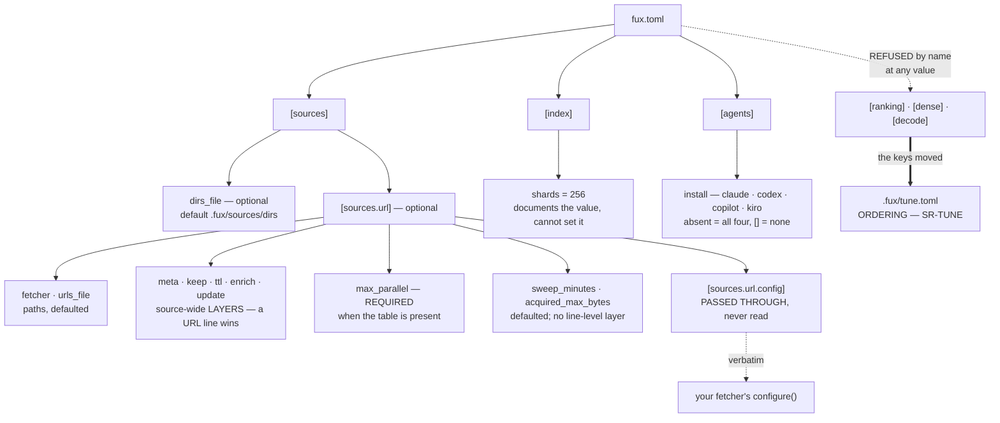

# SR-CONFIG — `fux.toml` and every property in it

## §1 — For humans

`fux.toml` is **policy. The source lists are the corpus.** That split is why
the file is so small: a repo with nothing but `[index] shards` in it is valid,
because what gets indexed lives in `.fux/sources/dirs`, one entry per line.

Three properties of the schema are worth knowing before you read the table.

**Every key fux reads is validated, loudly, with the file and the offending
value named.** A typo is a stopped run, not a silent default — a misconfigured
source that quietly indexes nothing looks exactly like a ranking problem, and
costs a day to diagnose.

**Exactly one table is deliberately *not* read: `[sources.url.config]`.** It is
handed to your fetcher verbatim and fux never looks inside it. That is what
stops one fetcher's vocabulary — `cdp_port`, `settle_ms` — from leaking into
fux's schema and turning the adapter cap into a formality. Same discipline as
PEP 518's `[tool.*]` tables.

**Three tables are refused by name rather than ignored.** `[ranking]` and
`[dense]` moved to `.fux/tune.toml`, and `[decode]` followed on 2026-09-11 (its
`max_table_rows` now sits in tune.toml's `[index]`). A config carrying any of
them stops the run with the new home in the message. A key that is quietly not read is worse than
one that stops the run, because the reader believes their setting is in force
and diagnoses a ranking problem instead of a config one.

**Diagram — Mermaid and its ASCII twin. Update both, always, together.**



<details>
<summary><b>ASCII twin</b> — the same diagram, for terminals, diffs, and any reader without a Mermaid renderer</summary>

```text
   fux.toml
     |
     +-- [sources]
     |     +-- dirs_file       optional  default .fux/sources/dirs
     |     |
     |     +-- [sources.url]   optional -- the whole URL source
     |           +-- fetcher       path, default .fux/fetchers/http.py
     |           +-- urls_file     path, default .fux/sources/urls
     |           +-- meta          "hashed" (default) | "plain"
     |           +-- keep          true (default) | false     -- a LAYER
     |           +-- ttl           "24h" (default), a duration -- a LAYER
     |           +-- enrich        false (default) | true     -- a LAYER
     |           +-- update        "auto" (default) | "never"  -- a LAYER
     |           +-- max_parallel  REQUIRED -- the only key with no default
     |           +-- sweep_minutes 60 (default)
     |           +-- acquired_max_bytes  absent = the store's own default
     |           +-- [sources.url.config]
     |                 PASSED THROUGH VERBATIM -- fux never reads a key
     |                        |
     |                        +--> your fetcher's configure(config)
     |
     +-- [index]
     |     +-- shards = 256   documents the value; cannot change it
     |
     +-- [agents]
     |     +-- install        absent = claude, codex, copilot, kiro; [] = none
     |
     +-- [ranking]  REFUSED --+   an ERROR naming the new home,
     +-- [dense]    REFUSED --+   at any value, never ignored
     +-- [decode]   REFUSED --+
                              |
                              v
                 .fux/tune.toml   ORDERING, plus [index] -- SR-TUNE
```

</details>

### Examples

Everything the loader reads, annotated:

```toml
[sources]
dirs_file = ".fux/sources/dirs"      # optional; this IS the default

[sources.url]
fetcher      = ".fux/fetchers/http.py"  # YOUR code; fux loads it by path
urls_file    = ".fux/sources/urls"      # one URL per line, a file not an array
meta         = "hashed"                 # the default; "plain" for public content
keep         = true                     # retain fetched bytes in .fux/acquired/
ttl          = "24h"                    # ask-time: how long a citation may go unchecked
enrich       = false                    # whether `fux enrich` plans work for these URLs
update       = "auto"                   # update-time: "never" pins this source
max_parallel = 4                        # REQUIRED when this table is present
sweep_minutes = 60                      # how often `fux daemon` re-checks

[sources.url.config]
greeting = "hello"                      # the fetcher's vocabulary, never fux's

[index]
shards = 256                            # documents the value, cannot set it

[agents]
install = ["claude", "codex", "copilot", "kiro"]  # absent = all; [] = none
```

A rejected key, named precisely rather than defaulted:

```console
$ fux ingest
error: /repo/fux.toml: [sources.url] meta must be "hashed" or "plain" (got 'hased')
# exit 1
```

---

## §2 — For agents

### Context

Configuration is where a tool's scope quietly expands. Every adapter wants a
key; every key becomes a compatibility obligation; and a schema that knows
about `cdp_port` has already absorbed one integration's vocabulary into the
engine.

Fux's adapter cap only survives if configuration stays small enough that
extending it is visibly a decision rather than a convenience.

### Decision

**1. Root discovery: the nearest ancestor holding `fux.toml` or `.git`.**
`fux.toml` wins when both are at the same level. Not finding a root is not an
error in the loader — the caller decides whether it is fatal, which is why
`fux doctor` can report on a directory that `fux ask` refuses.

**2. `fux.toml` is policy; the source lists are the corpus.** There are no
required *tables*: a file holding nothing but `[index] shards` is valid.
`[sources] dirs_file` says where the directory list is and defaults to
`.fux/sources/dirs` ([SR-DIR-LIST](0120_dir-list.md) decision 1).

**3. `[index] shards` documents 256 and cannot change it.** Supplying any other
value is an error, not a silent override: the shard function is
`blake2b(id, digest_size=1)`, and changing the count rewrites every path in the
tree. The key exists so the number is *visible* rather than folklore.

**4. `[sources.url]` is entirely optional.** Absent means no URL source, and
`fux ingest` has nothing to do.

**5. `fetcher` and `urls_file` default to `.fux/fetchers/http.py` and
`.fux/sources/urls`.** Both are repo-relative paths, and both defaults are the
declared `.fux/` layout ([SR-DOTFUX](0102_fux-directory.md)). The default is
the plain-GET fetcher ([SR-HTTP-FETCHER](0119_http-fetcher.md) decision 1).

⚠ **This said *"a URL line carrying no `fetch=` means `fetch=http`"* until
2026-09-12, and it contradicted the next paragraph** (W-140 row 10). A bare line
takes **whatever `[sources.url] fetcher` names** — `urlsrc.resolve_urls` reads
its *stem* — so in a repo configured with `fetcher = ".fux/fetchers/cdp.py"`, a
bare line means `fetch=cdp`. The sentence was true only of a repo that had left
the key alone, and false in exactly the case a consumer with a signed-in-Chrome
fetcher is in. **The paragraph below always had it right**, which is the shape
W-83 taught: a record contradicting itself inside one file passes every
mechanical check fux has.

**`fetcher` carries two things, deliberately.** It is the file used by a line
that declares no `fetch=`, **and** its directory is where a `fetch=<name>`
resolves — `<parent of fetcher>/<name>.py`. One key, so a consumer who keeps
their fetchers somewhere other than `.fux/fetchers/` moves all of them at once
and no line has to know. A second key naming the directory would be two values
that must agree.

**6. `meta` is `"hashed"` by default, `"plain"` by explicit opt-in.** Hashed
closes an ACL-mismatch leak, so the default is a safety property rather than a
preference. Any other value is an error.

**7. `max_parallel` is REQUIRED whenever `[sources.url]` is present**, and it is
the only key in the file with no default.

| case | behaviour |
|---|---|
| `[sources.url]` live, `max_parallel` live | its value, validated |
| `[sources.url]` live, `max_parallel` absent or commented | **`FuxError`**, naming the key and quoting the line to paste |
| `[sources.url]` absent entirely | **no error** — nothing fetches, so there is nothing to bound |

**The third row is a drawn line, not an oversight.** A docs-only repo forced to
declare a fetch bound is a repo where the key is noise, and **noise is how a
safety value stops being read.** What is forbidden is a repo that *can* fetch
and does not say how hard.

⚠ **Reversing the file's own "every key has a default" for exactly one line is
justified by the failure mode**: an implicit concurrency is not a thing a person
discovers by reading their config, and the damage it prevents — a hundred
sockets opened at their own intranet — lands on a third party who never chose
it.

**Requiredness is also the migration path, and nothing else could have been.**
`fux setup` is write-if-missing ([SR-DOTFUX](0102_fux-directory.md)), so a
template change reaches **new repos only**. A loader error reaches existing
ones, because it puts the key in front of the person on their next command with
the value to type. A rewrite was refused: it would eat a consumer's
annotations.

**7a. Two values wear the name `max_parallel`, and they get different kinds of
refusal** — Arpit's standing rule, *state the cost, don't clamp the knob*:

| value | kind | treatment |
|---|---|---|
| `MAX_PARALLEL` in the fetcher module | **capability** | exceeding it is a correctness violation → **clamped down, loudly**, naming the module and the number |
| `[sources.url] max_parallel` | **policy** | merely rude → **honoured, with a warning stating the cost**; never clamped down |
| `max_parallel < 1` | **broken** | `FuxError` |

**Silence is politeness, not the fetcher's ceiling.** A declaration answers
*what is safe* — `http.py`'s `8` is a true statement about a fetcher that
builds a fresh `Request` per call — and never *what is polite unasked*. Nobody
declared `8` for a given repo's wiki, so the resolver applies
`min(declared, DEFAULT_MAX_PARALLEL)`. The default can only ever **lower**:
`cdp.py`'s `MAX_PARALLEL = 1` still wins. And it decides only what **saying
nothing** means — `max_parallel = 8` against a fetcher declaring `8` returns
`8`, silently.

**The bound is per fetcher group, not per host.** Twenty hosts behind `http.py`
share one budget — politer than needed — and five hundred URLs on one host get
that same budget, which is the case it exists for. The crawler literature's
politeness constraint is per-host, and the common case at the design point is
one wiki; shipping both now would mean picking a second default with no more
evidence than the first. **A per-host key is promoted when a 429 is actually
observed**, and not before.

⚠ **This key belongs here and not in `.fux/tune.toml`.** SR-TUNE's mechanical
test is *does changing it change a byte in `.fux/index/`?* — and this does not,
so the test alone would misfile it. The second clause settles it: it is not a
ranking value either. It is **operational**, so it sits beside the other
`[sources.url]` keys.

**8. `[sources.url.config]` is validated as *a table* and nothing more.** It is
passed to the fetcher's `configure()` verbatim. Fux never reads a key inside it,
and must never gain a reason to.

**8a. 🔴 It has TWO LEVELS since 2026-09-14, because one level was broken for
any repo that used both shipped fetchers** (Arpit: *"how about create 2
separate tables, 1 for http and 1 for cdp"*).

**The defect, stated plainly.** One table was handed verbatim to *every*
fetcher, and both shipped `configure()` implementations **raise** on a key they
do not know. `http.py` knows `timeout_s`, `user_agent`, `max_bytes`; `cdp.py`
knows `cdp_port`, `cdp_host`, `launch_chrome`, `load_timeout_s`. Only
`fetcher_max_parallel` is shared. So in a repo loading both, `cdp_port` made
every `http.py` fetch refuse and `timeout_s` made every `cdp.py` fetch refuse:
**the sole configurable state was the empty table.** That is why the scaffolded
`fux.toml` could only ever ship the block commented out — a fact visible in the
file for months and never traced to its cause.

**The shape:**

| where | who gets it |
|---|---|
| a scalar at the top of `[sources.url.config]` | **every** fetcher |
| `[sources.url.config.<stem>]` | **only** the fetcher whose file is `<stem>.py` |

- **`config.py::fetcher_config` is the only thing that reads either level**, and
  `UrlSource.config_for` delegates to it, so the ingest path and the answer path
  cannot resolve a fetcher differently.
- ⚠ **The adapter cap is NOT breached, and the distinction is exact.** Decision
  8 forbids fux declaring a *key* — `cdp_port` must never appear in
  `KNOWN_KEYS`, and `tests/test_config.py` asserts no `sources.url.config.*`
  key is declared. What fux matches here is a **table name against a filename it
  already knows**, which is the same information `fetch=<name>` resolution has
  used since [SR-FETCHER](0117_fetcher.md) decision 5. One naming rule, not two.
- **Only the TOP level is namespaced.** Everything inside a fetcher's own table
  passes through verbatim, nesting included, so a fetcher that wants structured
  config still gets it.
- ⚠ **This is a change of contract and it costs something**: a `dict` at the
  top level used to reach `configure()` and now does not. A consumer who nested
  config for one fetcher moves it one level, under that fetcher's name.
- **A sub-table naming no fetcher is ignored by the loader and caught by
  `doctor`** — `fetcher config tables`. Deciding whether `wiki` is a typo means
  listing `.fux/fetchers/`, which is a filesystem question and has no business
  in a TOML parser. Refusing there would also make `fux.toml` unloadable on a
  machine that has not run `fux setup`.

**9. `[agents] install` is a closed, validated set** — `claude`, `codex`,
`copilot`, `kiro` — naming which vendors `fux setup` writes policy renderings
for ([SR-AGENT-POLICY](0132_agent-policy.md) decision 5). ⚠ **`codex` joined
2026-09-06** ([SR-AGENT-POLICY](0132_agent-policy.md) decision 11): the set is
open by construction, and **growing it is a config-schema change as well as an
installer change** — a value this file accepts and the installer has no row for
writes nothing, silently, which is exactly what closing the set was meant to
prevent. `tests/test_setup_agents.py::test_every_known_agent_has_a_rendering`
is what ties the two lists together; they live in different files and drift
otherwise. The set is closed
because the failure mode of a typo here is the worst kind: the file a consumer
asked for is simply never written and nothing says so.

**Absent and `[]` are deliberately different**, which is unusual for this schema
and is the point: every other key treats absent as *"take the default"*, and so
does this one — but `install = []` is a consumer who said **no**, and it is the
durable form of `--no-agents`. Collapsing the two would make the opt-out
unwritable. **Order is normalised, not preserved**, so what gets written cannot
depend on the order someone happened to list them in.

**10. A retired key errors with instructions — at any value.** `dirs = []` stops
the run exactly as `dirs = ["docs"]` does: the key is retired, not merely
unused, and a reader that tolerates the empty form teaches people the key still
exists.

| retired | says |
|---|---|
| `[sources.url] urls` | put one URL per line in `.fux/sources/urls` |
| `[sources.url] middleware` | renamed to `fetcher`; move the file to `.fux/fetchers/` ([SR-FETCHER](0117_fetcher.md) decision 7) |
| `[sources] dirs` | put one directory per line in `.fux/sources/dirs`; a line may carry `archived=true` ([SR-DIR-LIST](0120_dir-list.md) decision 1) |
| `[ranking]` (whole table) | moved to `.fux/tune.toml`; run `fux setup` to write the file, move the keys across, delete the table ([SR-TUNE](0135_tuning.md) decision 7) |
| `[decode]` (whole table) | moved to `.fux/tune.toml [index]` on 2026-09-11 (Arpit), beside `max_phrases`; move `max_table_rows` across and delete the table ([SR-TUNE](0135_tuning.md) decision 13) |
| `[dense]` (whole table) | **removed**, not relocated — the lane it configured no longer exists ([SR-ASK](0103_ask.md) decision 9). The error states the removal, the verdict behind it, and that ranking does not move, because `mode` defaulted to `off` |

⚠ **`[dense]` is the case worth noting.** It was retired to `tune.toml` and
then the lane was deleted, so a config old enough to carry it is old enough to
be forwarded twice — and **the second hop would have landed on nothing.** A
forwarding address must point at something that exists, or it is worse than a
plain refusal.

⚠ **`[decode]` is the case that tripped this record's veto without reopening it.**
[SR-TABULAR](0150_tabular.md) added it on 2026-09-06 as a **fourth** top-level
table — veto condition 2 below — and nothing here was amended. It was found on
2026-09-11 while a fifth (`[extract] max_phrases`) was being proposed, and
Arpit's ruling moved both keys to tune.toml, which puts the surface back at
three. **The veto was breached for five days and is now satisfied, not
narrowed.**

**The cost of the table retirements, said out loud: this breaks every repo that
set one of the keys.** Nothing migrates automatically, because a migrator would
have to write TOML into a file this project promised never to rewrite. The error
message is the migration instruction, which is the whole of what is offered.

**11. Validation errors name the file and the offending value.** `FuxError` at
the boundary, rendered by the CLI, exit 1. Numeric keys are validated as
non-negative numbers with **`bool` rejected explicitly**, because `bool` is an
`int` subclass in Python and `archived_weight = true` would otherwise parse
silently as `1`.

**11a. `urls_file` lives in `[sources]`, beside `dirs_file`** (Arpit,
2026-09-14). The two committed source lists are one kind of thing and are now
named in one place; `[sources.url] urls_file` is **refused by name** with the
new home in the message.

- ⚠ **`[sources.url]`'s PRESENCE still enables URL ingestion.** The key names
  the list; it does not turn anything on. That separation is what the move
  makes visible rather than changing: a repo with no `[sources.url]` still
  resolves a path — `fux add <URL>` needs one to write into — and still fetches
  nothing.
- `UrlSource.urls_file` keeps carrying the resolved value, so the twelve
  call sites that hold a `UrlSource` read one field as before. `Config.urls_file`
  is what the two call sites without one now read, in place of a
  `config.url is not None else DEFAULT_URLS_FILE` conditional that can no
  longer disagree with the file.

**12. `[sources.url]` gained four keys on 2026-09-01, and every one of them is
a source-wide *layer*, not a setting.** `keep` ([SR-ACQUIRED](0145_acquired-plane.md)),
`ttl` ([SR-URL-FRESHNESS](0147_url-freshness.md)) and `enrich`
([SR-PII](0148_pii.md)) each sit between the built-in default and the URL
line, exactly as `meta` and `fetcher` already did — **a line that declared the
attribute always wins**, and `urlsrc.resolve_urls` is the one place that
resolves all of them.

- **`ttl` is validated by the source list's own duration grammar**
  (`sourcelist.parse_duration`), never by a second copy here. A hand-written
  `ttl=1x` in the list and a `ttl = "1x"` in this file therefore fail with the
  same rule — two parsers for one grammar is how the two drift apart.
- **`keep` and `enrich` reject a non-`bool` explicitly.** Same reason as
  decision 11: `bool` is an `int` subclass, so the check is on the type, not on
  truthiness.
- ⚠ **`acquired_max_bytes` is the exception and has NO line-level layer.** It
  bounds `.fux/acquired/` (SR-ACQUIRED decision 8) and it is a property of the
  disk the store sits on, not of one URL — a per-line override could only ever
  raise somebody else's bound. `None` means the store's own default rather than
  a number frozen here, so raising that default does not require editing every
  `fux.toml` that never thought about the question.
- ⚠ **`fetch_at_answer` is the SECOND key with no line-level layer** (W-174,
  2026-09-14), and it is not an exception for `acquired_max_bytes`'s reason.
  That one is a property of the disk; this one is a property of *reaching the
  source*, and [SR-ACQUIRED](0145_acquired-plane.md)'s own two-layer test says
  a source-wide layer means something exactly when the attribute answers
  *"how do I reach these pages?"* — which is the question it asks. A line layer
  is therefore **possible and deliberately not built**; it would need its own
  argument, not an extension of this one.

⚠ **`acquired_max_bytes` was documented before it was parsed, and that is the
defect this decision closes.** SR-ACQUIRED decision 8 named the key and the
ownership table gave it to this file on 2026-09-01, while `config.py` never read
it and `urlsrc.fetch_all` reached for it through an **undefined name** — a
`NameError` on every retaining fetch, which 17 tests caught only because they
fetch. It is the [W-83](../work/WORKLOG.md) shape again: a record can be
accepted, a component can be assigned, and nothing mechanical reads the record
against the code.

**`[sources.url] update`** — the source-wide layer of the URL list's
`update=` attribute ([SR-URL-LIST](0116_url-list.md) decision 14). `"auto"` or
`"never"`; a line still wins; anything else is refused by name with the two legal
values in the message, like every other closed-set key here.

⚠ **It is validated as a CLOSED WORD SET and not through the duration grammar**,
which is the one thing about it worth recording in this record. `ttl` two keys
above goes through `sourcelist.parse_duration` precisely so a hand-written
`ttl=1x` and `[sources.url] ttl = "1x"` fail identically (decision 12). `update`
must never acquire that treatment: it is update-time where `ttl` is ask-time,
and a duration here would make the two indistinguishable at a glance.

**13. THE DECLARED KEY BLOCK — a key is real only if it is listed here.**
[SR-LAW-0](0002_LAW-0-authority.md) decision 6, and the reason it exists is two
recorded failures in this very file's subject: `acquired_max_bytes` was named in
prose and never parsed, and `[sources] types_file` was advertised by a schema and
read by nothing. **Prose cannot create a key.** This block can, because
[`tests/test_sr_config_keys.py`](../tests/test_sr_config_keys.py) asserts it
equals `config.py`'s `KNOWN_KEYS` / `OPAQUE_TABLES` / `REFUSED_KEYS` **in both
directions** — a key here that nothing parses fails, and a key `config.py`
parses that is missing here fails too.

**Three sigils, and no fourth.** `+` a key fux reads · `*` a table fux passes
through without reading a key inside it · `-` a spelling refused **by name**,
at any value, with an error naming the new home.

```keys
+ sources.dirs_file
+ sources.urls_file
+ sources.url.fetcher
+ sources.url.meta
+ sources.url.keep
+ sources.url.ttl
+ sources.url.enrich
+ sources.url.update
+ sources.url.fetch_at_answer
+ sources.url.max_parallel
+ sources.url.sweep_minutes
+ sources.url.acquired_max_bytes
* sources.url.config
+ index.shards
+ agents.install
+ observe.max_ms
- sources.dirs
- sources.types_file
- sources.url.urls
- sources.url.urls_file
- sources.url.middleware
- ranking
- dense
- decode
```

⚠ **`sources.url.config` is `*` and must never become a list of `+` rows.**
Declaring `cdp_port` or `timeout_s` here would breach the adapter cap through the
back door — one fetcher's vocabulary inside fux's config surface, which every
future fetcher would then have to be argued against (decision 8). The sigil is
the boundary.

**14. An undeclared key is REFUSED, not ignored** (2026-09-12, W-122; the defect
was [W-140](../work/OPEN-WORK.md) row 8). `fux.toml` silently ignored a
misspelled key, so `dirs_fil = "…"` left the consumer's setting inert with
nothing said — the same failure mode as a key documented and never parsed, from
the other end. `.fux/tune.toml` has rejected unknown tables and keys by name
since it existed ([SR-TUNE](0135_tuning.md)), and this is that behaviour, here.

⚠ **It needed decision 13 first, and that is why it waited.** Rejecting a key
requires a set of real keys to compare against, and hand-writing a second set
inside `config.py` would have built the duplicate source of truth L0 exists to
remove. **One set, in the record, bound to the code by a parser.**

**15. `config.schema.json` is DELETED** (2026-09-12). Every field in it was a
`doc:` string describing a key — *"describes a rule a second time"*, which
SR-LAW-0 decision 4 puts on the forbidden row. Nothing loaded it, and nothing
compared it to `config.py`, which is exactly how it came to advertise a
`types_file` key that did not exist.

⚠ **`derive/runtime.schema.json` is NOT deleted, and W-122's plan was wrong
about it.** The plan called both files documentation-only; that is true of this
one and false of that one —
[`tests/derive/test_runtime_schema.py`](../tests/derive/test_runtime_schema.py)
asserts its struct string, its field codes, its doc-table field set and its
runtime version against `derive/format.py` in both directions. A declaration a
test holds equal to the code **enforces**, and SR-LAW-0 decision 4 permits an
enforcement. Deleting it would have removed a live gate to satisfy a rule it
already satisfies.

⚠ **Decisions 13–15 were recorded two commits before their code, which is the
inverse of the failure Law zero guards.** `24c0a3d` (2026-09-12) landed this
record; `6f518c6` then held `src/fux/config.py` and the deletion of
`config.schema.json` back, on the reasoning that a session should not write a
record out of someone else's diff. But the record was already written — so what
the holdback produced was two commits in which **this record described a refusal
the engine did not perform**: a reader checking `dirs_fil` against decision 14
was told it errors, and it did not. The code lands with this line.

⚠ **A record ahead of its code reads as authority exactly as a record behind it
does**, and `tests/test_sr_freshness.py` sees neither — it checks that an owning
record was *touched* in a change, never what the record says. This is the W-83
shape with the two halves swapped, and it is unguarded for the same reason.

**`[observe] max_ms`** (W-170) — how long fux waits for one `.fux/observers/`
file before abandoning it. Positive integer milliseconds, default `50`.

**It is in `fux.toml` and not in `.fux/tune.toml`** because it is not a ranking
knob: it bounds what happens **after** the answer is rendered and cannot move a
result. [SR-TUNE](0135_tuning.md) decision 1's boundary rule is about what
changes an answer.

⚠ **It abandons, it does not kill** — [SR-OBSERVE](0157_observe.md) decision
10b. Past the cap fux stops waiting; the observer may run until the process
exits, because Python cannot safely interrupt arbitrary consumer code.


### Consequences

- **The config fits on a screen**, so a new consumer reads all of it.
- **The adapter cap holds at the schema level.** Adding a fetcher needs no fux
  change at all — which is the property that makes "three adapters" a decision
  rather than a queue.
- **`shards` is a documentation-only key**, which is unusual and mildly
  surprising. Worth the surprise: the alternative is folklore about where 256
  comes from.
- **A third source-list path constant lives here, with no key at all.**
  `DEFAULT_TYPES_FILE = ".fux/formats.toml"` joins `dirs_file` and `urls_file`
  because paths have one home — but it has **no `fux.toml` key**, deliberately:
  the types list is optional, its absence is meaningful (the built-in default
  applies), and a key whose only job is to relocate an optional file is surface
  nobody asked for. Decided in [SR-TYPES](0128_types-list.md). ⚠ **It was
  `.fux/sources/types` until 2026-09-11** (SR-TYPES decision 12);
  `LEGACY_TYPES_FILE` keeps the old path so every reader can refuse it by name.
- 🔴 **`[sources] types_file` is refused by name, since 2026-09-11.** Found the
  same day: `config.schema.json` advertised the key — default
  `.fux/sources/types`, *"OPTIONAL. Absent means…"* — while this record said no
  key exists and `load()` never read one. A consumer who set it got silence and
  the default path. The schema entry is deleted and the key is now a loud error
  in `load()`, the same treatment `[sources] dirs` gets; held by
  `tests/test_config.py::test_a_types_file_key_is_refused_by_name`.
- ⚠ **The directory list was include-only, with no exclusions, when this was
  written** — so committed measurement evidence under `work/regression/`
  contaminated the corpus it measures. **No longer true (corrected 2026-09-14):**
  a `!` line in `.fux/sources/dirs` ([SR-DIR-LIST](0120_dir-list.md) decision 2a)
  and [`.fux/.fuxignore`](0144_fuxignore.md) both exclude; what remains owed is
  that `fux remove` still writes `!` where `.fuxignore` is the stated home
  ([SR-FUXIGNORE](0144_fuxignore.md) Consequences).
- ⚠ **`[sources.url]` now ships live in a scaffolded repo, and one behaviour
  changes with it.** `fux add <URL>` used to record the line and print *"no
  `[sources.url]` in fux.toml, so nothing can fetch this line yet"*; in a repo
  scaffolded after `max_parallel` became required, it fetches. **The gate did
  not disappear — it moved to where it always really was:**
  `.fux/sources/urls` is empty, and the only thing that puts an address in it is
  an explicit `fux add <URL>`. **L4's *explicit, fenced, opt-in* is satisfied by
  the verb, not by a commented table** — and a table you must uncomment before
  the tool works is friction, not a fence. The refusal branch stays for repos
  that genuinely have no `[sources.url]`.
- ⚠ **A record can be amended and self-contradicting in the same commit, and
  every mechanical check will pass.** This record once stated *"`None` means
  whatever the fetcher declares"* four paragraphs above *"default `4` when a
  fetcher declares more"*; the code implemented the second sentence's opposite,
  and an unconfigured `fux ingest` opened eight concurrent connections to one
  intranet host. **The freshness gate checks that a record was *touched*, never
  that it is *coherent*.** That is the reason this record carries no amendment
  layers at all.

### Alternatives considered

- **Configure in `pyproject.toml` under `[tool.fux]`.** Rejected: fux indexes
  repositories that are not Python projects, and half of them have no
  `pyproject.toml`.
- **Read `cdp_port` and friends directly**, so the CDP template needs no
  `configure()`. Rejected explicitly: it puts one fetcher's vocabulary in fux's
  schema and breaches the adapter cap through the back door.
- **Make `shards` configurable.** Rejected until measured. It is a
  format-affecting constant.
- **Default `meta` to `"plain"` for readability.** Rejected: the default has to
  be the safe one, and hashed is the ACL-safe one.
- **Accept unknown keys silently** for forward compatibility. Rejected: a typo
  in `urls_file` that silently indexes nothing is indistinguishable from a
  retrieval bug.
- **URLs as a TOML array.** Rejected on diff and merge behaviour at enterprise
  scale — the reason the retired key errors loudly today.
- **Ship `max_parallel` commented out with a default.** Rejected: a consumer
  opening `fux.toml` would see a comment about a number rather than a number,
  which exposes nothing. A required key is what puts it in front of them.
- **A per-host concurrency key alongside the per-fetcher one.** Rejected for
  now under decision 7a: it means picking a second default with no more evidence
  than the first.

### Reference (required)

- The loader and every validation message —
  [`src/fux/config.py`](../src/fux/config.py); the `[sources.url]` dataclass
  docstring is the normative statement of the opaque-table rule; the resolver —
  `resolve_parallel` in
  [`ingest/urlsrc.py`](../src/fux/ingest/urlsrc.py); the written template —
  `_CONFIG` in [`setup.py`](../src/fux/setup.py).
- A real config and the errors it produces —
  [`work/regression/2026-08-18-ingest-and-index/`](../work/regression/2026-08-18-ingest-and-index/report.md) §6
  and its [fixture](../work/regression/2026-08-19-w54/evidence/fixture.sh),
  which builds a repo from nothing with `fux setup` and runs the whole URL path
  offline.
- The opaque-table discipline this copies — PEP 518 `[tool.*]`:
  https://peps.python.org/pep-0518/#tool-table
- TOML, the format: https://toml.io/en/v1.0.0

### Veto condition

**Reopen this decision if** fux ever reads a key inside `[sources.url.config]`,
if a fourth top-level table appears, or if a source cannot be expressed without
a new engine-level key.

**How to check it:**

```bash
# 1. the opaque table is still opaque — this is the adapter cap, at the schema level
grep -rn 'config\[' src/fux/ | grep -v 'test'
# expect: no output. Fux validates that it is a table and passes it on.

# 2. the config surface has not grown
grep -oE '\bdata\.get\("[a-z]+"' src/fux/config.py | sort -u
# expect exactly: agents, index, sources — and nothing else.
# A FOURTH top-level table is the veto; a new key inside these three is not.

# 3. the retired tables still error rather than being silently ignored
grep -n 'ranking' src/fux/config.py
# expect: the refusal, naming .fux/tune.toml. Deleting it does not restore the
# keys — it makes a stale fux.toml quietly index-and-rank the wrong way.

# 4. every rejected value still names the file and the value
fux ingest 2>&1 | head -1
# on a bad key, expect: error: <path>/fux.toml: <what> must be <what> (got <value>)

# 5. the written template still interpolates the concurrency default
grep -n 'DEFAULT_MAX_PARALLEL' src/fux/setup.py src/fux/ingest/urlsrc.py
# expect: setup.py interpolates the constant rather than typing a number —
# a comment restating a constant is exactly the drift this key was added to fix
```

---

## References

*Every source this record cites, gathered in one place. §2's **Reference
(required)** names the grounding; this is the complete list. An archived
document is never listed here — the body may name one, but archive is not
evidence.*

**Records** — [SR-LAWS](0001_LAWS.md) · [SR-DOTFUX](0102_fux-directory.md) ·
[SR-ASK](0103_ask.md) · [SR-FETCHER](0117_fetcher.md) ·
[SR-HTTP-FETCHER](0119_http-fetcher.md) · [SR-DIR-LIST](0120_dir-list.md) ·
[SR-TYPES](0128_types-list.md) · [SR-AGENT-POLICY](0132_agent-policy.md) ·
[SR-ARCHIVED-CONTENT](0134_archived-content.md) · [SR-TUNE](0135_tuning.md)

**Code**

- [`src/fux/config.py`](../src/fux/config.py)
- [`src/fux/ingest/urlsrc.py`](../src/fux/ingest/urlsrc.py)
- [`src/fux/setup.py`](../src/fux/setup.py)
- [`src/fux/tune.py`](../src/fux/tune.py)
- [`tests/ingest/test_url_parallel.py`](../tests/ingest/test_url_parallel.py)
- [`tests/test_setup.py`](../tests/test_setup.py)

**Measured evidence**

- [`work/regression/2026-08-18-ingest-and-index/report.md`](../work/regression/2026-08-18-ingest-and-index/report.md)
- [`work/regression/2026-08-19-w54/evidence/fixture.sh`](../work/regression/2026-08-19-w54/evidence/fixture.sh)

**Papers and specifications**

- PEP 518 `[tool]` table — the opaque-config-table discipline this copies
  <https://peps.python.org/pep-0518/#tool-table>
- TOML v1.0.0 — the config format
  <https://toml.io/en/v1.0.0>
