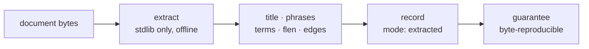

# SR-EXTRACTED — the deterministic ingest mode

## §1 — For humans

Every record Fux commits carries `"mode":"extracted"`. This record says what
that word promises: **everything in the record was taken from the document's own
bytes, and nothing was invented.** Title, phrases, terms, per-field lengths,
edges — each is a function of the file, computed by stdlib code, offline, with
no model anywhere in the path.

That is why the mode is worth naming at all. `mode` is not documentation — it is
a property in the committed wire format, sitting beside `meta` in every line of
`.fux/index/*.jsonl`. A reader who sees `extracted` may rely on the whole chain:
same bytes in, same index out, no network, no model, no drift. **Every guarantee
stated in the paper is stated for this mode and no other.**

The name was chosen to *agree* with the ported edge-grade vocabulary rather than
merely avoid it: `EXTRACTED` already means "deterministic, no model" as an edge
grade, so the mode and the grade say the same thing with the same word. Its
counterpart is [SR-ENRICH](0137_enrich.md), which absorbed SR-ENRICHED on
2026-08-27 (W-82 ruling 6) and carries its taxonomy verbatim; it is accepted and
unbuilt.

**Diagram — Mermaid and its ASCII twin. Update both, always, together.**



<details>
<summary><b>ASCII twin</b> — the same diagram, for terminals, diffs, and any reader without a Mermaid renderer</summary>

```text
  +----------+     +------------------+     +----------------------+
  | document | --> | extract          | --> | title · phrases      |
  |  bytes   |     | stdlib only,     |     | terms · flen         |
  |          |     | offline          |     | edges                |
  +----------+     +------------------+     +---------+------------+
                                                      |
                                                      v
                                        +-----------------------------+
                                        | record: mode = "extracted"  |
                                        | guarantee: byte-reproducible|
                                        +-----------------------------+
```

</details>

### Examples

**What the mode looks like on disk.** One record from this repo's own committed
index, pretty-printed; `terms` is truncated from 299 entries and `edges` from
42, marked where. **Keys are shown in a reading order and the shard sorts them
alphabetically** — every *value* is verbatim, the byte sequence is not. The
shard itself is one record per line, unindented.

```json
{
  "_format": "fux.index.v2",   // the shard's first line, once per file
  "analyzer": "v2",
  "tf_fields": ["body", "heading", "title", "path", "ctx"]
}
{
  "id":      "file:docs/index.md",
  "src":     "git",
  "loc":     "docs/index.md",
  "sha":     "e8005dd97a8caeb59205e0e4a945b1ed92acdc13",
  "ver":     1,
  "mode":    "extracted",
  "meta":    "plain",
  "mtime":   1787122917,
  "title":   "Fux docs — knowledge bundle root",
  "phrases": ["Fux docs — knowledge bundle root",
              "Core (read in this order)", "Decisions", "Build"],
  "terms":   {"0097ee914e37dedf": [1],
              "031b0e9051c7d6b4": [1],
              "0387c9370a386785": [1]},      // … 299 total
  "flen":    [691, 13, 8, 3],
  "edges":   [{"dst": "file:CLAUDE.md",           "grade": 10, "kind": "code"},
              {"dst": "file:README.md",           "grade": 10, "kind": "code"},
              {"dst": "file:docs/GLOSSARY.md",    "grade":  8, "kind": "code"}]  // … 42 total
}
```

**Read it as the contract.** Every value above is a function of
`docs/index.md`'s bytes, its path, and the corpus's own recorded link structure,
and of nothing else:

- `title` and `phrases` are the document's own headings.
- `terms` are hashes of tokens that literally appear in it, with per-field
  frequencies; the tf list is trimmed of trailing zeros, and most postings are
  body-only.
- `flen` is its per-field token counts, five of them, **raw and unweighted** —
  the weighting is a query-time policy and deliberately not committed.
- `mtime` is the document's git **commit** timestamp, which is a fact about the
  corpus's history rather than about the file on disk, and is committable for
  exactly that reason: a filesystem mtime differs per machine and would break the
  reproducibility this mode's name asserts.
- `edges` are links the document actually contains, graded `10` when the target
  resolved unambiguously and `8` when a backtick path resolved only by basename.

**Grade `6` — `INFERRED` — does not appear here and cannot**:
[`ingest/edges.py`](../src/fux/ingest/edges.py) reserves it and states it is
unused until the enriched tier. **That absence is the mode, visible in the
bytes.**

**And the guarantee it asserts** — same sources, same bytes:

```console
$ sha1sum .fux/index/*.jsonl > /tmp/a && fux ingest >/dev/null \
  && sha1sum .fux/index/*.jsonl > /tmp/b && diff /tmp/a /tmp/b && echo IDENTICAL
IDENTICAL
```

---

## §2 — For agents

### Context

The naming collided head-on with the ported edge-grade vocabulary, where
`EXTRACTED` already means deterministic and `INFERRED` already means
model-derived. The fork was worked in `ingest-mode-naming.compare.md`, **retired to
[`archive/compare/`](../archive/compare/README.md) on 2026-09-12** once its
reopen-trigger was spent; its matrix is folded into this record below, so the
decision is grounded here and not in an archive.

It stopped being a taste call the moment `mode` entered the committed wire
format. A rename now costs a format bump and a re-ingest of every corpus that
ever committed an index — a cost that is near zero today and rises with every
adopter, which is exactly the shape of damage CLAUDE.md's priority rule ranks
first.

### Decision

**1. The deterministic ingest mode is named `extracted`**, and that string is
the committed value of the `mode` property.

**2. `extracted` asserts a contract, not a label.** A record in this mode
guarantees: every property is a pure function of the document's bytes, its path,
the corpus's link structure and the two committed extraction limits in
`.fux/tune.toml [index]` (decision 9); no model was consulted at any point; no network
was touched (L4's fenced paths fetch *bytes*, and extraction is still
deterministic over them); the run is byte-reproducible.

**3. It is the default, and today it is the only mode that exists.** A record
carrying any other `mode` value is a defect until
the `enriched` mode ([SR-ENRICH](0137_enrich.md)) is built.

**4. Every guarantee in the paper and in every regression run is stated for this
mode.** A measurement taken under any other mode is a different experiment and
may not be compared against a pre-registered threshold.

**5. `inferred` is retired as a mode value** and is not valid. It survives only
in the frozen archived fidelity vocabulary.

**6. Extraction produces five tf fields** — `body`, `heading`, `title`, `path`,
`ctx`, in `store.TF_FIELDS` order — plus `flen`, the raw per-field token counts.

- **`title` and `path` are fields, not new content.** Both were already *in* the
  record (as `title`, and as `loc`); nothing is invented, because the title's own
  tokens and the path's own segments are taken from the document and its
  location. `title` used to be folded into the heading tokens because there was
  nowhere else to put it, and was silently double-counted; it now has its own
  field.
- **`ctx` carries enrichment vocabulary and is empty on a document nothing has
  enriched.** An empty trailing field is not written at all, so it costs nothing.
- **`flen` rather than a weighted length**, because a weighted length computed
  at ingest is a function of a query-time tunable
  ([SR-TUNE](0135_tuning.md) decision 6). Raw counts are facts; the weighting
  happens in `query/bm25f.py::derive_wlen`.

**7. Nothing model-derived is emitted, and no model is loaded.** `Extracted` is
four fields — `title`, `phrases`, `terms`, `flen` — every one a pure function of
the document's bytes and the analyzer.

⚠ **This makes the extracted-mode law easier to state, not harder.** *Every
field is taken from the document; nothing is invented* was always slightly
awkward about an embedding: **a vector is not *in* the bytes, it is a model's
reading of them** — and the model was a binary blob whose recipe was not in the
repo. A dense lane was built and measured and deleted
([SR-ASK](0103_ask.md) decision 9); that awkwardness went with it.
`tests/ingest/test_extract.py` keeps a test asserting its absence, because **a
removal is a decision, and a decision with no test is one a later session
re-implements by accident.**

**8. The heading grammar follows the file type.** Extraction once derived
headings with `^#{1,6}` alone while the type allowlist admitted `.rst`, `.adoc`
and `.org` — so **every heading in three of the six allowed types landed in the
body field**, and their `phrases` list was empty. Each format now gets its own
grammar: reStructuredText's full-width underline, AsciiDoc's `= Title` /
`== Section`, Org's `* Heading`. Two guards are the substance rather than the
regexes:

- **Org requires the space** after the asterisk run, or `*emphasis*` and
  `**bold**` at the start of a line read as headings — the false positive that
  format invites.
- **reStructuredText requires the rule to run the width of the text**, which is
  the spec's own rule and is what keeps a row of dashes inside a table out of the
  heading field.

**A decoded document always uses the Markdown grammar**, because a decoder emits
Markdown by contract ([SR-DECODE](0139_decode.md) decision 2). Only an
already-prose file takes a different pattern.

⚠ **Amended 2026-09-06: the Markdown grammar is no longer here.** It moved to
`decode/_markdown.py`, which `refer/_chunk.py` reads too — see
[SR-DECODE](0139_decode.md) decision 14 for why one grammar and what the two
private copies had already drifted into. Extraction keeps the three
already-prose patterns above and nothing else.

**What changed for extraction, and it is not cosmetic.** The regex could not see
a code fence, so a `# Install dependencies` line inside a ```bash block was
counted as a heading — given heading-field weight, published in `phrases`, and
**subtracted from the body field**. Both halves were wrong: a shell comment
outranked real prose, and the words a reader can see were words the index could
not. `_headings_and_body` now returns the headings and the stripped body from
one call, so whatever counted as a heading is exactly what left the body — they
can no longer disagree.

⚠ **This re-ranks every document containing a fenced code block**, which in this
repository is most of them. It landed **unmeasured**, on Arpit's 2026-09-06
ruling that a defect fix does not wait on a measurement to tell it a shell
comment was never a heading.

✅ **MEASURED 2026-09-12, and the ruling was right.**
[VERDICT-W115](../work/regression/2026-09-12-reaim-and-instruments/VERDICT-W115.md):
on 30 probes where a document's *only* mention of the query term is a `#` line
inside a ```bash block, the **pre-change engine puts that document at rank 1 in
all 30** — and at every level of prose evidence the correct document has, from
one sentence to eight. The shipped grammar puts it at rank 1 in **none**.
`hit@1` 0/30 → 30/30, `p ≈ 0`, with headroom **proven** under
[SR-RS](0133_predictions.md) decision 22c(b) and a placebo family that does not
move.

⚠ **Three corpora could not see this before, and the stated reason was wrong.**
It was recorded as *"not one of the formats W-115 touches"*; `.rst`, `.adoc` and
`.org` in fact predate this change and were untouched by it, while **Markdown —
which this decision governs — is the default for every extension without its own
pattern**. The golden ladder had the right formats and the wrong content: **1 of
800** `.md`/`.txt` documents carries a `#` inside a fence. A corpus cannot show
you a change it never triggers (SR-RS decision 23b).

**9. `phrases` holds a document's first `max_phrases` headings, in document
order, and the cap is committed configuration** — `.fux/tune.toml [index]
max_phrases`, default **32** (Arpit, 2026-09-11; it was a hard-coded `12`).

- **Display only.** `heading` tf and `flen` are built from **every** heading, so
  the cap never hides a document from search; it bounds what `fux ask` can show
  as `§` sections and what `fux answer --no-refer` prints. `tests/ingest/
  test_extract.py::test_the_cap_truncates_display_never_ranking` holds that.
- **Why 32, measured on this repository's 563 markdown documents** (median 7
  headings, p95 19, p99 39, max 338). At **12**, 87 documents were truncated and
  1 055 headings lost, and **262 of the 1 584 slots in truncated documents held
  template headings** (`Context`, `Decision`, `Definition of done`) — the
  headings that told documents apart were the ones cut. At **32**, 98.2 % of
  documents keep every heading and 91 % of all headings survive, for ~28 KB
  (~0.3 %) more committed index. Unlimited was declined: +63 KB, and one
  document alone would print 338 lines under `answer --no-refer`.
- ⚠ **Post-hoc and single-corpus**, and it is not a ranking claim: no query
  result changes order, only what is displayed beside it. **The repeat is not
  deduplicated** — a corpus-wide phrase table would make a record depend on
  other documents, breaking sha-keyed reuse and single-shard reads, to save
  ~0.24 % of the index.
- **Why tune.toml** — [SR-TUNE](0135_tuning.md) decision 13. **Why a changed
  cap reaches unchanged documents** — [SR-INGEST](0106_ingest.md)'s
  `[index]` digest.


**10. The same-sources-same-bytes guarantee now covers the link text**
(W-168 step 1, 2026-09-15). A `ref` edge carries the analyzed, hashed terms of
the anchor text the document wrote — extraction-only and deterministic like
every other field here: the words are **taken from** the document, nothing is
invented, and no model is consulted.

⚠ **They are taken from the REDACTED body**, downstream of `ingest/run.py`'s
redaction pass, exactly as `terms` and the edge scan already were
([SR-PII](0148_pii.md) decision 3). Anchor text is prose, so it can carry a
secret as readily as a heading can.

⚠ **Edges are still not carried forward, and anchor terms inherit that.** They
are re-resolved every run because the rest of the corpus can change what a link
resolves to — so `RULES_VERSION` in `extract.py` does not gate them, and no
re-extraction is owed for an edit to how they are taken.

### Consequences

- **`extract.RULES_VERSION` is now the reuse key's handle on this module**
  (2026-09-14, W-166). Extracted mode's promise is that every field is *taken
  from* the document — which makes the rules in `extract.py` an input to the
  index exactly as the document's bytes are, and they were not in the key.
  A changed rule reached an unchanged document only on `fux ingest --full`.
  **Bump the constant in the same change as any edit that can move what this
  module returns**; `tests/ingest/test_extract_rules_version.py` fails a changed
  module whose constant did not move.

  ⚠ **A bump costs a full re-extraction of the corpus, and that is why it is a
  constant rather than a sha of the file.** These rules run on every document, so
  there is no smaller set to invalidate — a sha would charge that price for a
  comment. The judgement of whether an edit can move a byte of output is the
  author's, made once, in writing, on one line.

- ⚠ **Decision 9 changes committed bytes on the next ingest of every existing
  corpus**: any document with more than 12 headings gains up to 20 `phrases`.
  No ranking moves. The first ingest after upgrading re-extracts everything once.
- **The word is load-bearing in two vocabularies at once**, deliberately: the
  mode and the edge grade agree. A change to either is a change to both.
- **Renaming later is a format change**, not a rename — `_format`/`analyzer`
  bump plus re-ingest everywhere. That is the cost this ratification buys out.
- ⚠ **Decision 8 re-ranks existing corpora**, in the direction the field weights
  intend: text that was body becomes heading. It is a **correctness fix to
  shipped behaviour**, not a new capability.
- **`extract.py` belongs to this record**, out of SR-INGEST's claim on
  `src/fux/ingest/`. Most specific wins. SR-INGEST keeps how ingest *runs*;
  this record owns what extraction *promises*.
- ⚠ **`fux enrich` does not build the enriched mode, and the difference is
  easy to get backwards.** It plans and validates enrichment that a coding agent
  generates; the result is pinned text that ingest tokenizes into the `ctx`
  field, and the record it lands on stays `"mode": "extracted"` — correctly,
  because **a pinned file is bytes fux read, not something fux inferred**.
  the `enriched` mode ([SR-ENRICH](0137_enrich.md)) remains unbuilt.

### Alternatives considered

- **`derived` / `enriched`** *(runner-up)* — collision-free and visually
  distinct from its counterpart; loses only because it merely avoids the edge
  grades rather than agreeing with them.
- **`inferred` / `enriched`** — rejected: leaves `mode = inferred` (no model)
  beside `grade: INFERRED` (model-derived), reproducing the collision one word
  to the left.
- **`inferred` / `extracted`** — matches the original phrasing but requires
  renaming the ported edge grades and *still* leaves `inferred` colliding.
- **Leave it unnamed until the second mode exists** — rejected: the string is
  already in the committed format, so "unnamed" is not one of the options.
- **Keep emitting a model-derived field under this mode.** Rejected under
  decision 7, on a measured gate rather than on principle — but the principle is
  what makes the removal a simplification rather than a loss.

Full matrix, folded in from the retired compare doc (H/M/L are the weights as
they were set before the options were scored):

| criterion (weight) | **`extracted`/`enriched`** | `derived`/`enriched` | `inferred`/`enriched` | `inferred`/`extracted` | `advanced` |
|---|---|---|---|---|---|
| collision-free (H) | **yes** | **yes** | no (`inferred`) | no (`inferred`) | no (overloads fidelity) |
| *agrees with* the ported edge grades (H) | **yes** | no (neutral) | no | no | no |
| uses the original vocabulary (M) | **yes** (other tier) | no | partly | **yes** (as assigned) | no |
| migration cost (M) | **zero** | **zero** | zero | edge-grade rename record + ports | zero |
| visually distinct pair (L) | no | **yes** | yes | yes | yes |

The two high-weight criteria are the whole decision: only `extracted`/`enriched`
and `derived`/`enriched` clear the collision, and only the first one *agrees*
with the edge grades rather than sidestepping them.

### Reference (required)

- The extractor —
  [`src/fux/ingest/extract.py`](../src/fux/ingest/extract.py); the property
  is written at both record sites in
  [`run.py`](../src/fux/ingest/run.py).
- The reserved grade that must never appear —
  [`src/fux/ingest/edges.py`](../src/fux/ingest/edges.py).
- Determinism, captured —
  [`work/regression/2026-08-18-ingest-and-index/`](../work/regression/2026-08-18-ingest-and-index/report.md) §4.
- The fork and its matrix — **folded into this record above.** The compare doc
  is retired; it is named in [`archive/compare/README.md`](../archive/compare/README.md)
  and may not be cited as backing this decision.
- How ingest runs, as distinct from what extraction promises —
  [SR-INGEST](0106_ingest.md).

### Veto condition

**Reopen this decision if** any committed record carries a `mode` value this
record has not ratified, or if re-ingesting an unchanged corpus stops producing
byte-identical shards, or if an `edges` entry ever carries grade `6` on an
`extracted` record. Each means the contract this name asserts is no longer true
of the bytes.

⚠ **The condition is written against the bytes, not against a module path.** It
once read *"before `src/fux/enrich/` exists"* — and when a module of that name
appeared for an unrelated feature, the condition read as a window that had
already closed, which is the opposite of the truth. **A trip-wire keyed to a
filename goes stale when the file is renamed; one keyed to a committed value
does not.**

**How to check it:**

```bash
# 1. no mode value exists that this record has not ratified
grep -oh '"mode":"[a-z]*"' .fux/index/*.jsonl | sort -u
# expect exactly: "mode":"extracted"

# 1b. no inferred-grade edge on a deterministic record
grep -c '"grade": *6' .fux/index/*.jsonl | grep -v ':0$'
# expect: no output

# 2. the byte-reproducibility the name promises
sha1sum .fux/index/*.jsonl > /tmp/a && fux ingest >/dev/null \
  && sha1sum .fux/index/*.jsonl > /tmp/b && diff /tmp/a /tmp/b && echo OK
```

---

## References

*Every source this record cites, gathered in one place. §2's **Reference
(required)** names the grounding; this is the complete list. An archived
document is never listed here — the body may name one, but archive is not
evidence.*

**Records** — [SR-LAWS](0001_LAWS.md) · [SR-ASK](0103_ask.md) ·
[SR-INGEST](0106_ingest.md) · [SR-ENRICH](0137_enrich.md) ·
[SR-TUNE](0135_tuning.md) · [SR-DECODE](0139_decode.md)

**Code**

- [`src/fux/ingest/edges.py`](../src/fux/ingest/edges.py)
- [`src/fux/ingest/extract.py`](../src/fux/ingest/extract.py)
- [`src/fux/ingest/run.py`](../src/fux/ingest/run.py)
- [`tests/ingest/test_extract.py`](../tests/ingest/test_extract.py)

**Measured evidence**

- [`work/regression/2026-08-18-ingest-and-index/report.md`](../work/regression/2026-08-18-ingest-and-index/report.md)

**Project docs**

- [`docs/GLOSSARY.md`](../docs/GLOSSARY.md) — `extracted` and `enriched` as terms
