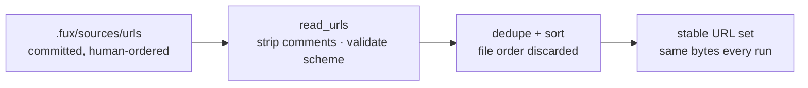

<!-- COMPONENTS-START — GENERATED from records/README.md's OWNERSHIP and DESCRIBES tables by scripts/gen-components.py. Do not edit by hand: change the table, then run `python scripts/gen-components.py --write`. -->

**Owns** — the components this record decides:

- [`src/fux/ingest/sourcelist.py`](../src/fux/ingest/sourcelist.py) · file

**Describes** — reaches into, does not own:

- [`node/src/ingest/sourcelist.mjs`](../node/src/ingest/sourcelist.mjs) · owned by [SR-NODE-SEARCH](0153_node-search.md)

<!-- COMPONENTS-END -->

# SR-URL-LIST — the committed URL list

## §1 — For humans

The list of URLs Fux indexes is **a file, not a config array**: one URL per
line, `#` comments, blank lines ignored, committed to your repo.

That is the whole decision, and it is not cosmetic. A TOML array of 5 000
entries is **one diff hunk and one merge conflict** — two people adding a URL in
the same week collide, and a reviewer cannot see what changed. One entry per
line is what makes the list reviewable at the size it actually reaches.

The second half is that **the loader sorts and dedupes**. File order is
presentation only. You can group entries by team, by system, by whatever helps a
human read it, and it cannot change a single committed byte — which is what
keeps [SR-INGEST](0106_ingest.md)'s byte-reproducibility true when two people
maintain the same list in different orders.

The third part is **per-URL attributes**: a line may carry `key=value` pairs
after the URL, `.gitattributes`-style. **There are two, and the set is closed.**

| attribute | values | default | decides |
|---|---|---|---|
| **`fetch`** | **any module name** — `http`, `cdp`, or a `.py` the consumer put in the fetchers directory | `http` | who retrieves the document |

⚠ **`fetch` was an enum of the two shipped fetchers until 2026-09-15**, when
decision 15 made it typed. **Closed KEYS, open VALUES** — the two are different
loosenings and only the second happened.

🔴 **`meta` was the OTHER original attribute and it was deleted on 2026-09-20**
(Arpit, W-194) — `plain` · `hashed`, defaulting to `hashed`, deciding whether
the index could hold readable display text. **A line still carrying `meta=`
fails to load with a named error**, because the key set is closed; that is the
`fux update` precedent (W-177), not a deprecation. The leak it closed is an
accepted exposure now — [SR-LAW-5](0007_LAW-5-hashed-meta.md), superseded.

```console
$ cat .fux/sources/urls
https://example.com/handbook/oncall                        # both defaults
https://example.com/docs/api             ttl=7d
https://wiki.corp/display/ENG/runbook    fetch=cdp
https://app.corp/reports/q3              fetch=cdp keep=false
```

**A line with no attributes means every default applies**, so every list valid
today stays valid.

This record exists separately from [SR-URL-INGEST](0107_url-ingest.md) because
the two answer different questions: that record owns **what fetches a URL**,
this one owns **what the file says**. `fetch=` is the seam between them — this
record fixes the *grammar* and the closed set of attribute **keys**; the fetcher
records define what a `fetch=` name selects. **The writer is [SR-CLI](0101_cli-surface.md)'s**
— this record decides what a line *means*, that one decides what the command
does.

**Diagram — Mermaid and its ASCII twin. Update both, always, together.**



<details>
<summary><b>ASCII twin</b> — the same diagram, for terminals, diffs, and any reader without a Mermaid renderer</summary>

```text
  .fux/sources/urls        read_urls              dedupe + sort        stable set
  +------------------+   +----------------+   +-----------------+   +-------------+
  | committed        |-->| strip comments |-->| file order is   |-->| same bytes  |
  | human-ordered    |   | validate http  |   | DISCARDED here  |   | every run   |
  +------------------+   +----------------+   +-----------------+   +-------------+
                                 |
                                 v  non-http(s) line
                          error: <file>:<lineno>
```

</details>

### Examples

Captured from the filed fixture,
[`2026-08-19-w54/evidence/fixture.sh`](../work/regression/2026-08-19-w54/evidence/fixture.sh):

```console
$ cat .fux/sources/urls
# one URL per line. `#` is a comment at line start or after whitespace --
# NOT inside a URL.
https://example.invalid/handbook#oncall    fetch=http
https://example.invalid/handbook#deploys   fetch=http
https://example.invalid/handbook/oncall
https://example.invalid/public/api          fetch=http ttl=7d
https://example.invalid/gone
```

**The two `#`-bearing lines are two documents**, which is decision 3's narrow
comment rule doing the only job it exists for. The bare line takes every
default; the `ttl=7d` line relaxes freshness for one slow-moving page. (⚠ This
example showed `meta=hashed` and `meta=plain` until W-194 deleted the
attribute on 2026-09-20.)

A URL that fails to fetch is a **skip**, not a deletion — the list is the
statement of intent, and only removing a line removes a document:

```console
$ fux ingest
ingested 7 docs (5 changed), 1 skipped, 5 shards written
  skip https://example.invalid/gone: fetch failed: 404 not found
```

---

## §2 — For agents

### Context

Three properties had to hold at once, and each rules out an obvious shape.

**It has to merge.** The design point is a corporate corpus, so the list reaches
thousands of entries maintained by people who do not coordinate. Any format
where one logical addition touches a shared line produces conflicts proportional
to team size.

**It has to be reviewable.** A URL entering the index is a decision about what
an agent will treat as authoritative. It belongs in a diff a human reads, not in
a value nested three levels into a config file.

**It must not affect committed bytes.** Two people can hold the same set in
different orders; the index must not know. This is L3 — same sources,
byte-identical index — applied to *config* rather than content.

### Decision

**1. The URL list is a file, not a TOML array.** Default `.fux/sources/urls`,
declared **committed** by [SR-DOTFUX](0102_fux-directory.md). The path is
configurable ([SR-CONFIG](0113_config.md)); the format is not.

**2. One URL per line.** Blank lines are ignored. This is the property that
makes the file merge line-by-line at any size, and it is the same reasoning that
shards the index.

**3. `#` starts a comment at the start of a line or after whitespace**, and the
rest of the line is discarded. **`#` anywhere else is part of the entry** — a
URL fragment is not a comment. Under decision 7 this is forced rather than
chosen: `https://x/a#frag keep=false` cannot be parsed at all if `#` means a
comment everywhere.

**4. The loader dedupes and sorts.** File order is presentation only. A
duplicate line is not an error — it is a merge artefact, and failing the run for
one would make the file hostile to the collaboration it was designed for.

**5. A non-`http(s)` line is a loud error naming `file:lineno`**, never a silent
skip. A typo'd scheme that quietly fetches nothing is worse than a stopped run,
because the corpus is then wrong in a way nothing surfaces.

**6. The list is intent, not state.** A line present means *this document
belongs in the index*. A fetch that fails keeps the prior record and reports a
skip; only removing the line removes the document
([SR-URL-INGEST](0107_url-ingest.md) decision 3). **The file never records
fetch outcomes.**

**7. A line may carry attributes after the URL**, separated by whitespace:
`<url> key=value [key=value ...]`. **One parser, shared with
`.fux/sources/dirs`** ([SR-DIR-LIST](0120_dir-list.md) decision 2) — two
parsers for one grammar is how `#`-handling, sorting and the unknown-key error
end up disagreeing. Adding a third list is a `ListSpec`, not a parser.

**8. `key=value` is the only form.** No bare flags, no `-key` unset, no `!key`
revert — `.gitattributes` needs four states because its entries are *patterns*
that overlap; ours are exact entries that do not. One form, one meaning, nothing
to resolve. Values carry no whitespace and no quoting; a value that needs either
is a new decision, not a parser feature.

**9. An unknown key is a loud error naming `file:lineno`.** Same rule
[SR-RECORD](0109_index-record.md) applies to `_format`: a reader that does not
know a key must refuse rather than guess. Silently ignoring one is how a typo'd
`mata=plain` ships a private document to a public index.

**10. A line attribute beats the source-wide setting, for that URL only.** The
default stays the strict one — L5 is a safety property, so opting out is
per-document and visible in a diff, never a blanket flip. **Two lines carrying
the same URL with *different* attributes are a loud error naming both line
numbers**, not a last-wins merge: exact URLs cannot legitimately disagree, and
quietly picking one would make a merge artefact into a policy change.

**11. The attribute set is closed, and it is two.** **Adding one is a change to
this record**, not a config addition — which is what makes decision 9's
unknown-key error safe to be strict about: the error is never wrong, because
there is nothing legitimate it can reject.

⚠ **"Two" is the ORIGINAL set; it grew to seven and is now SIX** — `fetch`,
`keep`, `ttl`, `enrich`, `archived` (2026-09-11, W-126,
[SR-ARCHIVED-CONTENT](0134_archived-content.md) decision 1a) and `update`
(2026-09-11, W-113, decision 14 below), with **`meta` removed on 2026-09-20**
(W-194). The sentence is left as written because **the closure is the decision
and the count never was**; what this ⚠ records is that the rule has been
exercised eight times — seven additions and one removal — and held each time.
🔴 **The removal is the harder case and it held too**: a closed key set is what
makes deleting an attribute a *named load error* rather than a silent
accept-and-ignore. The count
lives in
`tests/ingest/test_sourcelist.py::test_the_url_attribute_set_is_exactly_these_seven`,
which is deliberately the one test in that file that does **not** derive from
the spec — so an eighth attribute arrives as a single failing assertion naming
itself rather than as silence. **It did exactly that for `archived`, and then
again for `update` on the same day.**

⚠ **"Closed" is about KEYS and has never been about values** — decision 15
(2026-09-15) opens `fetch=`'s values while leaving this decision untouched, and
the distinction is worth stating because the two read as one loosening. An
unknown **key** is still a loud error with nothing legitimate to reject; an
unknown `fetch=` **value** is now a name whose file the consumer may not have
written yet, which is `fux doctor`'s to report.

⚠ **`archived` also makes `DIRS`' attribute set a strict SUBSET of `URLS`'**,
which was not true before and cost a test its second half: the old
`test_urls_attributes_are_not_legal_in_dirs_and_vice_versa` used `archived` as
its example of a `dirs`-only attribute and **no attribute is `dirs`-only any
more.** The reverse direction was deleted rather than re-pointed at a
substitute, because a test rewritten to stay green is not a test.

**12. A fux-written line carries every attribute, explicitly.** `fux add` emits
the complete set — `fetch=… keep=… ttl=…` — even where the value equals the
default.
**A generated file holds no implicit state**: the line says what it means, and
changing a policy is a one-word diff rather than the appearance or disappearance
of a key. This is the property [SR-RECORD](0109_index-record.md) already gives
`mode` inside a record, now given to the source list that produced it. (⚠ This
named `meta` as the worked example until W-194 deleted it, 2026-09-20.)

⚠ **Narrowed 2026-09-01: an attribute whose default is the EMPTY STRING is
omitted at that default.** ⚠ **Moot for `types` since 2026-09-11**: the types
list left this grammar for `.fux/formats.toml` ([SR-TYPES](0128_types-list.md)
decision 12), so the grammar now parses **two** committed lists. The narrowing
below stands as written for any future empty-default attribute. `types` gained `decoder=` ([SR-TYPES](0128_types-list.md)
decision 11), whose empty default means *no binding declared* — and writing a
bare `decoder=` on every prose line states no policy, cannot be diffed into one,
and is four dead characters where this decision promised a meaningful word.
**The rule this decision actually protects is that a stated policy is visible,
not that a key is always present**, and an attribute with nothing to state has
no policy to make visible.

**Nothing existing is affected, and that is checkable, not asserted:** `fetch`,
`keep`, `ttl`, `archived`, `enrich` and `update` all have non-empty defaults, so
all six are still written at their default. The carve-out reaches exactly the
attributes a future record gives an empty default to — and giving one an empty
default is now a decision with a visible consequence rather than a free choice.

**13. The reader is lenient; the writer is strict.** A missing attribute takes
its default **when read**, so a hand-made list, an older file, or a merge that
dropped a key still loads. But a line missing any attribute **was not written by
fux**, and that is worth reporting: a completeness check turns *"the list is not
edited manually"* from a policy into an observation anyone can make. The check
belongs to `fux doctor`; the rule is here because it is a property of the
format.

🔴 **Two exemptions, both on the `urls` grammar, both because there is nothing
to be lenient WITH.** `fetch=` (decision 16, 2026-09-20) and `decoder=`
(decision 17, 2026-09-21) are `required`: a line omitting either raises rather
than defaulting. Leniency means *fall back to the layer below*, and neither has
a layer below — no `[sources.url]` key, no engine default that could be right for
somebody's host or somebody's format. **The leniency is intact for every other
attribute and on the whole `dirs` grammar**, which is why this is two exemptions
rather than a reversal.

**14. `update = auto|never` — whether `fux ingest` goes out for a line at all**
(Arpit, 2026-09-05, ruling R-1; built 2026-09-11). A line could say how to reach
a document, how to store it and how long a citation could go unchecked, and
**could not say whether to go back for it.**

- **Two words, and it takes NO duration.** `auto` is today's behaviour; `never`
  pins the document.
- 🔴 **`ttl=` is ASK-time and this is UPDATE-time.** `ttl` bounds how long `fux
  answer` may cite without re-checking ([SR-URL-FRESHNESS](0147_url-freshness.md));
  `update` decides whether fux ever looks again. **The moment `update=` accepted
  `24h` the two would be indistinguishable at a glance**, and the first person
  to conflate them in a support thread would be right to. That is why the value
  set is closed words and why a test asserts it carries no validator.
- **Three layers**, like `keep`/`ttl`/`enrich` and unlike `archived`: *whether
  to go out* is a policy about **reaching** a source, so `[sources.url] update`
  is meaningful — a whole intranet wiki can be pinned in one line and a single
  page exempted by its own.
- **`fux add <URL> --no-update` writes `update=never`.** ⚠ **That add still
  fetches once** — one fetch is what makes the line ingestable at all; the flag
  governs every run after, and `--help` says so rather than only this record.
  🔴 **It did not, from the day it landed until 2026-09-11** (W-140 row 3). The
  filter below ran above the fetch and knew nothing about an add, so the add
  wrote the line, fetched nothing and exited **1** with *the line is written;
  the fetch failed: update=never*. Three artifacts promised the fetch — this
  bullet, `--help` and the CHANGELOG — and the code contradicted all three.
  **`cmd_add` now passes the URL it just wrote as `first_fetch`, and that set
  has exactly one populator**, asserted by a test: a wider one would make the
  pin advisory.
  ⚠ **A pinned line written BY HAND is still never fetched, and that is a real
  gap.** `fux add` on an existing line reports `unchanged` and ingests nothing,
  so such a line has no record and no document, and nothing says so —
  [SR-MAINTENANCE](0129_hooks.md) decision 5a's never-fetched reporting
  is the place that would.

**14a. The skip is `POLICY`, and it happens BEFORE the fetcher is resolved.**

- **`POLICY` already means *the declaration did its job*** — no third `kind` was
  added. `UNFETCHED` would say the bytes failed to arrive, which puts the URL in
  front of somebody as a problem and, through `enrich/queue.tsv`, in front of
  the whole team.
- 🔴 **Filtered above `fetch_all`'s grouping, and that placement is the
  decision, not an optimisation.** `fetch_all` groups by `fetcher_path` and
  calls `load_fetcher`, which **imports consumer Python and runs whatever sits
  at its module level** — a fetcher is free to open a session there. Filtering
  inside the per-URL loop would be correct about the network and wrong about
  everything else. Pinned means *no import, no connect, no socket*.
- **Pinning freezes a document; it never drops one.** Carry-forward keys on the
  whole resolved list, so a URL that stops being fetched keeps the record it
  already has. A narrower keying would make `update=never` a delayed deletion.

**14b. `update=never` + `keep=false` is legal, lossy, and DISCLOSED rather than
refused.** With no retained bytes there is nothing for `fux answer` to verify a
citation against: the document is frozen at whatever statistics its last ingest
produced. That is coherent for a document that genuinely never changes and
surprising to have chosen by accident — a warning's shape, not a refusal's.
`fux doctor` counts the pinned lines and names the lossy ones
([SR-DOCTOR](0152_doctor.md)). The coherent pair is `update=never keep=true`:
the bytes sit in `.fux/acquired/`, `answer` verifies against them and reports
`as-ingested` ([SR-ACQUIRED](0145_acquired-plane.md)), and nothing opens a
socket — *more* offline, with the grain of L4.

🔴 **14c. This is NOT the ETag saving, and the records must not let a later
reader think it was.** `update=never` buys **bandwidth** by giving up
**freshness**. The ETag promise was *"check cheaply and stay fresh"*, and CDP
intercepts at the **response** stage, so the body has already crossed the wire —
a matching ETag saves the decode and the shard comparison, not the transfer
([SR-CDP-FETCHER](0118_cdp-fetcher.md) decision 12). The only thing that would
deliver the original promise is **request-stage interception**, injecting
`If-None-Match` and letting the server answer `304`. **Not costed, not built,
and not authorised by this decision** — see that record's veto.

### The attribute set

**Complete. Anything not in this table is an error at `file:lineno`**
(decision 9). A fux-written line always states both (decision 12), so the
*default* column is what a **missing** attribute means to the reader — which, in
a correctly generated file, never happens.

| attribute | values | default when absent | defined by | changes committed bytes? |
|---|---|---|---|---|
| **`fetch`** | any module stem in `.fux/fetchers/` | **none — REQUIRED** (decision 16) | [SR-FETCHER](0117_fetcher.md) decision 16 · [SR-HTTP-FETCHER](0119_http-fetcher.md) · [SR-CDP-FETCHER](0118_cdp-fetcher.md) | **no** — it selects *who* retrieves the document, not what the record says. A record does not carry which fetcher produced it |
| **`decoder`** | any module stem in `.fux/decoders/` or a built-in, plus the reserved `prose` | **none — REQUIRED** (decision 17) | this record, decision 17 · [SR-DECODE](0139_decode.md) | 🔴 **YES, and it is the only attribute here that does.** It decides which decoder turns the fetched bytes into the Markdown that is parsed, so `decoder=html` and `decoder=prose` produce different records, a different `sha` and different statistics from one response |
| **`update`** | `auto` · `never` | `auto` | this record, decision 14 | **no** — it decides whether fux goes out, not what a record says. ⚠ It changes committed bytes *over time* by preventing them from being refreshed, which is the opposite of the question this column asks |

**`fetch` is a routing decision.** A name resolves to
`.fux/fetchers/<name>.py`, a fixed directory since 2026-09-20 — the
`[sources.url] fetcher` key that used to define it was deleted with W-199 D2
([SR-CONFIG](0113_config.md), [SR-FETCHER](0117_fetcher.md) decision 16).
Exactly one runs ([SR-FETCHER](0117_fetcher.md) decision 4), and nothing
escalates from one to another ([SR-HTTP-FETCHER](0119_http-fetcher.md)
decision 3) — so the value on the line is the whole story, every run.

**Three layers, one order.** The built-in default, then the source-wide
`[sources.url]` setting, then the line. A line beats both, for its own URL only.

🔴 **`meta` was this decision's OTHER attribute and its whole worked example.**
W-194 deleted it on 2026-09-20, and what it said is kept here because the
correction it carried is about how records rot, not about hashing:

> It read *"it only ever loosens"* and *"there is deliberately no way to make
> one URL stricter than the source"* until 2026-09-12 (W-140 row 10).
> `urlsrc.resolve_urls` was one symmetric line, so `meta=hashed` on a line under
> a `plain` source had always won. **The claimed restriction was never
> implemented** — a record stating a property the code did not have, for months,
> with nothing able to notice.

**The lesson survives the attribute**: a sentence describing what a file *can
express* is a claim about the parser, and it must be checked against the parser
rather than inferred from what the feature is for.

### Considered for the set, and deliberately excluded

**Fetcher tunables** — `wait=`, `settle=`, `port=`, `timeout=`. **Rejected on
principle, permanently.** Those are one fetcher's vocabulary, and
`[sources.url.config]` exists precisely to carry it without fux learning it
([SR-FETCHER](0117_fetcher.md) decision 8). A `settle=500` in this grammar is
fux knowing what Chrome is — the adapter cap breached through the back door
rather than the front.

**Content overrides** — `title=`, `summary=`. **Rejected:** the document owns
its content. Everything in a record is taken from the fetched bytes
([SR-EXTRACTED](0115_extracted-mode.md)), and a title supplied by the list
would be the one field in the index that no document said.

**Three the grammar could hold and this record does not decide** — named so
nobody re-argues them from scratch, and so nobody adds one quietly:

| candidate | what it would do | why not here |
|---|---|---|
| `snapshot` | commit a machine-made copy of the content, per URL | the refer/snapshot policy is per *source* today and belongs to [SR-REFER](0127_refer-plane.md); a per-URL form is an L2 decision, not a grammar one |
| `tag` | give a URL document the frontmatter tags a repo file has | URL documents have no frontmatter, so their `tag` edges are always empty — a real gap. But it invents corpus structure in a config file, which needs its own record |
| `max_age` | per-URL freshness bound at answer time | freshness is the refer plane's, and its threshold is a pre-registered prediction. Deciding it here would fix a number no one has measured |

Each would be a new row in the table above **and a change to this record**,
which is the point of decision 11.

### The `dirs` attribute set

The same grammar carries `.fux/sources/dirs`, whose set is also **closed** and
is `archived` and `enrich`, both `true|false`, both defaulting to `false`, both
**declared and never derived**.

| attribute | changes committed bytes? | defining record |
|---|---|---|
| `archived` | no — it routes ranking | [SR-DIR-LIST](0120_dir-list.md) |
| **`enrich`** | **yes, indirectly** — a scope's documents gain a `ctx` field | [SR-ENRICH](0137_enrich.md) |

`enrich` is the one attribute whose effect on the index is *indirect*: the
attribute itself writes nothing, but it decides which documents `fux enrich`
plans for, and a document with pinned enrichment indexes extra `ctx` terms.
Worth stating, because decision 12 writes `docs archived=false enrich=false`
and a reader should know which half of that can move a byte.

**Decision 12's line states the REPO's policy, not the engine's** (W-140 row 5,
2026-09-11). Every generated line states every attribute — and the values came
from the engine's built-in defaults, so `fux add` wrote `ttl=24h` onto every
line in a repo whose `[sources.url]` said `7d`.

- 🔴 **The middle layer of a three-layer resolution was dead for every
  CLI-written line.** `[sources.url] ttl|keep|enrich|update|fetcher` exists
  so a whole intranet is configured in one place; `fux add` silently overrode it
  on the way in, document by document.
- **Decision 12 is unchanged and that is the point.** The line still states
  everything, still holds no implicit state, and a policy change is still a
  one-word diff. What changed is *which word* — the consumer's, resolved before
  the line is rendered, with an explicit flag still beating both.
- ⚠ **Editing `[sources.url]` later still does not reach an existing line**, and
  cannot: decision 12 means the line has already spoken. That is the cost of
  stating everything, and it is now the only cost rather than one of two.

**`update` is now WRITTEN, not commented, in the scaffolded `fux.toml`**
(Arpit, 2026-09-14). It shipped as `#update = "auto"` and was the only
`[sources.url]` key whose default a consumer could not see in their own file.
The ruling, the rule it establishes (a **closed, small value domain** is
written live; a tuning number defers), and what it costs are stated once in
[SR-DOTFUX](0102_fux-directory.md) and are **not restated here**.

⚠ **Nothing about the attribute changed** — not the grammar, not the two
values, not the line-beats-source-wide resolution. What changed is that a repo
scaffolded today can read `update = "auto"` and discover `"never"` exists
without leaving the file.

**15. 🔴 `fetch=` is a TYPED attribute validated by NAME SHAPE, not an enum of
the fetchers fux ships** (Arpit, 2026-09-15, Cowork; W-178).

> *"I want a pattern where a consumer can build custom fetchers as well as
> custom decoders. They just put the file in those directories and then use
> flags and format file to map them."*

**A consumer drops `.fux/fetchers/glassbox.py` in, writes `fetch=glassbox`, and
ingests** — no engine change, no fux release. It is the pattern
[`.fux/decoders/`](0139_decode.md) has shipped since 2026-09-01, made
symmetrical: **fetchers and decoders are one consumer-plane pattern**, so a
future change to either is a question about the other.

**15a. The validator checks SHAPE and never existence.** A module stem —
lowercase letters, digits and underscores, not leading `_`, no `.py` suffix, no
directory part — deliberately the same regex `decoder=` uses, because two
regexes for one idea is how they drift.

🔴 **The reason for that split is stronger here than for decoders.**
`_decoder_reason` does not consult the registry because reading a config file
must not depend on importing every decoder. Importing a **fetcher** to validate
one line would run module-level consumer code that may `connect()` to a
browser — **so reading a committed file would open a socket to decide whether a
line is well-formed**, on a path L4 fences. Existence is
`urlsrc._fetcher_path`'s at use time and `fux doctor`'s ahead of time
([SR-DOCTOR](0152_doctor.md), the `fetcher bindings` row).

**15b. The default stays `"http"`, not `""`.** `render_line` omits an attribute
whose default is empty; a URL line that stopped stating `fetch=` would break
decision 12. That exception exists for `types.decoder` and must not spread by
accident.

**15c. The header's placeholder is the ATTRIBUTE's now.** `_urls_header()`
hardcoded `<duration>` for every attribute with no `values` — correct while
`ttl` was the only typed one, and the moment `fetch` joined it would have
written `fetch=<duration>` into every repo `fux setup` touches.
⚠ **That is W-140 row 18 returning through its own fix:** the header went stale
by being transcribed, was repaired by being *derived*, and the derivation
carried the wrong constant. `Attribute.placeholder` is the field, and there is
no special case in `setup.py`.

**15d. What this does NOT open.** `keep`, `archived`, `enrich` and `update`
stay enums — policy values with a genuinely closed set, and only `fetch` names a
**file**. The attribute **key** set stays closed at **six** (decision 11);
a seventh is still a change to this record. (⚠ `meta` was in this list and the
count read seven until W-194, 2026-09-20.)

**15e. What the grammar had been asserting, and for how long.** The closed
tuple `("http", "cdp")` sat here while `urlsrc._fetcher_path()` resolved
`fetch=<name>` to `<fetchers dir>/<name>.py` and **that module's own docstring
stated the open behaviour as fact**. 🔴 **The docstring and the validator had
drifted and nothing noticed** — the W-83 class — which is why this item existed
before the ruling arrived rather than because of it.

**15f. The price of an open set, stated.** `fetch=glasbox` is a legal line
naming a file nobody wrote. It used to be a grammar error; it is now an ingest
failure on somebody else's machine, mid-run — **which is exactly the argument
W-101 item 2 made for `decoder bindings`**, so `fux doctor` gains the mirroring
row rather than the loosening shipping unguarded.

**16. `fetch=` is MANDATORY on every URL line, and decision 12 stands
unnarrowed** (Arpit, 2026-09-20, W-199). A line with no `fetch=` **fails to
load**, with an error naming the line and the one word that fixes it. There is no
source-wide fallback to inherit from: `[sources.url] fetcher` is deleted
([SR-CONFIG](0113_config.md), [SR-FETCHER](0117_fetcher.md) decision 16a).

🔴 **The 2026-09-01 empty-default narrowing does NOT reach this attribute, and
the difference is worth stating.** A `decoder=` on the **types** list may be
empty because *no binding declared* is a real, sayable policy there — the file's
extension resolves it. **There is no corresponding fact for `fetch=`**: a URL
with no fetcher is not *"resolve it later"*, it is *"fux cannot retrieve this at
all"*, and an empty value would encode a question rather than an answer.

⚠ **Read this paragraph with decision 17, which is a day younger.** It named
`decoder=` as the attribute that may be empty, and that is true of the **types**
grammar and **false of the URL grammar since 2026-09-21** — a URL has no
trustworthy extension either, so the same argument that makes `fetch=` mandatory
makes `decoder=` mandatory on this list. The word `decoder=` appears in both
grammars and means the same kind of thing; only one of them can resolve it
later.

⚠ **The recommended alternative was the opposite and Arpit rejected it.** W-199's
D1 proposed `fetch=""` meaning *routed* — the table consulted at every ingest, so
a route changed later moves every line at once. His ruling: *"The set should never
be empty. It should be a mandatory argument when we are doing an add so that the
fetcher gets defined."* **What that costs is the fifty-copies problem the routing
item existed to remove**, and the cost is real: `fux add` resolves the route
**once**, writes the stem, and a later route change moves nothing. It is bounded
by a `fux doctor` finding — *"N line(s) pin a fetcher the routes table would now
resolve differently"* — and the consumer edits. **Named here because a session
reading decision 16 alone would otherwise re-propose the empty form.**

⚠ **It breaks existing lists, by ruling.** *"About backward compatibility, let
it break."* A line already saying `fetch=http` is a **valid pin** and keeps
working; a hand-written line without one stops the load. No rewrite, no lenient
read — the `fux update` precedent (W-177) and the `meta=` precedent (W-194).

**17. `decoder=` is MANDATORY on every URL line too — the other half of the
pipe** (Arpit, 2026-09-18; built 2026-09-21 as W-199 DoD 10).

> *"Whenever we add a URL, after that, we have to define what kind of fetch it
> is, what kind of decoder we want to use. And that is the one that gets saved
> in the URLs file."*

- **A fetcher retrieves bytes; a decoder turns them into Markdown; the line
  names both.** A **file**'s extension picks its decoder. A **URL** has no
  trustworthy extension — `?download=1`, `/export`, an
  `application/octet-stream` — so fux guessed from the `Content-Type`, then the
  URL, then fell back to prose, **on every ingest**. The line replaces the guess
  with a declaration.
- 🔴 **The value is a module STEM**, the same vocabulary
  `.fux/formats.toml [decoders]` uses and the same key SR-DECODE decision 5
  resolves an override on: a built-in, or a file in `.fux/decoders/`. **No
  default**, for decision 16's reason — *"resolve it later"* is not a fact about
  a URL.
- **`prose` is the one reserved word**, for a page whose bytes are already text
  (`text/markdown`, `text/plain`). It names a branch and no module, so
  `.fux/decoders/prose.py` is refused at registry build
  ([SR-DECODE](0139_decode.md) decision 21).
- **Written once, at `fux add`, from what was OBSERVED.** The add's single
  fenced fetch is where the type is seen; every run after it reads the line, and
  the ingest path never consults a header for routing again
  ([SR-URL-INGEST](0107_url-ingest.md) decision 6a). Nothing maps → `fux add`
  **refuses** and asks for `--decoder` ([SR-CLI](0101_cli-surface.md)).
- **The line wins over the header, silently, and that is stated so nobody
  "fixes" it.** The line is the human's word; the header is the server's. Where
  the two disagree about a format with a signature, the **magic floor refuses
  the response** ([SR-REFUSAL](0146_refusals.md)) — which is the check getting
  *stronger*: a sign-in shell served honestly as `text/html` on a line that says
  `decoder=xlsx` could not be seen before.
- **`fux doctor` reports the drift rather than resolving it** — `url decoders`
  (a stem naming no module: a failure) and `observed types` (a declared stem
  disagreeing with the last retained response: a finding)
  ([SR-DOCTOR](0152_doctor.md)).
- ⚠ **It breaks existing lists, by the same ruling, and more widely than
  `fetch=` did.** *"Nothing needs to be done. It is a breaking change. That's
  all."* **Every** line written before 2026-09-21 lacks `decoder=` — there was
  no attribute to have written — so **every** existing URL list stops loading
  until it is re-added or hand-edited, where `fetch=`'s break only reached
  hand-written lines. No rewrite and no lenient read: decision 13's leniency
  takes its **second** exemption here, for the first one's reason.
- ⚠ **What it gives up, said aloud: `fux add <url>` opens the network twice** —
  once to observe the type, once inside the ingest that follows, because the
  line has to exist before `fux ingest` will fetch for it. `--decoder <stem>`
  skips the observation, and so does re-adding a URL whose line already declares
  one. The alternatives were a window in which the committed file does not load,
  or a second way for bytes to enter the index.

### Consequences

- **The file is tool-managed, and the writer edits one line rather than
  regenerating the file.** The obvious alternative loses something real:

  | decision | what tool-management changes about it | how `fux add` answers |
  |---|---|---|
  | 3, comments | they stop being how a human annotates and become what a writer must **preserve** | a grouping comment and a line's own trailing comment both survive an edit; a regenerating writer would eat both |
  | 4, duplicates | "a merge artefact" becomes "a writer must not emit one" | an add to a URL already listed is an **update in place**, never a second line |
  | 4, ordering | the loader's canonical sort could be done once by the writer | a new line lands at its sorted position — a courtesy to the reader, since the loader still sorts and correctness does not depend on it |

  **It still is not a lockfile.** A lockfile is generated whole from a manifest;
  this file *is* the manifest, and `fux add` is a careful editor of it. Which is
  why a hand-written line stays legal (decision 13) and `fux add` marks it
  rather than rewriting it.
- **`fux add <URL>` fetches, and the fetch does not gate the write.** A managing
  command that validated a URL by requesting it would make the committed list a
  function of network weather — so the line is recorded first and stays recorded
  even when the fetch fails; the failure is reported and exits 1. **The *list* is
  not a function of whether the network was up. The *index* is, and always was.**
- **The writer commits LF only on disk, regardless of host OS.** `.gitattributes`
  already normalises CRLF to LF at `git add` time for every tracked file, so
  committed bytes were never at risk — the explicit `newline="\n"` is
  defence-in-depth that does not depend on `.gitattributes` staying present or
  correctly matching the path, and it means the working-tree file is right
  immediately rather than only after the next `git add`.
- **Two records describe one subsystem**, deliberately: this one for the format,
  [SR-URL-INGEST](0107_url-ingest.md) for the fetch contract. The split earns
  itself whenever the grammar moves and the fetcher contract does not.
- ⚠ **Decision 3's narrow comment rule fixed a real disappearance, and it was
  fixed by decision 7 rather than around it.** A rule that stripped from the
  first `#` anywhere on the line loaded `https://x/page#section` as
  `https://x/page`; two lines differing only by fragment then collapsed under
  decision 4, and a document vanished with no error — the failure decision 5
  exists to prevent, reached by a different route. Making the line
  whitespace-delimited made the narrow comment rule the only parseable one.
- **An attribute that changes committed bytes needs a home in the record.**
  ⚠ `meta=plain` was the one worked example and W-194 deleted it, so **no
  current attribute changes committed bytes** — `fetch`, `keep`, `ttl`,
  `archived`, `enrich` and `update` all decide *how* or *whether* fux goes out,
  not what a record says. A future attribute that changed bytes without a home
  in the record would still be an `_format` question.
- **A duplicate is invisible.** Accepted under decision 4, at the cost that a
  reviewer cannot see from the diff that a line was already present.

### Alternatives considered

- **A TOML array in `fux.toml`** — the original shape, **retired with an
  erroring key** ([SR-CONFIG](0113_config.md) decision 10). One diff hunk, one
  merge conflict, and it buries a corpus decision inside config.
- **Erroring on duplicates.** Rejected: duplicates are what merges produce, and
  a list that fails the build after a clean merge trains people to stop
  maintaining it.
- **Preserving file order.** Rejected: it makes committed bytes a function of
  how someone chose to group their list, which is L3 lost for a cosmetic gain.
- **Sections** (`[http]` / `[cdp]`) — rejected: they reintroduce order
  significance, which decision 4 spent effort removing, and moving a URL between
  mechanisms becomes a two-line diff instead of a one-word one.
- **A file per mechanism** (`urls`, `urls.cdp`) — rejected: it multiplies files
  the moment a second attribute exists, and one already does. It also makes
  "which file is this URL in?" a question, where decision 7 makes it a column.
- **The four `.gitattributes` states** (set / unset / valued / revert) —
  rejected under decision 8. Those exist to resolve overlapping *patterns*;
  exact URLs never overlap, so three of the four would only ever be spelling
  variants of the fourth.
- **Last-wins on a duplicate URL with conflicting attributes** — rejected under
  decision 10. It is what `.gitattributes` does, and it is right *there* because
  later lines are deliberate overrides. Here a duplicate is a merge artefact,
  and silently letting one decide a privacy policy is the worst available
  outcome.

### Reference (required)

- The grammar, in its single implementation —
  [`src/fux/ingest/sourcelist.py`](../src/fux/ingest/sourcelist.py): the
  comment rule, the attribute parse, the dedupe-and-sort and the two error
  classes; `urls` and `dirs` differ only in a closed attribute set and one entry
  validator.
- The loader that consumes it — `read_urls` in
  [`urlsrc.py`](../src/fux/ingest/urlsrc.py), whose docstring states the
  sort-and-dedupe guarantee.
- A real list, every attribute exercised, and the fetch behaviour it drives —
  [`work/regression/2026-08-19-w54/`](../work/regression/2026-08-19-w54/report.md),
  with its committed fixture at
  [`evidence/fixture.sh`](../work/regression/2026-08-19-w54/evidence/fixture.sh).
- The fetch contract this record is split from —
  [SR-URL-INGEST](0107_url-ingest.md).
- Prior art for per-entry attributes on a line-oriented committed file — git's
  `gitattributes` format: https://git-scm.com/docs/gitattributes
- Prior art for explicit per-entry fetch mechanism rather than automatic
  fallback — `scrapy-playwright`, where browser rendering is a per-request
  opt-in with no automatic escalation:
  https://github.com/scrapy-plugins/scrapy-playwright

### Veto condition

**Reopen this decision if** an attribute is wanted that cannot be written as a
whitespace-free `key=value` — a value needing quoting or spaces breaks decision
8 and the grammar has to grow rather than bend. **Or** if a committed list is
ever found where two lines carry the same URL and conflicting attributes and
someone wants that to *work* rather than to error: that is decision 10 being
wrong about who writes duplicates.

**How to check it:**

```bash
# 1. does any committed list want a value the grammar cannot hold?
grep -nE '[a-z]+="|[a-z]+=[^ ]* [^ ]*=' .fux/sources/urls 2>/dev/null
# expect: no output — a quoted or spaced value means decision 8 is under strain

# 2. does any URL appear twice with different attributes?
awk '!/^ *#/ && NF {print $1}' .fux/sources/urls 2>/dev/null | sort | uniq -d
# expect: no output; a hit must be an error, per decision 10

# 3. is there still exactly ONE parser for the two lists?
grep -rln "def parse(" src/fux/ingest/sourcelist.py src/fux/ingest/urlsrc.py
# expect: only sourcelist.py — a second parser is the drift this record forbids
```

---

## References

*Every source this record cites, gathered in one place. §2's **Reference
(required)** names the grounding; this is the complete list. An archived
document is never listed here — the body may name one, but archive is not
evidence.*

**Records** — [SR-LAWS](0001_LAWS.md) · [SR-CLI](0101_cli-surface.md) ·
[SR-DOTFUX](0102_fux-directory.md) · [SR-INGEST](0106_ingest.md) ·
[SR-URL-INGEST](0107_url-ingest.md) · [SR-RECORD](0109_index-record.md) ·
[SR-CONFIG](0113_config.md) · [SR-EXTRACTED](0115_extracted-mode.md) ·
[SR-FETCHER](0117_fetcher.md) · [SR-CDP-FETCHER](0118_cdp-fetcher.md) ·
[SR-HTTP-FETCHER](0119_http-fetcher.md) · [SR-DIR-LIST](0120_dir-list.md) ·
[SR-REFER](0127_refer-plane.md) · [SR-ENRICH](0137_enrich.md)

**Code**

- [`src/fux/ingest/sourcelist.py`](../src/fux/ingest/sourcelist.py)
- [`src/fux/ingest/urlsrc.py`](../src/fux/ingest/urlsrc.py)

**Measured evidence**

- [`work/regression/2026-08-19-w54/evidence/fixture.sh`](../work/regression/2026-08-19-w54/evidence/fixture.sh)
- [`work/regression/2026-08-19-w54/report.md`](../work/regression/2026-08-19-w54/report.md)

**Papers and specifications**

- `gitattributes(5)` — prior art for per-entry attributes on a line-oriented
  committed file
  <https://git-scm.com/docs/gitattributes>
- `scrapy-playwright` — prior art for a per-request browser opt-in with no
  automatic escalation
  <https://github.com/scrapy-plugins/scrapy-playwright>
