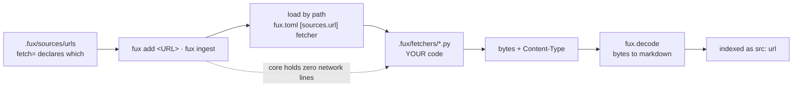

<!-- COMPONENTS-START — GENERATED from records/README.md's OWNERSHIP and DESCRIBES tables by scripts/gen-components.py. Do not edit by hand: change the table, then run `python scripts/gen-components.py --write`. -->

**Owns** — the components this record decides:

- [`src/fux/ingest/urlsrc.py`](../src/fux/ingest/urlsrc.py) · file
- [`src/fux/templates/`](../src/fux/templates) · dir

<!-- COMPONENTS-END -->

# SR-FETCHER — the consumer-owned fetcher

## §1 — For humans

**Fux never fetches. Your fetcher does.** A Python file in your repo, named in
`fux.toml`, loaded by path, called once per URL under either fenced path —
`fux add <URL>` (that URL only) or `fux ingest` (all of them). Core holds **zero
network lines**, and that is the property this record exists to keep true.

The file is called a *fetcher* and not middleware. Middleware composes: Django,
Express, Rack, Scrapy's downloader middlewares all chain, each wrapping the
next, each free to pass through or short-circuit. **Nothing here chains.** One
file, one `fetch(url) -> tuple[bytes, str]`, exactly one of them running for any
given URL. A thing that does not compose should not carry the name of the
pattern whose defining property is composition.

The name also had to avoid a collision. [SR-RECORD](0109_index-record.md)
already defines `src` as *which **adapter** owns this document*, so calling the
consumer file an adapter would give one word two referents in adjacent code —
the exact collision [SR-EXTRACTED](0115_extracted-mode.md) exists to close.
**`fetcher` fits and agrees**: the file, the function, the config key and the
per-URL attribute all say one word.

**Diagram — Mermaid and its ASCII twin. Update both, always, together.**



<details>
<summary><b>ASCII twin</b> — the same diagram, for terminals, diffs, and any reader without a Mermaid renderer</summary>

```text
  .fux/sources/urls          fux add <URL> · fux ingest
  (fetch= declares which) -->  |  load by path from fux.toml
                               v
                     .fux/fetchers/*.py   <-- YOUR code, fux never rewrites it
                               |              core holds ZERO network lines
                               v
                     bytes + Content-Type
                               |
                               v
                    fux.decode  -->  markdown  -->  indexed as src:"url"

  exactly ONE fetcher runs per URL — no chain, no wrapping, no passthrough
```

</details>

### Examples

The contract, from the file that implements it in this repo
([`.fux/fetchers/cdp.py`](../.fux/fetchers/cdp.py)):

```python
configure(config: dict) -> None  # optional; once after import, before connect()
connect() -> None                # optional; once, before the first fetch
fetch(url: str) -> tuple[bytes, str]
                                 # required; the bytes the server sent plus the
                                 # Content-Type it declared. Fux decodes them.
close() -> None                  # optional; once, after the last fetch — even if fetch raised

validate(url: str) -> str | None # optional; decision 12
is_rate_limited(exc) -> bool     # optional; decision 13 — "was that a refusal
                                 # for asking too fast?" Declared, never sniffed.

MAX_PARALLEL = 1                 # optional module constant; absent means 1
```

The retired key stops the run and says what to do:

```console
$ fux ingest
error: fux.toml: [sources.url] middleware was renamed to fetcher — rename the
key, and move the file from .fux/middleware/ to .fux/fetchers/ (SR-FETCHER)
# exit 1
```

---

## §2 — For agents

### Context

Two things forced this record, and only one of them is the name.

**The name was actively misleading.** The closest neighbour in the field —
Scrapy — uses "downloader middleware" for something that genuinely composes, and
a chained-list option was on the table when the rename was decided. A reader who
knows the pattern would reasonably assume chaining works here. It does not, and
decision 4 says so out loud so that assumption cannot survive contact.

**The contract was recorded inside a record about something else.**
[SR-URL-INGEST](0107_url-ingest.md) owns *how URL ingestion behaves* — refresh
semantics, failure handling, normalization. The fetch **contract** is a separate
thing with a separate audience: a consumer writing a file, not a maintainer
reading the pipeline.

### Decision

**1. Fux never fetches; a consumer-owned fetcher does.** `src/fux/` holds no
network code, no HTTP client, no browser driver, and no dependency for any of
them. This is the **adapter cap**, and it is what makes the source list a design
choice rather than a dependency budget.

**2. The contract is four functions, one required.**
`fetch(url) -> tuple[bytes, str]` is required — the bytes the server sent plus
the `Content-Type` it declared; `configure(config)`, `connect()` and `close()`
are optional. `close` is called even if a fetch raised.

⚠ **The tuple is load-bearing twice over.** The fetcher is the only thing that
ever sees the HTTP charset header — a file on disk has none, which is why
`html` sniffs `<meta charset>` — so for a URL the header is authoritative and
strictly better than sniffing. And it is what lets a **non-HTML URL reach the
right decoder at all**.

⚠ **A bare `str` return is still accepted, and that is a transition ramp rather
than an oversight.** A `str` is treated as already-prose markdown, which is
exactly what the previous contract returned. **This is the one place the old
contract survives**, and it is what converts a breaking change into a
deprecation. ⚠ **The cost of removing it has never been measured** —
`fux-engine` is on PyPI and nobody has checked whether a consumer fetcher exists
outside this repo. **Do not remove the ramp without measuring what it
protects.**

**3. It is called a *fetcher*, not middleware, not an adapter.** The file, the
required function, the config key and the per-URL attribute all say `fetch`.

**4. Exactly one fetcher runs per URL.** No chain, no wrapping, no
passthrough-to-the-next. A URL resolves to one fetcher and that fetcher either
returns a document or raises. **This is the decision that keeps decision 3
true** — the day a chain lands, the name is wrong again.

**5. Which fetcher a URL uses is declared, never detected.** Via
[SR-URL-LIST](0116_url-list.md)'s `fetch=` attribute, which resolves to
`<fetchers dir>/<name>.py` — the directory being the parent of
`[sources.url] fetcher` ([SR-CONFIG](0113_config.md) decision 5). **A fetcher
no line names is never imported**, which is what keeps a repo that only wants
plain HTTP from loading WebSocket code. Automatic escalation from one fetcher to
another would make the committed bytes a function of network conditions at that
instant — L3 lost on the one path that is already the exception. This follows
`scrapy-playwright`, which makes browser rendering a per-request opt-in with no
automatic fallback at all.

**5a. Content-type resolution follows the same rule: declared first, path
second, never sniffed.** The HTTP header wins; a URL's extension is a fallback
hint; the bytes are never inspected. A heuristic here would make the committed
index a function of how confident a guesser felt.

**6. Fetchers live in `.fux/fetchers/`**, a child declared **committed** by
[SR-DOTFUX](0102_fux-directory.md). Plural, because decision 5 presumes more
than one can exist in a repo at once.

**Fux ships two of them and imports neither.** `http.py` and `cdp.py` live in
the wheel as package data under `src/fux/templates/`, **with an extension
Python's import machinery cannot resolve**, and `fux setup` copies them out
write-if-missing.

⚠ **The two shipped files are on the same axis, and it is *whose session*, not
*how hard it tries*.** `http.py` uses none; `cdp.py` borrows the one your
browser already holds. **Neither renders a page** — `cdp.py` stopped on
2026-09-01 (W-98) and now intercepts the response, so both return the bytes the
server sent and the type it declared, and `fux.decode` converts. That matters
here rather than only in [SR-CDP-FETCHER](0118_cdp-fetcher.md): decision 5
forbids escalation between fetchers, which is only coherent while the two
produce the *same kind of thing* for the same URL. A renderer and a downloader
on one axis would have made "which fetcher ran" a fact about the committed
index, and that is L3 demoted to a code comment. That is decision 1 made **structural**: a `.py` in the package
could be imported by a later edit, a `.py.txt` cannot be. It also answers the
question a shipped default otherwise raises — how an air-gapped consumer gets a
working fetcher without being told to copy a file from GitHub.

**7. `[sources.url] middleware` is a retired key that errors with
instructions**, naming both the new key and the directory move. A retired key
that silently does nothing is worse than one that stops the run, and here
"silently does nothing" would mean falling back to a default path and fetching
the wrong thing.

**8. `[sources.url.config]` is sliced BY SHAPE, and fux never reads what a key
MEANS.** A scalar at the top level is **shared** and reaches every fetcher; a
**sub-table belongs to the fetcher whose name it carries** —
`[sources.url.config.cdp]` reaches `cdp.py` and reaches nothing else.
`UrlSource.config_for()` in `config.py` is the whole of the rule and it sorts
entries by `isinstance(value, dict)`, never by what a key is called. The table
is still the back door through which the adapter cap would otherwise leak: a
`cdp_port` in fux's schema is fux knowing about Chrome, and a sub-table keeps
it out of the schema exactly as verbatim passing did.

⚠ **The resolution lives in ONE place and this record does not own it.**
`UrlSource.config_for()` resolves the slice for `ingest/urlsrc.py` and
`query/refer_answer.py` alike, so `configure_fetcher` receives a table that is
**already this fetcher's** — it never sees the whole of `[sources.url.config]`.
The key shape is [SR-CONFIG](0113_config.md) decision 8a's; what is stated here
is the fetcher-facing contract, which is the half a fetcher author reads.

    [sources.url.config]
    fetcher_max_parallel = 2      # scalar  -> every fetcher

    [sources.url.config.cdp]
    cdp_port = 9222               # sub-table -> cdp.py only

    [sources.url.config.http]
    timeout_s = 30                # sub-table -> http.py only

⚠ **It was passed VERBATIM to every fetcher until 2026-09-14, and that was a
defect with a live victim.** Each shipped `configure()` raises on a key it does
not know — deliberately, because a typo'd tunable that does nothing is found
three ingests later — so **one fetcher's tunable made the OTHER fetcher refuse
the whole run**:

    $ fux add "https://…/handbook"      # no fetch=, so http.py
    error: [sources.url] fetcher configure() failed: [sources.url.config]
    unknown key(s): cdp_port — known keys: fetcher_max_parallel, max_bytes,
    timeout_s, user_agent

**A repo could therefore configure at most ONE of the two shipped fetchers**,
and the failure named the innocent party: the operator reached for `--cdp`,
which made the error go away by changing which fetcher ran.

Three properties of the fix are load-bearing:

- **A sub-table is never passed down as a key.** `http.py` does not see `cdp`,
  so ⚠ **its strictness is untouched — do not loosen it.** That strictness is
  what catches the typo sub-tables now make addressable.
- **A sub-table naming a fetcher this run never loads is simply not read**, not
  an error. A repo may carry config for a fetcher used only on another branch,
  and erroring there would punish the thing the design is for.
- **A flat table behaves exactly as before**, so no existing repo changes.

⚠ **Consequence worth naming: `fetcher_max_parallel` no longer HAS to be spelled
identically in both fetchers.** Decision 9's note, and `http.py`'s own long
comment beside the key, argue for the shared name from this collision — *"a
`http_`-prefixed key here would break any repo that also loads `cdp.py`"*. That
argument has expired. The shared name is still correct (it names a capability
both files have) but it is now a choice, not a constraint, and the comments that
justify it by the collision are stale on their own terms.

**9. A fetcher may declare `MAX_PARALLEL = n` as an optional module constant.
Absent the declaration the value is 1.** This is decision 5's own principle —
*declared, never detected* — applied to a second property, and it is
deliberately a **constant rather than a function**: the four-function contract
has survived two callers unchanged, and a capability flag is not a capability.

⚠ **A declaration is a CEILING on what a consumer may ask for, never a FLOOR on
what fux will do unasked.** When the consumer has configured nothing, fux uses
`min(declared, DEFAULT_MAX_PARALLEL)` — see [SR-CONFIG](0113_config.md)
decision 7a. `MAX_PARALLEL` answers *what is safe*; it was never a claim about
what the consumer's host can absorb, and reading it as one is how `http.py`'s
honest `8` became eight live connections to a wiki nobody asked about.
**Fetcher authors: declare the truth about your module and nothing about
politeness** — the second half is the consumer's to say, in `fux.toml`.

⚠ **Why a blanket pool was refused, and it is not "it crashes".** Concurrent
`fetch()` calls on the shipped `cdp.py` produced **plausible documents
attributed to the wrong URLs** — which lands in the committed index, **passes
every determinism check**, and is found only by a human reading an answer.
`http.py` builds a fresh request per call and is safe. A blanket pool would
have been correct for the fetcher most consumers use and silently corrupting
for the one the enterprise design point exists to serve.

🔴 **The reason this record gave for that was wrong until 2026-09-01, and a
wrong reason is worse than none** (W-105). It said `cdp.py` held **one
WebSocket** every `fetch()` reused — and `fetch_resource` had opened a fresh
socket per call for some time, so a reader who fixed the socket would have
concluded the hazard was discharged. What was actually shared on one session
was the id counter (non-atomic), the two message queues (**cleared at the top of
every fetch**, so one thread wiped another's in-flight state), and the page
target — `_page_target()` returned the *first* one, so two threads drove
`Page.navigate` on the **same tab**. All three yield the same wrong answer.
`cdp.py` now gives each worker its own tab, socket, counter and queues, and
`ensure_chrome()` is lock-guarded. **The general lesson is the one worth
keeping: a hazard is discharged by the property that made it a hazard, and a
record naming the wrong property retires the fear without retiring the bug.**

**9a. `MAX_PARALLEL` may be set from `[sources.url.config]`, and it is still
declared rather than detected** (W-105, Arpit 2026-09-01). Both shipped
fetchers accept `fetcher_max_parallel` and assign it to their own
`MAX_PARALLEL`; `configure()` runs before `resolve_parallel()` reads the
module, so the assignment is what fux sees.

- **This does not move the capability/policy line, it moves who writes the
  capability down.** A consumer owns `.fux/fetchers/*.py` and could always edit
  the constant; the key means they do not have to fork a file to change a
  number. Fux still takes `min(declared, configured)` and still knows nothing
  about the value — it reads `MAX_PARALLEL` off the module exactly as before.
- ⚠ **The key name is shared by both fetchers because it has to be.**
  `[sources.url.config]` goes to every fetcher verbatim (decision 8) and each
  `configure()` raises on an unknown key, so a `cdp_`-prefixed spelling breaks
  any repo that also loads `http.py`. **That is the test for whether a tunable
  belongs in that table at all**: a setting only one fetcher has stays a module
  constant.
- **It is `fetcher_max_parallel`, not `max_parallel`.** `[sources.url]
  max_parallel` is the politeness bound and this is the safety ceiling; two
  nested keys with one name is how they get confused in a bug report.
- **`cdp.py` still ships declaring `1`.** The refactor above makes a higher
  number *possible*; only a live multi-URL run against real Chrome, asserting
  each record's content matches its `loc`, makes one *justified* — and no test
  in this repo can stand in for that.

**`connect()` / `close()` stay once per group, never once per worker.** Only
`fetch` runs concurrently, so a fetcher declaring `MAX_PARALLEL > 1` is
declaring exactly *my `fetch` is reentrant given one `connect`*.

**The shipped `cdp.py` declares `1` explicitly rather than omitting it.**
Omission and `1` behave identically; the explicit line is where the *reason*
gets written for the consumer who copies the file and starts editing it — and
decision 9a above is the case for keeping that line honest: it was the only
place the reason lived, and for a while the reason was false.
`http.py` declares `8`: if the safe fetcher does not opt in, the mechanism ships
dead.

**10. Per-URL error isolation stays in fux.** A raising `fetch` becomes one
`Skipped` and the batch continues — [SR-URL-INGEST](0107_url-ingest.md)
decision 3 in code. That is why an optional `fetch_many` was rejected: under it
every fetcher author would have to reimplement that correctly, and most would
not.

**11. A skip must say WHICH of two things happened, and consumer decoders reach
URL bytes.** Amended 2026-08-27, on
[a run against real external URLs](../work/regression/2026-08-27-daemon-real-url/report.md).

- **The defect.** `https://httpbin.org/uuid` was skipped as *"no decoder for
  application/json"* while `json` is **built in**, claims `.json`, ran, and
  correctly dropped a bare UUID — leaving nothing. The message **states a
  falsehood** and sends a reader to write a decoder that already exists.
- **The rule.** The reason comes from `decode.reason()`, which has always
  distinguished *nothing claims this type* from *a decoder owned it and got
  nothing out*. Its own docstring says conflating them *"would make the queue
  useless"*; the **file** path used it and this path did not.
- ⚠ **And `decode()` is called with `root`**, which it was not. Without it
  `registry(None)` returns built-ins only, so **a consumer's own decoder in
  `.fux/decoders/` never applied to a fetched document** — SR-DECODE's premise,
  *a consumer may bring a dependency fux may not*, stopping at exactly the
  boundary where an unusual content type is most likely to arrive.
- ⚠ **What is NOT decided here:** the file path routes an unreadable document
  into `.fux/enrich/queue.tsv`; this path routes it nowhere, so **a URL that
  needs a model can never be queued for one.** `queue.tsv` is committed, so
  that is a scope call. **Named, not taken.**

**12. `validate(url) -> str | None` — the optional fifth function.** W-87 P4
fork 3, ruled by Arpit 2026-08-28 once [P3](../work/regression/2026-08-27-p3-sha-stability/VERDICT.md)
cleared its gate at 19/19.

⚠ **THE INVARIANT, and it is the whole of the design: a changed token must NEVER
mean a changed record.**

| the fetcher says | fux does |
|---|---|
| a token **equal** to last run's | **skips the body fetch** — the only thing `validate` may do |
| a **different** token | fetches, **then still compares the sanitized sha** |
| `None` — *"I cannot tell"* | fetches, exactly as before |
| raises | fetches. An optimisation may not fail a run |

**So a chatty `ETag` costs a wasted fetch and cannot churn a shard.**
`validate` can only ever save work — byte-determinism is untouched **by
construction**, not by test. Verified live: `Special:Random`'s token rotates
every request, and it is re-fetched every run while three stable URLs are not.

- **Zero migration.** `None` and a missing function are the same thing, so every
  fetcher written before this keeps working.
- **The token is opaque.** Fux hashes and compares; it never parses one. That is
  what stops `validate` smuggling HTTP semantics into an engine that has none.
- **The shipped `http.py` implements it** — a `HEAD` for `ETag`, falling back to
  `Last-Modified` — which is the clean test that the fifth function is not dead
  weight. ⚠ **It names its own cost**: a `HEAD` is not free, is not always
  honoured, and some servers compute a different `ETag` for it. The docstring
  says to delete the function if that is your intranet.
- ⚠ **It reaches existing repos only when they copy it in.** `fux setup` is
  write-if-missing and never rewrites a consumer's fetcher — the same freeze
  SR-DOTFUX decision 6 names. Measured: a repo created before this change
  learned **0 of 7** tokens until its `http.py` was replaced by hand.
  ✅ **Made visible 2026-08-28, by the mechanism SR-DOTFUX decision 6 names for
  exactly this** — *a loader refusal or a `doctor` check, never a rewrite.*
  `doctor._fetcher_capabilities` reads the consumer's fetcher **as text, never
  importing it** (doctor is offline, and a fetcher may open a session at import)
  and names each optional function the file lacks, the record that added it, and
  what the repo forfeits without it. A **warning, never an error**: absence is
  legal by contract, and reporting a supported configuration as a failure trains
  people to ignore a red doctor. ⚠ **The gap is now visible, not closed** — a
  consumer must still copy the function in themselves, which is the freeze
  working as designed rather than a defect in it.
- **A validated URL is neither a fetch nor a skip**, and is counted separately —
  its prior record is correct and carried forward, which is the opposite of a
  failure. `fux ingest` prints the count, because **an optimisation that fails
  silently in the safe direction looks identical to one that never ran.**

**13. `is_rate_limited(exc) -> bool` — the optional sixth function. Ratified by
Arpit 2026-08-28.** W-82 ruling 12 built it, a real `429` exercised it, and
⚠ **no record decided it until now** — it was in the shipped `http.py`, read by
`urlsrc.py`, and absent from this contract block and from every decision here.
**A mechanism with a gate and no record is the shape this project keeps paying
for**; L8 was the same class three days earlier.

**Why the fetcher answers and not the engine.** This is decision 5's *declared,
never detected* and decision 9's capability/policy split, applied to a third
property. **The fetcher speaks HTTP and can see a `429`; fux deliberately
cannot** — it never reads a status code, a header, or an error string. A
`429` is an HTTP fact, and `cdp.py` or a future gRPC fetcher would express the
same refusal completely differently.

⚠ **`"429" in str(exc)` was the obvious alternative and is refused.** It is
branching on prose: it works until a fetcher rewords one message, and then it
**silently stops backing off** and nobody finds out. Same defect as reading a
note's wording instead of its boolean.

⚠ **A fux-shipped `RateLimited` exception was considered and refused**, and it
is the strongest alternative: `isinstance()` needs no `getattr`, and consumer
code could not throw from it. It costs the property that **fetchers import
nothing from fux** — verified 2026-08-28, `http.py` has zero fux imports and
the engine has never heard of its `FetcherError`. That isolation is why a
fetcher is consumer-owned code rather than a plugin, and a typed exception
would make every existing consumer file need editing to keep working.

**What fux does with a `True`, and what it refuses to do.** Bounded exponential
backoff (`RATE_LIMIT_RETRIES = 3`, 1 s → 2 s → 4 s), refusals counted **by host
rather than by URL** — twelve refusals across twelve pages of one wiki is one
fact — reported on stderr during the run **and** persisted for `fux doctor`.
⚠ **It never lowers `[sources.url] max_parallel`.** State the cost, do not
clamp the knob: an auto-lowered cap is a number the consumer did not pick and
cannot predict, and `doctor` names the host so they can lower it themselves.

**Optional, and absence is not an error.** A fetcher that declares nothing gets
no retries and behaves exactly as it did before ruling 12 — every fetcher
written earlier keeps working untouched.

⚠ **A predicate that RAISES warns and returns `False`** (Arpit, 2026-08-28).
Decision 10's per-URL isolation applies to the predicate as well as to `fetch`
— one consumer bug must never end an ingest of 10 000 documents — but until
this ruling it failed **silently**, so a broken predicate and a host that never
refuses you were indistinguishable: no backoff, no count, no warning, and
`doctor` reporting nothing wrong. It now says so once per run, on stderr, and
still does not raise. **Once per run, not once per URL** — a predicate that
throws throws on every attempt of every URL, and thousands of identical lines
is how a warning becomes something people filter out.

⚠ **`archived` joined `UrlEntry` on 2026-09-11 and the contract did not
move** (W-126, [SR-ARCHIVED-CONTENT](0134_archived-content.md) decision 1a).
**A fetcher never sees it, and must not.** It is resolved from the committed
list and consumed by `ingest/run.py` when the record is assembled; nothing is
passed to `fetch()`, and no optional function is added.

**Why that is worth a line here rather than being obvious:** `keep` is the
counter-example — it is also a per-URL policy, it is also resolved in
`resolve_urls`, and decision 5 had to state explicitly that retention lives in
`fetch_all()` and **never inside a fetcher**. `archived` is one step further
out: it is not about reaching the page at all, so it never approaches the
boundary. **The contract stays at six functions**, and a per-URL attribute
arriving without touching it is the evidence that the split is in the right
place.

🔴 **A pinned URL never resolves a fetcher, and that is a contract property
rather than an optimisation.** `update=never`
([SR-URL-LIST](0116_url-list.md) decision 14) is filtered **above**
`fetch_all`'s grouping, not inside its per-URL loop.

- **`load_fetcher` imports consumer Python and executes whatever sits at module
  level.** A fetcher is entirely within its rights to open a session, read a
  credential file or start a browser there — `cdp.py` connects in `connect()`
  precisely because this record drew the line, and nothing forces a consumer's
  file to be as disciplined.
- **So a skip inside the loop would be correct about the network and wrong about
  everything else.** *Pinned* has to mean **no import, no connect, no socket**,
  and the only placement that delivers all three is above the grouping that
  decides which fetcher to load.
- **Checkable:** a fetcher file that raises at import time, and a list whose
  every line is pinned, must complete an ingest.

**A fetcher now receives its OWN slice of `[sources.url.config]`, not the whole
table** (2026-09-14). Scalars at the top are shared; `[sources.url.config.<stem>]`
reaches only the fetcher whose file is `<stem>.py`. The shape, the defect it
fixes and why the adapter cap is untouched are stated once in
[SR-CONFIG](0113_config.md) decision 8a.

⚠ **What belongs to THIS record is the naming rule, because it is already
ours.** The sub-table is keyed on the fetcher's file stem — the same name
decision 5's `fetch=<name>` resolves against `<fetcher dir>/<name>.py`. One
naming rule serves both, so a consumer who knows `fetch=cdp` already knows
`[sources.url.config.cdp]`, and there is no second convention to document or
drift.

⚠ **The `configure()` contract is unchanged**: it is still handed a plain dict
and still refuses a key it does not know. What changed is which keys arrive —
which is precisely why refusing was safe to keep.

**16. ROUTING — a URL resolves to a fetcher the way a file resolves to a
decoder.** Ruled by Arpit 2026-09-20 (W-199), on his 2026-09-18 ask: *"Similar
to how we have formats for TOML, we have decoders and they are mapped to
extensions. I want to build fetchers in a similar way."*

**16a. Three layers, and there is no fourth.** The key is the URL's **host**:

| layer | where | wins over |
|---|---|---|
| **pin** | the URL line's `fetch=<stem>` | everything |
| **binding** | `fux.toml [sources.url.routes]` | the claim |
| **claim** | `ROUTES` in the fetcher module | — |

🔴 **There is no default layer, and that is a deletion, not an omission.**
`[sources.url] fetcher` is **gone** ([SR-CONFIG](0113_config.md)). Arpit: *"There
is no default fetch. It is a mandatory argument. About backward compatibility,
let it break."* A URL line that names no fetcher and resolves to none is an
**error** — the run stops and says which line and what to write — never a quiet
fall back to plain HTTP.

**16b. Every line states its fetcher, because `fux add` resolves it once and
writes it down.** Arpit: *"The set should never be empty. It should be a
mandatory argument when we are doing an add so that the fetcher gets defined."*
`fux add` takes `--fetch <stem>`, else resolves through the binding and then the
claims, and **refuses** when nothing matches — printing the hosts it tried and
the fetcher stems on disk. [SR-URL-LIST](0116_url-list.md) decision 12 therefore
stands **unnarrowed**: `fetch=` is on every generated line.

⚠ **What that gives up, said aloud rather than discovered.** Every written line
is a **pin**, so a route changed later does **not** move an existing line. The
*routed = empty* form — where a blank `fetch=` means *ask the table every time* —
was the recommendation and Arpit **rejected** it. The cost is bounded by a
doctor finding (16e) rather than left invisible, and the consumer edits.

**16c. A pattern may be a regex, and ambiguity is refused rather than sorted.**
Arpit: *"We can have a regex kind of way where a default fetcher can be
defined."* Four shapes, in the binding and in a claim alike:

| shape | matches |
|---|---|
| `example.com` | that host exactly |
| `*.example.com` | its subdomains — ⚠ **not the apex** |
| `example.com:8443` | that host and port |
| `re:^.*\.sharepoint\.com$` | the normalised host, **compiled and anchored at load** |

🔴 **Two patterns matching one host is a hard error naming both.** Between two
regexes there is no specificity order that is not arbitrary, and the failure a
guessed order produces is **a plausible index built by the wrong fetcher** —
which nothing downstream detects. Among the literal shapes the order is
`host:port` ▸ `host` ▸ `*.host`; a regex never competes on specificity, it
collides. ⚠ **This is stricter than the decoder plane on purpose**: `registry()`
resolves a decoder collision last-consumer-wins, and the cost of being wrong
there is one file read by the wrong reader, not a corpus fetched by one.

**16d. A claim is read with `ast`, never imported — and that is a law, not a
preference.** `ROUTES` is a module-level literal `dict[str, str]`, parsed from
source. **Anything else is a hard error naming the file and the line**; no
`ROUTES` means no claims. 🔴 **Importing a fetcher to resolve a route would run
consumer code on the offline path**, which is L4 lost at the one point nothing
would notice: `fux doctor` is offline by contract, and `fux ingest --check`
promises it opens no network. The precedent is `doctor._fetcher_capabilities`,
which already reads a fetcher as text, and the gate is the same monkeypatch
shape as `tests/test_doctor_fetcher_bindings.py::test_it_never_imports_a_fetcher`.

**16e. One resolver, and `fux doctor` reports what it cannot fix.**
`urlsrc.resolve_urls()` is the only place a URL becomes a fetcher path; the
answer path reaches it through that function and never re-derives one. `fux
doctor` gains, all offline: a **failure** when a route names no file on disk; a
**finding** when a route matches no listed URL; a **failure** on a claim
collision; and 16b's finding — *"N line(s) pin a fetcher the routes table would
now resolve differently"*.

**16f. The shipped templates claim nothing, and say why.** `http.py` and
`cdp.py` carry a **commented** `ROUTES` example only. A shipped claim would make
fux's opinion about somebody's hosts arrive with an install, and the adapter cap
([SR-ENRICH](0137_enrich.md)) is the same argument: fux ships the mechanism and
declares no host it does not own.

⚠ **Decision 5's *declared, never detected* is not weakened by any of this.** A
host map is **declared** — committed in `fux.toml` or written in a file the
consumer owns — and read before a byte moves. Nothing here inspects a response,
sniffs a payload, or escalates from one fetcher to another.

**17. THE PIPE — a fetcher retrieves; a decoder converts; the LINE names both**
(Arpit, 2026-09-18; built 2026-09-21 as W-199 DoD 10).

> *"The fetchers … should [emit] CSV, docx, drawio, html, json or xml, xlsx or
> any of those kind of files which can be read by [a] decoder, and then [the]
> decoder can go ahead and create a markdown file which can be ingested by fux.
> That is the pattern."*

```text
URL line ──fetch=cdp──▶ .fux/fetchers/cdp.py ──bytes──▶ .fux/decoders/xlsx.py ──Markdown──▶ fux ingest
           decoder=xlsx                                 (chosen by the LINE,
                                                          never by the header)
```

**17a. `fetch(url) -> tuple[bytes, str]` is UNCHANGED, and the `str` is now
informational.** The contract keeps returning the declared `Content-Type`, and
after this ruling it is read by exactly three things: `fux add`, to **propose** a
decoder on the one fetch it performs; a refusal rule that matches on
`content_type`; and the magic floor, **only** for a format the line's decoder has
no signature for. **Nothing on the routing path reads it.** A fetcher still
never converts — the asymmetry this record has always insisted on is now the
whole reason the line needs two words instead of one.

🔴 **17b. What this retires is decision 5a's content-type resolution AT INGEST,
and only there.** The header-then-URL-extension-then-prose ladder ran on **every
ingest**, which made *which decoder read a document* a function of what the
server happened to say that morning — a heuristic in the maintenance path, with
[L3](0005_LAW-3-deterministic.md) resting on the server being consistent. The
ladder is not deleted; it **moves to `fux add`** (`urlsrc.propose_decoder`),
where it runs once, against a response somebody is watching, and its answer is
written into a committed line. **Same resolution, one execution, diffable
result.**

**17c. The declared decoder makes the magic floor stronger, for free.** It
checked the body against the type the **server** claimed; it now checks it
against the format the **line** declares, falling back to the header for a format
with no signature ([SR-REFUSAL](0146_refusals.md)). *A login page can no longer
sneak in under a wrong `Content-Type`* — the case the header-only form could not
see, because the server was telling the truth about the shell it sent.

⚠ **17d. Decision 2's bare-`str` transition ramp survives this, unmeasured, and
is now in tension with the ruling.** *"A fetcher emits a format a decoder
reads"* and *"a `str` is treated as already-prose"* cannot both be the whole
truth: a fetcher returning markdown is doing the decoder's job, which is what
the pipe exists to separate. **Not removed** — the ramp's cost was never
measured, and removing it breaks every consumer fetcher written before
2026-08-26 on a contract change they did not read. It is named here so the next
session does not mistake the silence for agreement.

### Consequences

- ⚠ **W-200 (2026-09-20) added two advisory fields to `FetchedUrl`** —
  `decoder` and `fetcher` — and **nothing on the ingest path branches on
  either**. Both are defaulted, so every existing construction and test is
  unaffected. **Decision 5's *declared, never detected* is untouched**: the
  fetcher is still chosen by a line and never escalated to; what is new is that
  the run *records* which file ran, which is a fact about the run rather than a
  policy about the source.

- 🔴 **W-194 (2026-09-20) removed a layer from `urlsrc.resolve_urls` and a key
  from the shipped `fux.toml` template — both components this record owns.**
  `meta` is deleted outright (Arpit's ruling), so `UrlEntry` no longer carries
  it, `resolve_urls` resolves **one** attribute through all three layers
  (`fetch`), and `templates/fux.toml.txt` no longer writes
  `meta = "hashed"` into every repo `fux setup` touches.
  - **Decision 5 is untouched and is what made this cheap.** *Declared, never
    detected* — a fetcher is chosen by a line, never escalated to — means
    removing a *policy* attribute cannot change which fetcher runs for any URL.
  - ⚠ **`resolve_urls` now has one worked example of the three-layer rule where
    it had two**, which matters for anyone reading the docstring to learn the
    pattern. The rule is unchanged; the illustration thinned.
  - **A repo whose committed list still says `meta=` fails to load with a named
    error**, because the attribute key set is closed — the same mechanism that
    refuses a typo. No deprecation window, on the `fux update` precedent (W-177).

- **The contract survived gaining a second caller unchanged.** The refer plane
  needed a fetch and nothing more, so it reuses this contract instead of adding
  a second fetch mechanism to the engine.
- **`sanitize` is shared, not duplicated, and the reason is sharp.** A
  verify-time sha is compared against an ingest-time sha, so a one-character
  divergence between two copies of the normalizer would mark **every** URL
  document permanently stale — a defect that presents as a working freshness
  feature. Asserted by *function identity* in `tests/refer/test_source.py`, not
  by a string match.
- **Concurrency inside `fetch_all` is invisible to L3.** Sequential fetching was
  never what made the index deterministic — the trailing
  `fetched.sort(...)` / `skipped.sort(...)` is, so completion order never
  reaches a committed byte. `concurrent.futures` is stdlib, so L1 is untouched.
- ⚠ **One test earns its place and no manual checking substitutes for it**: a
  fetcher declaring `1` is **observed** never to have two `fetch` calls in
  flight, via a counter inside a test fetcher — with a control arm proving a
  fetcher declaring more genuinely does run concurrently, so a pool that never
  parallelised could not pass by doing nothing.
- ⚠ **The shipped fetchers import `fux.decode`, and that inverts the dependency
  direction.** Fux imports the fetcher and the fetcher used to import nothing of
  fux — which is what made *"it is your code"* literally true. A shipped fetcher
  now carries `from fux.decode.html import …`, so **a consumer's committed
  file depends on fux's internal module layout**: renaming `html` breaks every
  copy in every consumer repo, and those copies are files fux has promised never
  to rewrite. The `.py.txt` extension still keeps the template un-importable, so
  nothing about L4 changes; what changed is that `fux.decode.html` is
  **public surface in practice** even though nothing declares it so. **Weigh
  that before renaming anything under `decode/`.**
- **Conversion left the fetchers entirely.** Both templates used to hold their
  own copy of the HTML→Markdown pass — **four hand-maintained copies of one
  converter**, and the templates are what `fux setup` writes into every new
  consumer's repo, so the duplication was **shipped**. `http.py`'s own docstring
  had stated the consequence as a rule nothing enforced: *both fetchers must
  produce the same markdown from the same bytes, or which fetcher retrieved a
  document would change the committed index*. **That is L3 written as a coding
  convention**; decision 2's byte return makes it structural instead.
- **Renaming the key is a breaking change for anyone with a `[sources.url]`
  block**, and decision 7 makes it a stopped run with instructions rather than a
  silent wrong fetch.
- **Fetchers are not linted.** They live in a dotdir, and ruff skips those by
  default. Accepted — it is consumer code, not a fux CI target.
- **Decision 4 constrains any future fetcher work.** A chained fetcher is not
  merely disfavoured, it contradicts an accepted record; taking it means
  superseding this one, not amending it.

### Alternatives considered

- **Keep "middleware".** Rejected: it names a composition pattern for something
  that cannot compose, and the nearest neighbour in the field uses the word for
  something that genuinely does.
- **"adapter"** — the tempting one, because the surrounding prose already says
  "the adapter cap". Rejected: [SR-RECORD](0109_index-record.md) defines `src`
  as *which adapter owns this document*, meaning the in-core source type. One
  word, two referents, in adjacent code.
- **"driver"** — accurate, but carries hardware and database connotations that
  make a reader look for a registry and a lifecycle that do not exist.
- **"provider", "backend", "plugin"** — respectively vague, already meaning
  storage, and implying a discovered set of many optional things. Here there is
  one file, named by path, required for the feature to work at all.
- **`fetch(url) -> str`, returning markdown.** Rejected under decision 2: it
  made every fetcher do two jobs, put the *"both fetchers must agree"* rule in a
  docstring where nothing could enforce it, and made a URL serving a PDF
  unindexable.
- **An optional `fetch_many`.** Rejected under decision 10.
- **A blanket thread pool over `fetch`.** Rejected under decision 9, on the
  shipped `cdp.py`'s single shared WebSocket.
- **Renaming later.** Rejected on the same reasoning that ratified `mode`: the
  key and the directory path are in every consumer's committed repo, so the cost
  of the rename only rises.

⚠ **`fetch_all` counts refusals by rule and persists them, and no fetcher
changed** (W-101, 2026-09-05). It is decision 5's rule — *the behaviour lives in
`fetch_all()` and never inside a fetcher* — applied a third time, after
retention and the refusal check itself: every fetcher gains the counter with no
line changed in any of them. The decision is
[SR-REFUSAL](0146_refusals.md) decision 11; the storage is
[SR-MAINTENANCE](0129_hooks.md)'s `url-state.json`.

### Reference (required)

- Fux's half of the contract —
  [`src/fux/ingest/urlsrc.py`](../src/fux/ingest/urlsrc.py):
  `load_fetcher`, `configure_fetcher`, `resolve_parallel`, `fetch_all`.
- The shipped templates —
  [`src/fux/templates/`](../src/fux/templates/), `http.py.txt` and
  `cdp.py.txt`; a real fetcher implementing the contract —
  [`.fux/fetchers/cdp.py`](../.fux/fetchers/cdp.py) and
  [SR-CDP-FETCHER](0118_cdp-fetcher.md).
- The retired-key error — [`src/fux/config.py`](../src/fux/config.py).
- The behaviour around the contract — [SR-URL-INGEST](0107_url-ingest.md),
  captured in
  [`work/regression/2026-08-18-ingest-and-index/`](../work/regression/2026-08-18-ingest-and-index/report.md) §6.
- Prior art for per-request opt-in with **no** automatic fallback —
  `scrapy-playwright`: https://github.com/scrapy-plugins/scrapy-playwright

### Veto condition

**Reopen this decision if** more than one fetcher ever runs for a single URL —
a chain, a fallback, a wrapper — because at that moment the thing composes and
decision 3's argument against "middleware" collapses.

**Or if decision 13's boundary regresses** — check these, do not wait for them:

- **`urlsrc.py` mentions a status code, a header name, or matches text inside an
  exception.** The engine has started speaking HTTP, and the fetcher plane's
  whole reason for existing is gone.
- **The retry path can see `max_parallel` or the worker count.** That is one
  edit away from auto-lowering it, which ruling 12 refused.
- **A raising predicate stops warning.** It reverts to the silent failure Arpit
  ruled out on 2026-08-28, and every test still passes.
- **A fetcher template acquires a `fux` import.** The isolation that refused a
  typed `RateLimited` exception has been spent on something else, and the
  argument in decision 13 should be re-run rather than assumed.

**Or if either half of decision 11 regresses:**

- **A skip reason is built from the content type rather than from
  `decode.reason()`.** The message goes back to asserting a decoder is missing
  when one ran.
- **`decode()` or `claims()` is called from this module without `root`.** A
  consumer decoder silently stops applying to URLs, and every test still
  passes because the built-ins cover the common types.

**How to check it:**

```bash
# 1. one fetcher per URL: the config holds a path, never a list
grep -n "fetcher" src/fux/config.py | grep -c "list\|tuple\|\[\]"
# expect: 0

# 2. core still holds zero network lines
grep -rn "urllib\|http.client\|socket\|requests" src/fux/ --include=*.py
# expect: no output — urlsrc.py loads a file, it does not open a connection

# 3. the retired key still stops the run
grep -c 'middleware' src/fux/config.py
# expect: the guard and its message, nothing else

# 4. the shipped templates are still un-importable package data
ls src/fux/templates/*.py 2>/dev/null
# expect: no output — a `.py` here could be imported, which is decision 6's point

# 5. decision 11: the registry is asked with `root`, so consumer decoders apply
grep -n "decode_mod\.\(decode\|claims\)" src/fux/ingest/urlsrc.py
# expect: every call passes `root` as its last argument

# 6. decision 11: no skip reason is assembled from the content type
grep -n "no decoder for {content_type" src/fux/ingest/urlsrc.py
# expect: exactly one — the branch where NOTHING claims the type
```

---

## References

*Every source this record cites, gathered in one place. §2's **Reference
(required)** names the grounding; this is the complete list. An archived
document is never listed here — the body may name one, but archive is not
evidence.*

**Records** — [SR-LAWS](0001_LAWS.md) · [SR-DOTFUX](0102_fux-directory.md) ·
[SR-URL-INGEST](0107_url-ingest.md) · [SR-RECORD](0109_index-record.md) ·
[SR-CONFIG](0113_config.md) · [SR-EXTRACTED](0115_extracted-mode.md) ·
[SR-URL-LIST](0116_url-list.md) · [SR-CDP-FETCHER](0118_cdp-fetcher.md) ·
[SR-HTTP-FETCHER](0119_http-fetcher.md) · [SR-REFER](0127_refer-plane.md) ·
[SR-DECODE](0139_decode.md)

**Code**

- [`.fux/fetchers/cdp.py`](../.fux/fetchers/cdp.py)
- [`src/fux/config.py`](../src/fux/config.py)
- [`src/fux/ingest/urlsrc.py`](../src/fux/ingest/urlsrc.py)
- [`src/fux/templates/`](../src/fux/templates/)
- [`tests/ingest/test_url_parallel.py`](../tests/ingest/test_url_parallel.py)

**Measured evidence**

- [`work/regression/2026-08-18-ingest-and-index/report.md`](../work/regression/2026-08-18-ingest-and-index/report.md)
- [`work/regression/2026-08-19-w54/report.md`](../work/regression/2026-08-19-w54/report.md)

**Papers and specifications**

- `scrapy-playwright` — prior art for a per-request browser opt-in with no
  automatic escalation
  <https://github.com/scrapy-plugins/scrapy-playwright>
