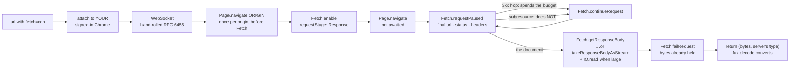

<!-- COMPONENTS-START — GENERATED from records/README.md's OWNERSHIP and DESCRIBES tables by scripts/gen-components.py. Do not edit by hand: change the table, then run `python scripts/gen-components.py --write`. -->

**Owns** — the components this record decides:

- [`.fux/fetchers/cdp.py`](../.fux/fetchers/cdp.py) · file
- [`src/fux/templates/cdp.py.txt`](../src/fux/templates/cdp.py.txt) · file

<!-- COMPONENTS-END -->

# SR-CDP-FETCHER — the browser fetcher

## §1 — For humans

Some documents a plain GET cannot reach. A Confluence page, a SharePoint
workbook, an internal dashboard — the bytes on the wire are a loading shell or a
redirect to a sign-in page, and the document you wanted is behind a session a
headless client does not have.

`cdp.py` handles that by **borrowing the browser you already have**. It attaches
to your running, already-signed-in Chrome over the Chrome DevTools Protocol,
navigates to the URL, and **intercepts the response** — handing fux the exact
bytes the server sent, with the server's own content type. Because it is *your*
browser, it is *your* session: documents you can open are documents it can read,
with no credential ever entering fux's config.

**It returns the resource, not a rendering of it.** That is the whole design,
and it is what makes a `.xlsx` behind a login as ingestible as a wiki page.

Three properties are worth stating because none was forced:

**It carries no dependency.** The WebSocket client is hand-rolled RFC 6455 on
stdlib `socket`. L1 binds fux's runtime, not your fetcher — this file could have
imported `websockets` and nothing would have broken. It does not, so
`pip install fux-engine` remains the whole install even for the browser path.

**It never renders.** Until 2026-09-01 this file read
`document.documentElement.outerHTML` back out of the page. A rendered DOM
carries nonces, timestamps and session ids, so its sha changed on every fetch —
nondeterministic input to an engine whose central guarantee is byte-identical
output (L3). Interception has no such property: the bytes are the server's.

**It is never escalated to.** A URL uses this fetcher because a human wrote
`fetch=cdp` on its line ([SR-URL-LIST](0116_url-list.md)), not because a
cheaper fetch failed and something retried. That is
[SR-FETCHER](0117_fetcher.md) decision 5, and it is what keeps the same URL
producing the same bytes on a bad network day.

**Diagram — Mermaid and its ASCII twin. Update both, always, together.**



<details>
<summary><b>ASCII twin</b> — the same diagram, for terminals, diffs, and any reader without a Mermaid renderer</summary>

```text
  url (fetch=cdp)
        |
        v
  discover or launch YOUR Chrome  --(never a bundled browser)
        |
        v
  WebSocket: hand-rolled RFC 6455 on stdlib socket  --(no dependency)
        |
        v
  Page.navigate(ORIGIN)  --(once per origin, BEFORE Fetch is enabled, so it
        |                   is a plain command with nothing paused to deadlock
        |                   against. A tab with no history is CLOSED BY CHROME
        v                   when its navigation becomes a download.)
  Fetch.enable(urlPattern "*", requestStage "Response")
        |
        v
  Page.navigate   --(NOT awaited: it cannot commit while we hold the
        |            response paused; awaiting it deadlocks)
        v
  Fetch.requestPaused  --> final url, status, response headers
        |
        |--- 3xx hop (spends the redirect budget) -----------------+
        |--- subresource (does NOT spend it) --> continueRequest --+|
        |                                                          ||
        |<---------------------------------------------------------++
        v
  the document response
        |
        v
  body: getResponseBody, or takeResponseBodyAsStream + IO.read
        |       when Content-Length declares more than STREAM_ABOVE_BYTES
        v
  Fetch.failRequest(Aborted)
        |                                    ^
        |                                    |
        |                       we hold the bytes; completing would
        |                       render the page or write a download
        v
  return (server's bytes, server's content type) --> fux.decode

  EVERY paused request is continued or failed. One that is neither
  wedges the page until the timeout -- it does not raise.

  ONLY A REDIRECT spends the redirect budget. Counting subresources
  reported a sign-in loop for a page that had none.

  A dead socket is DIAGNOSED, not reported as "closed mid-frame":
  ask /json whether the tab, or the browser, is what went away.

  This file does NOT convert. Agreement with http.py is structural.
```

</details>

### Examples

Declare it per URL — only lines that need a browser get one
([SR-URL-LIST](0116_url-list.md)):

```console
$ cat .fux/sources/urls
https://example.com/docs/api                 # plain GET; no fetcher decision
https://wiki.corp/display/ENG/runbook        fetch=cdp
```

Tune it from `fux.toml`, never by editing the file, so your edits and an upgrade
cannot collide:

```toml
[sources.url]
fetcher = ".fux/fetchers/cdp.py"

[sources.url.config]        # fux passes this VERBATIM and reads no key in it
cdp_port       = 9222
load_timeout_s = 30
launch_chrome  = false      # the default, and the point — see decision 13
```

⚠ **`settle_ms` is retired** and raises a message saying so rather than falling
into the generic unknown-key list: there is no render step left to settle. A
key that reads as a typo when the real answer is "that setting no longer
describes anything" costs a reader an afternoon.

---

## §2 — For agents

### Context

[SR-FETCHER](0117_fetcher.md) says fux never fetches, which is only useful if a
fetcher exists that can reach the documents the design point actually cares
about. The litmus is a large corporate corpus: Confluence, SharePoint, internal
wikis. Those are the JavaScript-rendered, session-gated case, not the
static-file case — so the **first** fetcher had to be the hard one, or the cap
would have looked like a way to avoid the problem rather than a way to place it.

The transport was already solved and thrown away once: the archived engine
shipped and dogfooded this exact path. Porting it was cheaper than rebuilding
it, and is covered by [SR-PORT-LIST](0114_port-list.md)'s discipline of porting
with tests rather than rewriting.

⚠ **What the port brought with it was the wrong output.** The archived engine
rendered pages, so this file rendered pages, and that went unexamined for two
releases. It surfaced when the corpus stopped being pages: a SharePoint
workbook has no `outerHTML` worth indexing. **W-98 rebuilt the middle of this
file on 2026-09-01** — the transport, the contract and the ownership are
unchanged; what `fetch()` *returns* is not.

### Decision

**1. Drive the user's existing Chrome; never bundle or download a browser.**
Discover a running instance on the configured port, or launch the one already
installed. A tool that downloads a browser has a several-hundred-megabyte
install and an air-gap story it cannot tell.

**2. Stdlib only, by choice.** RFC 6455 hand-rolled on `socket`. L1 binds fux's
runtime and not consumer code, so this is a choice — made so that the browser
path costs no install step and the file stays readable as a worked example of
the contract.

**3. Ported from the archived engine, with its tests.** Named, not cited — the
archive is not evidence.

**4. Tunables come from `[sources.url.config]`, not from editing the file.**
The constants in the file are *defaults*; the table overrides them. This keeps a
consumer's `fux.toml` diff small and their fetcher file mergeable, and it is
[SR-FETCHER](0117_fetcher.md) decision 8 in use.

⚠ **A key only THIS fetcher has may not go in that table**, and the reason is
decision 8's own passthrough rule: the table reaches **every** fetcher verbatim
and each `configure()` raises on a key it does not know, so a `cdp_`-only
tunable breaks a repo that also loads `http.py`. That is why the tunables added
since (`MAX_REDIRECTS`) are module constants. **`fetcher_max_parallel` is the
one exception and the shape of it is the rule**: it is a setting *both* shipped
fetchers have, so both accept the key and neither breaks the other. A setting
one file has stays a constant.

**5. It returns the server's bytes and the server's content type, and converts
nothing.** `fetch()` hands back the body exactly as received and the
`Content-Type` off the intercepted response headers. **This changed on
2026-09-01**: it used to return rendered HTML with `text/html` *declared*,
because a rendering has no server header to read. Interception has one, so
guessing stopped being necessary — and guessing here writes the wrong bytes
into the index. `fux.decode` does the conversion, as it always did.

⚠ **Agreement with `http.py` is structural rather than shared.** This file once
carried its own copy of the HTML→Markdown pass, marked *"Kept identical to…"* by
a comment and kept identical by nothing. **There is now nothing left in either
file that could disagree** — which matters because *which fetcher retrieved a
document* must never change a committed byte.

**Link extraction stays here.** Crawling is this fetcher's job and has no
business in the decoder plane, which may not open a socket (L4).

**6. This fetcher is chosen by declaration.** `fetch=cdp` on the URL's line. It
is never the target of an automatic escalation from a cheaper fetcher.

**7. `MAX_PARALLEL = 1`, declared explicitly rather than omitted.** Omission and
`1` behave identically; the explicit line is where the reason gets written for
the consumer who copies the file and starts editing it.

🔴 **The reason this record and the file itself both gave was FALSE, and a
false reason is worse than none** (W-105, 2026-09-01). Both said a module-global
`_session` holds **one WebSocket that every `fetch()` reuses**.
`fetch_resource()` opens a fresh `WebSocket` per call and closes it in a
`finally`, and had done for some time — **so a reader who gave each worker its
own socket would have concluded the hazard was discharged and raised the
number.** What was actually shared across concurrent fetches on one session:

| shared | what two threads did to it |
|---|---|
| `_msg_id` | non-atomic `+= 1` — two commands take one id, and `_call` returns the other one's reply |
| `_results` / `_events` | **cleared at the top of every `fetch_resource`**, so one thread wiped the other's pending replies and paused requests mid-flight |
| `_page_target()` | returned the **first** page target, so two threads called `Page.navigate` on the **same tab** |
| `ensure_chrome()` / `self.chrome` | two threads could race to launch a browser |

All four yield the same failure — **plausible documents attributed to the wrong
URLs**, in the committed index, **past every determinism check**, found only by
a human reading an answer. The third is the one that produces it most directly,
and no amount of care around the socket would have touched it.

**7a. Per-fetch protocol state, per-worker tab** (W-105). `_Conn` owns the
socket, the id counter and both queues for the duration of one `fetch_resource`;
`_own_target()` gives each worker thread its own page target, created on first
use; `ensure_chrome()` is guarded by a `threading.Lock`. **The two `clear()`
calls are gone** — fresh state per fetch is what they were approximating, and
owning it removes the thing there was to clear.

- ⚠ **Behaviour change: fux no longer drives a tab you had open.** The old
  `_page_target()` returned the first existing page target and navigated it —
  which is to say, a human's foreground tab. It now opens its own. **Same
  Chrome, same profile**, so the signed-in session this fetcher exists for is
  unaffected.
- **A tab this module opened is a tab this module closes.** `_opened` holds
  exactly those ids and `close()` closes exactly that set. Inferring it by
  diffing `/json` would close a human's tabs; not tracking it would leak one per
  worker across a long run. Neither is acceptable and the explicit set is why.
- **`connect()` / `close()` stay once per fetcher group, never once per
  worker** — [SR-FETCHER](0117_fetcher.md) decision 9's contract, unchanged.

**7b. It still ships declaring `1`, and that is deliberate.** 7a makes a higher
number *possible*; only a live multi-URL run against real Chrome, asserting each
record's content matches its `loc`, makes one *justified*. 🔴 **No test in this
repo can stand in for that run** — the sort still runs, the index is still
deterministic, and CI is green either way. Raise it with
`[sources.url.config] fetcher_max_parallel`
([SR-FETCHER](0117_fetcher.md) decision 9a), which both shipped fetchers accept
under that one name because this table reaches every fetcher verbatim. Each tab
is a renderer process, so the ceiling is a statement about the consumer's
machine and fux cannot know it.

⚠ **7c. That run has now happened, and it is filed** —
[`2026-09-02-cdp-parallel`](../work/regression/2026-09-02-cdp-parallel/report.md).
Real Chrome, real CDP, a real thread pool, 12 loopback pages each stating their
own path, two arms at parallel 1 / 2 / 4 / 6.

| parallel | pre-W-105: fetch returns its own page | HEAD |
|---:|---:|---:|
| 1 | **12 / 12** | 12 / 12 |
| 2 | **0 / 12** | 12 / 12 |
| 4 | **1 / 12** | 12 / 12 |
| 6 | **0 / 12** | 12 / 12 |

Three things it settles, and one it does not:

- **Decision 7's corruption claim is measured, not argued.** Seven of the
  pre-fix failures are **200 OK with another page's body** — the silent kind.
  `validate()` fails the same way (`"etag-p6"` returned for `/p4`), which is
  worse: a wrong ETag that happens to match makes fux **skip a document that
  changed**, and no surface reports that.
- **Both arms pass at parallel 1**, so the number this file ships was never
  itself unsafe. **The defect was the explanation** — exactly as 7 says.
- **`close()` leaked no tab in any of the eight runs**, including the pre-fix
  runs that errored 11 of 12 URLs. `_opened` is why.
- 🔴 **It does not justify a number.** Every page was loopback HTML with no
  auth, no redirect, no CDN hop — the opposite of what this fetcher exists for —
  and each tab is a renderer process, so the ceiling stays a statement about the
  consumer's machine. **`MAX_PARALLEL` stays `1`.** The run makes raising it a
  decision someone can take; it does not take it.

**8. It is yours.** Committed to your repo, never rewritten by fux, and every
part of it — port, wait strategy, extraction, even the transport — is editable.
Swapping in Playwright is a supported outcome; fux imports none of it, only the
entry points.

**9. It reaches your repo through `fux setup`, and only then.** The file ships
in the wheel as package data
([`src/fux/templates/cdp.py.txt`](../src/fux/templates/cdp.py.txt)) with an
extension Python cannot import, and `fux setup` copies it into
`.fux/fetchers/cdp.py` write-if-missing. **Ingest never writes it** — a repo
that indexes only local files never sees a byte of WebSocket code, which is what
decision 1's *never bundle a browser* is worth nothing without.

**10. The bytes come from the paused response, never from the page** —
`Fetch.getResponseBody` for an ordinary body, `Fetch.takeResponseBodyAsStream`
plus `IO.read` for a large one. `Fetch.enable` at `requestStage: "Response"`,
`Page.navigate`, then read the body off the paused response.

⚠ **`getResponseBody` returns the WHOLE body base64'd into a SINGLE CDP
message, and DevTools does not fail on a message it will not carry — it drops
the socket** (found 2026-09-14). Base64 inflates by a third, and a spreadsheet
or PDF behind a `?download=1` link reaches the ceiling routinely, so this is a
normal path and not an edge case. A body whose `Content-Length` declares more
than `STREAM_ABOVE_BYTES` is streamed instead, and a `getResponseBody` that
fails anyway **falls back to the stream rather than to nothing** — a large body
that declares no length is exactly the case the threshold cannot see.
`takeResponseBodyAsStream` *takes* the body: `getResponseBody` on that request
is gone afterwards, and the request still has to be resolved per decision 11.

⚠ **The obvious alternative was tried and measured, and it cannot do the job.**
An in-page `fetch(url, {credentials:'include'})` via `Runtime.evaluate` was the
specified technique until spike step 5:

| target | in-page `fetch` | interception |
|---|---|---|
| cross-origin URL sending no `Access-Control-Allow-Origin` | 🔴 `TypeError: Failed to fetch` | ✅ **8557 bytes** |
| cross-origin binary, no `ACAO` | — | ✅ 17174 bytes |
| `Content-Disposition: attachment` | — | ✅ intercepted **before** Chrome makes it a download |

**CORS and CSP are page-level; CDP is browser-internal and neither reaches it.**
And a cross-origin in-page fetch exposes only the **CORS-safelisted** response
headers, so `ETag` is invisible — decision 12 could never have been built on it.
That is not a performance argument: the technique cannot deliver a stated
deliverable.

**11. `urlPattern` is `"*"`, and every paused request is resolved.** The two
follow from each other. A download URL typically 30x-es to a CDN on another
host, and each hop is its own `Fetch.requestPaused` — a pattern narrowed to the
requested URL stops matching at the first redirect and the fetch hangs until
`LOAD_TIMEOUT_S`. The price of `"*"` is that subresources pause too, so **every
paused request is continued or failed, always**. ⚠ **An unresolved one wedges
the page; it does not raise.** The captured document is *failed* rather than
continued — the bytes are already held, and completing the navigation would
either render a page nobody reads or write a download to disk.

⚠ **Only a REDIRECT may spend the redirect budget, and getting that wrong
produced a confident wrong diagnosis** (found 2026-09-14). `MAX_REDIRECTS` was
decremented once per *paused request*, and `urlPattern` is `"*"` — so a page
whose subresources paused ahead of its document exhausted the cap and raised
*"more than 20 redirects … or a sign-in flow bouncing between an identity
provider and the site"*. **The misdiagnosis is the expensive half**: it sends a
reader after an auth loop that does not exist, on a page that has none. The
budget now counts documents only. Reproduced with 25 subresource pauses ahead
of the document; a real 30-hop chain still trips at 20.

⚠ **`Page.navigate` is dispatched without awaiting its reply.** It does not
return until the navigation commits, and it cannot commit while we hold its
response paused. Awaiting it deadlocks until the timeout. This is the one line
in the file that looks like a missing `await` and is not.

**12. `validate(url)` returns the server's `ETag`, and saves the decode — not
the download.** It is [SR-FETCHER](0117_fetcher.md)'s optional fifth entry
point, so `None` ("I cannot tell") degrades to a full fetch and the sanitized-sha
comparison still decides whether any shard is written.

⚠ **State the limit rather than let it be assumed.** Interception happens at
`requestStage: "Response"`, so Chrome has already transferred the body by the
time these headers exist. What a matching token saves is the decode and the
shard comparison, **not bandwidth**. A header-only check needs a HEAD request,
which the session-gated sites this fetcher exists for routinely refuse. The word
"validate" invites the opposite reading, which is why the docstring and this
decision both say it outright.

**Accepted as the ETag criterion by Arpit on 2026-09-05 (ruling R-1), with no
code** — the acceptance is of this decision as written, limit included. What he
asked for *instead* of chasing the bandwidth is a declared knob:
[SR-URL-LIST](0116_url-list.md) decision 14's `update = auto|never`. 🔴 **That
knob is not this saving.** It buys bandwidth by giving up freshness; this would
have bought the check cheaply and stayed fresh. Neither substitutes for the
other, and a reader who conflates them will believe fux got a saving it did not.

**Veto condition, and it is a condition to check rather than an event to await:**

> **Re-cost request-stage interception if either becomes true.** (a) A consumer
> reports refresh bandwidth as a blocker. (b) A corpus with more than a few
> hundred `update=auto` URLs is deployed behind a metered or proxied network.
>
> The design that would deliver the original promise is `Fetch.requestPaused` at
> the **Request** stage, injecting `If-None-Match` and letting the server answer
> `304`. **Not costed, not built, and not authorised** — naming it here is so
> nobody re-derives it, not so anybody builds it.
>
> **How to check:** `fux doctor`'s `url sources` row reports the pinned count;
> the un-pinned remainder of `.fux/sources/urls` is (b)'s number.

**13. `LAUNCH_CHROME` defaults to `False`, and the default is the feature.** A
browser this file launched is signed in to nothing, so every URL worth a browser
comes back as a login page. It flipped from `True` on 2026-09-01 — the old
default made sense for a renderer of public pages and makes none for a fetcher
whose entire value is a borrowed session. Not signed in fails loudly rather than
indexing the sign-in page.

**14. The tab visits the URL's ORIGIN before the URL, once per origin.**
`Page.navigate(origin)` runs *before* `Fetch.enable`, so it is a plain command
with no paused response to deadlock against — the deadlock decision 11 warns
about applies only to the navigation being intercepted. A failure is swallowed:
a 404 or a redirect to a sign-in page on the origin root still leaves the tab
with history, which is the property this step exists to create.

⚠ **This is not politeness, and it is not a cache warm-up. A tab created by
`/json/new` has NO HISTORY, and Chrome closes a history-less tab the moment its
navigation becomes a download** — which closes this fetcher's CDP socket with
it. The symptom is `WebSocket closed mid-frame` on exactly the URLs this
fetcher exists for: a SharePoint `?download=1` workbook, or anything serving
`Content-Disposition: attachment`. Found 2026-09-14 on a real corpus, after the
entry had recorded five consecutive failed runs.

⚠ **It is also what the 2026-08-31 design note asked for and the implementation
dropped** — *"navigate once per ORIGIN (to establish session), then in-page
fetch many URLs on that host"*. The in-page-fetch half was correctly abandoned
(decision 10); the origin half was correct and was lost with it. Committing a
page on the origin is where the browser's session for that host is established,
which is the entire reason this fetcher exists.

**15. A dead socket is diagnosed, not reported.** `WebSocket closed mid-frame`
is true and useless: it says the peer went away and cannot say whether the
**tab** was destroyed, the **browser** died, or **DevTools dropped an oversized
message** — three causes with three different fixes. Chrome still knows for a
moment, so `_diagnose()` asks `/json` at failure time and names which one, with
the fix for that one. It also drops the thread's dead target, so the next fetch
opens a fresh tab instead of reusing an id Chrome has already forgotten.

⚠ **The write side of the socket had to be converted too.** `_recv_exact`
raised `FetcherError` when the peer vanished; `send_text` did not, so a peer
that went away *between two commands* escaped as a raw `BrokenPipeError`,
reached the CLI as `[Errno 32] Broken pipe`, and **never entered the diagnosis
at all**. Same failure, same class of error, two code paths — which is how one
of them stayed unconverted.

### What it looks like

**The entry points, as this file implements them:**

```python
def configure(config: dict) -> None: ...   # [sources.url.config], verbatim;
                                           # module constants are only defaults
def connect() -> None: ...                 # discover Chrome on cdp_port, or
                                           # launch the installed one
def fetch(url: str) -> tuple[bytes, str]: ...
                                           # Fetch.enable -> navigate ->
                                           # requestPaused -> getResponseBody
                                           # -> (server bytes, server type)
                                           # Raises: fux skips, keeps prior record
def validate(url: str) -> str | None: ...  # the ETag, or None = "cannot tell"
                                           # decision 12 — saves the decode,
                                           # NOT the download
def close() -> None: ...                   # called even if a fetch raised

MAX_PARALLEL = 1                           # one shared WebSocket — decision 7
```

**A run**, captured against the no-network fetcher that stands in for this one
in [the filed fixture](../work/regression/2026-08-18-ingest-and-index/report.md) §6.
The lifecycle is the real thing; only the transport differs:

```console
$ fux ingest
  [fetcher] configure({'greeting': 'hello'})
  [fetcher] connect()
  [fetcher] close()
ingested 4 docs (2 changed), 3 skipped, 2 shards written
  skip https://example.invalid/gone: fetch failed: 404 not found
```

`configure` receives the table verbatim, `connect`/`close` bracket the batch,
and a failed page is a **skip** that keeps the previous record — never a
deletion.

**What lands in the index.** Nothing in the record says a browser was involved:
`fetch=` is a routing decision, not a property of the document. Captured with
`meta` at its `hashed` default — note `title_h`, its `h:` prefix
([SR-RECORD](0109_index-record.md) rule 2), and the absence of
`title`/`phrases`. ⚠ **Two things below are no longer what fux writes, and the
capture is left unedited because a capture is evidence:** `flen` replaced
`wlen`, and **W-194 deleted `meta` and `title_h` on 2026-09-20**, so a record
taken today carries `title` and `phrases` and neither field shown here. **The
decision this example illustrates is untouched** — nothing in the record says a
browser was involved:

```json
{
  "id":      "url:https://example.invalid/handbook/oncall",
  "loc":     "https://example.invalid/handbook/oncall",
  "src":     "url",
  "meta":    "hashed",
  "mode":    "extracted",
  "sha":     "2643f1afb68339f2f808d85f67aad193b820dd86",
  "title_h": "h:30aef0c52cf11116",
  "ver":     1,
  "wlen":    11
}
```

**`mode` is `extracted`.** A browser retrieved the document and the record is
still deterministic: what the fetcher returns is *bytes the server sent*, and
everything after that is the same extraction any repo file gets
([SR-EXTRACTED](0115_extracted-mode.md)). **Borrowing a session is not
enrichment.**

**Output — the file's own tests, captured 2026-09-01.** They drive the CDP
conversation against a scripted peer, so no Chrome and no socket is involved:

```console
$ uv run pytest -q tests/ingest/test_cdp_fetcher.py
...........................                                              [100%]
27 passed in 0.04s
```

**`cdp_port` — and every other key here — can come from the environment or a
`.env`, and those BEAT `fux.toml`** (Arpit, 2026-09-14: *"cdp_port define it in
a way that it can pick values from .env file also"*).

```
1. the process environment          FUX_CDP_PORT=9333 fux ingest
2. .env at the repo root            FUX_CDP_PORT=9333
3. [sources.url.config.cdp]         cdp_port = 9333
4. the module default               CDP_PORT = 9222
```

- 🔴 **The environment beats the file, and reversing that would make the
  feature pointless.** `fux.toml` is **committed**: one `cdp_port` in it pins
  every machine that clones the repo, and the debugging port a person's
  signed-in Chrome happens to be on is the most machine-specific value this
  fetcher has. It became urgent the moment the scaffolded `fux.toml` started
  writing `cdp_port = 9222` live ([SR-DOTFUX](0102_fux-directory.md)) — before
  that the key was absent and the default simply applied.
- **One mechanical rule, no table of special cases:** `FUX_` + the config key
  upper-cased. `cdp_port` → `FUX_CDP_PORT`, `launch_chrome` →
  `FUX_LAUNCH_CHROME`. Derived from `_SETTINGS`, so a key added there gets an
  override without a second list to update.
- ⚠ **`bool` is coerced HERE, not by `_SETTINGS`.** `bool("false")` is `True`,
  which for `FUX_LAUNCH_CHROME=false` would launch a signed-out Chrome and
  return login pages for everything — the exact failure `LAUNCH_CHROME = False`
  exists to prevent. `1/true/yes/on` and `0/false/no/off`, anything else raises.
- **Only `FUX_`-prefixed names are read from `.env`, and no value is ever
  logged.** A `.env` is where people keep secrets; this file has no business
  seeing the rest of it, and a test asserts it rather than trusting the comment.
- **The parser is deliberately small** — `KEY=value`, `#` comments, optional
  `export`, optional quotes. No interpolation, no multi-line values: a `.env`
  needing those is one this should not be guessing at. Stdlib only, so
  [L1](0003_LAW-1-zero-cost.md) is untouched — no `python-dotenv`.
- **The root is found by walking up for `fux.toml` or `.git`**, so running
  `fux` from a subdirectory still finds the repo's `.env`.
- ⚠ **No determinism question.** None of these keys reaches a committed byte:
  they decide *how to reach* Chrome, never what a document says.
  [L3](0005_LAW-3-deterministic.md) is unaffected.

### Consequences

- **A browser must exist on the machine that ingests.** Fine for a developer
  laptop and for most CI, and it is the price of reading pages that only exist
  after JavaScript. A URL that does not need it should not declare `fetch=cdp`.
- **This is the slow path.** A browser round trip per URL. It is why
  [SR-HTTP-FETCHER](0119_http-fetcher.md) is the default and this is the
  opt-in, rather than the other way round.
- ⚠ **A wedged page does not raise, it waits.** Decision 11's invariant has no
  mechanical guard inside Chrome: forget to resolve a paused request and the
  symptom is a `LOAD_TIMEOUT_S` stall that reads as a slow site.
  [`tests/ingest/test_cdp_fetcher.py`](../tests/ingest/test_cdp_fetcher.py)
  asserts each paused request is resolved exactly once, which is the only thing
  standing between that invariant and a plausible-looking regression.
- **A rendered page is no longer obtainable from this file.** A consumer who
  genuinely wanted the DOM — a client-side-rendered page with no underlying
  document — now has to write it. The implementation is kept at
  [`archive/templates/cdp-rendering.py.txt`](../archive/templates/cdp-rendering.py.txt)
  ⚠ **as a record of what was built, never as a live citation.**
- **`settle_ms` breaks on upgrade, loudly and on purpose.** A repo carrying it
  in `[sources.url.config]` gets a message naming the retirement rather than a
  silent no-op.
- **It is not linted** and it is several hundred lines of consumer code carrying
  a protocol implementation. Its test exists precisely because nothing else
  guards it.
- ⚠ **Decision 7 caps it at one worker, so a large URL list on `fetch=cdp` is
  strictly sequential** — the honest cost of a shared session, stated rather
  than discovered when someone wonders why `fux ingest` is slow.

### Alternatives considered

- **Playwright or Selenium.** Rejected for the default reference fetcher: a
  dependency plus a browser download, and the thing being demonstrated is that
  the contract needs neither. Still fully supported as *your* choice —
  decision 8.
- **A bundled headless browser.** Rejected under decision 1: install size, and
  it breaks the air-gapped and locked-down-corporate story that is the whole
  design point.
- **`requests` + a readability heuristic.** Rejected: a dependency, and it does
  not solve the case this fetcher exists for — a page that has not rendered yet
  has nothing to be readable about.
- **Making this the default fetcher.** Rejected: it demands a browser for URLs
  that a plain GET would have answered. See
  [SR-HTTP-FETCHER](0119_http-fetcher.md).
- **Keeping a private HTML→Markdown copy here.** Rejected under decision 5: two
  copies of one converter make *which fetcher ran* a fact about the committed
  index, which is L3 demoted to a code comment.
- **An in-page `fetch()` via `Runtime.evaluate`.** Rejected on a measurement,
  not a preference — decision 10's table. CORS and CSP are page-level; it
  cannot read a cross-origin body, and it cannot see `ETag` at all.
- **`Browser.setDownloadBehavior` + `Browser.downloadProgress`.** Rejected. It
  answers "give me the file by id" and Chrome writes `<downloadPath>/<guid>` —
  but it goes via disk, hands back **no response headers** (so no `ETag`, no
  real content type), and needs a completion handshake. Interception gets the
  `Content-Disposition: attachment` case without any of it. Recorded so it is
  not rediscovered as a new idea.
- **`Network.getResponseBody` instead of `Fetch.getResponseBody`.** Rejected:
  it needs the response to still be in Chrome's buffer and races the page.
  Pausing the response removes the race entirely.
- **Narrowing `urlPattern` to the requested URL.** Rejected under decision 11 —
  it stops matching at the first redirect, which is precisely the case this
  fetcher exists for.
- **A per-worker `connect()`/`close()` so this could parallelise.** Rejected:
  it changes the contract for every fetcher to accommodate one, and a consumer
  who wants it can raise `MAX_PARALLEL` in their own copy after making `fetch`
  reentrant.

### Reference (required)

- The file itself — [`.fux/fetchers/cdp.py`](../.fux/fetchers/cdp.py), whose
  module docstring states the contract it implements; the shipped template —
  [`src/fux/templates/cdp.py.txt`](../src/fux/templates/cdp.py.txt).
- Its test, including that it lives in the declared plane —
  [`tests/ingest/test_cdp_fetcher.py`](../tests/ingest/test_cdp_fetcher.py).
- The contract, including `validate` as the optional fifth entry point —
  [SR-FETCHER](0117_fetcher.md).
- The spike that decided the technique — **its measured byte counts are in
  decision 10's own table above**, carried into this record rather than left in
  the item, because the item was archived when the phases landed and an
  archived doc may be named but never cited. The item itself:
  [`archive/open/W-98-acquired-plane.md`](../archive/open/W-98-acquired-plane.md)
  §9 step 5, **named only**.
- The retired rendering path, **named and not cited** —
  [`archive/templates/cdp-rendering.py.txt`](../archive/templates/cdp-rendering.py.txt).
- The behaviour around it, captured against a no-network fetcher —
  [`work/regression/2026-08-18-ingest-and-index/`](../work/regression/2026-08-18-ingest-and-index/report.md) §6.
- **The four defects fixed 2026-09-14** (decisions 10, 11, 14, 15) were each
  reproduced before being fixed, against a **fake CDP endpoint that reuses this
  file's own frame codec** — so the client under test is the real one, and the
  scenarios (`subresources`, `loop`, `bigbody`, `tabdeath`, `socketdrop`,
  `browserdeath`) are scripted rather than hoped for. ⚠ **The harness is not in
  the repo yet and this is therefore an unguarded claim**: it ran on Arpit's
  machine during the session that made the fix. Landing it under
  `tests/ingest/` is owed — a defect class recorded twice becomes a gate, and
  this is occurrence one.
- The WebSocket framing this implements — RFC 6455:
  https://www.rfc-editor.org/rfc/rfc6455
- The protocol it speaks — Chrome DevTools Protocol:
  https://chromedevtools.github.io/devtools-protocol/

### Veto condition

**Reopen this decision if** the file acquires an `import` outside the standard
library, if it stops being reachable only by declaration, or if `fetch()` starts
returning something the server did not send — each means a property §1 claims
for it is no longer true of the bytes.

**How to check it:**

```bash
# 1. stdlib only — anchored on a real import statement, because the module
#    docstring contains English sentences starting "from …" that a looser
#    pattern matches and a reader then has to dismiss by hand every time
grep -nE "^(import [a-z_.]+|from [a-z_.]+ import )" .fux/fetchers/cdp.py \
  | grep -vE "socket|ssl|json|base64|hashlib|struct|os|sys|time|re|html|urllib|subprocess|shutil|pathlib|typing|dataclasses|__future__"
# expect: no output

# 2. no browser is downloaded or bundled
grep -niE "download|install|playwright|selenium" .fux/fetchers/cdp.py
# expect: no output outside prose about swapping it yourself

# 3. it is still chosen by declaration, not escalation
grep -rn "fetch=cdp\|escalat\|fallback" src/fux/ingest/urlsrc.py
# expect: no automatic-escalation logic in fux's half

# 4. it still converts nothing
grep -n "markdown\|html_to_\|fux.decode" .fux/fetchers/cdp.py
# expect: no conversion — decision 5

# 5. it returns the resource, not a rendering — decisions 5 and 10
grep -n "outerHTML\|Runtime.evaluate\|loadEventFired" .fux/fetchers/cdp.py
# expect: no output outside the docstring explaining why they are gone

# 6. every paused request is resolved — decision 11
grep -c "Fetch.continueRequest\|Fetch.failRequest" .fux/fetchers/cdp.py
# expect: >= 2, and `_resolve` is the only caller of either

# 7. no protocol state on the shared session — decision 7a
grep -nE "self\._(msg_id|results|events)" .fux/fetchers/cdp.py
# expect: no output. Any hit is state two workers share, which is the
# corruption decision 7 describes, back again

# 8. the session does not hand out a tab it did not open — decision 7a
grep -n "_page_target\|_opened" .fux/fetchers/cdp.py
# expect: `_opened` only. `_page_target` returning the first existing target
# is what put two threads on one tab
```

⚠ **Checks 7 and 8 are greps and they are not the guard.** They catch the shape
of the old defect coming back; they cannot catch a new one. **The guard for this
decision is a live run**, per 7b, and this record says so rather than letting a
green grep read as evidence.

---

## References

*Every source this record cites, gathered in one place. §2's **Reference
(required)** names the grounding; this is the complete list. An archived
document is never listed here — the body may name one, but archive is not
evidence.*

**Records** — [SR-LAWS](0001_LAWS.md) · [SR-RECORD](0109_index-record.md) ·
[SR-PORT-LIST](0114_port-list.md) · [SR-EXTRACTED](0115_extracted-mode.md) ·
[SR-URL-LIST](0116_url-list.md) · [SR-FETCHER](0117_fetcher.md) ·
[SR-HTTP-FETCHER](0119_http-fetcher.md) · [SR-DECODE](0139_decode.md)

**Code**

- [`.fux/fetchers/cdp.py`](../.fux/fetchers/cdp.py)
- [`src/fux/templates/cdp.py.txt`](../src/fux/templates/cdp.py.txt)
- [`tests/ingest/test_cdp_fetcher.py`](../tests/ingest/test_cdp_fetcher.py)

**Measured evidence**

- [`work/regression/2026-08-18-ingest-and-index/report.md`](../work/regression/2026-08-18-ingest-and-index/report.md)
- [`work/regression/2026-08-19-w54/report.md`](../work/regression/2026-08-19-w54/report.md)

**Papers and specifications**

- Chrome DevTools Protocol — the transport the shipped browser template uses
  <https://chromedevtools.github.io/devtools-protocol/>
- CDP `Fetch` domain — `requestStage`, `getResponseBody`, `continueRequest`,
  `failRequest`; the interception this file is built on
  <https://chromedevtools.github.io/devtools-protocol/tot/Fetch/>
- Fetch Standard §CORS-safelisted response-header name — why an in-page
  cross-origin fetch cannot see `ETag`
  <https://fetch.spec.whatwg.org/#cors-safelisted-response-header-name>
- RFC 6455 (The WebSocket Protocol) — the framing this implements
  <https://www.rfc-editor.org/rfc/rfc6455>
