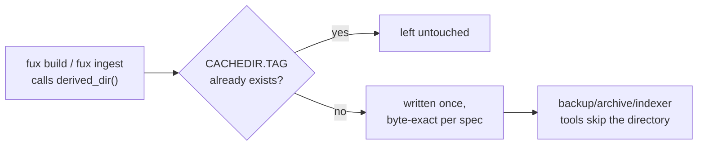

<!-- COMPONENTS-START — GENERATED from records/README.md's OWNERSHIP and DESCRIBES tables by scripts/gen-components.py. Do not edit by hand: change the table, then run `python scripts/gen-components.py --write`. -->

**Owns** — the components this record decides:

- [`node/src/store/cachedir.mjs`](../node/src/store/cachedir.mjs) · file
- [`src/fux/store/cachedir.py`](../src/fux/store/cachedir.py) · file

<!-- COMPONENTS-END -->

# SR-CACHEDIR-TAG — CACHEDIR.TAG marks a derived directory disposable

## §1 — For humans

Every derived directory under `.fux/` — today `.fux/runtime/`, which nests the
fetch cache at `.fux/runtime/fetch-cache/` rather than a separate top-level
directory — carries a small marker file, `CACHEDIR.TAG`, the first time it is
created. It is not Fux's own invention: it is a fixed, published convention that
backup tools, archivers, and IDE indexers already know how to read, so the
directory is skipped by every one of them **without a single line of
Fux-specific configuration anywhere**.

The file is written once and never touched again. Its bytes are pinned by the
spec, byte for byte — no version string, no timestamp, nothing that would make
two builds produce different tag files.

**Diagram — Mermaid and its ASCII twin. Update both, always, together.**



<details>
<summary><b>ASCII twin</b> — the same diagram, for terminals, diffs, and any reader without a Mermaid renderer</summary>

```text
   fux build / fux ingest calls derived_dir()
              |
              v
   CACHEDIR.TAG already exists? --yes--> left untouched
              |
              no
              v
   written once, byte-exact per the bford.info/cachedir spec
              |
              v
   backup / archive / IDE-indexer tools skip the directory, unconfigured
```

</details>

### Examples

The full, real content of `.fux/runtime/CACHEDIR.TAG` in this repo — three
lines, nothing else:

```console
$ cat .fux/runtime/CACHEDIR.TAG
Signature: 8a477f597d28d172789f06886806bc55
# This file is a cache directory tag created by fux.
# For information about cache directory tags, see https://bford.info/cachedir/
```

---

## §2 — For agents

### Context

`.fux/runtime/` is regenerated on every `fux build` and can be sizable. Nothing
about it should ever be swept into a backup, a `tar` archive, or an editor's
file index — those tools would spend real time and space on bytes that a single
command reproduces. Reinventing a Fux-specific exclusion convention would mean
every backup tool, archiver and IDE needs its own configuration line; a
*published, adopted* convention needs none.

### Decision

**1. Byte-exact per the spec.** `CACHEDIR_TAG` in
[`store/cachedir.py`](../src/fux/store/cachedir.py) is fixed bytes — the
signature line plus two comment lines — with **no interpolated value of any
kind**. Since 2026-09-28 the body is `src/fux/templates/cachedir-tag.txt` and
its one placeholder is the spec's own signature, `[fuxdir] cachedir_signature`
([L12](0014_LAW-12-values-live-in-config.md) decision 6b, R13): nothing that can
vary by machine, run or version enters it.

**2. Written once, by `derived_dir()`.** The same function that creates
`.fux/runtime/` writes the tag immediately if it is absent, and never overwrites
it once present. The nested fetch cache does not call it directly — it lives
inside the already-tagged `runtime/`.

**3. ASCII, explicit `\n`.** Consistent with every other file `fux` generates at
the top level of `.fux/` — no locale dependency, no console-encoding surprise on
Windows.

**4. One tag per derived directory, never at `.fux/` itself.** The tag's job is
to mark the *specific* directory that is safe to skip. ⚠ **`.fux/index/` is
committed and must never carry one** — a tag there would make backup tools
silently skip the product, which is exactly the failure
[SR-DOTFUX](0102_fux-directory.md)'s committed/derived split exists to prevent.

⚠ **Unchanged by W-210 (2026-09-22), and touched here only because the register
says so.** That change edited two things in `src/fux/store/fuxdir.py`: the
`runtime` kind's description string, which gained `runtime/trace/`
([SR-DOTFUX](0102_fux-directory.md); [SR-SERVE](0158_serve.md)), and the verb
table `_readme()` writes, which gained `fux serve`
([SR-CLI](0101_cli-surface.md)). **Neither reaches this record's claim on that
file**, and saying so is the point of the freshness gate — the prompt is *re-read
the record*, and the honest outcome of re-reading it can be *nothing moved*.

⚠ **Unchanged by W-220 (2026-09-23), and touched here only because the register
says so.** That change edited one thing in `src/fux/store/fuxdir.py`: the
`runtime` kind's description string, which gained `runtime/inspect/`
([SR-DOTFUX](0102_fux-directory.md); [SR-INSPECT](0156_inspect.md)).
**It does not reach this record's claim on that file.**

<!-- L12-VALUES-START -->

**Where this record's fixed values live — [L12](0014_LAW-12-values-live-in-config.md), W-225, 2026-09-27.**
Each name below keeps its spelling in code and holds no literal: it is read from
[`src/fux/constants.toml`](../src/fux/constants.toml), and a missing key stops the
process naming it ([SR-CONSTANTS](0159_constants.md)). **The values are unchanged** —
this moved where they are written, not what they are.

- `src/fux/store/fuxdir.py` — `FUX_DIR` ← `[fuxdir] dir`, `GENERATED_FILES` ← `[fuxdir] generated`, `CACHEDIR_SIGNATURE` ← `[fuxdir] cachedir_signature`, `NODE_DIR` ← `[bundle] dir`, `NODE_ENTRY` ← `[bundle] entry`, `NODE_SHIM` ← `[bundle] shim`, and three file bodies from `src/fux/templates/` ([L12](0014_LAW-12-values-live-in-config.md) decision 6b, R13, 2026-09-28): `_GITIGNORE` ← `[templates] gitignore` (`{planes}` filled from `DERIVED` and `ACQUIRED`), `_SHIM` ← `[templates] shim`, `CACHEDIR_TAG` ← `[templates] cachedir_tag` (`{signature}` filled from `[fuxdir] cachedir_signature`)

<!-- L12-VALUES-END -->

**No decision here moved** ([L12](0014_LAW-12-values-live-in-config.md) decision 6a, W-225 stage 5c, 2026-09-28). A component this record owns or describes lost a numeral — to `constants.toml` ([SR-CONSTANTS](0159_constants.md)) or to a refactor that removed it — and behaves byte-identically; JSON it prints is indented by `[json] indent`.


`fuxdir.py`'s committed-file table gained `identifiers.toml` and `inspect.toml` ([SR-IDENTIFIERS](0160_identifiers.md)); `derived_dir` and the tag it writes are unchanged.

**No decision here moved** (W-242 Tier 2, 2026-10-03): `node/src/store/fuxdir.mjs::derivedDir` is `derived_dir`'s twin, because Node's `fux build` now creates `.fux/runtime/`. It writes the same bytes from the same template, which is inlined in the bundle, and never overwrites an existing tag.

**Owns [`src/fux/store/cachedir.py`](../src/fux/store/cachedir.py) and its Node twin [`node/src/store/cachedir.mjs`](../node/src/store/cachedir.mjs) since 2026-10-05** ([SR-WORK-OWNERSHIP](0054_WORK-ownership.md) decision 11, W-261 — Arpit's ruling that every `kind: component` record owns a file). A pure move of `CACHEDIR_SIGNATURE`, `CACHEDIR_TAG` and `derived_dir` out of `store/fuxdir.py` (and `cachedirTag`/`derivedDir` out of `fuxdir.mjs`). `fuxdir.py` imports them back, so every caller of `fuxdir.derived_dir` is unchanged; the `.fux/` layout stays SR-DOTFUX's. ⚠ **This paragraph read *owns nothing, case (a)* until W-261.**

### Consequences

- Backup and archive tooling, and IDE file indexers that already honor the
  convention, skip `.fux/runtime/` for free — no Fux-specific configuration to
  write or maintain anywhere.
- A tool that has never heard of the convention just sees one small extra file;
  there is no correctness cost either way.
- **The tag's presence is not itself what makes `.fux/runtime/` safe to
  delete** — that property comes from
  [SR-T1-ACCELERATOR](0110_accelerator.md)'s *pure function of the committed
  shards* guarantee. The tag only tells other tools about a fact that is already
  true.

### Alternatives considered

- **A Fux-specific marker filename.** Rejected: no third-party tool would
  recognize it, which defeats the entire point of using a shared convention.
- **Rely on `.fux/.gitignore` alone.** Rejected: `.gitignore` governs `git`, not
  OS-level backup tools, `tar --exclude-caches`, or IDE indexers — a different
  audience than the one this file addresses.
- **Regenerate the tag on every build.** Rejected: unnecessary I/O for a file
  whose entire value is being static; a changing mtime on a file that should
  never change is itself a small signal-noise cost.
- **Tag `.fux/` itself, once.** Rejected under decision 4 — it would mark the
  committed index skippable, which is a silent data loss dressed as tidiness.

### Reference (required)

- The generator — [`src/fux/store/fuxdir.py`](../src/fux/store/fuxdir.py)
  (`CACHEDIR_TAG`, `derived_dir()`).
- The spec — https://bford.info/cachedir/
- The parent record — [SR-DOTFUX](0102_fux-directory.md) decision 5.
- The directory this tags — [SR-T1-ACCELERATOR](0110_accelerator.md).

### Veto condition

**Reopen this decision if** a widely-used backup or archive tool is found not to
honor the CACHEDIR.TAG convention, or if `.fux/index/` is ever found carrying
one.

**How to check it:**

```bash
find .fux/index -name CACHEDIR.TAG
# expect: no output — a tag here means the committed index is being marked skippable
```

---

## References

*Every source this record cites, gathered in one place. §2's **Reference
(required)** names the grounding; this is the complete list. An archived
document is never listed here — the body may name one, but archive is not
evidence.*

**Records** — [SR-LAWS](0001_LAWS.md) · [SR-DOTFUX](0102_fux-directory.md) ·
[SR-T1-ACCELERATOR](0110_accelerator.md)

**Code**

- [`src/fux/store/fuxdir.py`](../src/fux/store/fuxdir.py)

**Papers and specifications**

- The `CACHEDIR.TAG` specification — cache-directory tagging
  <https://bford.info/cachedir/>
