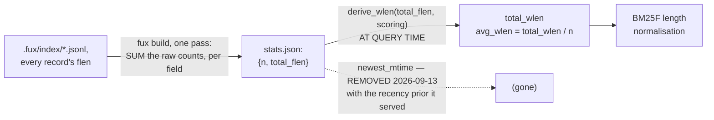

<!-- COMPONENTS-START — GENERATED from records/README.md's OWNERSHIP and DESCRIBES tables by scripts/gen-components.py. Do not edit by hand: change the table, then run `python scripts/gen-components.py --write`. -->

**Describes** — reaches into, does not own:

- [`src/fux/derive/_build.py`](../src/fux/derive/_build.py) · owned by [SR-T1-ACCELERATOR](0110_accelerator.md)
- [`src/fux/derive/accel.py`](../src/fux/derive/accel.py) · owned by [SR-T1-ACCELERATOR](0110_accelerator.md)
- [`src/fux/derive/format.py`](../src/fux/derive/format.py) · owned by [SR-T1-ACCELERATOR](0110_accelerator.md)
- [`src/fux/query/bm25f.py`](../src/fux/query/bm25f.py) · owned by [SR-RANKING](0111_ranking.md)
- [`src/fux/query/scan.py`](../src/fux/query/scan.py) · owned by [SR-ASK](0103_ask.md)

<!-- COMPONENTS-END -->

# SR-RUNTIME-STATS — stats.json, the corpus-wide numbers BM25F needs

## §1 — For humans

`stats.json` holds two things: `n`, the document count, and `total_flen`, the
**raw** per-field token-count totals.

⚠ **It held a third — `newest_mtime` — until 2026-09-13.** That field existed
solely to normalise `recency_half_life_days`, which was **removed** (W-152,
[SR-TUNE](0135_tuning.md) decision 15), so nothing reads it. The plane is
derived and gitignored, so dropping a key needs no migration and a stale
`stats.json` that still carries it is simply ignored.

No single term's postings can supply any of them — they are properties of the
whole corpus — and BM25F's length-normalisation term needs the average document
length on every scored document, every query. Computing that once at build time
turns a per-query, O(corpus) scan into an O(1) lookup.

**The totals are stored raw and weighted at query time**, which is the whole
point of the file's shape. `avg_wlen` is still `total_wlen / n`; it is just that
`total_wlen` is derived on the way past, under the query's own `Scoring`, rather
than baked in.

**Diagram — Mermaid and its ASCII twin. Update both, always, together.**



<details>
<summary><b>ASCII twin</b> — the same diagram, for terminals, diffs, and any reader without a Mermaid renderer</summary>

```text
   .fux/index/*.jsonl -- every record's flen, one pass
              |
              |  fux build: total_flen[i] += flen[i]   RAW, never weighted
              v
   stats.json: {n: document count,
                total_flen: five RAW per-field token-count totals}
              |
              +-- AT QUERY TIME, under the query's own Scoring:
                    total_wlen = derive_wlen(total_flen, scoring)
                    avg_wlen   = total_wlen / n
                       v
                  BM25F length normalisation, every scored document
                  (both paths do this, which is why a field weight
                   cannot make --fast and --scan disagree)

   newest_mtime was a third field until 2026-09-13. It normalised the
   recency prior; the prior was removed (W-152) and the field with it.

   A weight applied on the LEFT of stats.json is baked,
   and a baked weight cannot be a tune key.
```

</details>

### Examples

The file's current shape is three sorted keys, `total_flen` a list of raw
integers. **No capture is pasted here**: this repo's runtime plane is derived
and gitignored, and inventing a line of JSON for a build nobody ran is exactly
the fabricated evidence a dated capture exists to avoid.

```console
$ fux build && cat .fux/runtime/stats.json
```

---

## §2 — For agents

### Context

BM25F's length-normalisation term needs `avg_wlen` for every scored document,
on every query. Neither the committed record nor any single posting carries a
corpus-wide average — it has to be aggregated across every document, and doing
that per query would scale with corpus size on the hot path.

### Decision

**0. This record owns nothing, and the case is (a)** —
[SR-WORK-OWNERSHIP](0054_WORK-ownership.md) decision 7: it specifies one file
another record already generates. The stats plane is written by
[`src/fux/derive/_build.py`](../src/fux/derive/_build.py) and encoded by
[`derive/format.py`](../src/fux/derive/format.py), both of which
[SR-T1-ACCELERATOR](0110_accelerator.md) owns as the build; **carving the file
out would give one plane two owners for one pass.** ⚠ **Until 2026-09-21 that
left nothing able to open this record** — the freshness gate demands owners and
describers, and this record was neither. It now carries `describes` rows on both
files, so a change to what is written or to how it is encoded opens it.
**Reach is not ownership** — SR-WORK-OWNERSHIP decision 1 — and the case
above is why owning nothing is the right answer here rather than a gap.

**1. Fields: `n` and `total_flen`.** The membership bar is **corpus-wide,
unsupplied by any single posting, needed on the hot path**, and both pass it.
The set is not closed by the word *exactly* — it grows when ranking needs it to,
and the veto below is what makes that growth visible.

⚠ **AMENDED 2026-09-13: it also SHRINKS, and that had never happened before.**
`newest_mtime` was the third field and it left with the prior it served (W-152).
**A field's membership is a consequence of a reader existing**, so a field whose
only reader is deleted is not a field this plane keeps out of caution — it is
storage nobody can account for. The veto below now fires in both directions.

**2. `total_flen` is RAW, and this is the decision the file exists for.** It was
once a stored *weighted* total, and that made it a **stored function of a
tunable**. The moment field weights became `.fux/tune.toml` keys, `avg_wlen`
would move on the scan path — which derives it per query — and **not** on the
accelerator path, which read the baked number. Same corpus, two `avg_wlen`s: the
two paths returning different bytes, which is [SR-ASK](0103_ask.md)'s
differential law breaking.

⚠ **And it would have needed a `fux build` to repair**, which is the part that
made it unshippable rather than merely wrong. **A knob whose effect requires a
rebuild is not a knob**, and the whole claim under [SR-TUNE](0135_tuning.md) is
that editing ordering cannot touch the maintenance path.

**The rule this generalises to: store the observation, not the value derived
from it.** `flen` is a fact about a document; the weighting is a policy applied
to that fact. `total_flen` is the corpus-wide sum of the facts, and **both query
paths weight it at query time** through `derive_wlen`, which remains the one
place that arithmetic exists.

**3. `newest_mtime` WAS the recency prior's origin, and it is gone with it**
(2026-09-13, W-152). The argument it rested on is kept here, in full, because it
binds **any future prior that reads a date**:

- Scoring a document against wall-clock *now* would make a query's results
  depend on when it was run and break the byte-identity the derived plane rests
  on. Normalising against the newest commit timestamp in the corpus fixed that,
  and gave the accelerator something it could not do without: **the freshest
  document scores exactly `1.0`, so the multiplier was bounded to `(0, 1]` and
  the prior was a pure demotion.**
- ⚠ **That bound was load-bearing.** `Weighting.maximum` is the supremum the
  block bound is computed from, and an unbounded date prior would make that
  supremum unbounded and the pruning bound useless
  ([SR-T1-ACCELERATOR](0110_accelerator.md) §The weighted bound).

🔴 **So a date prior may return — but never against wall-clock `now`, and never
unbounded above.** That is a constraint on the design, not a plan to restore
this field.

**4. Computed once, at build time, in the same pass `build()` already makes**
over every committed shard — not recomputed per query.

**5. Lives in the derived plane, not the committed plane.** It is a pure
aggregate of information the committed index already carries — each record's own
`flen` and `mtime` — so committing it would be redundant, derivable bytes.
**The change to raw totals strengthens this rather than weakening it**: a
committed weighted total would go stale the moment anyone edited a field weight,
silently and corpus-wide.

**6. One of `DETERMINISTIC_FILES`.** `sort_keys` JSON, byte-identical for the
same committed input.

### Consequences

- **`rank()` gets `avg_wlen` as an O(1) lookup** instead of an O(corpus) scan on
  every query.
- **A corpus change moves length normalisation for every document.** That is the
  intended BM25F behaviour, not a side effect to guard against.
- **Editing a field weight moves it too, with no `fux build` at all.** That is
  the property the raw-totals shape bought: ordering is editable without
  touching the maintenance path.
- **`avg_wlen` costs a five-element weighted sum per query rather than a dict
  lookup**, and that is the price paid, said plainly. Five multiply-adds against
  an O(corpus) scan the file exists to avoid — the lookup was never the
  expensive part.
- ⚠ **This record owns no module, so no mechanical check can point at it.**
  Decisions about `stats.json` live here; the code lives in
  `derive/_build.py` under [SR-T1-ACCELERATOR](0110_accelerator.md). A change to
  this file satisfies
  [`tests/test_sr_freshness.py`](../tests/test_sr_freshness.py) by touching
  the accelerator's record, and **this record's own veto has fired unnoticed
  before, exactly that way.** Open it deliberately.

### Alternatives considered

- **Compute the aggregates at query time by scanning `docs.jsonl`.** Rejected:
  it turns a build-time, once-paid O(corpus) cost into a per-query cost.
- **Fold them into `manifest.json` instead of a separate file.** Rejected: it
  keeps the manifest focused on build fingerprinting and staleness, and this
  file focused on the one thing ranking actually reads — two small
  single-purpose files beat one file serving two unrelated readers.
- **Store the weighted total.** Rejected under decision 2, and it is the
  rejection this record exists for.
- **Track richer per-field statistics.** Once rejected as anticipation, with the
  trigger named: *not without a real requirement*. **The trigger arrived** —
  field weights became query-time keys, so the only number safe to store was the
  unweighted one, and the unweighted one is per-field by construction. Worth
  keeping as a worked example: the rejection did not say *no*, it said *not
  without a requirement*, and it named what would count.

### Reference (required)

- Generator — [`src/fux/derive/_build.py`](../src/fux/derive/_build.py)
  (`_read_committed()`, the `stats` dict, the write to `fmt.STATS_NAME`).
- The consumers — [`src/fux/derive/accel.py`](../src/fux/derive/accel.py)
  reads this file into `rank.Corpus`;
  [`src/fux/query/scan.py`](../src/fux/query/scan.py) computes the same three
  numbers from the shards instead, which is what makes the two paths comparable.
  ⚠ **`rank.py` does not read this file** — it receives a `Corpus`. Pointing a
  veto check at it is what once made the check vacuous.
- The removal of `newest_mtime` and the ruling behind it —
  [SR-TUNE](0135_tuning.md) decision 15, on
  [VERDICT-W143](../work/regression/2026-09-12-priors-and-tables/VERDICT-W143.md).
- The weighting function both paths share — `derive_wlen` in
  [`src/fux/query/bm25f.py`](../src/fux/query/bm25f.py).
- The parent record — [SR-T1-ACCELERATOR](0110_accelerator.md); the scorer that
  consumes the result — [SR-RANKING](0111_ranking.md).

### Veto condition

**Reopen this decision if** scoring needs a statistic beyond `n` and
`total_flen`, if a *derived* value is ever stored here, or if a stored field's
**last reader is removed** and the field stays.

⚠ **This veto has fired once without anyone noticing.** A field was added to
`stats.json` on the same day the record still read *"and nothing else"* — the
change landed in `build.py`, `scan.py` and `rank.py`, and **nothing in any of
the three points back here.** A veto condition is a tripwire whose only value is
that someone notices it; a contract that only moves when someone remembers to
move it does not hold. The checks below are written so the next such addition
fails a grep instead of depending on memory.

**How to check it:**

```bash
# 1. the reader's key set. A fourth key is this veto firing again.
grep -n 'stats\[\|stats\.get(' src/fux/derive/accel.py
# expect: exactly two keys — "n" and "total_flen".
# NOTHING AT ALL means the reader moved and this check has gone blind —
# treat that as a failure, not a pass.

# 2. the stored number must stay RAW: a weight applied on the build side is a
#    stored function of a tunable, and only the accelerator path would see it
grep -n 'derive_wlen' src/fux/derive/_build.py
# expect: no output. build.py sums flen; accel.py weights it per query.

# 3. the removed field must be gone from BOTH paths, or one of them still
#    computes a number nobody reads and the planes disagree about their shape
grep -n 'newest_mtime' src/fux/query/scan.py src/fux/derive/_build.py
# expect: no output outside a comment recording the removal
```

---

## References

*Every source this record cites, gathered in one place. §2's **Reference
(required)** names the grounding; this is the complete list. An archived
document is never listed here — the body may name one, but archive is not
evidence.*

**Records** — [SR-LAWS](0001_LAWS.md) · [SR-DOTFUX](0102_fux-directory.md) ·
[SR-ASK](0103_ask.md) · [SR-RECORD](0109_index-record.md) ·
[SR-T1-ACCELERATOR](0110_accelerator.md) · [SR-RANKING](0111_ranking.md) ·
[SR-RUNTIME-MANIFEST](0123_runtime-manifest.md) · [SR-TUNE](0135_tuning.md)

**Code**

- [`src/fux/derive/accel.py`](../src/fux/derive/accel.py)
- [`src/fux/derive/_build.py`](../src/fux/derive/_build.py)
- [`src/fux/query/bm25f.py`](../src/fux/query/bm25f.py)
- [`src/fux/query/rank.py`](../src/fux/query/rank.py)
- [`src/fux/query/scan.py`](../src/fux/query/scan.py)
