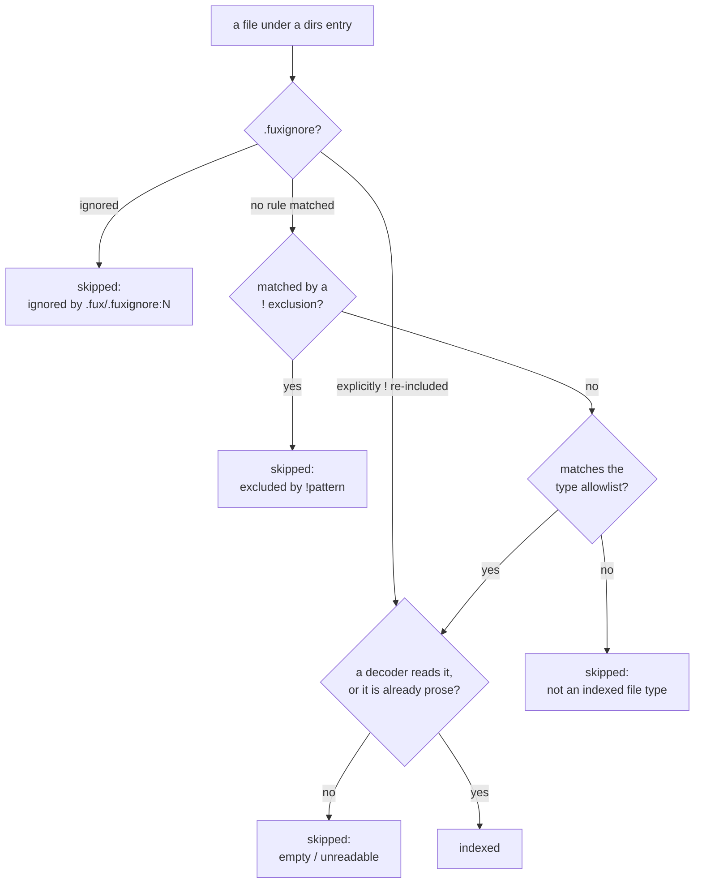

<!-- COMPONENTS-START — GENERATED from records/README.md's OWNERSHIP and DESCRIBES tables by scripts/gen-components.py. Do not edit by hand: change the table, then run `python scripts/gen-components.py --write`. -->

**Owns** — the components this record decides:

- [`.fux/formats.toml`](../.fux/formats.toml) · file
- [`src/fux/ingest/typesfile.py`](../src/fux/ingest/typesfile.py) · file

**Describes** — reaches into, does not own:

- [`src/fux/ingest/gitdir.py`](../src/fux/ingest/gitdir.py) · owned by [SR-INGEST](0106_ingest.md)

<!-- COMPONENTS-END -->

# SR-TYPES — which files are documents

## §1 — For humans

Fux once indexed **anything it could decode as UTF-8**. There was no third
condition after *is it in a configured directory* and *does it decode* — so a
`results.json`, a `fixture.sh` and a `.svg` were all documents.

On this repo that was **21 of 150 documents (14 %), carrying 15 % of the
tokens**, and it was visible in rankings: a raw JSON blob with no prose in it
took second place on a plain query. Across a corporate estate it means indexing
lockfiles, generated OpenAPI specs and vendored fixtures — the same waste, one
corpus at a time.

**An allowlist is compiled in, and a consumer can replace it** by committing
`.fux/formats.toml`. Absent means the default applies — never *index
everything*, which was the defect, and never *index nothing*, which looks like
a broken engine.

**The file has two keys.** `include` lists globs that are already text;
`[decoders]` maps an extension to the module that reads it, and **a bound
extension is a document**. Nothing in it subtracts — exclusions live in
`.fux/.fuxignore`. ⚠ **It was `.fux/sources/types`, a line-grammar file, until
2026-09-11** (decision 12).



<details>
<summary><b>ASCII twin</b> — the same diagram, for terminals, diffs, and any reader without a Mermaid renderer</summary>

```text
  a file under a dirs entry
        |
        v
  .fuxignore says? --ignored--------> skipped: ignored by .fux/.fuxignore:N
        |            --explicitly ! re-included--> straight to the decoder check
        | no rule matched
        v
  matched by a ! exclusion? --yes--> skipped: excluded by !pattern
        | no
        v
  matches the type allowlist? --no--> skipped: not an indexed file type
        | yes
        v
  a decoder reads it, or already prose? --no--> skipped: empty / unreadable
        | yes
        v
     INDEXED

  ONE file on top: .fux/.fuxignore, which decides in both directions.
  BELOW it, still a conjunction. No rule in the trio beats another.
```

</details>

### Examples

Replacing the default — the file wins entirely:

```console
$ cat .fux/formats.toml
include = [
  "*.md",
]

[decoders]
geojson = "json"

$ fux ingest --list-skipped
docs/data.json: not an indexed file type
docs/run.sh: not an indexed file type
```

An empty allowlist is refused rather than silently emptying the index:

```console
$ printf 'include = []\n' > .fux/formats.toml && fux ingest
error: .fux/formats.toml: lists no file types - `include` and `[decoders]` are both
empty - so nothing would be indexed. Delete the file to take the built-in default
(…), or add at least one entry
```

A leftover line-grammar file is refused, never quietly ignored:

```console
$ fux ingest
error: .fux/sources/types is the old types list; it moved to .fux/formats.toml
(SR-TYPES decision 12). Run `fux setup` to write .fux/formats.toml from it - its
`!` lines become .fux/.fuxignore lines - then delete .fux/sources/types. …
```

---

## §2 — For agents

### Context

The walker skipped dot-prefixed paths and dropped empty/binary/non-UTF-8
content. **There was no third condition, and no record decided that there should
not be** — the absence was an omission rather than a decision.

Measured on this repo's committed index at the time:

| extension | docs | share | tokens | share |
|---|---|---|---|---|
| `.md` | 129 | 86.0 % | 180 144 | 85.0 % |
| `.json` | 9 | 6.0 % | **24 209** | **11.4 %** |
| `.svg` | 6 | 4.0 % | 4 743 | 2.2 % |
| `.sh` | 3 | 2.0 % | 2 088 | 1.0 % |
| `.py` | 2 | 1.3 % | 362 | 0.2 % |
| `.mermaid` | 1 | 0.7 % | 346 | 0.2 % |

`.json` alone carried 11.4 % of the tokens, because a machine-written evidence
file is long and repetitive — exactly the shape that distorts `df` for the terms
real documents are trying to be found by.

### Decision

**1. The built-in allowlist is prose PLUS every format a built-in decoder
reads.** `_PROSE_TYPES` is the six formats that need no decoder — `*.md`,
`*.markdown`, `*.txt`, `*.rst`, `*.adoc`, `*.org` — and `_default_types()`
unions them with one glob per built-in decoder extension.

**Allowlist, not denylist** — a denylist is never finished, and the next
generated format nobody has heard of arrives indexed.

⚠ **The measurement above stands and was not overturned.** What changed is that
those tokens were **raw bytes** — the file *was* the body, UUIDs and base64
included. Every admitted format now passes through a decoder
([SR-DECODE](0139_decode.md)) that emits keys as headings and drops ids,
hashes, timestamps and bare numbers. **A different object than the one that was
measured.**

⚠ **A ruling could widen this because the default's *contents* were never a
measurement** — the compare doc's own verdict block calls them *"a defaults
judgment rather than a measurement"*. **The pre-registration rule governs frozen
thresholds, and this was not one.**

**1a. The default is derived from BUILT-IN decoders only, never the live
registry.** A default that grew when a consumer dropped a `logdoc.py` into
`.fux/decoders/` would mean **adding a decoder silently starts indexing a new
file type**. What counts as a document stays a committed line a human wrote.
Pinned by `test_the_default_never_grows_from_a_consumer_decoder`.

**2. `.fux/formats.toml` replaces the default when it exists.** It does not
extend it. Its shape is decision 12's.

**2a. `.fux/.fuxignore` is where exclusions belong, and the types list has no
subtraction at all.** [SR-FUXIGNORE](0144_fuxignore.md) decision 5 made
`.fuxignore` the home and this file's `!` line the deprecated spelling.
⚠ **Since 2026-09-11 the deprecated spelling is gone** (decision 12, fork F4):
`.fux/formats.toml` has no `exclude` key, a `!` glob in `include` is a loud error
naming `.fuxignore`, and `fux setup`'s conversion moves every old `!` line
there.

**3. Absent means the default, not "everything" and not "nothing".**
*Everything* is the defect. *Nothing* makes the 86 % case do work for the 14 %
case, and a missing or empty file that empties the index reads as a broken
engine rather than a missing config. **A types file that admits nothing — an
empty `include` and an empty `[decoders]` — is a loud error.**

**4. No extensionless files.** Those are `LICENSE`, `Makefile` and `Dockerfile`
far more often than they are documents.

**5. Source code, shell scripts and `.mermaid` stay out, and the calls are
stated rather than made silently.** They have no decoder, and machine data is
not a document. `.mermaid` is diagram source — and the ASCII twin every record
carries means the diagram's content is already indexed as markdown.

⚠ **SVG's exclusion here is REVERSED, and images join it, 2026-08-29
(Arpit).** `svg`, `image` and `jsonl` shipped as built-ins the same
day, and decision 1 applies to them automatically: `.svg`, `.png`, `.jpg`,
`.jpeg`, `.gif` and `.jsonl` now rejoin `DEFAULT_TYPES`. This is the same
move `.json` already made on 2026-08-26 (`json.py`'s docstring) — **a
different object than the one this record measured**, not a retraction of
the measurement. `svg` reads `<title>`/`<desc>`/`<text>`, never
path/shape geometry; `image` reads embedded text metadata (PNG
`tEXt`/`zTXt`/`iTXt`, JPEG EXIF IFD0 ASCII tags + `COM`, GIF comment
extensions), never pixels. What is admitted is the words a human put there,
not the machine data this decision was written to keep out — a
geometry-only SVG or a pure-pixel image decodes to `None` and is **not
indexed at all**, a stronger filter than the raw-bytes case this record's
measurement was made against. `.jsonl` was never named by this decision; it
is the line-delimited sibling of `.json`. Source code, shell scripts and
`.mermaid` are unaffected — they still have no decoder.

**6. A pattern with no `/` matches the file name anywhere**; one with a `/` is
anchored at the repo root. That is what makes `*.md` mean *every markdown file*
rather than *a markdown file at the root*.

**7. Below `.fuxignore`, the three conditions are a conjunction, deliberately
not a priority order.** A file `.fux/.fuxignore` says nothing about is indexed
**iff** it is under an included `dirs` entry **and** no `!` exclusion matches it
**and** it matches the type allowlist. **No rule inside that trio overrides
another, so there is no order to remember among them.**

⚠ **There is exactly one thing above the trio, and it decides in both
directions** ([SR-FUXIGNORE](0144_fuxignore.md) decision 4). A path
`.fux/.fuxignore` **ignores** is skipped whatever this allowlist says; a path it
**explicitly re-includes** with a `!` line is indexed whatever this allowlist
says. **`!*.py` therefore indexes Python as raw bytes** — the exact shape this
record was opened about. It costs one explicit line a human wrote, in one
committed file, and `fux ingest --list-skipped` shows the result.

**This sentence used to read "the three conditions are a conjunction,
deliberately not a priority order", full stop**, and decision 3a of
[SR-DIR-LIST](0120_dir-list.md) still leans on that reading for `fux add`.
**It still holds for `fux add`, and it no longer holds for `.fuxignore`** —
a CLI verb may not outrank the allowlist, and a committed line in the one file
named after exclusion may. The difference is that the second is visible in a
file you can read; making an `add` win would index a document *for a reason
nobody could see in any list*, which is the argument that decided 3a and is
untouched.

**8. Every rejection is reported with its reason** — `not an indexed file type`,
for a `!` exclusion the pattern that did it, and for `.fuxignore` the file, the
line number and the pattern (`ignored by .fux/.fuxignore:12 \`*.log\``).
**A filter nobody can see is the failure this record was opened about**, and it
is why the one file that now outranks this allowlist has to say which of its
lines did it.

**9. This applies to the git-dir walker only.** A URL record's type comes from
the `Content-Type` its fetcher declared ([SR-FETCHER](0117_fetcher.md)
decision 5a) — there is no extension to filter on.

**10. `fux setup` writes the file with the default spelled out as LIVE lines.**
A consumer should be able to see what fux considers a document without reading
its source.

⚠ **Amended 2026-08-27. This decision read "spelled out, *commented*", and that
word made the record contradict itself.** A file of nothing but comments has no
active pattern; decision 2 makes a present file replace the default entirely, so
`read_types` raised `lists no file types, so nothing would be indexed` — **`fux
setup` followed by `fux ingest` failed on every fresh repo**, which is the
out-of-the-box path, not an edge case. Nothing caught it because no test
composed the two verbs; `tests/test_setup.py` and `tests/ingest/test_gitdir.py`
between them did not contain the word `types`.

The globs are now written as live lines, **generated from `DEFAULT_TYPES` at the
moment setup runs rather than transcribed**, so the file cannot disagree with the
engine that wrote it and cannot go stale in the source.

⚠ **The list freezes at setup.** Setup is write-if-missing, so a built-in decoder
added after a repo ran setup widens `DEFAULT_TYPES` and does **not** touch that
repo's file. That is a real behaviour change and it is stated rather than
buried: it is decision 1a's rule applied to fux's own decoders, and for any repo
that has run setup it retires the ⚠ consequence below about the default moving
whenever a built-in decoder is added. A repo with **no** types file still tracks
`DEFAULT_TYPES` and still sees that movement.

**11. The types list BINDS an extension to the decoder that reads it —
since decision 12, `<ext> = "<module stem>"` under `[decoders]`; until then
`decoder=<module stem>` on a line — and fux CHECKS the binding rather than
trusting it.** Ruled by Arpit 2026-09-01: *"don't comment it, map it in a proper
way and use the file as map."* The prose below still speaks of *a line*; each
such line is one `[decoders]` key now.

⚠ **This reverses "no attributes at all for `types`", which this record carried
from 2026-08-20 to 2026-09-01.** The old rule was *"a pattern is a pattern, and
every property one might want to hang on it belongs to the **directory** it was
found under"* — and `sourcelist.parse` still says so in the error it raises for
an unknown key: *"Adding one is a change to the record, not a config
addition."* This is that change, said out loud.

**Why `decoder` is the exception rather than the first crack in the rule.** The
old rule's test is *whose property is this?* — and every attribute considered
before now (a `types=` per `dirs` line, a per-root override) belonged to the
**directory**, which is why they were refused. `decoder` belongs to neither the
directory nor the pattern: it is a property of the **extension**, and an
extension is exactly what a line in this file names. A binding on
`docs/api/*.json` is refused for precisely this reason (`_bound_extension`) —
dispatch is keyed on the suffix and knows nothing about which glob admitted the
file, so a path-scoped binding would silently apply corpus-wide.

**What it fixes.** Before it, *"which decoder reads `.csv`"* was a property of
the code installed on a machine — a built-in's `EXTENSIONS` tuple, possibly
replaced by a consumer module of the same name under
[SR-DECODE](0139_decode.md) decision 5. Two people with different
`.fux/decoders/` contents could commit **different indexes from the same
sources**, and nothing in the repo recorded which decoder had run. The binding
makes the answer a committed line, which is the same move decision 1a already
makes for *what is indexed*: **adding a decoder must not, by itself, change the
index.**

⚠ **The check is a HARD ERROR, never a fallback**, and that asymmetry is the
whole point. The tempting behaviour — fall back to the tuple-derived decoder
and carry on — is the dangerous one: **the wrong decoder does not fail
visibly.** It produces a plausible index with different postings, and a corpus
built on it is not detectably wrong from the inside. This is decision 7's rule
in [SR-DECODE](0139_decode.md) applied one layer up, for the same L3 reason.

**11a. What the module verifies is NARROWER than "the extension is in its
`EXTENSIONS`", and the line between the two is EXTENDING versus REDIRECTING.**
Amended 2026-09-01, the same day, when the first obvious use of the feature was
refused by it.

| the line | who claims the extension | verdict |
|---|---|---|
| `geojson = "json"` | **nobody** | **allowed** — extending |
| `csv = "json"` | `csv` does | **refused** — redirecting |
| `csv = "mycsv"` (consumer, claims `.csv`) | the named module itself | allowed |
| `geojson = "nosuchdoc"` | — | refused, no such module |

**`EXTENSIONS` is a decoder's DEFAULT CLAIM, not a declaration of what it is
capable of reading.** A `.geojson` is JSON and `json` reads JSON; a `.cnf` is
an INI file. Requiring a consumer to copy `json.py` into `.fux/decoders/` and
edit one tuple to say so would make the map **a worse answer than the code it
replaced** — the file would be able to describe dispatch but not to change it,
which is most of the point.

**Why extending cannot be stale.** With no decoder claiming `.geojson` there is
no competing answer for the line to disagree with: without it the extension has
no decoder at all, so the binding is purely additive. The refused direction is
the one where two answers exist and the line picks the module that does not want
the extension — a typo or a stale line far more often than intent.

⚠ **This is where the check gives ground, stated plainly.** fux cannot tell a
deliberate `*.geojson decoder=json` from a typo'd one, and no longer tries.
**The two mistakes are not the same size:** a typo in the extending direction
binds a decoder to a suffix no file has, which indexes nothing; the refused
direction silently re-reads real documents with the wrong reader. Same-sized
answers for different-sized mistakes is what made the first version refuse the
feature's main use. To redirect an extension anyway, write a consumer decoder
that declares it — a committed file, which is the right weight for that intent.

**Absence still means the old behaviour.** A line with no `decoder=` resolves
through the module tuples exactly as every line did before, so no existing
types file changes meaning and no corpus moves. `fux setup` and `fux source
add` now WRITE the binding they would have derived — the map fux already had,
committed instead of implied — so a generated file states its dispatch and a
hand-written one may stay silent.

**A prose format carries no binding**, because no decoder is in its path — it
is an `include` glob. (Under the line grammar, `render_line` omitted an
attribute at an EMPTY default for this reason, the one narrowing of
[SR-URL-LIST](0116_url-list.md) decision 12; `.fux/formats.toml` refuses an empty
binding outright, because `md = ""` binds nothing.)

**12. The types list is `.fux/formats.toml` — an `include` glob array and a
`[decoders]` table keyed by extension — and the old `.fux/sources/types` is
refused, never read.** Asked by Arpit 2026-09-11 (*"convert it to .toml … and put
it in .fux dir rather than .fux/sources"*); the fork and all six sub-forks ruled
as proposed the same day in
[`work/compare/types-toml.compare.md`](../work/compare/types-toml.compare.md).

```toml
include = [          # already text: no decoder in the path
  "*.md",
  "docs/**/*.txt",
]

[decoders]           # extension = the module that reads it
csv = "csv"
geojson = "json"
"tar.gz" = "zip"     # a dotted extension is quoted, or TOML nests it

[meta]               # metadata key = the index field its value reaches
doc_id = "title"     # W-205 part 1; `none` silences a decoder's own claim
owner = "none"
```

⚠ **`[meta]` is a THIRD key, added 2026-09-20 — the shape is no longer two.**
See decision 13.

| fork | ruled |
|---|---|
| F1 location | **`.fux/formats.toml`** — named `types.toml` for a few hours on 2026-09-11, then renamed on Arpit's ruling the same day (see below) — beside `tune.toml`, `output.toml`, `refusals.toml` and `pii.toml` — not in `.fux/sources/` |
| F2 shape | **`include` + `[decoders]`**, not an array of per-pattern tables. Entries were never order-sensitive (the loader sorts), so an ordered list would spend TOML's verbosity on an order nothing reads |
| F3 does a binding admit? | **yes.** `[decoders] csv` makes `*.csv` a document; `"*.csv"` also in `include` is a loud *stated twice* error. Exact case only: `"*.CSV"` beside `csv` admits different files and is legal |
| F4 subtraction | **none** — decision 2a |
| F5 the old file | **refused** by `read_types`, by `decode` and by every `fux source` verb, and reported by `fux doctor`; `fux setup` **converts** it when `.fux/formats.toml` is missing, moving `!` lines to `.fuxignore` above the first hand-written pattern, and tells the human to delete the old file |
| F6 error positions | the **key** always (`decoders.geojson`); `:lineno` only when a scan finds exactly one line |

**Why `formats.toml`, and not `types.toml`, `map.toml` or `decoders.toml`** (Arpit,
2026-09-11). The file answers *which file formats are documents, and which
decoder reads each* — and "format" is the word this record already uses for
exactly that. `types` collides with MIME types and type systems. `map` names no
concern, where every sibling (`tune`, `output`, `pii`, `refusals`) does.
`decoders.toml` would sit beside `.fux/decoders/` and read as configuration for
those modules, and half the file — `include` — has no decoder in it. **The code
names stay** (`typesfile.py`, `read_types`, `--types`, SR-TYPES): renaming the
flag breaks every script that calls it, for a cosmetic gain. ⚠ **`types.toml`
has no refusal path**: it was committed locally and never pushed or released, so
no repo but this one ever held it, and this repo was renamed in the same change.

**13. `[meta]` — the third key, and the binding half of the decoder's
`META_FIELDS` claim** (Arpit, 2026-09-20, W-205 part 1). Same shape as
`[decoders]`: a flat table, consumer-owned, committed, and **it outranks the
claim**, exactly as `[decoders]` outranks a built-in's `EXTENSIONS` (decision 13
of [SR-DECODE](0139_decode.md) is the claim; this is the binding).

✅ **BUILT 2026-09-21** — `KEYS` is three, `TypesList.meta` carries the table,
and `_check_meta()` validates each value against `META_TARGETS` at load, naming
the key (`meta.doc_id`) on decision 12's F6 rule.

- **Key = a metadata key a decoder emits. Value = the index field its value
  reaches**, or the literal **`none`** to silence a claim the decoder makes.
- **Validated at load**, like every other key here: a value naming no real index
  field is a named error at the key (`meta.doc_id`), on decision 12's F6 rule.
- 🔴 **It is one table for the repo, while the claim is per decoder** — so a
  consumer binding `doc_id = "ctx"` moves it for every decoder that emits
  `doc_id`. That is the intended trade: the claim is where per-format knowledge
  lives, the binding is where a repo states one policy. A consumer who needs
  per-decoder control edits the decoder, which is theirs.
- ⚠ **`[meta] owner = "none"` is the only way to un-index a person key a
  consumer decoder claims**, and it is worth knowing before a decoder is
  installed rather than after.

⚠ **This record said *"a closed TWO-key shape"* until 2026-09-20**, in its own
title and in decision 12's F2 fork. The shape is three keys now. **F2's
reasoning is untouched** — `[meta]` is a flat table for the same reason
`[decoders]` is: its entries are not order-sensitive, so an ordered array would
spend TOML's verbosity on an order nothing reads.

**Why a reversal of a recorded rejection was acceptable.** §Alternatives
rejected *"a `[sources] types` TOML array"* for three reasons. Two do not reach
this shape: a multi-line array is one entry per line and merges line by line
([SR-URL-LIST](0116_url-list.md) decisions 1-2), and a file of its own is not a
corpus decision buried in `fux.toml`. **The third does, and is paid**: the
three source lists no longer share one grammar and one writer.

**What the shape makes impossible rather than checked.**

- **A path-scoped binding.** A `[decoders]` key is an extension, so
  `docs/api/*.json decoder=json` — which would silently have bound every `.json`
  in the corpus, and which `_bound_extension` refused at resolution — cannot be
  written. That check is deleted, not moved.
- **Two bindings for one extension.** *"Defining a key multiple times is
  invalid"* — TOML refuses it before fux reads a value.

**What is still checked, by [`typesfile.py`](../src/fux/ingest/typesfile.py):**
the closed key set (`tomllib` accepts anything); every glob by the rule the line
grammar used (`_type_reason`); every module name by its shape
(`_decoder_reason`); and an extension key's shape — lowercase, no dot, no glob
character. Existence and redirection stay `decode._bind`'s, decision 11a.

**The reader is lenient, the writer is strict** — [SR-URL-LIST](0116_url-list.md)
decision 13, kept. Any valid TOML with the two keys loads. `fux setup` and the
`fux source` verbs write the canonical layout — `include = [` on its own line,
one glob per line, one `key = "value"` per line under `[decoders]`, decoders
grouped by module — and every edit changes **one line** and re-parses its own
result before writing. **A layout fux did not write is refused, not
reformatted**: a reformat would eat the comments inside the array. The stdlib
reads TOML and does not write it, so the writer is hand-rolled (L1).

**The old file is refused wherever the list is consulted**, including `decode`,
because `fux ask` decodes fetched documents without walking: a binding it
silently stopped seeing would re-read them with a different decoder than the
index was built with. **Silently ignoring it is disqualified** — the default
would take its place and the index would change with nothing saying so, the
worst case decision 11 names.

**The conversion changes no index byte, and that was measured rather than
argued.** This repo's corpus was ingested `--full` with the line-grammar file,
then converted by `fux setup` and ingested `--full` again: **254 of 254 shards
and `.fux/.fuxignore` byte-identical, 0 documents changed** (2026-09-11). The
two ingests must share one tree and one git history, because a record's `mtime`
is a commit timestamp. Held going forward by
`tests/test_setup.py::test_the_converted_file_states_what_the_old_one_admitted`.
An upper-case bound pattern (`*.CSV decoder=csv`) is **refused, not converted**:
a `csv` binding admits `*.csv`, so either silent answer would move the allowlist.

**`[sources] types_file` in `fux.toml` is refused by name** ([SR-CONFIG](0113_config.md)).
`config.schema.json` advertised it with a default of `.fux/sources/types`, and
nothing had ever read it.

### Consequences

- ✅ **A declared type nothing can READ is REPORTED (2026-09-14, W-163).**
  `fux doctor`'s `declared types are readable` row names an include glob whose
  extension no built-in and no `.fux/decoders/` decoder claims: the documents
  match, are walked, and are then indexed as raw bytes or skipped — while this
  committed file says they are documents.
  ⚠ **Not the same finding as SR-DECODE's `decoder bindings` row**, which fires
  on a `[decoders]` binding whose extension no indexed document has. One is a
  declaration reaching nothing; the other is a binding nothing reaches.
  ⚠ **Prose suffixes are exempt and always will be.** `.md`, `.txt`, `.rst`,
  `.adoc`, `.org` and `.markdown` are read by `extract.py` rather than by a
  decoder, so having none is their normal state — reporting it would fire on the
  most common line in the file.

- ⚠ **Narrowing what counts as a document is a ranking change, and this record
  does not claim it is an improvement.** Records disappear on the next ingest
  and `df` moves for every survivor. **Nothing has been measured.** This repo's
  committed index was deliberately *not* re-ingested in the change that landed
  the mechanism, so the corpus change is a separate, measured step rather than a
  side effect.
- **It does not replace exclusion.** An `evidence/report.md` is still prose in a
  place you do not want indexed. Both are needed; this one is larger and
  simpler — and exclusion now lives in
  [`.fux/.fuxignore`](0144_fuxignore.md) rather than in `!` lines here.
- ⚠ **The allowlist is no longer the last word.** One explicit `!` line in
  `.fux/.fuxignore` admits a format with no decoder, as raw bytes. That is the
  cost SR-FUXIGNORE decision 4 pays for the file meaning what its name says,
  and **nothing has been measured about how often anyone reaches for it.**
- **Three lists, two places**: `.fux/sources/dirs` says *where*,
  `.fux/formats.toml` says *what* — and, since decision 11, *read by what* — and
  `.fux/sources/urls` says *what else*. ⚠ **Until decision 12 all three sat under
  `.fux/sources/` on one grammar**; the types list left both.
- 🔴 **Decision 12's costs, stated.** The three source lists no longer share one
  parser and one writer — `sources.py` branches on `types` in every verb. A
  semantic error in the types file no longer guarantees `file:lineno`, which
  every line-grammar list promises. And a repo that ran `fux setup` before
  2026-09-11 stops at its next `fux ingest` until it runs `fux setup` and deletes
  the old file — loud, one command, and deliberate.
- ⚠ **`types` now has an attribute, so the "no attributes" argument is spent as
  a blanket answer.** The next proposal to hang something on a pattern gets the
  test in decision 11, not a flat no: *is this a property of the extension, or
  of the directory it was found under?* A per-root `types=` is still the latter
  and is still refused — it is veto condition 1, unchanged.
- ⚠ **A hand-written types file states no bindings and gets no warning.** An
  `include` glob for a decoded format (`"*.csv"`) still resolves through the
  module tuples, exactly as before — so the map is complete only in files fux
  generated or a human filled in. Nothing reports the gap today; `fux doctor`
  is where that would go.
- **A `.txt` or `.org` corpus works with no configuration**, which is the half
  of the argument a compiled-in-only allowlist could not deliver.
- ⚠ **The default now moves whenever a built-in decoder is added.** That is
  decision 1 working as intended and it is a real coupling: adding
  `decode/logdoc.py` widens what every consumer with no types file indexes.
  Decision 1a is what keeps a *consumer's* decoder from doing the same.

### Alternatives considered

Full matrix in
[`work/compare/file-type-filter.compare.md`](../archive/compare/file-type-filter.compare.md);
the short version:

- **A types file with no built-in default.** Rejected: every consumer writes the
  same four lines before fux indexes anything, and a missing or empty file
  silently produces an empty index.
- **A compiled-in allowlist with no override.** Rejected: a team whose runbooks
  are `.adoc` waits for a fux release to index their own documents. For a `$0`
  offline tool that is a hard stop.
- **A `types=` attribute per `dirs` line.** Rejected as more expressive than the
  problem, and it repeats the same globs on every line — but **not excluded
  forever**; it is exactly the reopen trigger below.
- **A `[sources] types` TOML array.** Rejected: the shape
  [SR-DIR-LIST](0120_dir-list.md) had just moved away from. ⚠ **Reversed in
  part by decision 12**, which put the list in TOML in a file of its own —
  the argument, reason by reason, is in decision 12 and the compare doc.
- **An array of tables, one per pattern** (`[[type]] pattern = … decoder = …`).
  Rejected under decision 12: two to three lines per entry, it suggests an
  order the loader discards, and it keeps every runtime check `[decoders]`
  makes unwritable.
- **YAML.** Rejected under decision 12: a third-party parser is a runtime
  dependency a record would have to name under L1, for no gain over `tomllib`.
- **Named type sets, ripgrep-style.** Rejected: ripgrep needs names because a
  human types `-tweb` fifty times a day; fux reads a committed file once per
  ingest. The indirection buys nothing and costs a second grammar.
- **Content sniffing.** ⚠ **Disqualified, not merely rejected.** Deciding
  whether bytes "read as prose" is a classifier, it misfires silently, and **it
  cannot be reviewed — there is no diff for a judgment made at ingest.** The
  same argument that decides what a document *means*
  ([SR-HTTP-FETCHER](0119_http-fetcher.md) decision 3) decides what a document
  *is*.

### Reference (required)

- The code: [`src/fux/ingest/gitdir.py`](../src/fux/ingest/gitdir.py)
  (`_PROSE_TYPES`, `_default_types`, `DEFAULT_TYPES`, `read_types`,
  `walk_sources`), the file itself in
  [`src/fux/ingest/typesfile.py`](../src/fux/ingest/typesfile.py) (`parse`,
  `read`, `check_legacy`, `render`, `add_include`, `set_decoder`, `remove`,
  `convert_legacy`), and `glob_match`, `_type_reason` and `_decoder_reason` in
  [`src/fux/ingest/sourcelist.py`](../src/fux/ingest/sourcelist.py); the
  decoder registry the default unions with — [SR-DECODE](0139_decode.md).
- Decision 11's binding, resolved and checked:
  [`src/fux/decode/__init__.py`](../src/fux/decode/__init__.py)
  (`_declared_bindings`, `_bind`, `builtin_bindings`), and written by
  [`src/fux/setup.py`](../src/fux/setup.py) (`_seed_types`,
  `_convert_legacy_types`) and [`src/fux/sources.py`](../src/fux/sources.py).
  Held by [`tests/decode/test_binding.py`](../tests/decode/test_binding.py)
  and [`tests/ingest/test_typesfile.py`](../tests/ingest/test_typesfile.py),
  including that a binding beats load order when two decoders claim one
  extension, that every binding fux writes survives the check fux applies, and
  that a converted file admits exactly what the old one did
  (`tests/test_setup.py`).
- Decision 12: the fork and its matrix —
  [`work/compare/types-toml.compare.md`](../work/compare/types-toml.compare.md).
- **TOML v1.0.0** — *"Defining a key multiple times is invalid"*; arrays span
  lines with trailing commas and comments — <https://toml.io/en/v1.0.0>
- **Python `tomllib`** — added in 3.11 (L7), and *"This module does not support
  writing TOML"*, which is why the writer is hand-rolled —
  <https://docs.python.org/3/library/tomllib.html>
- **Ruff's `include` and `extension` settings** — a glob list plus a
  bare-extension map whose keys are *"automatically added to the default
  `include` list as a `*.{ext}` glob"*: decision 12's shape and fork F3 —
  <https://docs.astral.sh/ruff/settings/#extension>
- **Django `DATABASES['default']['ENGINE']`** — the committed config names the
  backend module by import path rather than letting an installed driver claim a
  scheme, which is the same "the config binds, the module is checked" shape —
  <https://docs.djangoproject.com/en/stable/ref/settings/#engine>
- The verdict and its matrix:
  [`work/compare/file-type-filter.compare.md`](../archive/compare/file-type-filter.compare.md)
- **Sphinx `source_suffix`** — allowlist by extension; an unlisted suffix is
  simply not a source —
  <https://www.sphinx-doc.org/en/master/usage/configuration.html>
- **GitHub Linguist** — a default heuristic most repos never touch, with
  declarative committed overrides —
  <https://github.com/github-linguist/linguist/blob/main/docs/overrides.md>
- **ripgrep's type system** — names at the point of use, globs at the point of
  definition; the reason named type sets were considered and dropped —
  <https://github.com/BurntSushi/ripgrep/blob/master/GUIDE.md>

### Veto condition

**Reopen this decision if any of these becomes true:**

1. **A consumer needs different types for different roots** — `docs/` is prose,
   `runbooks/` is `.adoc`, `vendor/` is nothing. The migration is additive: a
   `types=` attribute on a `dirs` line would override the global file for that
   root.
2. **A consumer's corpus is majority prose in a format the default excludes**,
   so the built-in is wrong more often than right.
3. **A measured run shows the type filter made ranking worse.** ⚠ **It has not
   been measured at all**, and this record says so rather than assuming the
   obvious direction.
4. **A binding is checked at ingest but nothing checks it at rest** — i.e. a
   repo can sit for months with a types file naming a decoder that was deleted,
   and learn about it only on the next `fux ingest`. Checkable today: `fux
   doctor` does not resolve bindings. The migration is additive.
5. **Two built-in decoders claim one extension.** `builtin_bindings()` resolves
   the collision by module order, which is arbitrary the moment it can happen —
   and it is what `fux setup` writes into every new repo.
   `tests/decode/test_binding.py::test_every_builtin_extension_has_exactly_one_builtin_binding`
   fails the day this becomes true.
4. **The default is ever derived from the live decoder registry** rather than
   from the built-ins — decision 1a.
5. **`.fux/.fuxignore`'s `!` override is measurably used to admit undecoded
   formats**, which would mean the raw-bytes escape hatch has become a habit
   and the allowlist is not doing the work this record claims for it.

6. **Decision 12: `dirs` or `urls` is proposed as TOML** — the grammar-split
   cost disappears and the three lists are judged together; **or `types` gains a
   property of a pattern rather than of an extension**, which `[decoders]` cannot
   hold; **or a defect is filed where a `fux source` verb behaves differently for
   `types` than for `dirs`** because of the split writer.

**How to check them:**

```bash
# 1 — does any consumer's dirs file want per-root types?
grep -rn 'types=' .fux/sources/dirs

# 2 — what fraction of a corpus the default admits
fux ingest --list-skipped | grep -c 'not an indexed file type'

# 3 — unmeasured; it rides with the df pre-registration

# 4 — the default must union BUILT-IN extensions only
grep -n 'builtin_extensions' src/fux/ingest/gitdir.py
# expect: one call, inside _default_types()

# 6 — decision 12's triggers
ls work/compare/ work/proposals/ | grep -i toml   # a dirs/urls TOML proposal?
grep -n "types" work/OPEN-WORK.md                  # a verb-split defect?
```

---

## References

*Every source this record cites, gathered in one place. §2's **Reference
(required)** names the grounding; this is the complete list. An archived
document is never listed here — the body may name one, but archive is not
evidence.*

**Records** — [SR-INGEST](0106_ingest.md) · [SR-URL-LIST](0116_url-list.md) ·
[SR-FETCHER](0117_fetcher.md) · [SR-HTTP-FETCHER](0119_http-fetcher.md) ·
[SR-DIR-LIST](0120_dir-list.md) · [SR-DECODE](0139_decode.md) ·
[SR-FUXIGNORE](0144_fuxignore.md)

**Code**

- [`src/fux/ingest/gitdir.py`](../src/fux/ingest/gitdir.py)
- [`src/fux/ingest/sourcelist.py`](../src/fux/ingest/sourcelist.py)

**Project docs**

- [`work/compare/file-type-filter.compare.md`](../archive/compare/file-type-filter.compare.md)

**Papers and specifications**

- GitHub Linguist overrides — a default heuristic most repos never touch, with
  declarative committed overrides
  <https://github.com/github-linguist/linguist/blob/main/docs/overrides.md>
- ripgrep's type system — names at the point of use, globs at the point of
  definition
  <https://github.com/BurntSushi/ripgrep/blob/master/GUIDE.md>
- Sphinx `source_suffix` — allowlist by extension; an unlisted suffix is simply
  not a source
  <https://www.sphinx-doc.org/en/master/usage/configuration.html>
