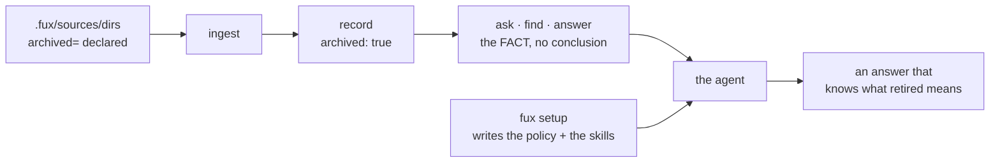

<!-- COMPONENTS-START — GENERATED from records/README.md's OWNERSHIP and DESCRIBES tables by scripts/gen-components.py. Do not edit by hand: change the table, then run `python scripts/gen-components.py --write`. -->

**Owns** — the components this record decides:

- [`src/fux/templates/agents/`](../src/fux/templates/agents) · dir

<!-- COMPONENTS-END -->

# SR-AGENT-POLICY — shipping the policy, not just the facts

## §1 — For humans

**Fux's readers are agents.** That is the product's whole premise, and it has a
consequence worth writing down: **an engine whose output is systematically
misread is an engine that does not work**, however correct its index.
Correctness that does not survive the reader is not correctness.

The concrete case is archived documents.
[SR-ARCHIVED-CONTENT](0134_archived-content.md) decision 7 makes Fux state a
**fact** — *this document is retired* — and deliberately **states no
conclusion**, because the right conclusion depends on why the question was
asked. That is the honest design, and it leaves a gap: *somebody* has to supply
the conclusion.

**This record says who: the consuming agent, using policy Fux ships.**



<details>
<summary><b>ASCII twin</b> — the same diagram, for terminals, diffs, and any reader without a Mermaid renderer</summary>

```text
  .fux/sources/dirs (archived=) --> ingest --> record: archived: true
                                                        |
                                                        v
                                    ask . find . answer  =  THE FACT
                                                        |    (no conclusion)
   fux setup  --> policy + skill files -------------------+--> the agent
                  (Claude . Codex . Copilot . Kiro)      |
                                                         v
                                        an answer that knows what retired means

  Fux states what IS. The agent decides what to DO. Neither alone is the mechanism.
```

</details>

### Examples

**What `fux setup` writes, and what it says about it:**

```console
$ fux setup                       # abridged: the usage/decoder/enrich skills
  wrote fux.toml                  # are written too, one folder each
  wrote .fux/sources/dirs
  wrote .claude/skills/fux-archived-results/SKILL.md
  wrote .agents/skills/fux-usage/SKILL.md
  wrote .github/agents/fux.agent.md
  wrote .github/instructions/fux-archived-results.instructions.md
  wrote .kiro/steering/fux-archived-results.md
  wrote AGENTS.md

  note: everything after .fux/sources/dirs is OUTSIDE .fux/ — it teaches
        Claude, Codex, Copilot and Kiro how to read this index. Turn them off
        with [agents] install = [] in fux.toml, or `fux setup --no-agents`.
```

**The announcement is the safeguard, not a courtesy.** These land in directories
GitHub, AWS and Anthropic own, so a user who did not want them must be able to
learn they exist from the terminal they just ran — not from a later `git status`
on a repository they share with a team.

**Opting out is a declaration, and it persists:**

```console
$ fux setup --no-agents
  wrote fux.toml          # [agents] install = []
  wrote .fux/sources/dirs
```

---

### Amendment 2026-09-12 — the usage renderings no longer say "codebase"

**What changed.** `USAGE-SKILL.md`, `fux-usage.instructions.md` and
`fux.agent.md` said *"this codebase's history or design"*. They now say
*"this project's"*.

**Why.** Fux's corpus is written knowledge — decisions, runbooks, specs, wiki
pages — and a repository is one place it can live, not what fux is about.
*"Codebase"* named the wrong thing and was one of the six surfaces that keep
fux misfiled next to AST/code-graph tools (Arpit's ruling, from
[`work/proposals/positioning-documents-not-code.md`](../archive/proposals/positioning-documents-not-code.md)).

**`policy-version` stays at 1, deliberately.** Decision 8's version exists to
make a **stale policy** identifiable. This is a noun swap in the usage half —
no rule changed, no behaviour changed, and nothing an installed consumer holds
is now wrong. Bumping it here would spend the only signal decision 8 has on a
change that is not a policy change. **A version bump means the rules moved.**

---

## §2 — For agents

### Context

Fux indexes retired documentation deliberately — it is the honest answer to
*"why does this look the way it does"* — and marks it rather than hiding it. The
disclaimer is **intent-neutral**: it says what archived *is* and stops, because
the same document is **the answer** to a history question, **misleading** to an
architecture question, and **dangerous** to a build task.

**The engine must not carry that taxonomy.** The list of stances is open, and a
provably incomplete enum invites callers to squeeze a fourth stance into the
closest of three. The [refer plane](0127_refer-plane.md) set the precedent — it
refuses to collapse *we did not look* into *we looked and it was fine*, because
**three callers want three different answers from the same index.**

So the policy lives with the caller. **The question this record answers is
whether Fux ships it.**

### Decision

**1. Fux ships agent policy, and it is a product decision rather than a
convenience.** A tool whose stated audience is agents, that emits a fact no
agent knows how to read, has shipped half a feature. **The measured case is this
repository's own**: *"what is the ingest cache"* returned **5/5 archived**
documents describing a subsystem `CLAUDE.md` forbids porting back. An agent
acting on that answer reintroduces a deleted design, confidently and with
citations.

**2. One canonical policy, carried as a VERBATIM block, not as a restatement.**
`templates/agents/POLICY.md` is the source of truth, and its rules live between
`<!-- fux:policy:begin v1 -->` and `<!-- fux:policy:end v1 -->`. **Every policy
rendering includes that block byte for byte.** Format-native framing may
surround it — a Kiro table, a Copilot heading, a skill's worked example — but the
block itself may not be reworded, reordered, or partially included.

⚠ **This shape was forced by a failure, on the first run of the check that was
supposed to confirm it.** The renderings had been written to *say the same
thing*: *"never drop the mark when you summarise"* against *"never drop the
archived mark when summarising"*. Same meaning, different bytes — and **no
substring test can tell a legitimate rewording from a dropped rule. A test that
cannot fail correctly is worse than no test, because it certifies agreement it
never checked.**

So agreement is **exact match on a shared block** — the same device this project
uses for a Mermaid diagram and its ASCII twin: two representations, one asserted
to match. **A rule changed in one rendering and not the others is worse than no
policy at all**, because two agents then disagree about the same output.

**The renderings stay hand-written** — a handful of short files do not earn a
generator, and L1 keeps the dependency budget at zero. The block is what makes
that safe.

**2a. Three files are exempt from the verbatim block, and the exemption is
pinned.** `ENRICH-SKILL.md`, `USAGE-SKILL.md` and `DECODER-SKILL.md` are
**build procedures and an operating manual**, not renderings of the
archived-results policy — inlining an eight-rule preamble about interpreting
search results into a file about parsing file formats would duplicate a policy
that already has a rendering per vendor. `test_the_exemptions_are_deliberate`
is what keeps widening the exemption a decision.

**3. Three vendors now, and the set is open by construction.** Claude (skills),
GitHub Copilot (custom agents **and** ambient instructions), Kiro (steering
**and** skills). Adding a fourth is a template plus a rendering plus a row —
**not a new decision.** What *would* reopen this record is a vendor changing its
format.

⚠ **Amended 2026-09-06: the fourth arrived, and the claim held — with one
correction.** OpenAI Codex is decision 11 below, and it cost **zero new
templates**: two rows and two destinations. But *"a template plus a rendering
plus a row"* was **incomplete** — Codex needed decision 12's gate change as
well, because it is the first vendor whose only ambient plane is a file this
record deliberately kept **outside** the per-vendor map. **The set is open by
construction; the INSTALLER is not quite.** Read decision 3 as *a vendor with
its own ambient plane* costs a row, and anything else costs a row and a
question.

**4. Copilot gets an agent and instructions, and they are not alternatives.**
The **agent** fires when selected or routed to; the **instructions** (`applyTo:`)
fire on every matching request. ⚠ **The gap between them is the dangerous case**:
someone runs `fux ask` in a terminal, pastes the output into chat, and the agent
was never invoked — but the archived results are still there. Ambient
instructions cover that. Ship both.

**5. Installed from a DECLARATION, never from detection — and the declaration
ships COMPLETE.** `fux setup` installs all three vendors by default, and
`fux.toml` carries

```toml
[agents]
install = ["claude", "copilot", "kiro"]
```

**written out in full by `setup`, not left implicit** — the same treatment the
type allowlist gets, for the same reason: **a default a user can read and edit
in a file they own is a different thing from a default buried in the engine.**

**Detection is refused.** Fux never sniffs for `.kiro/` or `.github/` and infers
intent — that is precisely the derivation
[SR-DIR-LIST](0120_dir-list.md) decision 4 refused for `archived`, and the
reasoning transfers unchanged: **a heuristic is exact for the repo it was
written against and a silent convention for everyone else.**
Install-all-by-default and declared-never-derived are compatible **because the
declaration is written down, visibly, at the moment of install.**

**Why all three rather than opt-in.** An opt-in flag is a feature nobody knows
exists, so the policy layer would be present in the product and absent in every
repository — and **the failure it prevents is silent**: an agent confidently
citing a deleted design, with a correct-looking citation.

**6. `setup` writes outside `.fux/`, and must SAY so — loudly, every time.**
Everything else `fux setup` writes lives in fux's own territory. These land in
**`.github/`, `.kiro/` and `.claude/`, which belong to GitHub, AWS and
Anthropic.**

Because decision 5 makes the install default-on, **the announcement is the
entire remaining safeguard**, and it is therefore mandatory rather than
nice-to-have. `setup` names every path it wrote outside `.fux/`, and names the
key that turns them off. **`--no-agents` is the one-shot escape; `install = []`
is its durable form.**

⚠ **The cost this carries, stated rather than discovered.** Three of the
renderings are **ambient** — Copilot's two `instructions/` files (`applyTo:
"**"`) and Kiro's steering (`inclusion: always`) enter *every* request in that
repository, for every developer, whether or not they are using Fux at that
moment. **That is a standing context tax imposed by a tool they installed for
something else.** Two things keep it defensible and both are obligations:
**the ambient renderings stay short — growth is a regression, not an
improvement** — and **`setup` announces them**, so the tax is visible to whoever
pays it.

**7. Write-if-missing, inherited rather than reinvented.** `setup.py` reads
templates out of the wheel (*read, never imported*) and lays them down with
`_write_if_missing`. A consumer's edit is never overwritten. ⚠ **The corollary
is that a stale policy file is invisible**, which is what decision 8 exists for.

**8. Every policy rendering carries `policy-version`.** In frontmatter where the
vendor allows it, in a comment where it does not. A file the consumer has edited
is theirs and stays; a file three versions behind is at least **identifiable**.
**Without this, write-if-missing means *install once, drift forever*.**

**9. Policy ships as steering; an operating manual ships as a skill.**

| the guidance… | ships as | because |
|---|---|---|
| must shape an answer the agent is *already* giving — the archived-results stance | **steering**, `inclusion: always` / `applyTo: "**"` | an agent not thinking about Fux still must not cite a retired design as evidence. **If it has to be *loaded* to apply, it does not apply** |
| is consulted *while doing a thing* — how to invoke Fux, how to write a decoder | **skill**, progressive disclosure | there is no reason to tax an interaction that never touches Fux |

**The test to apply:** *does an agent that has never heard of Fux still need this
sentence to avoid being wrong?* Yes → steering. No → skill.

⚠ **This is a rule because the tax is not optional on every vendor.** Kiro CLI
supports **no steering inclusion modes** — every file in `.kiro/steering/` enters
every interaction, so `inclusion: manual` protects nobody. Decision 6's
announcement makes the tax visible; **this decision is what keeps it small.**

⚠ **Amended 2026-09-11 by decision 15 — the always-on half is unchanged, the
skill-only half is widened.** Only the archived-results policy is ever
*always-on*, and the test above still decides that. What changed is that an
operating guide may now ALSO ship as a **scoped** pointer — path-scoped
(Kiro `fileMatch`, Claude `.claude/rules/` `paths:`, Copilot `applyTo:` with
explicit globs) or description-scoped (Kiro `inclusion: auto`) — on the
conditions decision 15 names and `tests/test_setup_agents_guides.py` holds.

**9a. A skill that writes committed code must never be ambient on any surface.**
`fux-enrich` and `fux-decoder` write into committed directories and change what
is indexed, so they ship to **skill** surfaces only and to no ambient one. **A
Kiro skill is progressive-disclosure; only Kiro *steering* is ambient**, which
is what admits Kiro while still excluding Copilot's `instructions/`.

⚠ **Amended 2026-09-06 — the rule is unchanged; the roster was wrong.** This
decision read *"the two skill surfaces — Claude and Kiro"*, which was a count of
what existed in August, quietly doing the work of a rule. There are now **four**
(`.claude/skills`, `.kiro/skills`, `.codex/skills`, `.github/skills`), and
`fux-enrich` had reached only the first. ⚠ **Since 2026-09-12 (decision 16)
they are three directories serving four vendors** — `.claude/skills`,
`.kiro/skills`, and `.agents/skills` for Codex and Copilot together. **Read 9a as a predicate on the
surface, never as a list of vendors.**

**10. One template may map to two destinations, and that is stronger than a
conformance test.** Kiro implements the same open Agent Skills standard Claude
does, so the identical `USAGE-SKILL.md` bytes are written to both
`.claude/skills/fux-usage/SKILL.md` and `.kiro/skills/fux-usage/SKILL.md`.
**That is agreement by construction**, strictly stronger than decision 2's
conformance test asserting two separately-maintained files still match.

**11. `fux-usage` teaches a four-rung invocation ladder, and the ladder is
gated.** ⚠ **The defect it closes was live and in this record's own templates.**
`fux.agent.md` read *"If `fux` is not installed or there is no index, say so and
fall back to ordinary search."* But `fux` is a **console script** — on `PATH`
only where its installing environment's `bin/` is — so in any repo whose fux
lives in an unactivated `.venv/`, an agent got `command not found`, concluded
*not installed*, and **silently used grep** while the engine sat there and the
committed index sat beside it. **It did not error. It degraded, and the
degradation read exactly like an honest answer.**

The ladder is `fux` → `uv run fux` → `./.venv/bin/fux` (`.venv\Scripts\fux.exe`
on Windows) → `python -m fux`, probed with `--version` and cached for the
session. Three rules are gated by
[`tests/test_setup_agents_usage.py`](../tests/test_setup_agents_usage.py):

1. the rungs appear **in order** in every rendering;
2. exhausting them yields *"could not be invoked, here is what I tried"* and
   **never** a claim that the package is absent;
3. **no rendering may tell an agent to activate a virtualenv, modify `PATH`, or
   install anything.** ⚠ **That last one is the failure a well-meaning edit
   introduces, which is why it is a test and not a sentence.**

⚠ **Rung 4 is the spelling a human guesses, not the one that happened to work
first.** An agent reporting *"I tried `python -m fux.cli`"* has named something
no reader recognises as the obvious attempt. `fux.cli` still works and is what
`tests_e2e/` spawns; it is simply no longer what the ladder teaches.

**12. `fux-usage` states which verb yields a line range.** `ask` and `find` are
document-level (`docs/mesh.md`); `answer` is span-level
(`docs/mesh.md:L10-L13`).

⚠ **Omitting it produced a wrong conclusion in the field**: a user ran `fux ask`,
saw no line numbers, and reported that fux does not return them. It does — from
`answer`. **A feature that is built, tested and undocumented is
indistinguishable from one that does not exist.** And it is L4 showing through
the surface rather than an oversight worth designing away: a line range can only
be computed by chunking the *fetched* bytes, and `ask` is offline by default.

⚠ **The shipped usage skill gained the retry rule on 2026-09-05** (W-109):
when a search returns `band: partial` with a non-empty `missing`, re-ask with
the corpus's own word, or keep the question and add `--expand`, or pass a second
phrasing with `-q`. **A wrong guess costs nothing** — expansion terms are scored
below the user's own and a document matching only them is never returned — which
is what makes the retry safe to recommend to an agent.

**It is in the skill because the surface cannot teach it.** `--json` reports
`missing`; nothing in the output says what to do about it, and an agent that
does not know the slot exists re-runs the same failing question.
[SR-EXPAND](0149_expand.md).

⚠ **The `fux-enrich` skill was re-aimed at doc2query on 2026-09-05** (W-110):
its body is now **five to ten questions a searcher would type**, one per line,
and no summary. Prose was measured at **+1 fixed / −1 broken** and the break was
context prose carrying currency words into a superseded record.

**This is a skill change with a mechanical partner**, which is new for this
record's subject: `fux enrich --check` now *tests* what the skill asks for —
a question that does not retrieve its own document in the top 3 is refused by
name. The skill and the check say the same thing, and only one of them can be
ignored.

⚠ **The skill's `superseded_by:` instruction reaches the RANKING.** It is the
only key in that frontmatter that does. The skill says so in the same breath as
it introduces it, because an agent that writes one casually retires a live
document.

**11. OpenAI Codex is the fourth vendor** (2026-09-06). Codex reads repository
skills from `.agents/skills/<name>/SKILL.md` — **the same open Agent Skills
standard Claude and Kiro implement** — ⚠ *this said `.codex/skills/` until
2026-09-12, a path Codex's skills page does not list; decision 16 is the move* — so `USAGE-SKILL.md` and
`DECODER-SKILL.md` map there from the **same templates, byte for byte**. That is
decision 10's agreement-by-construction a third and fourth time, and it is why
this vendor added no file to `templates/agents/`.

⚠ **Codex has no per-file ambient surface** — no `applyTo:`, no inclusion mode.
Its always-on context is the repo-root `AGENTS.md` and nothing else. So:

| rendering | ships to Codex as | because |
|---|---|---|
| the archived-results policy | **`AGENTS.md`**, which already carries the verbatim block | decision 9: *if it has to be loaded to apply, it does not apply* — and a skill is loaded |
| the operating manual (`fux-usage`) | `.agents/skills/fux-usage/` | consulted while doing a thing |
| the decoder guide (`fux-decoder`) | `.agents/skills/fux-decoder/` | decision 9a — a committed-write skill gets skill surfaces only |
| `fux-enrich` | `.agents/skills/fux-enrich/` | ⚠ *"nothing"* when written; [SR-ENRICH](0137_enrich.md) decision 10 was extended to every skill surface on 2026-09-06, and this row was stale until 2026-09-12 |

**There is deliberately no `.agents/skills/fux-archived-results/`.** Writing one
would put the policy on a surface that has to be invoked, in the one vendor
where nothing else covers it.

**12. `AGENTS_MD_VENDORS` — the root file is written for the full set OR for a
vendor that has no other ambient plane.** `run()` previously wrote the
vendor-neutral `AGENTS.md` only when `installing == KNOWN_AGENTS`, on W-82
ruling 16's reasoning: *a partial declaration names what it wants, and a neutral
file nobody named is not covered by that naming.*

🔴 **That reasoning is sound for three vendors and false for the fourth.**
`install = ["codex"]` would have written two skills and **no archived-results
policy at all** — decision 1's silent failure, reintroduced through a config
line, in the vendor least able to notice. `AGENTS_MD_VENDORS = ("codex",)` names
the exception, and two tests hold both directions: Codex alone gets the root
file, and a `["claude"]` declaration still does not.

**13. ⚠ "claude-only" describes what fux WRITES, never what another agent
READS — and that gap is now real, not theoretical.** GitHub Copilot reads
project skills from `.github/skills`, `.agents/skills` **and `.claude/skills`**.
So in any repository where both `claude` and `copilot` install — the default —
**Copilot loads all four Claude skills, `fux-enrich` included**: the one
[SR-ENRICH](0137_enrich.md) decision 10 confined to a single surface.

**Nothing fux can do closes this.** The path is Anthropic's convention, another
vendor chose to read it, and moving `fux-enrich` out of `.claude/skills/` would
break it for the vendor it was written for. **Recorded, not fixed.**

⚠ **Decision 16 turns a second cross-read to use.** Copilot also reads
`.agents/skills`, which is Codex's only skill directory — so since 2026-09-12
fux writes Copilot's own skills there rather than to `.github/skills`, and a
default install shows Copilot **two** same-name copies, not three.

⚠ **Superseded in effect by decision 14, not in substance.** Copilot now gets
its **own** `fux-enrich` rendering, so the cross-read is no longer how it
reaches the skill — but the cross-read itself is unchanged, and every future
per-vendor confinement still has to be written as a claim about fux's writes.

⚠ **The exposure is bounded, and saying how is the point.** A Copilot-loaded
skill is **progressive-disclosure, not ambient**, so decision 9a's actual hazard
— a committed-write skill entering *every* request — **has not occurred.** What
changed is only the confinement's reach: it was always a claim about fux's
writes, and it now has to be read that way rather than as a claim about which
agents can invoke `fux enrich`.


**14. Copilot gets `.github/skills/`, and the fork closed A rather than C**
(Arpit, 2026-09-06). ⚠ **The directory moved to `.agents/skills/` on 2026-09-12
(decision 16); the argument for writing Copilot its own skills stands unchanged.** [`copilot-skill-surface`](../archive/compare/copilot-skill-surface.compare.md)
proposed **C — write nothing new**, on the ground that Copilot already reads
`.claude/skills` and the duplicate-name behaviour is unmeasured. **Overruled,
and the doc's own crux is weaker than it was written:**

- **The two copies are byte-identical by construction** — one template, N
  destinations, decision 10 — so a double-load is **idempotent**. The compare
  doc treated the collision as *unknown behaviour*; the honest bound is
  narrower: the only failure mode left is a **hard duplicate-name error**, not
  divergent instructions. That is a materially smaller risk than *"unknown"*,
  and saying so is a correction to fux's own filed reasoning.
- **C leaves a real hole.** `install = ["copilot"]` **without** `claude` gets an
  agent file, two ambient instruction files, and **no skills at all** — and C
  was correct only *because* `claude` usually installs, which is an assumption
  about the filesystem in all but name. Decision 5 refuses exactly that.

**What shipped on 2026-09-06 was `fux-enrich` only**, because that ruling named
it — leaving `fux-decoder` and `fux-usage` with no `.github/skills/` rendering.

**14a. The asymmetry is CLOSED: all three skills reach all four surfaces**
(Arpit, 2026-09-11 — *yes*, for Claude, Copilot, Kiro and Codex). Decision 14
widens to the full set, on its own reasoning rather than a new one: the
byte-identity argument and the `install = ["copilot"]` hole were never specific
to `fux-enrich`, and holding two skills back on a ruling that had simply not
been asked about them was the sentence, not the argument.

- ⚠ **`fux-usage` is ADDITIVE for Copilot, not a replacement.** Copilot already
  gets it ambiently as `.github/instructions/fux-usage.instructions.md`
  (`applyTo: "**"`), which is short prose. The skill is the
  progressive-disclosure operating manual the other three vendors get. **Both
  ship**; dropping either would leave Copilot the one vendor missing one of
  them, which is decision 5's hole in miniature.
- ⚠ **The double-load hazard is unchanged and still unmeasured.** Copilot reads
  `.claude/skills` too (decision 13), so a default install now shows it three
  same-name pairs instead of one. *(Pairs of skills, two copies each — and
  since decision 16 still two copies, not three, because Codex's directory is
  the one Copilot's rendering now shares.)* The bound is the same one decision 14 argued:
  identical bytes, so idempotent, with a hard duplicate-name **error** the only
  live failure. The compare doc's reopen-trigger is that observed error and it
  **stands**.
- **Held by tests, not by a sentence**: `test_the_three_rosters_no_longer_differ_at_all`
  (any divergence, either direction) and
  `test_every_committed_write_skill_reaches_every_skill_surface` (asserted
  against the named surface set, so deleting a vendor fails rather than making
  three empty rosters agree).

**14b. 🔴 The byte-identity claim was FALSE when it was written, and is now
asserted rather than trusted.** Decision 10's *"agreement by construction — one
template, N destinations"* is only true if nobody edits a rendering, and
`_write_if_missing` never rewrites a file that exists, so this repo's own copies
were editable by hand with nothing comparing them.

- **`fa47760` edited `.claude/skills/fux-decoder/SKILL.md` in place** — adding
  the chunking contract, correcting the decoder count, renaming the worked
  example — and **none of it reached the template**. Every `fux setup` from then
  until 2026-09-11 shipped a decoder guide with no section on how a decoder's
  headings become citable passages.
- **`.github/agents/fux.agent.md` had drifted the other way**: the template
  gained the command-resolution ladder and this repo's committed copy, already
  present, never received it.
- **Found by writing the check, not by reading the file** —
  `test_this_repos_own_agent_files_still_match_the_templates_that_ship`, added
  in this change. It is the **second strike** on skill-roster drift (the first
  being `fux-enrich` on one surface while its twin was on three), so it is
  gated in the change that records it, per CLAUDE.md.
- **The repair direction is one-way and the test says so in its message:** edit
  the template, delete the rendering, re-run `fux setup`.


**15. Operating guides for every job the CLI supports, on every vendor — as
skills, and as scoped pointers** (Arpit, 2026-09-11: *"steering documents and
skills … for Claude, Codex and Copilot as well"*; on being shown decision 9,
9a and veto 5b, he chose **all** of: skills, Kiro steering, and steering for the
committed-write topics too).

**15d. A FOURTH kind since 2026-09-14 — the acting surfaces.** `CLAUDE_SURFACES`
adds a hook, a seeded `settings.json`, three commands, a subagent and an output
style, Claude-only. **The word for all of them, and the taxonomy that separates
instructing from acting, is [SR-AGENT-SURFACES](0155_agent-surfaces.md)** —
stated there once, and not restated here. This record keeps what it always
owned: the vendor roster, the opt-out, the announcement, and byte agreement.
⚠ Two of the new surfaces do not behave like the three kinds below:
`.claude/settings.json` is **co-owned** (seeded, never overwritten, exempt from
the drift test) and the hook is **executable or inert**.

**15a. What ships.** Three kinds, each from hand-written templates:

| kind | count | destinations | loads |
|---|---|---|---|
| **guide skills** — `fux-search`, `fux-answer`, `fux-graph`, `fux-index`, `fux-maintain`, `fux-mcp`, `fux-sources`, `fux-config`, `fux-fetcher`, `fux-pii`, `fux-inspect`, `fux-correct`, `fux-serve` | 13 templates | every vendor's skill surface, byte-identical (decision 10) — three directories since decision 16 | on a description match, or when invoked |
| **path-scoped pointers** — `sources`, `decoder`, `enrich`, `fetcher`, `pii`, `config`, `index` | 7 topics × 3 templates | `.kiro/steering/fux-<t>-files.md` (`fileMatch`), `.claude/rules/fux-<t>-files.md` (`paths:`), `.github/instructions/fux-<t>-files.instructions.md` (`applyTo:` explicit globs) | when the agent works on that plane's own files under `.fux/` or `fux.toml` |
| **Kiro auto guides** — `usage`, `search`, `answer`, `graph`, `mcp` | 5 templates | `.kiro/steering/fux-<t>-guide.md` (`inclusion: auto`) | on a description match |

`fux-usage` stays the router and gains a *which skill next* table.
`setup.GUIDE_SKILLS`, `PATH_SCOPED_TOPICS` and `AUTO_GUIDE_TOPICS` are the
roster; `AGENT_FILES` expands them, so the table is still the whole of the
routing.

⚠ **`fux-serve` joined on 2026-09-22 ([SR-SERVE](0158_serve.md)), the SECOND
guide whose verb writes nothing at all**, and it takes `fux-inspect`'s
treatment for `fux-inspect`'s reasons: **no path-scoped pointer and no Kiro auto
guide.** There is no committed file it governs for a pointer to match on, and a
description-triggered load would have an agent volunteering ranking critiques
unasked — which is the failure mode a read-only inspection guide is closest to.
⚠ **Its skill carries the same *propose the lever, never apply it* rule
`fux-inspect` and `fux-correct` carry**, and it needs it more than either: the
served page prints a lever beside **every single result**, and each one changes
what the index holds for everybody on the repository.

⚠ **`fux-inspect` joined on 2026-09-14 ([SR-INSPECT](0156_inspect.md)), and it
is the first guide whose verb writes nothing at all** — not a committed file,
not a gitignored one a consumer decides about. It still gets **no path-scoped
pointer and no Kiro auto guide**, and the reasons are 15d's two halves read the
other way round: a pointer fires while an agent is in one of fux's own committed
files and `inspect` touches none, and an auto guide fires on a description
match, which would have an agent volunteering critiques of a corpus nobody
asked it about. **A read-only verb is not automatically ambient-safe**, which is
the sentence this roster would otherwise invite somebody to assume.

**15b. A pointer is rules plus a skill name, never a procedure.** Each ends
`Full procedure: the <skill> skill.`, names a skill its own vendor receives, and
is **≤ 1200 bytes**. The three renderings of one path-scoped topic share **one
body and one glob set**; only frontmatter differs. That is decision 2's device —
exact match — for prose that has no verbatim block.

**15c. 🔴 The cost, stated rather than discovered: on a Kiro CLI without
inclusion-mode support, all twelve Kiro pointers are ambient.** Kiro's steering
page still says inclusion modes are not supported on the CLI; the Kiro CLI 3.0
feature page says front-matter inclusion modes now are. **Both are cited, and
fux cannot tell which one a consumer runs.** On an older CLI that is roughly
10 KB entering every request, beside the ~3 KB policy file — decision 6's tax,
four times larger, paid by developers who may not be using fux. **The byte bound
is what keeps it from growing; the announcement is what makes it visible;
`[agents] install` without `kiro` is the way out.**

**15d. The committed-write topics are path-scoped ONLY** — never
`inclusion: auto`, never `"**"`. A description match can fire on a request that
edits nothing; a path match fires only while an agent is already in that plane's
files. The **skills** stay skill-surface-only, so decision 9a and vetoes 5b and 7
hold for every skill template unchanged.

**`index` and `maintain` get no auto guide either**, for the same reason: `fux
setup` and `fux ingest` write the committed index and `fux hooks` edits
`.gitattributes`. Found by review before shipping, when the first roster had
both as auto guides and the test's committed-write set had silently left them
out — `WRITES_COMMITTED` in the test now names them.

⚠ **This is the one place decision 9a's line is crossed, and it is crossed by
ruling.** On a Kiro CLI that ignores `fileMatch`, the `fux-decoder-files` and
`fux-enrich-files` pointers enter every request. What bounds it: they carry no
procedure, they say *only when a human asked*, and they are byte-bounded.

**15e. Codex gets every guide skill and no pointer.** It has no path-scoped
surface: its always-on context is `AGENTS.md`, and a nested `AGENTS.md` loads
only on the path from the working directory up, so one under `.fux/` would
almost never load. `AGENTS.md` is **not** grown to list the guides — veto 6.

**15f. The guides are a SECOND pinned exemption from decision 2's block check**
(`OPERATING_GUIDES` in `tests/test_agent_policy_agreement.py`), kept apart from
`NOT_A_POLICY_RENDERING` so neither list absorbs the other. Each guide points at
`fux-archived-results`; none carries the block.

**15g. ⚠ The guides describe behaviour other records own, and the drafting
proved the risk is live.** A skill is for a consumer who has no `records/`, so
it states behaviour rather than linking a record — the same shape
`USAGE-SKILL.md` and `DECODER-SKILL.md` already had. **The guides were written
from the code, not from the records**, and cross-checking them turned up
disagreements between records and code, and defects in the code, filed in
`work/OPEN-WORK.md` rather than papered over here. Where a guide names a
workaround for a defect (`fux add <URL> --no-update`, `fux ingest --failed`, a
URL citation the shipped fetchers cannot verify), **fixing the defect must edit
the guide in the same change** — the templates ship in the same wheel as the
code. Nothing enforces that; this sentence is the guard.

⚠ **Exercised for the first time on 2026-09-11**, the day the guides shipped.
W-140 row 1 — the refer plane rejecting the fetcher contract's tuple — was
fixed, and `ANSWER-SKILL.md` and `FETCHER-SKILL.md` lost the workaround they
named in the same commit, with this repo's four renderings of each refreshed
from the template. Row 2 followed the same day: `PII-SKILL.md`'s *"a frontmatter
`title:` is committed unredacted"* is now a statement that it is redacted, and
its *"file paths are not redacted"* names the note ingest prints. Rows 3 and 4
followed: `SOURCES-SKILL.md` had told readers to pin a URL in **two steps** and
to work around `--failed` by hand, and both workarounds are gone with the
defects that caused them. Row 13 took `CONFIG-SKILL.md` and all three
config pointers: *"`fux doctor` has no row for `tune.toml`"* became the row's
name, which is the shape a guide should have had from the start — a workaround
is a defect with a sentence wrapped around it. Row 12 did the same to
`GRAPH-SKILL.md`: *"run `fux explain` on both ends first"* was a procedure that
existed only because `path` did not check its own arguments.

Row 9 took `MAINTAIN-SKILL.md`'s *"even though the refusal message says to
re-run it"* — a guide explaining that fux's own error was wrong.

Row 17 took `FETCHER-SKILL.md`'s *"two shipped starter rules refuse real pages
on common wikis"* — a guide warning consumers about fux's own shipped policy,
which is the clearest possible statement that the policy was wrong.

Row 5 took `SOURCES-SKILL.md`'s *"a source-wide `meta`, `keep`, `ttl`,
`update` or `fetcher` there only reaches hand-written lines"* — a guide telling
consumers their configuration did not apply.

Rows 6 and 7 took `ANSWER-SKILL.md`: *"a receipt from a `source: index` answer
names no shas, so `--rerun` reports `drifted:corpus` even when nothing
changed"* was a guide explaining a wrong verdict, and *"do not rely on `ttl=`"*
was a guide explaining a dead knob.

Row 14 took `MAINTAIN-SKILL.md` and `INDEX-SKILL.md`: both said *"no `--json`"*
and *"don't gate CI on it"*, which is a guide teaching a workaround for a verb
that could not be read by a machine.

⚠ **Thirteen guide edits in two days, every one of them deleting a workaround.** That
is 15g working, and it is also the measurement of how much of a freshly written
guide is describing defects rather than behaviour. **`fux setup` does not rewrite a rendering that already
exists**, so refreshing them is a copy, not a re-run of setup; a session that
edits a template and stops has left this repo's own copies stating the old
behaviour.

**Held by tests, not by a sentence:**
`test_every_operating_guide_reaches_every_skill_surface_and_no_ambient_one`,
`test_the_operating_guides_are_deliberate`, and
`tests/test_setup_agents_guides.py` — the pointer roster, the byte bound, never
always-on, committed-write topics never description-triggered, one body and one
glob set per topic, Kiro's `name`/`description` on auto guides, and every pointer
naming a skill its vendor gets.


**16. Codex and Copilot share `.agents/skills/`; nothing is written to
`.codex/skills/` or `.github/skills/`** (Arpit, 2026-09-12 — W-141).

🔴 **Veto 3 fired.** Codex's skills page lists repository skills at
`.agents/skills` — in the working directory, its parents, and the repo root —
and **does not list `.codex/skills`**, where fux had written every Codex skill
since decision 11.

**What each vendor reads, as its docs state on 2026-09-12:**

| vendor | repository skill directories | source |
|---|---|---|
| Codex | `.agents/skills` only | <https://developers.openai.com/codex/skills> |
| Copilot — cloud agent, code review, CLI, VS Code, JetBrains | `.github/skills`, `.claude/skills`, `.agents/skills` | <https://docs.github.com/en/copilot/concepts/agents/about-agent-skills> · <https://docs.github.com/en/copilot/how-tos/copilot-cli/customize-copilot/add-skills> · <https://code.visualstudio.com/docs/copilot/customization/agent-skills> |

**The ruling:**

- **One directory both vendors read.** Codex's row and Copilot's skill rows are
  **one tuple**, `setup.SHARED_SKILLS`, so the two rosters cannot drift — decision
  10's agreement-by-construction applied to a row, not only to bytes.
- **Each vendor still carries the full set in its own row.** `install = ["codex"]`
  and `install = ["copilot"]` each get all thirteen skills; decision 14's
  `["copilot"]`-alone hole stays closed.
- **A path two vendors share is written once.** `_write_agents` skips a path an
  earlier vendor wrote in the same run, so the announcement names it once and
  `report.kept` never calls fux's own fresh file *yours*.
- **A shared path must map to one template**, or install order would decide
  which vendor's file a repository gets.

**Why not the other three:**

| option | why not |
|---|---|
| **(a) move Codex only**, keep `.github/skills` for Copilot | a default install shows Copilot **three** same-name copies (`.claude`, `.github`, `.agents`) |
| **(b) write both** `.codex/skills` and `.agents/skills` | `.codex/skills` is a path no Codex doc names — dead weight. If Codex still reads it, its docs say same-name skills are **not merged; both can appear** |
| **(c) keep `.codex/skills`** until a load failure is observed | a skill that never loads fails **silently**, so the trigger never fires. The vendor's docs are the evidence |

**Consequences, stated rather than discovered:**

- **Copilot's double-load is back to two copies** (`.claude/skills` and
  `.agents/skills`), the state decision 14 argued from.
  [`copilot-skill-surface`](../archive/compare/copilot-skill-surface.compare.md)'s
  reopen-trigger — an **observed** duplicate-name error — is unchanged.
- ⚠ **Existing repositories keep their old `.codex/skills/` and
  `.github/skills/`.** `fux setup` is write-if-missing and never deletes, so a
  re-run adds `.agents/skills/` beside them, and Copilot can then see **four**
  copies until the consumer deletes the retired folders. The CHANGELOG says so;
  **nothing mechanical flags it.**
- **`.agents/` belongs to no single vendor.** The opt-out test checks it as a
  vendor root, beside `.claude`, `.codex`, `.github` and `.kiro`.
- **The outside set shrank from eighty-four files to seventy-one** — thirteen
  Codex and thirteen Copilot skill files became thirteen shared ones.

**Held by tests:** `test_codex_and_copilot_write_the_one_directory_codex_reads`,
`test_codex_and_copilot_skill_rosters_are_identical`,
`test_a_path_two_vendors_share_maps_to_one_template`,
`test_a_shared_path_is_written_and_announced_once` and
`test_copilot_alone_still_gets_every_skill`, all in
[`tests/test_setup_agents.py`](../tests/test_setup_agents.py).
`SKILL_SURFACES` there is keyed by **(vendor, directory)**, so deleting Codex's
row still fails even though Copilot writes the same paths.


**Two guide skills changed with the code they describe** (W-174, 2026-09-14) —
`CONFIG-SKILL.md` and `ANSWER-SKILL.md`, edited as **templates** and re-rendered
to all three skill surfaces, per decision 15.

- `fux-config` gains `fetch_at_answer`, a three-row table separating it from
  `ttl` and `update=never`, and the `--no-refer` distinction.
- `fux-answer` gains the sentence that matters at citation time: under
  `fetch_at_answer = false`, **`as-ingested` is the normal verdict and the
  source was never asked**, so an agent must not report it as unreachable.
- 🔴 **A live defect went with it.** `fux-config` told agents *"any other
  unknown key is silently ignored"* — wrong since
  [SR-CONFIG](0113_config.md) decision 14 made unknown keys refuse by name. An
  agent reading it would have assured a consumer that a typo in `fux.toml` was
  harmless. Fixed in the same change as the feature, which is the rule.

**The three search guides carry the two-tier `ask`** (W-161).

`SEARCH-SKILL`, `ANSWER-SKILL` and `GRAPH-SKILL` gain the tier, and each says
the part its own reader will get wrong:

| guide | what it had to say |
|---|---|
| **search** | `related` is not a result, and **`results` is not sorted by `score`** — a consumer re-sorting by score has thrown the graph away and re-derived the lexical ranking |
| **answer** | `answer` can cite a document **no query word matched**, the citation is still verified, **but the band describes the lexical tier only** |
| **graph** | `ask` already walks one hop, so check `related` first; `graph` is for the other edge kinds, more hops, or seeds you name — and the two are **different walks** |

⚠ **All four copies move together.** The template under
[`src/fux/templates/agents/`](../src/fux/templates/agents/) is the source, and
`.claude/`, `.agents/` and `.kiro/` are checked byte-equal against it by
`tests/test_setup_agents.py`. Editing one copy and shipping is the drift that
test exists for — and it caught exactly that here, three times, once per
directory.


⚠ **Two shipped skills changed with the surface, twice in one day**
(2026-09-15). `fux-sources` and `fux-maintain` follow W-177 (`fux update` is
deleted; a bare `fux ingest` fetches and `--no-fetch` is the offline form), and
`fux-sources` and `fux-fetcher` follow W-178 (`fetch=` is a name, not an enum).

🔴 **A skill that describes a deleted verb is worse than one that describes
nothing**, because an agent acts on it: `fux update --check` in a pipeline is a
non-zero exit that reads as the runner breaking, not as a rename. The templates
are the source and this repository's own `.claude/`, `.agents/` and `.kiro/`
copies are rendered from them —
`tests/test_setup_agents.py::test_this_repos_own_agent_files_still_match_the_templates_that_ship`
is what stops the two drifting, and it is the check that caught both renders
here.

**2026-09-21 — two shipped guides gain the `decoder=` half, and one description
was rewritten to fit the listing budget.**

`SOURCES-SKILL.md` gains `decoder=` in the line syntax, the grammar list and the
flag table (`--decoder`, and `--no-fetch` requiring it); its stale *"there is no
`--fetch <name>` flag"* row is corrected at the same time. `FETCHER-SKILL.md`
gains §3a — *the other half of the line*. `CONFIG-SKILL.md`'s `routes` row notes
that there is **no `decoder` key and never was**. All three re-copied byte-for-
byte into `.claude/`, `.agents/` and `.kiro/`.

⚠ **Decision 15's 500-character description budget bit immediately**: naming the
new attribute took `fux-sources` to 518, and the fix was to *compress the whole
sentence* rather than to drop the new fact — `test_setup_agents_guides.py` is the
gate, and it is the trap that decision warns about.

### Consequences

- ⚠ **W-214 (2026-09-22) rewrote twelve renderings and changed no decision
  here.** `weak` stopped being a refusal ([SR-CONFIDENCE](0141_confidence.md)
  decision 3a, Arpit's ruling), so every surface that told an agent to abstain
  on it had to say something else: `SEARCH-SKILL`, `ANSWER-SKILL`, `MCP-SKILL`,
  `SERVE-SKILL`, both `fux-search` and `fux-answer` commands, both Copilot
  prompts, both Kiro steering guides, the output style and the ambient
  `AGENTS.md`. **Decision 2's verbatim policy block was not touched** — the
  archived-results policy has nothing to do with the band — so the
  agreement test is unaffected, and the ambient bound still holds.
  🔴 **This is the risk decision 3 names, realised:** one engine change, twelve
  files, four vendors, and the only thing that kept them in step was that they
  are rendered from one template each rather than written per vendor.

- ✅ **The retired skill folders are REPORTED (2026-09-14, W-163).**
  `fux doctor`'s `retired agent folders` row names `.codex/skills/` and
  `.github/skills/` when a repo set up before decision 16 still has them.
  🔴 **The DUPLICATE is the defect, not the unread folder.** Copilot reads
  `.agents/skills/` **and** `.github/skills/`, so every skill appears twice and
  the older copy is free to disagree with the newer one while both read as
  correct. **Delete is the whole remedy**, which is why this is a row and not a
  rewrite: the folder may hold files fux never wrote, and removing a directory it
  did not create is not something `fux setup` has ever been allowed to do.

- ⚠ **Fux owns FOUR third-party formats it does not control.** This is a real
  maintenance liability and it is not hypothetical: **between drafting these
  files and revising them — inside one working session — GitHub's recommended
  surface moved from instructions to custom agents.** It moved again by
  2026-09-06: Copilot and Codex both added Agent Skills, which is what made
  decision 11 cheap and decision 13 true. Decisions 2, 7 and 8 are
  the mitigations; none of them makes the liability go away.
- **`fux setup` gains a flag** ([SR-CLI](0101_cli-surface.md)'s surface to
  record) and a second *kind* of output
  ([SR-DOTFUX](0102_fux-directory.md)'s scaffolding contract to widen). Both
  are amended by this record rather than claimed — **`setup.py` itself stays
  with SR-DOTFUX, because one component is owned once.**
- 🔴 **A per-vendor confinement is only as strong as the vendor's read paths,
  and fux controls none of them.** Decision 13 is the first instance; it will
  not be the last, because every vendor that adopts Agent Skills has an
  incentive to read the other vendors' directories too. **Any future record that
  wants a skill on one surface only must state what it is confining — fux's
  write, not the reader's reach.**
- **The policy is prose, and prose is not enforceable.** Fux cannot verify that
  an agent obeyed it. What Fux can do — and decision 2's test does — is
  guarantee every agent was *told the same thing*.
- **`--json` is the stable contract, the prose is not.** Every rendering says
  *branch on the `archived` boolean, never on the note's wording*, so a future
  reword cannot break a consumer.
- ⚠ **Two things this record states that fux cannot enforce.** Kiro **custom
  agents load neither skills nor steering by default** — they need explicit
  `resources` — so a consumer on a custom agent receives none of these files
  **and gets no error**. Fux cannot write someone's agent config, so the skill
  body says it instead. And a skill's `compatibility` frontmatter field is **a
  declaration nothing checks**, so the ladder lives in the body; putting it only
  in `compatibility` would repeat the *knob that cannot work* failure this
  project has already paid for once.

### Alternatives considered

| | why not |
|---|---|
| **Document the policy, ship nothing** | every user writes their own, most write none, and the failure is silent — an agent confidently citing a deleted design |
| **`fux ask --intent=build`** | rejected in [SR-ARCHIVED-CONTENT](0134_archived-content.md) decision 7: the stance list is open, and it puts policy inside an engine whose argument is that it ships facts |
| **One file for all agents** | a real convention and worth watching, but Claude skills and Kiro steering both need their own frontmatter to load at all. **A shared file that no tool loads natively is a file nobody reads** |
| **Detect installed agents and write accordingly** | derivation, not declaration — decision 5. Exact for the repo it was written against, a silent convention everywhere else |
| **Opt-in behind a flag** | **drafted this way and overruled.** A flag nobody knows about means the policy layer exists in the product and in no repository, and the failure it prevents is *silent*. The trust concern the flag answered is instead met by decision 6's mandatory announcement plus `--no-agents` |
| **Generate the renderings from the canonical policy** | a handful of short files do not earn a generator; decision 2's conformance test buys the same guarantee at a fraction of the machinery |
| **Ship the skills as steering too, "so they always apply"** | rejected under decision 9a: a skill that writes committed code and changes ranking must never enter every request |
| **Write `.github/skills/fux-decoder/` now that Copilot has a skill surface** | ✅ **ACCEPTED BY RULING, 2026-09-11** — see decision 14a. It was deferred here, not rejected: Copilot already reads `.claude/skills` (decision 13), so this writes a *second* copy under one `name:`, and whether that collides is still **not known**. What changed is not that evidence — it is Arpit's ruling that the `install = ["copilot"]` hole outweighs an unmeasured duplicate-name risk whose worst case is a hard error, not divergent instructions. `fux-usage` came with it. [`copilot-skill-surface`](../archive/compare/copilot-skill-surface.compare.md)'s reopen-trigger — an **observed** error — is unchanged and still live |
| **Keep Codex in `.codex/skills/`, or write both that and `.agents/skills/`** | rejected in decision 16 (W-141): Codex's docs list only `.agents/skills`, a skill that never loads fails silently, and a second directory would show Copilot three copies |
| **Give Codex its own `AGENTS.md` template** | it already has the right one. `AGENTS.md` is vendor-neutral by W-82 ruling 16 and carries the verbatim block; a Codex-specific copy would be a second rendering of a policy that has exactly one |

### Reference (required)

- The fact this policy interprets —
  [SR-ARCHIVED-CONTENT](0134_archived-content.md) decisions 6 and 7.
- The precedent for caller-owned policy — [SR-REFER](0127_refer-plane.md) and
  [`src/fux/refer/freshness.py`](../src/fux/refer/freshness.py): *three
  callers want three different answers from the same index, and no single
  engine-wide policy is right for more than one of them.*
- The installer this extends — [`src/fux/setup.py`](../src/fux/setup.py)
  (`run()`, `_write_if_missing`, `template_bytes`, and the per-vendor mapping);
  the artifacts themselves —
  [`src/fux/templates/agents/`](../src/fux/templates/agents/).
- The scoped-pointer surfaces decision 15 writes to — Claude Code path-scoped
  rules (`.claude/rules/`, `paths:`) <https://code.claude.com/docs/en/memory>;
  Copilot path-specific instructions (`applyTo:`, comma-separated globs)
  <https://docs.github.com/en/copilot/how-tos/configure-custom-instructions-in-your-ide/add-repository-instructions-in-your-ide>;
  Kiro `fileMatch` / `auto` inclusion <https://kiro.dev/docs/steering/>, and the
  Kiro CLI 3.0 note that front-matter inclusion modes are supported
  <https://kiro.dev/docs/cli/v3/new-features/> — decision 15c cites both Kiro
  pages because they disagree.
- The tests that hold the record's claims —
  [`tests/test_setup_agents.py`](../tests/test_setup_agents.py) and
  [`tests/test_setup_agents_usage.py`](../tests/test_setup_agents_usage.py).
- Claude Agent Skills — <https://code.claude.com/docs/en/skills>
- GitHub Copilot custom agents configuration —
  <https://docs.github.com/en/copilot/reference/custom-agents-configuration>
- GitHub Copilot repository custom instructions —
  <https://docs.github.com/en/copilot/how-tos/configure-custom-instructions-in-your-ide/add-repository-instructions-in-your-ide>
- Kiro steering files and inclusion modes — <https://kiro.dev/docs/steering/>
- GitHub Copilot agent skills, and the three project-skill directories it reads
  (`.github/skills`, `.claude/skills`, `.agents/skills`) — the grounding for
  decisions 11 and 13 —
  <https://docs.github.com/en/copilot/concepts/agents/about-agent-skills>
- Codex skills — repository skills at `.agents/skills`, no `.codex/skills`, and
  same-name skills not merged — the grounding for decisions 11 and 16 —
  <https://developers.openai.com/codex/skills>
- Codex and `AGENTS.md` — the grounding for decision 11's ambient plane —
  <https://developers.openai.com/codex/guides/agents-md>
- Copilot CLI and VS Code skill directories (`.github/skills`, `.claude/skills`,
  `.agents/skills`) — the grounding for decision 16 —
  <https://docs.github.com/en/copilot/how-tos/copilot-cli/customize-copilot/add-skills> ·
  <https://code.visualstudio.com/docs/copilot/customization/agent-skills>
- The gate decision 12 changed —
  [`src/fux/setup.py`](../src/fux/setup.py) (`AGENTS_MD_VENDORS`, and the
  `installing == KNOWN_AGENTS or …` branch in `run()`), held by
  `test_codex_alone_still_gets_the_root_agents_file` and
  `test_a_partial_declaration_without_codex_writes_no_root_agents_file`.

### Veto condition

**Reopen this decision if any of these becomes true:**

1. **`fux setup` writes an agent file without naming it in its output**, or
   without naming how to turn it off. Since decision 5 makes the install
   default-on, **the announcement is the only safeguard left.**
2. **`install = []` or `--no-agents` still writes an agent file.** The opt-out is
   the whole of a user's control here; if it leaks, decision 5 stops being a
   default and becomes a mandate.
3. **A shipped rendering no longer loads in its vendor's tool** — a renamed path,
   a changed frontmatter key, a retired mechanism. **This has already fired once
   during authoring**, and **a second time on 2026-09-12** — Codex's docs no
   longer list `.codex/skills` (W-141, decision 16).
4. **The verbatim block differs by a byte** between the canonical policy and any
   non-exempt rendering — reworded, reordered, partially included, or absent.
   **An exact match is the only check that can detect it.**
5. **Fux infers which agents to install from the filesystem** — decision 5 is
   declared-never-derived.
5a. **A vendor is added to `KNOWN_AGENTS` whose ambient plane fux does not
   write** — decision 12's failure mode, generalised. `AGENTS_MD_VENDORS` is the
   list of vendors for which the root file *is* the plane; a fifth vendor with
   neither its own ambient rendering nor a row there installs skills and no
   policy, silently. **The question to ask of any new vendor: where does the
   archived-results block reach it?**
5b. **`fux-enrich` or `fux-decoder` becomes AMBIENT on any surface, on any
   vendor** — including through a read path fux does not write (decision 13).
   The confinement was never about which agent can invoke it; it is about a
   committed-write skill entering every request. **That, and only that, is the
   line**, and 2026-09-06 is when the roster stopped standing in for it.
   ⚠ **One exception, by ruling (decision 15d):** the `fux-decoder-files` and
   `fux-enrich-files` POINTERS are ambient on a Kiro CLI without inclusion modes.
   A pointer that gains a procedure, or loses its `fileMatch`, fires this veto.
5c. **A committed-write skill reaches a skill surface its twin does not, with
   no record naming the exception.** `fux-enrich` shipped to one surface while
   `fux-decoder` shipped to three, for weeks, inside a record that had
   **written the gap down** — and nothing failed, because an omission has no
   test. **A stated gap is not a closed one.**
6. **An ambient rendering grows.** They enter *every* request in a consumer's
   repository. **Growth is a regression**, because the cost is paid by developers
   who may not be using Fux at that moment — on every prompt, forever.
   (Decision 15's scoped pointers are held by 6a instead: they are not ambient
   where a vendor honours their scope, and bounded where it does not.)
6a. **A scoped pointer grows past its bound, loses its scope, or starts carrying
   a procedure** (decision 15). On a Kiro CLI without inclusion modes every one
   of them is ambient, so a pointer that turns into a manual is veto 6 through a
   new door. **So is a committed-write topic gaining `inclusion: auto`.**
7. **A skill that writes committed code ships to an ambient surface** —
   decision 9a. It concerns SKILL templates; a committed-write topic's pointer is
   held by 5b's exception and 6a.
8. **The policy tells an agent what the answer is, rather than how to read the
   fact.** The moment a rendering encodes Fux's opinion about a *document*
   rather than about *what archived means*, **the engine has smuggled the intent
   taxonomy back in through the policy layer.**

**How to check them:**

```bash
# 1, 2 — every agent file setup writes is named in its output, and
#         --no-agents / install = [] writes none of them
uv run pytest -q tests/test_setup_agents.py -k "announces or optout"

# 3 — the shipped paths and frontmatter keys still match each vendor's docs.
#     No command can check this. It is a periodic read of the vendor URLs in
#     §Reference, and `policy-version` is what makes a stale file visible.

# 4 — every policy rendering carries the canonical block, byte for byte
uv run pytest -q tests/test_agent_policy_agreement.py

# 5 — no filesystem sniffing decides what gets installed
grep -rn "\.kiro\|\.github\|\.claude" src/fux/setup.py
# expect: only literal write targets, never an exists() branch that selects one

# 6 — the ambient renderings have not grown
wc -c src/fux/templates/agents/fux-archived-results.instructions.md \
      src/fux/templates/agents/fux-usage.instructions.md \
      src/fux/templates/agents/steering-fux-archived-results.md

# 6a — the scoped pointers: bounded, scoped, one body per topic
uv run pytest -q tests/test_setup_agents_guides.py

# 7 — the code-writing skills ship to skill surfaces only
grep -n 'ENRICH-SKILL\|DECODER-SKILL' src/fux/setup.py
# expect: only as `/skills/<name>/SKILL.md` rows (the skill surfaces)

# 8 — read the renderings. Each rule must be about how to READ the archived
#     flag, never about which document is right.
ls src/fux/templates/agents/
```

---

## References

*Every source this record cites, gathered in one place. §2's **Reference
(required)** names the grounding; this is the complete list. An archived
document is never listed here — the body may name one, but archive is not
evidence.*

**Records** — [SR-CLI](0101_cli-surface.md) ·
[SR-DOTFUX](0102_fux-directory.md) · [SR-DIR-LIST](0120_dir-list.md) ·
[SR-REFER](0127_refer-plane.md) ·
[SR-ARCHIVED-CONTENT](0134_archived-content.md) ·
[SR-ENRICH](0137_enrich.md) · [SR-DECODE](0139_decode.md)

**Code**

- [`src/fux/refer/freshness.py`](../src/fux/refer/freshness.py)
- [`src/fux/setup.py`](../src/fux/setup.py)
- [`src/fux/templates/agents/`](../src/fux/templates/agents/)
- [`tests/test_setup_agents.py`](../tests/test_setup_agents.py)
- [`tests/test_setup_agents_usage.py`](../tests/test_setup_agents_usage.py)

**Papers and specifications**

- Claude Agent Skills
  <https://code.claude.com/docs/en/skills>
- GitHub Copilot custom agents configuration
  <https://docs.github.com/en/copilot/reference/custom-agents-configuration>
- GitHub Copilot repository custom instructions
  <https://docs.github.com/en/copilot/how-tos/configure-custom-instructions-in-your-ide/add-repository-instructions-in-your-ide>
- Kiro steering files and inclusion modes
  <https://kiro.dev/docs/steering/>
- Codex skills
  <https://developers.openai.com/codex/skills>
- GitHub Copilot — about agent skills
  <https://docs.github.com/en/copilot/concepts/agents/about-agent-skills>
- GitHub Copilot CLI — adding agent skills
  <https://docs.github.com/en/copilot/how-tos/copilot-cli/customize-copilot/add-skills>
- VS Code — agent skills
  <https://code.visualstudio.com/docs/copilot/customization/agent-skills>
