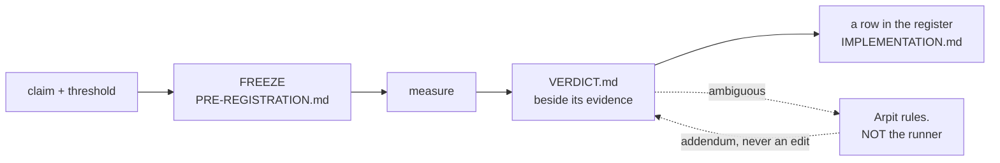

# SR-RS — the R predictions

> **`CLAUDE.md` is the normative home** and carries these rules verbatim. This
> record explains and guards them; it amends nothing.

## §1 — For humans

**An R is a promise made before looking.** You write down the claim and the
number that would settle it, freeze both, *then* measure. Call the pocket, then
take the shot.

That is the whole idea, and everything below exists to stop the one failure it
is vulnerable to: **deciding what counts as success after seeing the result.**



<details>
<summary><b>ASCII twin</b> — the same diagram, for terminals, diffs, and any reader without a Mermaid renderer</summary>

```text
  claim + threshold --> FREEZE (tools/.../PRE-REGISTRATION.md)
                             |
                             v
                          measure
                             |
                             v
                     VERDICT.md (beside its evidence)
                        |            \
                        |             `-- ambiguous --> ARPIT rules, not the runner
                        |                                   |
                        v                                   v
              a row in the register            an ADDENDUM on the verdict,
              (IMPLEMENTATION.md)                 never an edit to it

  The freeze is the point. Everything else protects it.
```

</details>

### The five ways an R can end

| | means | example |
|---|---|---|
| **PASS** | met its frozen threshold | R3, R4, R9 |
| **FAIL** | did not — **and this is a success of the method** | R5, P1 |
| **INCONCLUSIVE** | **the instrument** could not decide, and said so | R6 |
| **VOID** | **the bar** could not decide — it was incomplete, so it ruled neither way | W110-DOC2QUERY |
| **RETIRED** | the question stopped being asked | R7, R8 |

🔴 **VOID and INCONCLUSIVE are different failures and conflating them destroys
the finding.** INCONCLUSIVE says *the measurement came back unable to
discriminate* — the bar was sound and the world was noisy. VOID says *the
measurement was fine and the bar was not a bar*: it left a free variable, so
it names more than one verdict and whoever fills the variable in afterwards
picks which. Filing a void bar as INCONCLUSIVE would blame the instrument for
the threshold's defect and would quietly leave the defect in place for the
next run to inherit.

⚠ **VOID is not a soft FAIL and may never be used as one.** A bar that could
not be applied did not rule *against* what it was measuring; the run is still
cited for everything it actually measured — its controls especially — and only
its adjudication is withdrawn. The worked instance is
[`W110-DOC2QUERY`](../work/regression/2026-09-05-doc2query/VERDICT.md): the
bar said *net ≥ 6 on `recall@k`* and never named `k`, so it was four bars whose
verdicts disagree, while the run's placebo control cleared its own null
untouched.

⚠ **Only Arpit voids a bar**, on the same rule that sends an ambiguous result
to him rather than to whoever ran it — a session that may void its own
threshold has a way out of every measurement it dislikes.

**FAIL is not failure.** P1 ended the pruning design and R5 rewrote how the git
hook works. **A recorded negative that stops months of building is the most
valuable thing this system produces**, and a project that treats FAIL as
embarrassing will quietly stop producing them.

**RETIRED is not FAIL either**, and conflating them would misreport history.
R7's budget was never missed; the promise was withdrawn.

### Blind and informed — the second half of the same idea

**Pre-registration stops you moving the goalposts after the shot. Run
classification stops you moving the *goal*.**

A prediction freezes the threshold before the number exists. But a threshold is
only half of what a measurement rests on — the other half is the **artifacts**
the run measures: the enrichment text, the prompt that wrote it, the chunking,
the tuned weights, the analysis. If any of those was authored by someone who had
already read the evaluation queries, **the number is about *those queries*, not
about the engine**, and no amount of threshold discipline recovers it.

⚠ **Fux learned this the expensive way.** An enrichment written by an author who
had seen the failing queries measured **+9**; the same intervention written
blind measured **+1**, and a second blind author measured **−1**. **The tell was
not the score — it was that the informed arm broke *nothing*,** on a corpus
where adding vocabulary to nine of ten documents *must* disturb something.

| | means |
|---|---|
| **blind** | every artifact it depends on was authored with no access to the queries, the judgments, or prior per-query scores |
| **informed** | anything else |

**An informed run is not thrown away.** It is filed, cited, and may inform the
corpus — it simply never supplies a delta and is never compared with a blind
one. That is TREC's manual/automatic split, which has worked since 1994, and it
works because **a rule that bans useful work gets routed around, while a rule
that sorts it survives.**

---

## §2 — For agents

### Context

**Nothing owned this.** The rules lived in CLAUDE.md and were enforced by
`tests/test_regression_runs.py`, but no record claimed the system, so no veto
condition guarded it and no change to it had to update anything.

The gap surfaced when **R9 ran, passed, and was cited in six documents while
having no row in the register** — the one table claiming to be the complete set.
Nothing was wrong with the measurement. **What was missing was anything that
would notice.**

### Decision

**1. An R is a claim frozen before it is measured.** The claim and the number
that settles it are committed *first*, in a `PRE-REGISTRATION.md` under
`tools/`. **A pre-registration is frozen on commit and is never edited** — not
to fix a threshold, not to reword a metric, **not even to repair a dead link.**

⚠ **The freeze is absolute, and a wrong pointer is corrected in the CITING
record.** The hard case is a pointer that is **wrong but resolves** — it names a
real file that is not the governing one. Neither gate catches it, and the freeze
forbids fixing it in place. **Three mechanisms were offered and all three are
refused:** a corrected mirror alongside the original (two documents and nothing
in the bytes says which governs); an append-only corrections file beside it; and
a one-line *superseded by X* stub in the frozen file itself. **A permitted edit
is a permitted edit** — the stub in particular trades the whole property for one
line of convenience.

**The correction lives in the record that cites the pre-registration.**
[SR-MERGE-DRIVER](0130_merge-driver.md)'s prose — *governed by
`PRE-REGISTRATION-R6-v2.md`* — is **the sanctioned pattern**, not a workaround
someone should tidy away later. A record is exactly where a claim's grounding is
stated, so it is exactly where a mis-grounding is corrected. **This is written
down so a future session finding a wrong pointer does not reach for the
mechanism that was just refused.**

**2. A threshold may never move — and re-judging at a different size is a NEW
prediction.** Not an amendment, not a re-run: a new id, a new pre-registration,
a new verdict. R6's repair is the worked example — its v2 pre-registration
restated the threshold *character for character* and added only the table row
the original lacked.

**3. The register is the table in
[`work/IMPLEMENTATION.md`](../work/IMPLEMENTATION.md), and it claims to be
complete.** Every id, every status, every pointer to its verdict. **A missing
row is the defect this record exists to make visible.**

**4. Ids are never reused, including retired and superseded ones.** P2–P7 are
spent; R7 and R8 are spent. **A reused id makes every prior citation ambiguous,
and citations are how verdicts are reached.**

**5. A verdict is never edited — it is added to.** *Nothing supersedes a
measurement except a better measurement.* When an ambiguous R6 was adjudicated,
the file kept `verdict: INCONCLUSIVE` and gained an **adjudication addendum**
plus a frontmatter key. **The measurement and the ruling about it are different
facts and stay visibly different.**

**6. An ambiguous result goes to Arpit. The runner does not adjudicate its own
measurement.** R6 fell between its own table's rows; the session that ran it
wrote that up rather than choosing, and was right to. **A session that could
benefit either way from a reading must not be the one that picks it.**

**7. A prediction may not be registered above the design-point ceiling.**
CLAUDE.md §Litmus caps measurement *and commitment* at 10 000 documents. **A
threshold above it is a promise nobody may test, which is worse than no
promise** — it reads as a live gate and can never fire. R7 and R8 were withdrawn
under exactly this.

**8. Only Arpit retires a prediction, and retirement is recorded, not deleted.**
The row stays with status RETIRED and the reason. **A prediction that vanishes
takes with it the evidence that anyone ever cared about the question.**

**9. Never ship a ranking or behaviour change off a single corpus.**

**10. A harness whose feature record is retired falls back to this record.** A
harness normally belongs to the thing it measures, and an open item may hold
one. **But a retired record cannot own anything, and a proposal is not a valid
owner** — `tests/test_sr_ownership.py` accepts an SR name or a `W-nn` id and
nothing else. **The fallback is here rather than nowhere**, because a harness
that measured a prediction is prediction apparatus even after the feature
question is settled, and an unowned component is one whose contract can change
with no record updating. **This is a backstop, not a preference**: a harness
moves to its feature's record the moment one exists.

**10a. EVERY MEASURED RUN IS FILED, and this is what filing one means.**
(Arpit; the normative home from 2026-09-14, previously `CLAUDE.md`
§Conformance runs.)

The measurement environments are scratch and commit nothing
([SR-WORK-ENVIRONMENTS](0052_WORK-environments.md)). **Their evidence is not.**
Every run's report, its diagnosis and its raw data are filed into
[`work/regression/`](../work/regression/README.md), so engine changes are made
from measured data rather than from memory. **Binding, exactly as the
documentation law is.**

**The per-run contract — what artifacts a run owes — is stated once in
[`work/regression/README.md`](../work/regression/README.md) §Per-run contract
and is not repeated here.** What this record states is what the *numbers* in it
may claim: decisions 11 through 19a.

⚠ **A verdict is not an SR.** When a run adjudicates a pre-registered
prediction the ruling is a `VERDICT.md` beside its evidence — `type: Verdict`,
with the prediction id and the frozen pre-registration's path. An SR records a
decision somebody can supersede; **nothing supersedes a measurement except a
better measurement**, which is a new run with its own verdict. The *decisions*
that rest on a verdict live in `records/` and cite it. Enforced by
`tests/test_regression_runs.py`.

**10b. A pre-registered threshold may never move.** When a decision is gated on
a measurement, **write the threshold, the metric definitions and the slice
definitions down before producing a number, and commit that file first.** Then
measure against it.

- **A recorded NEGATIVE that stops months of building is a *successful*
  outcome, not a failed task.** Report it plainly.
- **A result between *clearly passes* and *clearly fails* is written up as
  AMBIGUOUS and handed to Arpit.** Do not adjudicate it, and do not restate the
  threshold in looser words.
- **Post-hoc analysis is allowed and often valuable** — label it **post-hoc**
  and keep it out of the verdict.
- **If the measurement turns out not to test what the threshold assumed, say
  THAT**, rather than reporting the number as if it did.
- **The reproduce command must actually reproduce.** Findings that warrant a
  change graduate to [`work/proposals/`](../work/proposals/README.md) and, when
  accepted, to a record. **The evidence a ranking change needs is decision 19's
  paired floor, measured in `fux-lab` on the golden test data** —
  [SR-WORK-ENVIRONMENTS](0052_WORK-environments.md) decision 2 names the only
  place a measurement runs, and [SR-LAW-0](0002_LAW-0-authority.md) decision 2a
  is why no second corpus is demanded here.

[`tools/pruning-eval/PRE-REGISTRATION.md`](../tools/pruning-eval/PRE-REGISTRATION.md)
is the worked example.

**11. Every measured run is `blind` or `informed`, and declares which.** A run
is **blind** only if *every* artifact it depends on was authored without access
to the evaluation queries, the judgments, prior per-query scores, or any derived
report of them — a failure list, a dashboard, a ticket naming a query. The
artifacts are: **corpus enrichment, the enrichment prompt, chunking and index
configuration, retriever and reranker settings, and the analysis.** Anything
else is **informed**.

Two things this deliberately does not say. **It does not say *has seen***, the
binary label CONSORT 2025 item 20a tells you to abandon — blindness is
per-person and per-stage. And **it does not name the model, because the artifact
is the contaminated object**, not the model and not the metric.

**12. An informed run is RECLASSIFIED, never banned — and never supplies a
delta.** It is filed, listed, cited, and may inform the corpus. It is **never
compared with a blind run and never used to state a difference between arms.**

**This is the load-bearing decision.** TREC has split manual from automatic runs
since **1994**: manual runs are reported and contribute to the judgment pool,
and are never scored against automatic ones. **A prohibition on useful work gets
routed around quietly; a taxonomy survives** — and a rule that is quietly
violated is worse than no rule, because it also supplies false assurance.

> ⚠ **The scope defect in this wording is KNOWN and DELIBERATELY UNREPAIRED.**
> *"Never supplies a delta"* is written without qualification, and the first run
> filed under the rule was `informed` by construction and made **entirely** of
> deltas — a wheel 30× smaller, an index 22.6 % smaller, an ingest 6.8× faster.
> **As written, decision 12 forbids reporting a file size.**
>
> The distinction the wording is missing is that **contamination requires an
> evaluation set to exist**:
>
> | kind of number | can authorship contaminate it? |
> |---|---|
> | nDCG, pass@k, fixed/broken on a golden set | **yes** — this is what decision 12 is for |
> | bytes on disk, wall-clock, wheel size | **no** — there was nothing to have seen |
> | p95 latency on a *chosen* query set | ⚠ **partly** — the metric cannot be fitted, the **sample** can |
>
> **Arpit ruled the text stands unchanged.** No narrowing to evaluation-set
> metrics, no separate declaration axis for performance numbers. **An informed
> run reporting a cost delta discloses the conflict in its report** rather than
> the rule being loosened to let it through.
>
> ⚠ **This block exists so the defect is not "fixed" by a later session.**
> Editing a measurement rule so that a run passes under it is the
> moving-threshold failure in a different costume, and it is worse here than a
> known-imprecise sentence. **Do not narrow decision 12. Disclose.**
>
> **Reopen when** the disclosure has been written three times — at that point
> the repetition is itself the argument that the wording, not the runs, is what
> costs effort.

**13. The run states who authored each artifact and what evaluation material
they could reach.** Per artifact: the author, and which of *queries / judgments
/ prior scores / none*. The sentence is ARRIVE 2.0 item 5 — *describe who was
aware of the group allocation at the different stages.*

**The burden is on the author to argue exposure was absent**, not on a reader to
demonstrate it was present. Paraphrase-level exposure defeats string matching,
and BIG-bench's canary GUID — embedded precisely so labs could exclude it, and
reproducible by a model trained on it anyway — is the standing proof that *"did
you read the file?"* is not the question. **Disclosure is the fallback; a set
nobody can reach is the control.**

⚠ **The label for an informed number is not "upper bound".** An upper bound
asserts a known direction *and* a bounded magnitude; a leaked measurement has
**unknown bias magnitude**. The honest label is **"not a generalisation
estimate."**

**14. A delta smaller than the set's resolution is reported as "no detected
change", whoever authored it.** Fux's engine is deterministic, so *run-to-run*
variance is zero — **and that is not the variance that matters.** The variance
that matters is **author-to-author**, and it has been sampled exactly twice:
`+1` and `−1` on a 50-query set.

**Provisionally, and explicitly as a placeholder for a measurement rather than a
measurement: on a 50-query set, nothing under ±2 queries (4 pp) is a detected
change.** TREC puts standard MAP error at 50 topics near **2.4 %**; a
meta-analysis of >120 Kaggle competitions recommends **≥10 000 examples** to be
safe from adaptive effects. **Fifty queries is under-powered and this record
says so rather than letting a future reader discover it.**

⚠ **This applies retroactively to fux's own numbers, and that is the point.**
The blind arms' `+1` and `−1` are below the floor: the honest reading is **no
detected effect**, not `+1`. What survives is the **concordance** — both blind
authors broke the same two queries, the informed author preserved exactly those
two, ~0.028 — a different statistic, roughly **17×** the evidential weight of
the *broke nothing* sentence that was actually filed, and the one to cite.

**15. An enrichment change is scored against a decoy set and a placebo — ✅
BUILT 2026-08-28, and BUILT IS NOT PROVEN.** *Neural Retrievers are Biased Towards LLM-Generated Content* (KDD 2024)
establishes **source bias**: retrievers rank LLM-written text higher
independently of whether it informs, and the effect reaches re-rankers. Every
fux enrichment arm added ~70 tokens of fluent LLM prose to nine of ten documents
with **no matched control**, so **text *presence* and text *content* are not
separable in any number this project has filed.**

Two controls close it — a **decoy** query set the enrichment was not aimed at,
and a **content-free placebo** enrichment of matched length — and decision 11
implies a third thing that does not exist either: a **sealed** subset of
queries, held by one owner, never shown to anyone who authors an artifact,
rotated when it leaks. **All three landed** —
[`tools/quality-controls/`](../tools/quality-controls/README.md): the decoy
set and the placebo on 2026-08-27, the sealed subset on 2026-08-28 once Arpit
ruled its power tension.

| control | state |
|---|---|
| content-free placebo, matched length | ✅ **built** — one shared sentence pool so every placebo has the same vocabulary and cannot discriminate; length matched to within a few words; deterministic from the source sha (L3), no model |
| decoy query set | ✅ **built** — 15 domain-plausible questions the corpus cannot answer. ⚠ **The one kind of evaluation material an agent may author**: no correct answer exists, so there is nothing to fit |
| **sealed subset** | ✅ **built 2026-08-28** — 15 of 50, split by `sha256(id)`: deterministic, seedless, order-independent |
| **intent-split prior probes** | ✅ **built 2026-09-12** — 26 probes, 13 current-seeking / 13 history-seeking, over the golden ladder's declared `supersedes:` pairs and `archived=true` directories. ⚠ **Truth is MECHANICAL, read off a declaration**, which is what lets an agent author them: there is a correct answer, but nobody chose it. Adjudicated W-143 the day it was built |
| **`heading` negative control, rebuilt** | 🔴 **RETIRED 2026-09-12**, after a second arm. The rebuild found `bm25f.heading` 3.0 → 0.0 moves the distractor count by a net of 5, and read that as *they win on body similarity*. **They do not.** `bm25f.body` 1.0 → 0.0 moves it by a net of **1** over 83 discordant pairs, `p = 1.0000`. See the row below — the endpoint was never a ranking measurement |
| **the distractor count, as an ENDPOINT** | 🔴 **UNUSABLE, measured 2026-09-12.** 392 of 1 001 documents at `rung-01000` are `ext/sibling/`, so a top-5 drawn at random holds **1.96** of them — and every arm of **both** fields observes **2.06–2.14**, the off arms included. **The count measures corpus composition, not ranking**, and a third field would reproduce it. ⚠ The arms work: seed hits fall 272 → 158 with `body` off. [VERDICT-W142](../work/regression/2026-09-12-reaim-and-instruments/VERDICT-W142.md) |
| **W-115 fence/depth two-arm corpus** | ✅ **built 2026-09-12** — 300 documents, three families on disjoint topic vocabularies, both arms HEAD with the pre-W-115 grammar patched at two seams. Carries a `--selftest` that is decision 22c(b)'s proof: 60/60 treated decoys separable, **0/30 placebo decoys separable**, 0/90 subjects. [VERDICT-W115](../work/regression/2026-09-12-reaim-and-instruments/VERDICT-W115.md) |
| **W-144 prose-density graded set** | ✅ **built 2026-09-12** — 90 probes whose truth is *more about the term in the same amount of prose*, with an `inverse` positive control and a `placebo`. **Probe terms sit at `df` 4–23**, which is the one change that unsaturated the endpoint a `df == 1` probe could not move. [VERDICT-W144](../work/regression/2026-09-12-reaim-and-instruments/VERDICT-W144.md) |
| **table-`flen` counterfactual** | ✅ **built 2026-09-12** — recomputes `flen` with table tokens out of the body length and re-ranks, recomputing `avg_wlen` in BOTH arms. Carries a gate that refuses to report unless its recomputed `flen[body]` equals the committed one for every document |
| **the table-is-the-answer probes** | ✅ **built 2026-09-13** (W-155) — the first probes whose **table carries the query term**; every family before them used a table of unrelated cells, i.e. an *appendix*. Two directions, 30 each: `dump` (a row label in material that says nothing about it — **the prose document is correct**) and `content` (a rate card whose subject IS its rows — **the table-heavy document is correct**). 🔴 **Both returned 30/30, in opposite directions**, so excluding table cells is right for two shapes and wrong for a third. ⚠ **Both families are FULLY DISCORDANT, and the harness now says so** — zero headroom in both directions with `discordant == n` is the maximal-information case, **not** decision 22d's null, and printing the same warning for both was calling a total flip a measurement of nothing. [VERDICT-W155](../work/regression/2026-09-13-table-is-the-answer/VERDICT.md) |

🔴 **What C1 and C3 rest on, said plainly (2026-09-12).** They have rested on
**generator assertions** since 2026-08-28, and the control that was going to
replace that has now been retired as unusable. **No live control backs them.**
That is recorded here rather than carried as an open item, because the item that
would have closed it cannot: the fault is the endpoint, and there is no third
field to aim it at. A replacement would have to ask a different *question* —
*does the correct seed document rank above every sibling* — which is a `hit@1`
question against a key, and therefore
[W-136](../work/open/W-136-golden-benchmark.md) phase 5's job rather than a
control's.

⚠ **The mechanical half of the lesson IS shipped**, so this cannot recur
silently: `tools/quality-controls/body_control.py` computes its endpoint's
**corpus base rate and prints it before it runs an arm**. A distractor control
that cannot beat its base rate now says so in its first two lines.

⚠ **The decoys found something on their FIRST run**, which is the argument for
controls in one line: **one of fifteen unanswerable questions is reported
`grounded`**, because `coverage` and `missing` are corpus-wide and its four terms
scatter across four documents. **No ruling on R10 catches it** — its separation
is `0.58`, above the `0.5` R10's selection rule would have picked.
[The run](../work/regression/2026-08-27-decoy-control/report.md);
[SR-CONFIDENCE](0141_confidence.md) carries it as a named, untaken decision.

**The power tension, resolved out loud as this decision demanded.** Sealing
shrinks the visible set. Arpit ruled 2026-08-28: **seal 15, grow the set later**.
**35 visible and 15 sealed are both underpowered and that is accepted rather than
hidden** — the ±2-query resolution floor still governs what a delta may claim,
and it does not loosen because a set got smaller; it gets **harder to clear**.
**Sealing buys a claim about contamination. It buys no precision**, and a run
reporting a sealed number as if it were precise is misreading the control.

🔴 **And the sealed half is harder than the visible half: 5 of the 9
`known_failure` goldens landed in the sealed 15** — 33 % against 11 %. **This was
not corrected, and correcting it would be the bug**: balancing by difficulty
means reading the scores, which is the contamination the seal prevents. A sealed
score is therefore **not comparable to a visible score** at this size, and
anyone reporting both must say which half.

⚠ **BUILT IS NOT PROVEN.** None of the three controls has yet been used in a run
that adjudicates anything. **The marker moves from `NOT BUILT` to built; it does
not become evidence.**

✅ **DISCHARGED 2026-08-28 for the `unanswerable` class** —
[the run](../work/regression/2026-08-28-blind-unanswerable/report.md),
classified `blind`, is the first to use a control to adjudicate.

✅ **DISCHARGED the same day for the CONTENT-FREE PLACEBO** —
[the run](../work/regression/2026-08-28-placebo-and-seal/report.md). Three
ingested arms on the playground: `none` **32/50**, `placebo` **33/50**, `real`
**41/50** (the outer two reproducing 2026-08-24 exactly, which is what makes it
a comparison). **Matched-length content-free prose on nine of ten documents
moved one query — `n_d = 1`, two-sided exact `p = 1.0000`, no detected change.**
**The source-bias explanation this decision was written against does not hold on
this corpus**; the lift is attributable to content.
⚠ **It clears SOURCE BIAS and not CONTAMINATION.** The `real` arm's author read
the queries; decision 12 governs that separately and this run does not touch it.
**The `+9` remains `informed` and is not a generalisation estimate.**

🔴 **NOT DISCHARGED for the SEALED SUBSET, and the reason is chronology.**
`seal.py` was written 2026-08-28; the enrichment it was applied to was authored
2026-08-24, when its author could see **all fifty** queries. **A post-hoc split
of a fully-seen set cannot test contamination**, however deterministic the
split — so the observed visible/sealed lift split (+8 vs +1) **may not be read
as a contamination signature**, the more so with `n_d = 1` in the sealed half
and 5 of 9 `known_failure` goldens sitting in it. **The seal is EXERCISED, not
PROVEN**, and its first adjudicating use needs an artifact authored *after* it
existed, by an author given the visible 35 only.

**Scoreboard, so the marker is never read as all-or-nothing:**

| control | built | used to adjudicate |
|---|---|---|
| decoy query set | ✅ | ✅ 2026-08-27 |
| `unanswerable` class | ✅ | ✅ 2026-08-28 |
| content-free placebo | ✅ | ✅ 2026-08-28 |
| **sealed subset** | ✅ | 🔴 **exercised only — see above** |

🔴 **And the control did what a control is for: it found something.** A blind
session authored 20 near-miss `unanswerable` questions; a **second, independent**
blind session ruled all 20 genuinely unanswerable; **the engine reported
`answerable: true` on 20 of 20** — 6 `grounded`, 13 `partial`, 1 `weak`, with 17
of 20 at or above the `separation_floor`. This is the decoy control's 1-of-15
reproduced at severity once the set is *designed* to sit close to the corpus.
⚠ **It proposes no threshold and reopens no ruling** — R10 is unmeasured and a
floor fitted to the 20 numbers that exposed the problem would be decision 12's
failure in a new costume.

🔴 **The same run withdraws a conclusion this record's own decision 15 work
produced.** `relevance_audit.py` established the goldens hold one scalar `doc`
per query, and the inference drawn on 2026-08-28 was *"`recall@k` over this set
IS `hit@k`."* A blind annotator then judged **25 of 50** questions to have more
than one genuinely relevant document. **The inference was about the file's
shape and does not survive contact with the corpus** — which the audit script
itself said no count could settle. **No filed number is invalidated**: past runs
measured *"did the asserted document come back"*, which is `hit@k` and was
reported as such. What changes is that **`hit@k` may not be called `recall@k`**,
and W-87 P2's headline metric is not computable from what exists today.

✅ **CONFIRMED by a second blind annotator, 2026-08-28** —
[the agreement run](../work/regression/2026-08-28-annotator-agreement/report.md).
A different fresh session, denied the goldens, the scores, `fux` itself **and
the first annotator's answers**, judged **26 of 50** multi-document. The two
agree at **Cohen's κ = 0.960** — 49/50 on the multi/single call, 86 % on the
exact document set, mean Jaccard 0.943 — and **both name the same 25**.
**The one-document assumption is refuted by measurement, not by one opinion.**
⚠ **The schema decision is an SR and this record does not make it**: whether
`expect` becomes a list, or the rank contract and the relevance set split into
two fields, belongs to whoever owns the golden format. The evidence is filed.

⚠ **Running the placebo is not the same as building it.** A placebo arm produces
its value as a **delta between arms**, which decision 12 governs — so grading a
corpus three ways needs the blind/informed question answered before any number
from it may be cited.

⚠ **`tools/vector-gate/` was retargeted 2026-09-12 and this record owns it.**
Its README defaulted `$Q` to `fux-playground`'s goldens; **there is no default
now**, and the directory carries what the retirement costs: the *retrieval* half
of the gate cannot be re-run as filed, and `cross_arm.py` — which compares two
implementations' **vectors** and needs no goldens at all — is the half that can.
That half then ran on golden data:
[`2026-09-12-vector-gate-crossarch`](../work/regression/2026-09-12-vector-gate-crossarch/report.md).

🔴 **And the corpus it was run on is gone.** Every number in this decision was
produced on `fux-playground`, which [SR-WORK-ENVIRONMENTS](0052_WORK-environments.md) made
Arpit's hands alone on 2026-09-11. **The filed numbers stand exactly as
measured** (SR-WORK-ENVIRONMENTS decision 4, forward only); **a re-run does not exist**
until the control is rebuilt on a golden rung in `fux-lab`
([`work/golden/`](../work/golden/README.md)). A session that re-runs any of
the three controls against the old corpus is breaking a law, not reproducing a
number.

**Two more `tools/quality-controls/` artifacts landed 2026-08-28, outside the
three-control table above** — neither is a control on an enrichment arm; both
close the P2 `recall@k` question W-87 filed:

- [`BLIND-AUTHOR-BRIEF.md`](../tools/quality-controls/BLIND-AUTHOR-BRIEF.md)
  — the prompt a genuinely blind session runs to author the `unanswerable`
  query class (SR-RS decision 11's test: no access to queries, judgments or
  prior scores). **Committed because its own author could not be blind** — a
  session that had read the goldens wrote the brief, so the mitigation is
  publication, not trust: anyone can check it for the three things it must not
  contain. Not yet run by a blind session; **the class it produces does not
  exist yet.**
- [`relevance_audit.py`](../tools/quality-controls/relevance_audit.py) —
  checks whether the goldens' relevance format needs new annotation before
  `recall@k` can be computed. **Its first run (2026-08-27) was vacuous**: it
  read an `expect`-list schema key that `fux-playground/goldens/queries.jsonl`
  has never had, and reported "0 asserted" for all 50 — a reading of a field
  that does not exist, not a finding. **Fixed 2026-08-28** (Claude Code) to the
  real schema — one scalar `doc` + `max_rank` per golden, confirmed against
  `fux-playground/check.py` — and re-run: all 50 goldens assert exactly one
  `doc`. `recall@k` over this set **is** `hit@k`; what remains is a
  completeness declaration (is the asserted `doc` the only relevant one?),
  `arpit` lane, tracked in [W-87](../work/open/W-87-what-good-means.md) P2.

**15a. A CIRCULARITY SCREEN is a control, and it is the one that was missing**
(2026-09-15, W-183). Decision 15's three controls ask *did the arm move something
real*. None of them asks the question that killed C2: **is the endpoint's truth
the feature's own objective?**

`c = 0` on C2's proximity suite was quoted as `22 % → 100 %, 94 fixed, 0 broken`
and it meant nothing, because the suite scored contests the reranker is built to
win — and that was **argued** three times, never computed. So:

> For every contest, score the candidates with the FEATURE's own objective and
> report `agreement` — the share where the thing that objective picks is also
> the true one — beside the **chance rate**.

| `agreement` | the endpoint is |
|---|---|
| ≈ 1.00 | **circular**: the truth IS the objective |
| ≈ chance | **independent**: a null from it says nothing about the feature |
| between | usable |

**The band is pre-registered with the endpoint and may not move afterwards**
(decision 10b). [`cited_decision.py`](../tools/quality-controls/cited_decision.py)
is the first implementation — `agreement` **0.4141** against a chance rate of
**0.0748** over 524 contests drawn from this repository's own
`SR-RS … decision 19`-shaped citations, ruled
[here](../work/regression/2026-09-15-quality-endpoint-screen/VERDICT.md).

⚠ **Necessary, not sufficient, and the gap is named rather than left to be
found.** The screen catches truth-equals-objective. It cannot catch circularity
through a **third variable** — an author who paraphrases what they cite writes a
query dense in its words — and nothing mechanical can. What a candidate owes
instead is a stated mitigation: `cited_decision.py` reports `agreement` per
record so one dense document cannot carry the result, and drops a contest whose
query shares more than 80 % of its terms with the true passage.

⚠ **It screens an ENDPOINT, never a corpus.** A number measured on one tree
transfers to no other, and the run that produced this one says **dogfood** in
its own verdict.

**15b. A frozen sweep gets its OWN arm in the instrument, and the instrument
does not adjudicate** (2026-09-15, W-180). `w144_graded.py` was built for
W-144's option (b) — shipped `flen` against a table-excluded counterfactual.
Arpit ruled **(d)**, *lower `b`*, on 2026-09-14, so the arm the
[pre-registration](../work/regression/2026-09-15-b-sweep/PRE-REGISTRATION.md)
needs is a different one: **the shipped `flen` in every arm, and `b` the only
thing that moves.**

`bsweep` is that arm. Two properties are worth stating because both are easy to
lose:

- **The index is ingested once.** `b` is a **query-time** parameter, so all four
  values read the same committed bytes. Four corpora would have introduced a
  second difference into an ablation whose whole point is that one lever moves.
- 🔴 **The command prints what each value did and applies no bar.** The decision
  rule — *first value, descending, netting positive on all three families with
  both controls holding and the net clearing decision 19's floor* — lives in the
  frozen pre-registration, and a harness that also encoded it would be a second
  copy of a threshold that may not move. It prints the rule and says it is not
  applying it.

⚠ **The counterfactual `flen` is deliberately NOT computed in this arm.** Option
(b) was ruled out; carrying it alongside would put two levers in one run, which
is what the pre-registration forbids in those words.

**16. When a pre-registration's live path is DELETED, the run keeps a mirror of
it — the verdict is not edited.** Decision 1 freezes a pre-registration and
decision 5 freezes a verdict, and between them they assume the file the verdict
*points at* keeps existing. **It does not always**: `DENSE-CHUNK` names a module
whose docstring held the bar, and that module was deleted with the dense lane.

| | |
|---|---|
| edit `pre_registration:` to point somewhere else | **forbidden by decision 5.** A verdict is never edited |
| keep the module alive as a stub so the pointer resolves | a file kept only so a test passes, which is the vestige class this project keeps deleting |
| **mirror the file into the run** | ✅ the measurement stays citable and nothing frozen is touched |

**The rule.** The run carries the pre-registration at its *original path* under
`evidence/pre-registration/`, **byte for byte as it stood when the verdict was
ruled** — verified against the commit that filed the verdict, not copied from
whatever the file had drifted to.
[`tests/test_regression_runs.py`](../tests/test_regression_runs.py) resolves
the pointer there **only when the live path is gone**, and a second check
refuses a mirror that sits beside a live file, because **two frozen thresholds
for one verdict is exactly the ambiguity decisions 1 and 2 exist to prevent.**

**Why this is not archive-is-not-evidence in disguise.** `archive/` holds
superseded *decisions*, which may be named but never cited as grounding. This
holds a frozen *threshold* a filed measurement was ruled against. **It is the
evidence**, kept beside the run that used it, in the one directory this project
forbids editing. ⚠ **The general problem is not rare**: deleting dead code and
keeping measurements readable would otherwise be in tension, and a project that
has to choose will quietly choose the code — leaving verdicts that point at
nothing.

**17. A run directory holding a frozen pre-registration and NO report is a
legal, complete state — `pre-registered, not yet measured`.** Added 2026-08-27.

- **The situation.** R10's threshold was frozen and committed to
  `work/regression/2026-08-27-r10-separation-floor/evidence/PRE-REGISTRATION.md`
  and the measurement could not start — it needed `fux-playground`, which did
  not exist on the build machine. ⚠ **Since 2026-09-11 it needs something
  else**: [SR-WORK-ENVIRONMENTS](0052_WORK-environments.md) put every measurement on the golden
  ladder, so R10 is measured on a rung or re-registered, never restarted where
  it was frozen. The frozen file is not edited to say so — that is condition 2
  below. The per-run contract demanded a `report.md`, an
  `ANALYSIS.md`, an `evidence/` directory and a `blind`/`informed`
  classification, so the directory failed **four checks** for having done
  nothing wrong.
- **The two ways out were both bad, and that is the argument.** Write a report
  for a run that has not happened — inventing the thing the contract exists to
  demand — or move the frozen file somewhere the test does not scan, which
  **decision 8's freeze forbids** (W-82 ruling 8: no mirror, no `CORRECTIONS.md`,
  no header stub).
- **The rule.** No report ⟹ rows 2, 3, 4 and 7 of the contract do not apply.
  **Row 6 still does**: the directory is listed in
  [`work/regression/README.md`](../work/regression/README.md), because a
  frozen threshold nobody can find is exactly as useless as a run nobody can
  find.
- ⚠ **Legal ONLY while there is no report.** The moment one lands the full
  contract applies again, so this cannot become a way to file a number without
  its evidence.
- **This is decision 1 being consistent with itself.** Decision 1 says commit
  the threshold *first*, then measure. A contract that makes the interval
  between them illegal is a contract against its own method — and the interval
  is not brief: it is however long the environment takes to exist.


**18. A pre-registration that fixes BOTH a selection rule and a verdict table
must say which governs when they disagree.** Added 2026-08-27, and it is a
correction to a frozen document, living here because decision 1 forbids editing
one (W-82 ruling 8).

- **The case.** `PRE-REG-R10-SEPARATION-FLOOR` froze a selection rule — *"the
  lowest `separation` at which `P(correct)` reaches `t` **and stays at or above
  it for every higher bin**"* — and a verdict table whose fourth row reads
  *"crossing exists but non-monotone → too noisy to read → no change."*
- **The data did both at once**: the curve reached `t` at `0.3`, **fell back at
  `0.4`**, then rose. The selection rule picks `0.5`; row 4 picks *no change*.
  **Neither is wrong** — they were written against different worries and nobody
  noticed they overlap.
- **The outcome was ruled `INCONCLUSIVE` and handed to Arpit**, per `CLAUDE.md`
  §A pre-registered threshold may never move. ⚠ **Picking `0.5` would be the
  moving-threshold failure in its most natural costume**: a defensible reading
  of a frozen sentence that quietly discards the row saying not to.
- ✅ **RULED by Arpit 2026-08-28: the VERDICT TABLE governs.** A crossing that
  is non-monotone is *"too noisy to read → no change"*, and the selection rule
  applies **only once the verdict table has been satisfied**. So on R10's curve
  the answer is **no change** — `SEPARATION_FLOOR` stays `0.10`.
- **The rule going forward, now settled:** *a verdict table outranks a selection
  rule.* A selection rule says **which value** to take; a verdict table says
  **whether a value may be taken at all**, and reading the first without
  clearing the second is how a number gets picked from noise. **Every future
  pre-registration states this ordering explicitly** rather than relying on it.
- ⚠ **R10's `VERDICT.md` is NOT edited and stays `INCONCLUSIVE`.** Decision 5
  freezes a verdict, and **nothing supersedes a measurement except a better
  measurement**. What this ruling settles is the *rule*, not the result: the run
  was genuinely undecidable under the document it was ruled against, and it
  stays that way in the record.
- ⚠ **This ruling does NOT reach the `grounded`-decoy case.** That query
  separates at `0.58` — above the `0.5` the selection rule would have picked —
  so no ruling on R10 catches it either way. `separation` measures
  **decisiveness**, and a corpus of near-misses is decisive about its best
  near-miss. See [SR-CONFIDENCE](0141_confidence.md) decision 12.
- **Only data could expose the contradiction**, which is the argument for
  freezing the document rather than against it.


**19. The ±2-query resolution floor is measured, it was far too loose, and it
is ADOPTED (Arpit, 2026-08-28).** Computed 2026-08-28,
[the run](../work/regression/2026-08-28-resolution-floor/report.md).

Two arms graded on the **same** queries is a **paired** comparison: queries both
arms agree on carry no information, and only the ones that **flip** do. That is
McNemar's test, an exact binomial on the discordant pairs — **arithmetic, with
no corpus in it to have been contaminated by.**

| queries that flipped | net difference needed at α = 0.05 |
|---:|---:|
| 2 · 4 | **impossible** — no split clears α |
| 6 | **6** (a total sweep) |
| 8 – 12 | **8** |
| 15 | **9** |
| 20 | **10** |
| 30 | **12** |
| 50 | **16** |

**A net of 6 is the floor of all floors.** ⚠ **Nets of 1, 2, 3, 4 and 5 cannot
clear α at ANY discordant count** — verified by exhausting every split up to
`n = 50`. Their best achievable p-values are `1.00`, `0.50`, `0.25`, `0.125`
and `0.0625`. That single sentence decides more filed claims than the table
does, because it needs no discordant count to apply.

🔴 **At a net of 2 — the current bar — the p-value is never below 0.68.** The
placeholder does not under-protect slightly; **it admits results that are
indistinguishable from a coin flip.**

⚠ **And it is the wrong SHAPE, not just the wrong number.** *"±2 on a 50-query
set"* implies the bar tracks the set size; **it tracks the flips.** Replacing
`2` with `8` would be a better wrong answer.

- 🔴 **Arpit went further than the reporting fix this run proposed.** The run
  asked for the **discordant count**; the ruling is *"record all the questions
  so we can check in detail"* — **per-query results, one row per query per arm,
  filed under `evidence/`.** It is strictly stronger and strictly cheaper to
  comply with: `b`, `c`, the discordant count and every later test are all
  derivable from per-query rows, and from nothing else.

  🔴 **Decision 19a states it, and this record is its only home from
  2026-09-14.** It read *"`CLAUDE.md` §Conformance runs carries it as a
  numbered obligation"* — and `CLAUDE.md` did, which made a **generated**,
  explicitly non-normative file the normative home of a rule this record
  explains. That is the inversion L0 forbids, and W-173 corrected it by moving
  the obligation here and leaving `CLAUDE.md` a pointer.
- ⚠ **CORRECTION, 2026-08-28 — this record and the run's `ANALYSIS.md` both
  stated the reranker case wrongly, in the GENEROUS direction.** Both said the
  `28 → 32` net of **4** *"clears α only if exactly 4 flipped and all 4 went one
  way."* **Four flips all one way gives p = 0.125.** It does not clear.
  **A net of 4 cannot clear α at any discordant count**, so the claim is settled
  by arithmetic and does not depend on the missing count at all. The run's own
  [`evidence/table.txt`](../work/regression/2026-08-28-resolution-floor/evidence/table.txt)
  already said so; the prose disagreed with the evidence beside it.
- ⚠ **Named and marked, re-judged by nothing** (Arpit's call, 2026-08-28): the
  reranker's `28 → 32` (net 4) and W-78's enrichment deltas were filed under a
  bar since shown to admit chance, **and their claims of improvement are not
  supported by what was filed.** **Nothing supersedes a measurement except a
  better measurement** — so no verdict is reversed here, and none of them can be
  re-run either: W-78's corpora went in the 2026-08-20 lab wipe with their
  generator.
- **The losses are one-sided.** A *"no detected change"* ruling made under a
  loose bar stays true under a stricter one; the exposure is entirely on the
  claims of **improvement**.
- ✅ **19a. The bar is COMPUTED now, not compared against by hand** (2026-09-12).
  `tools/quality-controls/verdict.py` returns the **exact two-sided binomial
  p-value on the discordant pairs** and every control imports it; it reuses
  `resolution.py`'s arithmetic rather than adding a second implementation of the
  same table.

  **Why it was needed, in one sentence.** Three instruments built on 2026-09-12
  each began by hard-coding *"net >= 6"* — and **a net of 8 on 30 discordant
  pairs clears 6 while failing this table**, which asks for 12. *"The floor of
  all floors"* is the bar **before the count is known**; using it **as** the bar
  is a silent loosening, and three tools reached for it independently, which is
  what makes it a shape problem rather than a slip.

  ⚠ **No filed verdict changes.** Every conclusion the flat comparison supported
  was *no detected change*, and the losses are one-sided (above): a null under a
  loose bar stays a null under a strict one. Re-read through the exact test, the
  `heading` control's `b=16 c=21` is **p = 0.5114** — the same conclusion, now
  with a number attached to it.

- **`α = 0.05` is conventional and stated, not derived.**
- ⚠ **Detectability is not generalisation.** Clearing this says a result is
  unlikely to be chance and says nothing about 10 000 documents; `CLAUDE.md`
  §Litmus governs that separately.

**ADOPTED 2026-08-28 by Arpit**, with the per-query recording requirement added
on top. ⚠ **The cost was accepted with open eyes: it changes how filed results
read.** The losses are one-sided — a *"no detected change"* ruling made under a
loose bar stays true under a stricter one, so the exposure is entirely on the
claims of **improvement**, and those are the ones now marked.

**20. Decision 10's ownership fallback holds `tools/vector-gate/` too, and the
reason is worth naming.** W-106's instrument tests a claim whose record —
`SR-VECTORS` — **does not exist**: W-112 is blocked on this instrument's own
result, so the record cannot be written first. A proposal is not a valid owner
(decision 10), and an unowned `tools/` component fails
`tests/test_sr_ownership.py`. It sits here, on the `tools/t2-eval/` precedent,
and **moves to `SR-VECTORS` in the change that accepts it** — or stays, if the
result is what closes W-112.

⚠ **This is the second component held by the fallback, and the shape is the
same both times**: a measurement outliving, or preceding, the feature record it
belongs to. That is not a defect in the fallback — it is what a build gated on
falsifiable predictions looks like from the ownership table's side.


**21. Four facts about measurement that are RECORDED rather than actioned.**
All four moved out of [`OPEN-WORK.md`](../work/OPEN-WORK.md) on 2026-09-11.
**None of them is a task**, and a queue holding permanent facts stops being the
signal of what is pending — which is that file's own rule 2. They are here, in
the record that owns measurement discipline, so a run can be checked against
them.

**21a. No run filed before 2026-08-28 has per-query rows, so no paired result
from before that date can be re-tested by anybody — including its own author.**
Decision 15's rule (*every measured run records one row per query per arm*) was
ruled by Arpit on 2026-08-28 and is not retroactive, because the rows were never
written. The discordant count, `b`, `c` and every test decision 19's floor needs
are derivable **from per-query rows and from nothing else**, so a summary count
is not a weaker record of a paired result — it is not a record of one at all.
**This is unfixable, and it is stated so nobody re-derives it as a surprise and
tries to "recover" a `p` from a total.**

**21b. The gate that enforces 21a checks for a `.jsonl`, not for rows.**
`tests/test_regression_runs.py::test_measured_run_files_its_per_query_rows`
passes on **any** `.jsonl` under `evidence/` —
[`2026-09-05-answer-top3`](../work/regression/2026-09-05-answer-top3/report.md)
satisfied it on a **copy of the goldens file**, before its real rows were
written. 🔴 **This is the W-83 shape again**: a check that proves a file exists,
never that it is the right file.

⚠ **Recorded rather than patched, deliberately.** A cleverer check — *is it one
row per query? per arm?* — cannot be written without knowing each run's arm
structure in advance, and shipping an approximation that passes is the
moving-threshold failure in another costume. **Whether a second recorded
instance of the W-83 shape triggers the two-strikes gate
([SR-WORK-SESSION](0060_WORK-session.md) decision 13) is Arpit's
call**, and it sits in the queue as a ruling rather than as a task.

**21c. A paired comparison must assert that both arms resolved the SAME
`separation_floor`.** The floor is repo-configurable
([SR-CONFIDENCE](0141_confidence.md) decision 13), so **a repo can make its own
answers read `grounded` without touching the ranking at all** — and nothing
mechanical catches it. The guard that record ships is *publication*: the block
emits the floor it was judged under. **The measurement-side half is this one:**
comparing an arm judged at `0.10` with an arm judged at `0.02` is a
**pre-registered threshold moving inside a comparison**, which §"A pre-registered
threshold may never move" forbids outright. Differing floors is also decision
13's own reopen trigger, so a run that finds them is reporting a defect, not
just a caveat.

**21d. A cross-seed "null control" is a RATE check, not a determinism check —
and B9 was read as one.** Query ids in the generated suites are **positional**,
so arm A on seed 12 paired against arm A on seed 13 compares **different
questions**; a discordant count across seeds says how often the engine disagrees
with itself on *unrelated* queries. **The determinism check is the same-corpus
repeat**, which is why
[C5](../work/regression/2026-08-28-benchmark-contested/VERDICT-C5.md) was
ruled on the repeat. ⚠ **The 2026-08-28 v1-vs-HEAD run's B9 carries the same
weakness**: its *"0 discordant of 240"* across two seeds is the rate check, and
its *"300/300 identical rows on one corpus"* is the half that does the work.
**The verdict is not edited** — nothing supersedes a measurement except a better
measurement — so this is how B9 is to be READ, and it is why a null control's
design belongs in the pre-registration rather than in its write-up.

**22. HEADROOM IS DISCLOSED ON EVERY PAIRED RUN — per endpoint, per direction,
observed or proven, with no minimum** (ratified by Arpit, 2026-09-11). A null
is only as informative as the number of queries that *could* have moved, and
until this rule a report could state one without ever saying how many that was.

**22a. Always report it, per endpoint.** Every paired run states, for each
endpoint, the score in each arm **and how many queries could have changed**,
beside the power figure. It is computed from the per-query rows decision 15
already requires — **no extra measurement, and nothing new to run.**

**22b. Per direction, and never bare.** The two directions are different
questions and a single number answers neither:

| direction | headroom is | asks |
|---|---|---|
| **improvement** | queries **not right in both** arms | how many could have got better |
| **regression** | queries **not wrong in both** arms | how many could have got worse |

A report never prints *"headroom"* without naming which. A run reporting only
one direction has reported one direction, and its verdict may speak only to it.

**22c. Observed vs proven, and the burden is on the author.** The count from
rows is **observed**. It may be called **proven** only when the run carries

- **(a)** a feature-off/on arm, or a positive control, that actually moves those
  queries, or
- **(b)** a generator `--selftest` asserting the candidates are separable only
  by the property under test.

Otherwise the report labels it **unproven**. ⚠ **Unproven is disclosed, not
voided** — it is not zero, it does not trigger 22d, and a verdict may still rest
on it while saying what it rests on.

**22d. Zero headroom in a direction → Inconclusive in that direction.** Never
*"no detected change"*. A null measured where nothing could have moved is the
absence of a measurement, not the presence of a negative result.

**22e. 🔴 A CONTROL is held to 22d too, and a saturated one reports nothing**
(Arpit, 2026-09-15, as the condition on W-144's ruling; generalised here
2026-09-16).

> *"the run does not start until the arm set carries a control family with
> regression headroom. Both existing controls are saturated 30/30 in every arm,
> so 'nothing regresses' on the probe is consistent with safety and is not
> evidence of it."*

**22b and 22d have always been read as being about the ENDPOINT.** They are
about any family whose count a verdict leans on, and a control is exactly that:
its whole job is to be able to go wrong.

- **A control that cannot lose is decoration.** *Nothing regressed* on a family
  that is right in every arm at every value is a sentence about the family, not
  about the treatment — and it reads identically whether the treatment is safe
  or catastrophic.
- **An arm set needs at least one control with non-zero regression headroom
  that has been SHOWN to spend it**, at some value, even one outside the range
  under test. Demonstrated, not argued: [the W-144 probe](../work/regression/2026-09-16-b-sweep-2-control/report.md)
  put `verbose` at 30/30 across the whole ruled range and **0/30 at `b = 0`**,
  which is what makes its holding informative inside the range.
- 🔴 **The value of this is measurable and was measured.** Without that family,
  `b = 0` and `b = 0.15` are **indistinguishable on every other instrument in
  the set**. The blind spot was one value wide.

⚠ **Saturation in ONE direction is the design, not a defect.** A benefit family
is built wrong at the baseline or the lever has nothing to fix; a control is
built right at it or it cannot report. **22b's table is read per family**, and a
report that flags a benefit family's zero regression headroom as a fault is
reading the design as a fault.

**22f. Regression headroom is measured in the BASELINE arm** (2026-09-16).

22b says *"not wrong in both arms"*, which on a two-arm run is *right in the
baseline **or** right in the treatment*. 🔴 **Counting *right in both* instead is
post-hoc**: it reports what **survived** the treatment rather than what was **at
risk** going in, so it shrinks exactly when an arm is breaking things and the
endpoint looks like it had less to lose the worse the arm did.

**The baseline is knowable before any treatment runs**, which is what lets it be
declared in advance — and it is what
[the W-154 reachability check](../work/regression/2026-09-16-rerank-endpoint-reachability/report.md)
computed with no arms at all, on the way to finding an endpoint that was zero in
a direction before ~2 000 subprocesses were spent on it. ⚠ **The VOID Part B run
defined it the other way**, and its own verdict names that as the second thing
to fix.

**22e. No minimum, and this is deliberate.** There is no threshold on how much
headroom is *enough*. Disclosure plus 22d is the entire rule. **A floor here
would be a pre-registered threshold invented after the fact**, which
[`CLAUDE.md`](../CLAUDE.md) §"A pre-registered threshold may never move"
forbids — and it would be invented from the very runs that exposed the problem.

**Why, and it is one table.** From
[the 2026-08-28 contested-benchmark run](../work/regression/2026-08-28-benchmark-contested/report.md) §2:

| endpoint | arms | could-change | what the null actually was |
|---|---|---|---|
| proximity | 21.7 % / 21.7 % | **94** | a real null — the treatment had room and did not use it |
| marker `hit@5` | 120 / 120 | **0** | no information; both arms saturated |
| `heading` control | 40 / 40 | **0** | ["passed"](../work/regression/2026-08-28-benchmark-contested/VERDICT-C4.md) while testing nothing |

**The same run is why 22c has a proof clause**: its `rerank_weight` arm moved
26/120 → 120/120, and *that* is what makes the 94 proven rather than asserted.
**Difficulty is relative to the capability under test** — a query is easy for X
if the engine answers it with X switched off — so the off/on arm is the only
thing that can establish separability from the outside.

⚠ **It applies FORWARD and no filed run is re-graded.** Enforced by
`tests/test_regression_runs.py` for runs dated on or after **2026-09-11**,
baselined by date exactly like decision 15's rows rule, with the same
exempt/applies pair guarding the baseline itself. **No frozen report is edited**
— that is how the classification rule was landed and it is the only way a
measurement discipline can tighten without rewriting its own evidence.

**23. TEST DATA IS BUILT SO THE FEATURE UNDER TEST CAN MOVE IT** (Arpit,
2026-09-11). *"Whenever we have to test these kind of scenarios, set up the test
data in a way that it can be tested."*

**23a. Before a feature is measured, the test data must contain the input the
feature acts on.** A ranking prior that reads `supersedes:` needs documents
that declare it; one that reads `archived=true` needs a directory declared
archived; one that reads commit time needs documents with distinct, deliberate
dates; an abstention mechanism needs unanswerable questions. **The questions
must also depend on that input** — for a prior that can help one intent and
hurt another, both intents (e.g. *current-seeking* and *history-seeking*).

**23b. Missing input is a DATA DEFECT, fixed in the data — never a null.** A
run that finds 0 headroom because the corpus lacks the input (the 2026-09-11
four-priors precondition check: `supersedes:` declared nowhere, so three priors
moved 0 of 50 at every value) is not filed as *"no detected change"* and is not
Inconclusive-and-done: the data is extended so the feature can move it, and the
measurement is re-planned. Decision 22d still governs any run that does go ahead.

**23c. 🔴 Where the input is COUNTABLE, count it — before the run, with a check
that can fail** (2026-09-16).

23a and 23b were stated as a discipline and read as a reminder, and a reminder
did not hold: the golden ladder was frozen, verified, nested and re-verified for
weeks with **0 `ref` edges on all eight rungs**, while a link-ranking feature was
measured against it and filed **0 of 124 flips at every weight**. Three separate
items were waiting on that corpus.

- **[`ref_edge_census.py`](../tools/quality-controls/ref_edge_census.py) is that
  check for links**, and **it exits 2 when a corpus has none**, so a
  link-dependent run gates on it rather than rediscovering the defect.
- 🔴 **It counts what the ENGINE WROTE, never what a document looks like.** An
  inline link whose target does not resolve is dropped silently by
  `edges._resolve_ref` — so a corpus can be full of markdown links and carry no
  edges at all. **A hand-count or a reviewer reading the documents cannot see
  that**, and it is the failure mode a countable input is most likely to have.
- ⚠ **This does not generalise to every input.** *Unanswerable questions* cannot
  be counted without reading answers ([L11](0012_LAW-11-sealed-answer-key.md)),
  and that count comes from a scored run or not at all. The rule is: **where the
  input is visible in the committed index, a run that depends on it says how much
  there is, mechanically, before it starts.**

🔴 **23d. The DOCUMENTS having the input is half the check. The QUESTIONS have to
ask for it** (2026-09-16).

23a says test data must contain the input **and** that *"the questions must also
depend on that input"*. **The second half is the one that gets skipped**, because
the first is the one that fails loudly.

**Two measured cases, two days apart, and they fail differently:**

| | what was missing | what fixes it |
|---|---|---|
| [W-191](../work/open/W-191-the-ladder-carries-no-links.md) | **the input** — 0 `ref` edges on all eight rungs | link-bearing **documents** |
| [W-168 step 2](../work/regression/2026-09-16-identifier-survival/report.md) | **the questions** — 51 identifier tokens across all 20 seed documents, and **4 of 249 questions ask by one** | **id-queries** |

🔴 **The second is harder to see and cheaper to fix.** A corpus census comes back
healthy — the tokens are there — and a run proceeds to an `INCONCLUSIVE` nobody
predicted. **So a precondition check counts the questions too**, and
[`identifier_survival.py`](../tools/quality-controls/identifier_survival.py)
**exits 2 when the id-bearing question count is below the floor of all floors**,
for the same reason the edge census exits 2 on zero.

⚠ **Below the floor is not "a small sample".** 4 questions cannot produce 6
flips, so **no split of them clears α** — the run is not underpowered, it is
*unable*, and decision 19's table says so without any data.

**23b-i. ⚠ Satisfying 23a collided with the one-archive law, and the law's
test was narrowed rather than the data moved** (2026-09-12). *"A prior that
reads `archived=true` needs a directory declared archived"* produced
`work/golden/seed/archive/`, and `tests/test_archive_law.py` fired on it: the
law forbids a second directory named `archive` anywhere but the repo root.

- **These are five fictional retired documents, not retired documentation.**
  The law is about where this project's own superseded docs go; the corpus
  needs the word `archive` because the feature under test reads a directory
  declared archived.
- **Moving them into `archive/` would break the ladder** — the corpus must sit
  with its manifests.
- **The exemption is one exact path**, asserted by its own test so it cannot be
  widened into a pattern. ⚠ **Stated cost:** a genuine second archive created
  under `work/golden/` is now invisible to that check.
- 🔴 **Arpit's law, narrowed by a session.** Flagged here rather than assumed:
  if the exemption is not wanted, the alternative is renaming the corpus
  directory and teaching prompt 1b the new name.

**23c. The data declares what it exercises.** The test data carries a coverage
table — feature → the input present → the documents and question ids that
exercise it — and every pre-registration names the rows it relies on. A feature
with no row is not measurable yet, and says so.

**23d. Where the data lives is SR-WORK-ENVIRONMENTS's call, and who writes it is the blind rule's.**
Test data is fux-lab's golden data ([SR-WORK-ENVIRONMENTS](0052_WORK-environments.md)); anything
answer-bearing — documents a question depends on, and the questions and answers —
is written by the key's author, never by a session that tests the engine
(decision 11). Mechanics that carry no answer (declaring an archived directory,
committing documents at their stated dates) may be set up by the extending
session.


### Consequences

- **The prediction system is guardable.** A change to the discipline updates
  this record; before it, it updated nothing.
- **`tests/test_regression_runs.py` has an owner**, so its per-run contract
  changes with a record rather than silently.
- **The completeness claim is mechanical.**
  [`tests/test_prediction_register.py`](../tests/test_prediction_register.py)
  walks every filed verdict and asserts a matching register row — it would have
  caught R9 the day it ran. Building it forced one refinement worth recording:
  the first verdict that is **not an `R` prediction** (a feature gate) arrived in
  the same session, and rather than give it an `R` number it never earned —
  **inventing an architectural prediction nobody made** —
  `IMPLEMENTATION.md` grew a second **feature-gate** table and the check reads
  **both**.
- **A run can be wrong in a way the register catches.** Before decision 11, an
  artifact authored against the evaluation set produced a number that looked
  exactly like a clean one. It still can — but the run has to *say* so, and a run
  that says nothing fails the check.
- **Existing runs are exempt by baseline, not by exception.** Every filed report
  is frozen, so the check is anchored to the run's own directory date. **This is
  the only shape that does not require editing frozen evidence to turn a rule
  on.**
- **A surface capture is out of scope**, deliberately: it pre-registers no
  threshold and states no delta, so a classification on it would be a label with
  nothing to label. The check reads the same declaration the evidence rule
  reads, so the two cannot drift apart.
- ⚠ **Fux's own enrichment numbers are downgraded by its own rule** — decision
  14. **A discipline whose first act is to weaken the evidence that motivated it
  is behaving correctly.**

### Alternatives considered

| | why not |
|---|---|
| **Leave it in CLAUDE.md only** | it worked until it didn't — a prediction went unregistered and nothing noticed, because no record owned noticing. CLAUDE.md stays the normative home; this adds the ownership and the vetoes |
| **Own the harnesses too** | a harness belongs to the feature it measures. Claiming them here would break one-component-one-owner for no gain |
| **Fold predictions into the SR register** | different lifecycles. **A record is superseded by argument; a prediction is superseded only by a better measurement**, and mixing them invites exactly the confusion decision 5 forbids |
| **"An artifact whose author has seen the evaluation set is not evidence"** | **refused.** Four faults, each named by a standard: *has seen* is the binary CONSORT 2025 abandons; *seen* is undefined exactly where teams fail (queries? judgments? a thread naming a bad query?); *is not evidence* is a prohibition and will be violated quietly where TREC's reclassification would not; and *upper bound* asserts a bounded magnitude a leak does not have. It was also silent on power and on controls |
| **Ban informed artifacts outright** | **you cannot unsee.** Everyone working on this project accumulates exposure, so a ban ends with nobody eligible to author anything — and the rule would then be ignored rather than repealed |
| **Rely on disclosure alone, with no sealed set** | BIG-bench's canary is the counter-example: a marker embedded *so that* labs could exclude it, and reproducible by a model trained on it regardless. Disclosure is the fallback; decision 15 owes the control |
| **Enforce it in `fux enrich`** | fux never calls a model — **the author is outside the program**, so there is nothing for the code to check. This is a measurement-protocol rule and its enforcement lives where runs are filed |

### Reference (required)

- The rules this codifies — [`CLAUDE.md`](../CLAUDE.md), §the lifecycle and
  §Litmus. **Verbatim, not restated**, so there is one normative home.
- The register — the prediction table in
  [`work/IMPLEMENTATION.md`](../work/IMPLEMENTATION.md).
- The per-run contract this record owns —
  [`tests/test_regression_runs.py`](../tests/test_regression_runs.py) and
  [`work/regression/README.md`](../work/regression/README.md); the
  completeness check —
  [`tests/test_prediction_register.py`](../tests/test_prediction_register.py).
- **Decision 5's worked example** —
  [R6-MERGE](../work/regression/2026-08-20-r6-merge-driver/VERDICT.md), which
  still reads INCONCLUSIVE beneath its adjudication addendum; **decision 2's** —
  the [re-run](../work/regression/2026-08-22-r6-rerun/VERDICT.md), a new
  pre-registration rather than an edited one.
- **Decision 6's worked example, and the reason it is a rule** —
  [R5-HOOK](../work/regression/2026-08-20-r5-hook-latency/VERDICT.md): a FAIL
  filed at the judged size, with `src/` last touched *before* the
  pre-registration, so nothing could have been tuned to pass.
- **The ruling behind decisions 11–15** —
  [`work/compare/blind-authorship-rule.compare.md`](../work/compare/blind-authorship-rule.compare.md);
  **the measurement that motivated them** — the
  [blind re-grade](../work/regression/2026-08-24-blind-enrichment-regrade/report.md)
  and the
  [second blind author](../work/regression/2026-08-24-blind-enrichment-second-author/report.md).
  ⚠ Both are **informed** runs by decision 11 (the analysis was written with the
  scores in hand) and both are below decision 14's floor. **They are cited for
  the concordance, which is what survives.**
- Pre-registration as practised in empirical research, and the
  outcome-reporting bias it exists to prevent —
  <https://www.cos.io/initiatives/prereg>


⚠ **2026-09-13:** every `subprocess` pipe under this record's components now names
`encoding="utf-8"` rather than inheriting the platform code page. Why, and what it
cost on Windows, is stated once in
[SR-T1-ACCELERATOR](0110_accelerator.md) decision 13.

### Veto condition

**Reopen this decision if any of these becomes true:**

1. **An R id is reused** — including a retired one (P2–P7, R7, R8).
2. **A frozen `PRE-REGISTRATION.md` is edited after any number exists**, for any
   reason including a link repair.
3. **A `VERDICT.md` is edited rather than added to**, or a `verdict:` field is
   changed to reflect a ruling instead of a re-measurement.
4. **A filed verdict has no row in the register.**
5. **A prediction is registered with a threshold above the design-point
   ceiling.**
6. **A session adjudicates its own ambiguous result** rather than handing it to
   Arpit.
7. **A delta is stated across the blind/informed boundary** — an informed arm
   compared with a blind one, or either compared with a baseline the other
   authored. ⚠ **This is the condition most likely to be broken by accident,
   because the two numbers sit in the same table.**
8. **A measured run carries no `classification`**, or names fewer artifacts than
   decision 11 lists.
9. **A delta below decision 14's floor is reported as a change** rather than as
   *no detected change*.
10. ⚠ **Decision 14's floor is cited as measured.** It is a placeholder. If a
    document quotes ±2 queries without the word *provisional*, **the placeholder
    has hardened into a fact nobody measured** — which is the failure R7 and R8
    were withdrawn for, in a different costume.
11. **A `pre_registration:` line is edited to survive a deletion**, or a mirrored
    copy is kept *beside* a live one. Decision 16 allows exactly one shape.
12. **A filed verdict states *"no detected change"* on an endpoint whose report
    shows 0 headroom in that direction.** Decision 22d has been read as a
    formality and the C4 failure has recurred — a control that "passes" by
    having nothing to move.
13. **A report prints a bare "headroom"** with no direction named, or calls a
    count **proven** with neither an off/on arm nor a generator `--selftest`
    behind it. 22b and 22c have collapsed into "state a number", which is the
    version of this rule that would have let every run in the grounding table
    through.

**How to check them:**

```bash
# 1 — no id appears twice, and no retired id reappears
grep -rn "^prediction:" work/regression/*/VERDICT.md | sort | uniq -d
# expect: nothing

# 2 — a frozen pre-registration changed after its first number
git log --oneline -- 'tools/**/PRE-REGISTRATION*.md'
# expect: one commit each, before the run that used it

# 3, 8, 11, 13 — the per-run contract: classification, the mirror rule, and
# the headroom disclosure (decision 22, for runs dated 2026-09-11 or later)
uv run pytest -q tests/test_regression_runs.py

# 12 — the one half no test can reach: it needs the report's numbers read
grep -rln "no detected change" work/regression/*/VERDICT.md work/regression/*/report.md
# then read each one's headroom line. A test can assert the disclosure EXISTS;
# only a reader can see that a null was called on a zero.

# 4 — the register cross-check
uv run pytest -q tests/test_prediction_register.py
# every filed verdict's `prediction:` id must have a row in one of
# IMPLEMENTATION.md's two registers. NOT the reverse: a RETIRED id has no
# verdict and must pass, and a test asserts that direction so it cannot be
# silently inverted.

# 5 — no live threshold names a size above the ceiling
grep -rn "100 000\|50 000" tools/*/PRE-REGISTRATION*.md
# expect: only inside frozen historical files, never in a newly registered one

# 9, 10 — the floor is quoted as provisional wherever it is quoted at all
grep -rn "no detected change\|resolution floor" work/ docs/ --include=*.md
```

---

## References

*Every source this record cites, gathered in one place. §2's **Reference
(required)** names the grounding; this is the complete list. An archived
document is never listed here — the body may name one, but archive is not
evidence.*

**Records** — [SR-MAINTENANCE](0129_hooks.md) ·
[SR-MERGE-DRIVER](0130_merge-driver.md) · [SR-ENRICH](0137_enrich.md)

**Code**

- [`tests/test_prediction_register.py`](../tests/test_prediction_register.py)
- [`tests/test_regression_runs.py`](../tests/test_regression_runs.py)
- [`tools/t2-eval/`](../tools/t2-eval/)

**Measured evidence**

- [`work/regression/2026-08-20-r5-hook-latency/VERDICT.md`](../work/regression/2026-08-20-r5-hook-latency/VERDICT.md)
- [`work/regression/2026-08-20-r6-merge-driver/VERDICT.md`](../work/regression/2026-08-20-r6-merge-driver/VERDICT.md)
- [`work/regression/2026-08-22-r6-rerun/VERDICT.md`](../work/regression/2026-08-22-r6-rerun/VERDICT.md)
- [`work/regression/2026-08-24-blind-enrichment-regrade/report.md`](../work/regression/2026-08-24-blind-enrichment-regrade/report.md)
- [`work/regression/2026-08-24-blind-enrichment-second-author/report.md`](../work/regression/2026-08-24-blind-enrichment-second-author/report.md)
- [`work/regression/README.md`](../work/regression/README.md)

**Project docs**

- [`CLAUDE.md`](../CLAUDE.md)
- [`work/IMPLEMENTATION.md`](../work/IMPLEMENTATION.md)
- [`work/compare/blind-authorship-rule.compare.md`](../work/compare/blind-authorship-rule.compare.md)

**Papers and specifications**

- Center for Open Science, *Preregistration* — the practice, and the
  outcome-reporting bias it exists to prevent
  <https://www.cos.io/initiatives/prereg>
- **TREC**, the manual/automatic run split, in force since 1994 and restated in
  the Deep Learning Track guidelines — the mechanism decisions 11 and 12 copy:
  *reclassify, do not ban*.
- **CONSORT 2025**, item 20a — abandon binary blinding labels; name **who** was
  blind at **which stage**, analysts included. Decision 11's per-artifact list.
- **ARRIVE 2.0**, item 5 — *"describe who was aware of the group allocation at
  the different stages."* Decision 13's sentence, copied.
- Kaufman, Rosset et al., *Leakage in Data Mining* (KDD 2011) — legitimacy is a
  property of **how a feature came to exist**, not of its values. An enrichment
  note is a feature.
- Kriegeskorte et al., *Circular analysis in systems neuroscience* (Nature
  Neuroscience, 2009) — the same data selecting the artifact and scoring it; the
  closest fit for the **human** role in this failure.
- Dai et al., *Neural Retrievers are Biased Towards LLM-Generated Content*
  (KDD 2024) — **source bias**; decision 15's placebo arm exists because of it.
- Nogueira et al., **doc2query** — document expansion that enforces the split
  mechanically, using training queries only. **Document-side enrichment done
  correctly is not novel; doing it without the split is what was novel here.**
- **BIG-bench**'s canary GUID, and **FrontierMath**'s sealed holdout — the two
  standing demonstrations that disclosure is a fallback and a sealed set is the
  control.
