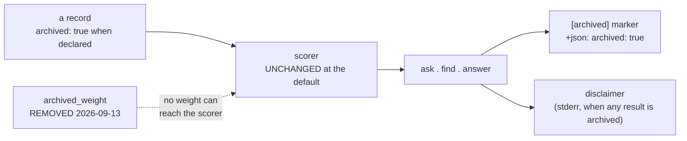

# SR-ARCHIVED-CONTENT — what "archived" does, once a document carries it

> **This record owns the behaviour. The file and its grammar are
> [SR-DIR-LIST](0120_dir-list.md)** — two different questions that once shared
> one document.

## §1 — For humans

A directory (or, through [SR-URL-LIST](0116_url-list.md)'s shared grammar, a
URL) can be declared `archived=true` in `.fux/sources/dirs`. **It is still
indexed** — an archived document is the honest answer to *"why does this look
the way it does,"* and Fux never stops answering that question. What this record
decides is everything that happens **after** the declaration: does the record
say so, does ranking change, does a verb tell you, and can you ask for a
document like that to matter less.

```console
$ cat .fux/sources/dirs
docs
work
archive/v0.26-docs        archived=true
```

**Diagram — Mermaid and its ASCII twin. Update both, always, together.**



<details>
<summary><b>ASCII twin</b> — the same diagram, for terminals, diffs, and any reader without a Mermaid renderer</summary>

```text
   a record                    archived_weight — REMOVED 2026-09-13 (W-152)
   archived: true when         it shipped at 1.0 and never moved; being
   declared          \         retired is a FACT, and facts do not scale
                       \
                        v
                       scorer  -- same score, same order, structurally
                          |
                          v
                  ask . find . answer
                    |-- [archived] marker (ask), --json: "archived": true
                    +-- disclaimer on stderr, when any result is archived
```

</details>

### Examples

**A · Without the signal — what the engine did before it.**

```console
$ fux ask "what is the ingest cache" --top 5
5.9021  Ingest cache and chunker        (archive/v0.26-docs/adr/0002-ingest-cache-chunker.md)
4.8813  Per-file cache invalidation     (archive/v0.26-docs/adr/0006-cache-invalidation.md)
3.9902  Chunker tuning                 (archive/v0.26-docs/adr/0009-chunk-sizing.md)
3.1150  Cache observability            (archive/v0.26-docs/adr/0012-debug-observability.md)
2.7734  Substrate storage              (archive/v0.26-docs/adr/0003-sqlite-substrate.md)
```

Five confident, well-written documents describing a subsystem `CLAUDE.md`
forbids porting back. **Nothing says so.** The only signal is a path prefix.

**B · With the signal. There is no weight to set.**

```console
$ fux ask "what is the ingest cache" --top 5
5.9021  [archived] Ingest cache and chunker     (archive/v0.26-docs/adr/0002-...)
4.8813  [archived] Per-file cache invalidation  (archive/v0.26-docs/adr/0006-...)
3.9902  [archived] Chunker tuning               (archive/v0.26-docs/adr/0009-...)
3.1150  [archived] Cache observability          (archive/v0.26-docs/adr/0012-...)
2.7734  [archived] Substrate storage            (archive/v0.26-docs/adr/0003-...)

note: 5 of 5 results are from archived sources — retired from the live
      corpus. An archived document records what was true when it was
      retired, not what is true now.
```

**Every score and the whole order are byte-identical to A** — compare them
column by column. That is decision 2 holding, and it is the property this
record's veto checks.

**C · What a demotion used to look like, and why it is gone.**

Until 2026-09-13 a consumer could write `archived_weight = 0.5` and the retired
documents dropped down the list, the note gaining a `(demoted, weight 0.50)`
clause. **That knob was REMOVED** ([SR-TUNE](0135_tuning.md) decision 15a, W-152,
Arpit): its best candidate cleared on one corpus rung and broke another, for a
net of **+2** against a resolution floor of **6**. Writing the key now is an
error that names the removal.

🔴 **Nothing was lost to a reader, and that is why this one was cheap.** The
demotion was the only thing that went; the **fact** — decisions 1, 3 and 7 — is
untouched, and the fact was always the part that could be acted on. **A caller
branches on `archived: bool`; a human sees `[archived]` and the note.**

**`--json` carries the flag rather than the prefix**, because a machine reader
should not parse a title:

```console
$ fux ask "what is the ingest cache" --top 1 --json
{"results": [{"id": "...", "title": "Ingest cache and chunker",
              "loc": "archive/v0.26-docs/adr/0002-ingest-cache-chunker.md",
              "score": 5.9021, "archived": true}]}
```

> **`fux find` is why the note is not on stdout.** `find` prints bare paths so
> it can pipe, and a note there would be piped with them. **So the note goes to
> stderr**, and `--json` carries `archived` per result.

**The ranking does not change at the default. Not by a byte.** The flag exists
to carry a **fact** into the answer — *this document is retired* — not to
improve a result, and **not to tell the reader what to conclude from it**
(decision 7).

---

## §2 — For agents

### Context

[SR-DIR-LIST](0120_dir-list.md) decides the file, its grammar, and that the
archived attribute is **declared, never derived**. It also had to decide, in the
same document, what happens once that declaration exists — a record property,
whether ranking changes, what verbs show, and whether a demotion or a disclaimer
ships. **That second half kept growing, and the document became two decisions
wearing one name**: a reader standing up the source-list file and a reader
asking what a marked document does are two audiences, and one citation
vocabulary for both produced exactly the ambiguity the cite-by-name rule exists
to prevent.

### Decision

**1. A record from an archived source carries `archived: true`**, written at
ingest and stored per record — the way `mode` already is, and for
[SR-RECORD](0109_index-record.md)'s reason: **a record read years later states
the rule it was written under rather than having it inferred by whoever reads
it.** Absent when false, so no existing record changes shape.

**1a. Both source lists carry `archived`, and since 2026-09-11 that is true of
`urls` as well as `dirs`** (W-126, Arpit's ask).

- **Same name, same values, same default, one meaning** — held by
  `tests/ingest/test_sourcelist.py::test_archived_is_the_same_attribute_on_both_lists`
  rather than by two definitions that agree today.
- 🔴 **The asymmetry it removes was never a decision.** `dirs` gained the
  attribute on 2026-08-22; `urls` did not, because the URL list was built
  first and nobody went back. So **a retired page behind a URL could not be
  declared retired at all** — and that is the document fux is *worst* at
  without the declaration, because decision 8 below is measured: BM25F cannot
  see negation, so a page that honestly says *"no longer current"* hands the
  query the token `current`.
- ⚠ **"Both source lists" now means EVERY committed source list** (2026-09-11).
  When decision 1a was written the line grammar parsed three files — `dirs`,
  `urls` and `types`. `types` moved to `.fux/formats.toml` that day
  ([the comparison](../work/compare/types-toml.compare.md), SR-TYPES
  decision 12), so the two lists carrying `archived` are now **all** of them.
  The sentence did not change; what it covers did, and it covers more.
  ⚠ **`types` never carried `archived` and could not have** — a type pattern
  names an extension, and retirement is a property of a document.
- **Line-level only. There is no `[sources.url] archived`**, where `keep`,
  `ttl` and `enrich` all have a source-wide middle layer. Those three answer
  *"how do I reach these pages?"*, which a source can answer for all of them;
  `archived` answers *"is this page retired?"*, which no source-wide value can
  say. `dirs` made the same call. Held by
  `test_archived_has_no_source_wide_layer`.
- **It is applied to CARRIED records, not only freshly fetched ones**
  ([SR-INGEST](0106_ingest.md)). A retired page is precisely the one that has
  stopped changing, so a flag that only landed when the bytes moved would never
  land at all. It is also **removed** when the line stops declaring it — a flag
  that can be set and never cleared is a one-way door.
- ⚠ **Fetchers never see it.** It is resolved from the committed list and does
  not cross the fetch contract ([SR-FETCHER](0117_fetcher.md)), which is what
  keeps "is this retired?" a question about the corpus rather than about the
  network.

**2. The ranking is byte-identical *at the default*. This is not permission to
change an order unless someone asks for one.** Scores, sort, and the
differential law between scan and accelerator are untouched. **An implementation
that reorders anything at the default has not implemented this record.**

⚠ **The words *at the default* are load-bearing.** This decision once read *may
not change an order*, full stop. What is permitted now is a **user** asking for
a demotion — not this record taking one.

**3. Every verb surfaces it, and they agree.** `--json` carries
`"archived": true`; text output prefixes the title with `[archived]`. `find` and
`ask` show the same fact, because [SR-FIND](0104_find.md) makes `find` a
projection of `ask` rather than a second strategy.

**4. `df` is computed over the union, and that is a decision rather than a
deferral.** Currency is a **ranking-time** concern, served by decision 6's
weight.

**Why it is not a defect.** Lucene keeps *deleted* documents in term statistics
until segment merge and calls the impact minor unless the excluded population's
statistics are **divergent**. Measured on this corpus, the Jensen-Shannon
divergence between the live and archived `df` shapes is **0.1514** on a 0–1
scale — **the condition does not fire.** Elasticsearch ships global-statistics
merging as a discouraged opt-in and tells small corpora to use one statistical
universe; temporal IR puts recency at re-ranking time. Full argument:
[`df-over-the-union.compare.md`](../work/compare/df-over-the-union.compare.md).

> **The distinction this rests on:** a demotion weight states a currency
> judgment openly; changing `df` would perform the same reordering while
> disguising it as arithmetic about rarity. **Both move rankings — only one
> explains itself.**

**5. The signal needed an instrument, and the instrument still exists.**
Parsing a declaration nothing reads changes no committed byte and no score, so
it cannot be wrong; **changing what a verb says about a document is a claim that
needs an instrument**, and a handful of hand-picked probes is not a measurement.

⚠ **The gate came down two ways at once, and the ordering is worth keeping.**
The instrument was written and **frozen first** —
[`tools/archived-signal-eval/`](../tools/archived-signal-eval/PRE-REGISTRATION.md),
45 queries, three slices, a threshold that can return NOT WARRANTED — and Arpit
then lifted the gate by direct instruction. **A gate lifted by authority does
not make the number that was going to be measured stop mattering**: the
measurement is evidence, not a formality discharged after the fact, and it can
still return a result that embarrasses the feature. It returned
[**WARRANTED**](../work/regression/2026-08-22-archived-signal/VERDICT.md).

**6. Archived documents were demotable, and are NOT.** ⚠ **REVERSED
2026-09-13 by Arpit's ruling** ([SR-TUNE](0135_tuning.md) decision 15a, W-152).
`archived_weight` is removed; retirement is a fact, and fux does not scale a
score by a fact.

- **The evidence:** `0.75` was the best candidate over 26 intent-split probes.
  It clears on `rung-01000` and **breaks `p20` on both other rungs** — a net of
  **+2** against [SR-RS](0133_predictions.md) decision 19's floor of **6**. ⚠ It
  was **never in W-97's sweep at all**, so no selection evidence for it exists
  outside
  [VERDICT-W143](../work/regression/2026-09-12-priors-and-tables/VERDICT-W143.md).
- **Nothing shipped.** It sat at `1.0`, the identity, so removing it changes no
  score and no order for anybody. **What was withdrawn is a capability nobody
  could set correctly**, not a behaviour.
- **The reasoning that stood behind it is kept, because it binds a replacement.**
  Any future treatment of retirement must key off **the declaration, never a
  path** ([SR-DIR-LIST](0120_dir-list.md) decision 4), and must not become a
  per-source attribute on a `dirs` line — **a weight is a ranking parameter, not
  a source attribute.**
- **This is not `df`.** A score multiplier on a finished score is a different
  mechanism from computing `df` over a different population, and decision 4 is
  untouched by any of this.
- 🔴 **The unopened fork this leaves:** *"what do we do now?"* and *"what did we
  do before?"* want opposite orderings out of one corpus, and a per-document
  multiplier cannot carry a per-query distinction. A query-side answer —
  `--intent`, `--as-of`, `--no-archived` — **has no compare doc and is not
  authorised.**

**7. When any archived document is returned, the response carries a
disclaimer.**

- **Response-level, not per-result**, and that is the point. Decision 3's
  `[archived]` prefix marks each row; this states *what archived means* once,
  where it cannot be skimmed past. ⚠ **A rule enforced by whether a reader
  notices a path prefix inside a context window is a rule with no mechanism** —
  and a prefix is such a prefix.
- **Conditional.** It appears only when at least one returned document is
  archived. **A disclaimer on every answer is a disclaimer nobody reads.**
- **It states what archived *is*, not what the reader should *do* about it**,
  and this is the substantive half of the decision.

  > `note: 3 of 5 results are from archived sources — retired from the live`
  > `corpus. An archived document records what was true when it was retired,`
  > `not what is true now.`

  ⚠ **The `(demoted, weight N)` clause went with decision 6 on 2026-09-13**, in
  both readers. There is no demotion to disclose, so the note states the fact
  and only the fact — which is what this decision always said it was for.

  An earlier wording — *archived content may be named, but the build is based on
  the records* — **silently assumed the reader was building.** Fux is queried
  from at least three stances and the same archived document is a different
  thing under each:

  | the question | archived content is | so the reader wants |
  |---|---|---|
  | *why did we choose X* — history, business | **the answer** | to read it as authoritative for its period |
  | *how does X work now* — architecture | **misleading** | the live document, with this as contrast |
  | *implement X* — an agent building | **dangerous** | never to port from it |

  **A single sentence cannot instruct all three, and the list is not closed.**
  So the disclaimer states the fact and stops. **What to do about the fact is
  the consumer's policy, not the engine's** — [SR-AGENT-POLICY](0132_agent-policy.md).
- **Fux does not take an `--intent` flag, and that is a decision.** Carrying a
  taxonomy of reader intents means shipping an enum that is **provably
  incomplete on the day it ships**, and putting policy inside an engine whose
  whole argument is that it ships **facts**. The
  [refer plane](0127_refer-plane.md) set the precedent: it refuses to collapse
  *we did not look* into *we looked and it was fine*, and the caller supplies
  the policy.
- **It does not replace decision 3.** Both ship: **the marker says *which*, the
  disclaimer says *what that means*.**
- **stdout stability applies.** `--json` is a contract and the surface captures
  compare bytes, so the disclaimer is stderr-only —
  [SR-CLI](0101_cli-surface.md)'s call, taken there.

**8. How fux can and cannot know a document is retired — three routes and one
refusal, stated here so nobody has to reconstruct them.** W-127, filed from
Arpit's question of 2026-09-11: *"a document might look like a legal document
and say nothing about being retired — or ten documents could say it ten
different ways."* **Both halves are correct, and the answer was scattered
across four records and two runs.**

| route | verdict |
|---|---|
| **infer from the text** — *"obsolete"*, *"deprecated"*, *"no longer in force"* | 🔴 **refused, and measured to BACKFIRE** |
| **`archived=true` on the source line** (`dirs` or, since decision 1a, `urls`) | ✅ exact; needs a human, and is per source rather than per document |
| **`supersedes:` in the successor's frontmatter** | ✅ exact; needs a human, and **cannot cover a document retired before its successor existed** |
| **`superseded_by:` in an enrichment** ([SR-ENRICH](0137_enrich.md) decision 17) | ✅ exact, **and never touches the original** — the answer for a document you cannot edit |

🔴 **Inference does not merely fail; it INVERTS, and this is measured rather
than argued.** Two blind authors independently broke the **same two** queries
([the run](../work/regression/2026-08-24-blind-enrichment-second-author/ANALYSIS.md))
because **BM25F cannot see negation**: *"no longer current"* and *"is current"*
are the same bag of tokens. **The more honestly a document says it is retired,
the higher it ranks for *current*.** A phrasing heuristic would put that
backfire on a timer.

⚠ **The ten-phrasings problem is the SMALLER one.** A heuristic tuned to one
repo's vocabulary is exact for the repo that invented it and a **silent
convention for everybody else** — it fails with no error, which is worse than
failing loudly.

⚠ **And the hard limit no ranking function escapes:** if nothing in the corpus
declares the document retired, **the fact is not in the text**, and nothing
recovers it — not BM25F, not the reranker, not embeddings. **Fux should say it
does not know**, which is what `fux doctor`'s `ranking priors` row does for the
knob half of the same gap.

⚠ **`superseded_by:` in an enrichment is the answer for an untouchable original
and is easy to miss** — it lives inside SR-ENRICH, and before this decision it
was not discoverable from this record at all. That was the whole of W-127.

⚠ **`update` joined the URL grammar on the same day as `archived` and took
THREE layers where `archived` takes two** — and the contrast is decision 1a's
reasoning working, not an inconsistency. `archived` is a fact about **one
document**, so a source-wide *"everything I fetch is retired"* describes no
corpus anybody has. `update` is a policy about **reaching** a source, so
`[sources.url] update = "never"` pins a whole intranet wiki in one line and any
page can exempt itself. **Same grammar, opposite layer counts, one rule deciding
both:** does the value describe the document, or the route to it?

⚠ **Touched 2026-09-11 by a change to `ingest/run.py` that this record does not
describe.** The redact phase gained a path probe ([SR-PII](0148_pii.md)
decision 19b), and later the same day the pinned-URL filter gained the add's one
fetch ([SR-URL-LIST](0116_url-list.md) decision 14). `_archived_url_ids` and
`_with_archived` — the half of that file this record owns the description of —
are unchanged by both, and the note is recorded here only because the freshness
gate reads whole files and a reader of this record deserves to know which half
it was. ⚠ **An `archived=true` line and an `update=never` line are independent**:
pinning a retired page is legal and means what both words mean.


**2026-09-14 — `src/fux/ingest/urlsrc.py and src/fux/ingest/run.py` changed under this record and NOTHING this record
decides moved.** Two unrelated edits: per-fetcher `[sources.url.config]` resolution in
`urlsrc` ([SR-CONFIG](0113_config.md) decision 8a), and in `run.py` a
`config.url is not None else DEFAULT_URLS_FILE` fallback collapsing to
`config.urls_file` now that the key sits in `[sources]` (decision 11a).
`UrlEntry.archived`, its deliberate TWO layers, and `_archived_url_ids` are
untouched.

⚠ **Said out loud rather than left to the freshness gate.** That check proves an
owning record was *touched*, never that it was read (CLAUDE.md §Law zero), so a
co-owner's file changing under this one is exactly the case where a reader needs
to be told *"not yours"* in writing.

**9. An archived document's anchor terms are folded like any other's**
(W-168 step 1, 2026-09-15), and no new weight arrives with them.

The three document priors were removed on 2026-09-13, and decision 2's veto —
*the marker does not move the ranking* — became structural rather than a
consequence of a default. **The anchor field does not reintroduce one.** It is a
*field weight*, applied to a term's contribution exactly as `body` and `heading`
are; `archived` reaches ranking only through the declared tie-break, at an equal
score, and reaches a reader through the marker. Neither moved.

⚠ **A live document can now be reached through a retired one's link text, and
the reverse.** The edge is a fact about the source, `archived` is a fact about
each document, and both are reported; nothing here scales a score by either.
Whether a retired linker's wording *should* count as much as a live one's is a
real question, and it is **not answered here and not in
[the pre-registration](../work/regression/2026-09-15-anchor-text/PRE-REGISTRATION.md)** —
raising it would be a second lever in one arm.

⚠ **`archived` stays a closed enum on both lists** (2026-09-15).
[SR-URL-LIST](0116_url-list.md) decision 15 opened `fetch=`'s values because it
names a **file** in a directory the consumer owns. `archived` names neither a
file nor a module — it is a declaration about a document, `true` or `false` —
so decision 1a's two-value set is untouched, and an unknown value is still the
loud error it always was.

### Consequences

- ⚠ **W-200 (2026-09-20) added the ingest provenance ledger**,
  `.fux/runtime/ingest-log.jsonl` — one runtime line per consumed document
  naming its decoder and, for a URL, its fetcher
  ([SR-INGEST](0106_ingest.md) decision 19). An `archived=true` source's documents get rows like any other; `archived` is a fact about a document and the ledger records how the document was READ, so the two never meet. **This record's decisions
  are unaffected**, and the line is here because the freshness gate asks a
  describer to say so rather than to be silent.

- **A re-derived `url:` record keeps its archived declaration** (2026-09-14,
  W-166). A policy change now re-extracts a retained `url:` record from
  `.fux/acquired/` instead of carrying it forward, and that path builds the
  record through `_with_archived` like any other fresh one — so `archived=true`
  on the line still reaches it without a fetch, which is decision 1a's whole
  point. ⚠ **A STRANDED record — no retained bytes — is left untouched**, so its
  archived flag is as correct as it ever was: nothing about it is re-derived,
  including this.
- ⚠ **A bare `fux ingest` reaches `_with_archived` through a FETCH now**
  (2026-09-15, W-177). `fux ingest` absorbed `fux update`
  ([SR-CLI](0101_cli-surface.md) decision 16), so the default verb goes out for
  the URLs known to be stale and re-derives their records rather than carrying
  them forward. **Decision 1a is unaffected** — `archived=true` on the line
  reaches a record on the fetch path and on the carry-forward path alike, which
  is why it was written that way. The offline behaviour this record describes is
  `fux ingest --no-fetch`'s.
- **The archived note's stream is now the rule rather than the exception**
  (2026-09-14, W-165 fix 2). Decision 3's note has always gone to stderr, and
  the reason given — a `[archived]` prefix on stdout would be read as part of a
  filename — was the same argument that finally moved `No confident matches.`
  there. **Nothing here changed**; what changed is that the verb no longer
  writes prose to stdout at all, so this note is no longer the odd one out and a
  caller reading stdout gets locators or nothing.

- ⚠ **`is_archived_loc()` has exactly one definition**, used by both the ingest
  stamp and the query-time marker. **Two copies of that predicate is a
  differential-law failure waiting for them to drift** — the property would say
  one thing and the marker another about the same document.
- **The marker reads the record property first and the declaration second.** An
  index committed before the property shipped carries no `archived` key, and
  **re-ingesting the world is not a precondition for the marker being correct.**
  Both inputs are declarations, so neither path ever derives currency from a
  path convention.
- **`find`'s stdout is deliberately unmarked.** It prints bare paths so it can
  pipe; a `[archived]` prefix there is read by `xargs` as part of a filename.
  This is the one place decision 3's *every verb surfaces it* is satisfied by
  the machine-readable form rather than the text form — **not an exception
  grudgingly made, but what *surfaces it* has to mean for a verb whose entire
  contract is that its stdout is a list of paths.**
- ⚠ **A test written for a gated feature can quietly forbid the feature.** One
  test compared whole result objects, which silently asserted the marker could
  never exist. It now compares `(id, loc, score)` — the ranking, which is what
  decision 2 actually fixes — and a second test asserts the marker is present
  *and* the order unchanged, **as a pair**. The only reason this was caught is
  that the suite failed loudly when the flag appeared.
- **The archived declaration is only as honest as the person writing it.** A
  derived signal cannot be forgotten; a declared one can. What it buys is
  working correctly for a consumer whose layout does not match this repo's.

### Alternatives considered

| option | why not |
|---|---|
| **Down-rank archived documents by default** | rejected under decision 2: *annotate, never reorder*. A rank change needs a measurement on a second corpus |
| **Filter archived results out by default** | rejected: it makes the historical question unanswerable, which is the reason the set is indexed at all, and **trades a visible wrong answer for an invisible missing one**. Prototyped and set aside — see below |
| **Two attributes, `archived` and `retired`** | rejected: one word, one meaning (L6) |
| **A per-source weight on a `dirs` line** | rejected under decision 6: a weight is a ranking parameter, not a source attribute |
| **An `--intent` flag** | rejected under decision 7: a provably incomplete enum, and policy inside an engine that ships facts |

> **Output — the rejected exclusion option, prototyped and never committed.**
> Two results ended the discussion faster than the argument had.
>
> **First: filtering after ranking returns nothing at all.** For a question
> about the *current* CLI, all five top results are archived, so excluding them
> leaves an empty answer:

```console
$ FUX_PROTO_E=1 fux ask "what commands does the fux command line have" --top 5
                                            # stdout: empty
note: 5 archived result(s) hidden - pass --archived to include them.
```

> That is a design constraint, not a bug in the prototype: **exclusion cannot be
> a display filter.** It has to drop candidates inside `rank()` *before*
> truncation, or `--top 5` silently means "however many of the top 5 happened to
> be live". Done correctly it surfaces the right answer, which sits at **rank 8**
> under the shipped behaviour and is otherwise never seen:

```console
$ fux ask "what commands does the fux command line have" --top 8   # shipped behaviour
1. 8.1544 [ARCH] archive/v0.26-docs/example/SKILLS.md
2. 7.5620 [ARCH] archive/v0.1/docs/scrape-howto-cli-handoff.md
   … 5 lines omitted, all archived …
8. 6.4341 [live] records/0101_cli-surface.md          <-- the actual answer
```

> **Second, and why it was still set aside: the same mechanism destroys the
> historical question.** For *"what was the per-file ingest cache"* the correct
> answer is archived, and exclusion replaces it with live documents that do not
> answer it — **14 of 15 historical questions losing their answer**, measured
> across the frozen instrument
> ([W44-SIGNAL](../work/regression/2026-08-22-archived-signal/VERDICT.md)).
> The `note:` line would have fixed the *invisible* half. **It does not fix the
> missing half, and that is what settled it.**

### Reference (required)

- [SR-DIR-LIST](0120_dir-list.md) — the file and grammar this record's
  behaviour attaches to.
- [SR-RECORD](0109_index-record.md) — the record schema `archived: true` joins;
  [SR-FIND](0104_find.md) — why `find` shows the same fact as `ask`;
  [SR-CLI](0101_cli-surface.md) — stdout stability, which puts the disclaimer
  on stderr.
- [SR-REFER](0127_refer-plane.md) — the `current`/`stale`/`unverified`
  precedent for stating a fact and refusing to interpret it, behind decision 7;
  [SR-AGENT-POLICY](0132_agent-policy.md) — where the interpretation lives
  instead.
- The instrument this record owns, frozen before any number —
  [`tools/archived-signal-eval/PRE-REGISTRATION.md`](../tools/archived-signal-eval/PRE-REGISTRATION.md)
  — and its verdict,
  [W44-SIGNAL](../work/regression/2026-08-22-archived-signal/VERDICT.md).
- The `df` argument and its references —
  [`work/compare/df-over-the-union.compare.md`](../work/compare/df-over-the-union.compare.md).


⚠ **2026-09-13:** every `subprocess` pipe under this record's components now names
`encoding="utf-8"` rather than inheriting the platform code page. Why, and what it
cost on Windows, is stated once in
[SR-T1-ACCELERATOR](0110_accelerator.md) decision 13.

### Veto condition

**Reopen this decision if** an archived document is ever returned without the
marker; if a score or an order differs between an index built with the property
and one without it; if an archived document is returned with no disclaimer; or
if **any** mechanism that lets retirement move a score reappears — a tune key, a
per-source weight on a `dirs` line, or a multiply in `rank()` — without a
pre-registered query set *and* a second corpus.

⚠ **The first three conditions were written when a weight existed and are
stronger now, not weaker:** "at the default weight" is gone from the second
because there is no weight, so any difference at all is the veto firing.

**How to check it:**

```bash
# 1. no archived document is returned unmarked
fux find "ingest cache" --json | python3 -c "import json,sys; rs=json.load(sys.stdin)['results']; \
print([r['loc'] for r in rs if r.get('archived') is None and 'archive' in r['loc']])"
# expect: []  (the test is the DECLARATION, not the path — the path is a hint)

# 2. byte-identical with and without the declaration
fux ask "<a query with an archived hit>" --top 5 --json > /tmp/a.json
# remove `archived=true` from .fux/sources/dirs, re-ingest, re-run; diff empty
diff /tmp/a.json <(fux ask "<same query>" --top 5 --json)

# 3. NO weight exists — the removal, asserted
grep -rn "archived_weight" src/fux/ node/src/ --include='*.py' --include='*.mjs'
# expect: only tune.py/tune.mjs `_REMOVED_KEYS`, which REFUSES the key by name
```

> **Output — run against this repo's own corpus. Not fired.**

```console
$ fux find "ingest cache" --json | python3 -c "...archived is None..."
[]                                        # 1 - nothing returned unmarked

$ diff /tmp/a.json <(fux ask "what is the ingest cache" --top 5 --json)
                                          # 2 - empty; byte-identical at the default
```

---

## References

*Every source this record cites, gathered in one place. §2's **Reference
(required)** names the grounding; this is the complete list. An archived
document is never listed here — the body may name one, but archive is not
evidence.*

**Records** — [SR-LAWS](0001_LAWS.md) · [SR-CLI](0101_cli-surface.md) ·
[SR-FIND](0104_find.md) · [SR-RECORD](0109_index-record.md) ·
[SR-URL-LIST](0116_url-list.md) · [SR-DIR-LIST](0120_dir-list.md) ·
[SR-REFER](0127_refer-plane.md) ·
[SR-AGENT-POLICY](0132_agent-policy.md) · [SR-TUNE](0135_tuning.md)

**Code**

- [`src/fux/ingest/gitdir.py`](../src/fux/ingest/gitdir.py)
- [`src/fux/query/rank.py`](../src/fux/query/rank.py)
- [`src/fux/tune.py`](../src/fux/tune.py)
- [`tools/archived-signal-eval/`](../tools/archived-signal-eval/)

**Measured evidence**

- [`tools/archived-signal-eval/PRE-REGISTRATION.md`](../tools/archived-signal-eval/PRE-REGISTRATION.md)
- [`work/regression/2026-08-22-archived-signal/VERDICT.md`](../work/regression/2026-08-22-archived-signal/VERDICT.md)

**Project docs**

- [`work/compare/df-over-the-union.compare.md`](../work/compare/df-over-the-union.compare.md)
