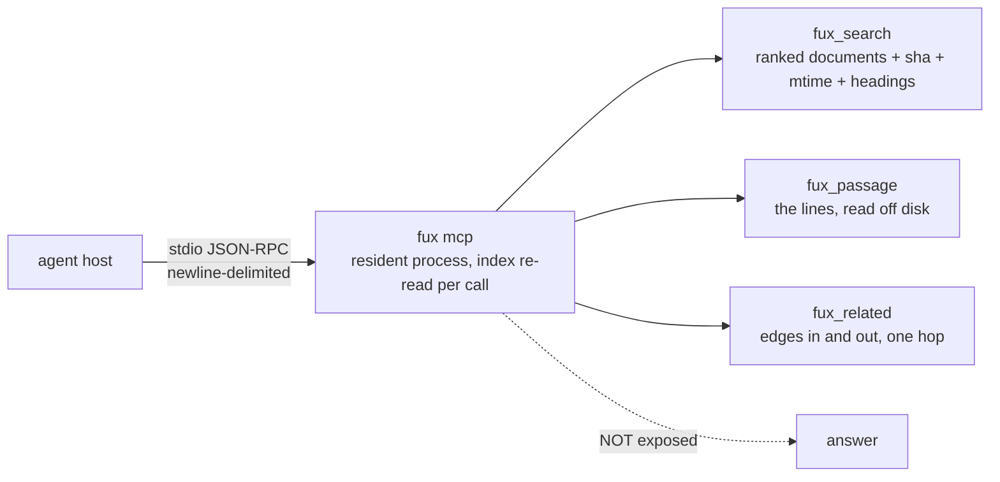

<!-- COMPONENTS-START — GENERATED from records/README.md's OWNERSHIP and DESCRIBES tables by scripts/gen-components.py. Do not edit by hand: change the table, then run `python scripts/gen-components.py --write`. -->

**Owns** — the components this record decides:

- [`node/src/verbs/mcp.mjs`](../node/src/verbs/mcp.mjs) · file
- [`src/fux/mcp.py`](../src/fux/mcp.py) · file

**Describes** — reaches into, does not own:

- [`node/mcp-tools.json`](../node/mcp-tools.json) · owned by [SR-NODE-SEARCH](0153_node-search.md)

<!-- COMPONENTS-END -->

# SR-MCP — the MCP server

## §1 — For humans

`fux mcp` hands the index to a coding agent over stdio JSON-RPC. **Three tools,
not the whole verb surface**, and one of the verbs is deliberately missing:
`answer`, because **the agent is the answerer**.

**Diagram — Mermaid and its ASCII twin. Update both, always, together.**



<details>
<summary><b>ASCII twin</b> — the same diagram, for terminals, diffs, and any reader without a Mermaid renderer</summary>

```text
   agent host
       |  stdio JSON-RPC, newline-delimited
       v
   fux mcp   (one resident process; the INDEX is re-read on every call)
       |
       +--> fux_search    ranked DOCUMENTS + sha + mtime + matching headings
       +--> fux_passage   the LINES, read off disk -- no fetch, no re-score
       +--> fux_related   edges in and out, ONE HOP -- no routes, no walk
       |
       X--- answer        deliberately NOT exposed: the agent is the answerer
```

</details>

### Examples

```console
$ fux mcp                      # stdio; a host spawns this, a human rarely does
```

A host's first three messages, and what comes back. Verbatim from a run against
the fixture repo; it predates the `headings` field and is annotated rather than
rewritten — read each row as also carrying `"headings":["Retry and backoff"]`,
or `"headings":[]`, **which is a real answer and not an omission**:

```json
{"jsonrpc":"2.0","id":1,"method":"initialize","params":{}}
-> {"protocolVersion":"2024-11-05","capabilities":{"tools":{}},
    "serverInfo":{"name":"fux","version":"1.0.0"}}

{"jsonrpc":"2.0","method":"notifications/initialized"}
-> (nothing — a notification has no id and MUST NOT be answered)

{"jsonrpc":"2.0","id":3,"method":"tools/call",
 "params":{"name":"fux_search","arguments":{"query":"retry payments","k":1}}}
-> {"results":[{"path":"docs/retry-policy.md",
                "title":"Retry policy for the payments service",
                "score":3.706,"sha":"f9421e0910df...","archived":false,
                "superseded":false,"mtime":1788330315}],
    "ranked_by":"accelerator"}

⚠ **`mtime` joined every row on 2026-09-13** (W-153,
[SR-API](0154_api.md) decision 7): the document's committed git timestamp in
whole unix seconds, so an agent can see how old a result is **without fetching
it**. Always present; **`null` is a claim** — this document carries no committed
date, which is every document of a corpus copied out of its repository.
```

---

## §2 — For agents

### Context

The consumer is an agent in a coding session, and **an agent calls a retrieval
tool many times per task.** Two facts set the design:

- **Process start-up dominates.** A CLI spawn costs ~50–150 ms of Python
  start-up *before any ranking happens*, against a warm p95 of 27 ms at 8 870
  documents and 64 ms at 10 000. **The interpreter is more expensive than the
  work.**
- **An agent acts on a citation by opening a file at a line**, which is why the
  citation format is `path:L12-L40` ([SR-ANSWER](0105_answer.md) decision 9).

### Decision

**1. stdio JSON-RPC, hand-rolled, no dependency.** MCP over stdio is
newline-delimited JSON-RPC 2.0 — `json` and `sys.stdin`. Adopting an SDK (and
its validation library behind it) to read a line and dump a dict would break
**L1 for convenience**, on the surface most exposed to churn. **L1 is held here,
not bracketed.**

**2. Three tools, not the whole verb surface.** `fux_search`, `fux_passage`,
`fux_related`. **The CLI's shape is for humans exploring; the tool surface is
for an agent with a task.** `explain` and `path` fold into `fux_related`,
because an agent asking *"what else was decided with this?"* does not care which
verb answers it.

**3. `answer` is NOT exposed.** **The agent *is* the answerer.** Handing it a
pre-composed answer throws away the reason it called a retrieval tool, and
invites it to relay prose it did not verify. `fux answer` remains on the CLI,
for humans.

**4. `fux_search` is document-level, deliberately.** Line ranges on the search
result itself would mean fetching and chunking **every hit on every search** —
**turning the cheap call into the expensive one** — so spans stay with
`fux_passage`, which is the call the agent was going to make anyway. **The index
knows documents; the refer plane knows spans.**

⚠ **`fux_passage` does not call the refer plane** (W-140 row 6, 2026-09-12). It
takes a `path` plus `line_start`/`line_end`, reads those lines **off disk**, and
returns them with a `sha` of the whole file — no fetch, no chunking, no
re-scoring. **The agent supplies the range**, from a citation it already has.
That is a smaller tool than *"the refer plane over MCP"* and the sentence above
reads like the larger one; it is stated here because an agent host wiring
`fux_passage` expecting freshness verification would get none.

**5. Every result carries the `sha` the ranking used.** An agent that reads a
file and gets a different hash knows the index is behind **without having to
trust it**. That is the whole premise of ranking from an index and fetching from
the owner, made checkable at the tool boundary.

**6. A tool failure is a result with `isError`, never a JSON-RPC error.** The
agent should see a tool that answered *"no"* — something it can act on — not a
transport fault, which it usually cannot. **A JSON-RPC error is reserved for an
actual protocol fault**: an unknown method, an unknown tool, unparseable input.

**7. `fux_passage` refuses to escape the repository.** `resolve()` collapses
`..` **before** the containment check, so a traversal cannot slip through by
being spelled differently.

**8. A notification is never answered.** `notifications/initialized` arrives on
every connection and carries no `id`. **Replying is a protocol error that some
hosts treat as fatal.**

**9. Every result carries the matching `headings`, always present.** The
document's committed `phrases` filtered to the ones the query asked about — best
first, at most three, `[]` when none match. (⚠ Until W-194 on 2026-09-20 an
empty list also meant the record was `meta: hashed` and carried no display text
at all, L5; there is no such record now.)

- **It is free here.** `_search` already reads the whole record for its `sha`,
  and `phrases` was extracted at ingest. The added cost is a set intersection
  per hit.
- **It is not a retreat from decision 4, and the distinction is the whole
  point: a heading is not a span.** There is no fetch, no chunking and no line
  arithmetic. What it buys is the decision an agent makes *before* it spends a
  `fux_passage` call: not only which document, but where in it.
- **`[]` is a real answer.** **An absent key is a trap, not a signal**: a host
  cannot distinguish *no heading matched* from *this server predates the field*.
- **It is the same selection `fux ask` renders, from the same function** —
  `query/headings.py::headings_for`, owned by [SR-ASK](0103_ask.md)
  decision 8. **Two implementations of one rule is where the CLI and the MCP
  payload drift apart.**

**10. `fux_search` carries a `confidence` block, and its tool description tells
the agent to read it first** ([SR-CONFIDENCE](0141_confidence.md)). An agent
handed a ranked list cannot otherwise tell *"these documents answer your
question"* from *"these are the closest things in a corpus that never discusses
it"* — **both arrive as a score, a title and a real citation.** The description
names the action per band rather than describing the field, because **a
description that explains a schema gets skimmed and one that says *do not answer
from these results* does not.**

**⚠ THE TOOL DESCRIPTIONS ARE GATED. Ruled by Arpit, 2026-08-27 (W-91 fork E).**

**These strings are the only documentation fux has whose reader is always a
machine, and they were the only documentation with no test.** An agent's entire
model of fux comes from `tools/list`; nothing checked it stayed true. That is
[W-84](../archive/open/W-84-heading-level-ask.md)'s finding, in the surface
where it costs most.

**It was not hypothetical.** `k` advertised a hand-written `"default": 5`, and
[SR-OUTPUT](0143_output-defaults.md)'s `[mcp] top` made the engine use whatever
the repo configured while the schema kept saying five. **It shipped wrong for
about an hour and nothing failed** — found by reviewing the surface fork E was
about, not by a gate. `k`'s property is now **computed from
`output_config.BUILT_IN`** and says out loud that a repo can change it.

`tests/test_mcp.py` now binds the prose to the code:

| assertion | what rots without it |
|---|---|
| advertised default == `BUILT_IN["top"]` | the number an agent plans around |
| every band named exists in `confidence.BANDS` | a branch on a value that can never appear |
| `answerable` · `band` · `missing` exist in the block | instructions to read fields that are gone |
| `[mcp]` has no `band` key | the description promises a block a config could remove |
| every tool has a handler, and back | a runtime error an agent finds by calling it |
| the surface is exactly three tools | a fourth arriving as a convenience rather than a decision |

**11. The tool descriptions are authored ONCE, in
[`node/mcp-tools.json`](../node/mcp-tools.json), and a test holds the Python
literal equal to it.** Added 2026-09-12, when the Node read plane made this
surface a two-runtime one ([SR-NODE-SEARCH](0153_node-search.md)).

**A description is not documentation — it is the input an agent reasons over**
to decide whether to call a tool. Two hand-maintained copies do not drift into
two wordings; they drift into **two products wearing one name**, and neither
side errors.

🔴 **They had already drifted, in the first week.** Measured 2026-09-12: the
Node side emitted `"default": "5"` — a **string** — on a property it declares
`"type": "integer"`, because `{{TOP}}` was substituted into serialized JSON
without regard for the quotes around it. Python emitted `5`. Found by writing
the equality check, not by a client complaining.

⚠ **`src/fux/mcp.py` does NOT read that file, and saying so was the first
version of this decision.** Making a core Python verb load its tool schema out
of the Node payload couples `fux mcp` to a directory that is only in the wheel
by `force-include` — a new way for `fux mcp` to fail, bought to remove a
duplication a test can remove instead. So: **one authored file, one
transcription, and `tests/test_mcp.py::test_the_node_tool_file_matches_the_python_literal`
is what makes the claim true.**

⚠ **What that leaves unguarded, stated rather than buried:** `node/` is
published to npm on its own, so a consumer can hold a `fux-engine` whose
descriptions never met the assertion. The **vendored** `.fux/node/` copy is
safe — `fux setup` writes it from the same tree that the test ran against — and
the npm copy is covered only by releasing from a green CI run. There is no
mechanism, only a release habit.

⚠ **No new tools.** The provenance plane (`--why`, `--receipt`, `verify`) stays
CLI-only: `--why` runs a **second query** when a tune file exists, so an MCP
tool would hide that cost from the caller, and verification's real consumers are
a human or CI — both of which have the CLI. **`answer` is already absent for a
reason of the same kind**: the agent is the answerer.

⚠ **`fux_search` gained an optional `expand` string on 2026-09-05** (W-109,
[SR-EXPAND](0149_expand.md)). It is the same slot as the CLI's `--expand`, at
the same weight, behind the same guard — a document matching only expansion
terms is dropped in `rank()`, so **an agent cannot talk fux into citing a
document that answers none of what was asked**, however confident its
expansion.

**The tool description carries the retry rule**, because this surface has no
flags and no `--help`: a search that comes back `partial` with a non-empty
`missing` is the signal to re-search with the vocabulary the corpus would use.
That sentence is the only place an MCP client learns the feature exists.

⚠ **`-q` is deliberately NOT on this surface.** A tool call is one call with
one `query`; a client that wants fusion makes two calls and fuses what it gets,
which it can do without fux's help. Adding an array parameter would put a
ranking decision inside a schema field.

**12. 🔴 The Node handlers read the argument names the schema advertises — and
did not, in a package already on npm.** Found 2026-09-12.

Decision 11 put the tool **descriptions** in one file both runtimes read, and
stopped there. The **handlers** were never compared, and they had diverged
completely:

| tool | advertised | what Node read | effect on a conformant client |
|---|---|---|---|
| `fux_passage` | `path`, `line_start`, `line_end` | `args.id` | empty result, reported as success |
| `fux_related` | `path` | `args.id` | empty result, reported as success |
| `fux_search` | — | — | five of nine keys; **no `confidence`**, no `ranked_by`, no `next` |

The third row is the serious one: `fux_search` losing `confidence` removed the
single key decision 10 exists for, from the one surface
[SR-CONFIDENCE](0141_confidence.md) decision 11 makes it unconditional on,
**because a tool call cannot pass a flag**.

Nothing could have caught it except comparing the two servers — each was
internally consistent, and a shared descriptions file says nothing about what a
handler reads. `tools/differential/node_arm.py::compare_mcp` now drives both
over one stdio session per arm run.

⚠ **`ranked_by` legitimately differs** and is excluded by name:
`mcp.py::_search` opts into the accelerator and Node has none
([SR-NODE-SEARCH](0153_node-search.md) decision 10). The differential law is
what makes the label the only difference.

**`fux_search` carries `related`, UNCONDITIONALLY** (W-161).

W-161's Tier B is returned on this surface with no flag to turn it off, for
[SR-CONFIDENCE](0141_confidence.md) decision 11's reason exactly: **a tool call
cannot pass a flag**, so an absent key could only ever mean *this server
predates the tier* — the W-48 trap. `[]` is what *no neighbours* looks like.

🔴 **An agent is the reader this tier was built for, and also the reader most
likely to misuse it.** It cannot run `fux graph` as a casual follow-up the way a
person can, and `next` has told it to *call `fux_related` for neighbours* since
the tool existed — so handing it the neighbourhood of this query's own answers
removes a round trip it was already instructed to make. **And a related
document is the most convincing shape a wrong answer has**: a real path, a real
sha, a real title, and not one word of the question in it. So:

- **its own key, never merged into `results`**;
- **`mass`, never `score`** — naming a walk statistic `score` would make every
  agent that sorts on `score` interleave the two lists, which is the one thing
  the split exists to prevent;
- **`route` on every row**, so the provenance is checkable rather than asserted;
- and the tool description and `next` both say, in words, that these are not
  matches and must be read with `fux_passage` before use.


### Consequences

- ⚠ **W-214 (2026-09-22) rewrote `fux_search`'s description and changed no
  decision here.** The tool text told an agent that `weak` meant `answerable:
  false` and to abstain; since Arpit's ruling
  ([SR-CONFIDENCE](0141_confidence.md) decision 3a) `weak` is a published
  signal and only `none` refuses, so the description says *read the near-tied
  candidates and judge*. **`node/mcp-tools.json` moved in the same commit** —
  the two halves of one product may not describe themselves differently to an
  agent, and `test_the_node_tool_file_matches_the_python_literal` is what makes
  that mechanical rather than remembered.

- 🔴 **`fux_related` is NOT a seeded walk, and W-160's gap-check row said it
  was** (2026-09-14). That row asked for it to be *"re-implemented over
  `graph --seed` (same output, one code path)"*, and the two halves are
  incompatible: `graph --seed` returns a **PPR neighbourhood** — ranked nodes
  with scores, including nodes two hops out this document never mentioned —
  while `fux_related` returns **the edges the document states**, both
  directions, with their kinds. Routing it through the walk would have changed
  what an agent gets while the row promised it would not. **The row is
  corrected here rather than executed.**

  **Its second half stands and is done**: the inbound scan used to re-derive
  adjacency with its own comprehension over every record — a third definition
  of *what points at this*, beside `graph/model.py::Graph` and the plane. Both
  readers now lift the same `Edge`s through `edges_from_records` and read
  `Graph`'s own adjacency. Output byte-identical; one definition.

  ⚠ **Built in memory, never loaded from `.fux/runtime/graph.json`.** MCP has to
  answer in a clone that has never run `fux build`, and `plane.load` refuses
  without a fresh one — the same asymmetry
  [SR-NODE-SEARCH](0153_node-search.md) decision 9 records one reader over.


- ✅ **The advertised `k` default is now the RESOLVED `[mcp] top`, closing a
  W-83-class defect.** `_tools(top)` is built once in `serve()` from the value
  [SR-OUTPUT](0143_output-defaults.md)'s chain resolved, replacing a
  module-level `TOOLS` list that read `output_config.BUILT_IN['top']`. **A repo
  setting `[mcp] top = 20` advertised `5` in its own tool schema** — an
  accepted decision whose code implemented a different one, in the one surface
  where the reader is always a machine and nothing would ever complain.
- ⚠ **The MCP surface is NOT reached by the 2026-08-28 `output.toml`
  regression.** `[mcp]` is read once at start-up inside `serve()`, not through
  `cli._apply_output_defaults`, so a missing file does not hard-fail the
  server the way it hard-fails `ask`/`find` (see
  [SR-CLI](0101_cli-surface.md) §Consequences). **That is luck of the code
  path, not a designed exemption**, and it should not be read as one.
- **`fux mcp` is a verb, not a flag.** It is a long-running server, not a query
  — [SR-CLI](0101_cli-surface.md) decision 1g.
- 🔴 **The server does NOT hold the index open, and this bullet said it did**
  (W-140 row 6, corrected 2026-09-12 by reading `mcp.py`). `serve()` reads
  `.fux/output.toml` once and then **re-reads the index on every call** —
  `_search` goes through `run_query(root, ...)` and `_related` through
  `read_index(root)`, both from the path, per request.
  - ⚠ **The consequence was stated BACKWARDS**, which is the part that could
    have cost an operator an afternoon: a rebuilt accelerator *is* picked up
    mid-session, because nothing is cached to go stale. The old sentence told
    them to restart a server that did not need restarting.
  - **What is actually resident is the PROCESS**, and that still buys the thing
    MCP wants: no interpreter start-up per tool call.
  - **Holding the index open is a real and unbuilt want** — it is the obvious
    next performance move and it brings the staleness problem this bullet
    described prematurely. It needs its own decision, and is not made here.
- **`--json` on the CLI and the MCP payload are two surfaces that can drift.**
  They are generated from the same result object, so drift requires someone to
  add a field to one on purpose. The payloads already differ in shape (`path` vs
  `loc`, a rounded score vs a full float) because they always have.
- ⚠ **The tool descriptions are documentation that no gate reads.**
  `fux_search`'s description once claimed *line-range citations* it has never
  returned — **the same wrong claim that had just been fixed in the human docs,
  surviving in the machine-facing copy.** That is worse, because **a human
  notices a doc that disagrees with the output in front of them and an agent
  does not**: reading no range, an agent concludes fux cannot do spans at all,
  when `fux_passage` is the tool that does.

  `tests/test_mcp.py::test_search_does_not_claim_line_ranges_it_never_returns`
  pins both halves — the string, and the fact that no result `path` carries a
  `:L` span. **That is a spot check, not a gate**: nothing checks the other two
  descriptions against what their handlers do. **Every gate in this repo checks
  that documentation is TRUE; none checks that it is COMPLETE**, and `TOOLS` is
  prose compiled into the package.

### Alternatives considered

- **A Python library API as the primary interface.** Real, and it is what the
  CLI and this server both already sit on. Rejected as the *primary* interface
  because **no agent host imports a Python module — they all speak MCP.** The
  library layer is what makes a future port thin.
- **An MCP SDK.** Rejected under decision 1.
- **Exposing every verb.** Rejected under decision 2. **A tool list is prompt
  context on every single request**; a long one, mostly never called, is a tax
  on every task the agent performs.
- **Line ranges on `fux_search`.** Rejected under decision 4: it makes the cheap
  call the expensive one, for information the agent's next call was going to
  fetch anyway.

### Reference (required)

- The server — [`src/fux/mcp.py`](../src/fux/mcp.py); its tests —
  [`tests/test_mcp.py`](../tests/test_mcp.py).
- Decision 9's selection, shared with the CLI —
  [`src/fux/query/headings.py`](../src/fux/query/headings.py); the argument
  for heading level over line level — [SR-ASK](0103_ask.md) decision 8.
- Decision 10's signals — [SR-CONFIDENCE](0141_confidence.md).
- The verb's shape on the CLI — [SR-CLI](0101_cli-surface.md) decision 1g.
- Model Context Protocol, the stdio transport this implements —
  <https://modelcontextprotocol.io/docs/concepts/transports>

### Veto condition

**Reopen this decision if** a major agent host drops MCP for a different tool
protocol — the library layer under this file is what makes that a thin port.

1. **A dependency appears in `src/fux/mcp.py`.** L1 is held here.
2. **`fux_answer` appears in the tool list.** Decision 3.
3. **A notification draws a reply**, or a tool failure is returned as a
   JSON-RPC error rather than `isError`. Both are protocol faults a host may
   treat as fatal.
4. **A tool description claims something its handler does not do.** The one
   pinned sentence is a spot check; a second such claim means the class was not
   fixed.

**How to check them:**

```bash
# 1 — stdlib only
grep -nE '^(import|from) ' src/fux/mcp.py
# expect: json, sys, pathlib, and fux's own modules. Nothing else.

# 2, 3, 4 — the tool list, the protocol rules, and the pinned description
pytest -q tests/test_mcp.py
```

---

## References

*Every source this record cites, gathered in one place. §2's **Reference
(required)** names the grounding; this is the complete list. An archived
document is never listed here — the body may name one, but archive is not
evidence.*

**Records** — [SR-LAWS](0001_LAWS.md) · [SR-CLI](0101_cli-surface.md) ·
[SR-ASK](0103_ask.md) · [SR-ANSWER](0105_answer.md) ·
[SR-REFER](0127_refer-plane.md) · [SR-CONFIDENCE](0141_confidence.md)

**Code**

- [`src/fux/mcp.py`](../src/fux/mcp.py)
- [`src/fux/query/headings.py`](../src/fux/query/headings.py)
- [`tests/test_mcp.py`](../tests/test_mcp.py)

**Papers and specifications**

- Model Context Protocol — the stdio transport this implements
  <https://modelcontextprotocol.io/docs/concepts/transports>
