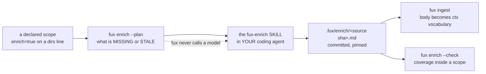

<!-- COMPONENTS-START — GENERATED from records/README.md's OWNERSHIP and DESCRIBES tables by scripts/gen-components.py. Do not edit by hand: change the table, then run `python scripts/gen-components.py --write`. -->

**Owns** — the components this record decides:

- [`src/fux/correct.py`](../src/fux/correct.py) · file
- [`src/fux/enrich.py`](../src/fux/enrich.py) · file
- [`src/fux/templates/agents/ENRICH-SKILL.md`](../src/fux/templates/agents/ENRICH-SKILL.md) · file

<!-- COMPONENTS-END -->

# SR-ENRICH — enrichment as an agent skill

> **This record decides how enrichment is generated and pinned.**
> **SR-ENRICHED** ratified the *contract* — pinned output, separate command,
> graded below deterministic signal — and explicitly did not authorise a build.
> It was **superseded by this record on 2026-08-27** (W-82 ruling 6) after that
> contract was folded in here verbatim; the archived copy at
> `archive/adr-old/0017_enriched-mode.md`
> may be named, never cited. **What this decides is who runs the model**, and the answer
> is: not fux.

## §1 — For humans

Enrichment adds vocabulary a document never literally uses, so a query for
*"idempotency circuit breaker"* reaches a document that discusses the idea
without those words. **Fux plans it and validates it; a coding agent writes it.**

**Diagram — Mermaid and its ASCII twin. Update both, always, together.**



<details>
<summary><b>ASCII twin</b> — the same diagram, for terminals, diffs, and any reader without a Mermaid renderer</summary>

```text
  a declared scope (enrich=true on a .fux/sources/dirs line)
        |
        v
  fux enrich --plan      what is MISSING or STALE, per document, by source sha
        |
        |  ... fux stops here. It never calls a model. ...
        v
  the `fux-enrich` SKILL, in YOUR coding agent
        |
        v
  .fux/enrich/<source sha>.md      committed, pinned, reviewable
        |
        +--> fux ingest       the BODY becomes ctx vocabulary
        +--> fux enrich --check   coverage inside a declared scope
```

</details>

### Examples

```console
$ fux enrich --plan
scope docs/adr (enrich=true)
  records/0111_ranking.md      sha 3f8a1c2d9b04…   9 chunks   MISSING
  records/0031_maintenance.md  sha 9b2e04f1a733…   6 chunks   STALE (was 7c1d4e02b918…)

-> 2 documents, 15 chunks
   write each to .fux/enrich/<sha>.md
   invoke the `fux-enrich` skill in your coding agent to generate them

$ fux enrich --check
enrichment: 1 scope(s) declared
  docs/adr                     41/41  ok
```

**The mechanism, demonstrated on the fixture repo:** a query for *"idempotency
circuit breaker"* — words appearing **only in the enrichment**, nowhere in the
document — returns the document. **Edit the document by one line and the same
query returns nothing**, because the enrichment no longer matches its sha.

---

## §2 — For agents

### Context

The ruling that shaped this:

> *"Enrich should work like a skill in the chat — that way we don't need to
> integrate the API in the code and AI coding agents can be used."*

### Decision

**1. Fux does not call a model. L1 and L4 are HELD, not bracketed.** This is
[SR-FETCHER](0117_fetcher.md)'s pattern applied to a second boundary:

| fux refuses to own | the consumer owns it as |
|---|---|
| network I/O | `.fux/fetchers/http.py` — their code, loaded by path, never rewritten |
| **model calls** | **`.claude/skills/fux-enrich/SKILL.md` — their agent, invoked by them** |

Nothing in `src/fux/enrich.py` imports an SDK, opens a socket or holds a key.
Fux's networked paths stay exactly two. **The `$0` law survives**: the
developer's existing agent subscription pays.

**2. There is no `--model` flag**, because there is no networked path to fence.
`--plan` and `--check` are the whole verb.

**3. Fux VERIFIES `source_sha` and merely RECORDS `model`.** A sha mismatch
means stale, computed and checked. `model:` is a **claim** an agent is asked to
stamp and that nothing here can confirm. ⚠ **That asymmetry is the honest cost
of decision 1**: provenance downgrades from *measured* to *declared*, mitigated
by shape validation and by the fact that enrichment lands as a reviewable diff.

**4. Scope is DECLARED — `enrich=true` on a `.fux/sources/dirs` line.** The same
closed-attribute grammar as `archived`, for the same reason: **a path heuristic
is exact for the repo that invented it and a silent convention for everyone
else.** Enrichment costs money and changes ranking, so which directories get it
is a human decision written in a diffable line.

**5. Partial coverage is the STEADY STATE, not a degraded mode.** Enrichment is
keyed by the source content sha, so **editing a document un-enriches it
automatically.** One commit after a full pass and a 411-document corpus is at
408. **Any design that only works at 100 % coverage is broken on day two.** So:

- **partial across the corpus** = intended, declared, not a defect;
- **partial inside a declared scope** = a defect, and what `--check` reports.

**6. The tilt is real, and it is why decision 5 matters.** An enriched document
can match queries an un-enriched one cannot, **so a half-enriched scope tilts
ranking toward whichever half was finished.** `ctx` is a weighted field with its
own tune key *conditional on the tilt being small* — which is a measurement, not
an opinion.

**7. Orphaned enrichment is never auto-deleted.** A reverted document recovers
its enrichment for free, because the old sha comes back and the file is still
there. `prune()` exists and is explicit.

**8. Frontmatter is stripped before indexing.** Only the body becomes `ctx`
vocabulary. Indexing the block would put a model name and a date into the
document's searchable terms **and let it match a query for its own metadata.**

**9. A malformed enrichment is IGNORED, not indexed.** ⚠ **The failure mode of
trusting it is silent**: whatever text is in the file becomes searchable
vocabulary attributed to that document.

**10. `fux-enrich` is INVOKED, never ambient.** **An ambient skill that writes
into a committed directory and changes ranking is a different risk class**, so
it ships only where invocation is explicit, and its description names trigger
phrases rather than a topic.

✅ **AMENDED 2026-09-06 (Arpit): extended to every skill surface.**
`ENRICH-SKILL.md` now ships to `.claude/skills`, `.kiro/skills`,
`.codex/skills` and `.github/skills`, and to **no** ambient rendering.
⚠ *Since 2026-09-12 the last two are one directory, `.agents/skills`, shared by
Codex and Copilot ([SR-AGENT-POLICY](0132_agent-policy.md) decision 16). The
rule is untouched: every destination is still a skill surface.*

**The paragraph this replaces had already convicted itself**, and it is worth
keeping in view rather than deleting:

> *"It ships to Claude alone today, and the reasoning that admits a Kiro skill
> elsewhere would admit one here… This one has not been extended, and the gap
> is stated rather than left to be discovered as an inconsistency."*

🔴 **Stating a gap is not closing it, and this is the measured cost of the
difference.** The exception outlived its argument by weeks, in a record that
named it, next to `fux-decoder` — **the same sentence, the same risk class** —
which shipped to three surfaces while this shipped to one. Nothing failed,
because **an omission has no test.** What closes it is
`test_no_committed_write_skill_reaches_an_ambient_surface`, which asserts the
rule over *both* templates, and
`test_the_two_rosters_differ_only_where_a_record_says_so`, which makes any
remaining difference between them a **recorded exception or a red suite**.

⚠ **The rule did not change and must not be misread as loosened.** It is
**never ambient** — it was never *claude only*. Every destination above is
progressive-disclosure; Copilot's `instructions/` (`applyTo: "**"`) and Kiro's
`steering/` (`inclusion: always`) remain refused, and adding either is
[SR-AGENT-POLICY](0132_agent-policy.md) veto 5b.

⚠ **One asymmetry survives, deliberately and on the record**: `fux-enrich`
reaches `.github/skills/` and `fux-decoder` does not, because the ruling named
`fux-enrich`. Both are legal under the rule; only one was asked for. The second
test above holds that exception explicitly so it cannot go quiet the way this
one did. ⚠ *Closed 2026-09-11 by [SR-AGENT-POLICY](0132_agent-policy.md)
decision 14a — all three skills reach every skill surface, held by
`test_the_three_rosters_no_longer_differ_at_all`.*

**11. `--plan` prints the FULL sha.** ⚠ It once printed a 12-character prefix
while the validator used the whole thing — and since decision 3 makes
`source_sha` the one field fux *verifies*, and the skill instructs an agent to
copy the plan's value into it, **every enrichment written by correctly following
the skill came back `STALE`**, rendering as:

```
docs/adr-0007-helix-mesh.md  sha c84a92145ee9  7 chunks  STALE (was c84a92145ee9)
```

**— the one line whose job is to show a difference, showing two identical
strings.** The rule this leaves behind is general: **never abbreviate a value in
the message that exists to explain why two values disagree**, and never print a
shortened form of an identifier the reader is being told to copy.

**12. The enrichment body is inside the redaction boundary, on both of the
surfaces it reaches** (W-102, 2026-09-01). An enrichment body is committed
**and** indexed, so a value written into one travels twice, and
[SR-PII](0148_pii.md) decision 1 covers both. The two halves are handled
differently on purpose:

- **`run.py` redacts the body before it becomes `ctx`.** ⚠ **This was the real
  defect and it was not the one anybody had written down.** The redact phase
  walks `parsed`, which holds document *bodies*; `_enrichment_for()` reads the
  enrichment file further down and handed its text straight to
  `extract_fields`. An email address in enrichment prose therefore became a
  **committed index term**, on a document whose own body had been redacted, one
  screen below a comment stating that everything downstream was built from
  redacted text. Redaction now happens in `_enrichment_for`, and the phase
  comment says why it cannot be in the phase named after it.
- **`fux enrich --check` refuses and never rewrites.** The file is prose a
  human reviews in a diff; a silent rewrite would make that diff lie. Same
  discipline as `fux doctor` reporting a lock it will not clear
  ([SR-MAINTENANCE](0129_hooks.md) veto 7), and stronger here for that reason.
  🔴 **Redaction is also the wrong remedy at this surface**: a redacted
  enrichment body indexes `[PII:email]` as vocabulary, which is worse than
  useless. The refusal names the rule that fired, per
  [SR-PII](0148_pii.md) decision 7, and says to rewrite the sentence instead.
- **The frontmatter is deliberately excluded.** It is stripped before indexing
  (decision 8), so nothing in it reaches a committed term; running rules over a
  `model:` value would refuse a file for text the index never sees.
- ⚠ **No sha is recomputed.** The enrichment file's name and `source_sha:` are
  the *source document's* sha over raw bytes, and SR-PII decision 3's ordering
  hazard applies here verbatim — a sha over redacted text would report every
  enriched document `stale` against its own unchanged source.
- **Landing this re-ingests any repo with both enrichment and a firing rule**,
  and `runtime/pii-digest` does not cover it: the ruleset did not move, its
  *reach* did. That is a one-off cost of the fix, not a new invalidation rule.

**13. `--plan` and `--check` take an optional `TARGET`, and the skill runs them
itself** (W-104, Arpit 2026-09-01). One `loc` or one URL, matched **exactly** —
not a prefix and not a glob, because a selector that silently matches two
documents turns a one-document request into a bulk run.

- 🔴 **It filters the report; it never widens scope.** A document no
  `enrich=true` line reaches is not in the plan, and naming it says which of
  two things is wrong — *not declared* (a human's edit to a source list) or
  *not indexed* (`fux ingest`) — rather than enriching it. Decision 4 is
  untouched: which directories are enriched stays a declaration.
- **`n/total` stays the whole scope under a selector.** A single-target run
  must never render as `n/n`; that is the line the skill reads to decide a
  scope is finished.
- **Single-target runs are legitimate because of decision 5.** Partial coverage
  is the steady state, so leaving a scope at `40/41` on purpose is a requested
  outcome rather than the tilt decision 6 warns about — and the skill says
  which of the two it is doing each time.
- **The skill plans internally, and asks before bulk.** Step 1 was written as a
  command a human had already run. It is now the agent's first action, and a
  plan of more than one document that was not explicitly asked for as a scope
  is a **question the skill stops on** — safe only because the skill is invoked
  and never ambient (decision 10).
- **It re-plans immediately before writing.** Between reading a document and
  saving an enrichment there is a window in which the document can move, and an
  enrichment written under a superseded sha is **invisible rather than wrong**:
  fux does not find it and nothing reports an error. ⚠ **This is the whole of
  the gap** — no second hash, no `doc_hash` field, no sidecar digest. Decision
  3's sha-keying is the staleness mechanism, and a second one could only drift
  against it.

### The `enriched` mode — folded verbatim from SR-ENRICHED, 2026-08-27

**14. `--plan` and `--check` spell every path the way the worklist does** —
`.fux/enrich/<sha>.md`, forward slashes, on every platform.

🔴 **They did not, and it took a Windows runner to say so.** The worklist built
its target from `ENRICH_DIR`, a literal; `malformed:` and `refused:` came from
`str(path.relative_to(root))`, which is `\` on Windows. **One run named the
same file two different ways**, so a consumer grepping their own log for a path
found half of it. `_shown()` is now the single spelling and it is display only —
nothing opens a file by that string.

⚠ **Worth knowing beyond this record**: the defect existed for `malformed:`
before W-102 added `refused:` beside it, and **no reviewer on a POSIX box could
have seen it** — `str(Path)` and `as_posix()` are the same string there. The
test added for it asserts *the separator and the prefix* rather than comparing
to a constant, so it fails on Linux too if the two ever diverge again.
Enterprise realities are design inputs (CLAUDE.md), and Windows-first fleets
are the first one named.

⚠ **This section is SR-ENRICHED's ratified content, moved here UNCHANGED**
under W-82 ruling 6 (*"ENRICH supersedes ENRICHED"*). It was folded **before**
that record was archived, deliberately: archiving first would have made every
sentence below uncitable, and §1's calls rest on them. Its numbering is the
numbering it had there, so a citation of *"SR-ENRICHED decision 4"* still
resolves to the same words.

⚠ **`enriched` and `fux enrich` are two different things and this is the trap.**
`fux enrich` — the rest of this record — pins text a coding agent wrote, and the
committed record stays `"mode": "extracted"`, **correctly**: a pinned file is
bytes fux read, not something fux inferred. The `enriched` MODE below is a
second value of a record's `mode` property and **is still not authorized to be
built.** The name similarity is the trap; **the `mode` value on disk is the
truth.**

⚠ **[SR-EXTRACTED](0115_extracted-mode.md) lost its counterpart record**, so
the two-mode taxonomy now lives here and SR-EXTRACTED's citations resolve to
this section.

**1. The model-assisted ingest mode is named `enriched`**, ratified together
with [SR-EXTRACTED](0115_extracted-mode.md); the pair was one call.

**2. Enrichment never runs inside the maintenance path.** It is a separate
command or agent skill, invoked deliberately. `fux ingest` gains no model call,
no network path, and no `--enrich` flag — not as a convenience, not behind a
default-off toggle. **L3 is preserved by construction, not by discipline.**

**3. Output is pinned, then ingested like any other committed content.** The
enrichment step writes a committed artifact with provenance — what produced it,
from which document at which `sha`, when. Ingest reads that artifact
deterministically. **Nothing is regenerated on a query path, ever.**

**4. Enriched signal is graded below deterministic signal** wherever the two
compete, reusing the ported `EXTRACTED` > `INFERRED` edge-grade ordering rather
than inventing a second scale.

**5. Enriched output stays statistic-shaped.** Terms, phrases, edges, flags —
the things the index already holds. **Prose summaries are excluded**: a
paragraph of model-written prose in the committed index is durable content in
every sense that matters to L2, whatever the technicality. If summaries are ever
wanted, they go through the existing per-source snapshot policy as an explicit,
visible exception — never silently as a side effect of enrichment.

**6. Accepting this record does not authorize the work.** It ratifies the name,
the boundary and the shape — nothing more. **The gate is one SR plus Arpit's
sign-off; the SR half is this record, and the sign-off half has not been
given.**

**15. The body is QUESTIONS, not prose — doc2query, and the skill is the
product.** Five to ten questions a searcher would type before they knew the
document existed, one per line, and nothing else in the body.

**Prose was measured and did not pay.** A blind enrichment run scored **+1
fixed / −1 broken** — no net gain — and the query it broke was broken by
*context prose that carried currency words into a superseded record*. That is
not a fixable style of prose; it is what prose is. A question is a narrower
object: a retrieval claim about **one** document, which `fux enrich --check`
can put to the index and test.

🔴 **This decision is BUILT AND UNPROVEN, and that is the whole of its
evidential standing.** It ships on the argument above — prose measured no net
gain, and a question is checkable where prose is not — **not** on a gate it
cleared. The four-arm run
([`2026-09-05-doc2query`](../work/regression/2026-09-05-doc2query/report.md))
was voided on Arpit's ruling of 2026-09-06
([`W110-DOC2QUERY`](../work/regression/2026-09-05-doc2query/VERDICT.md)):
its bar said *net ≥ 6 on `recall@k`* and **never named `k`**, so it ruled
neither way ([SR-WORK-QUALITY](0056_WORK-quality.md) decision 2a).

**What that run does support, and it is not nothing:** the `placebo` arm —
matched length, file count, frontmatter and vocabulary pool — moved **0
queries at every `k`**, so whatever the `real` arm gained is **the content of
the questions**, not more bytes or more files; and across four arms **no query
regressed**. ⚠ **Do not cite `net +7 at recall@1` as a pass.** It is one
reading of a bar that had four, and the verdict says so.

**16. `--check` refuses a question that does not retrieve its own document in
the top `SELF_RETRIEVAL_K = 3`** (ratified by Arpit, 2026-09-05). doc2query−−
(arXiv 2301.03266) filters generated questions with a separate relevance
model; fux uses **its own index**, which is cheaper and more honest — the thing
being predicted is exactly what fux will do.

🔴 **Scored with `title` AND `ctx` zeroed**, and each is load-bearing:

- `title` — a question echoing the heading retrieves the document trivially, so
  a title match would pass every lazy question and the filter would grade
  nothing.
- `ctx` — **enrichment text is indexed as `ctx`**, so once a file has been
  ingested its own questions retrieve their own document *through themselves*.
  Without this the filter passes on the second run what it failed on the first:
  a check whose answer depends on whether it has been run before.

⚠ **The filter is corpus-dependent, and `--check` REPORTS.** A question that
passes today can be refused after an unrelated ingest moves `df`. Nothing here
rewrites a file, deletes one, or stops it being committed — the file stays, and
a human decides.

⚠ **A prose body written before this decision stays valid.** The filter checks
lines that end in `?`; a body with none has nothing to check. No existing
enrichment is invalidated by this record.

⚠ **The filter's own value is UNPROVEN, on the same run.** It refused **2 of
98** questions and moved **no** recall number at any `k` — a **2 %** treatment,
too small to see. *Did not hurt* is the honest statement; *works* is not
available yet.

**17. `superseded_by:` in an enrichment's frontmatter retires its document, and
it is the ONE key here that reaches the ranking.** Everything else in that
block is provenance for a human and for `--check`.

**It exists because `supersedes:` cannot cover this case.** That key is written
by the *successor*, and a document retired years ago could not name a successor
that did not exist when it was written. An enrichment file is written later, so
it can — and this is the *declared* path the second-author analysis named and
nobody had built.

**Declared, never inferred**, with `priors.superseded_ids`' three rules: the
named successor must exist in the corpus, it may not be the document itself,
and a **malformed enrichment retires nothing** — a file fux would not index
must not be able to move a ranking either.

**18. 🔴 Extraction reuse is keyed on the enrichment's CONTENT, per document.**

⚠ **It was not, and enrichment silently did nothing on the common path.** Reuse
was keyed on the *document's* content sha alone (decision 15), so a newly
written `.fux/enrich/` file changed no index byte until the document itself
changed or `--full` ran. `fux enrich --check` reported `ok`, the file was
committed and reviewed, and its vocabulary never reached `.fux/index/`. **It
presented as a working feature**, which is why it survived from W-76 Phase 8
until W-110 found it while testing something else.

Per document, not corpus-wide like the `pii.toml` digest, because enrichment is
per document: one rewritten file re-extracts one document. The state
(`runtime/enrich-digests.json`) is **derived and gitignored**, rebuilt by being
wrong once. **A deleted enrichment invalidates too** — a reuse keyed on
presence would leave the terms in the index with nothing on disk explaining
them.

### The candidate enrichments, and why each needs a model

Recorded so a build designs against a list rather than a mood. **None is
approved.**

| candidate | what deterministic extraction cannot do | risk |
|---|---|---|
| **semantic term expansion** | the analyzer sees only literal page vocabulary — a query for "OOM" never reaches a doc that says "memory exhaustion" | dilutes `df`; needs a graded, separable term set or it contaminates the statistics every document is scored against |
| **inferred edges** | links two documents mean to have but never wrote — "this design implements that decision", with no hyperlink | must carry `INFERRED`; **a wrong edge is worse than a missing one because it is invisible** |
| **retirement / supersession flags** | nothing in the bytes distinguishes a live document from a retired one | if it reorders rather than annotates, it violates the ruling [SR-ARCHIVED-CONTENT](0134_archived-content.md) already reached |
| **richer embeddings** | fux computes no vectors at all ([SR-ASK](0103_ask.md) decision 9) | **L1 collision** — a larger or API-served model may be *called once and pinned*, never imported into the runtime |

### The candidate enrichments, and why each needs a model

Recorded so a build designs against a list rather than a mood. **None is
approved.**

| candidate | what deterministic extraction cannot do | risk |
|---|---|---|
| **semantic term expansion** | the analyzer sees only literal page vocabulary — a query for "OOM" never reaches a doc that says "memory exhaustion" | dilutes `df`; needs a graded, separable term set or it contaminates the statistics every document is scored against |
| **inferred edges** | links two documents mean to have but never wrote — "this design implements that decision", with no hyperlink | must carry `INFERRED`; **a wrong edge is worse than a missing one because it is invisible** |
| **retirement / supersession flags** | nothing in the bytes distinguishes a live document from a retired one | if it reorders rather than annotates, it violates the ruling [SR-ARCHIVED-CONTENT](0134_archived-content.md) already reached |
| **richer embeddings** | fux computes no vectors at all ([SR-ASK](0103_ask.md) decision 9) | **L1 collision** — a larger or API-served model may be *called once and pinned*, never imported into the runtime |

⚠ **Import path moved 2026-08-27, behaviour unchanged.** ``src/fux/enrich.py`` now imports
`chunk` from **`fux.refer._chunk`**: the module was made private because
`fux.refer` re-exported the `chunk` *function* over its own submodule of that
name, a shape that had already cost four defects and silently narrowed L4's
network import fence. The function, its signature and its output are untouched —
see [SR-REFER](0127_refer-plane.md) decision 18 and
[`tests/test_no_shadowed_submodules.py`](../tests/test_no_shadowed_submodules.py).

**11. A `url:` document is enrichable, under one synthetic scope**
([SR-PII](0148_pii.md), 2026-09-01). `enrich=` joins the URL list's attribute
set and resolves through the same three layers as `keep` and `ttl`; every URL
that opts in reports under a single scope named `.fux/sources/urls`.

- **One scope, not one per host.** A `dirs` scope is a path prefix, which is a
  grouping a human actually chose. A URL list has no such structure — its lines
  share nothing but being URLs — so per-host scopes would report coverage
  against a grouping nobody declared. Decision 4's *declared, never derived*
  applied to the scope itself.
- ⚠ **This could not exist before `.fux/acquired/`.** Planning needs the
  document's text, and for a URL that meant a network fetch **inside
  `fux enrich --plan`** — an offline, read-only command (L4). The retained
  bytes are what make the text local, so `_document_text` reads the blob and
  decodes it with ingest's own `_decode_fetched` rather than fetching anything.
- **`keep=true` is the default, so this works unconfigured.** A line that opted
  out with `keep=false` has nothing to read: it reports **zero chunks**, and
  `--plan` names that rather than hiding it — the same treatment an unreadable
  `file:` document gets.

**A URL's enrichment is committed and indexed like any other**, so decision 12
covers it unchanged: the body is redacted before it becomes `ctx`, and
`fux enrich --check` refuses a file whose body matches a `.fux/pii.toml` rule.
There is nothing URL-specific about that boundary and this section states none.

**19. 🔴 `fux correct` writes a HUMAN question onto the same file, in the same
field, with different rules.** (W-162, accepted by Arpit 2026-09-13 —
[the compare doc](../work/compare/fux-correct.compare.md).)

A correction is **the eleventh line, in a human's handwriting** — the question
that actually failed, which is the highest-value question the file can hold. It
is [doc2query](https://arxiv.org/abs/1904.08375)'s deterministic cousin, which
is what decision 15 already does; **no new directory, no new field, no new
ranking code.**

- **`fux correct "<question>" <doc>`** appends the question as a plain body line
  and bumps **`corrections: N` in the frontmatter**, which says *the last N body
  lines are human*.
  ⚠ **The marker is in the half that is never indexed and the text is in the
  half that is**, and that split is forced by decision 8: the frontmatter is
  stripped before indexing, so a marker there adds no vocabulary while a marker
  in the body would.
- **`.fux/eval/corrections.tsv` is the durable record, not the marker.** A
  regenerating agent rewrites the whole file, frontmatter included, so the
  marker cannot survive on its own. The eval file is committed, sorted, and is
  **the human's own claim rather than a record of use** (L8): a row says *this
  question should reach this document*, never that anybody ran a query.
- **`--check` REPORTS a human line and never refuses it.** A correction is by
  definition a question that failed retrieval — that is the case it exists for —
  so a file whose only failures are human lines stays `ok` and stays indexed.
  Refusing it would delete the correction's effect as the price of telling you
  about it. Decision 16 is unchanged for model lines.
  🔴 **And every human line is checked whatever its punctuation.**
  `is_question` is a line ending in `?`; a correction files *the words people
  search with*, which need not be a question — so `fux correct "calder rollback
  procedure" <doc>` **escaped the check entirely** until the human set was
  unioned in. Found by filing one and watching `--check` call the file `ok`
  while the line retrieved nothing.
- **A negative correction is refused**, with the pointer. *"Don't serve X"* is a
  supersession or an archive decision and it is **corpus-wide**: `supersedes`,
  `superseded_by:`, or `archived=`. A per-query demotion is the rule that rots
  silently — it keeps working long after its reason is gone and nothing says so.
- **PII refuses rather than redacts**, exactly as decision 12 does for a body: a
  redacted question indexes `[PII:email]` as vocabulary and retrieves nothing,
  so redaction is not the remedy. Only a person can write the question without
  the value.
- **No wall clock.** `generated:` on a file this verb creates is derived from
  the document's own committed `mtime`, so two runs a week apart on an unchanged
  document write identical bytes. `model:` reads `none (human correction)`,
  which is the honest claim for a line a person typed.
- 🔴 **Every refusal happens before any write.** The first cut decided the eval
  row after writing the enrichment file, so a refused command printed
  `wrote .fux/enrich/<sha>.md` and *then* `error:` — exiting 1 having already
  changed the repository. Caught by running the suspended-pin path.
- **`ctx`'s weight is NOT raised.** A correction bites because `ctx` is already
  indexed and already weighted. Raising it so corrections bite harder is a
  ranking change and owes [SR-RS](0133_predictions.md) decision 19's paired
  floor, not a sentence in this record.

**19a. `--pin` is the editorial escape hatch, and it is deliberately brittle.**

`fux correct --pin` forces one document to #1 for **one exact question**,
matched on the **analyzed** form so capitalisation and plurals do not defeat it.
Solr's `QueryElevationComponent` is the precedent.

- **Applied after the ranking and after the reranker.** `rank()` never sees it,
  so `--why` still describes the ranking that actually ran and a reader sees the
  pin sitting *on top of* it. A pin folded into the score would make the ranking
  unreadable for exactly the query somebody had to intervene on.
- **A pinned document the ranking never returned is INSERTED, with `score`
  `0.0`** — the honest number, because the ranking never scored it. That is the
  case a pin exists for.
- **The confidence block is built from the pinned list**, because the band
  describes the answer the reader was shown: a pinned #1 the corpus barely
  supports must still say `weak`.
- **A pin whose document's content sha has moved is SUSPENDED**, and **a plain
  re-run of `fux correct` does not release it** — `--reaffirm` does, and it is a
  person saying *still true*. `fux doctor`'s `correction pins` row names every
  suspended pin, because a suspended pin is silent at query time and that
  silence is correct in the moment and wrong over months.
- **The vocabulary effect never suspends.** The question is still the question
  somebody asks, whatever happened to the document.
- **Both readers apply it.** `fux correct` is Python-only (this reader never
  writes), but the *effect* crosses: `node/src/correct.mjs` reads the same file
  and applies the same rule, or one repository answers two ways.

**19b. `--why` says WHO wrote the `ctx` occurrence of a term** — `human`,
`model`, `both`, or `unattributed`. The index cannot answer this and is not
asked to: `ctx` is one field and a count says nothing about which line produced
it. The answer comes from re-reading the enrichment file and analyzing its two
halves — deterministic, offline, one file read per **shown** document. *"A model
guessed you might ask this"* and *"a colleague said so"* are different answers,
and `--why` exists to tell them apart.

### Consequences

- **L3 is restated, not weakened:** the index is a deterministic function of
  **(sources ∪ pinned enrichment)**. Same property, wider input. **Every clone
  has the same enrichment files, so every clone builds the same index.**
- **Generation is not reproducible and the record says so.** Two developers
  running the skill on one document get different prose; first to commit wins.
- **No batch loop.** One agent session grinding thousands of chunks drifts and
  half-finishes, which is why the skill works scope by scope and `--plan` is
  resumable.
- **`ENRICH-SKILL.md` is exempt from the policy-agreement check.** It is a
  **procedure**, not a rendering of the archived-results policy, and the
  exemption set is pinned by its own test so the check cannot be quietly
  widened ([SR-AGENT-POLICY](0132_agent-policy.md) decision 2a).
- ⚠ **Who may *author* an enrichment, when it is being MEASURED, is not this
  record's rule.** `fux enrich` cannot enforce authorship — **fux never calls a
  model, so the author is outside the program** — which makes it a
  **measurement-protocol** rule, living in [SR-RS](0133_predictions.md)
  decisions 11–15. Nothing changes about *generating* enrichment; what changes
  is that **a run which measures it declares whether the author could reach the
  evaluation queries**, and an informed run never supplies a delta. **That is a
  restriction on what a number may claim, not on the enrichment.**

### Alternatives considered

- **An SDK call inside `fux enrich`.** Rejected: it would break L1 and L4, put a
  key and a bill inside fux, and pin a vendor.
- **Deriving scope from the filesystem.** Rejected under decision 4.
- **Auto-pruning orphans.** Rejected under decision 7.
- **Trusting a malformed enrichment and indexing what is there.** Rejected under
  decision 9 — the failure is silent and attributes invented vocabulary to a
  real document.
- **Shipping the skill to an ambient surface.** Rejected under decision 10.

### Reference (required)

- The deterministic halves — [`src/fux/enrich.py`](../src/fux/enrich.py);
  the generation half —
  [`src/fux/templates/agents/ENRICH-SKILL.md`](../src/fux/templates/agents/ENRICH-SKILL.md);
  the tests — [`tests/test_enrich.py`](../tests/test_enrich.py).
- The contract this inherits — SR-ENRICHED; the scope
  grammar — [SR-DIR-LIST](0120_dir-list.md); the field it feeds —
  [SR-RANKING](0111_ranking.md) decision 1.
- The authorship rule that governs *measuring* enrichment —
  [SR-RS](0133_predictions.md) decisions 11–15.

### Veto condition

**Reopen this decision if any of these becomes true:**

1. **A network call or a model SDK appears under `src/fux/`.** Decision 1 is the
   whole record.
2. **`fux enrich` grows a `--model` flag.** Decision 2.
3. **`fux-enrich` ships in an ambient rendering.** Decision 10.
4. **A malformed or sha-mismatched enrichment reaches `terms`.** Decision 9.

**How to check them:**

```bash
# 1 — no SDK, no socket, no key
grep -nE '^(import|from) (anthropic|openai|httpx|requests)' -r src/fux/
# expect: nothing
grep -n 'model' src/fux/enrich.py
# expect: only the frontmatter KEY, never a call

# 3 — the skill ships to skill surfaces only
grep -n 'ENRICH-SKILL' src/fux/setup.py
# expect: under `.claude/skills/` (and `.kiro/skills/` if decision 10's gap closes)

# 2, 4 — the flag that must not exist, and the two ignore paths
pytest -q tests/test_enrich.py
```

---

## References

*Every source this record cites, gathered in one place. §2's **Reference
(required)** names the grounding; this is the complete list. An archived
document is never listed here — the body may name one, but archive is not
evidence.*

**Records** — [SR-LAWS](0001_LAWS.md) · [SR-RANKING](0111_ranking.md) ·
SR-ENRICHED · [SR-FETCHER](0117_fetcher.md) ·
[SR-DIR-LIST](0120_dir-list.md) · [SR-AGENT-POLICY](0132_agent-policy.md) ·
[SR-RS](0133_predictions.md) · [SR-TUNE](0135_tuning.md)

**Code**

- [`src/fux/enrich.py`](../src/fux/enrich.py)
- [`src/fux/setup.py`](../src/fux/setup.py)
- [`src/fux/templates/agents/ENRICH-SKILL.md`](../src/fux/templates/agents/ENRICH-SKILL.md)
- [`tests/test_enrich.py`](../tests/test_enrich.py)

**Project docs**

- [`work/IMPLEMENTATION.md`](../work/IMPLEMENTATION.md)
