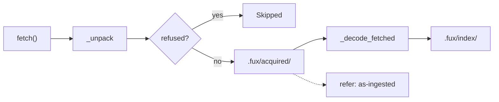

<!-- COMPONENTS-START — GENERATED from records/README.md's OWNERSHIP and DESCRIBES tables by scripts/gen-components.py. Do not edit by hand: change the table, then run `python scripts/gen-components.py --write`. -->

**Owns** — the components this record decides:

- [`src/fux/store/acquired.py`](../src/fux/store/acquired.py) · file

**Describes** — reaches into, does not own:

- [`src/fux/config.py`](../src/fux/config.py) · owned by [SR-CONFIG](0113_config.md)
- [`src/fux/ingest/sourcelist.py`](../src/fux/ingest/sourcelist.py) · owned by [SR-URL-LIST](0116_url-list.md)
- [`src/fux/ingest/urlsrc.py`](../src/fux/ingest/urlsrc.py) · owned by [SR-FETCHER](0117_fetcher.md)
- [`src/fux/store/fuxdir.py`](../src/fux/store/fuxdir.py) · owned by [SR-DOTFUX](0102_fux-directory.md)

<!-- COMPONENTS-END -->

# SR-ACQUIRED: fetched bytes are kept, in a plane that is neither committed nor derived

## §1 — For humans

Ingest fetches a URL, decodes the bytes, keeps the markdown and drops the bytes. Nothing retains the file the record was built from. ARC is in memory and dies with the process; `runtime/fetch-cache/` is a 300-second throttle guard that expires by design. So a `url:` record can only ever be checked against a *fresh fetch* — which needs the network, the session, and the source still existing.

`.fux/acquired/` keeps those bytes. A citation becomes checkable against the exact input that produced it, a decoder change can be replayed without a network round trip, and a failed verify stops meaning *"we know nothing"*.

It is a new category rather than a subdirectory of `runtime/` because of one property: **it is not rebuildable.** `runtime/` is defined by being reconstructible from committed bytes by `fux build`. An acquired blob can only be re-*acquired*, and only while the source still exists and the browser session still holds. Gitignored, like derived. Recoverable, unlike derived.



<details>
<summary><b>ASCII twin</b> — the same diagram, for terminals, diffs, and any reader without a Mermaid renderer</summary>

```text
  +---------+    +----------+    +----------+  no   +------------+    +---------+    +--------+
  | fetch() | -> | _unpack  | -> | refused? | ----> | .fux/      | -> | _decode | -> | index/ |
  +---------+    +----------+    +----------+       | acquired/  |    +---------+    +--------+
                                      | yes         +------------+
                                      v                   :
                                 +---------+              v
                                 | Skipped |        refer: "as-ingested"
                                 +---------+
```

</details>

### Examples

```console
$ tree .fux/acquired/
  CACHEDIR.TAG   (176 bytes)
  manifest.json   (322 bytes)
  objects/39/3925dcbab1097fd3199d170719c619df5a22d5a1b1b5fe3e9726bcb35a7f41af.xlsx   (3,004 bytes)

$ cat .fux/acquired/manifest.json
{
  "entries": {
    "https://1drv.ms/x/c/.../TOKEN?download=1": {
      "bytes": 3004,
      "content_type": "application/vnd.openxmlformats-officedocument.spreadsheetml.sheet",
      "run_seq": 4,
      "sha": "3925dcbab1097fd3199d170719c619df5a22d5a1b1b5fe3e9726bcb35a7f41af"
    }
  },
  "schema": "fux.acquired.v1"
}
```

---

## §2 — For agents

### Context

Three facts made this necessary at once.

`refer` can only verify a `url:` document by re-fetching it, so a disconnected or signed-out session degrades every citation to `unverified` — the weakest verdict, and indistinguishable from never having looked. A decoder change forces a full re-fetch of every URL to rebuild records from bytes fux already had and threw away. And the browser-session fetcher (SR-CDP-FETCHER) makes fetching *expensive and interactive*: a signed-in Chrome, one URL at a time, which is a poor thing to require at answer time.

None is solved by the two caches that already exist, and `refer/fetchcache.py` states why: ARC caches what a fetch returned, keyed `(loc, sha)`, in memory; the fetch cache caches *whether a fetch is needed at all*, with a TTL. Neither is an artifact store, and conflating an expiring cache with a retained original is the mistake that file's own docstring warns against.

### Decision

1. **`.fux/acquired/` is a third category in `fuxdir.py`, beside `COMMITTED` and `DERIVED`.** It is gitignored and carries `CACHEDIR.TAG` like a derived plane, and it is **not rebuildable** — which is why it is not one.
2. **The layout is `acquired/objects/<sha256[:2]>/<sha256><ext>` plus `acquired/manifest.json`.** The extension comes from `_TYPE_EXT`, so a blob is both decoder-dispatchable and openable by a human. Sharding follows the index's own convention.
3. **The blob sha is not a field on the index record.** A sha on a committed record states a fact true on one machine: two developers pull the same repo, one has the bytes, and the record claims both do. The url→sha map lives in `manifest.json`, gitignored and advisory — the same shape and guarantees as `url-state.json`. **The record shape does not change.**
4. **`keep` is a line attribute defaulting to `true`**, resolved through the same three layers as `fetch`: built-in default, then `[sources.url] keep`, then the line. (⚠ `meta` was the worked example here until W-194 deleted it, 2026-09-20.) `keep=false` or `--no-keep` opts out.
   ⚠ **It defaulted to `false` for one day.** The argument for off-by-default was a stranger's 9 000-URL corpus quietly filling a disk. Decision 8 answers that directly — the store is bounded and evicts — and once the blast radius is bounded, defaulting off means almost nobody gets the thing the plane exists for.
5. **Retention happens in `fetch_all()`, never inside a fetcher.** W-86 P8 removed conversion from `http.py` and `cdp.py` because it lived there as two hand-maintained copies that a comment asked to keep identical and nothing checked. Retention in the fetchers repeats that defect exactly, and would make *which fetcher retrieved a document* observable again. Above the boundary, every fetcher gains retention with no line changed in any of them.
6. **The order is `_unpack` → refusal check → persist → decode.** A refusal is never stored. Retaining a login page would keep the wrong bytes *and* make them look authoritative.
7. **The plane holds no wall clock.** Ordering is by `run_seq`, read from `maintain/urlstate.py` rather than started here — two run counters would drift, and the one that drifts would be the one deciding what gets deleted. Wall clock lives in `runtime/fetch-cache/` and nowhere else.
8. **The store is bounded by `[sources.url] acquired_max_bytes` (default 2 GiB), and eviction is by `run_seq`, oldest first** — never by `mtime`, which would be a clock. **A blob whose URL has `fail_streak > 0` is never evicted**: that is precisely the copy that cannot be re-acquired. `fail_streak > 0`, not `>= FAILING_STREAK` — that constant is the threshold for *reporting* a URL as dead; here one failure already means "may not be re-acquirable", and the cost of protecting it is one blob of disk.
8a. ⚠ **`acquired_max_bytes` stays in `fux.toml` while `max_table_rows` left it**
    (2026-09-11). On that day `[decode] max_table_rows` moved to
    `.fux/tune.toml [index]` ([SR-TUNE](0135_tuning.md) decision 13), taking
    `fux.toml`'s top-level table set back to three, and the obvious next
    question is whether this key should follow it. **It should not, and the
    reason is the test that decided the move rather than a preference.**
    `[index]`'s subject is *what a document contributes to the index* — change
    either key and the committed bytes change, which is why that table is
    ingest-read and `--no-tune` cannot reach it. **`acquired_max_bytes` changes
    no committed byte at all.** It bounds a gitignored blob store on the disk
    this clone happens to sit on, and two clones of one repo can legitimately
    disagree about it, which is the opposite of what a committed index value may
    do. Same file, different question — and it is `fux.toml`'s question, because
    `fux.toml` is where policy about *reaching* sources already lives (`fetcher`,
    `max_parallel`).

9. **Sweeping and eviction are different acts.** `sweep()` removes blobs no URL points at — unreachable by construction, so nothing citable is lost. `evict()` removes something still referenced. Keeping them apart is what makes the second one safe to reason about.
10. **Only `url:` documents are retained.** A `file:` document is already on disk; a second copy would be nonsense.
11. **The manifest is written once, at the end of `fetch_all`.** Fetches run under a thread pool, and a per-fetch write is a corruption.

**Output — the plane after one retained fetch:**

```console
$ tree .fux/acquired/
  CACHEDIR.TAG
  manifest.json
  objects/39/3925dcbab1097fd3199d170719c619df5a22d5a1b1b5fe3e9726bcb35a7f41af.xlsx
```

⚠ **`UrlEntry` gained a fifth resolved field on 2026-09-11 and it has TWO
layers, not three** (W-126, `archived`). `keep` — this record's field — is the
canonical three-layer attribute: built-in default, then `[sources.url] keep`,
then the line. `archived` deliberately has no middle layer, and the test that
decides it is what the attribute is ABOUT:

- `keep`, `ttl`, `enrich` answer **"how do I reach these pages?"** — a question
  a source can answer for all of them at once, so a source-wide layer means
  something.
- `archived` answers **"is this page retired?"** — a fact about one document.
  A source-wide *"everything I fetch is retired"* describes no corpus anybody
  has.

**So the layering is not a convention every attribute follows; it is a property
of the attribute**, and `UrlEntry` now holds an example of each. Held by
`tests/ingest/test_sourcelist.py::test_archived_has_no_source_wide_layer`, which
asserts `config.UrlSource` never grows the key.

⚠ **`keep` is still resolved from a LINE, and 2026-09-11 is when that stopped
being the only option.** `.fux/sources/types` became `.fux/formats.toml` that day
([the comparison](../work/compare/types-toml.compare.md), SR-TYPES decision
12), so the shared line grammar in `sourcelist.py` now parses **two** committed
lists rather than three.

**`urls` was deliberately not moved with it**, and the reason bears on this
record directly: `keep`'s value comes from **three layers** — the built-in
default, `[sources.url] keep`, then the line — and a TOML form has to express
that layering, not just the values. The comparison's **reopen trigger 1** fires
if `dirs` or `urls` is proposed as TOML, at which point this record's
three-layer resolution is one of the things that proposal has to answer for.

**Nothing about retention, eviction or the bound changed.**

**`update=never` makes this plane's value visible, and its absence costly.**
[SR-URL-LIST](0116_url-list.md) decision 14 lets a line say *never fetch this
again*, and the two pairings are not equivalent:

| pairing | what a citation is worth |
|---|---|
| `update=never keep=true` | **the coherent one.** The bytes are here, and a fetch that fails or is forbidden verifies against them and reports `as-ingested` |
| `update=never keep=false` | **legal and lossy.** Nothing was retained and no *update* will fetch again, so the document is frozen at whatever statistics its last ingest produced with nothing to check it against |

**The lossy pair is disclosed, never refused** — `fux doctor` counts the pinned
lines and names the ones with no retained bytes. It is coherent for a document
that genuinely never changes and surprising to have chosen by accident, which is
a warning's shape rather than a refusal's.

⚠ **The first row said *"and no socket opens"* and that was WRONG for as long as
it stood** (corrected 2026-09-14, W-174). `update=` is the **update-time**
clock: it stops `fux ingest` and `ingest --refresh-urls`, and
[SR-URL-FRESHNESS](0147_url-freshness.md) decision 15 says in as many words
that it *"still does not keep `answer` offline"*. A pinned line still opened a
socket on every answer. **The sentence read as authority and described
behaviour the code never had** — Law zero's third obligation, found by reading
the record under code that was being changed.

**The knob that does close the socket is `[sources.url] fetch_at_answer`**
(decision 16 of that record, W-174), and it makes a third pairing the coherent
one for an answer-time reader:

| pairing | what a citation is worth |
|---|---|
| `fetch_at_answer = false` + `keep = true` | **fully offline, and verified.** No socket at ask time, and every `url:` citation is compared against the exact bytes its record was built from — `as-ingested` |
| `fetch_at_answer = false` + `keep = false` | **the lossy pair again, one clock over.** Nothing retained and nothing fetched: every citation is `unverified`. Disclosed by `fux doctor`'s `pinned url bytes` row, never refused |

**This is the strongest case on record for the plane existing.** Without
retained bytes, a never-fetch policy degrades every URL citation to
`unverified` — indistinguishable from never having looked, which is the exact
failure `.fux/acquired/` was built to end.

⚠ **Touched twice by changes to `.fux/.gitignore`'s generator that this record
does not describe.** `__pycache__/` joined the file on 2026-09-11, and
`node/node_modules/` on 2026-09-12 — the package manager's install directory,
which exists only in the monorepo shape where `.fux/node` is a workspace member
([SR-NODE-SEARCH](0153_node-search.md) decision 13). Both are
[SR-DOTFUX](0102_fux-directory.md)'s. **`acquired/`'s line, and the reason it
is gitignored-but-not-derived, are unchanged** — and neither newcomer is a
plane, so the three kinds this record turned into four are still three kinds.
Recorded here because the freshness gate reads whole files and a reader
deserves to know which half moved.

**9. `keep` and `acquired_max_bytes` are DECLARED in
[SR-CONFIG](0113_config.md) decision 13's key block** (2026-09-12, W-122), and
[`tests/test_sr_config_keys.py`](../tests/test_sr_config_keys.py) holds that
block equal to `config.py`'s `KNOWN_KEYS` in both directions.

⚠ **This is the gate that would have caught decision 8's own worst day.**
`acquired_max_bytes` was named in this record's prose and in the ownership table
while `config.py` never parsed it, and `urlsrc.fetch_all` reached for it through an
undefined name — a `NameError` on every retaining fetch. **Prose in this record
can no longer create a key**; the declared block can, because a parser reads it.
Naming a key here and nowhere else now fails a test instead of failing a user.

⚠ **2026-09-12 — `keep` and `acquired_max_bytes` are now *declared* keys.** Both
are enumerated in `config.py`'s `KNOWN_KEYS`, and an undeclared spelling beside
them is refused by name rather than ignored ([SR-CONFIG](0113_config.md)
decisions 13–14) — so a typo in the store's bound fails loudly instead of
silently restoring the default. ⚠ The record said so from `6f518c6` and the code
landed one commit later — see SR-CONFIG after decision 15.


**2026-09-14 — `src/fux/ingest/urlsrc.py` changed under this record and NOTHING this record
decides moved.** `fetch_all` now hands each fetcher its own slice of `[sources.url.config]`
instead of the whole table ([SR-CONFIG](0113_config.md) decision 8a). Retention
is untouched: still in `fetch_all` and never inside a fetcher (decision 5),
still ordered `_unpack` -> refusal -> persist -> decode (decision 6), still
bounded and evicted by `run_seq` (decision 8).

⚠ **Said out loud rather than left to the freshness gate.** That check proves an
owning record was *touched*, never that it was read (CLAUDE.md §Law zero), so a
co-owner's file changing under this one is exactly the case where a reader needs
to be told *"not yours"* in writing.
⚠ **`keep` stays a closed enum** (2026-09-15). [SR-URL-LIST](0116_url-list.md)
decision 15 made `fetch=` typed and validated by name shape; `keep` is a policy
value with a genuinely closed set — `true` or `false`, and no third answer is
coherent — so it is untouched. **Only `fetch` names a file**, which is the whole
basis of that loosening.

**2026-09-21 — a blob is named by the DECLARED decoder, not by the header**
(the pipe ruling; [SR-URL-LIST](0116_url-list.md) decision 17).

`acquired.save`'s extension argument used to be `_EXT_FOR[mime]` — the
`Content-Type` mapped through the ingest-time table. It is now the declared
decoder's own primary extension (`Decoder.primary`,
[SR-DECODE](0139_decode.md) decision 21c), and `""` for `prose`.

**What it fixes:** a workbook served as `application/octet-stream` was retained
with **no extension at all** — a blob you can read and not double-click, in
precisely the case where knowing the format matters most. *The plane names files
by what they are.*

⚠ **`prose` stays extensionless, deliberately.** Prose is text of an unknown
flavour — `.md`? `.txt`? — and inventing one would be the guess this ruling
removed, one layer down. It is also what `text/markdown` already produced, so
the common case is byte-identical.

⚠ **The manifest still records `content_type`, and it is now the only place the
server's claim survives.** Nothing routes on it; `fux doctor`'s `observed types`
row is what reads it, comparing it against the line
([SR-DOCTOR](0152_doctor.md)). **Ordering is untouched** — `_unpack` → refusal →
persist → decode (decision 6) — so a refusal is still never retained.

⚠ **Unchanged by W-210 (2026-09-22), and touched here only because the register
says so.** That change edited two things in `src/fux/store/fuxdir.py`: the
`runtime` kind's description string, which gained `runtime/trace/`
([SR-DOTFUX](0102_fux-directory.md); [SR-SERVE](0158_serve.md)), and the verb
table `_readme()` writes, which gained `fux serve`
([SR-CLI](0101_cli-surface.md)). **Neither reaches this record's claim on that
file**, and saying so is the point of the freshness gate — the prompt is *re-read
the record*, and the honest outcome of re-reading it can be *nothing moved*.

### Consequences

- ⚠ **W-200 (2026-09-20) added the ingest provenance ledger**,
  `.fux/runtime/ingest-log.jsonl` — one runtime line per consumed document
  naming its decoder and, for a URL, its fetcher
  ([SR-INGEST](0106_ingest.md) decision 19). The ledger is gitignored and the committed record is untouched — **which fetcher retrieved a document is still not on it**, exactly as this record ruled; being observable in runtime state is the whole point and the argument must not migrate. **This record's decisions
  are unaffected**, and the line is here because the freshness gate asks a
  describer to say so rather than to be silent.

- **The observer hook reaches nothing here** (W-170, 2026-09-15). It shares
  `config.py` and `store/fuxdir.py` with this record because `[observe] max_ms`
  and `.fux/observers/` live beside the acquired plane's own keys and
  directory — and it touches no acquired byte, no retention policy and no
  budget. Stated so the freshness gate's demand for this record has an answer
  in it rather than an empty edit.

- **The `.fux/README.md` template reaches nothing here either** (2026-09-15).
  `store/fuxdir.py::_readme` renders the file a NEW consumer is handed, and its
  verb table had drifted three verbs behind the parser; fixing it moved a
  function in a file this record describes for the `ACQUIRED` declaration and
  the `.gitignore` line. **Neither moved.** ⚠ The narrowing qualifier cannot
  cover this case: the two things this record describes in that file are
  **module constants**, and the gate resolves top-level `def`/`class` names only
  — a constant change deliberately reads as *every symbol*. So the demand will
  come back on the next template edit, and the answer is this bullet.
  [SR-DOTFUX](0102_fux-directory.md) decision 6b is the co-location itself.

- **W-185's `.gitignore` line is a TRANSIENT, not a plane** (2026-09-15). It is
  the one change to `_GITIGNORE` that this record genuinely describes and still
  decides nothing here: `acquired/` is listed exactly as it was, and
  `index/*.jsonl.tmp` names a file that exists for the duration of an
  `os.replace` inside the **committed** index plane
  ([SR-DOTFUX](0102_fux-directory.md) decision 6c). **Nothing acquired is
  ignored differently, and nothing about retention moved.** ⚠ The distinction
  is this record's whole subject, which is why the bullet is worth writing: a
  reader who saw `_GITIGNORE` change would reasonably check whether a **fourth
  category** had appeared beside committed, derived and acquired. It has not —
  a transient is not a plane.

**Easier.** A citation can be checked offline against the exact bytes that produced it — a stronger claim than comparing two fetches, which is why `refer/source.py` verifies with the same fetcher a document was ingested with: *a document fetched two ways is two documents*. A retained original removes that whole class of false staleness, and the browser-session fetcher stops being needed at answer time.

**Harder.** `.fux/` now has a directory that grows, and a bounded store means an eviction policy, which means a way to lose the only local copy of something. Decision 8's two rules are what confine that loss to blobs a re-fetch can restore; they are not optimisations and removing either breaks the guarantee.

**Owed.** A retained blob is source content on disk — gitignored, but present. The gitignore is machine-checked by `fux doctor`'s check-ignore assertion rather than trusted to a reader, and `CACHEDIR.TAG` keeps it out of backups. ⚠ **This paragraph named two gaps that Phase 3 had already closed, and it said so for a day** — `doctor._acquired_health` reports blob count, total bytes and the 80%-of-cap warning, and `sources._drop_acquired` drops the manifest entry and sweeps the blob on `fux remove <url>`. **A record describing behaviour the code no longer has reads as authority**, which is exactly Law zero's third obligation.

**The last owed item closed 2026-09-05 (W-101).** `fux doctor` now reports the `as-ingested` share — `doctor.freshness_counts()`, rendered as the `freshness verdicts` check and, machine-readably, as `fux doctor --json`'s `freshness` block. **The veto below can be run.**

⚠ **What it can be run *against* is narrower than the veto's wording, and that limit is stated rather than hidden.** A freshness verdict exists only at answer time, and the only thing that persists one is the **opt-in** receipt journal (`--journal`, `.fux/runtime/ingest-log.jsonl`, gitignored — L8). So the share is computed over **journalled answers**, not over every answer ever given, and a repo that has never journalled reports **unknown** rather than a zero share. Collapsing those two would let a repo that never looked read as one that looked and found nothing. **Nothing new is retained to make this work**: the journal already existed, and if it is off there is no number.

### Alternatives considered

- **A save side-effect inside a consumer fetcher.** Costs no engine change and no record at all, and was the leading option until retention had to cover every fetcher. At that point it becomes three implementations of one behaviour across `http.py`, `cdp.py` and any successor — the exact duplication W-86 P8 removed, re-introduced under a different name.
- **A `blob` field on the index record.** Rejected by decision 3. Not merely expensive (a record-shape version question immediately after `fux.index.v2`) but wrong, because it commits a per-machine fact.
- **Reusing `runtime/fetch-cache/`.** Rejected: a TTL entry expires, and an artifact store that expires is not one. `fetchcache.py`'s own argument for keeping two stores provably separate applies unchanged to a third.
- **Storing under `runtime/`.** Rejected by decision 1. `runtime/` means rebuildable, and this is not.
- **Eviction by `mtime`.** Rejected by decision 7. It is the obvious implementation and it smuggles a wall clock into a plane that forbids one, through the filesystem rather than through a field.

### Reference (required)

- `src/fux/store/fuxdir.py` — the `COMMITTED` / `DERIVED` declaration this record extends
- `src/fux/refer/fetchcache.py` — the two-stores-provably-separate argument, and the wall-clock invariant
- `src/fux/maintain/urlstate.py` — the counters-not-clocks precedent, and `fail_streak`
- `src/fux/doctor.py` — `freshness_counts()` and `AS_INGESTED_VETO_SHARE`, the veto's instrument (W-101, 2026-09-05)
- `tests/store/test_acquired.py` — 24 tests, including the failing-URL eviction guard and the no-wall-clock assertion
- SR-DOTFUX (`0102_fux-directory.md`) · SR-FETCHER (`0117_fetcher.md`) · SR-REFER (`0127_refer-plane.md`)


⚠ **2026-09-13:** every `subprocess` pipe under this record's components now names
`encoding="utf-8"` rather than inheriting the platform code page. Why, and what it
cost on Windows, is stated once in
[SR-T1-ACCELERATOR](0110_accelerator.md) decision 13.

### Veto condition

**Reopen this decision if:** `as-ingested` verdicts exceed a quarter of verified citations on a corpus whose sources are all reachable. That would mean the plane is masking a broken fetch path rather than covering a rare one, and the right fix is the fetch path, not a larger store.

**How to check it:** `fux doctor --json` — compare the `as-ingested` count against total verified citations.

**Output (captured 2026-09-05, this repo, no journal yet):**

```console
$ fux doctor --json | python -c "import json,sys; print(json.load(sys.stdin)['freshness'])"
{}
```

> An empty object is **unknown, not zero** — no answer has been run with `--journal`, so no verdict has ever been recorded. A populated one reads `{"current": 41, "as-ingested": 3, "unverified": 6}`, and the veto compares `as-ingested` against the sum. `doctor.AS_INGESTED_VETO_SHARE` holds the quarter so the number has one home; the `freshness verdicts` check warns when it is crossed.

---

## References

*Every source this record cites, gathered in one place. §2's **Reference (required)** names the grounding; this is the complete list. An archived document is never listed here — the body may name one, but archive is not evidence.*

**Records:** SR-DOTFUX · SR-FETCHER · SR-REFER · SR-RECORD · SR-URL-LIST · SR-URL-INGEST · SR-CACHEDIR-TAG · SR-CLI · SR-URL-FRESHNESS

**Code:**

- `src/fux/store/acquired.py`
- `src/fux/store/fuxdir.py`
- `src/fux/refer/fetchcache.py`
- `src/fux/refer/source.py`
- `src/fux/refer/freshness.py`
- `src/fux/maintain/urlstate.py`
- `src/fux/ingest/urlsrc.py`
- `src/fux/ingest/sourcelist.py`

**Tests:**

- `tests/store/test_acquired.py`
- `tests/refer/test_freshness_ttl.py`

**Work:**

- [`archive/open/W-98-acquired-plane.md`](../archive/open/W-98-acquired-plane.md) — the item that produced this record, **named and not cited**: it was archived on 2026-09-01 when all four phases landed, and two of its own claims were wrong
