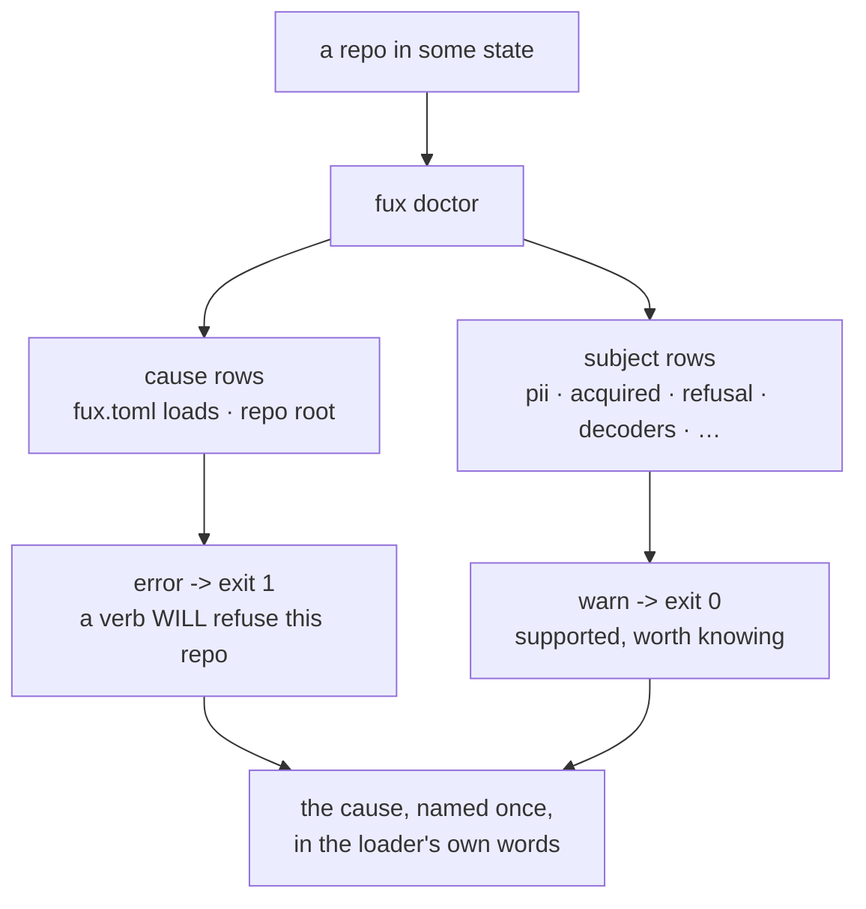

# SR-DOCTOR — the health command, and who owns its rows

## §1 — For humans

**`fux doctor` is the command someone runs when something is already wrong.**
That single sentence decides almost everything else about it: it is read-only,
it is offline, it never repairs, and it must be the most reliable verb in the
tool — because it is the one that runs *after* the others have failed.

🔴 **It was not read-only, and had not been** (W-140 row 7, fixed 2026-09-12).
On a repo with no `.fux/`, `fux doctor` created **`.fux/`** and
**`.fux/runtime/CACHEDIR.TAG`** — two causes, two modules apart:

- the `.fux/ writable` check `mkdir`'d the directory in order to probe it;
- `maintain/daemon.py`'s `_runtime()` path helper called `derived_dir`, which
  creates and tags, and `status()` reaches it **on a pure read**. `runner.py`
  and `urlstate.py` had the same helper right — a path helper returns a path.

**Both fixed, and the writability question is still answered**: the probe goes
to `.fux/` when it exists and to the repo root when it does not, which is the
directory that would actually have to be written. Pinned by
`tests/test_doctor.py::test_doctor_creates_nothing_at_all`, which asserts on the
**whole tree** rather than on the two paths this session happened to find —
the second cause was two modules from the check that exposed it.

**This record exists because fifteen checks had thirteen owners.** Each check
reports on some other record's subject — PII rules, the acquired plane, refusal
rules, decoder bindings, the recency prior — so `src/fux/doctor.py` accumulated
seven `describes` rows on top of its owner. `describes` is **file-scoped** and
those descriptions are **function-scoped**, so any change to any check demanded
all eight records. A carve-out is what that calls for
([SR-WORK-OWNERSHIP](0054_WORK-ownership.md) decision 6: *if a record's subject IS a
file, own it*), and this record is it.

**What moved here is the check contract, not the subjects.** SR-PII still
decides what a PII rule means; this record decides what `pii rules` prints, at
what level, and what happens when it cannot run.



<details>
<summary><b>ASCII twin</b> — the same diagram, for terminals, diffs, and any reader without a Mermaid renderer</summary>

```text
   a repo in some state
            |
            v
       fux doctor
        /        \
   CAUSE rows    SUBJECT rows
   fux.toml      pii . acquired . refusal
   loads         decoders . recency . ...
   repo root          |
        |             |
     error          warn
   exit 1           exit 0
   "a verb WILL     "supported,
    refuse this      worth
    repo"            knowing"
        \             /
         v           v
     the cause, named ONCE,
     in the loader's own words

  It never repairs. Naming the fix IS the product.
```

</details>

### Examples

```console
$ fux doctor
[OK] python version: 3.11, fux 2.0.0-alpha.7
[OK] repo root: /root/fuxlab/demo
[OK] fux.toml loads: fux.toml
[OK] .fux/ writable: /root/fuxlab/demo/.fux
[OK] index not gitignored: the committed index is tracked
[OK] .fux/ layout declared: every entry is declared
[WARN] accelerator: not built - `ask` uses the reference scan; run `fux build` for the fast path
# exit 0
```

---

## §2 — For agents

### Context

- **Fifteen checks, thirteen owning subjects.** `doctor.py` reports on almost
  every plane fux has. Under the ownership table's one-record-per-component
  rule it belonged to SR-DOTFUX (the `.fux/` layout assertions came first),
  and every other record that gained a row took a `describes` row instead.
- 🔴 **That made the freshness gate unusable on this file.** `describes` is
  file-scoped; the seven descriptions were each one function. Adding a row
  demanded SR-DOTFUX **and** SR-PII, SR-ACQUIRED, SR-REFUSAL, SR-DECODE,
  SR-URL-FRESHNESS, SR-INGEST and SR-ARCHIVED-CONTENT — none of whose
  subjects the change touched. It is the same defect that convicted `94231b2`
  on `config.py` (`records/RULE-SINCE`, the fifth entry), one file larger.
- **Ruled by Arpit, 2026-09-11:** *create a new adr for doctor* — over the
  three alternatives that were on the table (touch every describer, key-scope
  `describes`, or use the `no SR affected` hatch on a change that plainly did
  affect records).

### Decision

**1. This record owns `src/fux/doctor.py`, and the seven `describes` rows on it
are deleted.** Not narrowed, not annotated — removed, because they now describe
a component their own owner claims, which is
[SR-WORK-OWNERSHIP](0054_WORK-ownership.md) veto 2 by construction.

- ⚠ **The cost is real and is stated rather than buried.** Those rows existed so
  that changing `_pii_health` opened SR-PII. **It no longer does.** What
  replaces it is decision 2's register: every check names the record whose
  subject it reports, so the obligation is *readable* where it used to be
  *enforced*. **That is strictly weaker**, and it is the price of a gate that
  fires on the right change instead of on every change.
- **When it is worth restoring, restore it key-scoped, not file-scoped.** The
  relation that would work here is *record R describes function F*, which the
  describes table cannot express today.

**2. The check register — every row, its level, and whose subject it reports.**
This table is what the deleted `describes` rows were for. The *subject* record
is authoritative about what the thing being checked means; **this record is
authoritative about the row.**

| check | level | reports on | subject record |
|---|---|---|---|
| `python version` | error | the interpreter against `PY_MIN` | [SR-LAWS](0001_LAWS.md) (L7) |
| `repo root` | error | `find_root` — is this a fux repo at all | [SR-DOTFUX](0102_fux-directory.md) |
| `fux.toml loads` | **error** | does the loader accept the config (decision 4) | [SR-CONFIG](0113_config.md) |
| `.fux/ writable` | error | the directory can be created and written | [SR-DOTFUX](0102_fux-directory.md) |
| `index not gitignored` | error | a `.fux/*` blanket silently eating the committed index | [SR-DOTFUX](0102_fux-directory.md) |
| `.fux/ layout declared` | warn | undeclared entries at `.fux/`'s top level | [SR-DOTFUX](0102_fux-directory.md) |
| `pii rules` | **error** when absent | a missing `.fux/pii.toml`; otherwise compiles every pattern offline and states the scope. ⚠ It cannot see an over-broad rule and says so — only [`tools/pii-probe/`](../tools/pii-probe/) can | [SR-PII](0148_pii.md) decision 17 |
| `acquired plane` | warn, **error** on gitignore | blob count, total bytes, the 80 %-of-cap warning, and the gitignore assertion | [SR-ACQUIRED](0145_acquired-plane.md) |
| `refusal rules` | warn, **error** when the file will not parse | how many rules load, how many responses each has refused, and **the rules that have never fired** — what a typo'd condition looks like | [SR-REFUSAL](0146_refusals.md) decision 11 |
| `decoder bindings` | warn, **error** when the registry will not build | the one binding fault no ingest can catch: a `[decoders]` binding on an extension **no indexed document has** | [SR-DECODE](0139_decode.md) |
| `recency prior` | warn | whether any document carries an `mtime` — a corpus copied out of its git repository loses every one | [SR-INGEST](0106_ingest.md) |
| `freshness verdicts` | warn | `freshness_counts` and `AS_INGESTED_VETO_SHARE` — the veto instrument, shared verbatim with SR-ACQUIRED's identical one so the quarter has one home | [SR-URL-FRESHNESS](0147_url-freshness.md) |
| `ranking priors` | warn | every prior that is wired, reads its input and multiplies by one — **and the count of documents it would have acted on**. It refuses to recommend a value | [SR-ARCHIVED-CONTENT](0134_archived-content.md) · [SR-TUNE](0135_tuning.md) |
| `output.toml present` | warn | absent means every output default is the engine's own and none can be changed | [SR-OUTPUT](0143_output-defaults.md) decision 20 |
| `types list usable` | error | a types list with no live pattern — `read_types` refuses it, so ingest stops | [SR-TYPES](0128_types-list.md) decision 10 |
| `fuxignore usable` | warn, **error** when the patterns will not parse | the `.fuxignore` patterns parse, and duplicates | [SR-FUXIGNORE](0144_fuxignore.md) |
| `fetcher optional functions` | warn | which of `validate()` / `is_rate_limited()` the consumer's fetcher implements — **read as text, never imported** | [SR-FETCHER](0117_fetcher.md) decisions 12–13 |
| `url sources` | warn | per-URL health from the committed index, **the listed URLs that have never been fetched and so have no record at all** (SR-MAINTENANCE decision 5a's stated cost, built 2026-09-12), the concurrency policy, and **the `update=never` count with the `keep=false` ones named** — a pinned URL is one `fux update` will never go out for again, which is otherwise learnable only by reading every line of the list | [SR-URL-LIST](0116_url-list.md) decisions 14/14b |
| `background runner` | warn | is a runner live, how many documents pend, is the lock held or stale, did the last run fail. **Read-only: a stale lock is named, never cleared** | [SR-MAINTENANCE](0129_hooks.md) decision 1c |
| `url daemon` | warn | the refresh daemon's state | [SR-URL-FRESHNESS](0147_url-freshness.md) |

⚠ **Three rows read *warn, **error** when …* and that split is deliberate**
(corrected here 2026-09-12, W-140 row 7, from the code). `refusal rules`,
`decoder bindings` and `fuxignore usable` are warnings about *content* — a rule
that never fired, a binding nothing matches, a duplicated pattern — and **errors
about parsing**. A policy file the engine cannot read is not a soft finding: the
next `fux ingest` will refuse it, and a green doctor in front of that is the
failure `tune.toml` taught (decision 10). The table said `warn` for all three.


| `accelerator` | warn | built, fresh or stale against the committed index | [SR-T1-ACCELERATOR](0110_accelerator.md) |
| `node reader` | warn | `.fux/node/`'s `package.json` version against the engine's, **its SHAPE, and whether that shape can actually RUN** (amended 2026-09-12, L10). **The one drift `doctor` can still see** under the fourth `.fux/` shape: the vendored bundle is overwritten on a version difference, so a repo whose owner has not run `setup` or `ingest` since upgrading ships a reader that may not understand the index beside it. Three things beyond the version, because the two shapes fail differently: a **stale `src/` tree** still sitting beside the bundle (fux's own source in a consumer's repository — it means `setup` has not run since the prune shipped), a **shape-C manifest with no `node_modules/.bin/fux`** resolving anywhere `.fux/fux` would look (decision 15's *half-configured is not a state*, observed rather than assumed away), and **which shape** it is at all. Never an error — Python answers without it | [SR-NODE-SEARCH](0153_node-search.md) |
| `fux on PATH` | warn | **which `fux` the shell resolves.** `npm i -g fux-engine` puts a second `fux` on PATH with a **different verb set**, so `fux ingest` can answer *"this only reads"* on a machine where Python fux would have worked. The row names the resolved path and points at `fux --version`, which is the one command that disambiguates. ⚠ **Read as text, never executed** — doctor does not run a binary the environment chose for it, which is the same rule the `fetcher optional functions` row follows. Deferred until 2026-09-12 on the premise *"no global bin ships in the first npm release"*; the bin shipped and Arpit ruled it stays, so the premise is gone. | [SR-NODE-SEARCH](0153_node-search.md) R1a |

**3. `warn` is the default; `error` is reserved for a repo a verb will refuse.**
A check fails the command **only** when some other fux command will not run
against this repo. Everything else — a supported-but-suboptimal configuration, a
missing accelerator, a fetcher without an optional function — is a warning.

- **The reason is not politeness, it is signal.** Reporting a correct,
  supported configuration as a failure trains people to ignore a red doctor, and
  a health command nobody reads is worse than no health command.
- **It is checkable:** for every `error` row, name the verb that exits 1. If you
  cannot, it is a `warn`.

**4. `fux.toml loads` — the loader's own message, verbatim, at error level.**

- 🔴 **Without it, `doctor` printed `[OK]` for a repo where every other verb
  exited 1.** A `fux.toml` the loader refuses — an unknown key, a missing
  `max_parallel`, malformed TOML — takes out `ingest`, `ask` and the rest, while
  `doctor` reported `fetcher optional functions: skipped (no readable fux.toml)`
  at warn and called the run green. **The one verb whose job is to name the fix
  was the one verb that did not name it.**
- **Verbatim is the decision.** The loader already names the key and the repair;
  a second wording of one failure is a restatement that drifts from the code
  enforcing it (L0). Nothing interpolates it — a `FuxError` may carry an em-dash
  and every other detail on this path is ASCII by invariant.
- **A missing `fux.toml` is a warning, not this check's failure.** `find_root`
  accepts a bare `.git` checkout, and a repo that has not run `fux setup` has
  nothing to refuse. Failing there would fire on every such repo.

**5. 🔴 A check that degrades to `skipped` must name the row that does fail.**
The general rule decision 4's defect produced, and it is not about config.

- **No check was wrong.** Each deferred — *an unreadable `fux.toml` is
  `_repo_root`'s business*, *`_config`'s finding to report* — under the sound
  rule that a health command must not raise twice for one cause.
- **The finding evaporated because every check that saw it deferred to a check
  that did not exist.** Correct per-check, unsound as a system property.
- **So: whenever a check degrades, name the row that fails. If none does, the
  degradation is a hole rather than politeness.**

**5a. A count of zero is a different finding from a value of zero, and the row
says which.** `ranking priors` reports every prior that is switched off **and the
count of documents it would have acted on**. When that count is **0** it adds
*"so changing this value would change NOTHING in this repository."*

- 🔴 **Because *switched off* and *unreachable* have different remedies.**
  Changing the value fixes the first and does nothing whatever about the second.
  The row printed the count from the start and left the reader to notice the
  zero — **and a reader did not, for two weeks.** A queue item asserted that the
  hand-graded playground could test `superseded_weight`; the corpus discusses
  supersession in **prose** and declares none of it, so the knob had nothing to
  act on. Measured 2026-09-11: three of the four priors returned **byte-identical
  results at every value, `0.0` included**
  ([the run](../work/regression/2026-09-11-four-priors-headroom/report.md)).
- **It states a fact and still recommends nothing.** *"0 documents, so this knob
  is inert here"* is derived from data the row already holds. *"0 documents, so
  set it to X"* is the recommendation this row refuses, and a test asserts the
  refusal survives.
- 🔴 **THREE OF THE FOUR LEFT THE ROW ON 2026-09-13** (SR-TUNE decision 15,
  Arpit) — `superseded_weight`, `archived_weight` and `recency_half_life_days`
  are removed, so there is no value left to disclose as switched off for any of
  them. The facts they read all still reach a caller, and `superseded` and
  `mtime` still reach ranking through SR-RANKING's declared tie-break, which is
  a fact and not a knob.
- ⚠ **The count clause loses its last subject with them.** `rerank_weight` is
  the survivor and is **not driven by a per-record declaration** — it acts on
  refer-plane passage proximity — so there is no count to print and the
  *"changing this would change NOTHING"* clause cannot fire today. **The clause
  stays in the code**, because it is the distinction, not the subject, that was
  worth building: the next prior that reads a record field gets it for free.
  The paragraphs above stand as the history that produced the removals.
- **This is decision 5's rule in a second costume**: a check that degrades to
  saying nothing must name what does fail. Here nothing degraded — the number was
  printed — and the **conclusion** was left unstated, which reads the same way to
  anyone who is not already looking for it.

**6. It never repairs, and naming the fix is the product.** `doctor` reports a
stale lock and prints the command that clears it; it does not clear it. Clearing
a lock whose owner is alive puts two runners inside `.fux/index/` at once, which
is the single failure the lock exists to prevent
([SR-MAINTENANCE](0129_hooks.md) decision 1c, veto 7).

**7. Offline, always — and it reads consumer code as TEXT.** `doctor` never
touches the network ([L4](0001_LAWS.md)), and it never imports a consumer's
fetcher or decoder: those files are free to open a session at module level, and
a capability check that ran the code would break the offline guarantee to answer
a question about the source.

**8. `--json` is not optional on this verb, and the runner check is a ROW, not
a verb.** `doctor` is where an agent asks whether the repo is healthy, and a
status an agent cannot parse is not a status for this product's audience.
Promotion to a `fux status` verb is a checkable condition, not a feeling — see
[SR-CLI](0101_cli-surface.md), which owns the verb surface and the promotion
rule.

**9. Every durable trace `doctor` reads is someone else's.** It writes one
thing: a `.doctor-probe` file it immediately unlinks, to answer *is `.fux/`
writable*. L8's gitignored-path rule is not reached because there is no record
of use to keep.

**10. The `tune.toml loads` row** (2026-09-11, W-140 row 13). A tune file that
does not parse left every `doctor` row green, and that is the worst possible
shape for **this** file specifically:

- **`fux ingest` reads only `[index]`** through `index_limits`, because a bad
  ranking knob must not fail an ingest or a hook
  ([SR-TUNE](0135_tuning.md) decision 13) — while `ask`, `find`, `answer`,
  `graph` and `path` all refuse. So the index is clean, every check says fine,
  and every query in the repo fails.
- **An error, not a warning**, unlike an absent `output.toml`. Absent means
  engine defaults, which is a legitimate repo; unparseable means a file
  somebody wrote that nothing reads, and the queries are already failing.
- **It calls `tune.load` and quotes what comes back**, the way the
  `fux.toml loads` row quotes the config loader. A second parser here would
  answer a question the real one does not ask — decision 6's *name the fix*
  with the fix's own words.

**The redaction note names an instrument the reader has** (W-140 row 18,
2026-09-11). It ended *see tools/pii-probe/* — a path that exists in the fux
repository and in no consumer's install. It names the `fux-pii` skill instead,
which `fux setup` wrote into their repo. See
[SR-PII](0148_pii.md) decision 20.

### Consequences

- ✅ **A change to one check opens two records, not eight** — this one, and the
  subject record if the check's *meaning* changed rather than its rendering.
- 🔴 **A change to `_pii_health` no longer mechanically opens SR-PII.** Decision
  1 names this as the price. The register above is the mitigation and it is a
  weaker one; a reviewer has to read it.
- ⚠ **The register is a table someone must maintain**, with the same property
  every such table has: nothing detects a missing row. A new check added without
  a row here is invisible, exactly as a missing `describes` row was.
- **SR-DOTFUX keeps `setup.py` and `store/fuxdir.py` and loses `doctor.py`.**
  Its decision 6 still names *a `doctor` check* as one of the two mechanisms for
  reaching an existing repo — that is a statement about the mechanism, not a
  claim of ownership, and it stands.

### Alternatives considered

| option | why not |
|---|---|
| **touch every describer with a pointer line** | honest, and it makes the gate's cost visible where it lands — but it repeats on every future commit to this file and puts gate noise in eight records that have nothing to say |
| **key-scope `describes`** | the real fix for the *relation*, and much the largest: the table becomes a key/function grid and the gate needs a parser that can say which functions a diff touched. Declined 2026-09-11; still the right answer if this recurs on a third file |
| **`no SR affected`** | false. The change updated five records. The hatch is a claim written into git history under a name, and using it for a gate's over-firing is exactly what would make it worthless |
| **leave `doctor.py` with SR-DOTFUX and accept the over-firing** | what was in force, and it convicted a commit that changed nothing any describer describes. The gate stops being read when it is right for the wrong reason |
| **one record per check** | fifteen records for one command, each too small to carry an argument, and the shared contract (decisions 3 and 5) would have no home |

### Reference (required)

- [`src/fux/doctor.py`](../src/fux/doctor.py) — every check in the register,
  and `_config_loads` for decision 4.
- [`tests/test_doctor.py`](../tests/test_doctor.py) —
  `test_a_fux_toml_the_loader_refuses_makes_doctor_red` pins decision 4 and
  `test_no_fux_toml_at_all_is_a_warning_not_a_failure` pins its boundary.
- [`records/RULE-SINCE`](RULE-SINCE) — the fifth entry, where the same
  file-scoped/key-scoped mismatch was ruled on for `config.py`.
- **Prior art:** `git fsck`, `brew doctor` and `flutter doctor` all share the
  property decision 6 states — they diagnose and name a repair, and do not
  perform one — and `brew doctor`'s documented drift into warning on supported
  configurations is the failure decision 3 is written against.
  <https://docs.brew.sh/Manpage#doctor---debug-options>

### Veto condition

**Reopen this decision if:**

1. **`src/fux/doctor.py` gains a `describes` row.** The carve-out has been
   undone in practice: something reached into this file and declared it rather
   than putting its row in the register.
2. **A check in the code has no row in decision 2's register.** The mitigation
   for decision 1's cost has stopped being maintained, and the obligation the
   deleted `describes` rows carried is now recorded nowhere.
3. **An `error`-level row exists for which no verb exits 1.** Decision 3 has
   drifted, and the next person to ignore a red doctor will be right to.
4. **A third file trips the file-scoped `describes` over-firing.** Two carve-outs
   is a pattern; the answer then is key-scoping the relation, not a third record.

**How to check it:**

```console
$ grep -c 'src/fux/doctor.py' records/README.md
1                                  # 2026-09-11 — the ownership row only; veto 1 not fired

$ grep -oE 'Check\("[a-z. /]+"' src/fux/doctor.py | sort -u | wc -l
15                                 # every one has a register row; veto 2 not fired
```

---

## References

*Every source this record cites, gathered in one place. §2's **Reference
(required)** names the grounding; this is the complete list. An archived
document is never listed here — the body may name one, but archive is not
evidence.*

**Records** — [SR-LAWS](0001_LAWS.md) · [SR-CLI](0101_cli-surface.md) ·
[SR-DOTFUX](0102_fux-directory.md) · [SR-INGEST](0106_ingest.md) ·
[SR-T1-ACCELERATOR](0110_accelerator.md) · [SR-CONFIG](0113_config.md) ·
[SR-URL-LIST](0116_url-list.md) · [SR-FETCHER](0117_fetcher.md) ·
[SR-FUXIGNORE](0144_fuxignore.md) · [SR-TYPES](0128_types-list.md) ·
[SR-MAINTENANCE](0129_hooks.md) ·
[SR-ARCHIVED-CONTENT](0134_archived-content.md) · [SR-TUNE](0135_tuning.md) ·
[SR-DECODE](0139_decode.md) · [SR-OUTPUT](0143_output-defaults.md) ·
[SR-WORK-OWNERSHIP](0054_WORK-ownership.md) ·
[SR-ACQUIRED](0145_acquired-plane.md) · [SR-REFUSAL](0146_refusals.md) ·
[SR-URL-FRESHNESS](0147_url-freshness.md) · [SR-PII](0148_pii.md)

**Code**

- [`src/fux/doctor.py`](../src/fux/doctor.py)
- [`tests/test_doctor.py`](../tests/test_doctor.py)
- [`tools/pii-probe/`](../tools/pii-probe/)

**Project docs**

- [`records/RULE-SINCE`](RULE-SINCE)
- [`records/README.md`](README.md) — the ownership and describes tables

**Papers and specifications**

- Homebrew, *`brew doctor`* — a diagnose-never-repair health command, and the
  documented drift into warning on supported configurations that decision 3
  guards against.
  <https://docs.brew.sh/Manpage#doctor---debug-options>
